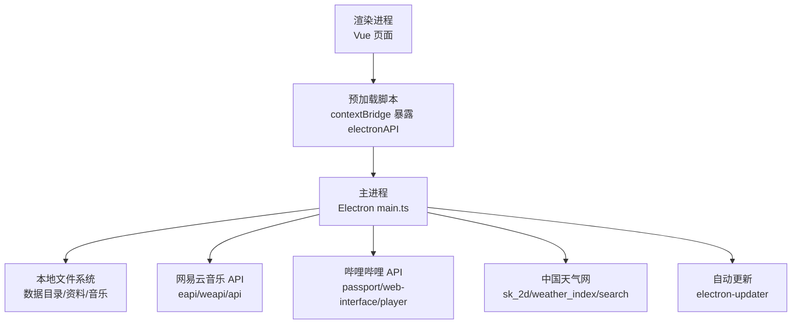
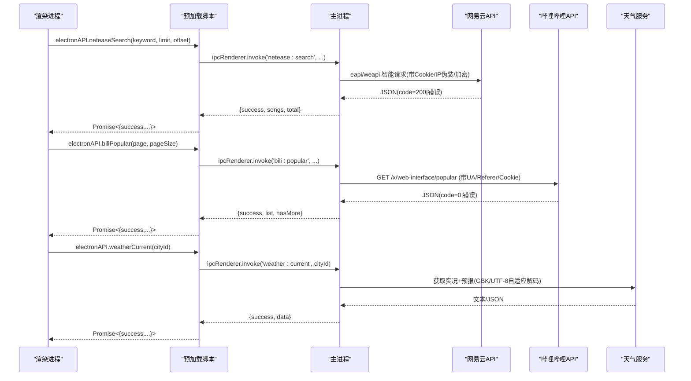
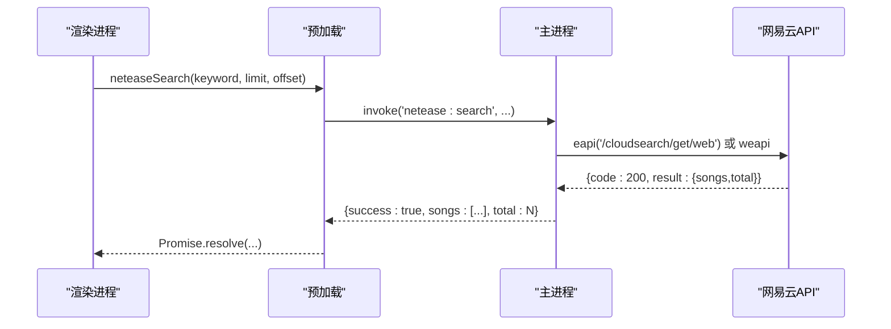
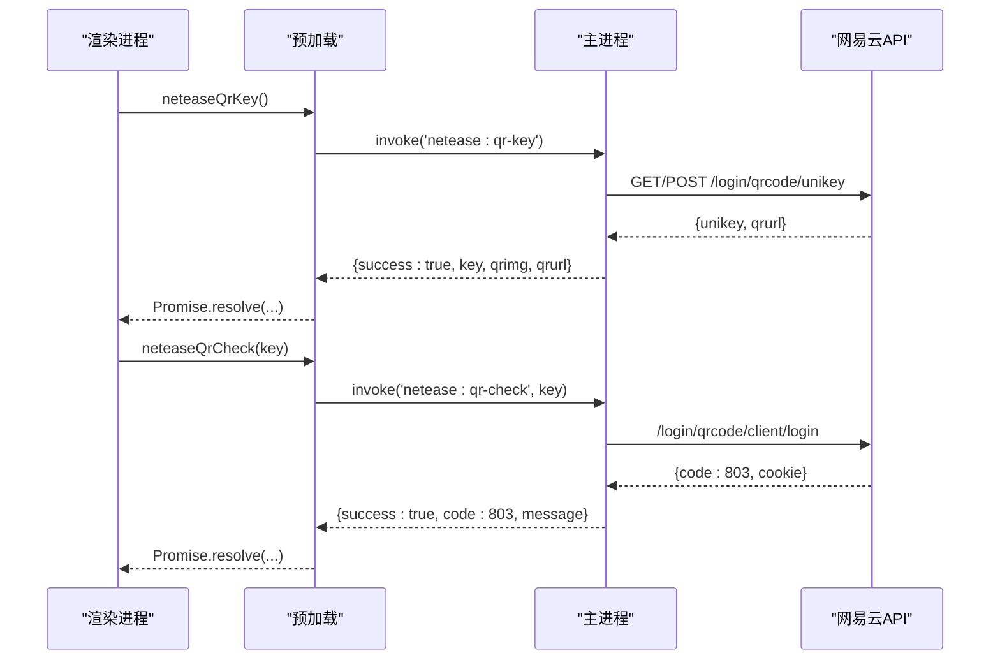
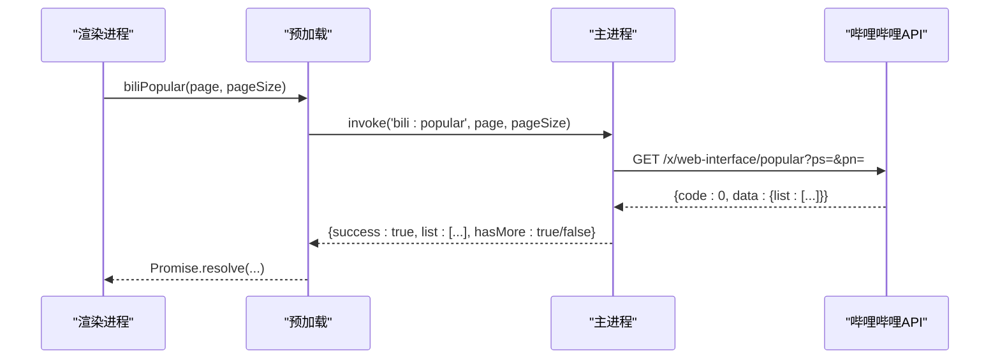
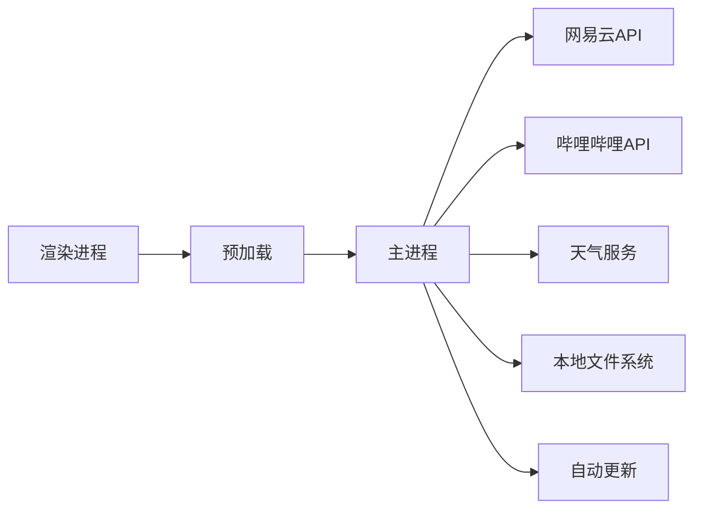

# API参考文档

<cite>
**本文引用的文件**
- [src/main/main.ts](file://src/main/main.ts)
- [src/preload/preload.ts](file://src/preload/preload.ts)
- [src/renderer/src/vite-env.d.ts](file://src/renderer/src/vite-env.d.ts)
- [package.json](file://package.json)
- [README.md](file://README.md)
</cite>

## 目录
1. [简介](#简介)
2. [项目结构](#项目结构)
3. [核心组件](#核心组件)
4. [架构总览](#架构总览)
5. [详细组件分析](#详细组件分析)
6. [依赖关系分析](#依赖关系分析)
7. [性能与最佳实践](#性能与最佳实践)
8. [故障排查指南](#故障排查指南)
9. [版本兼容性与迁移指南](#版本兼容性与迁移指南)
10. [结论](#结论)

## 简介
本API参考文档面向集成方与开发者，系统化说明本应用暴露的所有IPC接口（主进程与渲染进程之间），包括方法签名、参数类型、返回值格式与错误处理；并提供外部服务集成的调用方法与认证流程，如网易云音乐API、哔哩哔哩API。同时给出配置选项说明、请求/响应示例、错误码说明、版本兼容性建议以及性能优化与最佳实践。

## 项目结构
本项目基于 Electron 28 + Vue 3 + TypeScript，采用主进程（main）提供系统能力与网络代理，预加载脚本（preload）通过 contextBridge 暴露安全API给渲染进程（renderer）。所有对外部服务的HTTP调用均集中在主进程，避免跨域与风控问题。

图表来源
- [src/main/main.ts:1-120](file://src/main/main.ts#L1-L120)
- [src/preload/preload.ts:1-98](file://src/preload/preload.ts#L1-L98)

章节来源
- [README.md:111-130](file://README.md#L111-L130)
- [package.json:1-20](file://package.json#L1-L20)

## 核心组件
- IPC 通道：由 preload 统一暴露，渲染进程通过 window.electronAPI.* 调用。
- 协议服务：kaoyan-bg、kaoyan-music、kaoyan-data、kaoyan-material、kaoyan-assets，用于本地资源流式访问。
- 外部服务代理：网易云音乐、哔哩哔哩、中国天气网，全部在主进程发起并返回标准化结果。
- 自动更新：基于 electron-updater，事件通过 IPC 推送至渲染进程。

章节来源
- [src/preload/preload.ts:3-97](file://src/preload/preload.ts#L3-L97)
- [src/main/main.ts:183-200](file://src/main/main.ts#L183-L200)
- [src/main/main.ts:393-658](file://src/main/main.ts#L393-L658)

## 架构总览
下图展示从渲染进程到外部服务的完整调用链路，包含认证、加密、降级策略与错误处理。

图表来源
- [src/main/main.ts:1334-1354](file://src/main/main.ts#L1334-L1354)
- [src/main/main.ts:2352-2362](file://src/main/main.ts#L2352-L2362)
- [src/main/main.ts:2532-2566](file://src/main/main.ts#L2532-L2566)

## 详细组件分析

### 一、窗口与系统控制
- 最小化/最大化/隐藏到托盘/全屏
- 打开外部链接
- 报告导出PDF

章节来源
- [src/preload/preload.ts:11-22](file://src/preload/preload.ts#L11-L22)
- [src/main/main.ts:672-700](file://src/main/main.ts#L672-L700)
- [src/main/main.ts:961-973](file://src/main/main.ts#L961-L973)

### 二、数据目录与备份
- 获取/设置/打开数据目录
- 同步数据到目录（JSON快照）
- 自动备份路径与迁移逻辑

章节来源
- [src/preload/preload.ts:86-90](file://src/preload/preload.ts#L86-L90)
- [src/main/main.ts:2592-2597](file://src/main/main.ts#L2592-L2597)
- [src/main/main.ts:19-81](file://src/main/main.ts#L19-L81)

### 三、本地资源协议
- kaoyan-bg：自定义背景图
- kaoyan-music：音乐文件夹内音频流式播放（支持Range）
- kaoyan-data：数据目录内JSON备份读取
- kaoyan-material：资料文件夹内文件（PDF/视频等，支持Range）
- kaoyan-assets：pdf.js静态资源（CMap/标准字体，回环HTTP或协议）

章节来源
- [src/main/main.ts:183-197](file://src/main/main.ts#L183-L197)
- [src/main/main.ts:398-615](file://src/main/main.ts#L398-L615)
- [src/main/main.ts:212-276](file://src/main/main.ts#L212-L276)

### 四、网易云音乐API（推荐优先使用 eapi，失败降级 weapi）
- 搜索歌曲
- 获取歌曲URL（支持音质等级）
- 歌词获取
- 二维码登录、状态检查、手机号登录、Cookie登录
- 用户歌单、歌单详情
- 评论列表、评论点赞
- 热搜、排行榜、榜单详情
- 用户详情、账号信息
- 喜欢/取消喜欢、喜欢状态查询、喜欢列表
- 心动模式
- 云盘歌曲

章节来源
- [src/main/main.ts:975-1332](file://src/main/main.ts#L975-L1332)
- [src/main/main.ts:1334-1401](file://src/main/main.ts#L1334-L1401)
- [src/main/main.ts:1403-1597](file://src/main/main.ts#L1403-L1597)
- [src/main/main.ts:1600-1891](file://src/main/main.ts#L1600-L1891)
- [src/main/main.ts:1893-2101](file://src/main/main.ts#L1893-L2101)

#### 典型调用序列（搜索）

图表来源
- [src/main/main.ts:1334-1354](file://src/main/main.ts#L1334-L1354)

#### 典型调用序列（二维码登录）

图表来源
- [src/main/main.ts:1403-1472](file://src/main/main.ts#L1403-L1472)

### 五、哔哩哔哩API（学习资料页集成）
- 二维码登录、状态检查、Cookie登录、退出登录
- 热门推荐、相关视频、搜索
- 收藏夹列表与内容
- 视频详情与播放地址（含清晰度映射）

章节来源
- [src/main/main.ts:2103-2399](file://src/main/main.ts#L2103-L2399)

#### 典型调用序列（热门视频）

图表来源
- [src/main/main.ts:2352-2362](file://src/main/main.ts#L2352-L2362)

### 六、天气服务（中国天气网）
- 实时天气（合并实况与今日预报）
- 城市搜索

章节来源
- [src/main/main.ts:2501-2590](file://src/main/main.ts#L2501-L2590)

### 七、自动更新
- 检查更新、下载更新、安装更新
- 事件订阅：available、not-available、progress、downloaded、error

章节来源
- [src/preload/preload.ts:15-19](file://src/preload/preload.ts#L15-L19)
- [src/main/main.ts:625-648](file://src/main/main.ts#L625-L648)

## 依赖关系分析
- 渲染进程仅通过 preload 暴露的 electronAPI 调用，不直接访问 Node/Electron 模块。
- 主进程集中管理 Cookie、加密、请求头、IP伪装、降级策略与错误处理。
- 外部服务依赖：
  - 网易云：eapi/weapi/api，需完整Cookie与设备标识，失败时自动降级。
  - 哔哩哔哩：web-interface/passport/player，需UA/Referer/Cookie，CDN请求头注入。
  - 天气：中国天气网，GBK/UTF-8自适应解码。

图表来源
- [src/main/main.ts:975-1332](file://src/main/main.ts#L975-L1332)
- [src/main/main.ts:2103-2399](file://src/main/main.ts#L2103-L2399)
- [src/main/main.ts:2501-2590](file://src/main/main.ts#L2501-L2590)

章节来源
- [src/preload/preload.ts:3-97](file://src/preload/preload.ts#L3-L97)
- [src/main/main.ts:1-120](file://src/main/main.ts#L1-L120)

## 性能与最佳实践
- 流式读取大文件：音乐与资料协议使用 ReadableStream + Range 请求，避免内存峰值。
- 智能降级：网易云API优先eapi，失败自动降级weapi，提高成功率。
- Cookie持久化：网易云与哔哩哔哩Cookie落盘，减少重复登录成本。
- CDN请求头注入：哔哩哔哩播放流强制注入Referer/UA，绕过防盗链。
- 编码自适应：天气服务根据响应头与内容检测GBK/UTF-8，避免乱码。
- 缓存与节流：天气数据本地缓存30分钟，每小时自动刷新。
- 白名单与校验：资料/音乐协议严格限制根目录与扩展名，防止路径穿越。

[本节为通用指导，无需具体文件引用]

## 故障排查指南
- 网易云API常见错误
  - code非200：检查Cookie是否完整（_ntes_nuid、WNMCID、deviceId等），确认IP伪装与UA。
  - 460 cheating：尝试切换X-Real-IP/X-Forwarded-For，或等待一段时间重试。
  - 登录失败：二维码key获取失败时，尝试GET/POST两种形式；检查在线二维码服务可达性。
- 哔哩哔哩API常见错误
  - -412风控：确保buvid3/buvid4存在，必要时先调用finger/spi补领。
  - 播放失败：确认CDN域名已注入Referer/UA，且SESSDATA有效。
- 天气服务
  - 乱码：主进程已做GBK/UTF-8自适应，若仍异常请检查网络节点与响应头。
  - 解析失败：确认cityId格式正确（5-12位数字）。
- 本地协议
  - 403/404：检查token是否有效、文件是否在白名单根目录下、扩展名是否允许。

章节来源
- [src/main/main.ts:1210-1282](file://src/main/main.ts#L1210-L1282)
- [src/main/main.ts:2153-2183](file://src/main/main.ts#L2153-L2183)
- [src/main/main.ts:2510-2529](file://src/main/main.ts#L2510-L2529)
- [src/main/main.ts:407-615](file://src/main/main.ts#L407-L615)

## 版本兼容性与迁移指南
- 当前版本：3.5.3（见 package.json）
- 主要变更要点
  - v3.1.3：网易云API重构，eapi优先，weapi降级；完善Cookie构建与设备标识。
  - v3.2.0：评论点赞接口修正；喜欢状态检查兼容多种响应格式。
  - v3.2.1：喜欢列表一次性拉取用户已喜欢歌曲ID，提升前端判断效率。
  - v3.2.2：云盘歌曲列表分页加载。
  - v3.5.3：哔哩哔哩集成（登录/收藏/搜索/推荐/播放），CDN请求头注入。
  - v3.5.2：pdf.js静态资源回环HTTP服务基址，解决离线中文PDF渲染问题。
- 迁移建议
  - 升级网易云API调用：确保Cookie字段齐全，关注code=200判定。
  - 哔哩哔哩：首次搜索前确保buvid3/buvid4存在，必要时触发finger/spi。
  - 天气：保持cityId为国内编码，注意GBK/UTF-8自适应已内置。
  - 本地协议：继续使用token方式访问，避免直接拼接绝对路径。

章节来源
- [package.json:1-10](file://package.json#L1-L10)
- [src/main/main.ts:975-1332](file://src/main/main.ts#L975-L1332)
- [src/main/main.ts:2103-2399](file://src/main/main.ts#L2103-L2399)
- [src/main/main.ts:212-276](file://src/main/main.ts#L212-L276)

## 结论
本应用通过主进程集中封装外部服务与本地资源访问，提供稳定、安全、高性能的IPC接口。集成方只需调用 preload 暴露的 electronAPI，即可实现网易云音乐、哔哩哔哩与中国天气网的完整功能。遵循本文档的调用规范、错误处理与性能建议，可获得更稳定的集成体验。