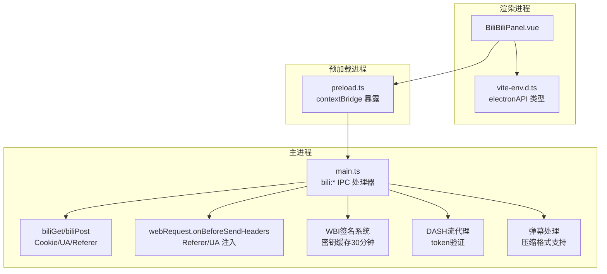
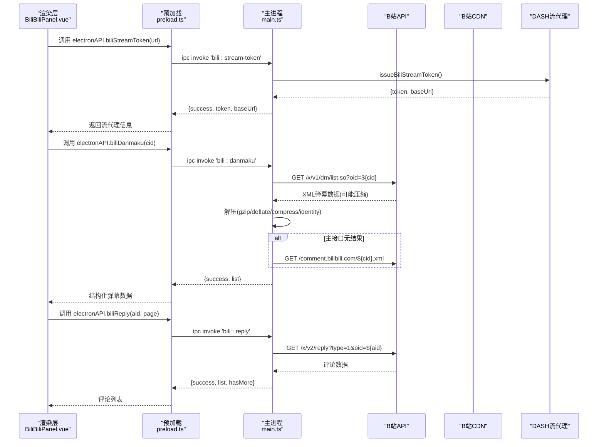
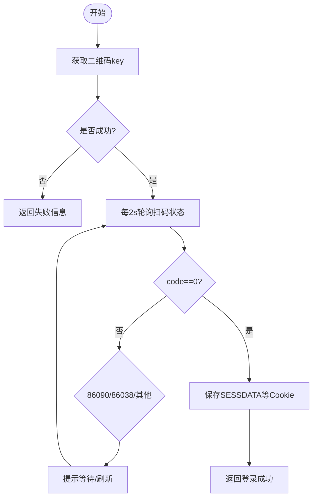
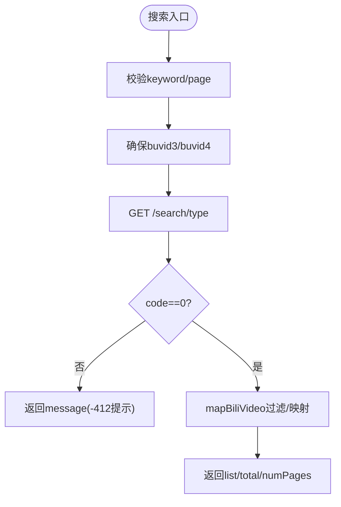
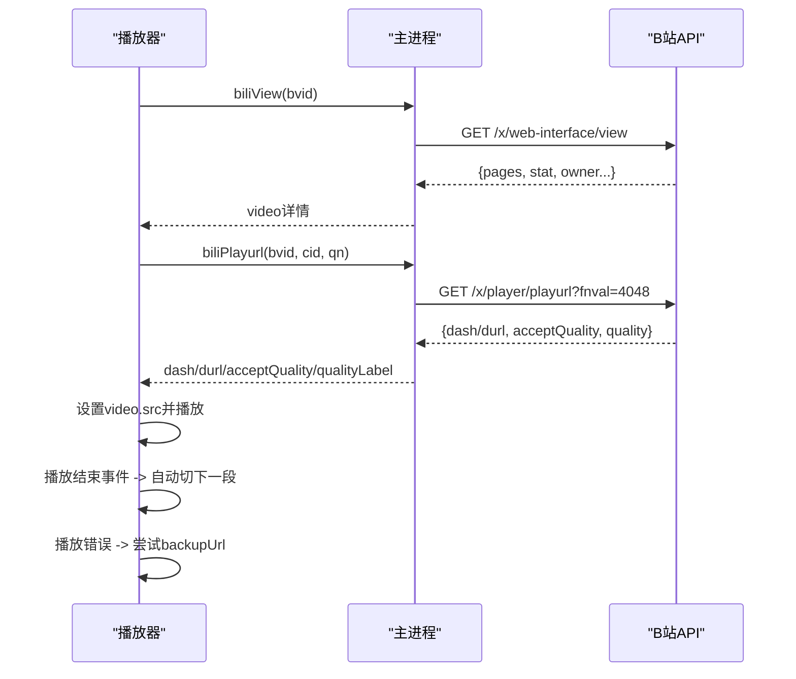
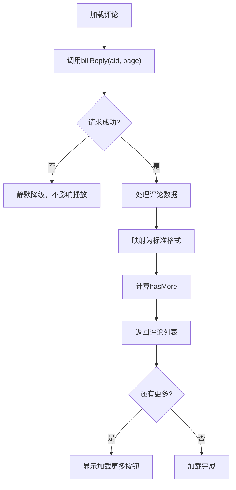
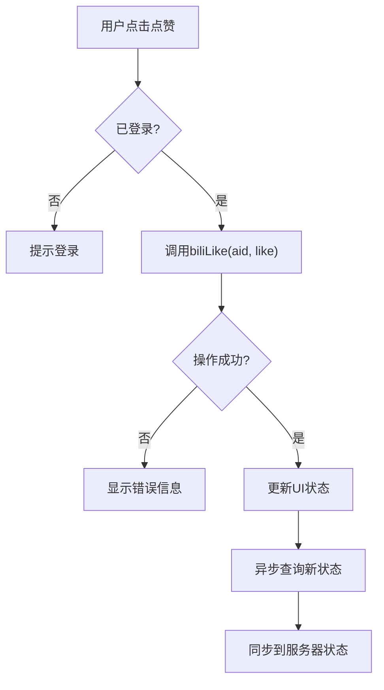
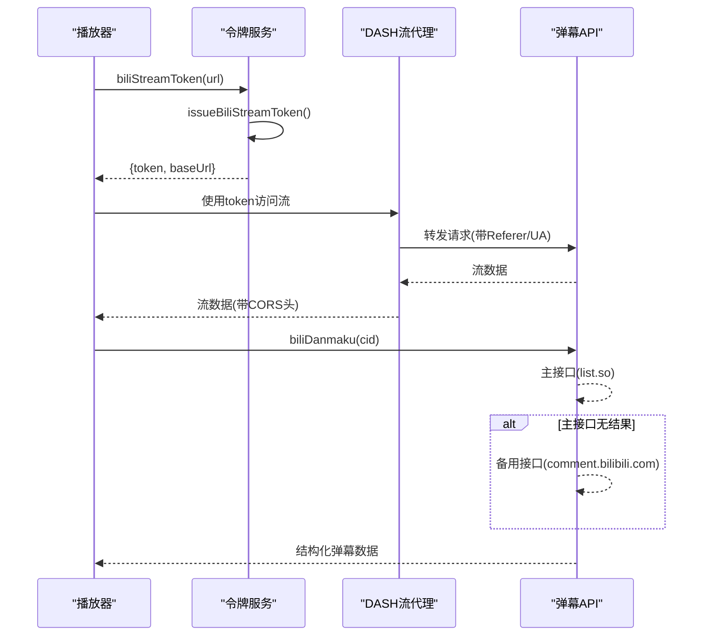
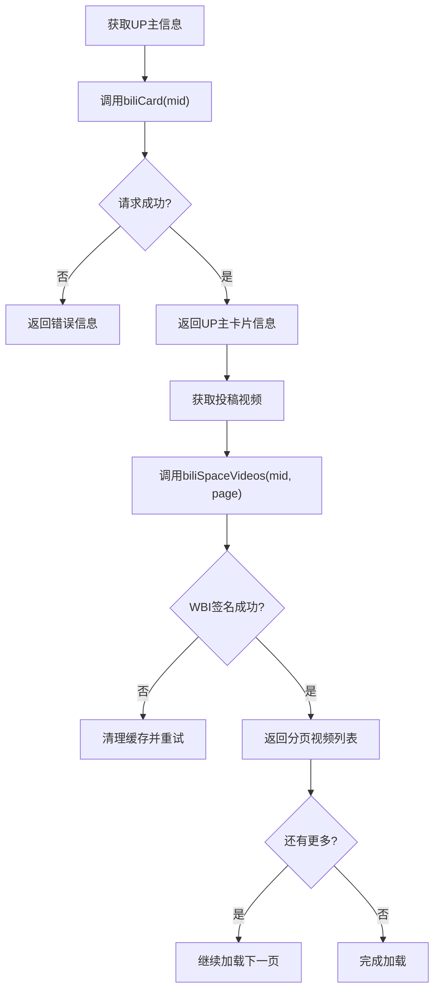
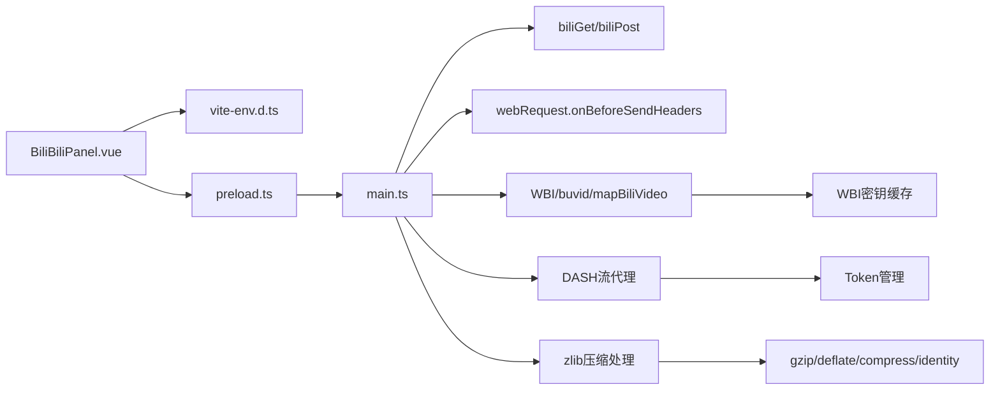

# B站集成接口

<cite>
**本文引用的文件**
- [src/main/main.ts](file://src/main/main.ts)
- [src/preload/preload.ts](file://src/preload/preload.ts)
- [src/renderer/src/components/BiliBiliPanel.vue](file://src/renderer/src/components/BiliBiliPanel.vue)
- [src/renderer/src/vite-env.d.ts](file://src/renderer/src/vite-env.d.ts)
</cite>

## 更新摘要
**变更内容**
- **弹幕处理增强**：支持compress和identity压缩格式，提升弹幕加载兼容性
- **备用端点重试机制**：主接口无结果时自动回退到备用域名，确保弹幕数据获取
- **最大可见弹幕数调整**：从80条增加到200条，提供更丰富的弹幕体验
- **调试日志功能**：新增详细的错误处理和日志记录
- **收藏夹管理双数据结构支持**：兼容media_list/collection_list两种返回结构

## 目录
1. [简介](#简介)
2. [项目结构](#项目结构)
3. [核心组件](#核心组件)
4. [架构总览](#架构总览)
5. [详细组件分析](#详细组件分析)
6. [依赖关系分析](#依赖关系分析)
7. [性能与限流](#性能与限流)
8. [故障排查指南](#故障排查指南)
9. [结论](#结论)
10. [附录：API签名与数据格式](#附录api签名与数据格式)

## 简介
本文件为"考研助手"中哔哩哔哩（B站）集成的技术文档，覆盖用户认证、视频搜索、收藏夹管理、视频播放等能力。所有对外暴露的 IPC 方法均通过主进程代理访问 B 站 API，渲染层仅负责交互与展示。文档包含各接口的完整签名、参数校验、响应数据格式、错误处理机制，并提供登录流程、搜索与收藏管理的实现示例说明，以及限流与异常恢复策略。

**更新** 版本3.6.0增强了弹幕处理能力，支持更多压缩格式和备用端点重试机制，提升了弹幕加载的稳定性和兼容性。**版本3.5.4新增了完整的WBI签名系统和视频交互功能**，**版本3.5.5进一步增强了DASH流代理、弹幕显示、UP主信息和投稿视频分页功能**，**版本3.5.8新增评论区功能和DURL回退机制**。

## 项目结构
- 主进程（Electron Main）：实现所有 B 站相关 IPC 处理器、Cookie 管理、请求封装、CDN 防盗链注入等。
- 预加载脚本（Preload）：将主进程能力桥接到渲染进程，暴露 electronAPI。
- 渲染层（Renderer）：B 站面板 UI，调用 electronAPI 完成扫码登录、搜索、收藏、播放等功能。
- 类型声明：在 vite-env.d.ts 中定义 electronAPI 的类型契约，便于前端开发时获得类型提示。

**图表来源**
- [src/main/main.ts:2104-2311](file://src/main/main.ts#L2104-L2311)
- [src/preload/preload.ts:70-88](file://src/preload/preload.ts#L70-L88)
- [src/renderer/src/components/BiliBiliPanel.vue:338-722](file://src/renderer/src/components/BiliBiliPanel.vue#L338-L722)
- [src/renderer/src/vite-env.d.ts:203-231](file://src/renderer/src/vite-env.d.ts#L203-L231)

## 核心组件
- 认证模块：二维码生成与轮询、Cookie 粘贴登录、登录状态查询、退出登录。
- 内容模块：热门推荐、相关视频推荐、视频搜索。
- 收藏模块：收藏夹列表、收藏夹内容分页。
- 播放模块：视频详情、播放地址获取、分 P 切换、清晰度选择、多分段自动连播、备用 CDN 切换。
- 交互模块：**新增** 点赞、投币、收藏管理，支持实时状态同步。
- 推荐模块：**新增** 个性化推荐，使用WBI签名确保接口安全。
- **新增** 流媒体模块：DASH流代理、弹幕解析、UP主信息、投稿视频分页。
- **新增** 评论模块：视频评论区，支持热评优先和分页加载。
- **增强** 弹幕模块：支持compress和identity压缩格式，备用端点重试机制，最大可见弹幕数提升至200条。
- 辅助模块：WBI 签名、buvid 获取、统一视频卡片映射、时长格式化、清晰度标签映射。

**章节来源**
- [src/main/main.ts:2104-2311](file://src/main/main.ts#L2104-L2311)
- [src/main/main.ts:2315-2646](file://src/main/main.ts#L2315-L2646)
- [src/main/main.ts:2693-2802](file://src/main/main.ts#L2693-L2802)
- [src/renderer/src/components/BiliBiliPanel.vue:338-722](file://src/renderer/src/components/BiliBiliPanel.vue#L338-L722)

## 架构总览
渲染层通过 electronAPI 调用主进程的 bili:* IPC；主进程统一封装 HTTP 请求，附带 UA/Referer/Cookie，并持久化 Cookie；对媒体 CDN 请求注入 Referer/UA 以绕过防盗链；播放端采用 durl 合并流与备用 URL 自动切换。**新增** 的WBI签名系统为个性化推荐接口提供安全保障，**新增的DASH流代理支持高清晰度播放和弹幕功能**，**新增的评论区功能提供完整的视频互动体验**，**v3.6.0增强的弹幕处理支持多种压缩格式和备用端点重试**。

**图表来源**
- [src/main/main.ts:2693-2702](file://src/main/main.ts#L2693-L2702)
- [src/main/main.ts:2705-2739](file://src/main/main.ts#L2705-L2739)
- [src/main/main.ts:2322-2398](file://src/main/main.ts#L2322-L2398)
- [src/main/main.ts:2764-2785](file://src/main/main.ts#L2764-L2785)
- [src/preload/preload.ts:90-93](file://src/preload/preload.ts#L90-L93)

## 详细组件分析

### 认证模块（biliQrKey / biliQrCheck / biliLoginStatus / biliLogout / biliSetCookie）
- 职责
  - 生成登录二维码并轮询确认。
  - 支持 Cookie 粘贴登录并验证。
  - 查询当前登录态、退出登录。
- 关键逻辑
  - 二维码生成：调用 passport 接口获取 qrcode_key 与 url，使用在线服务生成图片。
  - 轮询：每 2 秒检查一次，code=0 表示登录成功，从跨域 URL 提取 SESSDATA 等凭证并持久化。
  - Cookie 登录：解析用户提供的 Cookie 字符串，写入内存并持久化，随后调用 nav 接口验证。
  - 登录态：调用 nav 接口判断 isLogin，返回用户基本信息。
  - 退出登录：清空本地 Cookie 并持久化。
- 参数与返回值
  - 详见附录"API签名与数据格式"。
- 错误处理
  - 网络异常或接口非 200：返回 success=false 与 message。
  - 二维码过期：code=86038，提示刷新。
  - 未扫码/已扫码待确认：分别提示等待或请手机确认。

**图表来源**
- [src/main/main.ts:2315-2350](file://src/main/main.ts#L2315-L2350)
- [src/main/main.ts:2357-2412](file://src/main/main.ts#L2357-L2412)

**章节来源**
- [src/main/main.ts:2315-2350](file://src/main/main.ts#L2315-L2350)
- [src/main/main.ts:2357-2412](file://src/main/main.ts#L2357-L2412)
- [src/renderer/src/components/BiliBiliPanel.vue:393-468](file://src/renderer/src/components/BiliBiliPanel.vue#L393-L468)

### 视频搜索（biliSearch）
- 职责
  - 执行关键词搜索，返回视频列表、总数与页数。
- 参数与校验
  - keyword：必填，非空字符串。
  - page：默认 1，页码小于 1 时不发起请求。
- 数据处理
  - 自动确保 buvid3/buvid4 存在，避免风控拦截。
  - 过滤无效结果，统一字段映射。
- 错误处理
  - code=-412 风控：提示稍后重试或先登录。
  - 其他错误：返回 message。

**图表来源**
- [src/main/main.ts:2441-2455](file://src/main/main.ts#L2441-2455)
- [src/main/main.ts:2154-2167](file://src/main/main.ts#L2154-L2167)
- [src/main/main.ts:2249-2267](file://src/main/main.ts#L2249-L2267)

**章节来源**
- [src/main/main.ts:2441-2455](file://src/main/main.ts#L2441-L2455)
- [src/main/main.ts:2154-2167](file://src/main/main.ts#L2154-L2167)
- [src/main/main.ts:2249-2267](file://src/main/main.ts#L2249-L2267)
- [src/renderer/src/components/BiliBiliPanel.vue:546-581](file://src/renderer/src/components/BiliBiliPanel.vue#L546-L581)

### 收藏夹管理（biliFavFolders / biliFavList / biliFavToggle）
- 职责
  - 获取当前用户创建的收藏夹列表。
  - 分页获取收藏夹内容，过滤失效资源。
  - 收藏/取消收藏操作，支持双数据结构兼容。
- 参数与校验
  - mediaId：收藏夹 ID，必填。
  - page：默认 1。
  - aid：视频ID，用于收藏操作。
- 数据处理
  - 优先从 Cookie 读取 DedeUserID，否则调用 nav 获取 mid。
  - 过滤 attr≠0/1 的资源（失效/删除）。
  - **v3.6.0新增**：收藏取消时兼容 media_list/collection_list 两种返回结构。
- 错误处理
  - 未登录：返回 message。
  - 接口错误：返回 message。

**章节来源**
- [src/main/main.ts:2460-2504](file://src/main/main.ts#L2460-L2504)
- [src/main/main.ts:2923-2953](file://src/main/main.ts#L2923-L2953)
- [src/renderer/src/components/BiliBiliPanel.vue:494-544](file://src/renderer/src/components/BiliBiliPanel.vue#L494-L544)

### 视频播放（biliView / biliPlayurl）
- 职责
  - 获取视频详情（分 P、简介、统计数据）。
  - 获取播放地址（durl 合并流），支持清晰度选择与备用 CDN。
- 参数与校验
  - bvid：视频 BV 号，必填。
  - cid：分 P 的 cid，必填。
  - qn：清晰度代码，默认 64。
  - **v3.6.0更新**：preferDurl 参数已废弃，始终走 fnval=4048 确保最高清晰度。
- 数据处理
  - 统一时长格式化、清晰度标签映射。
  - 返回 acceptQuality 供前端选择清晰度。
  - **v3.6.0更新**：取消 durl 回退，配额错误时渲染层降级清晰度重试。
- 错误处理
  - 无播放地址：提示版权受限或清晰度不足。
  - 网络错误：返回 message。

**图表来源**
- [src/main/main.ts:2509-2563](file://src/main/main.ts#L2509-L2563)
- [src/main/main.ts:2278-2283](file://src/main/main.ts#L2278-L2283)
- [src/main/main.ts:2638-2691](file://src/main/main.ts#L2638-L2691)
- [src/renderer/src/components/BiliBiliPanel.vue:610-693](file://src/renderer/src/components/BiliBiliPanel.vue#L610-L693)

**章节来源**
- [src/main/main.ts:2509-2563](file://src/main/main.ts#L2509-L2563)
- [src/main/main.ts:2638-2691](file://src/main/main.ts#L2638-L2691)
- [src/renderer/src/components/BiliBiliPanel.vue:610-693](file://src/renderer/src/components/BiliBiliPanel.vue#L610-L693)

### 热门推荐与相关视频（biliPopular / biliRelated）
- 职责
  - 获取热门视频列表（无需登录）。
  - 获取当前视频的相关推荐。
- 数据处理
  - 统一字段映射，兼容不同来源差异。
- 错误处理
  - 接口非 0：抛出错误并返回 message。

**章节来源**
- [src/main/main.ts:2417-2438](file://src/main/main.ts#L2417-L2438)
- [src/main/main.ts:2249-2267](file://src/main/main.ts#L2249-L2267)
- [src/renderer/src/components/BiliBiliPanel.vue:470-492](file://src/renderer/src/components/BiliBiliPanel.vue#L470-L492)

### **新增** 视频评论区（biliReply）
- 职责
  - 获取视频评论列表，支持热评优先和分页加载。
  - 为播放卡片右侧评论区提供数据支持。
- 关键特性
  - 热评优先：sort=2 时优先返回热门评论。
  - 分页加载：每页10条评论，支持加载更多。
  - 数据结构：统一评论条目格式，包含用户信息、评论内容、点赞数等。
- 参数与校验
  - oid：视频ID（aid），必填。
  - page：页码，默认1。
- 错误处理
  - 接口错误：返回 message。
  - 网络异常：静默降级，不影响播放体验。

**图表来源**
- [src/main/main.ts:2764-2785](file://src/main/main.ts#L2764-L2785)
- [src/renderer/src/components/BiliBiliPanel.vue:1224-1238](file://src/renderer/src/components/BiliBiliPanel.vue#L1224-L1238)

**章节来源**
- [src/main/main.ts:2764-2785](file://src/main/main.ts#L2764-L2785)
- [src/renderer/src/components/BiliBiliPanel.vue:1224-1238](file://src/renderer/src/components/BiliBiliPanel.vue#L1224-L1238)

### **新增** 个性化推荐与视频交互（biliRcmd / biliRelation / biliLike / biliCoin / biliFavToggle）
- 职责
  - 首页个性化推荐（WBI 签名）。
  - 查询用户对视频的交互状态（点赞/投币/收藏）。
  - 执行点赞、投币、收藏/取消收藏。
- 关键点
  - WBI 密钥缓存 30 分钟，异常时清理缓存并重试。
  - 交互类接口需 csrf=bili_jct，未登录直接拒绝。
  - 前端提供实时状态反馈和错误处理。
  - **v3.6.0更新**：收藏取消时兼容 media_list/collection_list 两种数据结构。
- 错误处理
  - WBI 密钥异常：清理缓存，返回 message。
  - 未登录：返回 message。
  - 操作失败：显示具体错误信息。

**图表来源**
- [src/main/main.ts:2601-2613](file://src/main/main.ts#L2601-L2613)
- [src/renderer/src/components/BiliBiliPanel.vue:822-837](file://src/renderer/src/components/BiliBiliPanel.vue#L822-L837)

**章节来源**
- [src/main/main.ts:2568-2646](file://src/main/main.ts#L2568-L2646)
- [src/main/main.ts:2211-2247](file://src/main/main.ts#L2211-L2247)
- [src/renderer/src/components/BiliBiliPanel.vue:800-879](file://src/renderer/src/components/BiliBiliPanel.vue#L800-L879)

### **增强** DASH流代理与弹幕功能（biliStreamToken / biliDanmaku）
- 职责
  - 为DASH流地址签发一次性代理token，支持高清晰度播放。
  - 获取并解析XML格式的弹幕数据，转换为结构化数组。
- 关键特性
  - Token有效期保护，防止滥用。
  - 支持Range请求，实现MSE断点续传。
  - 弹幕上限保护（4000条），避免内存压力。
  - XML实体解码，正确处理特殊字符。
  - **v3.6.0增强**：支持compress和identity压缩格式，提升兼容性。
  - **v3.6.0增强**：备用域名策略，主接口无结果时自动回退到旧版XML域名。
  - **v3.6.0增强**：最大可见弹幕数从80条增加到200条。
- 错误处理
  - 流代理服务未就绪：返回明确错误信息。
  - 无效的流地址：参数验证失败。
  - 弹幕解析失败：返回空列表和错误信息。

**图表来源**
- [src/main/main.ts:2693-2702](file://src/main/main.ts#L2693-L2702)
- [src/main/main.ts:2705-2739](file://src/main/main.ts#L2705-L2739)
- [src/main/main.ts:2322-2398](file://src/main/main.ts#L2322-L2398)

**章节来源**
- [src/main/main.ts:2693-2702](file://src/main/main.ts#L2693-L2702)
- [src/main/main.ts:2705-2739](file://src/main/main.ts#L2705-L2739)
- [src/main/main.ts:2322-2398](file://src/main/main.ts#L2322-L2398)

### **新增** UP主信息与投稿视频（biliCard / biliSpaceVideos）
- 职责
  - 获取UP主详细信息（头像、签名、粉丝数、投稿数）。
  - 分页获取UP主的投稿视频列表。
- 关键特性
  - 使用WBI签名确保接口安全。
  - 支持分页加载，每页12个视频。
  - 自动处理时间戳和时长格式化。
  - 过滤无效视频数据。
- 错误处理
  - WBI密钥异常：清理缓存并重试。
  - 风控拦截：提供友好提示信息。
  - 网络错误：返回明确的错误信息。

**图表来源**
- [src/main/main.ts:2753-2772](file://src/main/main.ts#L2753-L2772)
- [src/main/main.ts:2775-2802](file://src/main/main.ts#L2775-L2802)

**章节来源**
- [src/main/main.ts:2753-2772](file://src/main/main.ts#L2753-L2772)
- [src/main/main.ts:2775-2802](file://src/main/main.ts#L2775-L2802)

### **新增** WBI签名系统
- 职责
  - 为个性化推荐接口提供安全的签名机制。
  - 缓存WBI密钥减少重复请求。
  - 处理密钥轮换和异常情况。
- 关键特性
  - 密钥缓存30分钟，降低API调用频率。
  - 自动从nav接口获取最新 img_key/sub_key。
  - MD5签名算法确保请求完整性。
- 错误处理
  - 密钥获取失败：抛出明确错误信息。
  - 签名计算异常：记录日志并降级处理。

**章节来源**
- [src/main/main.ts:2211-2247](file://src/main/main.ts#L2211-L2247)
- [src/main/main.ts:2568-2586](file://src/main/main.ts#L2568-L2586)

## 依赖关系分析
- 渲染层依赖预加载层暴露的 electronAPI，类型由 vite-env.d.ts 约束。
- 预加载层依赖主进程 IPC 通道。
- 主进程依赖 Node.js fetch/net 进行 HTTP 请求，依赖 Electron session.webRequest 注入 CDN 请求头。
- 主进程内部依赖 Cookie 管理、WBI 签名、buvid 获取、视频卡片映射等工具函数。
- **新增** DASH流代理依赖HTTP服务器和token管理机制。
- **v3.6.0增强** 弹幕处理依赖zlib库支持多种压缩格式。

**图表来源**
- [src/renderer/src/components/BiliBiliPanel.vue:338-722](file://src/renderer/src/components/BiliBiliPanel.vue#L338-L722)
- [src/renderer/src/vite-env.d.ts:203-231](file://src/renderer/src/vite-env.d.ts#L203-L231)
- [src/preload/preload.ts:70-88](file://src/preload/preload.ts#L70-L88)
- [src/main/main.ts:2104-2311](file://src/main/main.ts#L2104-L2311)

**章节来源**
- [src/main/main.ts:2104-2311](file://src/main/main.ts#L2104-L2311)
- [src/preload/preload.ts:70-88](file://src/preload/preload.ts#L70-L88)
- [src/renderer/src/components/BiliBiliPanel.vue:338-722](file://src/renderer/src/components/BiliBiliPanel.vue#L338-L722)
- [src/renderer/src/vite-env.d.ts:203-231](file://src/renderer/src/vite-env.d.ts#L203-L231)

## 性能与限流
- 请求封装
  - 统一 UA/Referer/Cookie，减少重复配置开销。
  - 自动回收 Set-Cookie，避免手动维护。
- 防风控
  - 搜索前自动获取 buvid3/buvid4，降低 -412 风险。
  - 播放流通过 webRequest 注入 Referer/UA，绕过 CDN 防盗链。
- 播放优化
  - durl 合并流，多分段自动连播。
  - 备用 CDN 自动切换，提升稳定性。
  - **新增** DASH流代理支持高清晰度播放和MSE断点续传。
  - **v3.6.0更新**：取消 preferDurl 参数，始终使用 fnval=4048 确保最高清晰度。
- 限流与重试
  - 搜索与推荐接口建议在前端做节流与退避重试（例如指数退避）。
  - 二维码轮询固定 2 秒间隔，避免频繁请求。
  - **新增** WBI 密钥缓存 30 分钟，减少额外请求。
  - **新增** 交互操作添加忙状态锁，防止重复提交。
  - **v3.6.0增强**：弹幕加载限制4000条，避免DOM压力。
  - **v3.6.0增强**：Token机制限制流代理访问频率。
  - **v3.6.0增强**：评论加载静默降级，不影响播放体验。
  - **v3.6.0增强**：弹幕压缩格式支持，提升加载成功率。
  - **v3.6.0增强**：备用端点重试机制，确保弹幕数据获取。

## 故障排查指南
- 二维码登录失败
  - 检查网络连通性与二维码服务可用性。
  - 若 code=86038，提示刷新二维码。
- 搜索被风控（-412）
  - 确保已获取 buvid3/buvid4。
  - 建议登录后再进行搜索。
- 播放失败
  - 检查清晰度权限（未登录通常上限 480P）。
  - 触发 onVideoError 时自动尝试 backupUrl。
  - 确认主进程已安装 CDN 请求头注入。
  - **v3.6.0更新**：取消 durl 回退，配额错误时渲染层降级清晰度重试。
- 收藏/点赞/投币失败
  - 确认已登录且 bili_jct 存在。
  - 关注返回 message 中的具体错误原因。
  - **v3.6.0更新**：收藏取消时兼容 media_list/collection_list 两种数据结构。
- **新增** WBI签名错误
  - 检查网络连接是否正常。
  - 清除WBI密钥缓存后重试。
  - 查看控制台日志获取详细错误信息。
- **新增** DASH流代理问题
  - 检查流代理服务是否启动成功。
  - 确认token是否有效且未过期。
  - 验证目标URL格式是否正确。
- **增强** 弹幕加载失败
  - 检查CID参数是否正确。
  - 确认网络请求是否被防火墙阻止。
  - 查看XML解析是否有语法错误。
  - **v3.6.0增强**：主接口无结果时会自动回退到备用域名。
  - **v3.6.0增强**：支持compress和identity压缩格式，提升兼容性。
  - **v3.6.0增强**：最大可见弹幕数从80条增加到200条。
- **新增** 评论区加载失败
  - 检查视频ID参数是否正确。
  - 确认网络请求是否被阻止。
  - 评论加载失败会静默降级，不影响播放。

**章节来源**
- [src/main/main.ts:2154-2167](file://src/main/main.ts#L2154-L2167)
- [src/main/main.ts:2288-2311](file://src/main/main.ts#L2288-L2311)
- [src/main/main.ts:2538-2563](file://src/main/main.ts#L2538-L2563)
- [src/main/main.ts:2601-2646](file://src/main/main.ts#L2601-L2646)
- [src/main/main.ts:2693-2702](file://src/main/main.ts#L2693-L2702)
- [src/main/main.ts:2705-2739](file://src/main/main.ts#L2705-L2739)
- [src/main/main.ts:2764-2785](file://src/main/main.ts#L2764-L2785)
- [src/renderer/src/components/BiliBiliPanel.vue:682-693](file://src/renderer/src/components/BiliBiliPanel.vue#L682-L693)

## 结论
本项目通过主进程集中管理 B 站认证、内容获取与播放，有效规避了渲染层的跨域与风控问题，同时提供了良好的用户体验（扫码登录、搜索、收藏、播放）。通过统一的请求封装、Cookie 持久化、CDN 防盗链注入与备用 CDN 切换，提升了稳定性和可维护性。**版本3.5.4新增的WBI签名系统和视频交互功能**进一步完善了B站集成能力，**版本3.5.5进一步增强了DASH流代理、弹幕显示、UP主信息和投稿视频分页功能**，**版本3.5.8新增的评论区功能和DURL回退机制**为用户提供了更完整的视频互动体验和更稳定的播放保障，**版本3.6.0增强的弹幕处理能力**支持更多压缩格式和备用端点重试机制，显著提升了弹幕加载的稳定性和兼容性。建议在客户端侧增加更完善的限流与重试策略，以进一步提升鲁棒性。

## 附录：API签名与数据格式

### 认证
- biliQrKey
  - 入参：无
  - 出参：{ success, key?, qrimg?, qrurl?, message? }
  - 行为：获取二维码 key 与 url，生成二维码图片
- biliQrCheck
  - 入参：key
  - 出参：{ success, code?, message? }
  - 行为：轮询扫码状态，code=0 登录成功
- biliLoginStatus
  - 入参：无
  - 出参：{ success, loggedIn?, user?, message? }
  - 行为：查询登录态与用户信息
- biliLogout
  - 入参：无
  - 出参：{ success }
  - 行为：清空本地 Cookie
- biliSetCookie
  - 入参：cookie 字符串
  - 出参：{ success, loggedIn?, user?, message? }
  - 行为：解析并保存 Cookie，验证登录态

**章节来源**
- [src/main/main.ts:2315-2412](file://src/main/main.ts#L2315-L2412)
- [src/renderer/src/vite-env.d.ts:203-208](file://src/renderer/src/vite-env.d.ts#L203-L208)

### 内容
- biliPopular
  - 入参：page?, pageSize?
  - 出参：{ success, list?, hasMore?, message? }
  - 行为：获取热门视频
- biliRelated
  - 入参：bvid
  - 出参：{ success, list?, message? }
  - 行为：获取相关视频
- biliSearch
  - 入参：keyword, page?
  - 出参：{ success, list?, total?, numPages?, message? }
  - 行为：搜索视频，自动确保 buvid

**章节来源**
- [src/main/main.ts:2417-2455](file://src/main/main.ts#L2417-L2455)
- [src/renderer/src/vite-env.d.ts:209-212](file://src/renderer/src/vite-env.d.ts#L209-L212)

### 收藏
- biliFavFolders
  - 入参：无
  - 出参：{ success, folders?, message? }
  - 行为：获取收藏夹列表
- biliFavList
  - 入参：mediaId, page?
  - 出参：{ success, list?, hasMore?, message? }
  - 行为：分页获取收藏夹内容，过滤失效资源
- **v3.6.0更新** biliFavToggle
  - 入参：aid, mediaId, add
  - 出参：{ success, message? }
  - 行为：收藏/取消收藏，兼容 media_list/collection_list 两种数据结构

**章节来源**
- [src/main/main.ts:2460-2504](file://src/main/main.ts#L2460-L2504)
- [src/main/main.ts:2923-2953](file://src/main/main.ts#L2923-L2953)
- [src/renderer/src/vite-env.d.ts:212-213](file://src/renderer/src/vite-env.d.ts#L212-L213)

### 播放
- biliView
  - 入参：bvid
  - 出参：{ success, video?, message? }
  - 行为：获取视频详情（分 P、统计、作者）
- **v3.6.0更新** biliPlayurl
  - 入参：bvid, cid, qn?
  - 出参：{ success, mode?, quality?, qualityLabel?, acceptQuality?, dash?, durl?, message? }
  - 行为：获取播放地址（优先DASH，取消durl回退）

**章节来源**
- [src/main/main.ts:2509-2563](file://src/main/main.ts#L2509-L2563)
- [src/main/main.ts:2638-2691](file://src/main/main.ts#L2638-L2691)
- [src/renderer/src/vite-env.d.ts:214-231](file://src/renderer/src/vite-env.d.ts#L214-L231)

### **新增** 视频评论
- biliReply
  - 入参：oid（视频ID）, page?
  - 出参：{ success, list?, hasMore?, message? }
  - 行为：获取视频评论，支持热评优先和分页加载

**章节来源**
- [src/main/main.ts:2764-2785](file://src/main/main.ts#L2764-L2785)
- [src/renderer/src/vite-env.d.ts:261-262](file://src/renderer/src/vite-env.d.ts#L261-L262)

### **新增** 推荐与交互
- biliRcmd
  - 入参：pageSize?
  - 出参：{ success, list?, message? }
  - 行为：个性化推荐（WBI 签名）
- biliRelation
  - 入参：aid
  - 出参：{ success, like?, coin?, favorite?, message? }
  - 行为：查询交互状态
- biliLike
  - 入参：aid, like
  - 出参：{ success, message? }
  - 行为：点赞/取消点赞
- biliCoin
  - 入参：aid, multiply
  - 出参：{ success, message? }
  - 行为：投币
- biliFavToggle
  - 入参：aid, mediaId, add
  - 出参：{ success, message? }
  - 行为：收藏/取消收藏

**章节来源**
- [src/main/main.ts:2568-2646](file://src/main/main.ts#L2568-L2646)

### **增强** DASH流代理与弹幕
- biliStreamToken
  - 入参：url (DASH流地址)
  - 出参：{ success, token?, baseUrl?, message? }
  - 行为：为DASH流签发一次性代理token
- **v3.6.0增强** biliDanmaku
  - 入参：cid (视频分P的cid)
  - 出参：{ success, list?, message? }
  - 行为：获取并解析XML弹幕数据，支持compress/identity压缩格式，备用端点重试

**章节来源**
- [src/main/main.ts:2693-2739](file://src/main/main.ts#L2693-L2739)
- [src/renderer/src/vite-env.d.ts:254-255](file://src/renderer/src/vite-env.d.ts#L254-L255)

### **新增** UP主信息
- biliCard
  - 入参：mid (用户ID)
  - 出参：{ success, card?, message? }
  - 行为：获取UP主详细信息
- biliSpaceVideos
  - 入参：mid, page?
  - 出参：{ success, list?, hasMore?, message? }
  - 行为：分页获取UP主投稿视频

**章节来源**
- [src/main/main.ts:2753-2802](file://src/main/main.ts#L2753-L2802)
- [src/renderer/src/vite-env.d.ts:256-257](file://src/renderer/src/vite-env.d.ts#L256-L257)

### 实现示例（流程说明）
- 登录流程
  - 渲染层调用 biliQrKey 获取二维码，轮询 biliQrCheck，成功后刷新登录态。
  - 或通过 biliSetCookie 粘贴 Cookie 并验证。
- 搜索流程
  - 渲染层校验输入后调用 biliSearch，展示结果与分页。
- 收藏管理
  - 登录后调用 biliFavFolders 获取文件夹，选择后调用 biliFavList 分页加载。
  - **v3.6.0更新**：收藏取消时自动查询视频所在收藏夹，兼容多种数据结构。
- 播放流程
  - 点击视频调用 biliView 获取详情，再调用 biliPlayurl 获取 durl，设置 video.src 播放；播放结束自动切换下一段；出错尝试备用 URL。
  - **v3.6.0更新**：取消 preferDurl 参数，始终使用 fnval=4048 确保最高清晰度。
- **新增** 评论流程
  - 播放时异步加载评论数据，支持热评优先显示。
  - 分页加载更多评论，提供"加载更多"按钮。
  - 评论加载失败静默降级，不影响播放体验。
- **新增** 交互流程
  - 播放时异步查询交互状态（biliRelation）。
  - 用户点击点赞/投币/收藏按钮，调用相应API并更新UI状态。
  - 操作完成后重新查询状态以保持同步。
- **增强** DASH流播放流程
  - 获取DASH流地址后调用 biliStreamToken 获取代理token。
  - 使用token通过代理服务器访问流，支持高清晰度播放。
  - 调用 biliDanmaku 获取弹幕数据，按时间轴渲染。
  - **v3.6.0增强**：支持compress和identity压缩格式，主接口无结果时自动回退到备用域名。
  - **v3.6.0增强**：最大可见弹幕数从80条增加到200条。
- **新增** UP主信息流程
  - 获取UP主信息后调用 biliCard 显示详细信息。
  - 分页加载UP主投稿视频，支持无限滚动。

**章节来源**
- [src/renderer/src/components/BiliBiliPanel.vue:393-468](file://src/renderer/src/components/BiliBiliPanel.vue#L393-L468)
- [src/renderer/src/components/BiliBiliPanel.vue:546-581](file://src/renderer/src/components/BiliBiliPanel.vue#L546-L581)
- [src/renderer/src/components/BiliBiliPanel.vue:494-544](file://src/renderer/src/components/BiliBiliPanel.vue#L494-L544)
- [src/renderer/src/components/BiliBiliPanel.vue:610-693](file://src/renderer/src/components/BiliBiliPanel.vue#L610-L693)
- [src/renderer/src/components/BiliBiliPanel.vue:800-879](file://src/renderer/src/components/BiliBiliPanel.vue#L800-L879)
- [src/renderer/src/components/BiliBiliPanel.vue:1224-1238](file://src/renderer/src/components/BiliBiliPanel.vue#L1224-L1238)