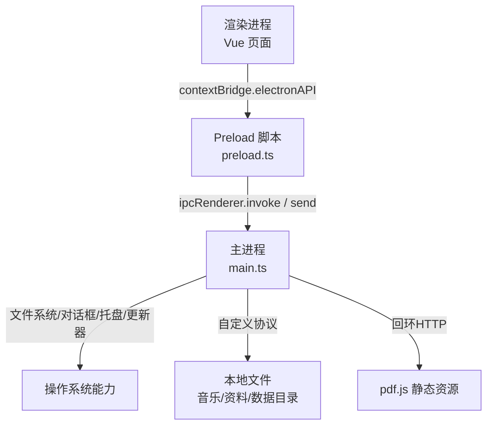
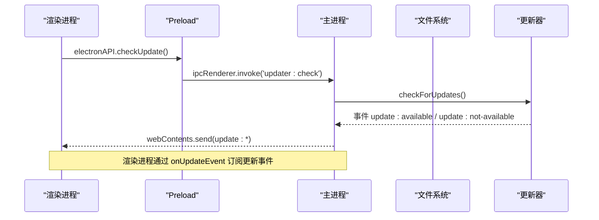
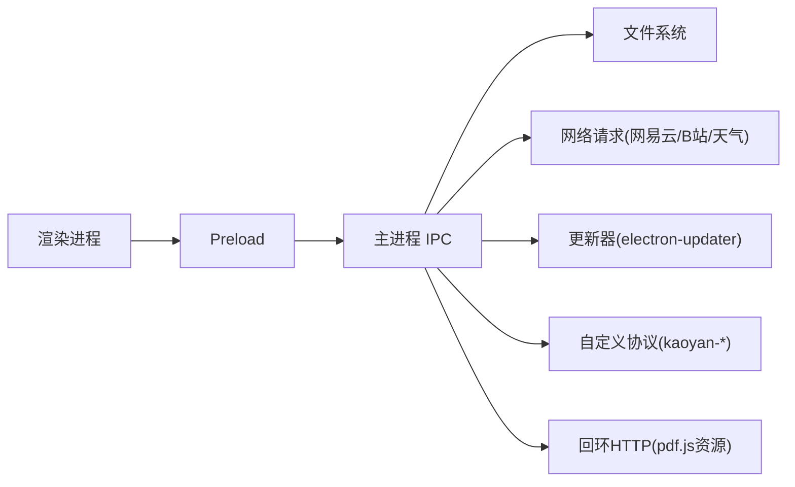

# IPC接口文档

<cite>
**本文引用的文件**
- [src/preload/preload.ts](file://src/preload/preload.ts)
- [src/main/main.ts](file://src/main/main.ts)
- [README.md](file://README.md)
</cite>

## 更新摘要
**变更内容**
- 移除了哔哩哔哩弹幕相关的所有IPC接口说明（bili:danmaku及相关功能）
- 更新了哔哩哔哩接口章节，仅保留当前支持的API
- 修正了版本兼容性说明，移除了弹幕功能相关的版本信息
- 保持了文档的整体结构和一致性

## 目录
1. [简介](#简介)
2. [项目结构](#项目结构)
3. [核心组件](#核心组件)
4. [架构总览](#架构总览)
5. [详细接口说明](#详细接口说明)
6. [依赖关系分析](#依赖关系分析)
7. [性能与可靠性](#性能与可靠性)
8. [故障排查指南](#故障排查指南)
9. [版本兼容性与迁移指南](#版本兼容性与迁移指南)
10. [结论](#结论)

## 简介
本文件为"考研助手"Electron应用的IPC接口完整文档，聚焦通过 preload.ts 暴露的 electronAPI 方法。内容覆盖：
- 窗口控制、数据导入导出、应用更新、文件操作（音乐/资料）、外部链接打开、天气查询、网易云音乐/B站代理接口、资源基址获取等
- 每个接口的调用签名、参数类型、返回值格式、错误处理机制
- 主进程与渲染进程的通信协议与数据传输格式
- 版本兼容性说明与迁移建议

## 项目结构
- 渲染进程通过 contextBridge 暴露 electronAPI，使用 ipcRenderer.invoke/send 与主进程通信
- 主进程在 main.ts 中统一注册所有 ipcMain.handle/on 处理器，实现业务逻辑与系统能力封装
- 自定义协议 kaoyan-music://、kaoyan-material://、kaoyan-data://、kaoyan-bg://、kaoyan-assets:// 用于安全访问本地资源
- 回环HTTP服务提供 pdf.js CMap/字体资源，解决离线/跨域问题

**图表来源**
- [src/preload/preload.ts:1-109](file://src/preload/preload.ts#L1-L109)
- [src/main/main.ts:183-276](file://src/main/main.ts#L183-L276)
- [src/main/main.ts:407-615](file://src/main/main.ts#L407-L615)

**章节来源**
- [src/preload/preload.ts:1-109](file://src/preload/preload.ts#L1-L109)
- [src/main/main.ts:183-276](file://src/main/main.ts#L183-L276)
- [README.md:111-130](file://README.md#L111-L130)

## 核心组件
- Preload 桥接层：将受限的渲染进程能力以安全的函数形式暴露给前端
- 主进程 IPC 处理器：集中管理窗口、文件、网络、更新、第三方API代理
- 资源协议与回环服务：保障本地媒体/资料/PDF资源的稳定读取与播放
- 自动更新通道：基于 electron-updater 的事件驱动更新流程

**章节来源**
- [src/preload/preload.ts:1-109](file://src/preload/preload.ts#L1-L109)
- [src/main/main.ts:625-648](file://src/main/main.ts#L625-L648)
- [src/main/main.ts:183-276](file://src/main/main.ts#L183-L276)

## 架构总览

**图表来源**
- [src/preload/preload.ts:15-18](file://src/preload/preload.ts#L15-L18)
- [src/preload/preload.ts:91-96](file://src/preload/preload.ts#L91-L96)
- [src/main/main.ts:625-648](file://src/main/main.ts#L625-L648)

## 详细接口说明

### 通用约定
- 调用方式
  - 请求型：electronAPI.xxx(...) → ipcRenderer.invoke(...)
  - 通知型：electronAPI.xxx(...) → ipcRenderer.send(...)（无返回）
- 返回值
  - 大多数接口返回对象 { success: boolean, ... }，success=false 时通常包含 message 字段描述错误
  - 部分接口返回具体业务数据（如文件列表、用户信息等）
- 错误处理
  - 主进程捕获异常并返回 { success: false, message: String(err) }
  - 渲染进程应始终检查 success 字段再消费数据

**章节来源**
- [src/main/main.ts:2688-2724](file://src/main/main.ts#L2688-L2724)
- [src/main/main.ts:2727-2739](file://src/main/main.ts#L2727-L2739)
- [src/main/main.ts:2742-2777](file://src/main/main.ts#L2742-L2777)

### 窗口控制
- windowMinimize()
  - 作用：最小化窗口
  - 参数：无
  - 返回：无
  - 错误：无
- windowToggleMaximize()
  - 作用：最大化/还原切换
  - 参数：无
  - 返回：无
- windowCloseToTray()
  - 作用：隐藏到托盘（非退出），首次隐藏显示提示气泡
  - 参数：无
  - 返回：无
- setFullscreen(on: boolean)
  - 作用：设置全屏模式
  - 参数：on 布尔值
  - 返回：无

**章节来源**
- [src/preload/preload.ts:11-14](file://src/preload/preload.ts#L11-L14)
- [src/preload/preload.ts:20-22](file://src/preload/preload.ts#L20-L22)
- [src/main/main.ts:672-699](file://src/main/main.ts#L672-L699)

### 数据导入导出
- exportData(data: string)
  - 作用：导出数据为JSON文件，默认固定路径 D:\下载\文档\11408kaoyan-helper；失败回退到用户文档目录
  - 参数：data JSON字符串
  - 返回：{ success: boolean, path?: string, fallback?: boolean }
  - 错误：写入失败时返回 message
- importData()
  - 作用：选择JSON文件并读取内容
  - 参数：无
  - 返回：{ success: boolean, data?: string }
  - 错误：取消或读取失败返回 success=false
- getDataDir()
  - 作用：获取当前数据目录
  - 参数：无
  - 返回：{ dir: string }
- setDataDir()
  - 作用：选择新数据目录并迁移背景图与自动备份
  - 参数：无
  - 返回：{ success: boolean, dir?: string, canceled?: boolean, message?: string }
- openDataDir()
  - 作用：在资源管理器中打开数据目录
  - 参数：无
  - 返回：{ success: boolean }
- syncDataToDir(json: string)
  - 作用：将全量数据快照写入数据目录下的自动备份文件
  - 参数：json 字符串
  - 返回：{ success: boolean, path?: string, message?: string }

**章节来源**
- [src/preload/preload.ts:3-5](file://src/preload/preload.ts#L3-L5)
- [src/preload/preload.ts:86-90](file://src/preload/preload.ts#L86-L90)
- [src/main/main.ts:2688-2724](file://src/main/main.ts#L2688-L2724)
- [src/main/main.ts:2594-2655](file://src/main/main.ts#L2594-L2655)

### 应用更新
- checkUpdate()
  - 作用：检测是否有新版本
  - 参数：无
  - 返回：{ success: boolean, version?: string | null, message?: string }
- downloadUpdate()
  - 作用：下载更新包
  - 参数：无
  - 返回：{ success: boolean, message?: string }
- installUpdate()
  - 作用：安装已下载的更新并退出应用
  - 参数：无
  - 返回：{ success: boolean }
- onUpdateEvent(cb: (channel: string, payload?: unknown) => void)
  - 作用：订阅更新事件通道
  - 参数：回调函数
  - 事件通道：update:available, update:not-available, update:progress, update:downloaded, update:error
  - 注意：需在合适时机移除监听以避免内存泄漏

**章节来源**
- [src/preload/preload.ts:15-18](file://src/preload/preload.ts#L15-L18)
- [src/preload/preload.ts:91-96](file://src/preload/preload.ts#L91-L96)
- [src/main/main.ts:2779-2804](file://src/main/main.ts#L2779-L2804)
- [src/main/main.ts:625-648](file://src/main/main.ts#L625-L648)

### 文件操作（音乐与资料）
- pickMusicFolder()
  - 作用：选择音乐文件夹，扫描支持扩展名的音频文件，仅返回相对路径清单
  - 返回：{ success: boolean, canceled: boolean, files: Array<{ name: string, url: string }> }
  - 说明：url 为 kaoyan-music://token 形式的私有协议地址，用于流式播放
- restoreMusicFolder()
  - 作用：恢复上次选择的音乐文件夹并重建文件清单
  - 返回：同 pickMusicFolder
- readLyric(trackName: string)
  - 作用：读取同名 .lrc 歌词文件
  - 参数：trackName 相对路径（不含扩展名）
  - 返回：{ success: boolean, content: string }
- pickMaterialsFolder()
  - 作用：选择资料文件夹，扫描PDF/视频/图片/Office等文件，返回树形结构
  - 返回：{ success: boolean, canceled: boolean, files: MaterialTreeNode[], folder: string }
- restoreMaterialsFolder()
  - 作用：恢复上次选择的资料文件夹并重建树
  - 返回：同 pickMaterialsFolder
- listMaterialsFiles()
  - 作用：列出当前资料文件夹的文件树
  - 返回：{ success: boolean, files: MaterialTreeNode[], folder: string }
- openMaterialsExternal(token: string)
  - 作用：使用系统默认应用打开资料文件
  - 参数：token 白名单标识
  - 返回：{ success: boolean, message?: string }

**章节来源**
- [src/preload/preload.ts:23-34](file://src/preload/preload.ts#L23-L34)
- [src/main/main.ts:701-839](file://src/main/main.ts#L701-L839)
- [src/main/main.ts:841-959](file://src/main/main.ts#L841-L959)

### 外部链接与GitHub
- openExternalUrl(url: string)
  - 作用：用系统默认浏览器打开URL
  - 参数：http/https URL
  - 返回：{ success: boolean, message?: string }
- openGithub()
  - 作用：打开GitHub项目地址
  - 参数：无
  - 返回：{ success: boolean }

**章节来源**
- [src/preload/preload.ts:37-38](file://src/preload/preload.ts#L37-L38)
- [src/preload/preload.ts:19](file://src/preload/preload.ts#L19)
- [src/main/main.ts:961-973](file://src/main/main.ts#L961-L973)
- [src/main/main.ts:2806-2810](file://src/main/main.ts#L2806-L2810)

### 学习报告PDF导出
- exportReportPdf(html: string)
  - 作用：将HTML渲染为PDF并保存
  - 参数：html 字符串
  - 返回：{ success: boolean, path?: string, message?: string }

**章节来源**
- [src/preload/preload.ts:20-22](file://src/preload/preload.ts#L20-L22)
- [src/main/main.ts:2657-2685](file://src/main/main.ts#L2657-L2685)

### 开机自启动
- setAutoLaunch(enabled: boolean)
  - 作用：设置开机自启动
  - 参数：enabled 布尔值
  - 返回：{ success: boolean, enabled: boolean }
- getAutoLaunch()
  - 作用：查询开机自启动状态
  - 参数：无
  - 返回：{ enabled: boolean }

**章节来源**
- [src/preload/preload.ts:6-7](file://src/preload/preload.ts#L6-L7)
- [src/main/main.ts:2727-2739](file://src/main/main.ts#L2727-L2739)

### 自定义背景
- setCustomBg()
  - 作用：选择图片并复制到数据目录作为背景
  - 返回：{ success: boolean }
- clearCustomBg()
  - 作用：删除自定义背景，恢复默认
  - 返回：{ success: boolean }
- getCustomBg()
  - 作用：查询是否启用了自定义背景
  - 返回：{ enabled: boolean }

**章节来源**
- [src/preload/preload.ts:8-10](file://src/preload/preload.ts#L8-L10)
- [src/main/main.ts:2742-2777](file://src/main/main.ts#L2742-L2777)

### 资源基址（pdf.js CMap/标准字体）
- getAssetsBaseUrl()
  - 作用：获取回环HTTP服务基址（如 http://127.0.0.1:port/pdfjs/），为空则回退到 kaoyan-assets:// 协议
  - 返回：string

**章节来源**
- [src/preload/preload.ts:35-36](file://src/preload/preload.ts#L35-L36)
- [src/main/main.ts:204-276](file://src/main/main.ts#L204-L276)
- [src/main/main.ts:497-536](file://src/main/main.ts#L497-L536)

### 天气服务
- weatherCurrent(cityId: string)
  - 作用：获取实时天气与今日预报
  - 参数：cityId 数字城市代码
  - 返回：{ success: boolean, data?: Record<string,string>, message?: string }
- weatherSearch(name: string)
  - 作用：搜索城市
  - 参数：name 城市名
  - 返回：{ success: boolean, results?: Array<{ id: string, name: string, province: string }>, message?: string }

**章节来源**
- [src/preload/preload.ts:83-85](file://src/preload/preload.ts#L83-L85)
- [src/main/main.ts:2501-2590](file://src/main/main.ts#L2501-L2590)

### 网易云音乐（主进程代理）
以下为常用接口（完整列表见 preload.ts 映射）：
- neteaseSearch(keyword, limit?, offset?)
  - 返回：{ success, songs, total, message? }
- neteaseSongUrl(ids, level?)
  - 返回：{ success, urls, message? }
- neteaseLyric(id)
  - 返回：{ success, lyric, tlyric, message? }
- neteaseQrKey() / neteaseQrCheck(key)
  - 返回：登录二维码key与状态码（803成功）
- neteaseLoginStatus() / neteaseLogout() / neteaseSetCookie(cookie)
  - 返回：登录态与用户信息
- neteaseLoginPhone(phone, password, countrycode?)
  - 返回：登录结果与用户信息
- neteaseUserPlaylist(uid, limit?, offset?) / neteasePlaylistDetail(id)
  - 返回：歌单列表与详情
- neteaseComments(id, pageNo?, pageSize?, sortType?)
  - 返回：评论列表与热门评论
- neteaseHotSearch() / neteaseToplist() / neteaseToplistDetail(id)
  - 返回：热搜、排行榜及详情
- neteaseUserDetail(uid) / neteaseUserAccount()
  - 返回：用户详情与账号信息
- neteaseLike(songId, like?) / neteaseSongLikeStatus(songId)
  - 返回：喜欢状态
- neteaseIntelligenceList(songId, playlistId)
  - 返回：心动模式推荐歌曲
- neteaseLikelist(uid?)
  - 返回：已喜欢歌曲ID列表
- neteaseCommentLike(songId, commentId, like)
  - 返回：评论点赞结果
- neteaseCloudDrive(pageSize?, pageNo?)
  - 返回：云盘歌曲列表

错误处理：所有接口均返回 { success, ... }，失败时包含 message。

**章节来源**
- [src/preload/preload.ts:39-69](file://src/preload/preload.ts#L39-L69)
- [src/main/main.ts:975-2101](file://src/main/main.ts#L975-L2101)

### 哔哩哔哩（主进程代理）
**更新** 移除了弹幕相关功能，仅保留以下接口：

- biliQrKey() / biliQrCheck(key)
  - 返回：二维码key与扫码状态
- biliLoginStatus() / biliLogout() / biliSetCookie(cookie)
  - 返回：登录态与用户信息
- biliPopular(page?, pageSize?) / biliRelated(bvid) / biliSearch(keyword, page?)
  - 返回：热门推荐、相关视频、搜索结果
- biliFavFolders() / biliFavList(mediaId, page?)
  - 返回：收藏夹列表与分页内容
- biliView(bvid) / biliPlayurl(bvid, cid, qn?)
  - 返回：视频详情与播放地址（含清晰度）
- biliRcmd(pageSize?, freshIdx?)
  - 返回：个性化推荐视频
- biliRelation(aid) / biliLike(aid, like) / biliCoin(aid, multiply)
  - 返回：视频关系信息与互动操作结果
- biliFavToggle(aid, mediaId, add)
  - 返回：收藏操作结果
- biliStreamToken(url) / biliCard(mid) / biliSpaceVideos(mid, page?)
  - 返回：DASH流代理token、UP主卡片信息、空间视频列表
- biliReply(oid, page?)
  - 返回：视频评论列表

错误处理：统一返回 { success, ... }，失败包含 message。

**章节来源**
- [src/preload/preload.ts:70-93](file://src/preload/preload.ts#L70-L93)
- [src/main/main.ts:2419-2599](file://src/main/main.ts#L2419-L2599)

## 依赖关系分析
- 渲染进程仅通过 electronAPI 调用，不直接访问 Node/Electron API
- 主进程集中处理所有敏感能力（文件系统、网络、更新、窗口）
- 自定义协议确保本地资源访问的安全边界（白名单+路径校验）
- 回环HTTP服务为pdf.js提供稳定的fetch分支，避免XHR不稳定

**图表来源**
- [src/preload/preload.ts:1-109](file://src/preload/preload.ts#L1-L109)
- [src/main/main.ts:183-276](file://src/main/main.ts#L183-L276)
- [src/main/main.ts:407-615](file://src/main/main.ts#L407-L615)

**章节来源**
- [src/main/main.ts:183-276](file://src/main/main.ts#L183-L276)
- [src/main/main.ts:407-615](file://src/main/main.ts#L407-L615)

## 性能与可靠性
- 大文件读取采用流式响应（ReadableStream）与Range支持，降低内存占用并提升拖动体验
- 音乐/资料扫描限制最大文件数（2000），避免超大目录导致卡顿
- 数据目录默认位于用户文档区，便于迁移与备份
- 更新事件异步推送，避免阻塞主线程
- 天气接口并发请求实况与预报，提高响应速度

**章节来源**
- [src/main/main.ts:407-477](file://src/main/main.ts#L407-L477)
- [src/main/main.ts:542-615](file://src/main/main.ts#L542-L615)
- [src/main/main.ts:2531-2566](file://src/main/main.ts#L2531-L2566)

## 故障排查指南
- 更新失败
  - 检查网络与更新源；开发环境无打包产物会抛错，属正常
  - 查看 update:error 事件中的 message
- 音乐/资料无法播放
  - 确认已选择文件夹且文件在白名单内
  - 检查 kaoyan-music:// 或 kaoyan-material:// 协议是否被拦截
- PDF中文乱码或加载失败
  - 优先使用 getAssetsBaseUrl() 返回的回环HTTP地址
  - 若为空，回退到 kaoyan-assets:// 协议
- 网易云/B站接口报错
  - 检查登录态与Cookie是否有效
  - 关注返回的 message，常见为风控或网络错误

**章节来源**
- [src/main/main.ts:2779-2804](file://src/main/main.ts#L2779-L2804)
- [src/main/main.ts:407-615](file://src/main/main.ts#L407-L615)
- [src/main/main.ts:2103-2499](file://src/main/main.ts#L2103-L2499)

## 版本兼容性与迁移指南
- v2.6.6：引入自建顶栏与窗口控制IPC（window:minimize/toggle-maximize/close-to-tray）
- v2.6.7：应用更新IPC（updater:check/download/install）
- v2.7.0：全屏与报告PDF导出（setFullscreen/exportReportPdf）
- v2.8.0：天气、数据目录、音乐文件夹选择与流式播放
- v2.8.2：恢复音乐文件夹、读取本地歌词
- v2.9.0：资料文件夹与树形浏览、默认浏览器打开外部链接
- v3.1.3：网易云eapi/weapi智能请求、手机号登录
- v3.1.5：热搜、排行榜、用户详情、心动模式
- v3.2.0：评论点赞、喜欢状态修复
- v3.2.1：喜欢列表一次性拉取
- v3.2.2：云盘歌曲列表
- v3.2.7：导出固定路径与回退策略
- v3.2.9：系统默认应用打开资料文件
- v3.5.2：pdf.js回环HTTP服务基址
- v3.5.3：B站集成（登录/收藏/搜索/播放）
- v3.5.4：B站个性化推荐与视频交互（点赞/投币/收藏）
- v3.5.5：B站DASH高清晰度播放（流代理）、UP主卡片与投稿

**更新** 弹幕功能已在后续版本中被移除，不再提供相关API。

迁移建议
- 旧版背景图与自动备份已自动迁移至数据目录，无需手动处理
- 若升级后出现PDF加载问题，优先使用 getAssetsBaseUrl() 配置资源基址
- 网易云/B站接口如需新增字段，请检查服务端响应变化并在主进程适配
- 弹幕功能已移除，如有相关需求请使用其他方案替代

**章节来源**
- [src/preload/preload.ts:11-93](file://src/preload/preload.ts#L11-L93)
- [src/main/main.ts:64-81](file://src/main/main.ts#L64-L81)
- [src/main/main.ts:204-276](file://src/main/main.ts#L204-L276)

## 结论
本IPC文档覆盖了渲染进程通过 preload.ts 暴露的全部能力，明确了各接口的签名、返回格式与错误处理。主进程集中实现了安全、可靠、高性能的本地资源访问与第三方API代理。遵循本文档的调用规范与最佳实践，可确保应用在不同版本与环境下的稳定性与可维护性。

**更新** 随着弹幕功能的移除，B站相关接口更加精简和专注，主要集中于视频内容的获取与管理功能。