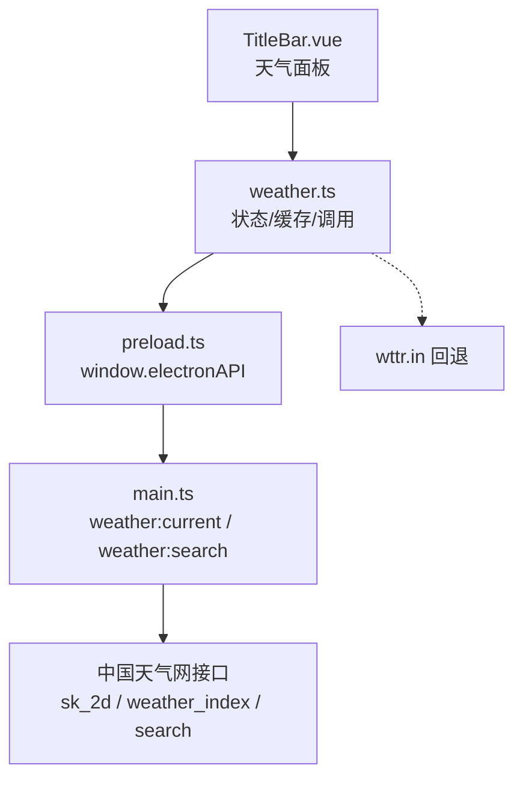
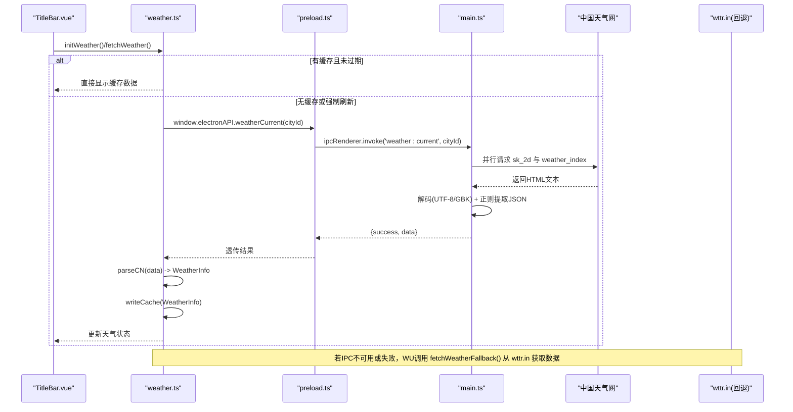
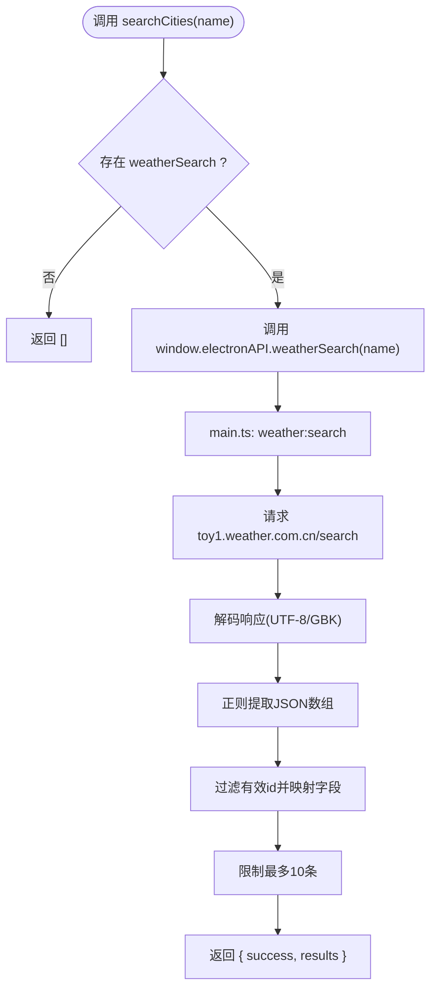
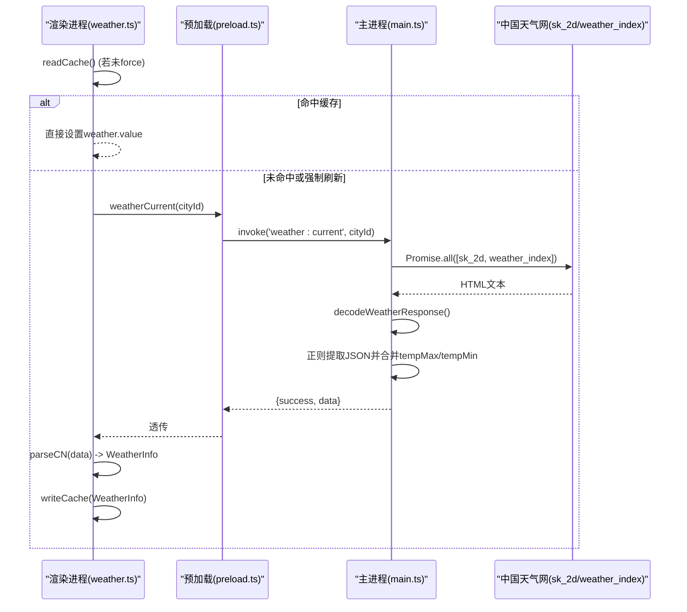
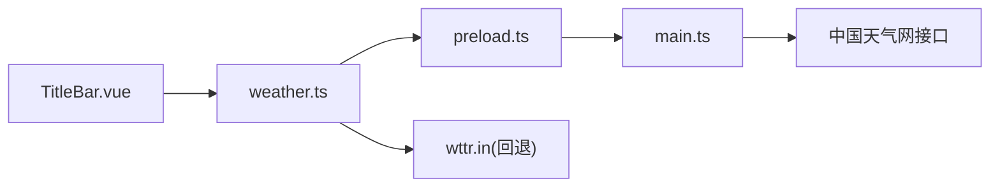
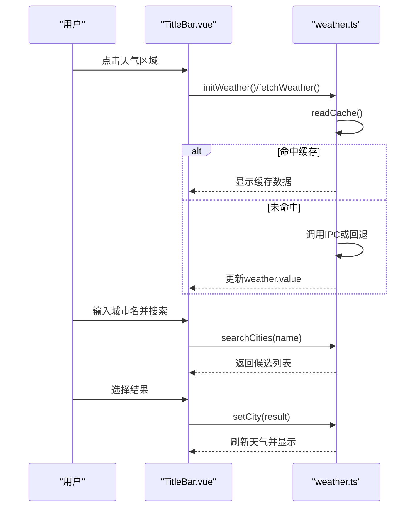

# 天气服务接口

<cite>
**本文引用的文件**
- [src/renderer/src/utils/weather.ts](file://src/renderer/src/utils/weather.ts)
- [src/main/main.ts](file://src/main/main.ts)
- [src/preload/preload.ts](file://src/preload/preload.ts)
- [src/renderer/src/vite-env.d.ts](file://src/renderer/src/vite-env.d.ts)
- [src/renderer/src/components/TitleBar.vue](file://src/renderer/src/components/TitleBar.vue)
</cite>

## 目录
1. [简介](#简介)
2. [项目结构](#项目结构)
3. [核心组件](#核心组件)
4. [架构总览](#架构总览)
5. [详细组件分析](#详细组件分析)
6. [依赖关系分析](#依赖关系分析)
7. [性能与缓存](#性能与缓存)
8. [错误处理与降级策略](#错误处理与降级策略)
9. [UI展示与集成示例](#ui展示与集成示例)
10. [故障排查指南](#故障排查指南)
11. [结论](#结论)

## 简介
本文件为“考研助手”应用中的国内天气服务接口文档，覆盖以下能力：
- 城市ID查询（weatherSearch）
- 实时天气获取（weatherCurrent）
- 数据格式、错误处理与降级策略
- 网络异常处理与本地缓存机制
- 前端UI集成与数据解析示例

该服务通过主进程IPC暴露给渲染进程使用，并在浏览器环境下提供回退方案。

## 项目结构
天气功能涉及渲染进程工具模块、预加载脚本、主进程IPC处理器以及类型声明和UI组件：
- 渲染进程工具：封装天气状态、缓存、API调用与回退逻辑
- 预加载脚本：将主进程的 weather:current 与 weather:search IPC 暴露为 window.electronAPI
- 主进程：实现中国天气网数据抓取、编码解码、结果合并与搜索
- 类型声明：定义 electronAPI 的 weatherCurrent/weatherSearch 方法签名
- UI组件：在标题栏中展示天气信息并提供城市选择与搜索交互

图表来源
- [src/renderer/src/components/TitleBar.vue:150-228](file://src/renderer/src/components/TitleBar.vue#L150-L228)
- [src/renderer/src/utils/weather.ts:98-157](file://src/renderer/src/utils/weather.ts#L98-L157)
- [src/preload/preload.ts:89-91](file://src/preload/preload.ts#L89-L91)
- [src/main/main.ts:2678-2737](file://src/main/main.ts#L2678-L2737)

章节来源
- [src/renderer/src/components/TitleBar.vue:150-228](file://src/renderer/src/components/TitleBar.vue#L150-L228)
- [src/renderer/src/utils/weather.ts:1-195](file://src/renderer/src/utils/weather.ts#L1-L195)
- [src/preload/preload.ts:89-91](file://src/preload/preload.ts#L89-L91)
- [src/main/main.ts:2650-2737](file://src/main/main.ts#L2650-L2737)
- [src/renderer/src/vite-env.d.ts:238-240](file://src/renderer/src/vite-env.d.ts#L238-L240)

## 核心组件
- 天气数据模型 WeatherInfo：包含温度、体感温度、天气状况、图标、湿度、风速、城市、观测时间、最高/最低温等字段
- 城市选择 WeatherCity：包含城市ID与名称，默认北京
- 工具函数：读取/写入缓存、解析中国天气网数据、天气编码转图标、城市搜索、初始化与自动刷新
- 主进程IPC：weather:current（实时天气）、weather:search（城市搜索）
- 预加载桥接：将IPC暴露为 window.electronAPI.weatherCurrent/weatherSearch
- 类型声明：electronAPI 方法签名与返回结构

章节来源
- [src/renderer/src/utils/weather.ts:4-26](file://src/renderer/src/utils/weather.ts#L4-L26)
- [src/renderer/src/utils/weather.ts:71-96](file://src/renderer/src/utils/weather.ts#L71-L96)
- [src/preload/preload.ts:89-91](file://src/preload/preload.ts#L89-L91)
- [src/renderer/src/vite-env.d.ts:238-240](file://src/renderer/src/vite-env.d.ts#L238-L240)
- [src/main/main.ts:2678-2737](file://src/main/main.ts#L2678-L2737)

## 架构总览
渲染进程通过 window.electronAPI 调用 weatherCurrent/weatherSearch；主进程负责请求中国天气网并解析响应；若渲染环境无IPC或失败，则回退到 wttr.in 公共接口。

图表来源
- [src/renderer/src/utils/weather.ts:98-157](file://src/renderer/src/utils/weather.ts#L98-L157)
- [src/preload/preload.ts:89-91](file://src/preload/preload.ts#L89-L91)
- [src/main/main.ts:2678-2737](file://src/main/main.ts#L2678-L2737)

## 详细组件分析

### 城市ID查询接口 weatherSearch
- 入口：渲染进程调用 searchCities(name)
- 桥接：window.electronAPI.weatherSearch(name)
- 主进程：ipcMain.handle('weather:search')
- 数据源：toy1.weather.com.cn/search?cityname=...
- 返回：{ success: boolean; results?: { id, name, province }[]; message? }
- 行为：
  - 参数校验：空查询返回空结果
  - 网络异常：返回空数组与错误消息
  - 解析：匹配JSON数组片段，过滤有效城市ID，取前10条

图表来源
- [src/renderer/src/utils/weather.ts:166-176](file://src/renderer/src/utils/weather.ts#L166-L176)
- [src/main/main.ts:2715-2737](file://src/main/main.ts#L2715-L2737)

章节来源
- [src/renderer/src/utils/weather.ts:166-176](file://src/renderer/src/utils/weather.ts#L166-L176)
- [src/main/main.ts:2715-2737](file://src/main/main.ts#L2715-L2737)
- [src/preload/preload.ts:90-91](file://src/preload/preload.ts#L90-L91)
- [src/renderer/src/vite-env.d.ts:239-240](file://src/renderer/src/vite-env.d.ts#L239-L240)

### 实时天气接口 weatherCurrent
- 入口：渲染进程调用 fetchWeather(opts?)
- 桥接：window.electronAPI.weatherCurrent(cityId)
- 主进程：ipcMain.handle('weather:current')
- 数据源：
  - 实况：d1.weather.com.cn/sk_2d/{cityId}.html
  - 今日预报：d1.weather.com.cn/weather_index/{cityId}.html（可选，失败不影响实况）
- 返回：{ success: boolean; data?: Record<string, string>; message? }
- 行为：
  - 参数校验：非数字城市ID回退到默认北京
  - 并发请求：同时拉取实况与预报，提升速度
  - 编码处理：根据Content-Type与页面内charset声明智能解码UTF-8/GBK
  - 解析：正则提取dataSK与cityDZ JSON片段，合并最高/最低温
  - 渲染：渲染进程将主进程返回的原始字段映射为统一 WeatherInfo

图表来源
- [src/renderer/src/utils/weather.ts:98-157](file://src/renderer/src/utils/weather.ts#L98-L157)
- [src/main/main.ts:2678-2713](file://src/main/main.ts#L2678-L2713)

章节来源
- [src/renderer/src/utils/weather.ts:98-157](file://src/renderer/src/utils/weather.ts#L98-L157)
- [src/main/main.ts:2650-2713](file://src/main/main.ts#L2650-L2713)
- [src/preload/preload.ts:90-91](file://src/preload/preload.ts#L90-L91)
- [src/renderer/src/vite-env.d.ts:238-240](file://src/renderer/src/vite-env.d.ts#L238-L240)

### 数据模型与解析
- WeatherInfo 字段说明：
  - tempC：当前温度（字符串）
  - condition：天气描述（字符串）
  - icon：天气图标（emoji）
  - humidity：湿度（百分比字符串）
  - wind：风速（km/h字符串）
  - city：城市名（字符串）
  - feelsLikeC：体感温度（可选）
  - obsTime：观测时间（可选）
  - tempMax/tempMin：今日最高/最低温（可选）
- 解析逻辑：
  - 主进程返回的原始字段经渲染进程 parseCN 转换为统一结构
  - 天气编码 codeToIcon 将中国天气网天气码映射为emoji

章节来源
- [src/renderer/src/utils/weather.ts:4-15](file://src/renderer/src/utils/weather.ts#L4-L15)
- [src/renderer/src/utils/weather.ts:53-96](file://src/renderer/src/utils/weather.ts#L53-L96)

### 缓存机制
- 存储键：kaoyan_weather_cache_v2
- 内容：{ ts, cityId, data }
- TTL：30分钟
- 读取：readCache() 检查城市ID一致性与TTL
- 写入：writeCache() 保存最新数据
- 自动刷新：initWeather() 每小时调用 fetchWeather({ force: true })

章节来源
- [src/renderer/src/utils/weather.ts:28-30](file://src/renderer/src/utils/weather.ts#L28-L30)
- [src/renderer/src/utils/weather.ts:71-81](file://src/renderer/src/utils/weather.ts#L71-L81)
- [src/renderer/src/utils/weather.ts:178-194](file://src/renderer/src/utils/weather.ts#L178-L194)

## 依赖关系分析
- 渲染进程依赖：
  - Vue ref 管理天气状态
  - 本地存储 getGlobalStorage/setGlobalStorage 用于缓存与城市选择
  - window.electronAPI 调用IPC
- 预加载脚本依赖：
  - ipcRenderer.invoke 绑定 weather:current/weather:search
- 主进程依赖：
  - net.fetch 发起HTTP请求
  - TextDecoder 进行UTF-8/GBK解码
  - 正则表达式解析HTML中的JSON片段
- UI组件依赖：
  - TitleBar.vue 消费 weather.ts 暴露的状态与方法

图表来源
- [src/renderer/src/components/TitleBar.vue:150-228](file://src/renderer/src/components/TitleBar.vue#L150-L228)
- [src/renderer/src/utils/weather.ts:98-157](file://src/renderer/src/utils/weather.ts#L98-L157)
- [src/preload/preload.ts:89-91](file://src/preload/preload.ts#L89-L91)
- [src/main/main.ts:2678-2737](file://src/main/main.ts#L2678-L2737)

章节来源
- [src/renderer/src/components/TitleBar.vue:150-228](file://src/renderer/src/components/TitleBar.vue#L150-L228)
- [src/renderer/src/utils/weather.ts:1-195](file://src/renderer/src/utils/weather.ts#L1-L195)
- [src/preload/preload.ts:89-91](file://src/preload/preload.ts#L89-L91)
- [src/main/main.ts:2650-2737](file://src/main/main.ts#L2650-L2737)

## 性能与缓存
- 并发请求：主进程对实况与预报接口使用 Promise.all 并行拉取，减少整体延迟
- 编码优化：优先按响应头 charset 解码，未声明时尝试严格UTF-8，失败回退GBK，避免乱码导致的二次解析开销
- 缓存策略：30分钟TTL，按城市ID隔离，避免重复网络请求
- 自动刷新：每小时后台刷新一次，保证数据时效性且不叠加定时器

[本节为通用性能讨论，不直接分析具体代码行]

## 错误处理与降级策略
- 主进程错误：
  - 网络失败：返回 { success: false, message }
  - 解析失败：返回 { success: false, message }
  - 预报接口失败：不影响实况数据返回
- 渲染进程错误：
  - IPC不可用：回退到 wttr.in 公共接口
  - 网络异常：静默捕获，保留旧展示，不清空
- 降级路径：
  - 首选：国内源 IPC（weather:current）
  - 次选：浏览器环境回退（wttr.in）
  - 最终：保持上次成功数据或默认占位

章节来源
- [src/main/main.ts:2678-2737](file://src/main/main.ts#L2678-L2737)
- [src/renderer/src/utils/weather.ts:98-157](file://src/renderer/src/utils/weather.ts#L98-L157)

## UI展示与集成示例
- 展示位置：标题栏天气区域，点击弹出详情面板
- 展示内容：
  - 城市名与观测时间
  - 当前温度、天气状况、图标
  - 最高/最低温、湿度、风速
  - 常用城市快捷选择与自定义搜索
- 交互流程：
  - 选择城市：setCity(city) 持久化并强制刷新
  - 搜索城市：searchCities(name) 返回候选列表，点击后 selectSearchResult
  - 刷新天气：refreshWeather() 触发 fetchWeather({ force: true })

图表来源
- [src/renderer/src/components/TitleBar.vue:150-228](file://src/renderer/src/components/TitleBar.vue#L150-L228)
- [src/renderer/src/utils/weather.ts:159-194](file://src/renderer/src/utils/weather.ts#L159-L194)

章节来源
- [src/renderer/src/components/TitleBar.vue:150-228](file://src/renderer/src/components/TitleBar.vue#L150-L228)
- [src/renderer/src/utils/weather.ts:159-194](file://src/renderer/src/utils/weather.ts#L159-L194)

## 故障排查指南
- 现象：天气数据为空或显示“暂无数据”
  - 检查缓存是否过期或城市ID不匹配
  - 确认IPC可用（window.electronAPI.weatherCurrent是否存在）
  - 查看主进程返回的 success 与 message
- 现象：中文乱码
  - 主进程已内置UTF-8/GBK智能解码，若仍出现乱码，检查网络代理或目标站点编码变化
- 现象：搜索不到城市
  - 确认输入不为空，检查网络连通性
  - 查看主进程返回的 results 是否为空
- 现象：频繁刷新导致卡顿
  - 利用缓存机制，避免频繁 force 刷新
  - 检查自动刷新定时器是否重复创建（代码已做幂等保护）

章节来源
- [src/renderer/src/utils/weather.ts:71-81](file://src/renderer/src/utils/weather.ts#L71-L81)
- [src/main/main.ts:2650-2737](file://src/main/main.ts#L2650-L2737)

## 结论
该天气服务以国内源为主、公共回退为辅，具备完善的缓存与错误处理机制。通过主进程IPC屏蔽了跨域与编码差异，渲染进程专注于状态管理与UI展示。城市搜索与实时天气接口稳定可靠，适合嵌入桌面应用的顶栏场景。