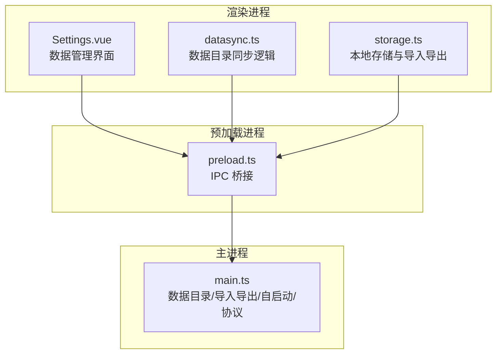
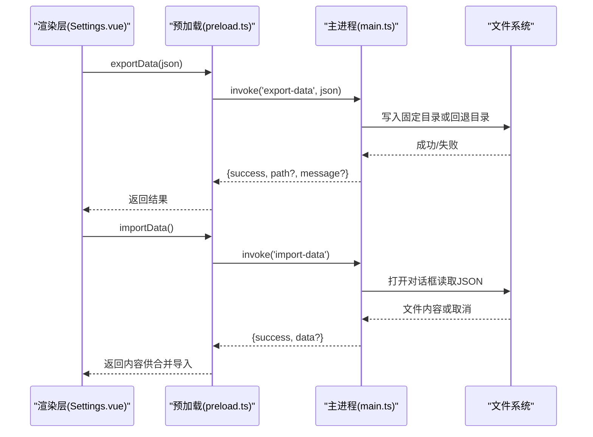
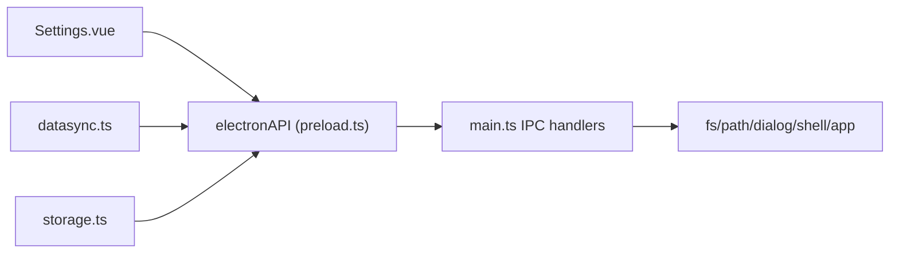
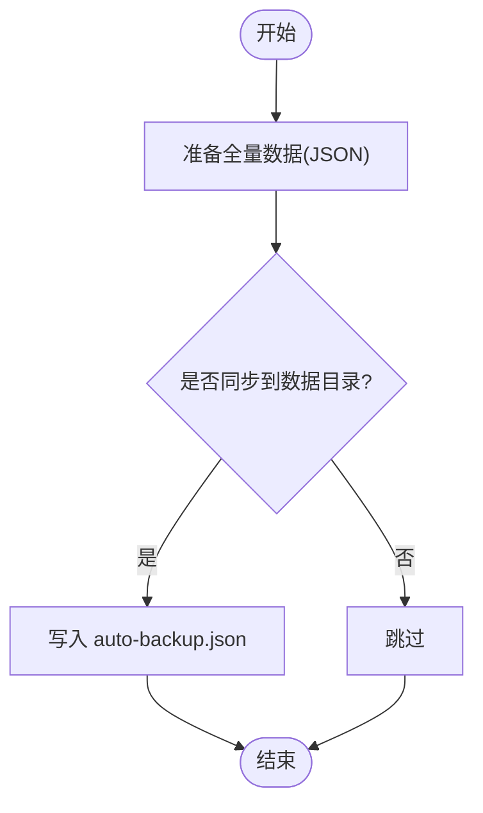
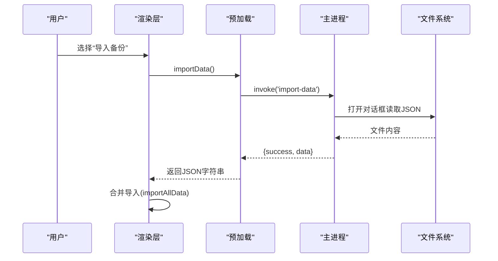

# 数据管理接口

<cite>
**本文引用的文件**
- [src/main/main.ts](file://src/main/main.ts)
- [src/preload/preload.ts](file://src/preload/preload.ts)
- [src/renderer/src/utils/datasync.ts](file://src/renderer/src/utils/datasync.ts)
- [src/renderer/src/utils/storage.ts](file://src/renderer/src/utils/storage.ts)
- [src/renderer/src/views/Settings.vue](file://src/renderer/src/views/Settings.vue)
</cite>

## 目录
1. [简介](#简介)
2. [项目结构](#项目结构)
3. [核心组件](#核心组件)
4. [架构总览](#架构总览)
5. [详细组件分析](#详细组件分析)
6. [依赖关系分析](#依赖关系分析)
7. [性能与可靠性](#性能与可靠性)
8. [故障排查指南](#故障排查指南)
9. [结论](#结论)
10. [附录：备份恢复流程与最佳实践](#附录备份恢复流程与最佳实践)

## 简介
本文件面向“考研助手”应用的数据管理相关 IPC 接口，覆盖数据导入导出、数据目录管理、自动启动设置等核心能力。重点说明以下接口的完整签名、数据格式要求、错误处理与异常场景，并提供数据备份恢复的完整流程与最佳实践，以及数据迁移与版本兼容性说明。

## 项目结构
数据管理涉及三层协作：
- 渲染层（Vue）：通过 window.electronAPI 调用 IPC 方法，负责 UI 交互与业务编排。
- 预加载层（preload）：桥接渲染进程与主进程，暴露安全的 API 集合。
- 主进程（main）：实现文件系统操作、系统级设置（开机自启）、协议与资源服务。

图表来源
- [src/preload/preload.ts:3-90](file://src/preload/preload.ts#L3-L90)
- [src/main/main.ts:2594-2739](file://src/main/main.ts#L2594-L2739)

章节来源
- [src/preload/preload.ts:3-90](file://src/preload/preload.ts#L3-L90)
- [src/main/main.ts:2594-2739](file://src/main/main.ts#L2594-L2739)

## 核心组件
- 数据导入导出
  - exportData：将当前用户的全量数据以 JSON 字符串形式导出到固定路径或回退路径。
  - importData：选择本地 JSON 文件并读取内容返回给渲染层进行合并导入。
- 数据目录管理
  - getDataDir：获取当前数据目录路径。
  - setDataDir：选择新数据目录，校验可写后迁移背景图与自动备份。
  - openDataDir：在系统资源管理器中打开数据目录。
  - syncDataToDir：将全量数据快照写入数据目录的自动备份文件。
- 自动启动设置
  - setAutoLaunch：设置开机自启动开关。
  - getAutoLaunch：查询当前开机自启动状态。

章节来源
- [src/preload/preload.ts:3-90](file://src/preload/preload.ts#L3-L90)
- [src/main/main.ts:2594-2739](file://src/main/main.ts#L2594-L2739)
- [src/renderer/src/utils/storage.ts:298-323](file://src/renderer/src/utils/storage.ts#L298-L323)
- [src/renderer/src/utils/datasync.ts:26-82](file://src/renderer/src/utils/datasync.ts#L26-L82)

## 架构总览
数据管理的控制流如下：
- 渲染层发起 IPC 调用（如 exportData/importData/getDataDir/setDataDir/syncDataToDir/setAutoLaunch/getAutoLaunch）。
- 预加载层转发至主进程对应 channel。
- 主进程执行具体逻辑（文件读写、系统设置、目录迁移），返回结果给渲染层。
- 渲染层根据返回结果更新 UI 或继续后续流程。

图表来源
- [src/preload/preload.ts:3-90](file://src/preload/preload.ts#L3-L90)
- [src/main/main.ts:2687-2724](file://src/main/main.ts#L2687-L2724)

## 详细组件分析

### 数据导入导出
- exportData(data: string): Promise<{ success: boolean; path?: string }>
  - 输入：当前用户的全量数据 JSON 字符串（由 storage.exportAllData 生成）。
  - 行为：优先写入固定目录 D:\下载\文档\11408kaoyan-helper；若失败则回退到用户文档目录。
  - 输出：成功时包含保存路径；失败时包含错误信息。
  - 异常：IO 权限不足、磁盘不可用、路径非法等。
- importData(): Promise<{ success: boolean; data?: string }>
  - 行为：弹出文件选择器，仅允许 JSON 文件；读取文件内容为字符串返回。
  - 输出：成功时包含文件内容；取消或失败时 success=false。
  - 异常：文件不存在、编码错误、权限问题。

章节来源
- [src/preload/preload.ts:3-90](file://src/preload/preload.ts#L3-L90)
- [src/main/main.ts:2687-2724](file://src/main/main.ts#L2687-L2724)
- [src/renderer/src/utils/storage.ts:298-323](file://src/renderer/src/utils/storage.ts#L298-L323)

### 数据目录管理
- getDataDir(): Promise<{ dir: string }>
  - 行为：返回当前数据目录路径（默认位于用户文档下的 11408kaoyan-helper，支持自定义）。
  - 异常：配置损坏时回退默认目录。
- setDataDir(): Promise<{ success: boolean; dir?: string; canceled?: boolean; message?: string }>
  - 行为：选择目录并创建；写入探测文件验证可写；持久化配置；迁移背景图与自动备份。
  - 异常：目录不可写、权限不足、迁移失败等。
- openDataDir(): Promise<{ success: boolean }>
  - 行为：在系统资源管理器中打开数据目录。
- syncDataToDir(json: string): Promise<{ success: boolean; path?: string; message?: string }>
  - 行为：将传入的全量数据 JSON 写入数据目录的自动备份文件（覆盖式）。
  - 异常：IO 失败、目录不存在且无法创建等。

章节来源
- [src/preload/preload.ts:86-90](file://src/preload/preload.ts#L86-L90)
- [src/main/main.ts:2594-2655](file://src/main/main.ts#L2594-L2655)
- [src/renderer/src/utils/datasync.ts:26-82](file://src/renderer/src/utils/datasync.ts#L26-L82)

### 自动启动设置
- setAutoLaunch(enabled: boolean): Promise<{ success: boolean; enabled: boolean }>
  - 行为：设置系统登录项 openAtLogin。
  - 异常：平台限制或权限不足导致设置失败。
- getAutoLaunch(): Promise<{ enabled: boolean }>
  - 行为：查询当前是否开机自启动。

章节来源
- [src/preload/preload.ts:6-7](file://src/preload/preload.ts#L6-L7)
- [src/main/main.ts:2727-2739](file://src/main/main.ts#L2727-L2739)
- [src/renderer/src/views/Settings.vue:556-584](file://src/renderer/src/views/Settings.vue#L556-L584)

### 数据目录与协议
- 数据目录协议 kaoyan-data://：仅暴露数据目录内的 .json 文件，用于安全读取备份文件。
- 自动备份文件：auto-backup.json，位于数据目录内，由 syncDataToDir 覆盖写入。

章节来源
- [src/main/main.ts:479-495](file://src/main/main.ts#L479-L495)
- [src/main/main.ts:59-62](file://src/main/main.ts#L59-L62)
- [src/main/main.ts:2646-2655](file://src/main/main.ts#L2646-L2655)

## 依赖关系分析
- 渲染层依赖 preload 暴露的 electronAPI。
- preload 依赖 main 注册的 IPC channel。
- main 依赖 fs、path、dialog、shell、app 等系统模块。
- datasync 依赖 storage 的全量导出能力。
- Settings 页面依赖 getAutoLaunch/setAutoLaunch 完成 UI 交互。

图表来源
- [src/preload/preload.ts:3-90](file://src/preload/preload.ts#L3-L90)
- [src/main/main.ts:2594-2739](file://src/main/main.ts#L2594-L2739)

章节来源
- [src/preload/preload.ts:3-90](file://src/preload/preload.ts#L3-L90)
- [src/main/main.ts:2594-2739](file://src/main/main.ts#L2594-L2739)

## 性能与可靠性
- 导入导出
  - 导出采用固定目录优先，失败快速回退，保证可用性。
  - 导入为一次性读取 JSON 文本，注意大文件内存占用。
- 数据目录
  - setDataDir 会进行可写性探测，避免无效目录。
  - 迁移背景图与自动备份时尝试 rename，失败降级为 copy，提升跨盘迁移成功率。
- 自动启动
  - 使用系统登录项 API，简单可靠；不同平台行为可能略有差异。

[本节为通用指导，不直接分析具体文件]

## 故障排查指南
- 导出失败
  - 检查固定目录是否存在及可写；查看返回 message 中的 IO 错误信息。
  - 若回退成功，返回对象包含 fallback=true。
- 导入失败
  - 确认选择的 JSON 文件格式正确；检查读取权限。
- 数据目录切换失败
  - 检查目标目录权限；查看是否被杀毒软件或云盘同步锁定。
  - 迁移失败不影响配置写入，但可能导致旧文件未移动。
- 自动启动设置无效
  - 某些平台可能需要管理员权限；检查系统策略限制。

章节来源
- [src/main/main.ts:2687-2739](file://src/main/main.ts#L2687-L2739)
- [src/main/main.ts:2600-2655](file://src/main/main.ts#L2600-L2655)

## 结论
本项目的数据管理接口围绕“稳定、可迁移、可审计”的目标设计：
- 数据导出/导入提供明确的 JSON 契约，便于备份与恢复。
- 数据目录支持自定义与迁移，保障用户数据可携带。
- 自动启动设置简化系统级集成。
结合内置协议与自动备份机制，形成完整的数据生命周期管理能力。

[本节为总结，不直接分析具体文件]

## 附录：备份恢复流程与最佳实践

### 备份流程
- 手动立即备份
  - 调用 syncDataToDir(exportAllData())，将当前用户全量数据写入数据目录的 auto-backup.json。
  - 适用于切换数据目录后或需要即时落盘的场景。
- 导出到外部文件
  - 调用 exportData(exportAllData())，将数据导出到固定目录或回退目录，便于归档与分享。
- 自动备份
  - v2.9.2 起关闭定时自动同步，但仍保留手动同步能力。

图表来源
- [src/renderer/src/utils/datasync.ts:68-82](file://src/renderer/src/utils/datasync.ts#L68-L82)
- [src/main/main.ts:2646-2655](file://src/main/main.ts#L2646-L2655)

### 恢复流程
- 从数据目录恢复
  - 通过 kaoyan-data:// 协议读取 auto-backup.json，或使用 openDataDir 定位文件。
- 从外部备份恢复
  - 调用 importData() 选择 JSON 文件，读取内容后合并到当前用户存储。

图表来源
- [src/preload/preload.ts:3-90](file://src/preload/preload.ts#L3-L90)
- [src/main/main.ts:2712-2724](file://src/main/main.ts#L2712-L2724)
- [src/renderer/src/utils/storage.ts:310-323](file://src/renderer/src/utils/storage.ts#L310-L323)

### 最佳实践
- 定期手动同步：切换数据目录或重要变更后立即 syncOnce。
- 多副本归档：导出到外部文件并命名含日期时间戳，便于版本回溯。
- 迁移前备份：setDataDir 前建议先导出一次，确保可回滚。
- 权限与环境：确保数据目录所在磁盘可写，避免云盘实时同步导致的锁冲突。

[本节为通用指导，不直接分析具体文件]

### 数据迁移与版本兼容性
- 存储层迁移
  - 初始化时检测数据版本，按顺序执行迁移脚本，确保旧数据结构平滑升级。
  - 迁移失败记录日志但不中断整体流程。
- 科目数据合并
  - 针对历史 408 子科目数据，迁移时计算平均值并合并为 cs408，删除旧字段。
- 兼容策略
  - 导出/导入基于 JSON 键值对，新增字段向后兼容，缺失字段使用默认值。

章节来源
- [src/renderer/src/utils/storage.ts:113-136](file://src/renderer/src/utils/storage.ts#L113-L136)
- [src/renderer/src/utils/storage.ts:140-188](file://src/renderer/src/utils/storage.ts#L140-L188)
- [src/renderer/src/stores/index.ts:139-214](file://src/renderer/src/stores/index.ts#L139-L214)