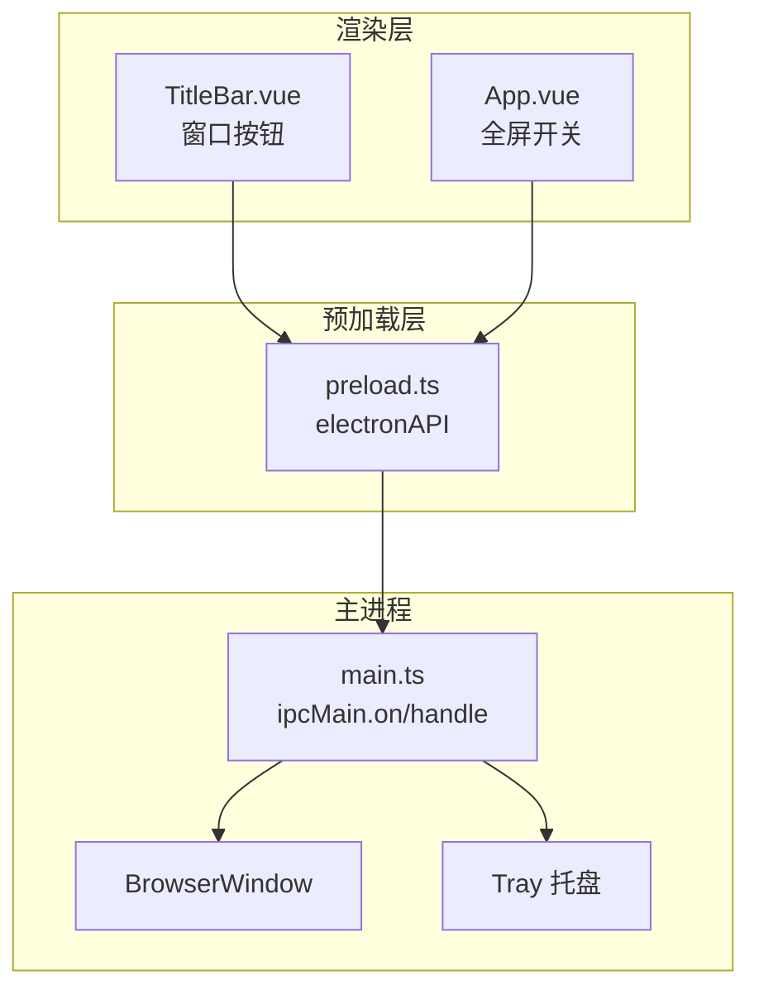
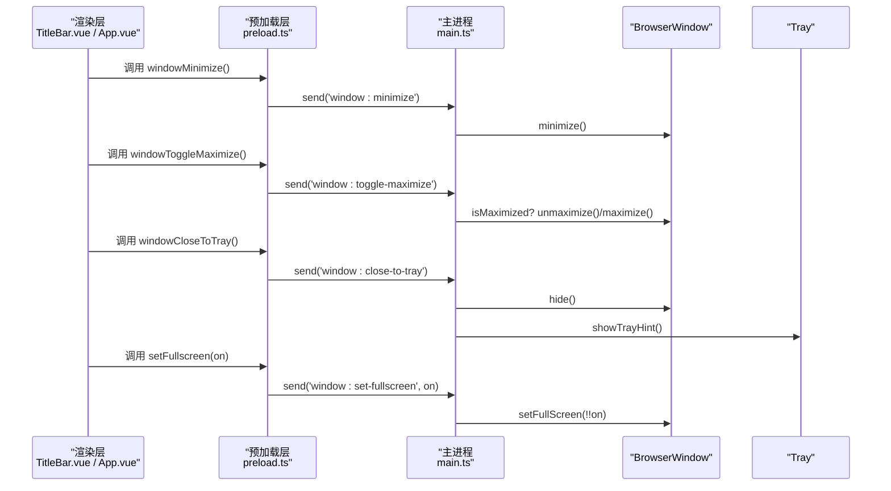
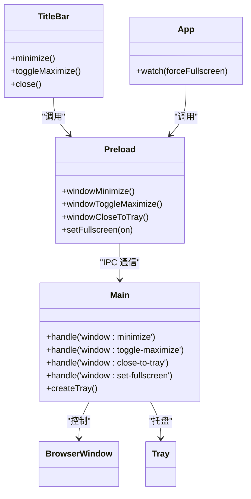

# 窗口控制接口

<cite>
**本文引用的文件**
- [src/main/main.ts](file://src/main/main.ts)
- [src/preload/preload.ts](file://src/preload/preload.ts)
- [src/renderer/src/components/TitleBar.vue](file://src/renderer/src/components/TitleBar.vue)
- [src/renderer/src/App.vue](file://src/renderer/src/App.vue)
</cite>

## 目录
1. [简介](#简介)
2. [项目结构](#项目结构)
3. [核心组件](#核心组件)
4. [架构总览](#架构总览)
5. [详细接口说明](#详细接口说明)
6. [依赖关系分析](#依赖关系分析)
7. [性能与兼容性](#性能与兼容性)
8. [故障排查](#故障排查)
9. [结论](#结论)
10. [附录：在 Vue 中调用的示例路径](#附录在-vue-中调用的示例路径)

## 简介
本文件面向“窗口控制”相关能力，系统性梳理 Electron 主进程、预加载脚本与渲染层之间的 IPC 通道，覆盖最小化、最大化/还原、关闭到托盘、全屏模式切换等接口的完整签名、参数类型、返回值格式、调用时机与最佳实践，并给出错误处理机制与兼容性说明。文末提供在 Vue 组件中调用这些方法的参考路径，便于快速集成。

## 项目结构
窗口控制涉及三层协作：
- 渲染层（Vue）：用户交互触发窗口操作（如点击最小化、最大化、关闭按钮或切换全屏开关）。
- 预加载层（preload）：通过 contextBridge 暴露安全的 API 给渲染层，内部使用 ipcRenderer.send/invoke 与主进程通信。
- 主进程（main）：监听 IPC 事件并执行实际的窗口控制逻辑（minimize/maximize/unmaximize/hide/fullscreen），同时管理托盘行为。

图表来源
- [src/renderer/src/components/TitleBar.vue:317-329](file://src/renderer/src/components/TitleBar.vue#L317-L329)
- [src/renderer/src/App.vue:69-73](file://src/renderer/src/App.vue#L69-L73)
- [src/preload/preload.ts:11-22](file://src/preload/preload.ts#L11-L22)
- [src/main/main.ts:672-699](file://src/main/main.ts#L672-L699)

章节来源
- [src/main/main.ts:290-327](file://src/main/main.ts#L290-L327)
- [src/preload/preload.ts:1-98](file://src/preload/preload.ts#L1-L98)
- [src/renderer/src/components/TitleBar.vue:317-329](file://src/renderer/src/components/TitleBar.vue#L317-L329)
- [src/renderer/src/App.vue:69-73](file://src/renderer/src/App.vue#L69-L73)

## 核心组件
- 主进程窗口与托盘
  - 创建无边框窗口，默认隐藏系统标题栏，由渲染层自建顶栏与窗口控制按钮。
  - 关闭窗口时默认隐藏到托盘而非退出应用；托盘菜单提供“显示主窗口”和“退出考研助手”。
- 预加载桥接
  - 暴露 windowMinimize、windowToggleMaximize、windowCloseToTray、setFullscreen 等方法供渲染层调用。
- 渲染层调用点
  - TitleBar.vue：最小化、最大化/还原、关闭到托盘。
  - App.vue：根据设置项强制进入/退出全屏。

章节来源
- [src/main/main.ts:290-327](file://src/main/main.ts#L290-L327)
- [src/main/main.ts:344-377](file://src/main/main.ts#L344-L377)
- [src/preload/preload.ts:11-22](file://src/preload/preload.ts#L11-L22)
- [src/renderer/src/components/TitleBar.vue:534-545](file://src/renderer/src/components/TitleBar.vue#L534-L545)
- [src/renderer/src/App.vue:69-73](file://src/renderer/src/App.vue#L69-L73)

## 架构总览
以下时序图展示从渲染层到主进程的窗口控制调用链。

图表来源
- [src/renderer/src/components/TitleBar.vue:534-545](file://src/renderer/src/components/TitleBar.vue#L534-L545)
- [src/renderer/src/App.vue:69-73](file://src/renderer/src/App.vue#L69-L73)
- [src/preload/preload.ts:11-22](file://src/preload/preload.ts#L11-L22)
- [src/main/main.ts:672-699](file://src/main/main.ts#L672-L699)

## 详细接口说明

### 通用约定
- 调用方式
  - 非返回型操作：通过 ipcRenderer.send 发送事件，无返回值。
  - 查询/异步操作：通过 ipcRenderer.invoke 调用 handle，返回 Promise。
- 错误处理
  - 主进程对无效状态进行保护（如窗口不存在则忽略）。
  - 托盘提示仅在 Windows 首次隐藏时展示，失败不影响主流程。
- 兼容性
  - 托盘气泡提示仅 Windows 平台有效。
  - 全屏模式依赖操作系统支持，Electron 的 setFullScreen 在不同平台表现略有差异。

章节来源
- [src/main/main.ts:329-342](file://src/main/main.ts#L329-L342)
- [src/main/main.ts:672-699](file://src/main/main.ts#L672-L699)

### 最小化
- 方法名（预加载暴露）
  - windowMinimize
- 参数
  - 无
- 返回值
  - 无（send 事件）
- 调用时机
  - 用户点击顶栏“最小化”按钮时。
- 实现要点
  - 预加载层将事件转发至主进程 'window:minimize'。
  - 主进程调用 mainWindow.minimize()。
- 最佳实践
  - 确保窗口已创建后再调用；当前实现在主进程侧做了空指针保护。
- 错误处理
  - 若窗口未创建，主进程直接忽略，不会抛出异常。

章节来源
- [src/preload/preload.ts:12](file://src/preload/preload.ts#L12)
- [src/main/main.ts:674-676](file://src/main/main.ts#L674-L676)
- [src/renderer/src/components/TitleBar.vue:534-536](file://src/renderer/src/components/TitleBar.vue#L534-L536)

### 最大化/还原
- 方法名（预加载暴露）
  - windowToggleMaximize
- 参数
  - 无
- 返回值
  - 无（send 事件）
- 调用时机
  - 用户点击顶栏“最大化/还原”按钮时。
- 实现要点
  - 主进程判断当前是否最大化，分别调用 unmaximize() 或 maximize()。
- 最佳实践
  - 渲染层可维护本地 isMaximized 状态以更新按钮图标（当前 TitleBar 已维护该状态）。
- 错误处理
  - 主进程对窗口存在性做保护。

章节来源
- [src/preload/preload.ts:13](file://src/preload/preload.ts#L13)
- [src/main/main.ts:678-685](file://src/main/main.ts#L678-L685)
- [src/renderer/src/components/TitleBar.vue:538-541](file://src/renderer/src/components/TitleBar.vue#L538-L541)

### 关闭到托盘
- 方法名（预加载暴露）
  - windowCloseToTray
- 参数
  - 无
- 返回值
  - 无（send 事件）
- 调用时机
  - 用户点击顶栏“关闭”按钮时。
- 实现要点
  - 主进程调用 mainWindow.hide() 并显示托盘提示（Windows 首次）。
  - 原生关闭事件也默认隐藏到托盘，除非触发真正退出。
- 最佳实践
  - 如需完全退出，请使用托盘菜单中的“退出考研助手”。
- 错误处理
  - 窗口销毁或不可用时忽略；托盘提示失败不影响主流程。

章节来源
- [src/preload/preload.ts:14](file://src/preload/preload.ts#L14)
- [src/main/main.ts:315-322](file://src/main/main.ts#L315-L322)
- [src/main/main.ts:329-342](file://src/main/main.ts#L329-L342)
- [src/main/main.ts:688-693](file://src/main/main.ts#L688-L693)
- [src/renderer/src/components/TitleBar.vue:543-545](file://src/renderer/src/components/TitleBar.vue#L543-L545)

### 全屏模式切换
- 方法名（预加载暴露）
  - setFullscreen
- 参数
  - on: boolean（true 进入全屏，false 退出全屏）
- 返回值
  - 无（send 事件）
- 调用时机
  - 用户在设置中开启/关闭“强制全屏”时，App.vue 监听设置变化并调用。
- 实现要点
  - 主进程调用 mainWindow.setFullScreen(!!on)。
- 最佳实践
  - 建议在设置变更时立即生效；避免与其他全屏逻辑冲突。
- 错误处理
  - 主进程对窗口存在性做保护；不同平台全屏行为可能略有差异。

章节来源
- [src/preload/preload.ts:21](file://src/preload/preload.ts#L21)
- [src/main/main.ts:696-699](file://src/main/main.ts#L696-L699)
- [src/renderer/src/App.vue:69-73](file://src/renderer/src/App.vue#L69-L73)

### 附加：托盘交互（辅助理解）
- 双击托盘图标：恢复并聚焦主窗口。
- 托盘菜单：
  - “显示主窗口”：show + focus。
  - “退出考研助手”：标记真正退出并 app.quit()。
- 首次隐藏到托盘：Windows 平台弹出一次提示气泡。

章节来源
- [src/main/main.ts:344-377](file://src/main/main.ts#L344-L377)
- [src/main/main.ts:329-342](file://src/main/main.ts#L329-L342)

## 依赖关系分析
- 渲染层依赖预加载暴露的 electronAPI，不直接访问 Node/Electron 模块。
- 预加载层仅暴露必要方法，保持安全隔离。
- 主进程集中处理窗口与托盘逻辑，保证状态一致性与跨平台兼容。

图表来源
- [src/renderer/src/components/TitleBar.vue:534-545](file://src/renderer/src/components/TitleBar.vue#L534-L545)
- [src/renderer/src/App.vue:69-73](file://src/renderer/src/App.vue#L69-L73)
- [src/preload/preload.ts:11-22](file://src/preload/preload.ts#L11-L22)
- [src/main/main.ts:672-699](file://src/main/main.ts#L672-L699)
- [src/main/main.ts:344-377](file://src/main/main.ts#L344-L377)

## 性能与兼容性
- 性能
  - 窗口控制为轻量级系统调用，开销极低。
  - 托盘提示仅在 Windows 首次隐藏时触发，避免重复 IO。
- 兼容性
  - 托盘气泡提示仅限 Windows。
  - 全屏模式在不同操作系统下行为可能不同（例如 macOS 的全屏与任务栏隐藏策略）。
  - 无边框窗口需自行实现拖拽区域与窗口控制按钮（本项目已在渲染层实现）。

[本节为通用指导，不直接分析具体文件]

## 故障排查
- 问题：点击关闭后应用仍退出
  - 检查是否触发了真正的退出流程（托盘菜单“退出考研助手”才会真正退出）。
  - 确认 close 事件未被其他逻辑拦截。
- 问题：托盘提示未出现
  - 非 Windows 平台不会显示；或已展示过不再重复显示。
- 问题：全屏无效
  - 检查是否在 Electron 环境中运行；某些环境可能限制全屏。
  - 确认主进程窗口对象存在且未销毁。

章节来源
- [src/main/main.ts:315-322](file://src/main/main.ts#L315-L322)
- [src/main/main.ts:329-342](file://src/main/main.ts#L329-L342)
- [src/main/main.ts:696-699](file://src/main/main.ts#L696-L699)

## 结论
本项目通过清晰的三层架构实现了稳定的窗口控制能力：渲染层负责交互，预加载层提供安全桥接，主进程统一执行业务逻辑。所有窗口控制接口均具备健壮的错误保护与平台适配，满足最小化、最大化/还原、关闭到托盘、全屏切换等常见需求。推荐在设置页或顶栏按钮中按上述最佳实践调用，以获得一致的用户体验。

[本节为总结，不直接分析具体文件]

## 附录：在 Vue 中调用的示例路径
- 最小化
  - 调用位置：TitleBar.vue 的 minimize 函数
  - 参考路径：[src/renderer/src/components/TitleBar.vue:534-536](file://src/renderer/src/components/TitleBar.vue#L534-L536)
- 最大化/还原
  - 调用位置：TitleBar.vue 的 toggleMaximize 函数
  - 参考路径：[src/renderer/src/components/TitleBar.vue:538-541](file://src/renderer/src/components/TitleBar.vue#L538-L541)
- 关闭到托盘
  - 调用位置：TitleBar.vue 的 close 函数
  - 参考路径：[src/renderer/src/components/TitleBar.vue:543-545](file://src/renderer/src/components/TitleBar.vue#L543-L545)
- 全屏模式切换
  - 调用位置：App.vue 监听设置变化并调用 setFullscreen
  - 参考路径：[src/renderer/src/App.vue:69-73](file://src/renderer/src/App.vue#L69-L73)
- 预加载暴露的方法
  - 参考路径：[src/preload/preload.ts:11-22](file://src/preload/preload.ts#L11-L22)
- 主进程处理逻辑
  - 参考路径：[src/main/main.ts:672-699](file://src/main/main.ts#L672-L699)