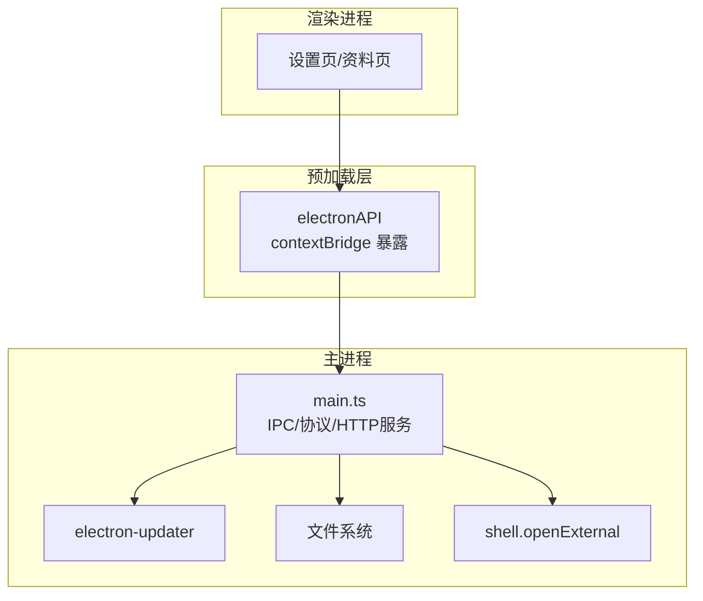
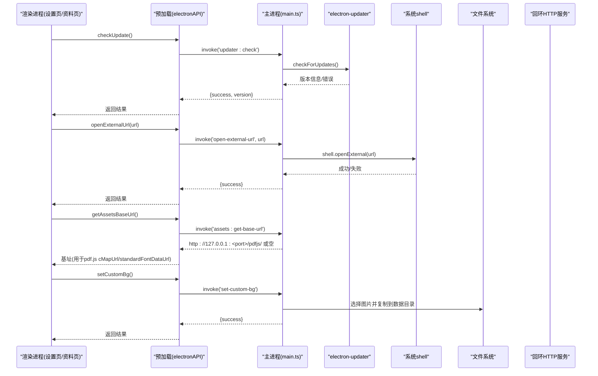
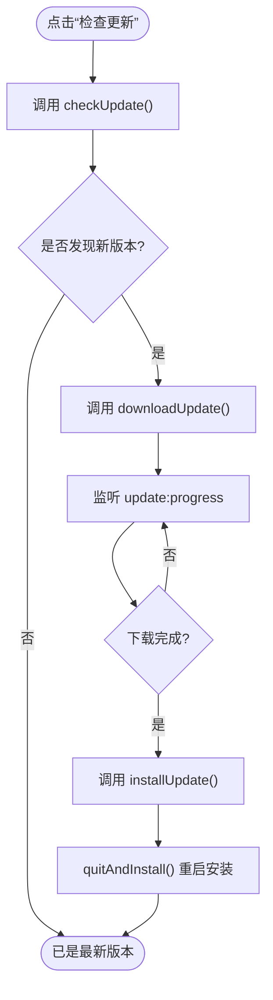
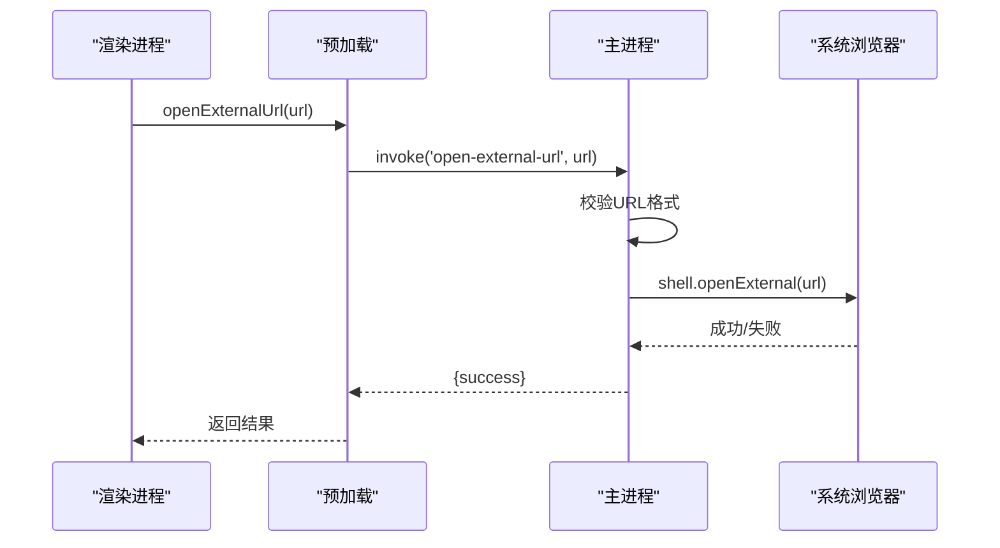
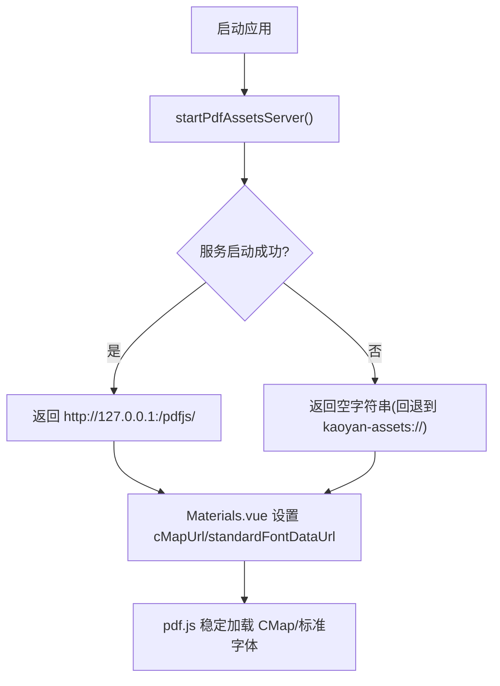
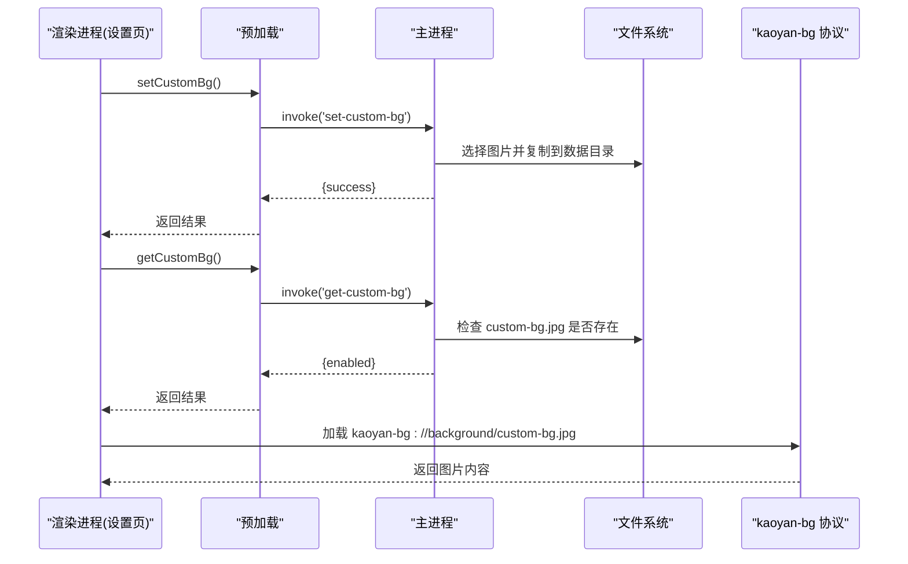
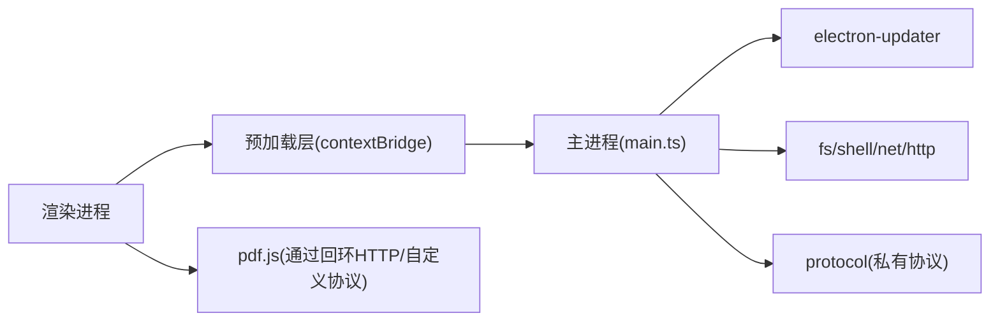

# 系统集成接口

<cite>
**本文引用的文件**
- [src/main/main.ts](file://src/main/main.ts)
- [src/preload/preload.ts](file://src/preload/preload.ts)
- [package.json](file://package.json)
- [src/renderer/src/utils/theme.ts](file://src/renderer/src/utils/theme.ts)
- [src/renderer/src/views/Settings.vue](file://src/renderer/src/views/Settings.vue)
- [src/renderer/src/views/Materials.vue](file://src/renderer/src/views/Materials.vue)
</cite>

## 目录
1. [简介](#简介)
2. [项目结构](#项目结构)
3. [核心组件](#核心组件)
4. [架构总览](#架构总览)
5. [详细组件分析](#详细组件分析)
6. [依赖关系分析](#依赖关系分析)
7. [性能考量](#性能考量)
8. [故障排查指南](#故障排查指南)
9. [结论](#结论)
10. [附录](#附录)

## 简介
本文件面向系统集成接口的使用与实现，覆盖以下系统级能力：
- 应用更新检查、下载与安装（自动更新流程）
- 外部链接打开（默认浏览器协议处理）
- PDF 资源服务（本地化 CMap/标准字体，回环 HTTP 服务与自定义协议双通道）
- 自定义背景（用户图片选择、存储与预览）

文档重点说明以下 IPC 方法的使用方式与配置选项：
- checkUpdate / downloadUpdate / installUpdate
- openExternalUrl
- getAssetsBaseUrl
- setCustomBg / clearCustomBg / getCustomBg

同时提供完整流程图、权限与安全注意事项，帮助开发者正确集成并避免常见陷阱。

## 项目结构
本项目基于 Electron 构建，采用主进程 + 渲染进程 + 预加载脚本的三层架构：
- 主进程（main.ts）：注册私有协议、启动回环 HTTP 服务、处理系统级 IPC、管理自动更新、文件系统访问等。
- 预加载脚本（preload.ts）：通过 contextBridge 暴露安全的 API 给渲染进程。
- 渲染进程（Vue 应用）：调用 electronAPI 完成 UI 交互与业务逻辑。

图表来源
- [src/main/main.ts:184-277](file://src/main/main.ts#L184-L277)
- [src/preload/preload.ts:1-104](file://src/preload/preload.ts#L1-L104)

章节来源
- [src/main/main.ts:184-277](file://src/main/main.ts#L184-L277)
- [src/preload/preload.ts:1-104](file://src/preload/preload.ts#L1-L104)
- [package.json:45-86](file://package.json#L45-L86)

## 核心组件
- 更新模块：基于 electron-updater，支持检测、下载、安装更新，并通过事件推送进度与结果。
- 外部链接模块：校验 URL 格式后调用系统默认浏览器打开。
- PDF 资源服务：提供 kaoyan-assets:// 自定义协议与回环 HTTP 服务两种通道，确保 pdf.js 在 dev/prod 环境一致地获取 CMap/标准字体。
- 自定义背景：用户选择图片复制到数据目录，通过 kaoyan-bg:// 协议供渲染进程读取。

章节来源
- [src/main/main.ts:626-649](file://src/main/main.ts#L626-L649)
- [src/main/main.ts:962-974](file://src/main/main.ts#L962-L974)
- [src/main/main.ts:205-277](file://src/main/main.ts#L205-L277)
- [src/main/main.ts:2889-2924](file://src/main/main.ts#L2889-L2924)

## 架构总览
下图展示了从渲染进程到主进程的 IPC 调用链路与关键系统能力。

图表来源
- [src/preload/preload.ts:16-38](file://src/preload/preload.ts#L16-L38)
- [src/main/main.ts:626-649](file://src/main/main.ts#L626-L649)
- [src/main/main.ts:962-974](file://src/main/main.ts#L962-L974)
- [src/main/main.ts:205-277](file://src/main/main.ts#L205-L277)
- [src/main/main.ts:2889-2924](file://src/main/main.ts#L2889-L2924)

## 详细组件分析

### 应用更新检查（checkUpdate / downloadUpdate / installUpdate）
- 触发入口：渲染进程 Settings.vue 调用 electronAPI.checkUpdate/downloadUpdate/installUpdate。
- 预加载桥接：preload.ts 将三个方法映射到主进程 IPC 'updater:check'/'updater:download'/'updater:install'。
- 主进程实现：
  - updater:check 调用 autoUpdater.checkForUpdates()，捕获开发环境无打包产物的异常并返回提示。
  - updater:download 调用 autoUpdater.downloadUpdate()。
  - updater:install 调用 autoUpdater.quitAndInstall() 退出并安装已下载的更新。
- 事件推送：主进程监听 autoUpdater 事件，通过 webContents.send 向渲染进程推送 update:available/update:not-available/update:progress/update:downloaded/update:error。
- 渲染进程订阅：preload.ts 暴露 onUpdateEvent，统一订阅上述频道并更新 UI。

图表来源
- [src/preload/preload.ts:16-18](file://src/preload/preload.ts#L16-L18)
- [src/main/main.ts:626-649](file://src/main/main.ts#L626-L649)
- [src/main/main.ts:2928-2951](file://src/main/main.ts#L2928-L2951)
- [src/renderer/src/views/Settings.vue:425-500](file://src/renderer/src/views/Settings.vue#L425-L500)

章节来源
- [src/preload/preload.ts:16-18](file://src/preload/preload.ts#L16-L18)
- [src/main/main.ts:626-649](file://src/main/main.ts#L626-L649)
- [src/main/main.ts:2928-2951](file://src/main/main.ts#L2928-L2951)
- [src/renderer/src/views/Settings.vue:425-500](file://src/renderer/src/views/Settings.vue#L425-L500)

### 外部链接打开（openExternalUrl）
- 触发入口：渲染进程调用 electronAPI.openExternalUrl(url)。
- 预加载桥接：映射到主进程 IPC 'open-external-url'。
- 主进程实现：
  - 校验 URL 必须以 https:// 或 http:// 开头。
  - 调用 shell.openExternal 打开默认浏览器。
  - 返回 success 或错误消息。

图表来源
- [src/preload/preload.ts:38](file://src/preload/preload.ts#L38)
- [src/main/main.ts:962-974](file://src/main/main.ts#L962-L974)

章节来源
- [src/preload/preload.ts:38](file://src/preload/preload.ts#L38)
- [src/main/main.ts:962-974](file://src/main/main.ts#L962-L974)

### PDF 资源服务（getAssetsBaseUrl）
- 背景：pdf.js 的 fetchData 仅对 http(s) 走 fetch 分支；非 http(s) 走 XHR。打包后自定义协议 XHR 存在兼容性问题，导致中文 CID 字体 PDF 无法渲染。
- 解决方案：
  - 启动回环 HTTP 服务（绑定 127.0.0.1，随机端口），白名单限制路径为 pdfjs/cmaps 与 pdfjs/standard_fonts，防止路径穿越。
  - 暴露 IPC 'assets:get-base-url' 返回 http://127.0.0.1:<port>/pdfjs/。
  - 渲染进程 Materials.vue 使用该基址设置 pdfPlugin 的 cMapUrl 与 standardFontDataUrl。
  - 若回环服务不可用，回退到 kaoyan-assets:// 自定义协议（已启用 corsEnabled）。
- 安全要点：
  - 严格正则校验请求路径，仅允许受信任子目录与文件名。
  - 仅监听 127.0.0.1，不触发防火墙提示。
  - 响应头包含 CORS 允许跨域读取。

图表来源
- [src/main/main.ts:205-277](file://src/main/main.ts#L205-L277)
- [src/main/main.ts:535-537](file://src/main/main.ts#L535-L537)
- [src/renderer/src/views/Materials.vue:759-792](file://src/renderer/src/views/Materials.vue#L759-L792)

章节来源
- [src/main/main.ts:205-277](file://src/main/main.ts#L205-L277)
- [src/main/main.ts:535-537](file://src/main/main.ts#L535-L537)
- [src/renderer/src/views/Materials.vue:759-792](file://src/renderer/src/views/Materials.vue#L759-L792)

### 自定义背景（setCustomBg / clearCustomBg / getCustomBg）
- 功能：用户选择图片文件，复制到数据目录固定位置（custom-bg.jpg），通过 kaoyan-bg:// 协议提供内容。
- 预加载桥接：
  - setCustomBg -> 'set-custom-bg'
  - clearCustomBg -> 'clear-custom-bg'
  - getCustomBg -> 'get-custom-bg'
- 主进程实现：
  - setCustomBg：弹出文件选择对话框，复制选中图片到数据目录。
  - clearCustomBg：删除 custom-bg.jpg。
  - getCustomBg：判断文件是否存在，返回 enabled 状态。
- 渲染进程：
  - theme.ts 中定义 CUSTOM_BG_URL = 'kaoyan-bg://background/custom-bg.jpg'，并注入 CSS 变量以应用背景。
  - Settings.vue 调用相关 API 并刷新 UI。

图表来源
- [src/preload/preload.ts:8-10](file://src/preload/preload.ts#L8-L10)
- [src/main/main.ts:2889-2924](file://src/main/main.ts#L2889-L2924)
- [src/main/main.ts:398-405](file://src/main/main.ts#L398-L405)
- [src/renderer/src/utils/theme.ts:109-143](file://src/renderer/src/utils/theme.ts#L109-L143)
- [src/renderer/src/views/Settings.vue:502-554](file://src/renderer/src/views/Settings.vue#L502-L554)

章节来源
- [src/preload/preload.ts:8-10](file://src/preload/preload.ts#L8-L10)
- [src/main/main.ts:2889-2924](file://src/main/main.ts#L2889-L2924)
- [src/main/main.ts:398-405](file://src/main/main.ts#L398-L405)
- [src/renderer/src/utils/theme.ts:109-143](file://src/renderer/src/utils/theme.ts#L109-L143)
- [src/renderer/src/views/Settings.vue:502-554](file://src/renderer/src/views/Settings.vue#L502-L554)

## 依赖关系分析
- 主进程依赖：
  - electron-updater：自动更新能力。
  - fs/shell/net/http：文件系统、系统默认程序、网络请求、HTTP 服务。
  - protocol.registerSchemesAsPrivileged：注册私有协议（kaoyan-bg、kaoyan-music、kaoyan-data、kaoyan-material、kaoyan-assets）。
- 渲染进程依赖：
  - Vue 组件（Settings.vue、Materials.vue）调用 electronAPI。
  - pdf.js 通过 cMapUrl/standardFontDataUrl 指向回环 HTTP 或自定义协议。
- 预加载层：
  - contextBridge.exposeInMainWorld 暴露安全 API，隔离 Node 能力。

图表来源
- [src/preload/preload.ts:1-104](file://src/preload/preload.ts#L1-L104)
- [src/main/main.ts:184-277](file://src/main/main.ts#L184-L277)
- [package.json:19-31](file://package.json#L19-L31)

章节来源
- [src/preload/preload.ts:1-104](file://src/preload/preload.ts#L1-L104)
- [src/main/main.ts:184-277](file://src/main/main.ts#L184-L277)
- [package.json:19-31](file://package.json#L19-L31)

## 性能考量
- 自动更新：
  - 启动时延迟 5 秒静默检查，避免阻塞首屏。
  - 下载进度与完成事件实时推送，提升用户体验。
- PDF 资源：
  - 回环 HTTP 服务绑定 127.0.0.1，避免防火墙提示。
  - 路径白名单与 CORS 头控制，减少不必要请求。
  - 大文件读取使用 ReadableStream 与 highWaterMark，降低内存占用。
- 自定义背景：
  - 图片复制到数据目录，避免重复 IO。
  - 渲染进程通过协议加载，避免 file:// 跨域问题。

[本节为通用指导，无需特定文件引用]

## 故障排查指南
- 更新检查失败：
  - 开发环境无打包产物会导致 electron-updater 抛错，已捕获并返回提示。
  - 网络问题可重试或手动访问 GitHub Releases。
- 外部链接无法打开：
  - 确认 URL 格式为 https:// 或 http://。
  - 系统默认浏览器未设置可能导致失败。
- PDF 中文渲染失败：
  - 确认回环 HTTP 服务已启动且返回有效基址。
  - 若服务不可用，检查 kaoyan-assets:// 协议是否可用（corsEnabled）。
  - 确保 pdfjs 资源已复制到 public/pdfjs（构建钩子会执行）。
- 自定义背景无效：
  - 检查数据目录是否存在 custom-bg.jpg。
  - 确认 kaoyan-bg:// 协议已注册并返回 200。

章节来源
- [src/main/main.ts:626-649](file://src/main/main.ts#L626-L649)
- [src/main/main.ts:962-974](file://src/main/main.ts#L962-L974)
- [src/main/main.ts:205-277](file://src/main/main.ts#L205-L277)
- [src/main/main.ts:2889-2924](file://src/main/main.ts#L2889-L2924)

## 结论
本系统集成接口通过主进程集中管理能力，结合预加载层的安全桥接，实现了：
- 可靠的自动更新流程（检测、下载、安装、事件推送）
- 安全的外部链接打开（URL 校验 + 系统默认浏览器）
- 稳定的 PDF 资源服务（回环 HTTP + 自定义协议双通道）
- 灵活的自定义背景（文件选择、存储、协议访问）

建议在生产环境中：
- 保持回环 HTTP 服务与自定义协议并存，提高兼容性。
- 严格校验输入参数（如 URL、token），防止路径穿越与非法访问。
- 监控更新与资源加载失败日志，快速定位问题。

[本节为总结性内容，无需特定文件引用]

## 附录
- 配置项参考：
  - 自动更新：electron-updater 配置于 package.json 的 build.publish 字段。
  - 资源路径：pdfjs 资源由 scripts/copy-pdfjs-assets.mjs 复制到 src/renderer/public/pdfjs。
- 相关文件路径：
  - 主进程实现：src/main/main.ts
  - 预加载桥接：src/preload/preload.ts
  - 渲染进程调用：src/renderer/src/views/Settings.vue、src/renderer/src/views/Materials.vue、src/renderer/src/utils/theme.ts

章节来源
- [package.json:45-86](file://package.json#L45-L86)
- [src/main/main.ts:184-277](file://src/main/main.ts#L184-L277)
- [src/preload/preload.ts:1-104](file://src/preload/preload.ts#L1-L104)
- [src/renderer/src/views/Settings.vue:425-554](file://src/renderer/src/views/Settings.vue#L425-L554)
- [src/renderer/src/views/Materials.vue:759-792](file://src/renderer/src/views/Materials.vue#L759-L792)
- [src/renderer/src/utils/theme.ts:109-143](file://src/renderer/src/utils/theme.ts#L109-L143)