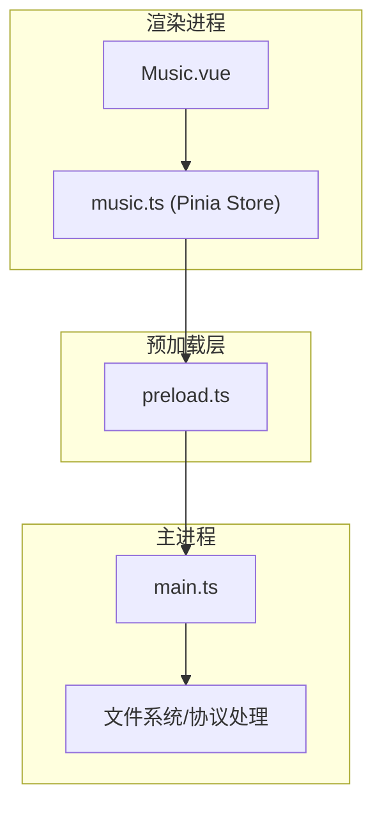
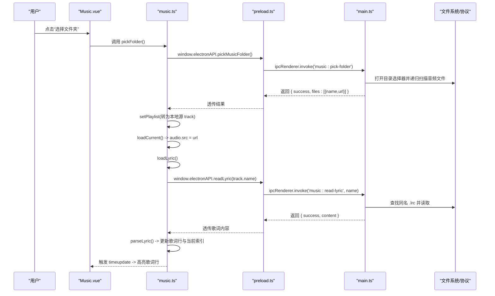
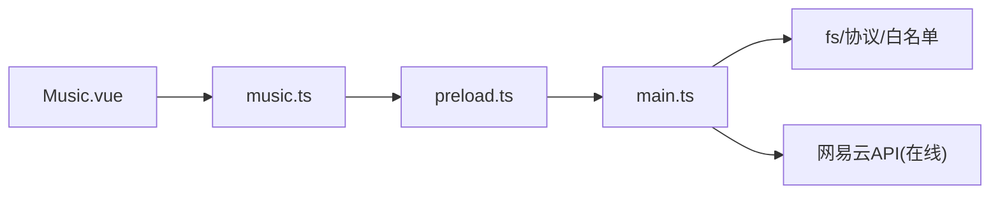

# 本地音乐文件管理

<cite>
**本文引用的文件**
- [src/main/main.ts](file://src/main/main.ts)
- [src/preload/preload.ts](file://src/preload/preload.ts)
- [src/renderer/src/stores/music.ts](file://src/renderer/src/stores/music.ts)
- [src/renderer/src/views/Music.vue](file://src/renderer/src/views/Music.vue)
</cite>

## 目录
1. [简介](#简介)
2. [项目结构](#项目结构)
3. [核心组件](#核心组件)
4. [架构总览](#架构总览)
5. [详细组件分析](#详细组件分析)
6. [依赖关系分析](#依赖关系分析)
7. [性能考量](#性能考量)
8. [故障排查指南](#故障排查指南)
9. [结论](#结论)
10. [附录：完整集成流程示例](#附录完整集成流程示例)

## 简介
本文件面向“本地音乐文件管理”能力，覆盖从文件夹选择、文件扫描、播放到歌词解析与显示的完整链路。重点说明以下 IPC 接口：
- pickMusicFolder：选择本地音乐文件夹并返回可播放清单
- restoreMusicFolder：恢复上次选择的音乐文件夹
- readLyric：根据当前曲目名称读取同目录 .lrc 歌词文件

同时涵盖：
- 本地音乐扫描机制与支持的音频格式
- 歌词文件匹配规则（同名 .lrc）
- 基于私有协议 kaoyan-music:// 的流式播放与安全白名单校验
- 前端播放器与歌词展示集成要点

## 项目结构
本项目采用 Electron 多进程架构：
- 主进程（main）：负责文件系统访问、私有协议处理、IPC 服务
- 预加载脚本（preload）：通过 contextBridge 暴露安全 API 给渲染进程
- 渲染进程（renderer）：Vue 界面与 Pinia 状态管理，调用 electronAPI 完成业务逻辑

图表来源
- [src/renderer/src/views/Music.vue:1-120](file://src/renderer/src/views/Music.vue#L1-L120)
- [src/renderer/src/stores/music.ts:284-306](file://src/renderer/src/stores/music.ts#L284-L306)
- [src/preload/preload.ts:23-28](file://src/preload/preload.ts#L23-L28)
- [src/main/main.ts:704-840](file://src/main/main.ts#L704-L840)

章节来源
- [src/main/main.ts:1-200](file://src/main/main.ts#L1-L200)
- [src/preload/preload.ts:1-40](file://src/preload/preload.ts#L1-L40)
- [src/renderer/src/stores/music.ts:1-100](file://src/renderer/src/stores/music.ts#L1-L100)
- [src/renderer/src/views/Music.vue:1-120](file://src/renderer/src/views/Music.vue#L1-L120)

## 核心组件
- 主进程 IPC 服务
  - music:pick-folder：打开系统目录选择器，递归扫描支持的音乐扩展名，构建 token->绝对路径白名单，返回相对路径与 kaoyan-music:// 协议 URL 列表
  - music:restore-folder：读取持久化的音乐文件夹配置，若存在则重建白名单并返回文件清单
  - music:read-lyric：根据当前曲目的相对路径推断同名 .lrc 文件并读取内容
- 预加载桥接
  - 暴露 pickMusicFolder、restoreMusicFolder、readLyric 等方法供渲染进程调用
- 渲染进程状态与播放器
  - store.music.ts：封装 Audio 播放、歌词解析、在线/本地统一播放逻辑、错误重试等
  - Music.vue：提供 UI 交互（选择文件夹、播放控制、歌词滚动高亮等）

章节来源
- [src/main/main.ts:704-840](file://src/main/main.ts#L704-L840)
- [src/preload/preload.ts:23-28](file://src/preload/preload.ts#L23-L28)
- [src/renderer/src/stores/music.ts:171-252](file://src/renderer/src/stores/music.ts#L171-L252)
- [src/renderer/src/views/Music.vue:99-117](file://src/renderer/src/views/Music.vue#L99-L117)

## 架构总览
下图展示了从用户点击“选择文件夹”到播放本地音乐并显示歌词的端到端流程。

图表来源
- [src/renderer/src/views/Music.vue:18-23](file://src/renderer/src/views/Music.vue#L18-L23)
- [src/renderer/src/stores/music.ts:284-306](file://src/renderer/src/stores/music.ts#L284-L306)
- [src/preload/preload.ts:23-28](file://src/preload/preload.ts#L23-L28)
- [src/main/main.ts:704-840](file://src/main/main.ts#L704-L840)

## 详细组件分析

### IPC 接口：music:pick-folder
- 功能
  - 弹出系统目录选择器，递归遍历子目录
  - 仅收集支持的音乐扩展名（不读取文件内容），限制最大文件数
  - 为每个文件生成随机 token，建立 token->绝对路径白名单映射
  - 返回相对路径与 kaoyan-music:// 协议 URL 列表
- 参数
  - 无
- 返回数据格式
  - success: boolean
  - canceled: boolean
  - files: Array<{ name: string; url: string }>
    - name: 相对于所选根目录的相对路径
    - url: 形如 kaoyan-music://{token}
- 使用场景
  - 首次导入本地音乐库；或更换音乐目录后重新扫描
- 关键实现要点
  - 支持扩展名集合：mp3、flac、wav、ogg、m4a、aac、wma、opus
  - 最大文件数限制：避免超大目录导致卡顿
  - 排序：按中文 localeCompare 排序，提升可读性
  - 持久化：保存所选文件夹路径以便恢复

章节来源
- [src/main/main.ts:84-95](file://src/main/main.ts#L84-L95)
- [src/main/main.ts:704-761](file://src/main/main.ts#L704-L761)
- [src/main/main.ts:137-159](file://src/main/main.ts#L137-L159)

### IPC 接口：music:restore-folder
- 功能
  - 读取上次选择的音乐文件夹路径，若存在且有效则重建白名单并返回文件清单
- 参数
  - 无
- 返回数据格式
  - success: boolean
  - canceled: boolean
  - files: Array<{ name: string; url: string }>
- 使用场景
  - 应用启动时自动恢复上次音乐库，减少重复操作
- 关键实现要点
  - 校验文件夹是否存在
  - 与 pick-folder 相同的扫描与白名单构建逻辑

章节来源
- [src/main/main.ts:764-818](file://src/main/main.ts#L764-L818)
- [src/main/main.ts:147-159](file://src/main/main.ts#L147-L159)

### IPC 接口：music:read-lyric
- 功能
  - 根据当前曲目的相对路径，定位同名 .lrc 歌词文件并读取内容
- 参数
  - trackName: string（来自当前曲目的 name 字段，即相对路径）
- 返回数据格式
  - success: boolean
  - content: string（.lrc 文本内容，未找到则为空）
- 使用场景
  - 切换曲目时加载对应歌词；在线歌曲走网易云歌词接口，本地歌曲走此接口
- 关键实现要点
  - 匹配规则：将音频文件名替换扩展名为 .lrc
  - 仅在已设置 musicRootDir 时生效，确保路径安全

章节来源
- [src/main/main.ts:821-840](file://src/main/main.ts#L821-L840)
- [src/renderer/src/stores/music.ts:191-236](file://src/renderer/src/stores/music.ts#L191-L236)

### 本地音乐扫描机制与文件格式支持
- 扫描策略
  - 递归遍历所选根目录及其所有子目录
  - 仅记录相对路径，不读取文件内容，降低内存占用
  - 限制最大文件数量，防止超大目录导致性能问题
- 支持的文件格式
  - mp3、flac、wav、ogg、m4a、aac、wma、opus
- 输出
  - 返回相对路径与 kaoyan-music:// 协议 URL，用于后续流式播放

章节来源
- [src/main/main.ts:84-95](file://src/main/main.ts#L84-L95)
- [src/main/main.ts:717-761](file://src/main/main.ts#L717-L761)
- [src/main/main.ts:776-818](file://src/main/main.ts#L776-L818)

### 歌词文件匹配规则与解析
- 匹配规则
  - 以当前曲目的相对路径为基础，将音频扩展名替换为 .lrc，例如：path/to/song.mp3 -> path/to/song.lrc
  - 若文件存在则读取，否则返回空内容
- 解析逻辑
  - 支持标准 LRC 时间标签：[mm:ss.xx]text
  - 解析为时间戳（秒）与文本对，并按时间排序
  - 播放过程中根据 currentTime 计算当前高亮歌词行索引
- 在线歌曲歌词
  - 当 source 为 online 且具备 id 时，通过网易云歌词接口获取歌词

章节来源
- [src/main/main.ts:821-840](file://src/main/main.ts#L821-L840)
- [src/renderer/src/stores/music.ts:171-236](file://src/renderer/src/stores/music.ts#L171-L236)

### 播放与歌词显示集成
- 播放
  - 本地文件通过 kaoyan-music:// 协议由主进程流式响应，支持 Range 请求，适合大文件与拖动进度
  - 在线歌曲通过网易云接口获取直链，store 内置错误重试与 URL 刷新机制
- 歌词显示
  - 切换曲目时调用 loadLyric，优先在线歌词，其次本地 .lrc
  - 监听 timeupdate 事件，实时更新当前歌词行索引，并在 UI 中滚动高亮

章节来源
- [src/main/main.ts:408-478](file://src/main/main.ts#L408-L478)
- [src/renderer/src/stores/music.ts:140-164](file://src/renderer/src/stores/music.ts#L140-L164)
- [src/renderer/src/stores/music.ts:191-252](file://src/renderer/src/stores/music.ts#L191-L252)
- [src/renderer/src/views/Music.vue:99-117](file://src/renderer/src/views/Music.vue#L99-L117)

## 依赖关系分析
- 渲染进程依赖
  - Music.vue 调用 store 方法（pickFolder、play、loadLyric 等）
  - store 通过 preload 暴露的 electronAPI 调用主进程 IPC
- 主进程依赖
  - 文件系统：fs 模块进行目录扫描与文件读取
  - 协议处理：kaoyan-music:// 与 kaoyan-material:// 等自定义协议
  - 安全校验：白名单 token 与根目录前缀校验，防止越权访问
- 外部依赖
  - 网易云 API：在线搜索、歌词、评论、登录等（与本主题相关的是歌词与播放地址）

图表来源
- [src/renderer/src/views/Music.vue:18-23](file://src/renderer/src/views/Music.vue#L18-L23)
- [src/renderer/src/stores/music.ts:284-306](file://src/renderer/src/stores/music.ts#L284-L306)
- [src/preload/preload.ts:23-28](file://src/preload/preload.ts#L23-L28)
- [src/main/main.ts:704-840](file://src/main/main.ts#L704-L840)

章节来源
- [src/main/main.ts:704-840](file://src/main/main.ts#L704-L840)
- [src/preload/preload.ts:23-28](file://src/preload/preload.ts#L23-L28)
- [src/renderer/src/stores/music.ts:284-306](file://src/renderer/src/stores/music.ts#L284-L306)

## 性能考量
- 大目录扫描
  - 仅记录相对路径，不读取文件内容，降低内存占用
  - 限制最大文件数，避免超长列表导致的 UI 卡顿
- 流式播放
  - 使用 ReadableStream + Range 请求，支持大文件与拖动进度，避免一次性加载
- 歌词解析
  - 简单正则解析，时间复杂度与行数线性相关；按时间排序保证高效查找
- 在线资源
  - 错误时自动刷新 URL 并重试，提高稳定性

章节来源
- [src/main/main.ts:717-761](file://src/main/main.ts#L717-L761)
- [src/main/main.ts:408-478](file://src/main/main.ts#L408-L478)
- [src/renderer/src/stores/music.ts:171-189](file://src/renderer/src/stores/music.ts#L171-L189)
- [src/renderer/src/stores/music.ts:102-138](file://src/renderer/src/stores/music.ts#L102-L138)

## 故障排查指南
- 无法选择文件夹或返回空列表
  - 检查所选目录是否包含受支持的音频扩展名
  - 确认未超过最大文件数限制
  - 查看控制台是否有权限或 I/O 异常
- 恢复失败
  - 检查持久化配置文件是否损坏或目录已被移动/删除
- 歌词不显示
  - 确认 .lrc 文件与音频文件同名且位于同一目录
  - 检查 readLyric 是否成功返回 content
  - 在线歌曲需确保网络可用且网易云接口正常
- 播放失败或中断
  - 本地：检查 kaoyan-music:// 协议是否被正确注册与白名单校验通过
  - 在线：检查 URL 是否过期，store 会自动重试；必要时手动刷新

章节来源
- [src/main/main.ts:704-840](file://src/main/main.ts#L704-L840)
- [src/renderer/src/stores/music.ts:102-138](file://src/renderer/src/stores/music.ts#L102-L138)
- [src/renderer/src/stores/music.ts:191-236](file://src/renderer/src/stores/music.ts#L191-L236)

## 结论
本项目实现了完整的本地音乐文件管理能力，包括安全的目录选择与扫描、基于私有协议的流式播放、以及本地与在线歌词的统一解析与展示。通过 IPC 接口与白名单机制，既保证了用户体验，也确保了安全性与性能。

## 附录：完整集成流程示例
以下为从文件夹选择到歌词显示的完整集成步骤（概念性流程，非代码片段）：
- 用户在 Music.vue 点击“选择文件夹”
- store 调用 pickFolder()，通过 preload 调用主进程的 music:pick-folder
- 主进程扫描目录，返回文件清单（相对路径与 kaoyan-music:// URL）
- store 将结果转换为本地源 track 列表，并设置当前曲目
- 播放时，audio.src 指向 kaoyan-music:// URL，主进程流式响应
- 切换曲目时，store 调用 loadLyric()：
  - 在线歌曲：调用网易云歌词接口
  - 本地歌曲：调用 readLyric 读取同名 .lrc
- 播放过程中，timeupdate 事件驱动歌词高亮与滚动

章节来源
- [src/renderer/src/views/Music.vue:18-23](file://src/renderer/src/views/Music.vue#L18-L23)
- [src/renderer/src/stores/music.ts:284-306](file://src/renderer/src/stores/music.ts#L284-L306)
- [src/renderer/src/stores/music.ts:191-252](file://src/renderer/src/stores/music.ts#L191-L252)
- [src/main/main.ts:704-840](file://src/main/main.ts#L704-L840)