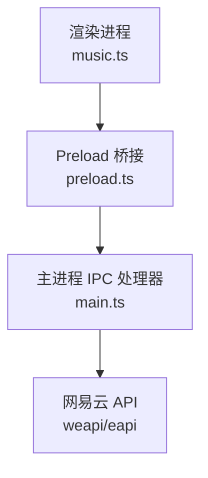
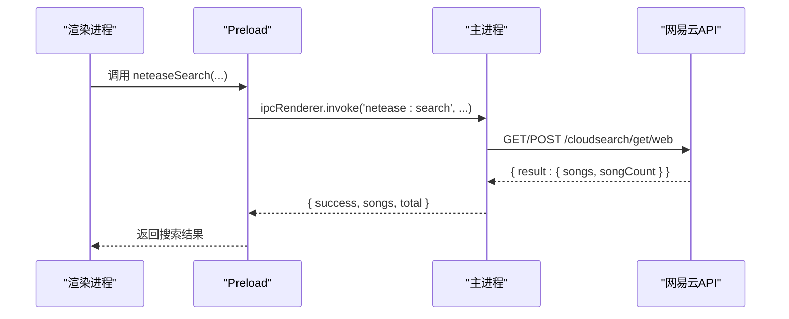
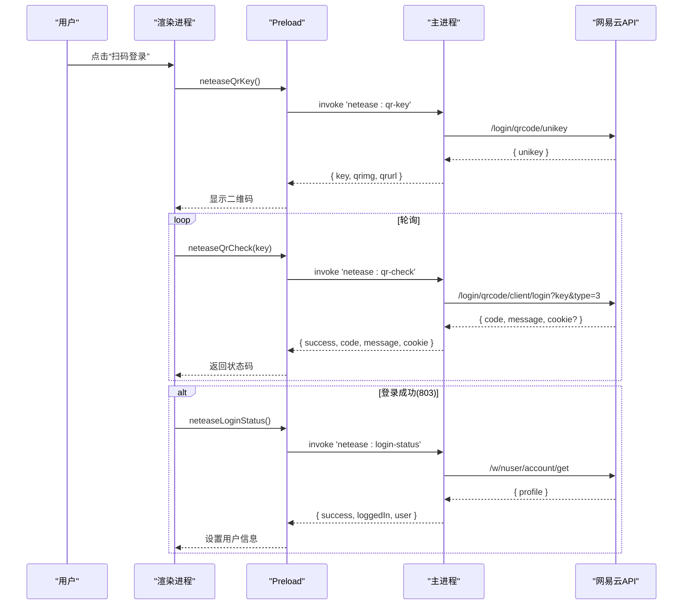
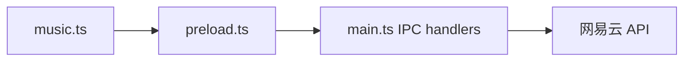

# 网易云音乐API接口

<cite>
**本文引用的文件**
- [src/main/main.ts](file://src/main/main.ts)
- [src/preload/preload.ts](file://src/preload/preload.ts)
- [src/renderer/src/stores/music.ts](file://src/renderer/src/stores/music.ts)
- [src/renderer/src/vite-env.d.ts](file://src/renderer/src/vite-env.d.ts)
</cite>

## 目录
1. [简介](#简介)
2. [项目结构](#项目结构)
3. [核心组件](#核心组件)
4. [架构总览](#架构总览)
5. [详细组件分析](#详细组件分析)
6. [依赖关系分析](#依赖关系分析)
7. [性能与最佳实践](#性能与最佳实践)
8. [故障排查指南](#故障排查指南)
9. [结论](#结论)
10. [附录：IPC 接口清单](#附录ipc-接口清单)

## 简介
本文件为应用内“网易云音乐”相关能力的完整 IPC 接口文档，覆盖搜索、歌词、登录认证（二维码/手机号/Cookie）、歌单管理、评论、热搜、排行榜、用户详情、心动模式、喜欢列表、云盘歌曲等。所有能力通过 Electron 的 preload 层暴露给渲染进程，由主进程统一调用网易云 API 并返回标准化结果。

## 项目结构
- 渲染进程（Vue + Pinia）：业务逻辑与 UI 状态管理，调用 window.electronAPI 提供的 IPC 方法。
- Preload 层：使用 contextBridge 将主进程能力安全暴露给渲染进程。
- 主进程：实现 netease:* 系列 IPC 处理器，封装请求、鉴权、Cookie 持久化与错误处理。

图表来源
- [src/renderer/src/stores/music.ts:435-483](file://src/renderer/src/stores/music.ts#L435-L483)
- [src/preload/preload.ts:39-69](file://src/preload/preload.ts#L39-L69)
- [src/main/main.ts:1335-1387](file://src/main/main.ts#L1335-L1387)

章节来源
- [src/preload/preload.ts:39-69](file://src/preload/preload.ts#L39-L69)
- [src/renderer/src/stores/music.ts:435-483](file://src/renderer/src/stores/music.ts#L435-L483)
- [src/main/main.ts:1335-1387](file://src/main/main.ts#L1335-L1387)

## 核心组件
- 搜索：neteaseSearch
- 歌词：neteaseLyric
- 登录认证：neteaseQrKey、neteaseQrCheck、neteaseLoginStatus、neteaseLogout、neteaseSetCookie、neteaseLoginPhone
- 歌单：neteaseUserPlaylist、neteasePlaylistDetail
- 播放URL：neteaseSongUrl
- 评论：neteaseComments、neteaseCommentLike
- 热搜/排行榜：neteaseHotSearch、neteaseToplist、neteaseToplistDetail
- 用户：neteaseUserDetail、neteaseUserAccount
- 喜欢与推荐：neteaseLike、neteaseSongLikeStatus、neteaseLikelist、neteaseIntelligenceList
- 云盘：neteaseCloudDrive

章节来源
- [src/preload/preload.ts:39-69](file://src/preload/preload.ts#L39-L69)
- [src/renderer/src/vite-env.d.ts:99-202](file://src/renderer/src/vite-env.d.ts#L99-L202)

## 架构总览
下图展示从渲染进程到主进程的调用链，以及主进程对网易云 API 的统一封装。

图表来源
- [src/preload/preload.ts:40-40](file://src/preload/preload.ts#L40-L40)
- [src/main/main.ts:1335-1354](file://src/main/main.ts#L1335-L1354)

章节来源
- [src/preload/preload.ts:39-69](file://src/preload/preload.ts#L39-L69)
- [src/main/main.ts:1335-1354](file://src/main/main.ts#L1335-L1354)

## 详细组件分析

### 搜索接口 neteaseSearch
- 功能：根据关键词搜索歌曲，返回歌曲列表与总数。
- 参数：
  - keyword: string
  - limit?: number（默认 30）
  - offset?: number（默认 0）
- 返回值：
  - success: boolean
  - songs?: Array<{ id, name, artist, album, cover }>
  - total?: number
  - message?: string
- 错误处理：异常时返回 success=false 及 message。
- 典型用法：在 music store 中调用后更新 searchResults。

章节来源
- [src/preload/preload.ts:40-40](file://src/preload/preload.ts#L40-L40)
- [src/renderer/src/vite-env.d.ts:99-104](file://src/renderer/src/vite-env.d.ts#L99-L104)
- [src/main/main.ts:1335-1354](file://src/main/main.ts#L1335-L1354)
- [src/renderer/src/stores/music.ts:435-454](file://src/renderer/src/stores/music.ts#L435-L454)

### 歌词接口 neteaseLyric
- 功能：获取指定歌曲的歌词（含简谱/翻译）。
- 参数：id: number
- 返回值：
  - success: boolean
  - lyric?: string
  - tlyric?: string
  - message?: string
- 错误处理：异常时返回 success=false 及 message。
- 典型用法：在线曲目播放时自动加载歌词并解析时间轴。

章节来源
- [src/preload/preload.ts:42-42](file://src/preload/preload.ts#L42-L42)
- [src/renderer/src/vite-env.d.ts:110-115](file://src/renderer/src/vite-env.d.ts#L110-L115)
- [src/main/main.ts:1390-1402](file://src/main/main.ts#L1390-L1402)
- [src/renderer/src/stores/music.ts:191-236](file://src/renderer/src/stores/music.ts#L191-L236)

### 登录认证流程（二维码）
- 生成二维码 key：neteaseQrKey
  - 返回值：{ success, key?, qrimg?, qrurl?, message? }
  - 说明：后端会尝试多个端点获取 unikey，并通过在线服务生成二维码图片。
- 轮询登录状态：neteaseQrCheck(key)
  - 返回值：{ success, code?, message?, cookie? }
  - 状态码：801=等待扫码；802=扫码待确认；803=登录成功；800=过期
  - 说明：登录成功时 Cookie 会被持久化。
- 检查登录态：neteaseLoginStatus
  - 返回值：{ success, loggedIn?, user?, message? }
  - 说明：若已登录，返回用户信息。
- 退出登录：neteaseLogout
  - 返回值：{ success }
  - 说明：清除本地 Cookie。
- Cookie 登录：neteaseSetCookie(cookieStr)
  - 返回值：{ success, loggedIn, user?, message? }
  - 说明：解析 Cookie 字符串并验证登录态。
- 手机号登录：neteaseLoginPhone(phone, password, countrycode?)
  - 返回值：{ success, loggedIn, user?, message? }
  - 说明：密码 MD5 加密后提交。

图表来源
- [src/main/main.ts:1412-1473](file://src/main/main.ts#L1412-L1473)
- [src/main/main.ts:1476-1510](file://src/main/main.ts#L1476-L1510)
- [src/preload/preload.ts:44-47](file://src/preload/preload.ts#L44-L47)
- [src/renderer/src/stores/music.ts:619-652](file://src/renderer/src/stores/music.ts#L619-L652)

章节来源
- [src/preload/preload.ts:44-50](file://src/preload/preload.ts#L44-L50)
- [src/main/main.ts:1412-1510](file://src/main/main.ts#L1412-L1510)
- [src/renderer/src/stores/music.ts:619-652](file://src/renderer/src/stores/music.ts#L619-L652)

### 歌曲 URL 获取 neteaseSongUrl
- 功能：批量获取歌曲播放地址，支持音质等级选择。
- 参数：
  - ids: number[]
  - level?: string（standard/higher/exhigh/lossless/hires，默认 exhigh）
- 返回值：
  - success: boolean
  - urls?: Array<{ id, url|null, br }>
  - message?: string
- 降级策略：优先 /song/url/v1，失败则回退至旧版接口并按音质映射比特率。
- 错误处理：异常返回 success=false 及 message。

章节来源
- [src/preload/preload.ts:41-41](file://src/preload/preload.ts#L41-L41)
- [src/renderer/src/vite-env.d.ts:105-109](file://src/renderer/src/vite-env.d.ts#L105-L109)
- [src/main/main.ts:1357-1387](file://src/main/main.ts#L1357-L1387)
- [src/renderer/src/stores/music.ts:456-483](file://src/renderer/src/stores/music.ts#L456-L483)

### 歌单管理
- 用户歌单列表：neteaseUserPlaylist(uid, limit?, offset?)
  - 返回值：{ success, playlists[], message? }
- 歌单详情：neteasePlaylistDetail(id)
  - 返回值：{ success, playlist?, tracks[], message? }
- 错误处理：异常返回 success=false 及 message。

章节来源
- [src/preload/preload.ts:51-52](file://src/preload/preload.ts#L51-L52)
- [src/renderer/src/vite-env.d.ts:129-139](file://src/renderer/src/vite-env.d.ts#L129-L139)
- [src/main/main.ts:1603-1674](file://src/main/main.ts#L1603-L1674)
- [src/renderer/src/stores/music.ts:675-700](file://src/renderer/src/stores/music.ts#L675-L700)

### 评论查询与点赞
- 评论查询：neteaseComments(id, pageNo?, pageSize?, sortType?)
  - 返回值：{ success, comments[], hotComments[], total?, message? }
- 评论点赞：neteaseCommentLike(songId, commentId, like)
  - 返回值：{ success, liked, message? }
- 错误处理：异常返回 success=false 及 message。

章节来源
- [src/preload/preload.ts:54-54](file://src/preload/preload.ts#L54-L54)
- [src/renderer/src/vite-env.d.ts:141-147](file://src/renderer/src/vite-env.d.ts#L141-L147)
- [src/main/main.ts:1677-1722](file://src/main/main.ts#L1677-L1722)
- [src/main/main.ts:2027-2042](file://src/main/main.ts#L2027-L2042)

### 热搜列表与排行榜
- 热搜：neteaseHotSearch()
  - 返回值：{ success, hots[], message? }
- 排行榜列表：neteaseToplist()
  - 返回值：{ success, lists[], message? }
- 排行榜详情：neteaseToplistDetail(id)
  - 返回值：{ success, playlist?, tracks[], message? }
- 错误处理：异常返回 success=false 及 message。

章节来源
- [src/preload/preload.ts:56-58](file://src/preload/preload.ts#L56-L58)
- [src/renderer/src/vite-env.d.ts:149-164](file://src/renderer/src/vite-env.d.ts#L149-L164)
- [src/main/main.ts:1726-1814](file://src/main/main.ts#L1726-L1814)

### 用户详情与账号信息
- 用户详情：neteaseUserDetail(uid)
  - 返回值：{ success, user?, message? }
- 账号信息：neteaseUserAccount()
  - 返回值：{ success, data?, message? }
- 错误处理：异常返回 success=false 及 message。

章节来源
- [src/preload/preload.ts:59-60](file://src/preload/preload.ts#L59-L60)
- [src/renderer/src/vite-env.d.ts:165-181](file://src/renderer/src/vite-env.d.ts#L165-L181)
- [src/main/main.ts:1818-1892](file://src/main/main.ts#L1818-L1892)

### 喜欢与推荐
- 喜欢/取消喜欢：neteaseLike(songId, like?)
  - 返回值：{ success, liked, message? }
- 歌曲是否已喜欢：neteaseSongLikeStatus(songId)
  - 返回值：{ success, liked, likedMap, message? }
- 喜欢列表：neteaseLikelist(uid?)
  - 返回值：{ success, ids[], message? }
- 心动模式：neteaseIntelligenceList(songId, playlistId)
  - 返回值：{ success, songs[], message? }
- 错误处理：异常返回 success=false 及 message。

章节来源
- [src/preload/preload.ts:61-65](file://src/preload/preload.ts#L61-L65)
- [src/renderer/src/vite-env.d.ts:182-190](file://src/renderer/src/vite-env.d.ts#L182-L190)
- [src/main/main.ts:1896-2023](file://src/main/main.ts#L1896-L2023)

### 云盘歌曲
- 云盘列表：neteaseCloudDrive(pageSize?, pageNo?)
  - 返回值：{ success, songs[], count?, message? }
- 错误处理：异常返回 success=false 及 message。

章节来源
- [src/preload/preload.ts:69-69](file://src/preload/preload.ts#L69-L69)
- [src/renderer/src/vite-env.d.ts:194-202](file://src/renderer/src/vite-env.d.ts#L194-L202)
- [src/main/main.ts:2046-2100](file://src/main/main.ts#L2046-L2100)

## 依赖关系分析
- 渲染进程依赖 preload 暴露的 window.electronAPI。
- preload 仅做转发，不承载业务逻辑。
- 主进程集中处理网络请求、Cookie 管理与错误包装。
- 各模块之间通过标准化的 { success, ... } 响应结构解耦。

图表来源
- [src/renderer/src/stores/music.ts:435-483](file://src/renderer/src/stores/music.ts#L435-L483)
- [src/preload/preload.ts:39-69](file://src/preload/preload.ts#L39-L69)
- [src/main/main.ts:1335-1387](file://src/main/main.ts#L1335-L1387)

章节来源
- [src/renderer/src/stores/music.ts:435-483](file://src/renderer/src/stores/music.ts#L435-L483)
- [src/preload/preload.ts:39-69](file://src/preload/preload.ts#L39-L69)
- [src/main/main.ts:1335-1387](file://src/main/main.ts#L1335-L1387)

## 性能与最佳实践
- 批量获取 URL：按 20 首一批调用 neteaseSongUrl，避免单次过大请求。
- 音质选择：合理设置 level，exhigh 兼顾清晰度与稳定性。
- 歌词加载：在线曲目优先走 neteaseLyric，本地 .lrc 作为备选。
- 登录态缓存：登录成功后拉取 likelist 并缓存，减少重复请求。
- 错误重试：播放失败时自动刷新 URL（最多两次），提升容错。
- 分页与节流：评论、歌单、排行榜等接口注意分页参数，避免频繁刷新。

[本节为通用建议，无需具体代码引用]

## 故障排查指南
- 二维码不显示：检查 neteaseQrKey 返回的 qrimg/qrurl，确保网络可访问外部二维码生成服务。
- 扫码无响应：确认 neteaseQrCheck 轮询间隔与 key 未过期（800=过期需重新获取）。
- 登录失败：检查 neteaseSetCookie 或 neteaseLoginPhone 返回的 message，确认 Cookie 有效或密码正确。
- 播放失败：触发 error 事件后自动刷新 URL；若仍失败，检查 neteaseSongUrl 返回的 url 是否为空。
- 评论/点赞失败：检查 neteaseCommentLike 返回的 liked 与 message，确认线程 ID 格式正确。

章节来源
- [src/main/main.ts:1412-1473](file://src/main/main.ts#L1412-L1473)
- [src/main/main.ts:1513-1548](file://src/main/main.ts#L1513-L1548)
- [src/main/main.ts:1357-1387](file://src/main/main.ts#L1357-L1387)
- [src/main/main.ts:2027-2042](file://src/main/main.ts#L2027-L2042)

## 结论
本项目通过统一的 IPC 抽象，将网易云音乐的搜索、歌词、登录、歌单、评论、热搜、排行榜、用户、喜欢与推荐、云盘等功能稳定地暴露给前端。所有接口均提供一致的 { success, ... } 响应结构与完善的错误处理，便于上层业务快速集成与扩展。

[本节为总结性内容，无需具体代码引用]

## 附录：IPC 接口清单
- neteaseSearch(keyword, limit?, offset?) → { success, songs?, total?, message? }
- neteaseSongUrl(ids, level?) → { success, urls?, message? }
- neteaseLyric(id) → { success, lyric?, tlyric?, message? }
- neteaseQrKey() → { success, key?, qrimg?, qrurl?, message? }
- neteaseQrCheck(key) → { success, code?, message?, cookie? }
- neteaseLoginStatus() → { success, loggedIn?, user?, message? }
- neteaseLogout() → { success }
- neteaseSetCookie(cookieStr) → { success, loggedIn, user?, message? }
- neteaseLoginPhone(phone, password, countrycode?) → { success, loggedIn, user?, message? }
- neteaseUserPlaylist(uid, limit?, offset?) → { success, playlists?, message? }
- neteasePlaylistDetail(id) → { success, playlist?, tracks?, message? }
- neteaseComments(id, pageNo?, pageSize?, sortType?) → { success, comments?, hotComments?, total?, message? }
- neteaseHotSearch() → { success, hots?, message? }
- neteaseToplist() → { success, lists?, message? }
- neteaseToplistDetail(id) → { success, playlist?, tracks?, message? }
- neteaseUserDetail(uid) → { success, user?, message? }
- neteaseUserAccount() → { success, data?, message? }
- neteaseLike(songId, like?) → { success, liked, message? }
- neteaseSongLikeStatus(songId) → { success, liked, likedMap, message? }
- neteaseLikelist(uid?) → { success, ids?, message? }
- neteaseIntelligenceList(songId, playlistId) → { success, songs?, message? }
- neteaseCommentLike(songId, commentId, like) → { success, liked, message? }
- neteaseCloudDrive(pageSize?, pageNo?) → { success, songs?, count?, message? }

章节来源
- [src/preload/preload.ts:39-69](file://src/preload/preload.ts#L39-L69)
- [src/renderer/src/vite-env.d.ts:99-202](file://src/renderer/src/vite-env.d.ts#L99-L202)
- [src/main/main.ts:1335-2100](file://src/main/main.ts#L1335-L2100)