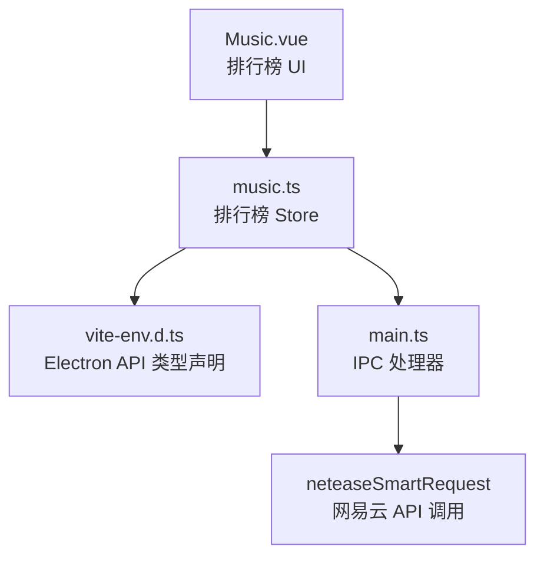
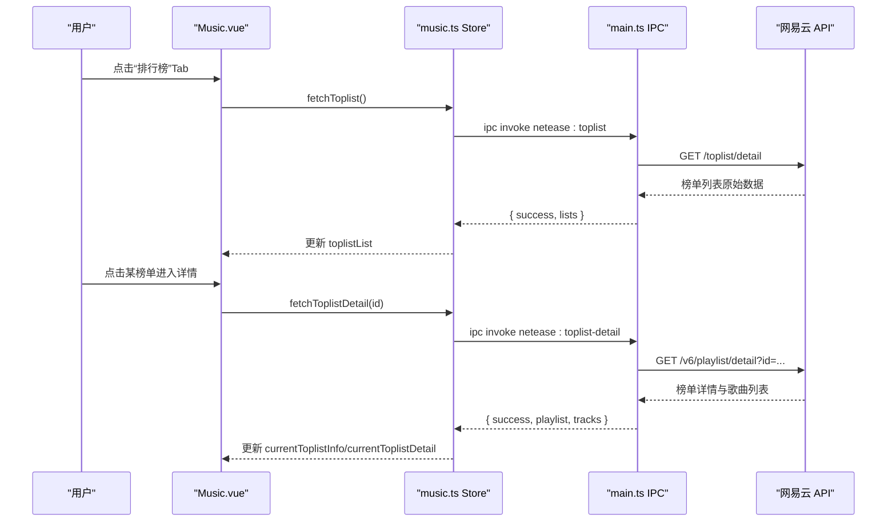
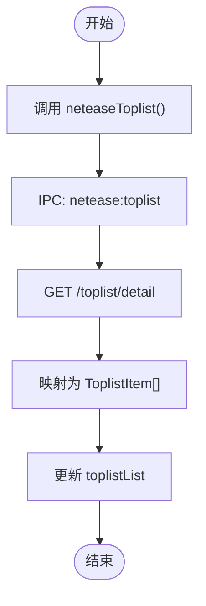
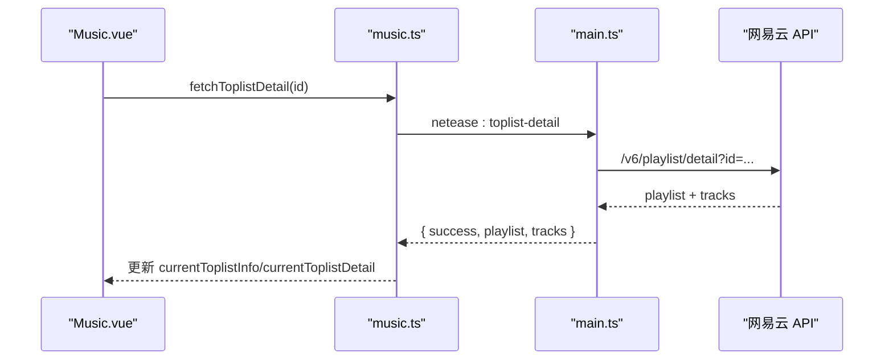
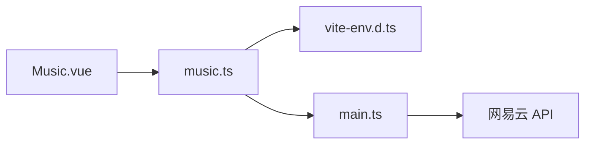

# 网易云音乐排行榜接口

<cite>
**本文引用的文件**
- [src/main/main.ts](file://src/main/main.ts)
- [src/renderer/src/stores/music.ts](file://src/renderer/src/stores/music.ts)
- [src/renderer/src/views/Music.vue](file://src/renderer/src/views/Music.vue)
- [src/renderer/src/vite-env.d.ts](file://src/renderer/src/vite-env.d.ts)
</cite>

## 目录
1. [简介](#简介)
2. [项目结构](#项目结构)
3. [核心组件](#核心组件)
4. [架构总览](#架构总览)
5. [详细组件分析](#详细组件分析)
6. [依赖关系分析](#依赖关系分析)
7. [性能与可用性](#性能与可用性)
8. [故障排查](#故障排查)
9. [结论](#结论)
10. [附录：API 契约与数据结构](#附录api-契约与数据结构)

## 简介
本文件面向“网易云音乐排行榜”功能，覆盖以下能力：
- 排行榜列表查询（neteaseToplist）
- 排行榜详情查询（neteaseToplistDetail），含歌曲排行数据
- 前端交互、状态管理、主进程 IPC 调用链路
- 数据获取、实时更新策略与历史对比思路
- 数据分析、热门歌曲追踪与音乐趋势预测的应用场景建议

该功能基于 Electron 的渲染进程与主进程通信，通过封装的 neteaseSmartRequest 访问网易云 API，并在前端以 Pinia store 管理状态与业务逻辑。

## 项目结构
围绕排行榜功能的代码主要分布在三个位置：
- 主进程：提供 IPC 处理器，负责调用网易云接口并返回标准化结果
- 渲染进程 Store：定义排行榜相关类型、状态与方法，封装对 IPC 的调用
- 渲染进程视图：提供排行榜 Tab、列表展示、详情查看与播放操作

图表来源
- [src/renderer/src/views/Music.vue:339-423](file://src/renderer/src/views/Music.vue#L339-L423)
- [src/renderer/src/stores/music.ts:852-894](file://src/renderer/src/stores/music.ts#L852-L894)
- [src/renderer/src/vite-env.d.ts:151-164](file://src/renderer/src/vite-env.d.ts#L151-L164)
- [src/main/main.ts:1744-1814](file://src/main/main.ts#L1744-L1814)

章节来源
- [src/renderer/src/views/Music.vue:339-423](file://src/renderer/src/views/Music.vue#L339-L423)
- [src/renderer/src/stores/music.ts:852-894](file://src/renderer/src/stores/music.ts#L852-L894)
- [src/main/main.ts:1744-1814](file://src/main/main.ts#L1744-L1814)
- [src/renderer/src/vite-env.d.ts:151-164](file://src/renderer/src/vite-env.d.ts#L151-L164)

## 核心组件
- 排行榜列表（neteaseToplist）
  - 作用：获取所有可用排行榜条目，包含封面、更新频率、描述、播放量与前三首预览曲目
  - 入口：渲染端调用 window.electronAPI.neteaseToplist()
  - 主处理：ipcMain.handle('netease:toplist') 调用 /toplist/detail 并映射为统一结构
- 排行榜详情（neteaseToplistDetail）
  - 作用：根据榜单 id 获取完整歌曲列表及榜单元信息
  - 入口：渲染端调用 window.electronAPI.neteaseToplistDetail(id)
  - 主处理：ipcMain.handle('netease:toplist-detail') 调用 /v6/playlist/detail 并映射为统一结构

章节来源
- [src/renderer/src/stores/music.ts:852-894](file://src/renderer/src/stores/music.ts#L852-L894)
- [src/main/main.ts:1744-1814](file://src/main/main.ts#L1744-L1814)
- [src/renderer/src/vite-env.d.ts:151-164](file://src/renderer/src/vite-env.d.ts#L151-L164)

## 架构总览
排行榜功能采用“渲染层 UI + Store 状态管理 + 主进程 IPC 代理”的分层架构。渲染层仅关注交互与展示；Store 负责状态与流程编排；主进程负责网络请求与数据归一化。

图表来源
- [src/renderer/src/views/Music.vue:339-423](file://src/renderer/src/views/Music.vue#L339-L423)
- [src/renderer/src/stores/music.ts:852-894](file://src/renderer/src/stores/music.ts#L852-L894)
- [src/main/main.ts:1744-1814](file://src/main/main.ts#L1744-L1814)

## 详细组件分析

### 排行榜列表（neteaseToplist）
- 触发点
  - 视图：Music.vue 中“排行榜”Tab 刷新按钮调用 music.fetchToplist()
  - Store：music.ts 暴露 fetchToplist()，设置 loading 并调用 IPC
  - 主进程：main.ts 监听 'netease:toplist'，调用 /toplist/detail，提取 list 并映射为 ToplistItem
- 参数与返回
  - 无入参
  - 返回：success、lists（数组），每个元素包含 id、name、cover、updateFrequency、description、playCount、topTracks（最多 3 条）
- 错误处理
  - 主进程捕获异常并返回 success=false 与 message
  - Store 层 try/catch 忽略异常，确保 UI 稳定

图表来源
- [src/renderer/src/stores/music.ts:869-880](file://src/renderer/src/stores/music.ts#L869-L880)
- [src/main/main.ts:1746-1768](file://src/main/main.ts#L1746-L1768)

章节来源
- [src/renderer/src/views/Music.vue:339-377](file://src/renderer/src/views/Music.vue#L339-L377)
- [src/renderer/src/stores/music.ts:852-880](file://src/renderer/src/stores/music.ts#L852-L880)
- [src/main/main.ts:1744-1768](file://src/main/main.ts#L1744-L1768)

### 排行榜详情（neteaseToplistDetail）
- 触发点
  - 视图：点击榜单项 openToplistDetail(id)，设置 viewingToplistId 并调用 music.fetchToplistDetail(id)
  - Store：fetchToplistDetail(id) 设置 loading 并调用 IPC
  - 主进程：监听 'netease:toplist-detail'，调用 /v6/playlist/detail，解析 playlist 与 tracks
- 参数与返回
  - 入参：id（number）
  - 返回：success、playlist（榜单元信息）、tracks（歌曲列表，含 id/name/artist/album/cover/duration）
- 错误处理
  - 若 playlist 不存在，返回 success=false 与 message
  - Store 层 try/catch 忽略异常，保持 UI 稳定

图表来源
- [src/renderer/src/views/Music.vue:379-423](file://src/renderer/src/views/Music.vue#L379-L423)
- [src/renderer/src/stores/music.ts:882-894](file://src/renderer/src/stores/music.ts#L882-L894)
- [src/main/main.ts:1772-1814](file://src/main/main.ts#L1772-L1814)

章节来源
- [src/renderer/src/views/Music.vue:379-423](file://src/renderer/src/views/Music.vue#L379-L423)
- [src/renderer/src/stores/music.ts:882-894](file://src/renderer/src/stores/music.ts#L882-L894)
- [src/main/main.ts:1772-1814](file://src/main/main.ts#L1772-L1814)

### 前端交互与状态管理
- 视图层
  - 排行榜 Tab 切换时调用 onToplistTab()，可在此处预加载或缓存
  - 列表项点击 openToplistDetail(id) 进入详情
  - 支持“播放全部”和“添加到队列”，复用现有播放逻辑
- Store 层
  - 使用 ref 维护 toplistList、currentToplistDetail、currentToplistInfo 等状态
  - 提供 fetchToplist() 与 fetchToplistDetail(id) 方法，封装 loading 与错误处理
- 类型声明
  - vite-env.d.ts 定义了 electronAPI 的 neteaseToplist 与 neteaseToplistDetail 的返回类型，便于 TS 类型检查

章节来源
- [src/renderer/src/views/Music.vue:339-423](file://src/renderer/src/views/Music.vue#L339-L423)
- [src/renderer/src/stores/music.ts:852-894](file://src/renderer/src/stores/music.ts#L852-L894)
- [src/renderer/src/vite-env.d.ts:151-164](file://src/renderer/src/vite-env.d.ts#L151-L164)

## 依赖关系分析
- 模块耦合
  - Music.vue 依赖 music.ts 提供的排行榜方法与状态
  - music.ts 依赖 vite-env.d.ts 的类型声明与 main.ts 暴露的 IPC 方法
  - main.ts 依赖 neteaseSmartRequest 进行网络请求与鉴权
- 外部依赖
  - 网易云 API：/toplist/detail、/v6/playlist/detail
- 潜在循环依赖
  - 当前实现为单向依赖（UI -> Store -> IPC -> API），无循环引用

图表来源
- [src/renderer/src/views/Music.vue:339-423](file://src/renderer/src/views/Music.vue#L339-L423)
- [src/renderer/src/stores/music.ts:852-894](file://src/renderer/src/stores/music.ts#L852-L894)
- [src/main/main.ts:1744-1814](file://src/main/main.ts#L1744-L1814)
- [src/renderer/src/vite-env.d.ts:151-164](file://src/renderer/src/vite-env.d.ts#L151-L164)

章节来源
- [src/renderer/src/views/Music.vue:339-423](file://src/renderer/src/views/Music.vue#L339-L423)
- [src/renderer/src/stores/music.ts:852-894](file://src/renderer/src/stores/music.ts#L852-L894)
- [src/main/main.ts:1744-1814](file://src/main/main.ts#L1744-L1814)
- [src/renderer/src/vite-env.d.ts:151-164](file://src/renderer/src/vite-env.d.ts#L151-L164)

## 性能与可用性
- 列表加载
  - 排行榜列表仅取 topTracks 前 3 条，减少渲染压力
- 详情加载
  - 详情接口使用较大 n 值以拉取完整歌曲列表，建议在大数据量场景下考虑分页或虚拟滚动
- 实时性
  - 排行榜数据由服务端定时更新，前端可通过定时刷新或手动刷新保证时效性
- 错误恢复
  - Store 层 try/catch 避免异常中断 UI；主进程返回 success=false 与 message 便于上层提示

[本节为通用指导，不直接分析具体文件]

## 故障排查
- 常见问题
  - 排行榜为空：检查网络请求是否成功，确认主进程返回 success 与 lists 是否为空
  - 详情无法加载：确认传入的 id 有效，检查 /v6/playlist/detail 返回的 playlist 是否存在
  - 播放失败：详情页的歌曲需通过播放逻辑获取在线 URL，若 URL 过期会触发自动刷新重试机制
- 定位步骤
  - 在 Store 层添加日志输出 res 与错误信息
  - 在主进程 IPC 处理器中打印 neteaseSmartRequest 的原始响应
  - 检查 vite-env.d.ts 类型是否与返回结构一致

章节来源
- [src/renderer/src/stores/music.ts:869-894](file://src/renderer/src/stores/music.ts#L869-L894)
- [src/main/main.ts:1746-1814](file://src/main/main.ts#L1746-L1814)

## 结论
本项目实现了完整的网易云音乐排行榜功能，包括列表与详情两个核心接口，并通过清晰的层次划分与类型声明保证了可维护性与可扩展性。结合播放与队列能力，用户可直接从排行榜进入播放流程。未来可在详情加载、缓存策略与历史对比方面进一步优化。

[本节为总结，不直接分析具体文件]

## 附录：API 契约与数据结构

### 排行榜列表（neteaseToplist）
- 调用方式
  - 渲染端：window.electronAPI.neteaseToplist()
  - 主进程：ipcMain.handle('netease:toplist')
- 请求路径
  - /toplist/detail
- 返回结构
  - success: boolean
  - lists?: ToplistItem[]
    - id: number
    - name: string
    - cover: string
    - updateFrequency: string
    - description: string
    - playCount: number
    - topTracks: { name: string; artist: string }[]
- 错误处理
  - success=false 时，message 携带错误信息

章节来源
- [src/main/main.ts:1746-1768](file://src/main/main.ts#L1746-L1768)
- [src/renderer/src/vite-env.d.ts:151-164](file://src/renderer/src/vite-env.d.ts#L151-L164)

### 排行榜详情（neteaseToplistDetail）
- 调用方式
  - 渲染端：window.electronAPI.neteaseToplistDetail(id)
  - 主进程：ipcMain.handle('netease:toplist-detail')
- 请求路径
  - /v6/playlist/detail?id=...
- 返回结构
  - success: boolean
  - playlist?: { id; name; cover; playCount; trackCount; description } | null
  - tracks?: { id; name; artist; album; cover; duration }[]
- 错误处理
  - 当 playlist 不存在时返回 success=false 与 message

章节来源
- [src/main/main.ts:1772-1814](file://src/main/main.ts#L1772-L1814)
- [src/renderer/src/vite-env.d.ts:151-164](file://src/renderer/src/vite-env.d.ts#L151-L164)

### 排行榜分类与数据来源
- 数据来源
  - 排行榜列表来自 /toplist/detail，返回网易官方榜单集合
  - 排行榜详情通过 /v6/playlist/detail 将榜单视为歌单获取完整曲目
- 分类说明
  - 榜单类别由服务端决定，前端通过 name 字段展示标题，无需额外分类参数
- 更新频率
  - 通过 updateFrequency 字段展示，前端可按需刷新

章节来源
- [src/main/main.ts:1746-1768](file://src/main/main.ts#L1746-L1768)
- [src/main/main.ts:1772-1814](file://src/main/main.ts#L1772-L1814)

### 歌曲排行数据结构
- ToplistItem（榜单条目）
  - id: number
  - name: string
  - cover: string
  - updateFrequency: string
  - description: string
  - playCount: number
  - topTracks: { name: string; artist: string }[]
- Track（榜单详情中的歌曲）
  - id: number
  - name: string
  - artist: string
  - album: string
  - cover: string
  - duration: number

章节来源
- [src/renderer/src/stores/music.ts:852-867](file://src/renderer/src/stores/music.ts#L852-L867)
- [src/main/main.ts:1791-1809](file://src/main/main.ts#L1791-L1809)

### 数据获取、实时更新与历史对比示例
- 数据获取
  - 首次进入排行榜 Tab 时调用 fetchToplist()，点击刷新按钮再次调用
  - 进入详情时调用 fetchToplistDetail(id)
- 实时更新
  - 可结合定时器或用户操作触发刷新，注意控制频率以避免频繁请求
- 历史对比
  - 可将每次拉取的榜单快照持久化存储（如本地存储），对比不同时间点的 topTracks 变化，用于趋势分析

章节来源
- [src/renderer/src/views/Music.vue:339-423](file://src/renderer/src/views/Music.vue#L339-L423)
- [src/renderer/src/stores/music.ts:869-894](file://src/renderer/src/stores/music.ts#L869-L894)

### 应用场景建议
- 排行榜数据分析
  - 统计各榜单播放量与更新频率，评估热度与稳定性
- 热门歌曲追踪
  - 跟踪 topTracks 的变化，识别上升与下降曲目
- 音乐趋势预测
  - 基于历史快照与播放量变化，构建简单的时间序列模型，预测下一周期热门曲目

[本节为概念性内容，不直接分析具体文件]