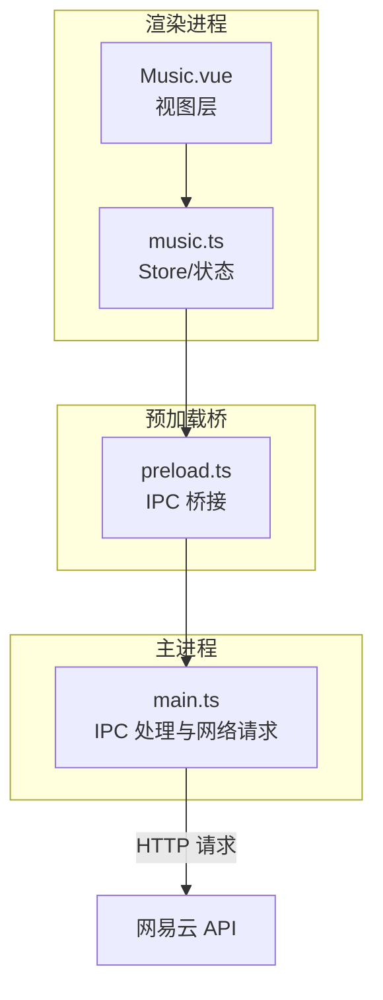
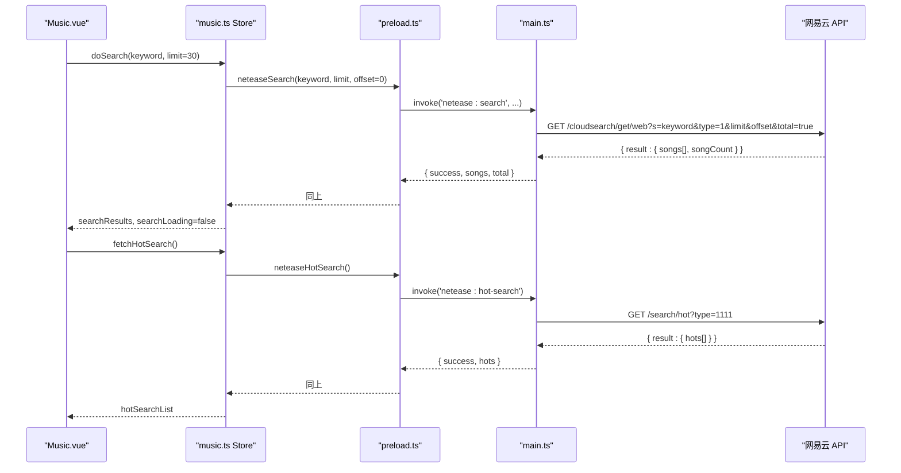

# 网易云音乐搜索接口

<cite>
**本文引用的文件**
- [main.ts](file://src/main/main.ts)
- [preload.ts](file://src/preload/preload.ts)
- [music.ts](file://src/renderer/src/stores/music.ts)
- [Music.vue](file://src/renderer/src/views/Music.vue)
</cite>

## 目录
1. [简介](#简介)
2. [项目结构](#项目结构)
3. [核心组件](#核心组件)
4. [架构总览](#架构总览)
5. [详细组件分析](#详细组件分析)
6. [依赖关系分析](#依赖关系分析)
7. [性能考虑](#性能考虑)
8. [故障排查指南](#故障排查指南)
9. [结论](#结论)
10. [附录：接口与数据模型](#附录接口与数据模型)

## 简介
本文件面向“网易云音乐搜索”相关能力，覆盖歌曲搜索（neteaseSearch）、热搜列表（neteaseHotSearch）等。文档说明接口的参数类型、返回值结构、搜索结果格式，并提供关键词优化、分页查询、结果过滤、搜索历史管理、热门搜索推荐与搜索建议的实现方案。所有实现均基于当前仓库中的主进程 IPC、预加载桥接、渲染层 Store 与页面交互逻辑。

## 项目结构
本项目采用 Electron 架构：
- 渲染进程通过 preload 暴露的 window.electronAPI 调用主进程 IPC 方法
- 主进程封装对网易云音乐的 HTTP 请求，并返回统一的结构化响应
- 渲染层 store 负责状态管理与业务编排，页面负责 UI 展示与用户交互

图表来源
- [Music.vue:187-269](file://src/renderer/src/views/Music.vue#L187-L269)
- [music.ts:435-454](file://src/renderer/src/stores/music.ts#L435-L454)
- [preload.ts:40-57](file://src/preload/preload.ts#L40-L57)
- [main.ts:1335-1355](file://src/main/main.ts#L1335-L1355)

章节来源
- [Music.vue:187-269](file://src/renderer/src/views/Music.vue#L187-L269)
- [preload.ts:40-57](file://src/preload/preload.ts#L40-L57)
- [main.ts:1335-1355](file://src/main/main.ts#L1335-L1355)

## 核心组件
- 歌曲搜索：通过 IPC “netease:search” 调用，支持 keyword、limit、offset 参数，返回标准化歌曲列表与总数
- 热搜列表：通过 IPC “netease:hot-search” 获取热搜关键词、热度分数与图标
- 播放与歌词：搜索后可直接获取在线播放 URL 与歌词，支持音质等级选择与错误重试
- 登录与歌单：支持扫码/Cookie/手机号登录，拉取歌单、排行榜、云盘歌曲等

章节来源
- [main.ts:1335-1355](file://src/main/main.ts#L1335-L1355)
- [main.ts:1724-1742](file://src/main/main.ts#L1724-L1742)
- [music.ts:435-454](file://src/renderer/src/stores/music.ts#L435-L454)
- [music.ts:789-800](file://src/renderer/src/stores/music.ts#L789-L800)

## 架构总览
搜索与热搜的整体调用链如下：

图表来源
- [Music.vue:736-744](file://src/renderer/src/views/Music.vue#L736-L744)
- [music.ts:435-454](file://src/renderer/src/stores/music.ts#L435-L454)
- [music.ts:789-800](file://src/renderer/src/stores/music.ts#L789-L800)
- [preload.ts:40-57](file://src/preload/preload.ts#L40-L57)
- [main.ts:1335-1355](file://src/main/main.ts#L1335-L1355)
- [main.ts:1724-1742](file://src/main/main.ts#L1724-L1742)

## 详细组件分析

### 歌曲搜索（neteaseSearch）
- 入口与参数
  - 渲染层：Music.vue 中 doSearch 触发搜索，默认 limit=30，offset=0
  - Store：searchOnline 调用 window.electronAPI.neteaseSearch(keyword, limit, offset)
  - 预加载：将调用转发至主进程 IPC 'netease:search'
  - 主进程：调用网易云 /cloudsearch/get/web，参数 s=keyword, type=1, limit, offset, total=true
- 返回值结构
  - 成功：{ success: true, songs: NetEaseSong[], total: number }
  - 失败：{ success: false, songs: [], total: 0, message: string }
- 搜索结果字段
  - id: number
  - name: string
  - artist: string（多艺人以“ / ”拼接）
  - album: string
  - cover: string（专辑封面图 URL）
- 使用示例
  - 搜索关键词：doSearch('周杰伦')
  - 分页查询：offset 按页递增，limit 控制每页条数
  - 结果过滤：在渲染层根据 artist/album/name 进行前端过滤或排序
- 注意事项
  - 搜索完成后会批量检查喜欢状态，便于界面高亮已收藏歌曲
  - 若需要更细粒度筛选，可在渲染层对 searchResults 做二次处理

章节来源
- [Music.vue:736-744](file://src/renderer/src/views/Music.vue#L736-L744)
- [music.ts:435-454](file://src/renderer/src/stores/music.ts#L435-L454)
- [preload.ts:40-40](file://src/preload/preload.ts#L40-L40)
- [main.ts:1335-1355](file://src/main/main.ts#L1335-L1355)

### 热搜列表（neteaseHotSearch）
- 入口与参数
  - 渲染层：Music.vue 提供“刷新”按钮触发
  - Store：fetchHotSearch 调用 window.electronAPI.neteaseHotSearch()
  - 预加载：转发到主进程 IPC 'netease:hot-search'
  - 主进程：调用网易云 /search/hot?type=1111
- 返回值结构
  - 成功：{ success: true, hots: HotSearchItem[] }
  - 失败：{ success: false, hots: [], message: string }
- 热搜项字段
  - rank: number（排名）
  - keyword: string（热搜词）
  - score: number（热度分）
  - iconUrl: string（热搜标识图标 URL）
- 使用示例
  - 点击“刷新”获取最新热搜；点击某热搜词可直接跳转搜索
  - 可结合本地存储记录最近热搜词，用于“搜索建议”

章节来源
- [Music.vue:239-268](file://src/renderer/src/views/Music.vue#L239-L268)
- [music.ts:789-800](file://src/renderer/src/stores/music.ts#L789-L800)
- [preload.ts:56-56](file://src/preload/preload.ts#L56-L56)
- [main.ts:1724-1742](file://src/main/main.ts#L1724-L1742)

### 在线播放与歌词（配合搜索）
- 播放 URL
  - 通过 IPC 'netease:song-url' 获取在线播放地址，支持音质等级 standard/higher/exhigh/lossless/hires
  - 若新版接口不可用，自动降级到旧版接口
- 歌词
  - 通过 IPC 'netease:lyric' 获取 lrc/tlyric，渲染层解析为时间轴行
- 错误处理
  - 播放错误时自动尝试刷新 URL 并重试，最多两次

章节来源
- [main.ts:1357-1388](file://src/main/main.ts#L1357-L1388)
- [main.ts:1390-1402](file://src/main/main.ts#L1390-L1402)
- [music.ts:102-138](file://src/renderer/src/stores/music.ts#L102-L138)
- [music.ts:191-236](file://src/renderer/src/stores/music.ts#L191-L236)

### 搜索历史管理（实现方案）
- 目标
  - 记录用户最近搜索词，支持快速回填与一键重搜
- 建议实现
  - 存储位置：使用本地存储工具（如 utils/storage）持久化数组
  - 写入时机：每次成功搜索后，将关键词去重并插入队首，限制长度（如 20 条）
  - 读取时机：页面初始化或打开搜索面板时加载
  - 清理：提供清空历史按钮；支持删除单条历史
- 与现有流程集成
  - 在 doSearch 成功后追加历史
  - 在热搜卡片下方增加“历史搜索”区域，点击即触发搜索

章节来源
- [music.ts:3-3](file://src/renderer/src/stores/music.ts#L3-L3)
- [Music.vue:736-744](file://src/renderer/src/views/Music.vue#L736-L744)

### 热门搜索推荐（实现方案）
- 目标
  - 基于 neteaseHotSearch 的结果，提供热门推荐入口
- 建议实现
  - 默认展示前 10 条热搜；支持“刷新”拉取最新
  - 点击热词直接执行搜索（复用 doSearch）
  - 可结合本地缓存减少频繁请求

章节来源
- [Music.vue:239-268](file://src/renderer/src/views/Music.vue#L239-L268)
- [music.ts:789-800](file://src/renderer/src/stores/music.ts#L789-L800)

### 搜索建议（实现方案）
- 目标
  - 输入关键词时给出联想建议，提升搜索效率
- 建议实现
  - 前端建议：基于本地历史与热搜词的前缀匹配
  - 后端建议：可接入网易云搜索建议接口（如需），在主进程新增 IPC 处理
  - 防抖：输入框变更时延迟 200-300ms 再发起建议请求
  - 展示：下拉建议列表，支持键盘上下选择与回车确认

[本节为通用实现方案，不直接分析具体代码文件]

## 依赖关系分析
- 渲染层依赖
  - Music.vue 依赖 music.ts 提供的搜索与热搜方法
  - music.ts 依赖 window.electronAPI 暴露的 IPC 方法
- 预加载桥
  - 将渲染层的 neteaseSearch/neteaseHotSearch 等方法映射到主进程 IPC
- 主进程
  - 封装网易云 HTTP 请求，统一错误处理与数据归一化
  - 提供搜索、热搜、播放 URL、歌词、登录、歌单等能力

图表来源
- [Music.vue:736-744](file://src/renderer/src/views/Music.vue#L736-L744)
- [music.ts:435-454](file://src/renderer/src/stores/music.ts#L435-L454)
- [preload.ts:40-57](file://src/preload/preload.ts#L40-L57)
- [main.ts:1335-1355](file://src/main/main.ts#L1335-L1355)

章节来源
- [preload.ts:40-57](file://src/preload/preload.ts#L40-L57)
- [main.ts:1335-1355](file://src/main/main.ts#L1335-L1355)

## 性能考虑
- 分页与限流
  - 合理设置 limit（默认 30），避免单次请求过大
  - 分页时注意 offset 累加，避免重复请求
- 列表渲染
  - 长列表（如云盘、播放队列）采用分批渲染，减少 DOM 压力
- 网络重试
  - 在线播放 URL 过期时自动重试，提高稳定性
- 缓存策略
  - 热搜与历史建议可本地缓存，减少重复请求

[本节为通用指导，不直接分析具体代码文件]

## 故障排查指南
- 搜索无结果
  - 检查 keyword 是否为空或包含非法字符
  - 检查网络与网易云服务可用性
  - 查看主进程返回的 message 字段定位错误
- 热搜为空
  - 点击“刷新”重试；检查 neteaseHotSearch 是否被正确调用
- 在线播放失败
  - 检查音质等级是否可用；观察自动重试机制是否生效
  - 查看 neteaseSongUrl 返回的 urls 是否为空
- 歌词缺失
  - 确认歌曲 ID 有效；检查 neteaseLyric 返回的 lyric 字段

章节来源
- [main.ts:1335-1355](file://src/main/main.ts#L1335-L1355)
- [main.ts:1724-1742](file://src/main/main.ts#L1724-L1742)
- [main.ts:1357-1388](file://src/main/main.ts#L1357-L1388)
- [main.ts:1390-1402](file://src/main/main.ts#L1390-L1402)

## 结论
本项目实现了完整的网易云音乐搜索与热搜能力，并通过统一的 IPC 与 Store 管理，提供了良好的可扩展性与用户体验。建议在现有基础上补充搜索历史管理与搜索建议功能，进一步提升搜索效率与易用性。

[本节为总结，不直接分析具体代码文件]

## 附录：接口与数据模型

### 歌曲搜索（neteaseSearch）
- 调用路径
  - 渲染层：music.searchOnline(keyword, limit)
  - 预加载：window.electronAPI.neteaseSearch
  - 主进程：ipcMain.handle('netease:search')
- 请求参数
  - keyword: string
  - limit: number（默认 30）
  - offset: number（默认 0）
- 返回结构
  - success: boolean
  - songs: Array<{ id, name, artist, album, cover }>
  - total: number
  - message?: string（失败时）

章节来源
- [music.ts:435-454](file://src/renderer/src/stores/music.ts#L435-L454)
- [preload.ts:40-40](file://src/preload/preload.ts#L40-L40)
- [main.ts:1335-1355](file://src/main/main.ts#L1335-L1355)

### 热搜列表（neteaseHotSearch）
- 调用路径
  - 渲染层：music.fetchHotSearch()
  - 预加载：window.electronAPI.neteaseHotSearch
  - 主进程：ipcMain.handle('netease:hot-search')
- 请求参数
  - 无
- 返回结构
  - success: boolean
  - hots: Array<{ rank, keyword, score, iconUrl }>
  - message?: string（失败时）

章节来源
- [music.ts:789-800](file://src/renderer/src/stores/music.ts#L789-L800)
- [preload.ts:56-56](file://src/preload/preload.ts#L56-L56)
- [main.ts:1724-1742](file://src/main/main.ts#L1724-L1742)

### 在线播放与歌词（辅助）
- 播放 URL
  - IPC：'netease:song-url'
  - 参数：ids: number[], level?: string
  - 返回：urls: Array<{ id, url, br }>
- 歌词
  - IPC：'netease:lyric'
  - 参数：id: number
  - 返回：lyric, tlyric

章节来源
- [main.ts:1357-1388](file://src/main/main.ts#L1357-L1388)
- [main.ts:1390-1402](file://src/main/main.ts#L1390-L1402)