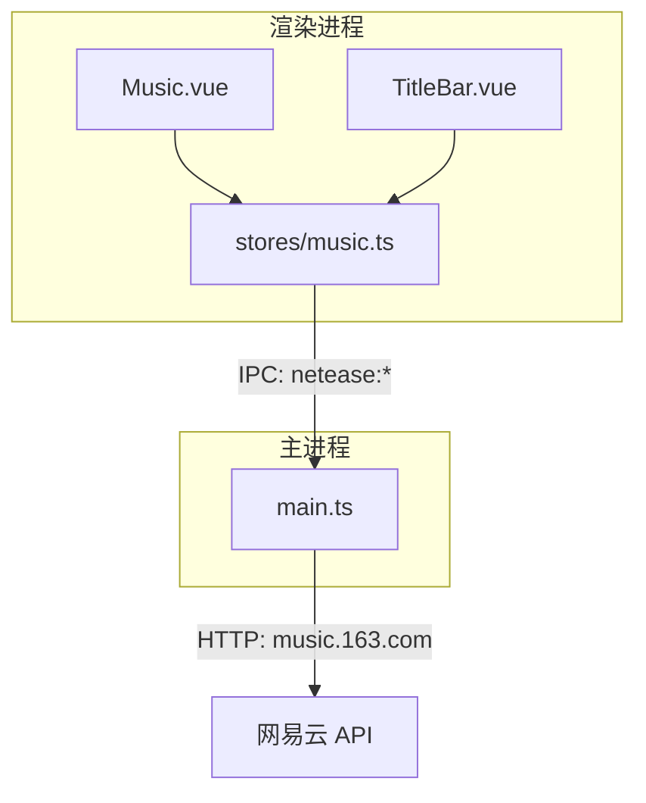
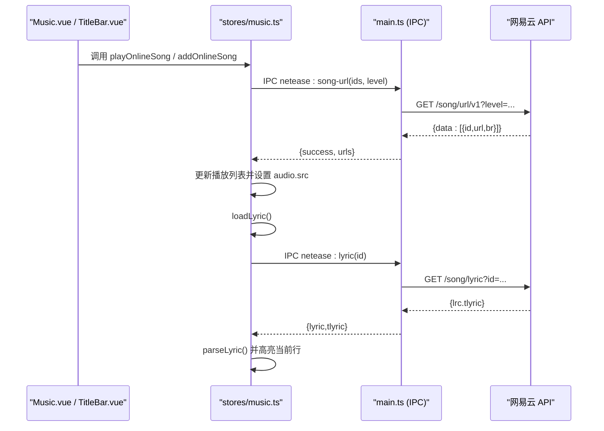
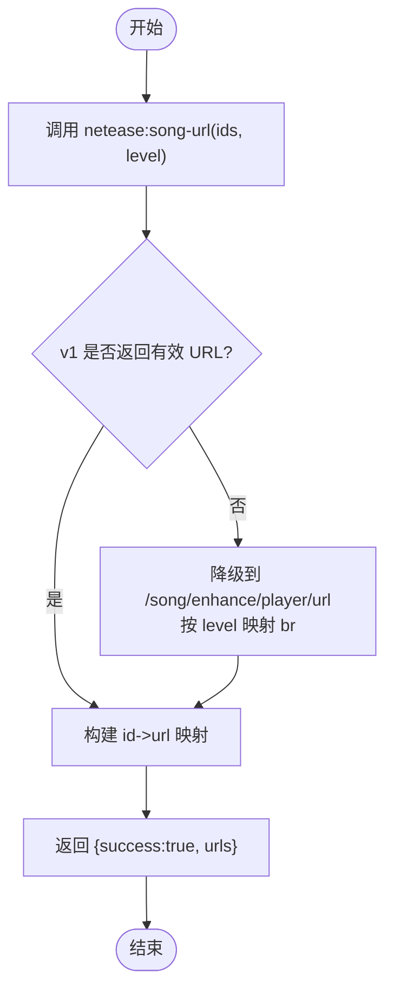
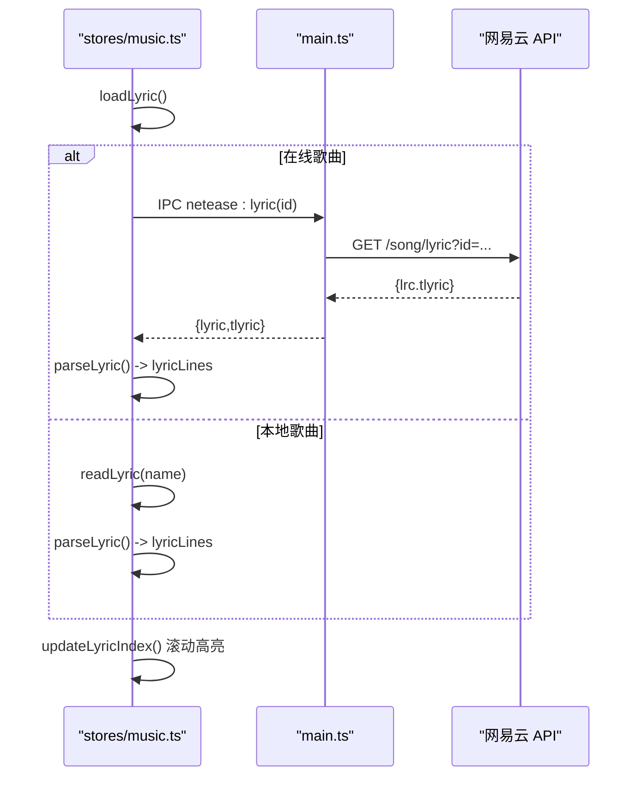
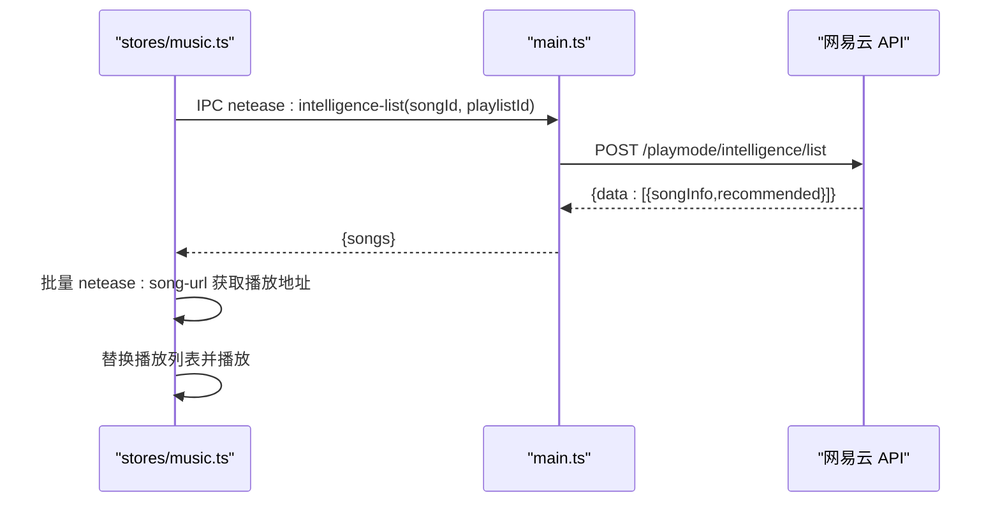
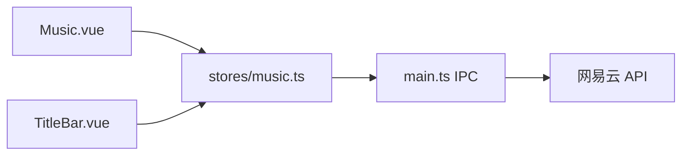

# 网易云音乐播放接口

<cite>
**本文引用的文件**
- [src/main/main.ts](file://src/main/main.ts)
- [src/renderer/src/stores/music.ts](file://src/renderer/src/stores/music.ts)
- [src/renderer/src/views/Music.vue](file://src/renderer/src/views/Music.vue)
- [src/renderer/src/components/TitleBar.vue](file://src/renderer/src/components/TitleBar.vue)
- [README.md](file://README.md)
</cite>

## 目录
1. [简介](#简介)
2. [项目结构](#项目结构)
3. [核心组件](#核心组件)
4. [架构总览](#架构总览)
5. [详细组件分析](#详细组件分析)
6. [依赖关系分析](#依赖关系分析)
7. [性能与可用性](#性能与可用性)
8. [故障排查指南](#故障排查指南)
9. [结论](#结论)
10. [附录：API 参考与最佳实践](#附录api-参考与最佳实践)

## 简介
本文件面向“网易云音乐播放接口”的使用与实现说明，覆盖以下能力：
- 歌曲 URL 获取（neteaseSongUrl）：参数类型、音质等级选择、返回音频流信息。
- 歌词获取（neteaseLyric）：在线歌词解析、本地 .lrc 读取、歌词同步高亮。
- 智能推荐（neteaseIntelligenceList）：基于当前歌曲的官方心动模式推荐。
- 播放列表管理、收藏（喜欢）与评论点赞等最佳实践。
- 错误处理与自动重试机制（URL 过期刷新）。

本项目为 Electron + Vue 3 桌面应用，渲染进程通过 Pinia store 管理播放状态，主进程通过 IPC 代理网易云 API。

## 项目结构
- 渲染层（Vue 3 + Pinia）
  - stores/music.ts：播放器状态、播放列表、歌词、搜索、登录、歌单、云盘、排行榜、喜欢与评论等逻辑。
  - views/Music.vue：音乐页面 UI，包含搜索、歌单、云盘、排行榜、播放列表、歌词展示、评论弹窗等。
  - components/TitleBar.vue：全局顶栏迷你播放器与歌词显示。
- 主进程（Electron）
  - main.ts：IPC 处理器，封装对网易云 API 的请求（搜索、歌词、歌曲 URL、登录、歌单、排行榜、智能推荐、喜欢列表等）。

图表来源
- [src/renderer/src/stores/music.ts:1-120](file://src/renderer/src/stores/music.ts#L1-L120)
- [src/main/main.ts:1335-1402](file://src/main/main.ts#L1335-L1402)

章节来源
- [README.md:111-128](file://README.md#L111-L128)
- [src/renderer/src/stores/music.ts:1-120](file://src/renderer/src/stores/music.ts#L1-L120)
- [src/main/main.ts:1335-1402](file://src/main/main.ts#L1335-L1402)

## 核心组件
- 播放器 Store（music.ts）
  - 维护播放列表、当前曲目、播放状态、音量、随机模式、音质等级、歌词、进度、搜索结果、登录态、歌单、云盘、排行榜、喜欢与评论等。
  - 提供播放控制、歌词加载与解析、在线歌曲播放、批量添加队列、智能推荐、评论与喜欢等。
- 主进程 IPC（main.ts）
  - 暴露 netease:song-url、netease:lyric、netease:intelligence-list、netease:search、netease:playlist-detail、netease:likelist、netease:comments 等接口。
  - 统一请求头、Cookie 管理、降级策略与错误封装。

章节来源
- [src/renderer/src/stores/music.ts:1-120](file://src/renderer/src/stores/music.ts#L1-L120)
- [src/main/main.ts:1335-1402](file://src/main/main.ts#L1335-L1402)

## 架构总览

图表来源
- [src/renderer/src/stores/music.ts:456-506](file://src/renderer/src/stores/music.ts#L456-L506)
- [src/main/main.ts:1357-1402](file://src/main/main.ts#L1357-L1402)

章节来源
- [src/renderer/src/stores/music.ts:456-506](file://src/renderer/src/stores/music.ts#L456-L506)
- [src/main/main.ts:1357-1402](file://src/main/main.ts#L1357-L1402)

## 详细组件分析

### 歌曲 URL 获取（neteaseSongUrl）
- 功能
  - 根据歌曲 ID 数组与音质等级，获取可播放的在线音频 URL。
  - 支持失败时自动刷新并重试，避免 URL 过期导致播放失败。
- 参数
  - ids: number[]，必填，歌曲 ID 列表。
  - level: string，可选，音质等级，默认 exhigh；支持 standard/higher/exhigh/lossless/hires。
- 返回值
  - success: boolean
  - urls: Array<{ id: number; url: string; br: number }>
- 关键流程
  - 优先使用新版 /song/url/v1 接口，若返回空则降级到旧版 /song/enhance/player/url，并按 level 映射 br。
  - 渲染端在 error 事件或 play 失败时触发一次 URL 刷新重试（最多两次），成功后恢复播放。
- 复杂度
  - 网络请求 O(1)，URL 映射 O(n)。
- 错误处理
  - 网络异常或接口不可用返回 success=false。
  - 前端捕获错误后尝试刷新 URL 并重新播放。

图表来源
- [src/main/main.ts:1357-1388](file://src/main/main.ts#L1357-L1388)

章节来源
- [src/main/main.ts:1357-1388](file://src/main/main.ts#L1357-L1388)
- [src/renderer/src/stores/music.ts:102-138](file://src/renderer/src/stores/music.ts#L102-L138)
- [src/renderer/src/stores/music.ts:308-343](file://src/renderer/src/stores/music.ts#L308-L343)

### 歌词获取与同步（neteaseLyric）
- 功能
  - 在线歌曲：通过 netease:lyric 获取 lrc/tlyric，解析为时间轴并高亮当前行。
  - 本地歌曲：读取同目录 .lrc 文件，解析并高亮。
- 参数
  - id: number，歌曲 ID。
- 返回值
  - success: boolean
  - lyric: string（lrc 文本）
  - tlyric: string（翻译歌词，可选）
- 解析规则
  - 正则匹配 [mm:ss(.ms)]text，转换为秒级时间戳并排序。
- 同步高亮
  - 监听 timeupdate，计算当前时间对应的歌词索引并滚动到可视区域。
- 复杂度
  - 解析 O(L)，L 为歌词行数。
- 错误处理
  - 接口失败或无歌词时清空歌词列表。

图表来源
- [src/renderer/src/stores/music.ts:171-252](file://src/renderer/src/stores/music.ts#L171-L252)
- [src/main/main.ts:1390-1402](file://src/main/main.ts#L1390-L1402)

章节来源
- [src/renderer/src/stores/music.ts:171-252](file://src/renderer/src/stores/music.ts#L171-L252)
- [src/main/main.ts:1390-1402](file://src/main/main.ts#L1390-L1402)

### 智能推荐（neteaseIntelligenceList）
- 功能
  - 基于当前歌曲与用户“喜欢的音乐”歌单，调用官方 /playmode/intelligence/list 获取推荐序列。
- 参数
  - songId: number，种子歌曲 ID。
  - playlistId: number，目标歌单 ID（通常为“我喜欢的音乐”）。
- 返回值
  - success: boolean
  - songs: Array<{id,name,artist,album,cover,duration,recommended}>
- 降级策略
  - 若智能推荐不可用，回退到拉取歌单详情并随机打乱前若干首。
- 复杂度
  - 网络请求 O(1)，后续批量获取 URL O(n)。
- 错误处理
  - 接口失败或无数据时提示并降级。

图表来源
- [src/main/main.ts:1987-2023](file://src/main/main.ts#L1987-L2023)
- [src/renderer/src/stores/music.ts:1214-1314](file://src/renderer/src/stores/music.ts#L1214-L1314)

章节来源
- [src/main/main.ts:1987-2023](file://src/main/main.ts#L1987-L2023)
- [src/renderer/src/stores/music.ts:1214-1314](file://src/renderer/src/stores/music.ts#L1214-L1314)

### 播放列表管理
- 能力
  - 本地文件/文件夹选择、在线搜索与加入队列、批量播放、移除、清空、随机播放、上一首/下一首。
- 关键点
  - 批量获取 URL 时每次最多 20 首，避免单次请求过大。
  - 播放全部前先暂停并释放旧 URL，再替换列表并调用 loadCurrent() 设置新的 audio.src。
- 复杂度
  - 批量 URL 获取 O(k*20)，k 为批次数。
- 错误处理
  - 网络异常或无可用 URL 时跳过该曲并继续。

章节来源
- [src/renderer/src/stores/music.ts:702-776](file://src/renderer/src/stores/music.ts#L702-L776)
- [src/renderer/src/views/Music.vue:456-531](file://src/renderer/src/views/Music.vue#L456-L531)

### 收藏（喜欢）与评论
- 喜欢
  - 首次登录成功时拉取 likelist（已喜欢歌曲 ID 集合），用于列表项与卡片初始点亮。
  - 切换喜欢状态采用乐观更新，失败自动回滚。
- 评论
  - 热门评论卡片与弹窗分页加载，支持最热/最新排序与评论点赞。
  - 评论点赞同样采用乐观更新，失败回滚计数与状态。

章节来源
- [src/renderer/src/stores/music.ts:955-1178](file://src/renderer/src/stores/music.ts#L955-L1178)
- [src/main/main.ts:1914-1979](file://src/main/main.ts#L1914-L1979)

## 依赖关系分析
- 渲染层依赖
  - Music.vue 依赖 stores/music.ts 暴露的方法与状态。
  - TitleBar.vue 依赖 stores/music.ts 的歌词与播放状态。
- 主进程依赖
  - main.ts 提供 IPC 处理器，封装 HTTP 请求与 Cookie 管理。
- 外部依赖
  - 网易云 API（music.163.com），包括搜索、歌词、URL、登录、歌单、排行榜、智能推荐、喜欢列表、评论等。

图表来源
- [src/renderer/src/stores/music.ts:1-120](file://src/renderer/src/stores/music.ts#L1-L120)
- [src/main/main.ts:1335-1402](file://src/main/main.ts#L1335-L1402)

章节来源
- [src/renderer/src/stores/music.ts:1-120](file://src/renderer/src/stores/music.ts#L1-L120)
- [src/main/main.ts:1335-1402](file://src/main/main.ts#L1335-L1402)

## 性能与可用性
- 批量 URL 获取限制为每批 20 首，降低单次请求压力。
- 长列表分批渲染（云盘与播放队列），避免一次性渲染过多 DOM 导致卡顿。
- 歌词解析与高亮使用线性扫描，时间复杂度 O(L)，满足实时性。
- URL 过期自动刷新重试（最多两次），提升在线播放稳定性。
- 音质等级持久化存储，减少重复配置。

[本节为通用指导，不直接分析具体文件]

## 故障排查指南
- 在线歌曲无法播放
  - 检查 neteaseSongUrl 是否返回有效 URL。
  - 确认 qualityLevel 是否受账号权限限制（如 lossless/hires）。
  - 观察 error 事件是否触发 URL 刷新重试。
- 歌词不显示
  - 在线歌曲：确认 netease:lyric 返回 lrc 内容。
  - 本地歌曲：确认同目录存在同名 .lrc 文件且编码正确。
- 智能推荐为空
  - 确认已登录并获取到“喜欢的音乐”歌单 ID。
  - 若接口失败，检查降级逻辑是否生效。
- 喜欢状态不正确
  - 确认首次登录成功时已拉取 likelist。
  - 切换喜欢状态失败会回滚 UI，检查网络与接口响应。

章节来源
- [src/renderer/src/stores/music.ts:102-138](file://src/renderer/src/stores/music.ts#L102-L138)
- [src/renderer/src/stores/music.ts:171-252](file://src/renderer/src/stores/music.ts#L171-L252)
- [src/renderer/src/stores/music.ts:1214-1314](file://src/renderer/src/stores/music.ts#L1214-L1314)
- [src/renderer/src/stores/music.ts:955-1178](file://src/renderer/src/stores/music.ts#L955-L1178)

## 结论
本项目实现了完整的网易云音乐播放能力：在线歌曲 URL 获取、歌词解析与同步、智能推荐、播放列表管理、收藏与评论等。通过主进程代理与渲染进程状态管理，提供了稳定、可扩展的音乐体验。建议在生产环境中关注音质等级与账号权限、网络稳定性以及长列表性能优化。

[本节为总结，不直接分析具体文件]

## 附录：API 参考与最佳实践

### 歌曲 URL 获取（neteaseSongUrl）
- 入口
  - 渲染端：stores/music.ts 中调用 window.electronAPI.neteaseSongUrl。
  - 主进程：main.ts 暴露 IPC netease:song-url。
- 参数
  - ids: number[]
  - level: string（standard/higher/exhigh/lossless/hires），默认 exhigh。
- 返回
  - { success: boolean; urls: Array<{ id: number; url: string; br: number }> }
- 最佳实践
  - 批量获取时按 20 首分批。
  - 播放失败或 error 事件触发时自动刷新 URL 并重试（最多两次）。
  - 音质等级持久化存储，避免重复选择。

章节来源
- [src/main/main.ts:1357-1388](file://src/main/main.ts#L1357-L1388)
- [src/renderer/src/stores/music.ts:102-138](file://src/renderer/src/stores/music.ts#L102-L138)
- [src/renderer/src/stores/music.ts:308-343](file://src/renderer/src/stores/music.ts#L308-L343)

### 歌词获取（neteaseLyric）
- 入口
  - 渲染端：stores/music.ts 中 loadLyric()。
  - 主进程：main.ts 暴露 IPC netease:lyric。
- 参数
  - id: number
- 返回
  - { success: boolean; lyric: string; tlyric: string }
- 最佳实践
  - 在线歌曲优先走 netease:lyric，本地歌曲读取同目录 .lrc。
  - 解析后按时间排序，timeupdate 时高亮当前行并滚动。

章节来源
- [src/main/main.ts:1390-1402](file://src/main/main.ts#L1390-L1402)
- [src/renderer/src/stores/music.ts:171-252](file://src/renderer/src/stores/music.ts#L171-L252)

### 智能推荐（neteaseIntelligenceList）
- 入口
  - 渲染端：stores/music.ts 中 startHeartbeatMode()。
  - 主进程：main.ts 暴露 IPC netease:intelligence-list。
- 参数
  - songId: number
  - playlistId: number
- 返回
  - { success: boolean; songs: Array<{id,name,artist,album,cover,duration,recommended}> }
- 最佳实践
  - 优先使用官方智能推荐接口，失败时降级到歌单随机。
  - 批量获取 URL 并替换播放列表，确保先暂停旧播放再设置新源。

章节来源
- [src/main/main.ts:1987-2023](file://src/main/main.ts#L1987-L2023)
- [src/renderer/src/stores/music.ts:1214-1314](file://src/renderer/src/stores/music.ts#L1214-L1314)

### 播放列表管理最佳实践
- 批量添加队列时按 20 首分批获取 URL。
- 播放全部前先暂停并释放旧 URL，再替换列表并调用 loadCurrent()。
- 长列表分批渲染，避免卡顿。

章节来源
- [src/renderer/src/stores/music.ts:702-776](file://src/renderer/src/stores/music.ts#L702-L776)
- [src/renderer/src/views/Music.vue:456-531](file://src/renderer/src/views/Music.vue#L456-L531)

### 收藏与评论最佳实践
- 首次登录成功时拉取 likelist，初始化喜欢状态缓存。
- 切换喜欢状态采用乐观更新，失败回滚。
- 评论分页加载，支持最热/最新排序与评论点赞，同样采用乐观更新。

章节来源
- [src/renderer/src/stores/music.ts:955-1178](file://src/renderer/src/stores/music.ts#L955-L1178)
- [src/main/main.ts:1914-1979](file://src/main/main.ts#L1914-L1979)