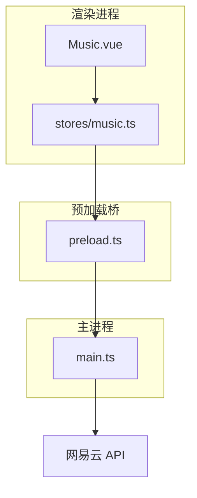
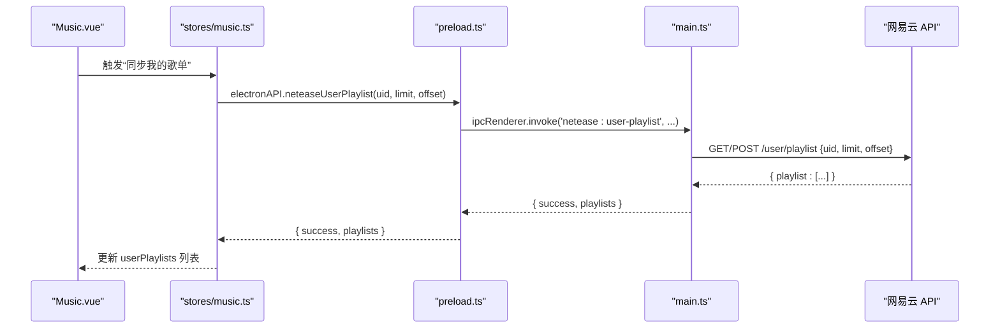
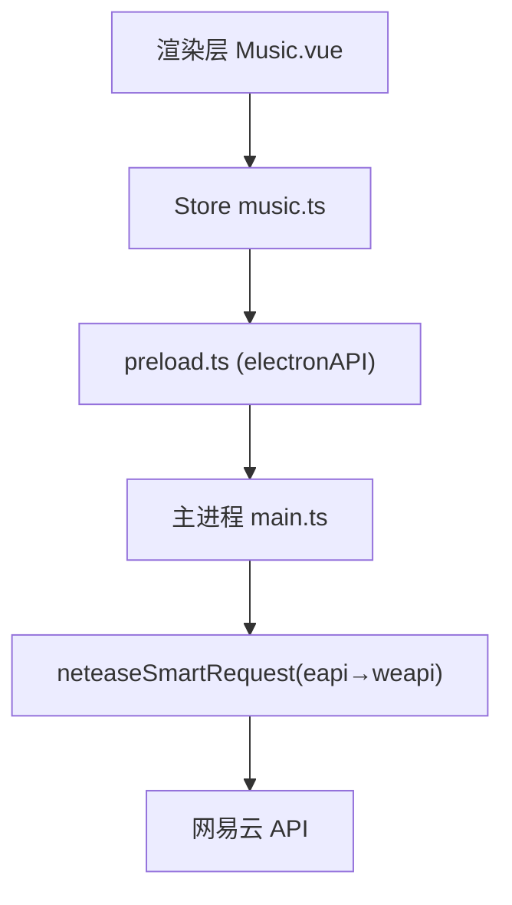

# 网易云音乐歌单接口

<cite>
**本文引用的文件**   
- [main.ts](file://src/main/main.ts)
- [preload.ts](file://src/preload/preload.ts)
- [music.ts](file://src/renderer/src/stores/music.ts)
- [Music.vue](file://src/renderer/src/views/Music.vue)
- [vite-env.d.ts](file://src/renderer/src/vite-env.d.ts)
</cite>

## 目录
1. [简介](#简介)
2. [项目结构](#项目结构)
3. [核心组件](#核心组件)
4. [架构总览](#架构总览)
5. [详细组件分析](#详细组件分析)
6. [依赖关系分析](#依赖关系分析)
7. [性能考虑](#性能考虑)
8. [故障排查指南](#故障排查指南)
9. [结论](#结论)
10. [附录：API 参考与最佳实践](#附录api-参考与最佳实践)

## 简介
本文件面向“网易云音乐歌单”相关功能，覆盖用户歌单管理（neteaseUserPlaylist、neteasePlaylistDetail）、喜欢音乐列表（neteaseLikelist）、云盘歌曲（neteaseCloudDrive）等。文档说明各接口的参数类型、返回数据结构、播放与批量操作实现，并给出歌单分享、批量操作与备份恢复的最佳实践建议。

## 项目结构
- 主进程（Node/Electron）负责调用网易云 API，封装为 IPC 通道：
  - netease:user-playlist → 获取用户歌单列表
  - netease:playlist-detail → 获取歌单详情与歌曲列表
  - netease:likelist → 获取已喜欢歌曲 ID 列表
  - netease:cloud-drive → 获取云盘歌曲列表
- 预加载脚本将上述 IPC 暴露给渲染进程：
  - window.electronAPI.neteaseUserPlaylist / neteasePlaylistDetail / neteaseLikelist / neteaseCloudDrive
- 渲染进程 Store（Pinia）封装业务逻辑：
  - fetchUserPlaylists / fetchPlaylistDetail / playPlaylist / addPlaylistToQueue / fetchLikelist / fetchCloudDrive
- 视图层（Vue 页面）提供交互入口：登录、歌单列表、歌单详情、云盘列表、排行榜等

图表来源
- [preload.ts:40-70](file://src/preload/preload.ts#L40-L70)
- [music.ts:676-700](file://src/renderer/src/stores/music.ts#L676-L700)
- [main.ts:1602-1674](file://src/main/main.ts#L1602-L1674)

章节来源
- [preload.ts:40-70](file://src/preload/preload.ts#L40-L70)
- [music.ts:676-700](file://src/renderer/src/stores/music.ts#L676-L700)
- [main.ts:1602-1674](file://src/main/main.ts#L1602-L1674)

## 核心组件
- 用户歌单列表：通过 uid、limit、offset 分页拉取，返回歌单封面、名称、播放量、曲目数、创建者等信息
- 歌单详情：传入歌单 id，返回歌单基本信息与完整歌曲列表（id、name、artist、album、cover、duration）
- 喜欢音乐列表：一次性拉取当前用户已喜欢的全部歌曲 ID，前端以集合形式判断是否已喜欢
- 云盘歌曲：分页拉取云盘中的歌曲，返回标准化字段（id、name、artist、album、cover、duration、fileName、fileSize、addTime、level）

章节来源
- [main.ts:1602-1674](file://src/main/main.ts#L1602-L1674)
- [main.ts:1946-1979](file://src/main/main.ts#L1946-L1979)
- [main.ts:2046-2100](file://src/main/main.ts#L2046-L2100)
- [vite-env.d.ts:129-139](file://src/renderer/src/vite-env.d.ts#L129-L139)
- [vite-env.d.ts:190-202](file://src/renderer/src/vite-env.d.ts#L190-L202)

## 架构总览
以下序列图展示从 UI 到主进程再到网易云 API 的完整调用链路（以“获取用户歌单列表”为例）：

图表来源
- [preload.ts:51-52](file://src/preload/preload.ts#L51-L52)
- [music.ts:676-685](file://src/renderer/src/stores/music.ts#L676-L685)
- [main.ts:1602-1629](file://src/main/main.ts#L1602-L1629)

章节来源
- [preload.ts:51-52](file://src/preload/preload.ts#L51-L52)
- [music.ts:676-685](file://src/renderer/src/stores/music.ts#L676-L685)
- [main.ts:1602-1629](file://src/main/main.ts#L1602-L1629)

## 详细组件分析

### 用户歌单管理：neteaseUserPlaylist
- 作用：获取指定用户的歌单列表（支持分页）
- 参数
  - uid: number（必填）— 用户 ID
  - limit: number（可选，默认 30）— 每页数量
  - offset: number（可选，默认 0）— 偏移量
- 返回
  - success: boolean
  - playlists: Array<{ id, name, cover, playCount, trackCount, creator }>
- 典型流程
  - 渲染侧调用 store.fetchUserPlaylists()
  - store 调用 electronAPI.neteaseUserPlaylist(uid, 100, 0)
  - 主进程调用 /user/playlist，映射为标准结构后返回
- 使用示例（路径引用）
  - 调用入口：[music.ts:676-685](file://src/renderer/src/stores/music.ts#L676-L685)
  - 主进程实现：[main.ts:1602-1629](file://src/main/main.ts#L1602-L1629)
  - 类型定义：[vite-env.d.ts:129-133](file://src/renderer/src/vite-env.d.ts#L129-L133)

章节来源
- [music.ts:676-685](file://src/renderer/src/stores/music.ts#L676-L685)
- [main.ts:1602-1629](file://src/main/main.ts#L1602-L1629)
- [vite-env.d.ts:129-133](file://src/renderer/src/vite-env.d.ts#L129-L133)

### 歌单详情：neteasePlaylistDetail
- 作用：获取歌单的详细信息与歌曲列表
- 参数
  - id: number（必填）— 歌单 ID
- 返回
  - success: boolean
  - playlist: { id, name, cover, playCount, trackCount, description } | null
  - tracks: Array<{ id, name, artist, album, cover, duration }>
- 典型流程
  - 点击歌单项 → store.fetchPlaylistDetail(id)
  - 主进程调用 /v6/playlist/detail，解析 tracks 为标准结构
- 使用示例（路径引用）
  - 调用入口：[music.ts:687-700](file://src/renderer/src/stores/music.ts#L687-L700)
  - 主进程实现：[main.ts:1631-1674](file://src/main/main.ts#L1631-L1674)
  - 类型定义：[vite-env.d.ts:134-139](file://src/renderer/src/vite-env.d.ts#L134-L139)

章节来源
- [music.ts:687-700](file://src/renderer/src/stores/music.ts#L687-L700)
- [main.ts:1631-1674](file://src/main/main.ts#L1631-L1674)
- [vite-env.d.ts:134-139](file://src/renderer/src/vite-env.d.ts#L134-L139)

### 喜欢音乐列表：neteaseLikelist
- 作用：一次性拉取当前用户已喜欢的全部歌曲 ID，用于前端快速判断“是否已喜欢”
- 参数
  - uid: number（可选）— 若未传则从登录态自动获取
- 返回
  - success: boolean
  - ids: number[] — 已喜欢歌曲 ID 列表
- 典型流程
  - 登录后或切换歌曲时，store 调用 fetchLikelist(true)
  - 主进程调用 /song/like/get，兼容多种响应结构，返回 ids
- 使用示例（路径引用）
  - 调用入口：[music.ts:979-990](file://src/renderer/src/stores/music.ts#L979-L990)
  - 主进程实现：[main.ts:1946-1979](file://src/main/main.ts#L1946-L1979)
  - 类型定义：[vite-env.d.ts:190-191](file://src/renderer/src/vite-env.d.ts#L190-L191)

章节来源
- [music.ts:979-990](file://src/renderer/src/stores/music.ts#L979-L990)
- [main.ts:1946-1979](file://src/main/main.ts#L1946-L1979)
- [vite-env.d.ts:190-191](file://src/renderer/src/vite-env.d.ts#L190-L191)

### 云盘歌曲：neteaseCloudDrive
- 作用：分页获取用户云盘中的歌曲
- 参数
  - pageSize: number（可选，默认 50）— 每页数量
  - pageNo: number（可选，默认 0）— 页码
- 返回
  - success: boolean
  - songs: Array<{ id, name, artist, album, cover, duration, fileName, fileSize, addTime, level }>
  - count: number — 总数
- 典型流程
  - 切换到“云盘”标签 → store.fetchCloudDrive(pageSize, pageNo)
  - 主进程调用 /v1/cloud/get，标准化字段后返回
- 使用示例（路径引用）
  - 调用入口：[music.ts:822-845](file://src/renderer/src/stores/music.ts#L822-L845)
  - 主进程实现：[main.ts:2046-2100](file://src/main/main.ts#L2046-L2100)
  - 类型定义：[vite-env.d.ts:194-202](file://src/renderer/src/vite-env.d.ts#L194-L202)

章节来源
- [music.ts:822-845](file://src/renderer/src/stores/music.ts#L822-L845)
- [main.ts:2046-2100](file://src/main/main.ts#L2046-L2100)
- [vite-env.d.ts:194-202](file://src/renderer/src/vite-env.d.ts#L194-L202)

### 播放与队列：playPlaylist / addPlaylistToQueue
- 作用：将歌单或云盘歌曲批量转换为可播放项，支持“播放全部”和“添加到队列”
- 关键点
  - 批量获取播放 URL（每次最多 20 首），避免单次请求过大
  - 替换播放列表前先暂停并释放旧 URL，防止音频叠加
  - 设置新的 audio.src 后再播放，确保状态一致
- 使用示例（路径引用）
  - 播放全部：[music.ts:702-748](file://src/renderer/src/stores/music.ts#L702-L748)
  - 添加到队列：[music.ts:750-776](file://src/renderer/src/stores/music.ts#L750-L776)

章节来源
- [music.ts:702-748](file://src/renderer/src/stores/music.ts#L702-L748)
- [music.ts:750-776](file://src/renderer/src/stores/music.ts#L750-L776)

### 界面交互：Music.vue
- 提供“我的歌单”、“云盘歌曲”、“排行榜”等 Tab
- 歌单网格展示：封面、名称、曲目数；点击进入详情
- 云盘列表支持“加载更多”，减少长列表卡顿
- 播放控制：播放全部、添加到队列、单曲播放/加入队列、喜欢/取消喜欢
- 使用示例（路径引用）
  - 歌单 Tab 与详情：[Music.vue:425-500](file://src/renderer/src/views/Music.vue#L425-L500)
  - 云盘 Tab 与列表：[Music.vue:271-337](file://src/renderer/src/views/Music.vue#L271-L337)

章节来源
- [Music.vue:271-337](file://src/renderer/src/views/Music.vue#L271-L337)
- [Music.vue:425-500](file://src/renderer/src/views/Music.vue#L425-L500)

## 依赖关系分析
- 渲染层依赖 Store 的业务方法
- Store 依赖 preload 暴露的 electronAPI
- preload 通过 ipcRenderer.invoke 转发到主进程
- 主进程通过 neteaseSmartRequest 智能选择 eapi/weapi 调用网易云 API
- 错误处理：eapi 失败降级 weapi；任一失败抛出错误，由上层捕获

图表来源
- [preload.ts:40-70](file://src/preload/preload.ts#L40-L70)
- [main.ts:1223-1238](file://src/main/main.ts#L1223-L1238)

章节来源
- [preload.ts:40-70](file://src/preload/preload.ts#L40-L70)
- [main.ts:1223-1238](file://src/main/main.ts#L1223-L1238)

## 性能考虑
- 批量获取播放 URL：按 20 首分批请求，降低单次负载与超时风险
- 长列表渲染：云盘与播放队列采用“可视数量分页”（VISIBLE_STEP=60），按需加载更多，避免 DOM 过多导致卡顿
- 播放状态一致性：替换列表前暂停并释放旧 URL，再 loadCurrent() 设置新 src，避免多音频叠加
- 网络重试：在线歌曲播放失败时尝试刷新 URL（最多两次），提升稳定性

章节来源
- [music.ts:702-748](file://src/renderer/src/stores/music.ts#L702-L748)
- [music.ts:750-776](file://src/renderer/src/stores/music.ts#L750-L776)
- [Music.vue:689-694](file://src/renderer/src/views/Music.vue#L689-L694)

## 故障排查指南
- 歌单为空或未显示
  - 检查是否已登录（neteaseLoggedIn）
  - 确认 uid 有效且 limit/offset 合理
  - 查看主进程日志与返回 message
- 歌单详情无歌曲
  - 确认 id 正确
  - 检查 /v6/playlist/detail 返回的 playlist.tracks 是否为空
- 喜欢状态不正确
  - 优先使用 neteaseLikelist 一次性拉取 ids，前端以 Set 判断
  - 注意兼容不同响应结构（数组/对象）
- 云盘歌曲加载慢
  - 调整 pageSize，分批次加载
  - 使用“加载更多”逐步渲染

章节来源
- [main.ts:1602-1674](file://src/main/main.ts#L1602-L1674)
- [main.ts:1946-1979](file://src/main/main.ts#L1946-L1979)
- [main.ts:2046-2100](file://src/main/main.ts#L2046-L2100)

## 结论
本项目对网易云歌单相关能力进行了完整封装：用户歌单列表、歌单详情、喜欢音乐列表、云盘歌曲均提供清晰的参数与返回结构；播放与队列操作实现了批量 URL 获取与状态一致性保障；界面层提供了友好的交互体验。结合分页与批量策略，整体具备较好的可扩展性与稳定性。

## 附录：API 参考与最佳实践

### 接口参数与返回结构速查
- neteaseUserPlaylist
  - 参数：uid(number), limit(number, 可选), offset(number, 可选)
  - 返回：{ success, playlists: [{ id, name, cover, playCount, trackCount, creator }] }
- neteasePlaylistDetail
  - 参数：id(number)
  - 返回：{ success, playlist: { id, name, cover, playCount, trackCount, description }, tracks: [{ id, name, artist, album, cover, duration }] }
- neteaseLikelist
  - 参数：uid(number, 可选)
  - 返回：{ success, ids: number[] }
- neteaseCloudDrive
  - 参数：pageSize(number, 可选), pageNo(number, 可选)
  - 返回：{ success, songs: [{ id, name, artist, album, cover, duration, fileName, fileSize, addTime, level }], count: number }

章节来源
- [vite-env.d.ts:129-139](file://src/renderer/src/vite-env.d.ts#L129-L139)
- [vite-env.d.ts:190-202](file://src/renderer/src/vite-env.d.ts#L190-L202)

### 实现示例（路径引用）
- 用户歌单同步
  - 调用：[music.ts:676-685](file://src/renderer/src/stores/music.ts#L676-L685)
  - 主进程：[main.ts:1602-1629](file://src/main/main.ts#L1602-L1629)
- 歌单详情与播放
  - 调用：[music.ts:687-700](file://src/renderer/src/stores/music.ts#L687-L700)
  - 播放全部：[music.ts:702-748](file://src/renderer/src/stores/music.ts#L702-L748)
  - 主进程：[main.ts:1631-1674](file://src/main/main.ts#L1631-L1674)
- 喜欢音乐列表
  - 调用：[music.ts:979-990](file://src/renderer/src/stores/music.ts#L979-L990)
  - 主进程：[main.ts:1946-1979](file://src/main/main.ts#L1946-L1979)
- 云盘歌曲
  - 调用：[music.ts:822-845](file://src/renderer/src/stores/music.ts#L822-L845)
  - 主进程：[main.ts:2046-2100](file://src/main/main.ts#L2046-L2100)

### 歌单创建、编辑、删除
- 当前代码库未提供歌单创建、编辑、删除的 IPC 接口与实现
- 如需扩展，可在主进程新增对应 IPC（如 create/update/delete playlist），并在 preload 暴露至渲染层，随后在 Store 中封装调用

### 歌单分享
- 当前代码库未提供歌单分享专用接口
- 可基于歌单详情中的链接或 ID 进行分享；或在后续版本集成官方分享能力

### 批量操作与备份恢复最佳实践
- 批量操作
  - 使用“播放全部”与“添加到队列”进行批量播放与入队
  - 批量获取播放 URL 时按 20 首分批，避免超时与限流
- 备份与恢复
  - 可将本地播放列表（含在线歌曲 ID）导出为 JSON，便于跨设备恢复
  - 对于在线歌曲，恢复后可通过 ID 重新获取 URL 并重建播放列表
  - 注意：在线 URL 可能过期，恢复时应动态刷新

章节来源
- [music.ts:702-748](file://src/renderer/src/stores/music.ts#L702-L748)
- [music.ts:750-776](file://src/renderer/src/stores/music.ts#L750-L776)