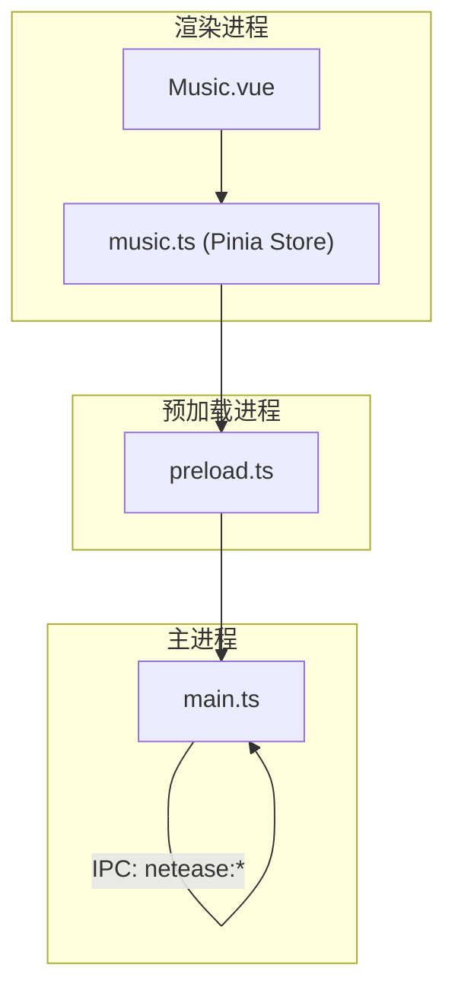
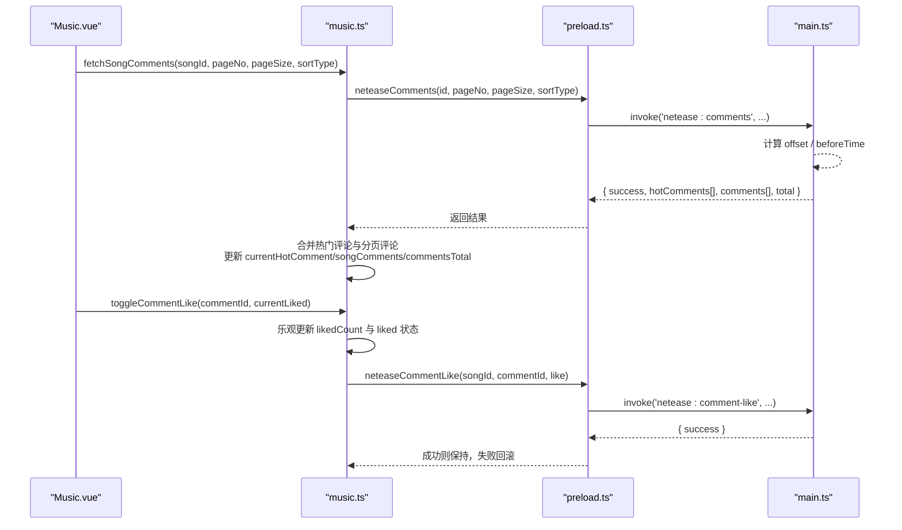
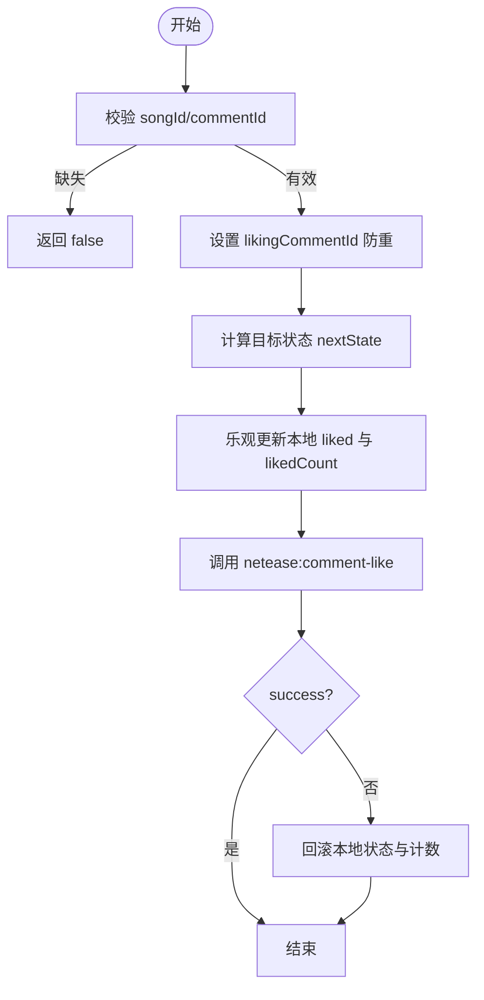
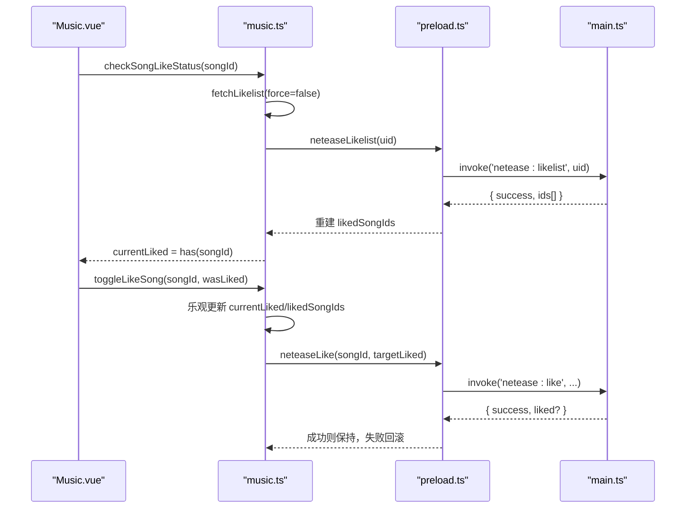
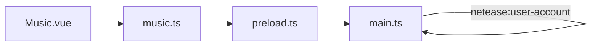

# 网易云音乐社交接口

<cite>
**本文引用的文件**
- [src/main/main.ts](file://src/main/main.ts)
- [src/preload/preload.ts](file://src/preload/preload.ts)
- [src/renderer/src/stores/music.ts](file://src/renderer/src/stores/music.ts)
- [src/renderer/src/views/Music.vue](file://src/renderer/src/views/Music.vue)
</cite>

## 目录
1. [简介](#简介)
2. [项目结构](#项目结构)
3. [核心组件](#核心组件)
4. [架构总览](#架构总览)
5. [详细组件分析](#详细组件分析)
6. [依赖关系分析](#依赖关系分析)
7. [性能考虑](#性能考虑)
8. [故障排查指南](#故障排查指南)
9. [结论](#结论)
10. [附录](#附录)

## 简介
本文件面向“网易云音乐社交能力”的集成与使用，覆盖评论系统（neteaseComments、neteaseCommentLike）、歌曲点赞（neteaseLike、neteaseSongLikeStatus）、用户信息（neteaseUserDetail、neteaseUserAccount）等。文档重点说明：
- 评论查询参数类型与排序方式
- 评论数据结构
- 评论发布/点赞、歌曲点赞、用户关注与个人主页展示的实现要点
- 社交数据同步、评论管理与用户关系维护的最佳实践

## 项目结构
本项目通过 Electron 主进程暴露 IPC 通道，预加载脚本桥接至渲染进程，渲染层通过 Pinia store 管理状态并调用 API。关键路径如下：
- 渲染层：Music.vue 页面与 music.ts store
- 预加载层：preload.ts 暴露 electronAPI
- 主进程：main.ts 实现 netease 相关 IPC 处理

图表来源
- [src/renderer/src/views/Music.vue:119-664](file://src/renderer/src/views/Music.vue#L119-L664)
- [src/renderer/src/stores/music.ts:1084-1178](file://src/renderer/src/stores/music.ts#L1084-L1178)
- [src/preload/preload.ts:54-67](file://src/preload/preload.ts#L54-L67)
- [src/main/main.ts:1676-1709](file://src/main/main.ts#L1676-L1709)

章节来源
- [src/renderer/src/views/Music.vue:1-800](file://src/renderer/src/views/Music.vue#L1-L800)
- [src/preload/preload.ts:1-104](file://src/preload/preload.ts#L1-L104)

## 核心组件
- 评论系统
  - 获取评论：store.fetchSongComments(songId, pageNo, pageSize, sortType)
  - 评论点赞：store.toggleCommentLike(commentId, currentLiked)
- 歌曲点赞
  - 切换喜欢：store.toggleLikeSong(songId, currentState?)
  - 批量检查：store.checkSongsLiked(songIds[])
  - 当前歌曲喜欢状态：store.checkSongLikeStatus(songId)
- 用户信息
  - 用户详情：store.fetchUserDetail(uid)
  - 账号信息：store.fetchUserAccount()

章节来源
- [src/renderer/src/stores/music.ts:928-953](file://src/renderer/src/stores/music.ts#L928-L953)
- [src/renderer/src/stores/music.ts:955-1062](file://src/renderer/src/stores/music.ts#L955-L1062)
- [src/renderer/src/stores/music.ts:1064-1178](file://src/renderer/src/stores/music.ts#L1064-L1178)

## 架构总览
以下时序图展示了“获取歌曲评论 + 评论点赞”的完整链路，包括渲染层、预加载层与主进程的交互。

图表来源
- [src/renderer/src/stores/music.ts:1084-1178](file://src/renderer/src/stores/music.ts#L1084-L1178)
- [src/preload/preload.ts:54-67](file://src/preload/preload.ts#L54-L67)
- [src/main/main.ts:1676-1709](file://src/main/main.ts#L1676-L1709)

## 详细组件分析

### 评论系统（neteaseComments、neteaseCommentLike）
- 评论查询
  - 入口：store.fetchSongComments(songId, pageNo, pageSize, sortType)
  - 参数类型
    - id: number（歌曲ID）
    - pageNo: number（页码，默认 1）
    - pageSize: number（每页条数，默认 20）
    - sortType: number（排序方式，默认 1）
      - 1：最新
      - 2：最热
  - 行为
    - 第一页时合并热门评论与分页评论；后续页追加评论
    - 记录 commentsTotal 用于分页控制
  - 主进程侧
    - 构造 offset = (pageNo - 1) * pageSize
    - 非首页使用 beforeTime 为当前时间戳以支持“按时间倒序”的分页
- 评论数据结构
  - 字段包含：commentId、content、time、likedCount、nickname、avatar、userId、repliedContent、repliedNickname
  - 热门评论单独缓存于 currentHotComment
- 评论点赞
  - 入口：store.toggleCommentLike(commentId, currentLiked)
  - 乐观更新：点击后立即更新本地 liked 状态与 likedCount，失败自动回滚
  - 防重复：likingCommentId 防止并发重复请求
  - 主进程侧：调用 netease:comment-like 完成服务端点赞/取消

图表来源
- [src/renderer/src/stores/music.ts:1137-1178](file://src/renderer/src/stores/music.ts#L1137-L1178)

章节来源
- [src/renderer/src/stores/music.ts:1064-1178](file://src/renderer/src/stores/music.ts#L1064-L1178)
- [src/main/main.ts:1676-1709](file://src/main/main.ts#L1676-L1709)
- [src/preload/preload.ts:54-67](file://src/preload/preload.ts#L54-L67)
- [src/renderer/src/views/Music.vue:119-166](file://src/renderer/src/views/Music.vue#L119-L166)
- [src/renderer/src/views/Music.vue:617-664](file://src/renderer/src/views/Music.vue#L617-L664)

### 歌曲点赞（neteaseLike、neteaseSongLikeStatus）
- 功能点
  - 切换喜欢：toggleLikeSong(songId, currentState?)
  - 批量检查：checkSongsLiked(songIds[])
  - 当前歌曲喜欢状态：checkSongLikeStatus(songId)
  - 已喜欢列表缓存：fetchLikelist(uid?)
- 行为
  - 首次拉取 likelist 后，通过 Set 缓存已喜欢歌曲 ID，提升列表项响应速度
  - 切换喜欢采用乐观更新，失败回滚
  - 主进程侧提供 netease:like 与 netease:likelist 通道

图表来源
- [src/renderer/src/stores/music.ts:955-1062](file://src/renderer/src/stores/music.ts#L955-L1062)
- [src/preload/preload.ts:61-65](file://src/preload/preload.ts#L61-L65)
- [src/main/main.ts:1946-1979](file://src/main/main.ts#L1946-L1979)

章节来源
- [src/renderer/src/stores/music.ts:955-1062](file://src/renderer/src/stores/music.ts#L955-L1062)
- [src/preload/preload.ts:61-65](file://src/preload/preload.ts#L61-L65)
- [src/main/main.ts:1946-1979](file://src/main/main.ts#L1946-L1979)
- [src/renderer/src/views/Music.vue:86-96](file://src/renderer/src/views/Music.vue#L86-L96)
- [src/renderer/src/views/Music.vue:229-231](file://src/renderer/src/views/Music.vue#L229-L231)

### 用户信息（neteaseUserDetail、neteaseUserAccount）
- 用户详情
  - 入口：store.fetchUserDetail(uid)
  - 返回字段：id、nickname、avatar、signature、level、gender、birthday、followeds、follows、playlistCount、listenSongs
- 账号信息
  - 入口：store.fetchUserAccount()
  - 返回字段：id、username、nickname、phone、email、vipType、createTime、createDays
- 用途
  - 个人主页展示、关注数统计、歌单数量、听歌数等

章节来源
- [src/renderer/src/stores/music.ts:896-953](file://src/renderer/src/stores/music.ts#L896-L953)
- [src/preload/preload.ts:59-60](file://src/preload/preload.ts#L59-L60)

### 评论发布
- 现状
  - 代码库中未实现“发布评论”的 IPC 与前端入口
  - 现有能力集中在“读取评论”和“评论点赞”
- 建议
  - 如需扩展，可参考评论读取流程新增 IPC 通道（如 netease:comment-post），并在 store 中封装发布方法

[本节为概念性说明，不直接分析具体文件]

## 依赖关系分析
- 渲染层依赖
  - Music.vue 通过 useMusicStore 调用 store 方法
  - store 通过 window.electronAPI 调用 preload 暴露的方法
- 预加载层依赖
  - 将 IPC 事件名映射到渲染层方法，如 neteaseComments、neteaseCommentLike、neteaseLike、neteaseLikelist、neteaseUserDetail、neteaseUserAccount
- 主进程依赖
  - 实现 netease:comments、netease:comment-like、netease:like、netease:likelist 等处理器

图表来源
- [src/preload/preload.ts:54-67](file://src/preload/preload.ts#L54-L67)
- [src/main/main.ts:1676-1709](file://src/main/main.ts#L1676-L1709)
- [src/main/main.ts:1946-1979](file://src/main/main.ts#L1946-L1979)

章节来源
- [src/preload/preload.ts:1-104](file://src/preload/preload.ts#L1-L104)
- [src/main/main.ts:1676-1709](file://src/main/main.ts#L1676-L1709)
- [src/main/main.ts:1946-1979](file://src/main/main.ts#L1946-L1979)

## 性能考虑
- 评论分页
  - 使用 pageNo/pageSize 控制每次加载量，避免一次性渲染过多 DOM
  - 热门评论与分页评论合并策略减少重复请求
- 点赞交互
  - 乐观更新提升用户体验，失败回滚保证一致性
  - 防重复点击（likingCommentId/likingSongId）降低无效请求
- 已喜欢列表缓存
  - 首次拉取 likelist 后使用 Set 缓存，避免对每个歌曲重复请求
- 长列表渲染
  - 云盘与播放队列采用分批渲染（visible 数量控制），减少卡顿

[本节为通用性能建议，不直接分析具体文件]

## 故障排查指南
- 评论为空或总数为 0
  - 检查 songId 是否正确
  - 确认 pageNo/pageSize 是否合理
  - 查看主进程日志与网络请求是否成功
- 评论点赞无变化
  - 检查 likingCommentId 是否被正确重置
  - 确认 netease:comment-like 是否返回 success
  - 若失败，确认本地状态是否回滚
- 歌曲喜欢状态不一致
  - 确保先调用 fetchLikelist 再判断 isSongLiked
  - 切换喜欢失败时检查回滚逻辑
- 用户信息为空
  - 确认已登录且 uid 有效
  - 检查 netease:user-detail/netease:user-account 返回值

章节来源
- [src/renderer/src/stores/music.ts:1084-1178](file://src/renderer/src/stores/music.ts#L1084-L1178)
- [src/renderer/src/stores/music.ts:955-1062](file://src/renderer/src/stores/music.ts#L955-L1062)
- [src/main/main.ts:1676-1709](file://src/main/main.ts#L1676-L1709)
- [src/main/main.ts:1946-1979](file://src/main/main.ts#L1946-L1979)

## 结论
本项目在渲染层通过 Pinia store 统一管理网易云社交能力，结合预加载与主进程 IPC 实现了评论读取、评论点赞、歌曲点赞与用户信息查询。整体设计采用乐观更新与缓存策略，兼顾体验与性能。未来可扩展评论发布、用户关注等更多社交能力。

[本节为总结性内容，不直接分析具体文件]

## 附录

### 评论查询参数与排序
- 参数
  - id: number（歌曲ID）
  - pageNo: number（页码，默认 1）
  - pageSize: number（每页条数，默认 20）
  - sortType: number（排序方式，默认 1）
    - 1：最新
    - 2：最热
- 数据来源
  - 主进程根据 pageNo 计算 offset，并使用 beforeTime 实现分页
  - 返回 hotComments 与 comments 数组，以及 total 总数

章节来源
- [src/main/main.ts:1676-1709](file://src/main/main.ts#L1676-L1709)
- [src/renderer/src/stores/music.ts:1084-1103](file://src/renderer/src/stores/music.ts#L1084-L1103)

### 评论数据结构
- 字段
  - commentId: number
  - content: string
  - time: number
  - likedCount: number
  - nickname: string
  - avatar: string
  - userId: number
  - repliedContent: string
  - repliedNickname: string

章节来源
- [src/main/main.ts:1676-1709](file://src/main/main.ts#L1676-L1709)
- [src/renderer/src/stores/music.ts:1064-1076](file://src/renderer/src/stores/music.ts#L1064-L1076)

### 实现示例（路径指引）
- 获取评论
  - 调用路径：Music.vue -> store.fetchSongComments -> preload.neteaseComments -> main.netease:comments
  - 参考路径
    - [src/renderer/src/views/Music.vue:119-166](file://src/renderer/src/views/Music.vue#L119-L166)
    - [src/renderer/src/stores/music.ts:1084-1103](file://src/renderer/src/stores/music.ts#L1084-L1103)
    - [src/preload/preload.ts:54-54](file://src/preload/preload.ts#L54-L54)
    - [src/main/main.ts:1676-1709](file://src/main/main.ts#L1676-L1709)
- 评论点赞
  - 调用路径：Music.vue -> store.toggleCommentLike -> preload.neteaseCommentLike -> main.netease:comment-like
  - 参考路径
    - [src/renderer/src/views/Music.vue:141-151](file://src/renderer/src/views/Music.vue#L141-L151)
    - [src/renderer/src/stores/music.ts:1137-1178](file://src/renderer/src/stores/music.ts#L1137-L1178)
    - [src/preload/preload.ts:67-67](file://src/preload/preload.ts#L67-L67)
- 歌曲点赞
  - 调用路径：Music.vue -> store.toggleLikeSong -> preload.neteaseLike -> main.netease:like
  - 参考路径
    - [src/renderer/src/views/Music.vue:86-96](file://src/renderer/src/views/Music.vue#L86-L96)
    - [src/renderer/src/stores/music.ts:1002-1039](file://src/renderer/src/stores/music.ts#L1002-L1039)
    - [src/preload/preload.ts:61-61](file://src/preload/preload.ts#L61-L61)
- 用户信息
  - 调用路径：store.fetchUserDetail/fetchUserAccount -> preload.neteaseUserDetail/neteaseUserAccount -> main.netease:user-detail/netease:user-account
  - 参考路径
    - [src/renderer/src/stores/music.ts:928-953](file://src/renderer/src/stores/music.ts#L928-L953)
    - [src/preload/preload.ts:59-60](file://src/preload/preload.ts#L59-L60)