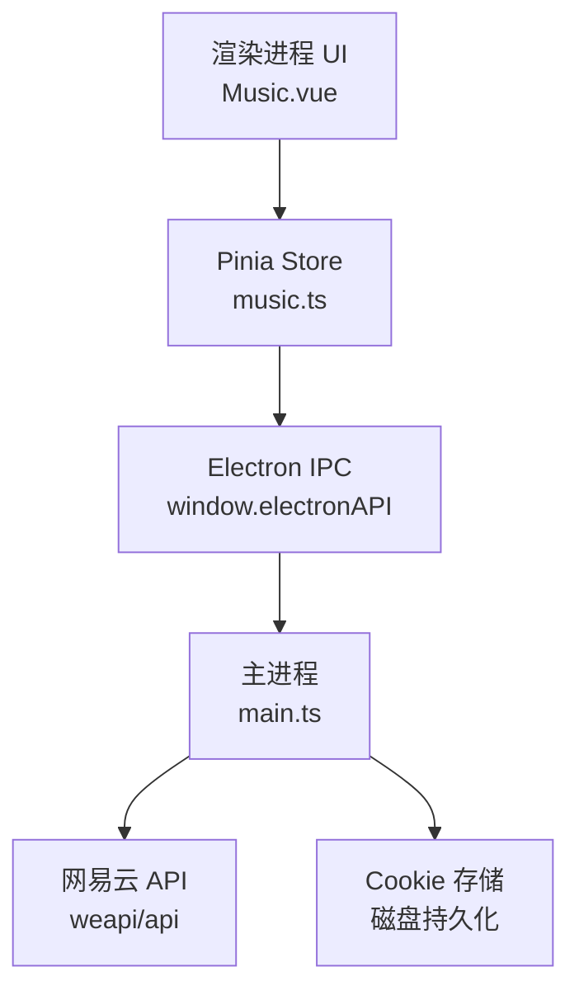
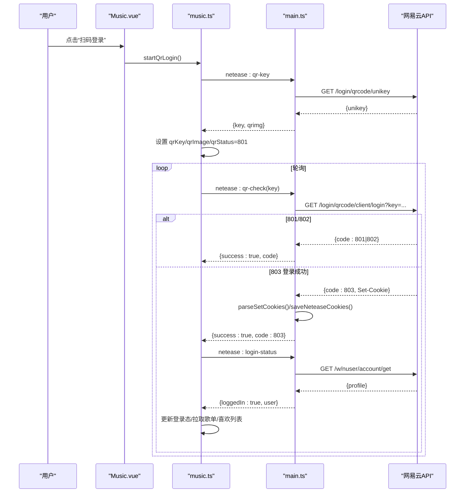
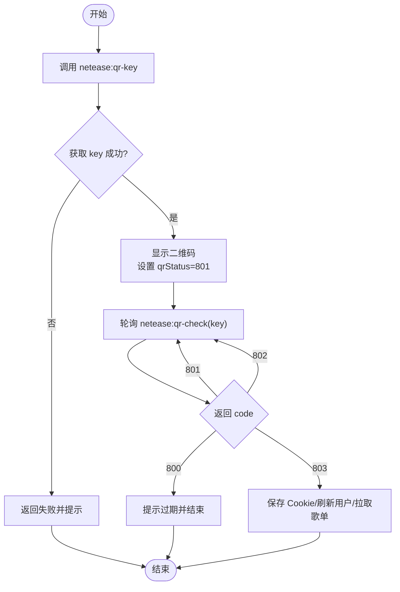
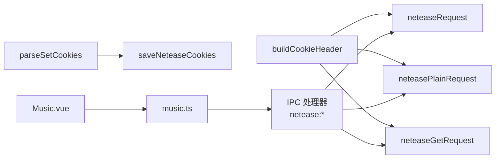
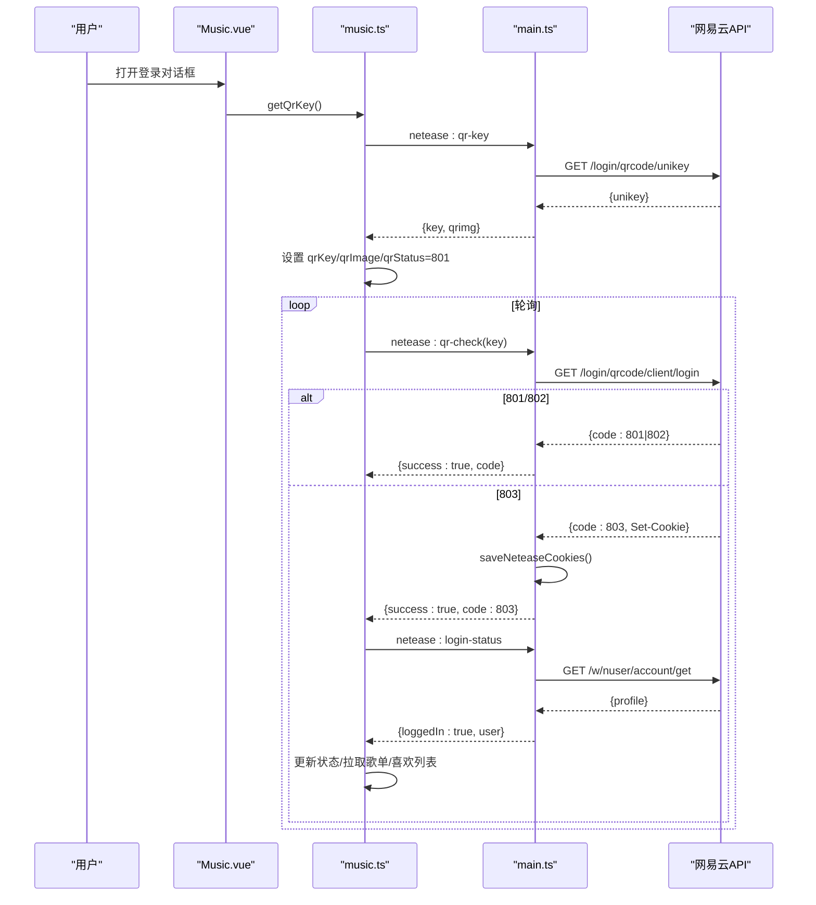

# 网易云音乐认证接口

<cite>
**本文引用的文件**
- [main.ts](file://src/main/main.ts)
- [music.ts](file://src/renderer/src/stores/music.ts)
- [Music.vue](file://src/renderer/src/views/Music.vue)
</cite>

## 目录
1. [简介](#简介)
2. [项目结构](#项目结构)
3. [核心组件](#核心组件)
4. [架构总览](#架构总览)
5. [详细组件分析](#详细组件分析)
6. [依赖关系分析](#依赖关系分析)
7. [性能与稳定性](#性能与稳定性)
8. [故障排查指南](#故障排查指南)
9. [结论](#结论)
10. [附录：完整登录流程示例](#附录完整登录流程示例)

## 简介
本文件面向“考研助手”应用中的网易云音乐认证能力，覆盖以下核心功能：
- 二维码登录流程（获取 key、轮询扫码状态）
- 手机号登录
- 用户状态管理（检查登录态、退出登录）
- Cookie 管理（从浏览器复制 Cookie 直接登录）

文档将详细说明各 IPC 接口的参数类型、返回值结构与错误处理机制，并提供从二维码生成到用户状态验证的完整流程示例，以及登录状态检查、自动登录配置与会话管理的最佳实践。

## 项目结构
本项目采用 Electron 架构：
- 主进程（main.ts）：封装网易云 API 请求、Cookie 持久化、IPC 暴露 netease:* 系列接口
- 渲染进程（renderer）：通过 Pinia store（music.ts）调用 window.electronAPI 提供的 netease:* 方法；UI 在 Music.vue 中提供扫码/手机号/Cookie 登录入口

图表来源
- [main.ts:1248-1333](file://src/main/main.ts#L1248-L1333)
- [music.ts:547-673](file://src/renderer/src/stores/music.ts#L547-L673)
- [Music.vue:541-615](file://src/renderer/src/views/Music.vue#L541-L615)

章节来源
- [main.ts:1248-1333](file://src/main/main.ts#L1248-L1333)
- [music.ts:547-673](file://src/renderer/src/stores/music.ts#L547-L673)
- [Music.vue:541-615](file://src/renderer/src/views/Music.vue#L541-L615)

## 核心组件
- 主进程 IPC 处理器
  - netease:qr-key：获取二维码 key 并生成二维码图片
  - netease:qr-check：轮询扫码状态（801等待/802待确认/803成功/800过期）
  - netease:login-status：查询当前登录态与用户信息
  - netease:logout：退出登录并清理 Cookie
  - netease:set-cookie：粘贴 Cookie 登录
  - netease:login-phone：手机号+密码登录
- 渲染进程 Store（music.ts）
  - getQrKey / checkQrLogin：二维码登录流程封装
  - loginPhone：手机号登录封装
  - setNeteaseCookie：Cookie 登录封装
  - checkLoginStatus / logoutNetease：登录态检查与退出
- 渲染进程 UI（Music.vue）
  - 登录对话框：扫码/手机号/Cookie 三种方式
  - 登录后展示用户头像/昵称，支持退出

章节来源
- [main.ts:1412-1599](file://src/main/main.ts#L1412-L1599)
- [music.ts:547-673](file://src/renderer/src/stores/music.ts#L547-L673)
- [Music.vue:541-615](file://src/renderer/src/views/Music.vue#L541-L615)

## 架构总览
认证链路以“渲染进程发起 -> IPC -> 主进程请求网易云 -> 解析响应/维护 Cookie -> 返回结果”为主轴。关键路径包括：
- 二维码登录：获取 unikey -> 构造二维码图片 -> 轮询 client/login -> 成功后持久化 Cookie
- 手机号登录：MD5 密码 + 手机号 -> 登录接口 -> 二次校验账户信息
- Cookie 登录：解析 Cookie 字符串 -> 写入内存与磁盘 -> 校验账户信息
- 状态检查：调用账户接口判断是否已登录

图表来源
- [main.ts:1412-1473](file://src/main/main.ts#L1412-L1473)
- [main.ts:1476-1510](file://src/main/main.ts#L1476-L1510)
- [music.ts:619-652](file://src/renderer/src/stores/music.ts#L619-L652)

## 详细组件分析

### 二维码登录（neteaseQrKey、neteaseQrCheck）
- 目的：获取二维码 key 并生成可扫描的图片，轮询扫码状态直至登录成功或过期
- 主进程实现要点
  - netease:qr-key：优先尝试 GET /login/qrcode/unikey，失败则 POST 携带 type=3；本地构造 qrurl 并通过在线服务生成二维码图片
  - netease:qr-check：调用 /login/qrcode/client/login，兼容 GET/POST；当 code=803 时解析 Set-Cookie 并持久化
- 渲染进程封装
  - getQrKey：设置 qrKey、qrImage、qrStatus=801
  - checkQrLogin：轮询状态，若 803 则刷新用户信息与歌单
- 错误处理
  - 获取 key 失败：返回 success=false，提示重试
  - 轮询异常：捕获后返回 code=0，前端继续或提示重新获取二维码
  - 二维码过期（800）：提示重新获取

图表来源
- [main.ts:1412-1473](file://src/main/main.ts#L1412-L1473)
- [music.ts:619-652](file://src/renderer/src/stores/music.ts#L619-L652)

章节来源
- [main.ts:1412-1473](file://src/main/main.ts#L1412-L1473)
- [music.ts:619-652](file://src/renderer/src/stores/music.ts#L619-L652)

### 手机号登录（neteaseLoginPhone）
- 目的：使用手机号+密码登录
- 主进程实现要点
  - netease:login-phone：对密码进行 MD5 加密，调用 /w/login/cellphone；成功后再次调用 /w/nuser/account/get 校验并返回用户信息
- 渲染进程封装
  - loginPhone：调用 IPC，成功后设置登录态、拉取歌单与喜欢列表
- 错误处理
  - 空参校验：返回失败消息
  - 登录失败：返回服务端 msg/message 或 code 信息

章节来源
- [main.ts:1552-1599](file://src/main/main.ts#L1552-L1599)
- [music.ts:593-617](file://src/renderer/src/stores/music.ts#L593-L617)

### 用户状态管理（neteaseLoginStatus、neteaseLogout）
- 目的：检查当前是否已登录及获取用户信息；退出登录并清理会话
- 主进程实现要点
  - netease:login-status：调用 /w/nuser/account/get，code=200 且存在 profile 视为已登录
  - netease:logout：调用 /logout 并清空 Cookie 持久化
- 渲染进程封装
  - checkLoginStatus：根据返回设置 neteaseLoggedIn/neteaseUser，并拉取喜欢列表
  - logoutNetease：调用 IPC 退出，重置本地状态

章节来源
- [main.ts:1476-1510](file://src/main/main.ts#L1476-L1510)
- [music.ts:547-565](file://src/renderer/src/stores/music.ts#L547-L565)
- [music.ts:654-673](file://src/renderer/src/stores/music.ts#L654-L673)

### Cookie 管理（neteaseSetCookie）
- 目的：允许用户从浏览器复制 Cookie 直接登录
- 主进程实现要点
  - netease:set-cookie：解析 Cookie 字符串为键值对，写入内存并持久化；随后调用 /w/nuser/account/get 验证有效性
- 渲染进程封装
  - setNeteaseCookie：调用 IPC，成功后设置登录态、拉取歌单与喜欢列表
- 错误处理
  - 空 Cookie：返回失败消息
  - 验证失败：返回 success=true 但 loggedIn=false，提示检查 Cookie

章节来源
- [main.ts:1512-1548](file://src/main/main.ts#L1512-L1548)
- [music.ts:567-591](file://src/renderer/src/stores/music.ts#L567-L591)

## 依赖关系分析
- 主进程依赖
  - neteaseRequest/neteasePlainRequest/neteaseGetRequest：统一构建请求头、注入 Cookie、解析 Set-Cookie
  - buildCookieHeader：确保基础匿名 Cookie（_ntes_nuid、NMTID、WNMCID 等）存在，避免风控
  - parseSetCookies/saveNeteaseCookies：持久化 Cookie 到磁盘
- 渲染进程依赖
  - music.ts 通过 window.electronAPI 调用 IPC
  - Music.vue 提供 UI 交互与状态绑定

图表来源
- [main.ts:1055-1086](file://src/main/main.ts#L1055-L1086)
- [main.ts:1248-1333](file://src/main/main.ts#L1248-L1333)
- [main.ts:1035-1048](file://src/main/main.ts#L1035-L1048)

章节来源
- [main.ts:1035-1048](file://src/main/main.ts#L1035-L1048)
- [main.ts:1055-1086](file://src/main/main.ts#L1055-L1086)
- [main.ts:1248-1333](file://src/main/main.ts#L1248-L1333)

## 性能与稳定性
- 请求优化
  - 批量获取播放 URL：每次最多 20 首，减少单次请求压力
  - 音质等级选择：standard/higher/exhigh/lossless/hires，按需降级
- 稳定性增强
  - 在线歌曲播放错误自动刷新 URL（最多重试 2 次）
  - 二维码登录兼容 GET/POST，失败回退
  - 喜欢状态检查兼容多种响应格式
- 建议
  - 合理控制轮询频率（如 2-3 秒），避免频繁请求导致风控
  - 长列表分页渲染（云盘/队列）降低 DOM 压力

[本节为通用指导，不直接分析具体文件]

## 故障排查指南
- 二维码无法显示
  - 检查 netease:qr-key 是否成功获取 unikey；若为空，尝试 POST 方式
  - 确认在线二维码服务可达
- 扫码无响应或一直 801
  - 检查网络与 Cookie 是否被污染；必要时退出登录并重新获取二维码
- 手机号登录失败
  - 确认密码已正确 MD5 加密；检查手机号与区号
  - 查看服务端返回 msg/message 定位原因
- Cookie 登录无效
  - 确认 Cookie 包含必要字段（如 MUSIC_U、__csrf 等）
  - 检查 /w/nuser/account/get 是否返回 200
- 风控或 -460 错误
  - 确保 buildCookieHeader 生成的基础 Cookie 齐全（_ntes_nuid、NMTID、WNMCID、WEVNSM、deviceId 等）

章节来源
- [main.ts:1055-1086](file://src/main/main.ts#L1055-L1086)
- [main.ts:1412-1473](file://src/main/main.ts#L1412-L1473)
- [main.ts:1552-1599](file://src/main/main.ts#L1552-L1599)
- [main.ts:1512-1548](file://src/main/main.ts#L1512-L1548)

## 结论
本项目在主进程中集中实现了网易云认证的各类能力，并通过 IPC 向渲染进程暴露稳定接口。二维码登录、手机号登录与 Cookie 登录均具备完善的错误处理与状态同步机制。结合自动续播、URL 刷新与批量请求优化，整体体验较为稳健。建议在集成时遵循轮询节流、Cookie 完整性校验与失败回退策略，以获得更好的可用性与抗风险能力。

[本节为总结性内容，不直接分析具体文件]

## 附录：完整登录流程示例
以下为从二维码生成到用户状态验证的端到端流程说明（不含代码片段，仅流程描述）：
- 步骤 1：用户在 Music.vue 点击“扫码登录”，触发 startQrLogin
- 步骤 2：music.ts 调用 netease:qr-key，获取 unikey 并生成二维码图片
- 步骤 3：前端设置 qrKey、qrImage、qrStatus=801，并开始轮询 netease:qr-check
- 步骤 4：轮询期间，若返回 801/802 继续轮询；若 803 登录成功：
  - 主进程解析 Set-Cookie 并持久化
  - 调用 netease:login-status 获取用户信息
  - 渲染进程更新 neteaseLoggedIn/neteaseUser，并拉取歌单与喜欢列表
- 步骤 5：若返回 800 表示二维码过期，提示用户重新获取

图表来源
- [main.ts:1412-1473](file://src/main/main.ts#L1412-L1473)
- [main.ts:1476-1510](file://src/main/main.ts#L1476-L1510)
- [music.ts:619-652](file://src/renderer/src/stores/music.ts#L619-L652)

章节来源
- [main.ts:1412-1473](file://src/main/main.ts#L1412-L1473)
- [main.ts:1476-1510](file://src/main/main.ts#L1476-L1510)
- [music.ts:619-652](file://src/renderer/src/stores/music.ts#L619-L652)