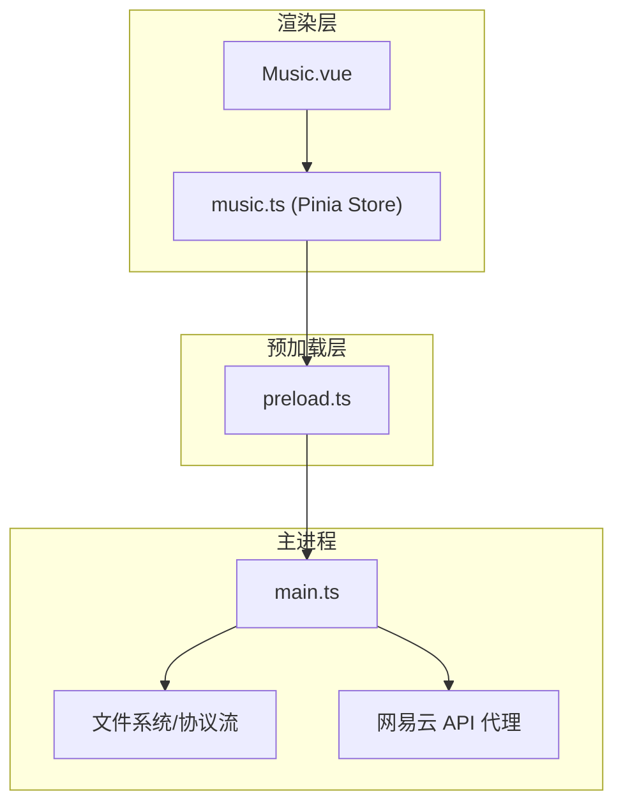
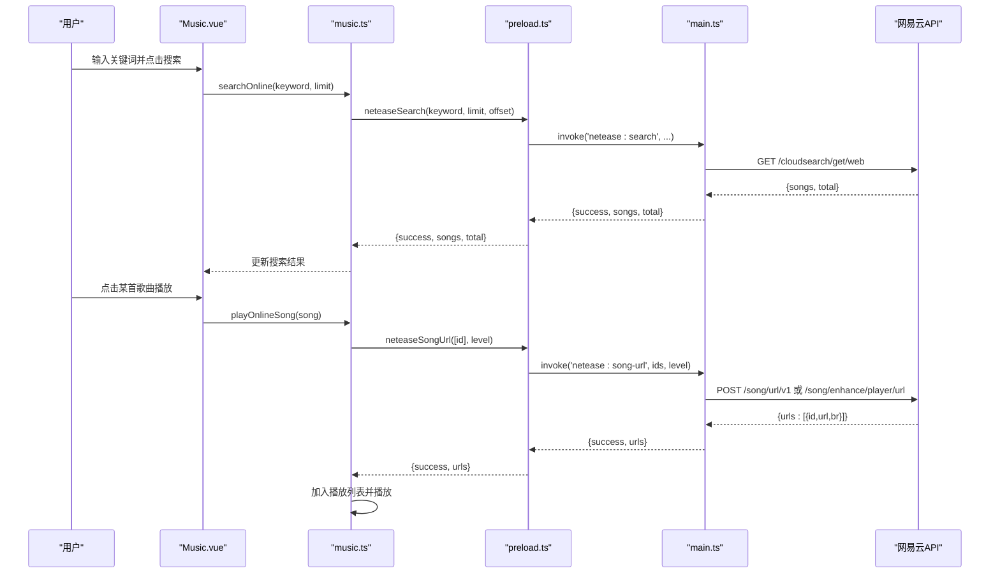
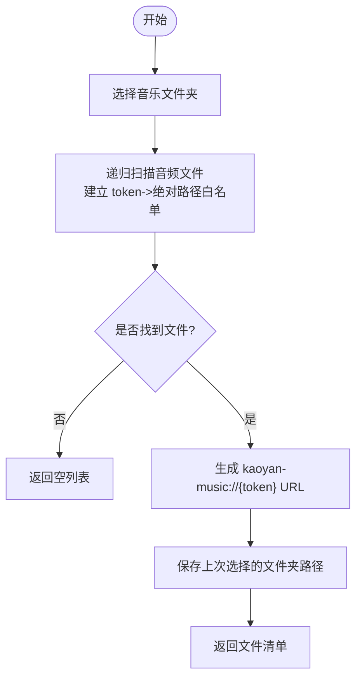
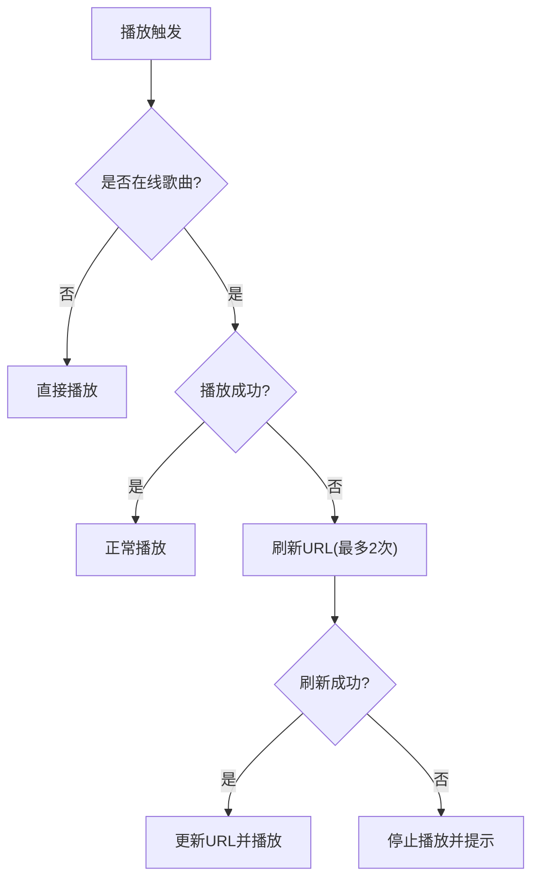
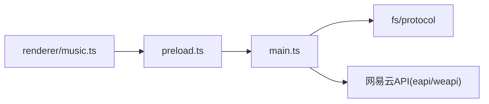

# 音乐相关接口

<cite>
**本文引用的文件**
- [src/main/main.ts](file://src/main/main.ts)
- [src/preload/preload.ts](file://src/preload/preload.ts)
- [src/renderer/src/stores/music.ts](file://src/renderer/src/stores/music.ts)
- [src/renderer/src/views/Music.vue](file://src/renderer/src/views/Music.vue)
- [package.json](file://package.json)
</cite>

## 目录
1. [简介](#简介)
2. [项目结构](#项目结构)
3. [核心组件](#核心组件)
4. [架构总览](#架构总览)
5. [详细组件分析](#详细组件分析)
6. [依赖关系分析](#依赖关系分析)
7. [性能考虑](#性能考虑)
8. [故障排查指南](#故障排查指南)
9. [结论](#结论)
10. [附录：IPC 接口清单与示例](#附录ipc-接口清单与示例)

## 简介
本文件面向“考研助手”应用中的音乐模块，系统性说明网易云音乐 API 集成与本地音乐文件管理的 IPC 接口。内容覆盖：
- 音乐搜索、歌词获取、登录认证（扫码/手机号/Cookie）、歌单管理、评论与喜欢、排行榜、云盘等能力
- 本地音乐文件夹选择、恢复上次选择、读取同目录 .lrc 歌词
- 关键方法参数、返回数据结构与错误处理
- 网易云登录流程与歌曲播放的完整实现示例

## 项目结构
音乐功能由三层协作完成：
- 渲染层（Vue + Pinia）：用户界面与状态管理，调用 window.electronAPI 暴露的 IPC 方法
- 预加载层（preload）：通过 contextBridge 将主进程能力安全暴露给渲染层
- 主进程（Electron main）：实现文件系统访问、协议流式播放、网易云 API 代理与鉴权



图表来源
- [src/renderer/src/views/Music.vue:1-800](file://src/renderer/src/views/Music.vue#L1-L800)
- [src/renderer/src/stores/music.ts:1-800](file://src/renderer/src/stores/music.ts#L1-L800)
- [src/preload/preload.ts:1-98](file://src/preload/preload.ts#L1-L98)
- [src/main/main.ts:1300-1403](file://src/main/main.ts#L1300-L1403)

章节来源
- [src/renderer/src/views/Music.vue:1-800](file://src/renderer/src/views/Music.vue#L1-L800)
- [src/renderer/src/stores/music.ts:1-800](file://src/renderer/src/stores/music.ts#L1-L800)
- [src/preload/preload.ts:1-98](file://src/preload/preload.ts#L1-L98)
- [src/main/main.ts:1300-1403](file://src/main/main.ts#L1300-L1403)

## 核心组件
- 渲染层 Store（music.ts）：维护播放列表、在线搜索结果、歌词、登录态、歌单、评论、喜欢状态等；封装对 electronAPI 的调用
- 渲染层视图（Music.vue）：提供搜索、歌单、云盘、排行榜、播放器、歌词、评论、登录对话框等 UI
- 预加载层（preload.ts）：将主进程的 IPC 通道以 window.electronAPI.* 形式暴露
- 主进程（main.ts）：
  - 本地音乐：文件夹扫描、白名单 token、kaoyan-music:// 协议流式播放、恢复上次文件夹
  - 歌词：读取同目录 .lrc 文件并解析为时间轴
  - 网易云 API：搜索、歌词、登录（扫码/手机号/Cookie）、歌单详情、评论、喜欢、排行榜、云盘、心动模式等
  - Cookie 持久化与请求头构建、eapi/weapi 智能降级

章节来源
- [src/renderer/src/stores/music.ts:1-800](file://src/renderer/src/stores/music.ts#L1-L800)
- [src/preload/preload.ts:1-98](file://src/preload/preload.ts#L1-L98)
- [src/main/main.ts:704-800](file://src/main/main.ts#L704-L800)
- [src/main/main.ts:1300-1403](file://src/main/main.ts#L1300-L1403)

## 架构总览
下图展示一次“搜索并播放在线歌曲”的端到端流程：



图表来源
- [src/renderer/src/stores/music.ts:435-483](file://src/renderer/src/stores/music.ts#L435-L483)
- [src/preload/preload.ts:40-42](file://src/preload/preload.ts#L40-L42)
- [src/main/main.ts:1335-1387](file://src/main/main.ts#L1335-L1387)

## 详细组件分析

### 本地音乐文件管理
- 选择音乐文件夹
  - 渲染层调用：window.electronAPI.pickMusicFolder()
  - 主进程：打开系统目录选择器，递归扫描音频扩展名（mp3/flac/wav/ogg/m4a/aac/wma/opus），生成相对路径列表，建立 token->绝对路径白名单，返回 { success, canceled, files }
  - 播放：使用自定义协议 kaoyan-music://{token} 进行流式读取，支持 Range 请求，避免内存占用
- 恢复上次选择的音乐文件夹
  - 渲染层在 store 初始化时调用 restoreMusicFolder()，自动恢复上次选择的文件夹并重建播放列表
- 读取本地歌词
  - 渲染层调用 readLyric(trackName)，主进程读取同目录 .lrc 文件，返回 { success, content }
  - 渲染层解析 lrc 为 { time, text } 数组，按播放进度高亮当前行



图表来源
- [src/main/main.ts:704-761](file://src/main/main.ts#L704-L761)
- [src/main/main.ts:764-800](file://src/main/main.ts#L764-L800)
- [src/renderer/src/stores/music.ts:74-91](file://src/renderer/src/stores/music.ts#L74-L91)
- [src/renderer/src/stores/music.ts:218-236](file://src/renderer/src/stores/music.ts#L218-L236)

章节来源
- [src/main/main.ts:704-800](file://src/main/main.ts#L704-L800)
- [src/renderer/src/stores/music.ts:74-91](file://src/renderer/src/stores/music.ts#L74-L91)
- [src/renderer/src/stores/music.ts:218-236](file://src/renderer/src/stores/music.ts#L218-L236)

### 网易云音乐 API 集成
- 搜索
  - 渲染层：searchOnline(keyword, limit=30)
  - 主进程：调用 /cloudsearch/get/web，返回 { success, songs[], total }
  - 错误处理：网络异常或服务端错误统一返回 { success:false, songs:[], total:0, message }
- 歌词
  - 渲染层：loadLyric() 根据曲目来源决定走在线歌词或本地 .lrc
  - 在线歌词：neteaseLyric(id) -> /song/lyric，返回 { success, lyric, tlyric }
  - 本地歌词：readLyric(name) -> 读取同目录 .lrc，返回 { success, content }
- 登录认证
  - 扫码登录：getQrKey() -> /login/qrcode/unikey，返回 key 与二维码图片；checkQrLogin(key) -> /login/qrcode/client/login，轮询状态码 801/802/803/800
  - 手机号登录：loginPhone(phone, password, countrycode='86') -> /w/login/cellphone，成功后校验账户信息
  - Cookie 登录：setNeteaseCookie(cookieStr) -> 解析并持久化 Cookie，验证登录态
  - 退出登录：logoutNetease() -> /logout，清空 Cookie 与状态
- 歌单管理
  - 用户歌单列表：userPlaylist(uid, limit=30, offset=0) -> /user/playlist
  - 歌单详情：playlistDetail(id) -> /v6/playlist/detail，返回 playlist 与 tracks
  - 播放整个歌单：playPlaylist(tracks[]) -> 批量获取播放地址（每次最多20首），替换播放列表并播放
  - 添加到队列：addPlaylistToQueue(tracks[]) -> 批量获取播放地址后追加到队列
- 评论与喜欢
  - 评论：comments(id, pageNo=1, pageSize=20, sortType=1) -> /v1/resource/comments/R_SO_4_{id}
  - 评论点赞：commentLike(songId, commentId, like) -> /v1/comment/like 或 unlike
  - 喜欢：like(songId, like=true) -> /song/like；songLikeStatus(songId) -> /song/like/check；likelist(uid?) -> /song/like/get
- 热搜与排行榜
  - 热搜：hotSearch() -> /search/hot
  - 排行榜：toplist() -> /toplist/detail；toplistDetail(id) -> /v6/playlist/detail
- 云盘
  - cloudDrive(pageSize=50, pageNo=0) -> /v1/cloud/get，返回用户云盘歌曲列表

```mermaid
classDiagram
class MusicStore {
+searchOnline(keyword, limit) Promise<number>
+playOnlineSong(song) Promise<boolean>
+addOnlineSong(song) Promise<boolean>
+getQrKey() Promise<{key, qrimg}>
+checkQrLogin() Promise<number>
+setNeteaseCookie(cookie) Promise<{success,message}>
+loginPhone(phone,password,countrycode) Promise<{success,message}>
+fetchUserPlaylists() Promise<void>
+fetchPlaylistDetail(id) Promise<void>
+playPlaylist(tracks) Promise<void>
+addPlaylistToQueue(tracks) Promise<void>
+fetchHotSearch() Promise<void>
+fetchToplist() Promise<void>
+fetchToplistDetail(id) Promise<void>
+fetchLikelist(uid) Promise<void>
+isSongLiked(id) boolean
+handleToggleLike() Promise<void>
}
class ElectronAPI {
+neteaseSearch(...)
+neteaseSongUrl(...)
+neteaseLyric(...)
+neteaseQrKey()
+neteaseQrCheck(key)
+neteaseLoginStatus()
+neteaseLogout()
+neteaseSetCookie(cookie)
+neteaseLoginPhone(phone,password,cc)
+neteaseUserPlaylist(uid,limit,offset)
+neteasePlaylistDetail(id)
+neteaseComments(id,page,size,sort)
+neteaseCommentLike(sid,cid,like)
+neteaseLike(sid,like)
+neteaseSongLikeStatus(id)
+neteaseLikelist(uid)
+neteaseHotSearch()
+neteaseToplist()
+neteaseToplistDetail(id)
+neteaseCloudDrive(size,page)
}
MusicStore --> ElectronAPI : "调用"
```

图表来源
- [src/renderer/src/stores/music.ts:435-800](file://src/renderer/src/stores/music.ts#L435-L800)
- [src/preload/preload.ts:40-69](file://src/preload/preload.ts#L40-L69)
- [src/main/main.ts:1335-2102](file://src/main/main.ts#L1335-L2102)

章节来源
- [src/renderer/src/stores/music.ts:435-800](file://src/renderer/src/stores/music.ts#L435-L800)
- [src/preload/preload.ts:40-69](file://src/preload/preload.ts#L40-L69)
- [src/main/main.ts:1335-2102](file://src/main/main.ts#L1335-L2102)

### 播放与错误重试
- 播放在线歌曲失败时的自动重试机制：
  - 当 audio.play() 或 error 事件触发且是在线歌曲时，尝试刷新播放 URL（neteaseSongUrl），最多重试两次
  - 若成功则更新播放列表中的 URL 并继续播放
- 播放列表切换与资源释放：
  - 切换曲目前释放旧的 blob URL，避免内存泄漏
  - 播放整张歌单前先暂停并释放旧 URL，再设置新的 audio.src 并播放



图表来源
- [src/renderer/src/stores/music.ts:102-138](file://src/renderer/src/stores/music.ts#L102-L138)
- [src/renderer/src/stores/music.ts:308-343](file://src/renderer/src/stores/music.ts#L308-L343)

章节来源
- [src/renderer/src/stores/music.ts:102-138](file://src/renderer/src/stores/music.ts#L102-L138)
- [src/renderer/src/stores/music.ts:308-343](file://src/renderer/src/stores/music.ts#L308-L343)

## 依赖关系分析
- 渲染层依赖 preload 暴露的 window.electronAPI
- preload 依赖主进程 ipcMain.handle 注册的通道
- 主进程依赖 Node.js 文件系统、Electron 协议、HTTP fetch 与加密库
- 网易云 API 通过 eapi/weapi 双通道智能降级，提升稳定性



图表来源
- [src/renderer/src/stores/music.ts:1-800](file://src/renderer/src/stores/music.ts#L1-L800)
- [src/preload/preload.ts:1-98](file://src/preload/preload.ts#L1-L98)
- [src/main/main.ts:975-1333](file://src/main/main.ts#L975-L1333)

章节来源
- [src/renderer/src/stores/music.ts:1-800](file://src/renderer/src/stores/music.ts#L1-L800)
- [src/preload/preload.ts:1-98](file://src/preload/preload.ts#L1-L98)
- [src/main/main.ts:975-1333](file://src/main/main.ts#L975-L1333)

## 性能考虑
- 本地音乐采用流式读取与 Range 支持，避免大文件内存占用
- 播放列表过长时分批渲染（云盘与队列），减少 DOM 压力
- 批量获取在线播放地址（每次最多20首），降低网络与解析开销
- Cookie 持久化与智能请求（eapi优先，weapi降级），提高成功率与速度

[本节为通用指导，不直接分析具体文件]

## 故障排查指南
- 搜索无结果或报错
  - 检查网络与网易云服务可用性
  - 查看主进程日志中 eapi/weapi 调用错误信息
- 在线歌曲无法播放
  - 检查 neteaseSongUrl 返回值是否为空
  - 确认自动重试逻辑是否触发（最多2次）
- 歌词不显示
  - 在线歌曲：确认 neteaseLyric 返回 lyric 字段
  - 本地歌曲：确认同目录存在 .lrc 文件且命名匹配
- 登录失败
  - 扫码：确认 key 有效且 App 已扫码确认
  - 手机号：检查密码 MD5 与区号
  - Cookie：确保包含 MUSIC_U 等必要字段

章节来源
- [src/main/main.ts:1335-1403](file://src/main/main.ts#L1335-L1403)
- [src/main/main.ts:1412-1473](file://src/main/main.ts#L1412-L1473)
- [src/main/main.ts:1552-1598](file://src/main/main.ts#L1552-L1598)
- [src/main/main.ts:1513-1548](file://src/main/main.ts#L1513-L1548)

## 结论
本音乐模块通过清晰的三层架构实现了本地与在线音乐的统一管理，结合网易云 API 提供了搜索、歌词、登录、歌单、评论、喜欢、排行榜与云盘等完整能力。主进程负责安全与性能优化（流式播放、批量请求、智能降级），渲染层专注于交互与状态管理。整体设计稳定、可扩展，便于后续功能增强。

[本节为总结性内容，不直接分析具体文件]

## 附录：IPC 接口清单与示例

### 本地音乐与歌词
- pickMusicFolder()
  - 参数：无
  - 返回：{ success, canceled, files[] }
  - 用途：选择音乐文件夹并返回可播放文件清单
- restoreMusicFolder()
  - 参数：无
  - 返回：{ success, canceled, files[] }
  - 用途：恢复上次选择的音乐文件夹
- readLyric(trackName: string)
  - 参数：trackName（文件名）
  - 返回：{ success, content }
  - 用途：读取同目录 .lrc 歌词内容

章节来源
- [src/preload/preload.ts:24-28](file://src/preload/preload.ts#L24-L28)
- [src/main/main.ts:704-800](file://src/main/main.ts#L704-L800)
- [src/renderer/src/stores/music.ts:218-236](file://src/renderer/src/stores/music.ts#L218-L236)

### 网易云音乐 API
- neteaseSearch(keyword: string, limit?: number, offset?: number)
  - 返回：{ success, songs[], total }
  - 用途：搜索歌曲
- neteaseSongUrl(ids: number[], level?: string)
  - 返回：{ success, urls[] }
  - 用途：获取在线播放地址（支持音质等级）
- neteaseLyric(id: number)
  - 返回：{ success, lyric, tlyric }
  - 用途：获取在线歌词
- neteaseQrKey()
  - 返回：{ success, key, qrimg, qrurl? }
  - 用途：获取扫码登录 key 与二维码图片
- neteaseQrCheck(key: string)
  - 返回：{ success, code, message, cookie? }
  - 用途：轮询扫码登录状态（801等待/802待确认/803成功/800过期）
- neteaseLoginStatus()
  - 返回：{ success, loggedIn, user? }
  - 用途：检查登录状态与用户信息
- neteaseLogout()
  - 返回：{ success }
  - 用途：退出登录并清空 Cookie
- neteaseSetCookie(cookie: string)
  - 返回：{ success, loggedIn, user?, message? }
  - 用途：粘贴 Cookie 登录
- neteaseLoginPhone(phone: string, password: string, countrycode?: string)
  - 返回：{ success, loggedIn, user?, message? }
  - 用途：手机号登录
- neteaseUserPlaylist(uid: number, limit?: number, offset?: number)
  - 返回：{ success, playlists[] }
  - 用途：获取用户歌单列表
- neteasePlaylistDetail(id: number)
  - 返回：{ success, playlist, tracks[] }
  - 用途：获取歌单详情与歌曲列表
- neteaseComments(id: number, pageNo?: number, pageSize?: number, sortType?: number)
  - 返回：{ success, comments[], hotComments[], total }
  - 用途：获取歌曲评论（含热门评论）
- neteaseCommentLike(songId: number, commentId: number, like: boolean)
  - 返回：{ success, liked, message? }
  - 用途：评论点赞/取消
- neteaseLike(songId: number, like?: boolean)
  - 返回：{ success, liked, message? }
  - 用途：喜欢/取消喜欢歌曲
- neteaseSongLikeStatus(songId: number | string)
  - 返回：{ success, liked, likedMap }
  - 用途：查询歌曲是否已喜欢（支持批量）
- neteaseLikelist(uid?: number)
  - 返回：{ success, ids[] }
  - 用途：一次性拉取用户已喜欢歌曲 ID 列表
- neteaseHotSearch()
  - 返回：{ success, hots[] }
  - 用途：获取热搜列表
- neteaseToplist()
  - 返回：{ success, lists[] }
  - 用途：获取排行榜列表
- neteaseToplistDetail(id: number)
  - 返回：{ success, playlist, tracks[] }
  - 用途：获取排行榜详情与歌曲列表
- neteaseCloudDrive(pageSize?: number, pageNo?: number)
  - 返回：{ success, songs[], count }
  - 用途：获取用户云盘歌曲列表

章节来源
- [src/preload/preload.ts:40-69](file://src/preload/preload.ts#L40-L69)
- [src/main/main.ts:1335-2102](file://src/main/main.ts#L1335-L2102)

### 使用示例（文字描述）
- 网易云登录流程（扫码）
  1) 调用 getQrKey() 获取 key 与二维码图片
  2) 前端轮询 checkQrLogin(key)，直到 code=803 登录成功
  3) 成功后调用 loginStatus() 获取用户信息，并拉取歌单与已喜欢列表
- 歌曲播放流程（在线）
  1) 调用 searchOnline() 搜索得到歌曲
  2) 调用 playOnlineSong(song) 获取播放地址并加入播放列表
  3) 若播放失败，自动重试刷新 URL（最多2次）
  4) 播放过程中监听 timeupdate 更新歌词高亮

章节来源
- [src/renderer/src/stores/music.ts:435-483](file://src/renderer/src/stores/music.ts#L435-L483)
- [src/renderer/src/stores/music.ts:547-652](file://src/renderer/src/stores/music.ts#L547-L652)
- [src/main/main.ts:1412-1473](file://src/main/main.ts#L1412-L1473)