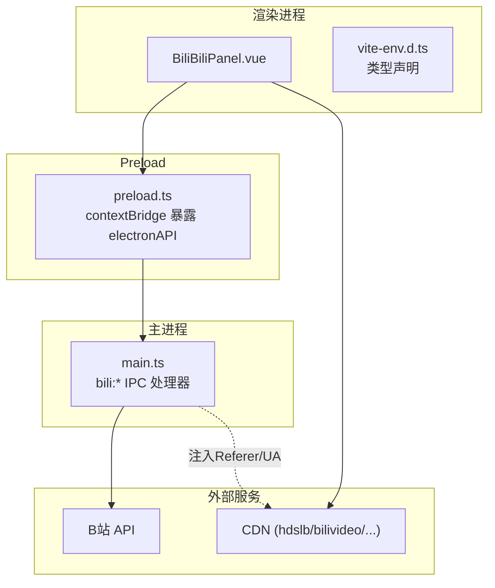
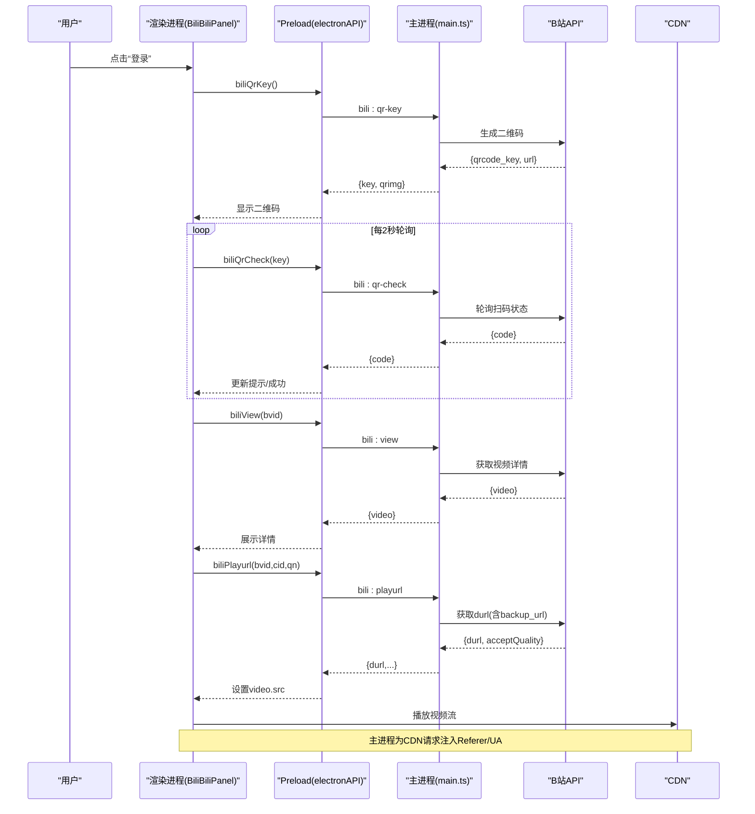
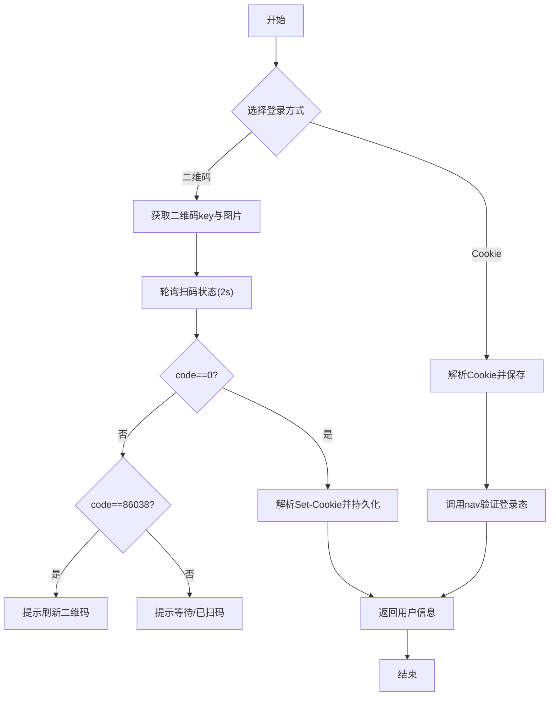
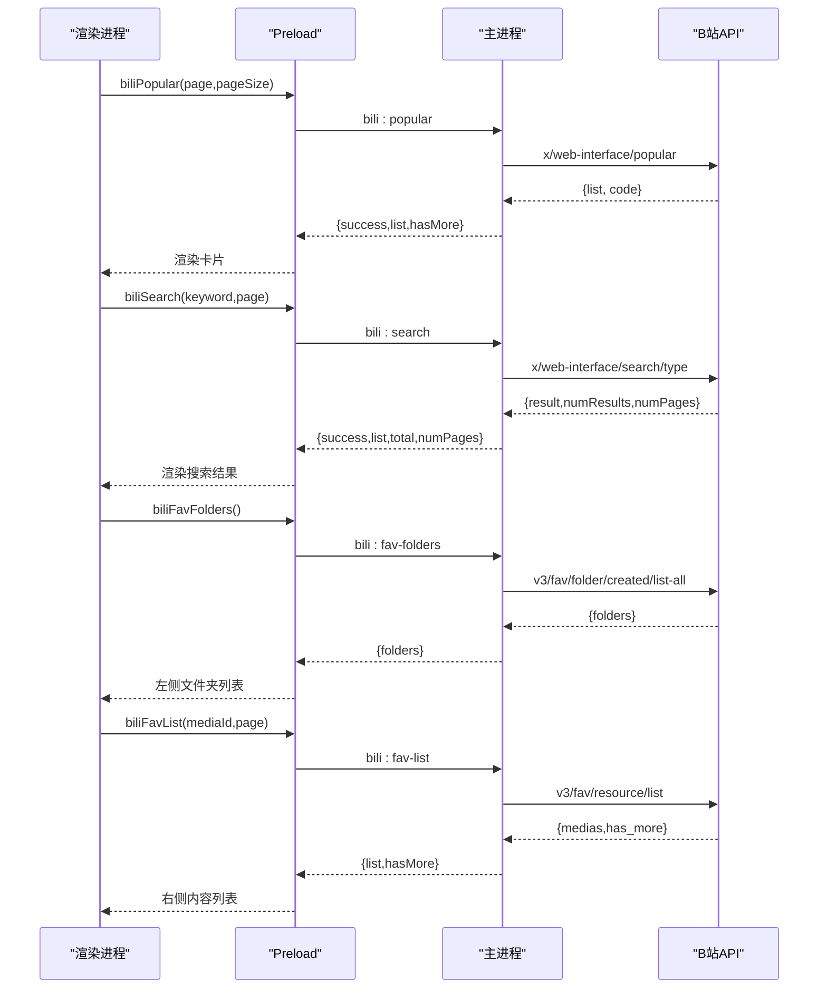
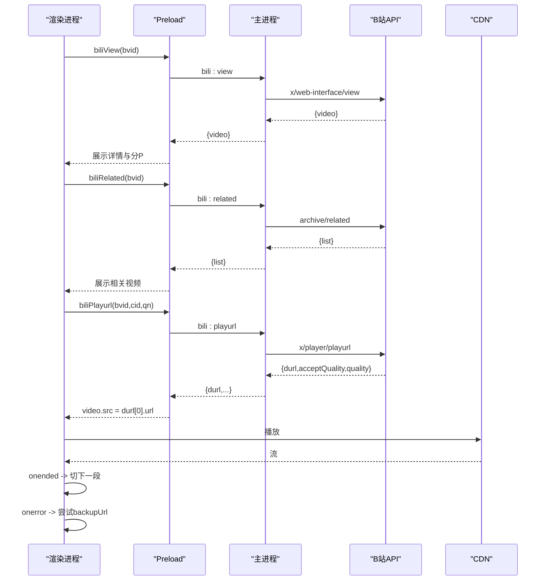
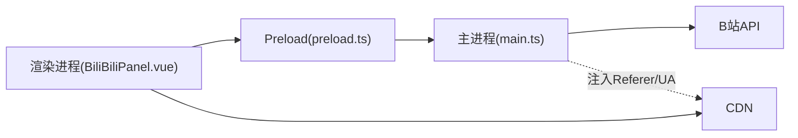

# 哔哩哔哩API集成

<cite>
**本文引用的文件**
- [BiliBiliPanel.vue](file://src/renderer/src/components/BiliBiliPanel.vue)
- [preload.ts](file://src/preload/preload.ts)
- [main.ts](file://src/main/main.ts)
- [vite-env.d.ts](file://src/renderer/src/vite-env.d.ts)
- [README.md](file://README.md)
- [overview.md](file://overview.md)
</cite>

## 目录
1. [简介](#简介)
2. [项目结构](#项目结构)
3. [核心组件](#核心组件)
4. [架构总览](#架构总览)
5. [详细组件分析](#详细组件分析)
6. [依赖关系分析](#依赖关系分析)
7. [性能与稳定性](#性能与稳定性)
8. [故障排查指南](#故障排查指南)
9. [结论](#结论)
10. [附录：接口契约与数据格式](#附录接口契约与数据格式)

## 简介
本文件面向“考研助手”应用中的哔哩哔哩（B站）在线学习视频集成，系统化说明认证流程（二维码登录、Cookie 登录）、内容获取（热门推荐、搜索、收藏夹）、播放能力（分 P、清晰度、多分段自动连播、备用 CDN 切换）以及用户态管理（登录状态检查、退出登录）。文档同时给出完整的 IPC 接口契约、请求参数、响应结构与错误处理策略，帮助开发者快速理解并扩展该模块。

## 项目结构
- 渲染进程（Vue 3 + Element Plus）
  - B 站面板组件：负责 UI、交互与调用 electronAPI
  - 类型声明：electronAPI 的 TypeScript 类型定义
- Preload 层
  - 暴露 bili:* 系列 IPC 方法给渲染进程
- 主进程（Electron）
  - 实现 bili:* IPC 处理器，统一代理 B 站 API
  - Cookie 持久化、防盗链 Referer/UA 注入、风控规避（buvid）
  - 播放流直连 CDN，避免跨域与代理开销

图表来源
- [BiliBiliPanel.vue:338-722](file://src/renderer/src/components/BiliBiliPanel.vue#L338-L722)
- [preload.ts:70-82](file://src/preload/preload.ts#L70-L82)
- [main.ts:2103-2499](file://src/main/main.ts#L2103-L2499)

章节来源
- [README.md:49-85](file://README.md#L49-L85)
- [overview.md:8-19](file://overview.md#L8-L19)

## 核心组件
- 认证与会话
  - 二维码登录：生成二维码、轮询扫码结果、成功后持久化 Cookie
  - Cookie 登录：粘贴浏览器 Cookie，校验后持久化
  - 登录状态检查：通过 nav 接口判断是否已登录并返回用户信息
  - 退出登录：清空本地 Cookie 并重置状态
- 内容获取
  - 热门推荐：无需登录，支持换一批与加载更多
  - 视频搜索：需 buvid，自动领取；分页返回总数与页数
  - 收藏夹：列出文件夹与分页内容，过滤失效资源
- 播放能力
  - 视频详情：标题、简介、分 P、统计数据
  - 播放地址：durl 合并流，支持清晰度选择与备用 CDN
  - 分 P 切换、相关视频推荐、多分段自动连播

章节来源
- [BiliBiliPanel.vue:354-722](file://src/renderer/src/components/BiliBiliPanel.vue#L354-L722)
- [main.ts:2249-2499](file://src/main/main.ts#L2249-L2499)

## 架构总览
渲染进程通过 electronAPI 调用主进程的 bili:* IPC 处理器，主进程统一封装对 B 站 API 的请求，自动附加 UA/Referer/Cookie，并在必要时从响应中回收 Set-Cookie 持久化到磁盘。播放时，渲染进程直接访问 B 站 CDN，主进程通过 webRequest 拦截媒体域名并注入 Referer/UA，绕过防盗链。

图表来源
- [BiliBiliPanel.vue:393-468](file://src/renderer/src/components/BiliBiliPanel.vue#L393-L468)
- [BiliBiliPanel.vue:610-693](file://src/renderer/src/components/BiliBiliPanel.vue#L610-L693)
- [preload.ts:71-82](file://src/preload/preload.ts#L71-L82)
- [main.ts:2249-2499](file://src/main/main.ts#L2249-L2499)

## 详细组件分析

### 认证流程（二维码登录 / Cookie 登录）
- 二维码登录
  - 前端调用 biliQrKey 获取二维码图片与 key，定时轮询 biliQrCheck
  - 轮询码含义：0=成功、86090=已扫码待确认、86038=过期
  - 成功后主进程解析 Set-Cookie 并从 crossDomain URL 提取关键凭证，持久化保存
- Cookie 登录
  - 前端传入 Cookie 字符串，主进程解析并保存，随后调用 nav 验证登录态
- 登录状态检查与退出
  - 启动或进入页面时调用 biliLoginStatus，返回用户信息与登录标志
  - 退出登录清空本地 Cookie 并重置前端状态

图表来源
- [BiliBiliPanel.vue:393-468](file://src/renderer/src/components/BiliBiliPanel.vue#L393-L468)
- [main.ts:2249-2348](file://src/main/main.ts#L2249-L2348)

章节来源
- [BiliBiliPanel.vue:354-468](file://src/renderer/src/components/BiliBiliPanel.vue#L354-L468)
- [main.ts:2107-2183](file://src/main/main.ts#L2107-L2183)
- [main.ts:2249-2348](file://src/main/main.ts#L2249-L2348)

### 内容获取（热门推荐 / 搜索 / 收藏夹）
- 热门推荐
  - 无需登录，支持“换一批”随机页与“加载更多”
- 视频搜索
  - 自动确保存在 buvid3/buvid4，缺失则通过 finger/spi 获取
  - 返回 total 与 numPages，便于分页导航
- 收藏夹
  - 先拉取文件夹列表，再按 mediaId 分页加载内容
  - 过滤失效资源（attr 非 0/1），格式化时长与封面

图表来源
- [main.ts:2352-2440](file://src/main/main.ts#L2352-L2440)
- [BiliBiliPanel.vue:470-581](file://src/renderer/src/components/BiliBiliPanel.vue#L470-L581)

章节来源
- [main.ts:2352-2440](file://src/main/main.ts#L2352-L2440)
- [BiliBiliPanel.vue:470-581](file://src/renderer/src/components/BiliBiliPanel.vue#L470-L581)

### 播放能力（详情 / 分P / 清晰度 / 多分段 / 相关推荐）
- 视频详情
  - 获取标题、简介、分 P 列表、统计数据、作者信息等
- 播放地址
  - 使用 fnval=1 获取 durl 合并流，包含 backup_url 用于失败回退
  - 支持 accept_quality 映射为中文标签，供用户切换清晰度
- 分 P 与多分段
  - 分 P 切换即重新请求 playurl
  - 长视频由多个 durl 组成，前端在 onended 时自动切换到下一段
- 相关视频
  - 异步加载，不阻塞播放，点击可直接切换播放

图表来源
- [main.ts:2444-2499](file://src/main/main.ts#L2444-L2499)
- [BiliBiliPanel.vue:610-693](file://src/renderer/src/components/BiliBiliPanel.vue#L610-L693)

章节来源
- [main.ts:2444-2499](file://src/main/main.ts#L2444-L2499)
- [BiliBiliPanel.vue:610-693](file://src/renderer/src/components/BiliBiliPanel.vue#L610-L693)

### 用户相关功能（登录状态检查、用户信息、收藏文件夹管理）
- 登录状态检查：调用 biliLoginStatus，返回 loggedIn 与 user（mid/uname/face/vipStatus）
- 退出登录：清理本地 Cookie，重置前端状态
- 收藏文件夹管理：获取文件夹列表与分页内容，过滤失效项

章节来源
- [main.ts:2292-2318](file://src/main/main.ts#L2292-L2318)
- [main.ts:2395-2440](file://src/main/main.ts#L2395-L2440)
- [BiliBiliPanel.vue:354-375](file://src/renderer/src/components/BiliBiliPanel.vue#L354-L375)

## 依赖关系分析
- 渲染进程依赖 preload 暴露的 electronAPI
- 主进程依赖 Node fetch 与 Electron session.webRequest
- 对外部服务的依赖：B 站 API、CDN、二维码生成服务（仅用于渲染显示）

图表来源
- [preload.ts:70-82](file://src/preload/preload.ts#L70-L82)
- [main.ts:2224-2247](file://src/main/main.ts#L2224-L2247)
- [BiliBiliPanel.vue:338-722](file://src/renderer/src/components/BiliBiliPanel.vue#L338-L722)

章节来源
- [preload.ts:70-82](file://src/preload/preload.ts#L70-L82)
- [main.ts:2224-2247](file://src/main/main.ts#L2224-L2247)

## 性能与稳定性
- 播放性能
  - 直连 CDN 减少代理开销，提升首帧速度
  - 多分段自动连播，减少用户操作
  - 备用 CDN 自动切换，提高容错率
- 网络与风控
  - 自动领取 buvid3/buvid4，降低搜索被 -412 拦截概率
  - 统一 UA/Referer，减少鉴权失败
- 内存与带宽
  - 关闭播放器弹窗时主动释放 video 与 segments，避免泄漏

章节来源
- [BiliBiliPanel.vue:672-703](file://src/renderer/src/components/BiliBiliPanel.vue#L672-L703)
- [main.ts:2153-2166](file://src/main/main.ts#L2153-L2166)
- [main.ts:2224-2247](file://src/main/main.ts#L2224-L2247)

## 故障排查指南
- 二维码登录失败
  - 检查 bili:qr-key 与 bili:qr-check 返回值
  - 若 code=86038 表示过期，需刷新二维码
- 搜索被风控（-412）
  - 确保已执行 biliEnsureBuvid，或先登录以增强信任度
- 播放失败
  - 检查 bili:playurl 返回的 durl 与 acceptQuality
  - 优先尝试备用 CDN（backupUrl），再切换清晰度
  - 确认主进程已安装 CDN 请求头注入（Referer/UA）
- 收藏夹无法加载
  - 确认已登录且 DedeUserID 存在
  - 过滤 attr 非 0/1 的资源

章节来源
- [main.ts:2153-2166](file://src/main/main.ts#L2153-L2166)
- [main.ts:2224-2247](file://src/main/main.ts#L2224-L2247)
- [BiliBiliPanel.vue:682-693](file://src/renderer/src/components/BiliBiliPanel.vue#L682-L693)

## 结论
本模块通过主进程统一代理 B 站 API，结合 Cookie 持久化、防盗链注入与风控规避，实现了稳定的二维码/Cookie 登录、内容浏览与播放能力。前端采用清晰的组件职责划分与健壮的错误处理，提供友好的用户体验。后续可扩展更多 B 站能力（如弹幕、评论等），并保持现有架构一致性与可维护性。

## 附录：接口契约与数据格式

### 认证与会话
- bili:qr-key
  - 入参：无
  - 出参：{ success, key, qrimg, message? }
- bili:qr-check
  - 入参：key
  - 出参：{ success, code, message? }
- bili:login-status
  - 入参：无
  - 出参：{ success, loggedIn, user?, message? }
- bili:set-cookie
  - 入参：cookieStr
  - 出参：{ success, loggedIn, user?, message? }
- bili:logout
  - 入参：无
  - 出参：{ success }

章节来源
- [main.ts:2249-2348](file://src/main/main.ts#L2249-L2348)
- [preload.ts:71-75](file://src/preload/preload.ts#L71-L75)
- [vite-env.d.ts:205-208](file://src/renderer/src/vite-env.d.ts#L205-L208)

### 内容获取
- bili:popular
  - 入参：page, pageSize
  - 出参：{ success, list, hasMore, message? }
- bili:search
  - 入参：keyword, page
  - 出参：{ success, list, total, numPages, message? }
- bili:fav-folders
  - 入参：无
  - 出参：{ success, folders[], message? }
- bili:fav-list
  - 入参：mediaId, page
  - 出参：{ success, list, hasMore, message? }

章节来源
- [main.ts:2352-2440](file://src/main/main.ts#L2352-L2440)
- [preload.ts:76-80](file://src/preload/preload.ts#L76-L80)
- [vite-env.d.ts:209-213](file://src/renderer/src/vite-env.d.ts#L209-L213)

### 播放相关
- bili:view
  - 入参：bvid
  - 出参：{ success, video?, message? }
  - video 字段：bvid, aid, title, pic, desc, duration, pubdate, owner, stat, pages[]
- bili:related
  - 入参：bvid
  - 出参：{ success, list[], message? }
- bili:playurl
  - 入参：bvid, cid, qn
  - 出参：{ success, quality, qualityLabel, acceptQuality[], durl[], message? }
  - durl 元素：url, backupUrl[], size, length

章节来源
- [main.ts:2444-2499](file://src/main/main.ts#L2444-L2499)
- [preload.ts:81-82](file://src/preload/preload.ts#L81-L82)
- [vite-env.d.ts:214-219](file://src/renderer/src/vite-env.d.ts#L214-L219)

### 错误处理要点
- 所有接口统一返回 { success, ... , message? }
- 常见错误
  - 未登录：收藏夹接口返回未登录提示
  - 风控拦截：搜索返回 -412，建议重试或先登录
  - 播放受限：durl 为空或清晰度不足，提示切换清晰度或检查权限
  - 网络异常：HTTP 状态非 200，抛出错误并提示重试

章节来源
- [main.ts:2376-2390](file://src/main/main.ts#L2376-L2390)
- [main.ts:2473-2499](file://src/main/main.ts#L2473-L2499)
- [BiliBiliPanel.vue:682-693](file://src/renderer/src/components/BiliBiliPanel.vue#L682-L693)