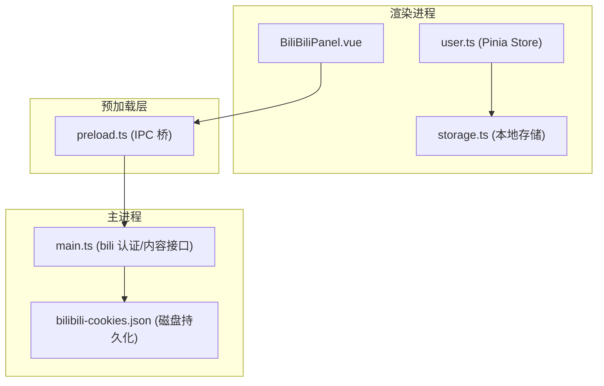
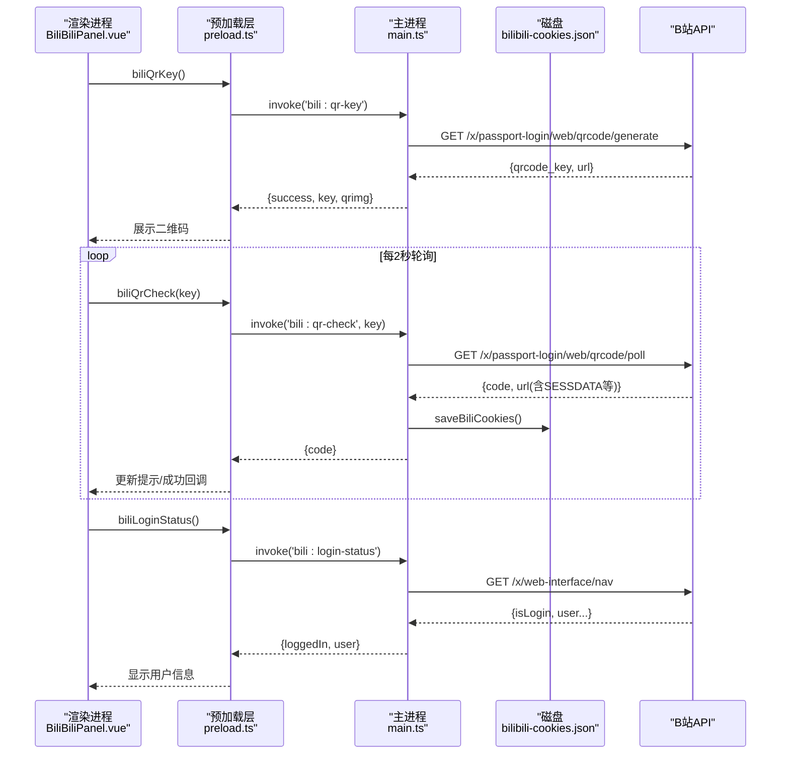
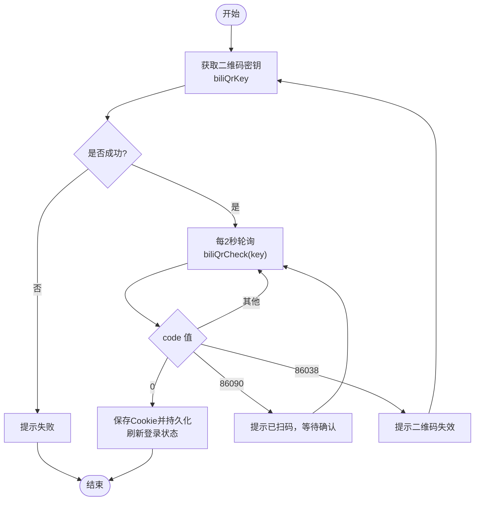
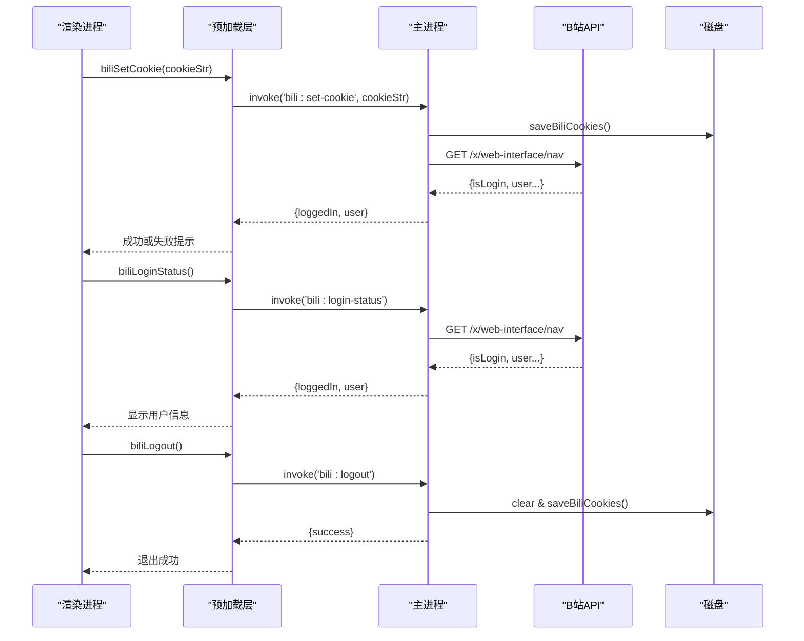
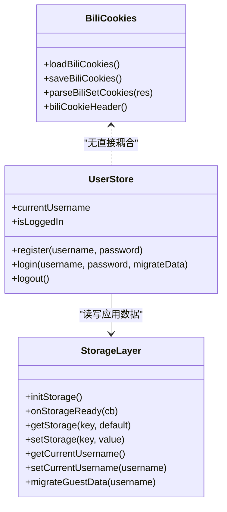
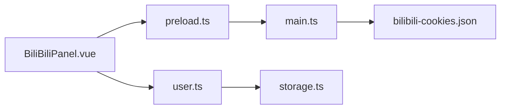

# 哔哩哔哩认证系统

<cite>
**本文引用的文件**
- [main.ts](file://src/main/main.ts)
- [preload.ts](file://src/preload/preload.ts)
- [BiliBiliPanel.vue](file://src/renderer/src/components/BiliBiliPanel.vue)
- [storage.ts](file://src/renderer/src/utils/storage.ts)
- [user.ts](file://src/renderer/src/stores/user.ts)
</cite>

## 目录
1. [简介](#简介)
2. [项目结构](#项目结构)
3. [核心组件](#核心组件)
4. [架构总览](#架构总览)
5. [详细组件分析](#详细组件分析)
6. [依赖关系分析](#依赖关系分析)
7. [性能考虑](#性能考虑)
8. [故障排查指南](#故障排查指南)
9. [结论](#结论)
10. [附录：接口调用示例与错误处理](#附录接口调用示例与错误处理)

## 简介
本文件为“考研助手”中哔哩哔哩认证系统的技术文档，聚焦以下目标：
- 二维码登录流程：获取二维码密钥、轮询检查登录状态、处理登录成功回调。
- Cookie 管理功能：手动设置 Cookie、验证登录状态、退出登录。
- 本地存储与同步机制：应用内用户数据持久化（非 B 站 Cookie），以及主进程侧 B 站 Cookie 的持久化。
- 完整认证接口调用示例：包括错误处理与异常场景。
- 安全考虑与最佳实践建议。

## 项目结构
本项目采用 Electron 多进程架构：
- 渲染进程（Vue）：提供 UI 与交互逻辑，通过 preload 暴露的 API 调用主进程能力。
- 预加载脚本（preload）：桥接渲染进程与主进程 IPC 通道。
- 主进程（Electron Main）：封装网络请求、Cookie 管理、持久化与业务逻辑。

图表来源
- [BiliBiliPanel.vue:338-470](file://src/renderer/src/components/BiliBiliPanel.vue#L338-L470)
- [preload.ts:71-88](file://src/preload/preload.ts#L71-L88)
- [main.ts:2108-2184](file://src/main/main.ts#L2108-L2184)

章节来源
- [BiliBiliPanel.vue:338-470](file://src/renderer/src/components/BiliBiliPanel.vue#L338-L470)
- [preload.ts:71-88](file://src/preload/preload.ts#L71-L88)
- [main.ts:2108-2184](file://src/main/main.ts#L2108-L2184)

## 核心组件
- 渲染层面板（BiliBiliPanel.vue）：负责二维码登录弹窗、Cookie 登录输入、登录状态刷新、热门/收藏/搜索/播放等交互。
- 预加载层（preload.ts）：将 bili:* 系列 IPC 方法暴露给渲染进程。
- 主进程（main.ts）：实现二维码生成与轮询、登录状态查询、Cookie 解析与持久化、内容接口代理。
- 本地存储（storage.ts + user.ts）：应用自身账号体系与数据迁移（与 B 站认证解耦）。

章节来源
- [BiliBiliPanel.vue:338-470](file://src/renderer/src/components/BiliBiliPanel.vue#L338-L470)
- [preload.ts:71-88](file://src/preload/preload.ts#L71-L88)
- [main.ts:2108-2184](file://src/main/main.ts#L2108-L2184)
- [storage.ts:14-25](file://src/renderer/src/utils/storage.ts#L14-L25)
- [user.ts:14-84](file://src/renderer/src/stores/user.ts#L14-L84)

## 架构总览
下图展示了从渲染进程到主进程的认证与内容访问链路，以及 Cookie 的持久化路径。

图表来源
- [BiliBiliPanel.vue:393-433](file://src/renderer/src/components/BiliBiliPanel.vue#L393-L433)
- [preload.ts:71-75](file://src/preload/preload.ts#L71-L75)
- [main.ts:2315-2376](file://src/main/main.ts#L2315-L2376)
- [main.ts:2108-2184](file://src/main/main.ts#L2108-L2184)

## 详细组件分析

### 二维码登录流程
- 获取二维码密钥：渲染进程调用 biliQrKey，主进程请求 B 站二维码生成接口，返回 qrcode_key 与在线二维码图片地址。
- 轮询检查登录状态：渲染进程每 2 秒调用 biliQrCheck，主进程轮询 B 站扫码状态接口，根据 code 分支处理：
  - 0：登录成功，解析 Set-Cookie 与 URL 中的 SESSDATA 等关键参数并持久化。
  - 86090：已扫码待确认。
  - 86038：二维码过期，提示刷新。
- 登录成功回调：停止轮询，关闭弹窗，刷新登录状态并进入收藏夹页时自动加载。

图表来源
- [BiliBiliPanel.vue:393-433](file://src/renderer/src/components/BiliBiliPanel.vue#L393-L433)
- [main.ts:2315-2354](file://src/main/main.ts#L2315-L2354)

章节来源
- [BiliBiliPanel.vue:393-433](file://src/renderer/src/components/BiliBiliPanel.vue#L393-L433)
- [main.ts:2315-2354](file://src/main/main.ts#L2315-L2354)

### Cookie 管理功能
- 手动设置 Cookie：用户在浏览器控制台复制 Cookie 字符串，粘贴至面板后调用 biliSetCookie。主进程解析键值对并持久化，随后调用 nav 接口验证登录态。
- 验证登录状态：调用 biliLoginStatus，主进程通过 nav 接口判断 isLogin 并返回用户基本信息。
- 退出登录：调用 biliLogout，清空内存中的 biliCookies 并持久化，使后续请求不再携带凭证。

图表来源
- [BiliBiliPanel.vue:445-468](file://src/renderer/src/components/BiliBiliPanel.vue#L445-L468)
- [preload.ts:71-75](file://src/preload/preload.ts#L71-L75)
- [main.ts:2357-2412](file://src/main/main.ts#L2357-L2412)

章节来源
- [BiliBiliPanel.vue:445-468](file://src/renderer/src/components/BiliBiliPanel.vue#L445-L468)
- [main.ts:2357-2412](file://src/main/main.ts#L2357-L2412)

### 登录状态的本地存储与同步机制
- 应用自身用户数据（用户名、密码哈希、当前用户、数据迁移等）使用 storage.ts 提供的 localStorage 实时持久化与内存缓存机制，并通过 Pinia store（user.ts）进行状态管理与同步。
- B 站 Cookie 在主进程中通过 Map 维护并在每次变更时写入 bilibili-cookies.json，确保重启后仍保持登录态。

图表来源
- [storage.ts:14-25](file://src/renderer/src/utils/storage.ts#L14-L25)
- [storage.ts:144-201](file://src/renderer/src/utils/storage.ts#L144-L201)
- [storage.ts:205-246](file://src/renderer/src/utils/storage.ts#L205-L246)
- [user.ts:14-84](file://src/renderer/src/stores/user.ts#L14-L84)
- [main.ts:2108-2184](file://src/main/main.ts#L2108-L2184)

章节来源
- [storage.ts:144-201](file://src/renderer/src/utils/storage.ts#L144-L201)
- [storage.ts:205-246](file://src/renderer/src/utils/storage.ts#L205-L246)
- [user.ts:14-84](file://src/renderer/src/stores/user.ts#L14-L84)
- [main.ts:2108-2184](file://src/main/main.ts#L2108-L2184)

### 认证相关接口调用示例与错误处理
以下为常见调用路径与错误处理要点（以代码片段路径引用代替具体代码内容）：
- 获取二维码密钥
  - 调用路径：[BiliBiliPanel.vue:393-433](file://src/renderer/src/components/BiliBiliPanel.vue#L393-L433) → [preload.ts:71](file://src/preload/preload.ts#L71) → [main.ts:2315-2329](file://src/main/main.ts#L2315-L2329)
  - 错误处理：若返回 success=false，提示“二维码获取失败”，可重试。
- 轮询扫码状态
  - 调用路径：[BiliBiliPanel.vue:411-428](file://src/renderer/src/components/BiliBiliPanel.vue#L411-L428) → [preload.ts:72](file://src/preload/preload.ts#L72) → [main.ts:2332-2354](file://src/main/main.ts#L2332-L2354)
  - 错误处理：捕获异常并提示；code=86038 时提示“二维码已失效”，需重新获取。
- 设置 Cookie 登录
  - 调用路径：[BiliBiliPanel.vue:445-468](file://src/renderer/src/components/BiliBiliPanel.vue#L445-L468) → [preload.ts:75](file://src/preload/preload.ts#L75) → [main.ts:2386-2412](file://src/main/main.ts#L2386-L2412)
  - 错误处理：空 Cookie 提示；nav 校验失败提示“Cookie 已保存但登录验证失败”。
- 查询登录状态
  - 调用路径：[BiliBiliPanel.vue:357-365](file://src/renderer/src/components/BiliBiliPanel.vue#L357-L365) → [preload.ts:73](file://src/preload/preload.ts#L73) → [main.ts:2357-2376](file://src/main/main.ts#L2357-L2376)
  - 错误处理：捕获异常并置用户为空。
- 退出登录
  - 调用路径：[BiliBiliPanel.vue:367-375](file://src/renderer/src/components/BiliBiliPanel.vue#L367-L375) → [preload.ts:74](file://src/preload/preload.ts#L74) → [main.ts:2378-2383](file://src/main/main.ts#L2378-L2383)
  - 错误处理：清空 Cookie 并持久化，提示“已退出 B 站登录”。

章节来源
- [BiliBiliPanel.vue:357-468](file://src/renderer/src/components/BiliBiliPanel.vue#L357-L468)
- [preload.ts:71-75](file://src/preload/preload.ts#L71-L75)
- [main.ts:2315-2412](file://src/main/main.ts#L2315-L2412)

## 依赖关系分析
- 渲染进程依赖预加载层暴露的 bili:* IPC 方法。
- 主进程依赖 Node.js fs 模块持久化 Cookie，依赖 fetch 发起 HTTP 请求，并解析响应头 Set-Cookie。
- 应用自身用户数据依赖 storage.ts 的 localStorage 与内存缓存，Pinia store 负责状态同步。

图表来源
- [BiliBiliPanel.vue:338-470](file://src/renderer/src/components/BiliBiliPanel.vue#L338-L470)
- [preload.ts:71-88](file://src/preload/preload.ts#L71-L88)
- [main.ts:2108-2184](file://src/main/main.ts#L2108-L2184)
- [user.ts:14-84](file://src/renderer/src/stores/user.ts#L14-L84)
- [storage.ts:144-201](file://src/renderer/src/utils/storage.ts#L144-L201)

章节来源
- [BiliBiliPanel.vue:338-470](file://src/renderer/src/components/BiliBiliPanel.vue#L338-L470)
- [preload.ts:71-88](file://src/preload/preload.ts#L71-L88)
- [main.ts:2108-2184](file://src/main/main.ts#L2108-L2184)
- [user.ts:14-84](file://src/renderer/src/stores/user.ts#L14-L84)
- [storage.ts:144-201](file://src/renderer/src/utils/storage.ts#L144-L201)

## 性能考虑
- 轮询频率：二维码轮询间隔为 2 秒，兼顾及时性与网络开销。
- Cookie 持久化：仅在变化时写入磁盘，避免频繁 I/O。
- 搜索前自动补齐 buvid：缺失时仅一次请求获取，减少后续风控拦截风险。
- WBI 签名缓存：密钥缓存 30 分钟，降低重复计算与请求次数。

[本节为通用性能讨论，不直接分析具体文件]

## 故障排查指南
- 二维码获取失败：检查网络与 B 站接口可用性；若返回 message，按提示重试。
- 轮询无响应：确认 key 有效且未过期；若 code=86038，重新获取二维码。
- Cookie 登录失败：确认 Cookie 包含 SESSDATA 等必要字段；nav 校验失败需检查有效期。
- 搜索被风控：确保已获取 buvid3/buvid4；必要时先登录再搜索。
- 播放失败：尝试切换清晰度或备用 CDN；检查 Referer/User-Agent 是否正确注入。

章节来源
- [BiliBiliPanel.vue:411-433](file://src/renderer/src/components/BiliBiliPanel.vue#L411-L433)
- [main.ts:2154-2167](file://src/main/main.ts#L2154-L2167)
- [main.ts:2315-2412](file://src/main/main.ts#L2315-L2412)

## 结论
该认证系统通过主进程统一代理 B 站接口，实现了安全的二维码登录与 Cookie 管理，结合渲染层的友好交互与完善的错误处理，提供了稳定的认证体验。应用自身用户数据通过独立的本地存储机制保证持久化与同步，与 B 站认证解耦，便于扩展与维护。

[本节为总结性内容，不直接分析具体文件]

## 附录：接口调用示例与错误处理
以下为常用认证相关 IPC 调用示例（以路径引用代替具体代码）：
- 获取二维码密钥
  - 前端调用：[BiliBiliPanel.vue:393-433](file://src/renderer/src/components/BiliBiliPanel.vue#L393-L433)
  - 主进程实现：[main.ts:2315-2329](file://src/main/main.ts#L2315-L2329)
  - 错误处理：success=false 时提示失败并重试。
- 轮询扫码状态
  - 前端调用：[BiliBiliPanel.vue:411-428](file://src/renderer/src/components/BiliBiliPanel.vue#L411-L428)
  - 主进程实现：[main.ts:2332-2354](file://src/main/main.ts#L2332-L2354)
  - 错误处理：捕获异常；code=86038 提示过期。
- 设置 Cookie 登录
  - 前端调用：[BiliBiliPanel.vue:445-468](file://src/renderer/src/components/BiliBiliPanel.vue#L445-L468)
  - 主进程实现：[main.ts:2386-2412](file://src/main/main.ts#L2386-L2412)
  - 错误处理：空 Cookie 提示；nav 校验失败提示无效。
- 查询登录状态
  - 前端调用：[BiliBiliPanel.vue:357-365](file://src/renderer/src/components/BiliBiliPanel.vue#L357-L365)
  - 主进程实现：[main.ts:2357-2376](file://src/main/main.ts#L2357-L2376)
  - 错误处理：异常时置用户为空。
- 退出登录
  - 前端调用：[BiliBiliPanel.vue:367-375](file://src/renderer/src/components/BiliBiliPanel.vue#L367-L375)
  - 主进程实现：[main.ts:2378-2383](file://src/main/main.ts#L2378-L2383)
  - 错误处理：清空并持久化 Cookie。

章节来源
- [BiliBiliPanel.vue:357-468](file://src/renderer/src/components/BiliBiliPanel.vue#L357-L468)
- [main.ts:2315-2412](file://src/main/main.ts#L2315-L2412)