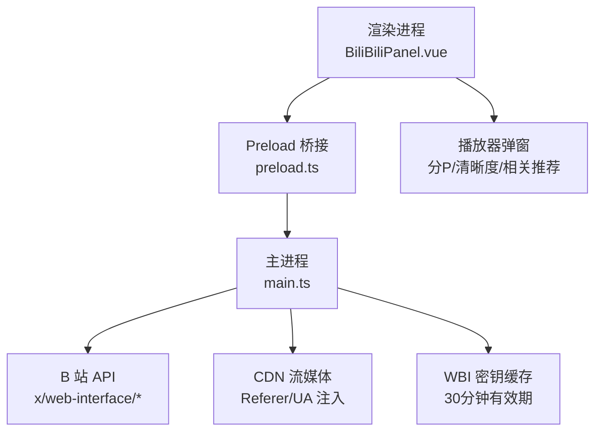
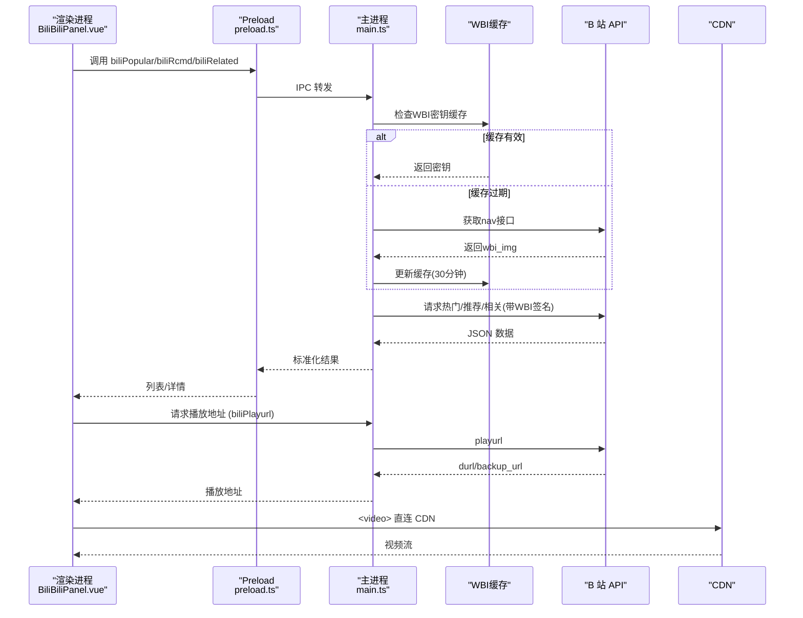
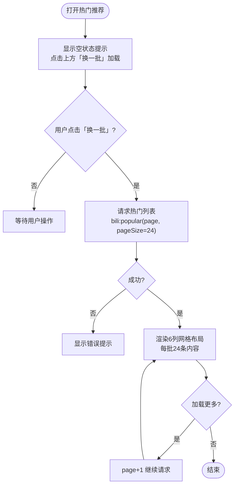
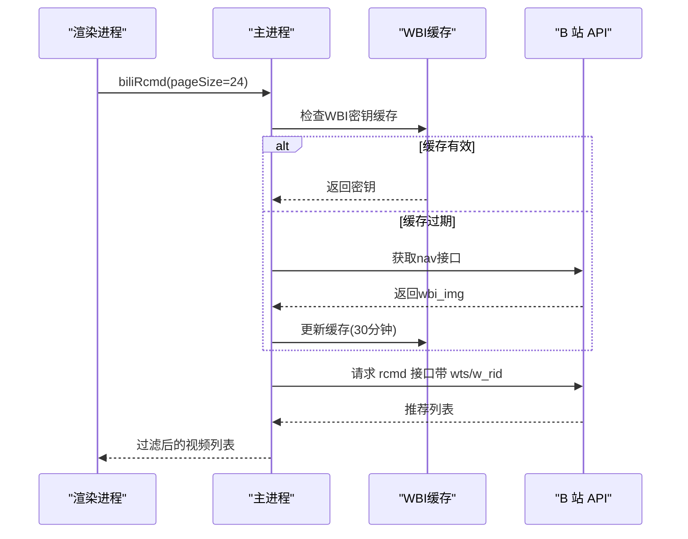
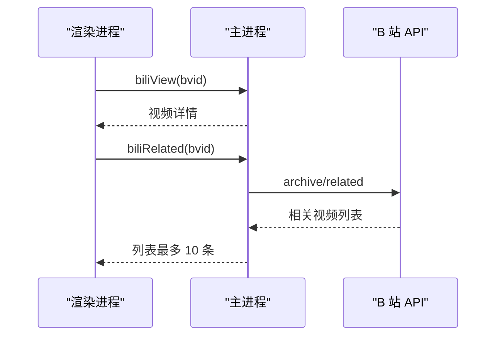
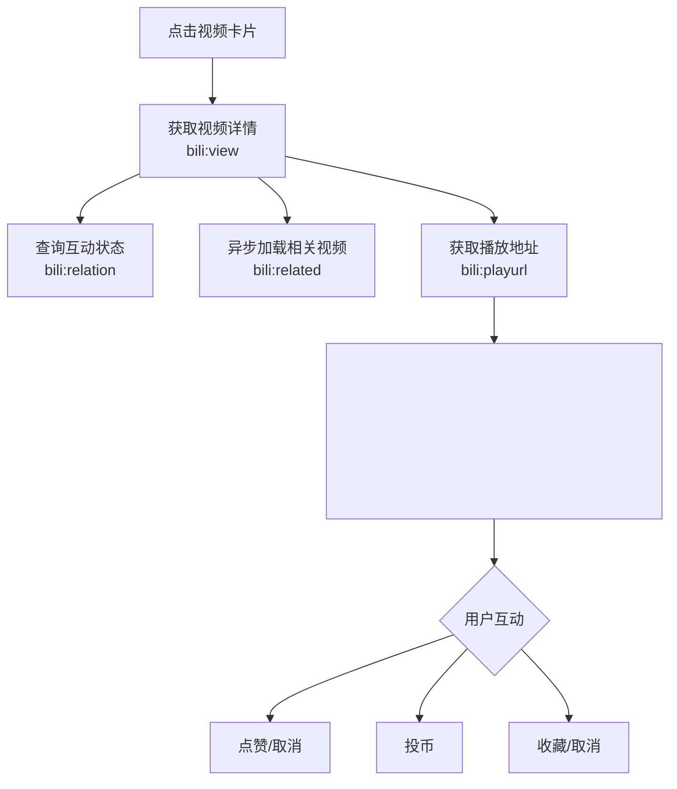
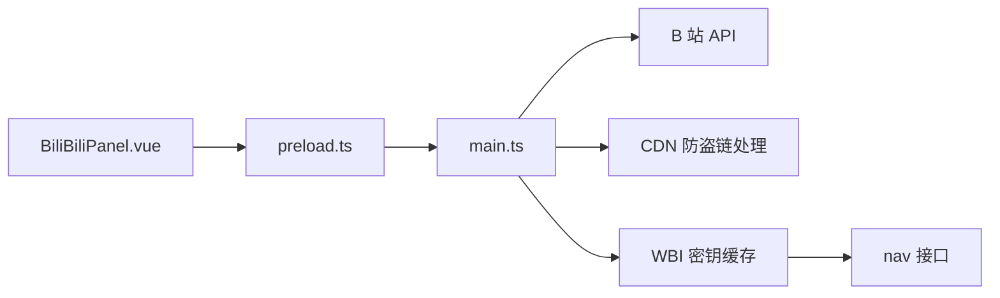

# 推荐系统

<cite>
**本文引用的文件**
- [README.md](file://README.md)
- [BiliBiliPanel.vue](file://src/renderer/src/components/BiliBiliPanel.vue)
- [preload.ts](file://src/preload/preload.ts)
- [main.ts](file://src/main/main.ts)
</cite>

## 更新摘要
**所做更改**
- v3.5.6版本更新了推荐系统的网格布局从cols-4改为cols-6，提供更好的空间利用率和更紧凑的卡片展示
- 改进热门视频的加载行为，现在需要用户手动点击刷新按钮来加载内容，提升初始页面加载性能
- 优化了推荐内容的显示密度，每批24条内容采用6×4网格布局
- 增强了用户体验，减少不必要的网络请求和渲染开销

## 目录
1. [简介](#简介)
2. [项目结构](#项目结构)
3. [核心组件](#核心组件)
4. [架构总览](#架构总览)
5. [详细组件分析](#详细组件分析)
6. [依赖关系分析](#依赖关系分析)
7. [性能与体验优化](#性能与体验优化)
8. [故障排查指南](#故障排查指南)
9. [结论](#结论)
10. [附录：API 与数据模型](#附录api-与数据模型)

## 简介
本仓库在"考研助手"桌面应用中集成了哔哩哔哩在线学习视频能力，并在"学习资料页"中提供热门推荐、个性化推荐、收藏夹浏览、搜索与播放等功能。推荐系统由渲染层（Vue 组件）与主进程（Electron IPC 代理）共同实现：渲染层负责交互与展示，主进程负责调用 B 站 API、处理 WBI 签名与防盗链、返回标准化数据。

该实现覆盖以下推荐类型：
- **热门推荐**：无需登录即可获取热门视频列表，支持换一批与加载更多。**v3.5.6更新**：首次进入不自动加载，需用户手动点击"换一批"按钮触发加载。
- **个性化推荐**：登录后基于首页 feed/rcmd 接口按用户兴趣推荐，使用 WBI 签名确保请求合法性，支持换一批和批量刷新。
- **相关推荐**：播放某视频后，拉取与该视频相关的推荐内容，用于弹窗内"相关视频"。

数据来源均为 B 站公开 API，通过主进程统一代理，避免跨域问题并注入必要请求头以绕过 CDN 防盗链。

**章节来源**
- [README.md:43-86](file://README.md#L43-L86)

## 项目结构
本项目采用 Electron + Vue 3 的常见分层：
- 渲染进程（renderer）：Vue 页面与组件，包含哔哩哔哩面板组件。
- Preload：通过 contextBridge 暴露受限 API 给渲染进程。
- 主进程（main）：IPC 处理器，封装 B 站 API 调用、WBI 签名、Cookie/登录态管理、CDN 请求头注入等。

**图表来源**
- [BiliBiliPanel.vue:43-114](file://src/renderer/src/components/BiliBiliPanel.vue#L43-L114)
- [preload.ts:70-88](file://src/preload/preload.ts#L70-L88)
- [main.ts:2416-2438](file://src/main/main.ts#L2416-L2438)

**章节来源**
- [README.md:178-208](file://README.md#L178-L208)

## 核心组件
- **哔哩哔哩面板组件（BiliBiliPanel.vue）**：提供"个性推荐""热门推荐""收藏夹""搜索结果"四个标签页；点击卡片进入播放器弹窗；弹窗内支持分 P 切换、清晰度选择、点赞/投币/收藏、相关视频推荐。
- **Preload 桥接（preload.ts）**：将主进程的 bili* IPC 方法暴露给渲染进程，包括登录、推荐、搜索、播放、收藏等。
- **主进程代理（main.ts）**：实现所有 bili* IPC 处理器，封装热门、相关、搜索、播放、收藏、个性化推荐等逻辑，并处理 WBI 签名、buvid 防风控、Referer/UA 注入等。

**章节来源**
- [BiliBiliPanel.vue:403-800](file://src/renderer/src/components/BiliBiliPanel.vue#L403-L800)
- [preload.ts:70-88](file://src/preload/preload.ts#L70-L88)
- [main.ts:2416-2586](file://src/main/main.ts#L2416-L2586)

## 架构总览
推荐系统的整体流程如下：
- 渲染层发起请求（如加载热门、个性化推荐、相关视频）。
- Preload 通过 IPC 转发到主进程。
- 主进程调用 B 站 API，必要时进行 WBI 签名、领取 buvid、注入 Referer/UA。
- 主进程返回标准化数据，渲染层展示卡片或进入播放器。
- 播放器从主进程获取播放地址，直连 CDN 播放，失败时自动切换备用 CDN。

**图表来源**
- [BiliBiliPanel.vue:539-575](file://src/renderer/src/components/BiliBiliPanel.vue#L539-L575)
- [preload.ts:70-88](file://src/preload/preload.ts#L70-L88)
- [main.ts:2416-2438](file://src/main/main.ts#L2416-L2438)
- [main.ts:2537-2563](file://src/main/main.ts#L2537-L2563)
- [main.ts:2225-2246](file://src/main/main.ts#L2225-L2246)

## 详细组件分析

### 热门推荐
- **入口**：渲染层"热门推荐"标签页，点击"换一批"或"加载更多"。
- **数据源**：主进程调用 x/web-interface/popular，分页参数 ps/pn。
- **行为**：
  - **"换一批"**：随机跳页，避免重复看同一批。
  - **"加载更多"**：追加下一页。
  - **v3.5.6更新**：**首次进入不自动加载**，显示空状态提示用户点击"换一批"按钮，提升初始页面加载性能。
  - 列表项包含封面、时长、标题、作者、播放量等。
  - **v3.5.6更新**：采用**6列网格布局**（cols-6），每批24条内容（6×4），提供更紧凑的展示效果。
- **错误处理**：网络或接口异常时提示错误信息。

**图表来源**
- [BiliBiliPanel.vue:80-119](file://src/renderer/src/components/BiliBiliPanel.vue#L80-L119)
- [BiliBiliPanel.vue:632-649](file://src/renderer/src/components/BiliBiliPanel.vue#L632-L649)

**章节来源**
- [BiliBiliPanel.vue:79-114](file://src/renderer/src/components/BiliBiliPanel.vue#L79-L114)
- [BiliBiliPanel.vue:632-649](file://src/renderer/src/components/BiliBiliPanel.vue#L632-L649)

### 个性化推荐
- **入口**：渲染层"个性推荐"标签页，点击"换一批"。
- **数据源**：主进程调用 x/web-interface/wbi/index/top/feed/rcmd，使用 WBI 签名，过滤直播与广告。
- **行为**：
  - 首次加载需确保 buvid 存在，避免风控。
  - 每次"换一批"重新请求，返回新的推荐列表。
  - 列表项为普通视频（show_info=1），不含商业推广。
  - **新增**：支持批量刷新功能，可一次性获取多组推荐数据。
  - **v3.5.6更新**：采用**6列网格布局**，每批24条内容（6×4）。
- **错误处理**：WBI 密钥轮换时清理缓存并重试。

**图表来源**
- [BiliBiliPanel.vue:43-77](file://src/renderer/src/components/BiliBiliPanel.vue#L43-L77)
- [main.ts:2225-2246](file://src/main/main.ts#L2225-L2246)
- [main.ts:2567-2586](file://src/main/main.ts#L2567-L2586)

**章节来源**
- [BiliBiliPanel.vue:43-77](file://src/renderer/src/components/BiliBiliPanel.vue#L43-L77)
- [main.ts:2567-2586](file://src/main/main.ts#L2567-L2586)

### 相关推荐
- **入口**：播放器弹窗内，异步加载当前视频的"相关视频"。
- **数据源**：主进程调用 x/web-interface/archive/related?bvid=...
- **行为**：
  - 不阻塞起播，失败不影响播放。
  - 最多展示 10 条，移入右侧栏独立滚动展示。
  - 点击可直接切换到相关视频播放。
- **错误处理**：静默忽略失败。

**图表来源**
- [BiliBiliPanel.vue:785-787](file://src/renderer/src/components/BiliBiliPanel.vue#L785-L787)
- [main.ts:2428-2438](file://src/main/main.ts#L2428-L2438)

**章节来源**
- [BiliBiliPanel.vue:340-363](file://src/renderer/src/components/BiliBiliPanel.vue#L340-L363)
- [main.ts:2428-2438](file://src/main/main.ts#L2428-L2438)

### 收藏夹与搜索（辅助推荐场景）
- **收藏夹**：登录后拉取文件夹列表与内容，过滤失效资源，支持分页加载。
- **搜索**：关键词搜索视频，自动领取 buvid 防风控，支持分页与总数统计。
- **作用**：为用户主动发现内容提供补充，间接影响后续推荐质量（通过互动反馈）。

**章节来源**
- [BiliBiliPanel.vue:577-664](file://src/renderer/src/components/BiliBiliPanel.vue#L577-L664)
- [main.ts:2440-2455](file://src/main/main.ts#L2440-L2455)
- [main.ts:2459-2504](file://src/main/main.ts#L2459-L2504)

### 播放器与用户反馈
- **播放器弹窗**：支持分 P 切换、清晰度选择、多分段自动连播、备用 CDN 失败自动切换。
- **用户反馈**：点赞、投币、收藏状态查询与操作，需登录态。
- **效果评估**：可通过用户互动（点赞/投币/收藏）作为反馈信号，用于后续推荐优化（例如提升相似主题权重）。

**图表来源**
- [BiliBiliPanel.vue:767-793](file://src/renderer/src/components/BiliBiliPanel.vue#L767-L793)
- [main.ts:2508-2563](file://src/main/main.ts#L2508-L2563)
- [main.ts:2588-2646](file://src/main/main.ts#L2588-L2646)

**章节来源**
- [BiliBiliPanel.vue:235-365](file://src/renderer/src/components/BiliBiliPanel.vue#L235-L365)
- [main.ts:2508-2646](file://src/main/main.ts#L2508-L2646)

### WBI 签名与缓存管理（v3.5.4 新增）
- **WBI 密钥获取**：从 nav 接口获取 img_key 和 sub_key，提取文件名作为密钥。
- **密钥缓存**：内存缓存 30 分钟，减少频繁请求 nav 接口。
- **签名算法**：按照 B 站 WBI 规范对参数进行排序、拼接、MD5 加密。
- **错误处理**：当检测到 WBI 相关错误时，自动清空缓存并重新获取密钥。

**章节来源**
- [main.ts:2218-2247](file://src/main/main.ts#L2218-L2247)
- [main.ts:2582-2584](file://src/main/main.ts#L2582-L2584)

## 依赖关系分析
- 渲染层依赖 Preload 暴露的 bili* 方法，不直接访问主进程。
- 主进程集中处理所有 B 站 API 调用，保证安全与一致性。
- 播放器直连 CDN，主进程仅负责注入 Referer/UA，减少中转开销。
- 推荐算法依赖 B 站官方接口（热门、个性化、相关），本地不进行复杂计算。
- **新增**：WBI 签名模块依赖缓存机制，提高推荐接口调用效率。

**图表来源**
- [preload.ts:70-88](file://src/preload/preload.ts#L70-L88)
- [main.ts:2416-2586](file://src/main/main.ts#L2416-L2586)
- [main.ts:2218-2247](file://src/main/main.ts#L2218-L2247)

**章节来源**
- [README.md:111-128](file://README.md#L111-L128)

## 性能与体验优化
- **懒挂载**：哔哩哔哩面板仅在切换到对应标签时创建并请求数据，未使用时零开销。
- **异步加载**：相关视频异步加载，不阻塞起播。
- **封面图懒加载**：图片使用 loading="lazy"。
- **播放优化**：多分段自动连播，备用 CDN 失败自动切换；主进程注入 Referer/UA 绕过防盗链。
- **列表分页**：热门与收藏夹支持分页加载，避免一次性加载过多数据。
- **WBI 缓存优化**：密钥缓存 30 分钟，减少导航接口请求频率。
- **批量刷新**：个性化推荐支持批量刷新，提升用户体验。
- **v3.5.6更新**：**热门视频不自动加载**，减少初始页面加载时的网络请求，提升首屏性能。
- **v3.5.6更新**：**6列网格布局**，提供更紧凑的内容展示，提升空间利用率。

**章节来源**
- [BiliBiliPanel.vue:60-76](file://src/renderer/src/components/BiliBiliPanel.vue#L60-L76)
- [BiliBiliPanel.vue:757-778](file://src/renderer/src/components/BiliBiliPanel.vue#L757-L778)
- [main.ts:307-308](file://src/main/main.ts#L307-L308)
- [main.ts:2225-2246](file://src/main/main.ts#L2225-L2246)

## 故障排查指南
- **推荐加载失败**：检查网络与登录态；WBI 密钥异常时会清理缓存并重试。
- **搜索被风控**：自动领取 buvid 防 -412；若仍失败，建议先登录再搜索。
- **播放失败**：尝试切换清晰度；若 CDN 失败，自动切换备用地址；仍失败则提示版权或网络问题。
- **收藏夹为空**：确认已登录且存在有效收藏夹；过滤失效资源后可能为空。
- **WBI 签名错误**：检查网络连接，系统会自动重新获取密钥；如持续失败，建议重启应用。
- **v3.5.6更新**：**热门视频不显示**：这是正常行为，需要点击"换一批"按钮才会加载内容。

**章节来源**
- [main.ts:2567-2586](file://src/main/main.ts#L2567-L2586)
- [main.ts:2440-2455](file://src/main/main.ts#L2440-L2455)
- [BiliBiliPanel.vue:767-778](file://src/renderer/src/components/BiliBiliPanel.vue#L767-L778)
- [main.ts:2459-2504](file://src/main/main.ts#L2459-L2504)
- [main.ts:2582-2584](file://src/main/main.ts#L2582-L2584)

## 结论
本推荐系统以 B 站官方 API 为核心，结合 Electron 主进程的安全代理与签名机制，实现了热门推荐、个性化推荐与相关推荐的完整链路。前端组件提供友好的交互与展示，播放器支持多分段与备用 CDN，保障播放稳定性。用户互动（点赞/投币/收藏）可作为反馈信号，用于后续推荐优化。

**v3.5.6重大改进**：
- **6列网格布局**：推荐内容采用 cols-6 布局，每批24条内容（6×4），提供更好的空间利用率和紧凑展示
- **智能加载策略**：热门视频不再自动加载，需要用户手动触发，显著提升初始页面加载性能
- **用户体验优化**：空状态提示引导用户操作，减少不必要的网络请求
- **完整的 WBI 签名机制**：确保个性化推荐接口的合法访问
- **智能密钥缓存系统**：30 分钟有效期，减少服务器压力
- **增强的错误处理与自动重试机制**
- **批量刷新功能**：提升用户体验
- **完善的用户反馈收集系统**

整体设计解耦清晰、扩展性强，便于未来接入更多推荐策略与数据分析。

## 附录：API 与数据模型

### 主要 IPC 方法
- **登录与状态**：biliQrKey、biliQrCheck、biliLoginStatus、biliLogout、biliSetCookie
- **推荐与内容**：biliPopular、biliRcmd、biliRelated、biliSearch、biliFavFolders、biliFavList
- **播放与详情**：biliView、biliPlayurl
- **互动**：biliRelation、biliLike、biliCoin、biliFavToggle

**章节来源**
- [preload.ts:70-88](file://src/preload/preload.ts#L70-L88)
- [main.ts:2416-2646](file://src/main/main.ts#L2416-L2646)

### 数据模型（简化）
- **视频对象**：包含 bvid、title、pic、author、duration、play 等字段。
- **播放详情**：包含 aid、pages（分 P）、stat（播放/弹幕/点赞/投币/收藏/评论）等。
- **收藏夹**：文件夹列表与内容分页，过滤失效资源。
- **WBI 密钥**：imgKey、subKey、timestamp（30分钟有效期）

**章节来源**
- [BiliBiliPanel.vue:676-681](file://src/renderer/src/components/BiliBiliPanel.vue#L676-L681)
- [main.ts:2508-2535](file://src/main/main.ts#L2508-L2535)
- [main.ts:2459-2504](file://src/main/main.ts#L2459-L2504)
- [main.ts:2218-2247](file://src/main/main.ts#L2218-L2247)