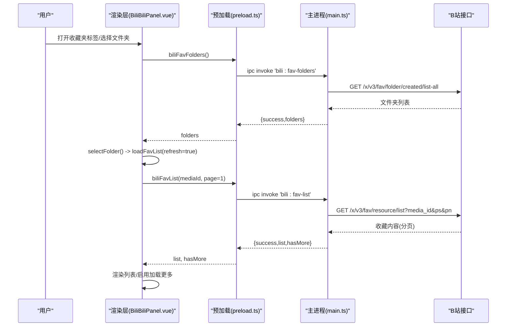
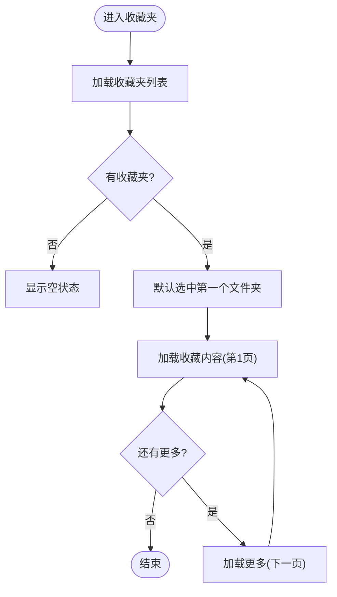
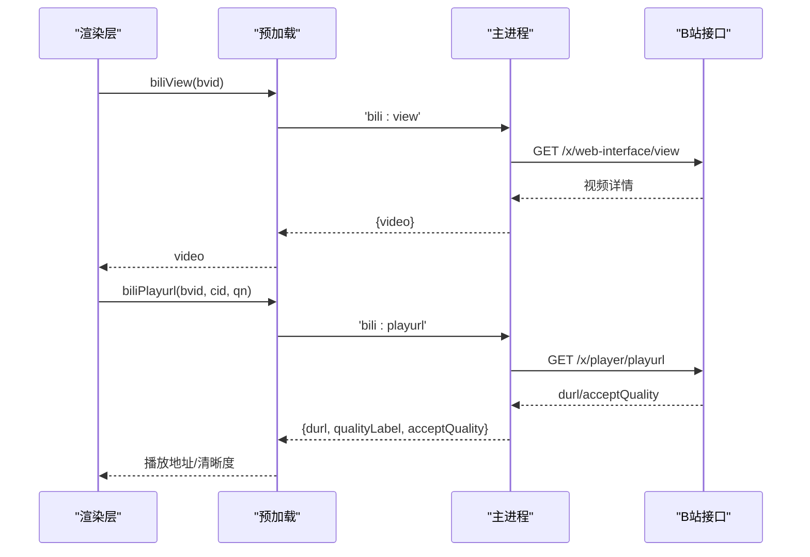
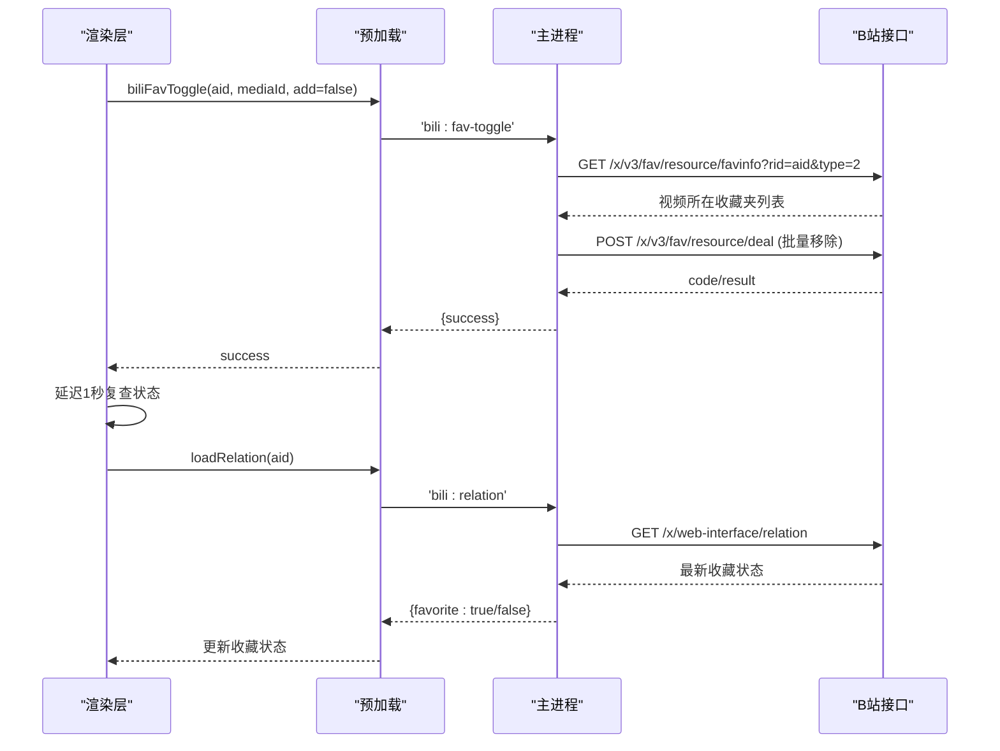

# 收藏夹管理

<cite>
**本文引用的文件**
- [BiliBiliPanel.vue](file://src/renderer/src/components/BiliBiliPanel.vue)
- [main.ts](file://src/main/main.ts)
- [preload.ts](file://src/preload/preload.ts)
- [vite-env.d.ts](file://src/renderer/src/vite-env.d.ts)
- [datasync.ts](file://src/renderer/src/utils/datasync.ts)
</cite>

## 更新摘要
**变更内容**
- 增强了收藏取消功能，支持跨多个收藏夹的批量移除操作
- 实现了渲染器状态协调机制，防止UI与服务端状态不同步
- 优化了收藏操作的可靠性和用户体验

## 目录
1. [简介](#简介)
2. [项目结构](#项目结构)
3. [核心组件](#核心组件)
4. [架构总览](#架构总览)
5. [详细组件分析](#详细组件分析)
6. [依赖关系分析](#依赖关系分析)
7. [性能考虑](#性能考虑)
8. [故障排查指南](#故障排查指南)
9. [结论](#结论)
10. [附录：API与数据结构](#附录api与数据结构)

## 简介
本文件面向哔哩哔哩收藏夹管理功能，覆盖以下目标：
- 收藏夹列表的获取与管理（文件夹信息、收藏数量等）
- 收藏列表查询（分页加载、筛选条件、排序方式等参数说明）
- 收藏内容详细信息获取（视频元数据、观看进度等）
- 收藏夹操作示例（添加收藏、删除收藏、批量管理）
- 数据同步与缓存策略（本地持久化与主进程代理）

该功能由渲染层 UI 组件发起请求，经预加载桥接至主进程，主进程代理 B 站接口完成鉴权、签名、网络请求与结果封装，最终返回渲染层进行展示与交互。

**v3.5.8版本更新**：增强了收藏取消功能，支持跨多个收藏夹的批量移除操作，并实现了渲染器状态协调机制，确保UI与服务端状态的同步性。

## 项目结构
围绕收藏夹能力的关键文件与职责如下：
- 渲染层组件：负责用户交互、状态管理与调用 API
- 预加载桥接：将渲染层方法映射到 IPC 通道
- 主进程：实现 B 站接口代理、鉴权、签名、分页与结果转换
- 类型声明：定义 ElectronAPI 暴露的方法与返回结构
- 数据同步：提供本地数据目录与手动同步能力（自动同步已关闭）

```mermaid
graph TB
UI["渲染层组件<br/>BiliBiliPanel.vue"] --> Bridge["预加载桥接<br/>preload.ts"]
Bridge --> Main["主进程代理<br/>main.ts"]
Main --> Bili["B 站开放接口"]
UI <-- Data["类型定义<br/>vite-env.d.ts"]
UI <-- Sync["数据同步工具<br/>datasync.ts"]
```

图表来源
- [BiliBiliPanel.vue:675-701](file://src/renderer/src/components/BiliBiliPanel.vue#L675-L701)
- [preload.ts:80-88](file://src/preload/preload.ts#L80-L88)
- [main.ts:2917-2945](file://src/main/main.ts#L2917-L2945)
- [vite-env.d.ts:250-255](file://src/renderer/src/vite-env.d.ts#L250-L255)
- [datasync.ts:68-82](file://src/renderer/src/utils/datasync.ts#L68-L82)

章节来源
- [BiliBiliPanel.vue:675-701](file://src/renderer/src/components/BiliBiliPanel.vue#L675-L701)
- [preload.ts:80-88](file://src/preload/preload.ts#L80-L88)
- [main.ts:2917-2945](file://src/main/main.ts#L2917-L2945)
- [vite-env.d.ts:250-255](file://src/renderer/src/vite-env.d.ts#L250-L255)
- [datasync.ts:68-82](file://src/renderer/src/utils/datasync.ts#L68-L82)

## 核心组件
- 收藏夹列表获取与管理
  - 获取收藏夹列表：调用 biliFavFolders，返回文件夹 id、标题、数量、封面等信息
  - 选择文件夹后加载收藏内容：调用 biliFavList(mediaId, page)，支持分页与"加载更多"
- 收藏内容详情与播放
  - 通过 biliView(bvid) 获取视频元数据（标题、描述、时长、分 P、统计数据等）
  - 通过 biliPlayurl(bvid, cid, qn) 获取播放地址与清晰度列表
- 收藏操作
  - 添加/取消收藏：biliFavToggle(aid, mediaId, add)
  - 交互状态查询：biliRelation(aid) 返回点赞、投币、收藏状态
  - **v3.5.8新增**：智能收藏位置查询与批量移除
- 数据同步与缓存
  - 自动备份同步已关闭；支持手动立即同步到数据目录
  - 所有 B 站请求均经主进程代理，避免跨域并集中处理鉴权与签名

章节来源
- [BiliBiliPanel.vue:675-701](file://src/renderer/src/components/BiliBiliPanel.vue#L675-L701)
- [main.ts:2917-2945](file://src/main/main.ts#L2917-L2945)
- [main.ts:2508-2563](file://src/main/main.ts#L2508-L2563)
- [main.ts:2588-2646](file://src/main/main.ts#L2588-L2646)
- [datasync.ts:68-82](file://src/renderer/src/utils/datasync.ts#L68-L82)

## 架构总览
收藏夹能力的端到端流程如下：
- 渲染层触发收藏夹相关操作（切换标签、选择文件夹、点击加载更多、收藏/取消收藏）
- 通过 window.electronAPI 调用预加载桥接方法
- 主进程根据通道名路由到对应处理器，调用 B 站接口并返回统一结构
- 渲染层更新视图状态（列表、分页、错误提示）



图表来源
- [BiliBiliPanel.vue:675-701](file://src/renderer/src/components/BiliBiliPanel.vue#L675-L701)
- [preload.ts:80-81](file://src/preload/preload.ts#L80-L81)
- [main.ts:2457-2504](file://src/main/main.ts#L2457-L2504)

## 详细组件分析

### 收藏夹列表与分页加载
- 获取收藏夹列表
  - 入口：渲染层 loadFavFolders
  - 行为：调用 biliFavFolders，成功后设置 favFolders，若存在默认选中第一个文件夹
  - 数据结构：文件夹包含 id、title、count、cover
- 选择文件夹与加载内容
  - 入口：selectFolder(f)
  - 行为：重置 favList、favPage、favHasMore，并调用 loadFavList(true)
- 分页加载收藏内容
  - 入口：loadFavList(refresh)
  - 行为：refresh=true 时 page=1，否则 page=favPage+1；调用 biliFavList 并合并或替换列表；根据 hasMore 控制"加载更多"按钮
  - 过滤逻辑：主进程过滤失效/删除资源（attr 非 0/1 的项目）



图表来源
- [BiliBiliPanel.vue:675-701](file://src/renderer/src/components/BiliBiliPanel.vue#L675-L701)
- [main.ts:2482-2504](file://src/main/main.ts#L2482-L2504)

章节来源
- [BiliBiliPanel.vue:675-701](file://src/renderer/src/components/BiliBiliPanel.vue#L675-L701)
- [main.ts:2482-2504](file://src/main/main.ts#L2482-L2504)

### 收藏内容详情与播放
- 视频详情
  - 入口：playVideo(v)
  - 行为：调用 biliView(bvid) 获取视频元数据（标题、描述、时长、分 P、统计数据、作者信息等），同时异步加载相关推荐
- 播放流获取
  - 入口：loadStream()
  - 行为：调用 biliPlayurl(bvid, cid, qn) 获取 durl 分段地址、可用清晰度列表与当前清晰度标签；失败时支持备用 CDN 重试
- 分 P 与清晰度切换
  - 切换分 P：switchPage(idx) 更新 currentPageIdx 并重新加载流
  - 切换清晰度：switchQuality(qn) 更新 currentQn 并重新加载流



图表来源
- [BiliBiliPanel.vue:693-753](file://src/renderer/src/components/BiliBiliPanel.vue#L693-L753)
- [main.ts:2508-2563](file://src/main/main.ts#L2508-L2563)

章节来源
- [BiliBiliPanel.vue:693-753](file://src/renderer/src/components/BiliBiliPanel.vue#L693-L753)
- [main.ts:2508-2563](file://src/main/main.ts#L2508-L2563)

### 收藏操作（添加/删除/批量管理）

**v3.5.8版本重大改进**

- 智能收藏位置查询与批量移除
  - 取消收藏时，首先调用 `x/v3/fav/resource/favinfo` 接口查询视频实际所在的所有收藏夹
  - 收集所有匹配的收藏夹ID，使用单个操作批量移除，提高效率和可靠性
  - 如果查询失败，回退到使用传入的收藏夹ID进行移除

- 渲染器状态协调机制
  - 成功操作后延迟1秒复查服务端实际状态，确保UI与服务器状态一致
  - 操作失败时自动回滚可能的按钮状态漂移
  - 通过 loadRelation 函数刷新收藏状态，保证界面显示的准确性

- 添加/取消收藏
  - 入口：toggleFav（在播放器动作区触发）
  - 行为：调用 biliFavToggle(aid, mediaId, add)，add=true 为加入，false 为移除
  - 前置校验：需登录（主进程检查 CSRF）

- 交互状态查询
  - 入口：loadRelation(aid)
  - 行为：返回 like、coin、favorite 状态，用于界面展示（如"已收藏"、"已点赞"）



图表来源
- [main.ts:2917-2945](file://src/main/main.ts#L2917-L2945)
- [BiliBiliPanel.vue:1192-1216](file://src/renderer/src/components/BiliBiliPanel.vue#L1192-L216)
- [preload.ts:88](file://src/preload/preload.ts#L88)
- [vite-env.d.ts:255](file://src/renderer/src/vite-env.d.ts#L255)

章节来源
- [main.ts:2917-2945](file://src/main/main.ts#L2917-L2945)
- [BiliBiliPanel.vue:1192-1216](file://src/renderer/src/components/BiliBiliPanel.vue#L1192-L1216)
- [preload.ts:84-88](file://src/preload/preload.ts#L84-L88)
- [vite-env.d.ts:250-255](file://src/renderer/src/vite-env.d.ts#L250-L255)

### 数据同步与缓存策略
- 自动同步：已关闭（v2.9.2），不再定时写入数据目录快照
- 手动同步：支持立即将全量数据导出并写入数据目录
- 本地存储：学习数据实时存于 IndexedDB（渲染进程本地），收藏夹与播放状态由 B 站账号与 Cookie 维护
- 主进程代理：所有 B 站请求经主进程代理，避免跨域与风控问题，集中处理鉴权、签名与错误

章节来源
- [datasync.ts:1-108](file://src/renderer/src/utils/datasync.ts#L1-L108)

## 依赖关系分析
- 渲染层依赖
  - 通过 window.electronAPI 调用预加载暴露的方法
  - 使用 Element Plus 组件与图标库进行 UI 展示
- 预加载桥接
  - 将渲染层方法映射到 IPC 通道（如 biliFavFolders、biliFavList、biliFavToggle）
- 主进程
  - 实现 biliGet/biliPost 等 HTTP 封装
  - 处理鉴权（Cookie、CSRF）、WBI 签名、分页与结果转换
  - 对收藏列表进行失效/删除资源过滤
  - **v3.5.8新增**：收藏位置智能查询与批量移除逻辑
- 类型系统
  - vite-env.d.ts 定义了 ElectronAPI 的所有方法与返回结构，确保类型安全


图表来源
- [vite-env.d.ts:250-255](file://src/renderer/src/vite-env.d.ts#L250-L255)
- [preload.ts:80-88](file://src/preload/preload.ts#L80-L88)
- [main.ts:2917-2945](file://src/main/main.ts#L2917-L2945)

章节来源
- [vite-env.d.ts:250-255](file://src/renderer/src/vite-env.d.ts#L250-L255)
- [preload.ts:80-88](file://src/preload/preload.ts#L80-L88)
- [main.ts:2917-2945](file://src/main/main.ts#L2917-L2945)

## 性能考虑
- 分页加载：收藏列表采用分页（ps=20），避免一次性加载大量数据导致卡顿
- 懒加载与占位：图片使用 lazy loading，减少首屏压力
- 多分段连播：长视频按分段自动连播，提升播放体验
- 备用 CDN：播放出错时优先尝试备用地址，提高稳定性
- 主进程代理：集中处理网络请求与签名，降低渲染层复杂度与跨域风险
- **v3.5.8优化**：批量移除操作减少网络请求次数，提升取消收藏效率

## 故障排查指南
- 未登录无法获取收藏夹
  - 现象：收藏夹为空或提示未登录
  - 排查：确认已通过扫码或 Cookie 登录，主进程会验证登录态并返回 mid
- 收藏列表为空或加载失败
  - 现象：收藏夹内容无数据或报错
  - 排查：检查网络与接口响应；主进程会过滤失效/删除资源（attr 非 0/1）
- 播放地址获取失败
  - 现象：播放器显示"播放地址获取失败"
  - 排查：可能受版权限制或清晰度不足；尝试切换清晰度或重试
- 收藏操作失败
  - 现象：添加/取消收藏失败
  - 排查：确认登录态与 CSRF；主进程会返回错误消息
- **v3.5.8新增问题**：收藏状态不同步
  - 现象：UI显示状态与实际不符
  - 排查：系统会自动复查状态，如仍不同步可尝试刷新页面

章节来源
- [main.ts:2457-2504](file://src/main/main.ts#L2457-L2504)
- [main.ts:2508-2563](file://src/main/main.ts#L2508-L2563)
- [main.ts:2917-2945](file://src/main/main.ts#L2917-L2945)

## 结论
本项目实现了完整的哔哩哔哩收藏夹管理能力，包括：
- 收藏夹列表获取与文件夹选择
- 收藏内容分页加载与详情查看
- 收藏内容的播放与清晰度/分 P 切换
- 收藏的添加与取消，以及交互状态查询
- **v3.5.8增强**：智能收藏位置查询与批量移除，确保操作可靠性
- **v3.5.8增强**：渲染器状态协调机制，防止UI与服务端状态不同步
- 数据同步与主进程代理的安全与稳定保障

整体架构清晰，前后端职责明确，具备良好的扩展性与可维护性。v3.5.8版本的改进显著提升了收藏功能的稳定性和用户体验。

## 附录：API与数据结构

### 收藏夹相关 API
- 获取收藏夹列表
  - 渲染层：biliFavFolders()
  - 主进程：'bili:fav-folders'
  - 返回：{ success, folders[] }
- 获取收藏内容（分页）
  - 渲染层：biliFavList(mediaId, page?)
  - 主进程：'bili:fav-list'
  - 返回：{ success, list[], hasMore }
- 收藏/取消收藏
  - 渲染层：biliFavToggle(aid, mediaId, add)
  - 主进程：'bili:fav-toggle'
  - 返回：{ success }
  - **v3.5.8增强**：取消收藏时自动查询实际位置并批量移除

章节来源
- [vite-env.d.ts:250-255](file://src/renderer/src/vite-env.d.ts#L250-L255)
- [preload.ts:80-88](file://src/preload/preload.ts#L80-L88)
- [main.ts:2917-2945](file://src/main/main.ts#L2917-L2945)

### 数据结构说明
- 收藏夹项
  - id: number
  - title: string
  - count: number
  - cover: string
- 收藏内容项（BiliVideo）
  - bvid: string
  - title: string
  - pic: string
  - author: string
  - duration: string
  - play: number
  - danmaku: number
  - pubdate: number
- 视频详情（view）
  - bvid, aid, title, pic, desc, duration, pubdate
  - owner: { mid, name, face }
  - stat: { view, danmaku, like, coin, favorite, reply }
  - pages: [{ cid, page, part, duration }]
- 播放地址（playurl）
  - quality: number
  - qualityLabel: string
  - acceptQuality: [{ qn, label }]
  - durl: [{ url, backupUrl[], size, length }]

章节来源
- [vite-env.d.ts:250-255](file://src/renderer/src/vite-env.d.ts#L250-L255)
- [main.ts:2508-2563](file://src/main/main.ts#L2508-L2563)