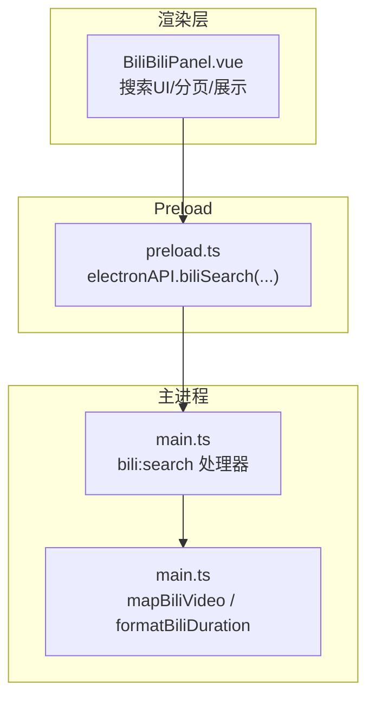
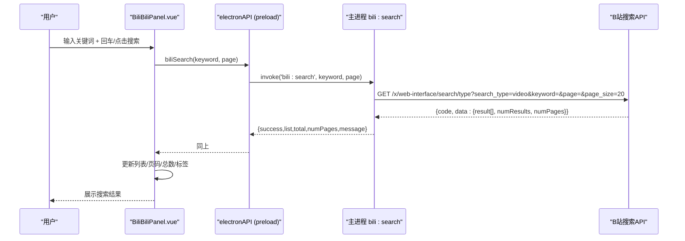
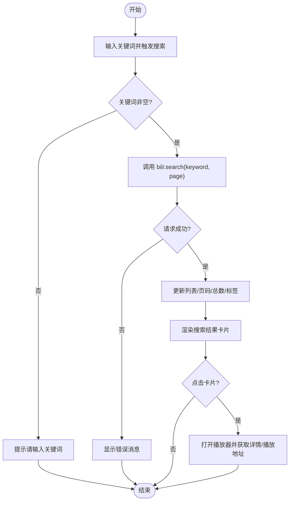
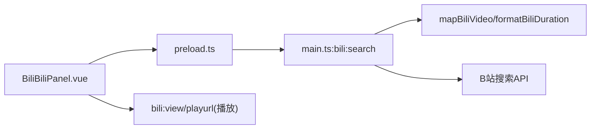

# 视频搜索功能

<cite>
**本文引用的文件**
- [BiliBiliPanel.vue](file://src/renderer/src/components/BiliBiliPanel.vue)
- [preload.ts](file://src/preload/preload.ts)
- [main.ts](file://src/main/main.ts)
- [vite-env.d.ts](file://src/renderer/src/vite-env.d.ts)
- [README.md](file://README.md)
</cite>

## 目录
1. [简介](#简介)
2. [项目结构](#项目结构)
3. [核心组件](#核心组件)
4. [架构总览](#架构总览)
5. [详细组件分析](#详细组件分析)
6. [依赖关系分析](#依赖关系分析)
7. [性能考虑](#性能考虑)
8. [故障排查指南](#故障排查指南)
9. [结论](#结论)
10. [附录](#附录)

## 简介
本章节面向“哔哩哔哩视频搜索”能力，系统化说明：
- 搜索接口的调用方式（关键词、分页、页大小等）
- 搜索结果的数据结构与字段含义
- 搜索结果的展示逻辑与用户交互
- 完整实现示例（搜索历史、热门搜索推荐等扩展思路）
- 性能优化建议与错误处理方案

该能力由渲染层（Vue 组件）发起请求，经 Preload 暴露的 IPC 通道转发至主进程，主进程代理 B 站 API 并返回统一结果。

**章节来源**
- [README.md:49-85](file://README.md#L49-L85)

## 项目结构
围绕视频搜索的关键文件与职责：
- 渲染层组件：负责 UI、用户输入、分页控制、结果展示与播放入口
- Preload 桥接：将 Electron 主进程的 bili:* IPC 方法暴露给渲染层
- 主进程：封装 B 站接口（搜索/热门/详情/播放流），统一数据映射与鉴权辅助

**图表来源**
- [BiliBiliPanel.vue:585-620](file://src/renderer/src/components/BiliBiliPanel.vue#L585-L620)
- [preload.ts:70-82](file://src/preload/preload.ts#L70-L82)
- [main.ts:2440-2455](file://src/main/main.ts#L2440-L2455)
- [main.ts:2249-2276](file://src/main/main.ts#L2249-L2276)

**章节来源**
- [BiliBiliPanel.vue:585-620](file://src/renderer/src/components/BiliBiliPanel.vue#L585-L620)
- [preload.ts:70-82](file://src/preload/preload.ts#L70-L82)
- [main.ts:2440-2455](file://src/main/main.ts#L2440-L2455)

## 核心组件
- 搜索触发与分页：用户在搜索框输入关键词后回车或点击按钮触发搜索；支持上一页/下一页翻页，显示总条数与页数信息
- 结果卡片：展示封面、标题、UP主、时长、播放量等
- 播放入口：点击卡片进入播放器弹窗，获取视频详情与播放地址

关键状态变量（渲染层）：
- 搜索关键词、是否已搜索过、当前页、总条数、总页数、加载态
- 搜索结果列表、最近一次关键词

**章节来源**
- [BiliBiliPanel.vue:194-233](file://src/renderer/src/components/BiliBiliPanel.vue#L194-L233)
- [BiliBiliPanel.vue:585-620](file://src/renderer/src/components/BiliBiliPanel.vue#L585-L620)

## 架构总览
搜索流程时序如下：

**图表来源**
- [BiliBiliPanel.vue:595-620](file://src/renderer/src/components/BiliBiliPanel.vue#L595-L620)
- [preload.ts:78](file://src/preload/preload.ts#L78)
- [main.ts:2440-2455](file://src/main/main.ts#L2440-L2455)

## 详细组件分析

### 搜索接口调用与参数
- 调用入口：渲染层通过 electronAPI.biliSearch(keyword, page?) 发起
- 主进程处理器：bili:search
- 目标接口：https://api.bilibili.com/x/web-interface/search/type
- 查询参数：
  - search_type: video
  - keyword: 用户输入的关键词
  - page: 页码（默认 1）
  - page_size: 20（固定）
- 前置条件：自动确保 buvid Cookie 存在（缺失会补领）
- 返回结构：
  - success: boolean
  - list: 视频卡片数组（标准化字段）
  - total: 总条数
  - numPages: 总页数
  - message: 失败时的错误信息

注意：当前实现未暴露排序选项（如按综合排序、最新发布、最多播放等）。如需扩展，可在主进程增加可选排序参数并在渲染层提供切换控件。

**章节来源**
- [BiliBiliPanel.vue:595-620](file://src/renderer/src/components/BiliBiliPanel.vue#L595-L620)
- [preload.ts:78](file://src/preload/preload.ts#L78)
- [main.ts:2440-2455](file://src/main/main.ts#L2440-L2455)

### 搜索结果数据结构
所有来源（搜索/热门/相关/收藏夹）的视频卡片均通过 mapBiliVideo 统一映射，字段包括：
- bvid: 视频 BV 号
- title: 标题（已去除高亮标签）
- pic: 封面图 URL（兼容 // 前缀）
- author: UP主名称（兼容 owner.name / upper.name / author）
- duration: 时长（搜索结果为字符串 mm:ss；其他来源为秒数，统一格式化）
- play: 播放量（优先 stat.view，其次 v.play）
- danmaku: 弹幕数（优先 stat.danmaku，其次 v.danmaku）
- pubdate: 发布时间（Unix 时间戳）

播放器弹窗中的视频详情（bili:view）包含更丰富的信息：
- bvid, aid, title, pic, desc, duration, pubdate
- owner: { mid, name, face }
- stat: { view, danmaku, like, coin, favorite, reply }
- pages: 分P列表 [{ cid, page, part, duration }]

**章节来源**
- [main.ts:2249-2276](file://src/main/main.ts#L2249-L2276)
- [main.ts:2508-2535](file://src/main/main.ts#L2508-L2535)

### 搜索结果的展示逻辑与交互
- 工具栏：搜索输入框 + 搜索按钮；首次搜索后才可切换到“搜索结果”标签
- 结果区：
  - 加载中：显示加载图标与文案
  - 空结果：提示“没有找到相关视频”
  - 有结果：网格卡片展示，点击卡片进入播放器
  - 分页：上一页/下一页按钮，显示当前页与最大页
- 播放器弹窗：
  - 获取视频详情与播放地址
  - 支持分P切换、清晰度选择、备用CDN自动切换
  - 相关视频推荐（异步加载，不阻塞播放）

**图表来源**
- [BiliBiliPanel.vue:595-620](file://src/renderer/src/components/BiliBiliPanel.vue#L595-L620)
- [BiliBiliPanel.vue:194-233](file://src/renderer/src/components/BiliBiliPanel.vue#L194-L233)
- [BiliBiliPanel.vue:649-693](file://src/renderer/src/components/BiliBiliPanel.vue#L649-L693)

**章节来源**
- [BiliBiliPanel.vue:194-233](file://src/renderer/src/components/BiliBiliPanel.vue#L194-L233)
- [BiliBiliPanel.vue:595-620](file://src/renderer/src/components/BiliBiliPanel.vue#L595-L620)
- [BiliBiliPanel.vue:649-693](file://src/renderer/src/components/BiliBiliPanel.vue#L649-L693)

### 完整实现示例（含搜索历史、热门推荐）
- 搜索历史（建议实现）
  - 在本地存储中维护最近 N 个关键词（例如最近 10 条）
  - 每次成功搜索后追加到历史，去重并限制长度
  - 在搜索框下方提供下拉历史列表，点击即填充并触发搜索
  - 支持清空历史
- 热门搜索推荐（建议实现）
  - 可复用网易云热搜思路，或对接 B 站热点榜单接口
  - 在未进行搜索时展示热词卡片，点击直接执行搜索
  - 搜索进行中隐藏热搜，结束后恢复
- 与现有代码的结合点
  - 搜索触发处 doSearch(page) 成功后写入历史
  - 搜索输入框聚焦时展示历史下拉
  - 热门标签区域参考 Music.vue 的热搜展示模式

[本节为概念性扩展建议，不直接分析具体文件]

## 依赖关系分析
- 渲染层依赖 Preload 暴露的 electronAPI 方法
- 主进程依赖 B 站公开接口，并通过 biliEnsureBuvid 保证 Cookie 环境
- 数据映射函数 mapBiliVideo 统一不同来源的视频卡片结构
- 播放器依赖 bili:view 与 bili:playurl 获取详情与播放地址

**图表来源**
- [BiliBiliPanel.vue:595-620](file://src/renderer/src/components/BiliBiliPanel.vue#L595-L620)
- [preload.ts:70-82](file://src/preload/preload.ts#L70-L82)
- [main.ts:2440-2455](file://src/main/main.ts#L2440-L2455)
- [main.ts:2249-2276](file://src/main/main.ts#L2249-L2276)

**章节来源**
- [preload.ts:70-82](file://src/preload/preload.ts#L70-L82)
- [main.ts:2440-2455](file://src/main/main.ts#L2440-L2455)
- [main.ts:2249-2276](file://src/main/main.ts#L2249-L2276)

## 性能考虑
- 分页与懒加载
  - 使用 page_size=20 的分页策略，避免单次拉取过多数据
  - 图片使用 loading="lazy" 延迟加载封面
- 网络与缓存
  - 主进程统一注入 Referer/UA 以绕过防盗链，减少重复鉴权开销
  - 对 WBI 密钥进行短期缓存（30 分钟），降低签名计算频率（个性化推荐场景）
- 前端渲染
  - 搜索结果网格布局，卡片数量可控
  - 播放器关闭时及时释放资源（暂停、清空 src、清理分段）
- 错误重试
  - 播放出错时优先尝试备用 CDN 地址，提升容错率

[本节提供通用指导，不直接分析具体文件]

## 故障排查指南
常见错误与处理：
- 搜索被风控拦截（code=-412）
  - 现象：提示“请求被风控拦截，请稍后重试或先登录”
  - 处理：等待一段时间重试，或先完成登录（Cookie/扫码）
- 无搜索结果
  - 现象：列表为空，提示“没有找到相关视频”
  - 处理：检查关键词是否正确，或尝试换词
- 播放失败
  - 现象：播放器报错“视频流加载失败，可能是清晰度受限或网络问题”
  - 处理：切换清晰度或重试；若仍失败，检查网络与权限
- 登录状态异常
  - 现象：收藏夹无法加载或搜索受限
  - 处理：重新扫码或粘贴 Cookie，确认 SESSDATA 有效

**章节来源**
- [main.ts:2440-2455](file://src/main/main.ts#L2440-L2455)
- [BiliBiliPanel.vue:621-732](file://src/renderer/src/components/BiliBiliPanel.vue#L621-L732)

## 结论
本项目实现了稳定可靠的哔哩哔哩视频搜索能力：
- 通过统一的 IPC 通道与主进程代理，屏蔽了鉴权与防盗链细节
- 搜索结果采用标准化数据结构，便于统一展示与后续扩展
- 播放器具备分P、清晰度切换与备用CDN能力，用户体验良好
- 建议在现有基础上补充搜索历史与热门搜索推荐，进一步提升易用性

[本节为总结性内容，不直接分析具体文件]

## 附录

### A. 接口定义速查（基于类型声明）
- electronAPI.biliSearch(keyword: string, page?: number): Promise<{ success: boolean; list?: BiliVideo[]; total?: number; numPages?: number; message?: string }>
- 返回值字段：
  - success: 是否成功
  - list: 视频卡片数组（标准化字段）
  - total: 总条数
  - numPages: 总页数
  - message: 失败信息

**章节来源**
- [vite-env.d.ts:205-213](file://src/renderer/src/vite-env.d.ts#L205-L213)

### B. 数据模型（视频卡片）
- bvid: 视频BV号
- title: 标题
- pic: 封面URL
- author: UP主名称
- duration: 时长（mm:ss 或格式化后的字符串）
- play: 播放量
- danmaku: 弹幕数
- pubdate: 发布时间

**章节来源**
- [main.ts:2249-2276](file://src/main/main.ts#L2249-L2276)

### C. 播放器详情模型（用于播放弹窗）
- bvid, aid, title, pic, desc, duration, pubdate
- owner: { mid, name, face }
- stat: { view, danmaku, like, coin, favorite, reply }
- pages: 分P列表 [{ cid, page, part, duration }]

**章节来源**
- [main.ts:2508-2535](file://src/main/main.ts#L2508-L2535)