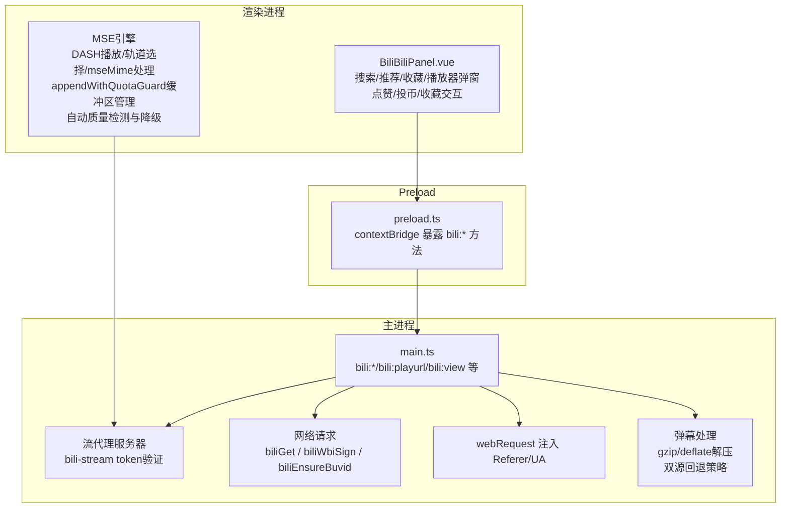
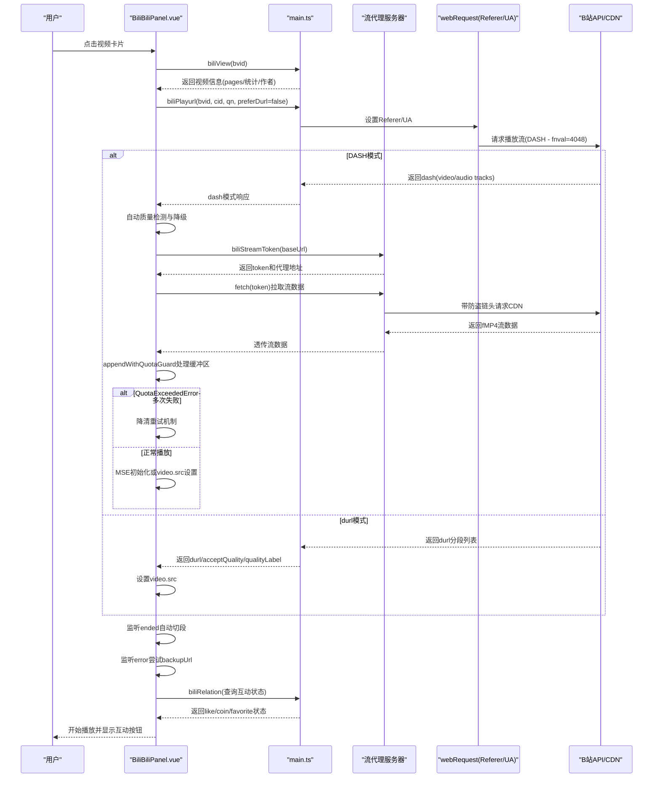
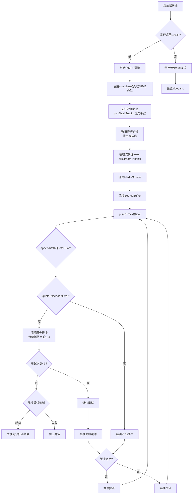
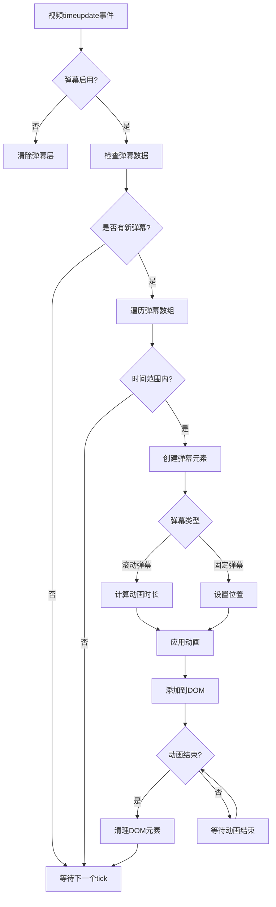
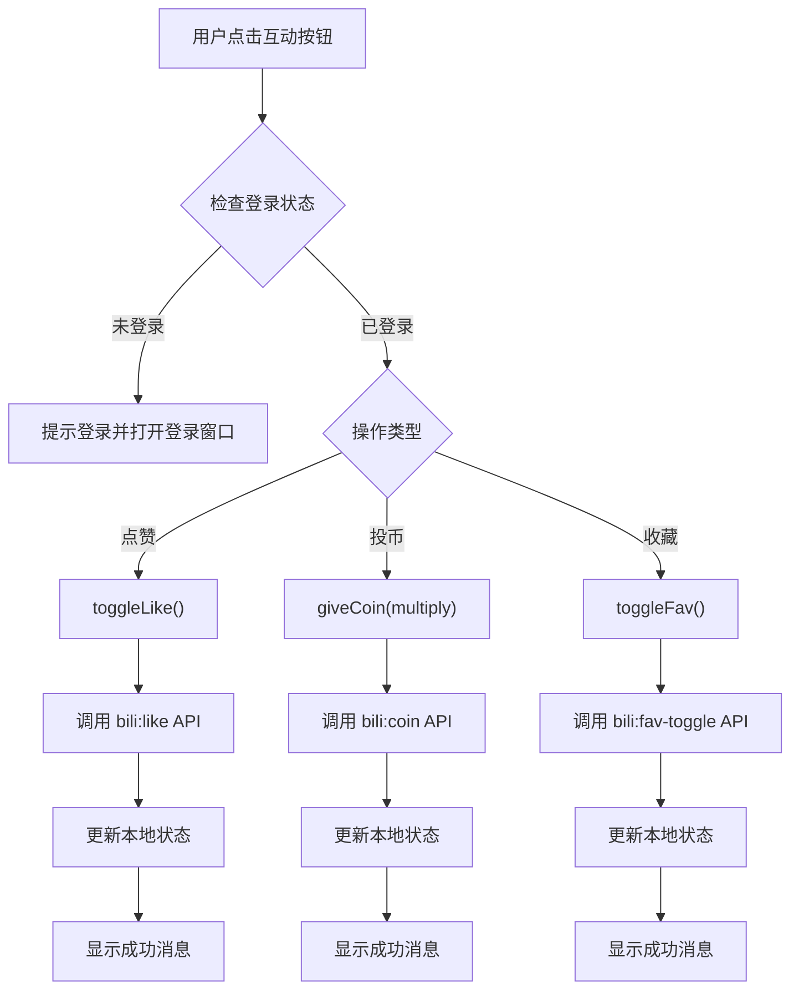
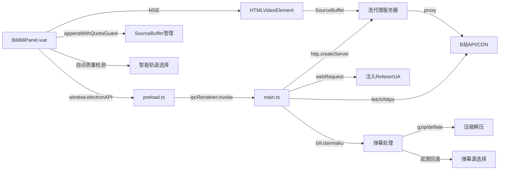

# 视频播放功能

<cite>
**本文引用的文件**
- [BiliBiliPanel.vue](file://src/renderer/src/components/BiliBiliPanel.vue)
- [preload.ts](file://src/preload/preload.ts)
- [main.ts](file://src/main/main.ts)
- [README.md](file://README.md)
</cite>

## 更新摘要
**所做更改**
- v3.6.0版本实现了长视频播放质量的重大改进，移除了DASH回退机制限制，现在使用fnval=4048 exclusively获取高质量流
- 增强了缓冲区管理，水位从60/30秒调整为45/20秒，优化了内存使用
- 新增自动质量检测和降级功能，当当前清晰度高于可播放的最高清晰度时自动降级
- 改进了轨道选择算法，优先带宽而非质量编号，确保实际可用的高清流
- 废弃了durl回退链，改为降清重试机制，避免长视频被限制在720p

## 目录
1. [简介](#简介)
2. [项目结构](#项目结构)
3. [核心组件](#核心组件)
4. [架构总览](#架构总览)
5. [详细组件分析](#详细组件分析)
6. [依赖关系分析](#依赖关系分析)
7. [性能与体验优化建议](#性能与体验优化建议)
8. [故障排查指南](#故障排查指南)
9. [结论](#结论)
10. [附录：完整示例流程](#附录完整示例流程)

## 简介
本章节面向"哔哩哔哩视频播放"能力，说明在应用内如何获取播放链接、解析视频ID、选择清晰度、生成并拼接分片URL，以及如何集成原生播放器（初始化、事件监听、控制接口）。同时覆盖质量切换、倍速播放、弹幕显示等高级能力的现状与建议，并提供完整的错误处理、加载状态管理、播放历史记录等实践方案。

**最新更新** v3.6.0版本实现了长视频播放质量的重大改进，通过移除DASH回退机制限制、增强缓冲区管理和智能轨道选择算法，显著提升了高清晰度视频的播放稳定性和质量。新版本确保了始终使用fnval=4048获取高质量流，并通过自动质量检测和降级功能优化用户体验。

## 项目结构
本项目基于 Electron + Vue 3 的桌面应用，B站模块由渲染进程组件负责交互，通过 preload 暴露 API，主进程统一代理 B站 API、管理 Cookie、注入 Referer/User-Agent 以绕过防盗链，并将 durl 流地址返回给前端使用 HTMLVideoElement 直接播放。



**图表来源**
- [BiliBiliPanel.vue:235-365](file://src/renderer/src/components/BiliBiliPanel.vue#L235-L365)
- [preload.ts:70-88](file://src/preload/preload.ts#L70-L88)
- [main.ts:2315-2410](file://src/main/main.ts#L2315-L2410)
- [main.ts:2508-2563](file://src/main/main.ts#L2508-L2563)

**章节来源**
- [README.md:47-86](file://README.md#L47-L86)

## 核心组件
- **渲染层**：BiliBiliPanel.vue 提供登录、推荐、热门、收藏夹、搜索、播放器弹窗、分P/清晰度切换、相关推荐、点赞/投币/收藏等交互功能。
- **MSE引擎**：基于Media Source Extensions的DASH播放引擎，支持音视频分离的fMP4格式流媒体，包含v3.5.6新增的mseMime()函数和v3.5.7/3.5.8持续增强的appendWithQuotaGuard()函数用于缓冲区管理。
- **Preload 桥接**：将主进程的 bili:* IPC 方法暴露到 window.electronAPI，供渲染层调用。
- **主进程**：封装 B站 API 调用、Cookie/WBI签名/Referer 注入、播放流获取、收藏夹/搜索/推荐/互动等逻辑。

**v3.6.0更新** 最新版本对MSE引擎进行了重大改进，包括优化的缓冲区管理、智能轨道选择算法和自动质量检测降级功能，显著提升了长视频播放的稳定性和画质。

**章节来源**
- [BiliBiliPanel.vue:403-898](file://src/renderer/src/components/BiliBiliPanel.vue#L403-L898)
- [preload.ts:70-88](file://src/preload/preload.ts#L70-L88)
- [main.ts:2315-2410](file://src/main/main.ts#L2315-L2410)

## 架构总览
下图展示了从用户点击视频卡片到开始播放的端到端流程，包括视频详情获取、DASH流获取、MSE播放、分片自动连播与备用CDN切换，以及视频互动操作。



**图表来源**
- [BiliBiliPanel.vue:757-813](file://src/renderer/src/components/BiliBiliPanel.vue#L757-L813)
- [main.ts:2635-2690](file://src/main/main.ts#L2635-2690)
- [main.ts:2315-2410](file://src/main/main.ts#L2315-L2410)
- [BiliBiliPanel.vue:860-928](file://src/renderer/src/components/BiliBiliPanel.vue#L860-928)

## 详细组件分析

### DASH高清视频播放系统
**v3.6.0重大更新** 最新版本实现了完整的DASH高清视频播放系统，并持续优化缓冲区管理和错误处理：

- **MSE引擎**：基于Media Source Extensions技术，支持音视频分离的fMP4格式流媒体播放
- **mseMime()函数**：v3.5.6新增的核心函数，专门处理B站API返回的mime_type字符串格式，解决RFC 6381解析失败问题
- **appendWithQuotaGuard()函数**：v3.5.7/3.5.8持续增强的智能缓冲区管理函数，处理QuotaExceededError并自动清理历史缓冲，v3.5.8将重试次数从2次提升到3次
- **智能轨道选择**：v3.6.0新增的pickDashTrack()函数，优先选择最高带宽的轨道而非质量编号，确保实际可用的高清流
- **流控机制**：v3.6.0调整缓冲水位为45秒超前和20秒恢复，相比之前的60/30秒更加激进，降低高码率长视频的配额压力
- **自动质量检测**：v3.6.0新增的自动检测功能，当当前清晰度高于可播放的最高清晰度时自动降级
- **回环代理**：主进程HTTP服务器代理CDN请求，解决CORS和防盗链问题



**图表来源**
- [BiliBiliPanel.vue:799-813](file://src/renderer/src/components/BiliBiliPanel.vue#L799-L813)
- [BiliBiliPanel.vue:824-928](file://src/renderer/src/components/BiliBiliPanel.vue#L824-928)
- [BiliBiliPanel.vue:965-988](file://src/renderer/src/components/BiliBiliPanel.vue#L965-988)
- [main.ts:2635-2690](file://src/main/main.ts#L2635-2690)

**章节来源**
- [BiliBiliPanel.vue:815-928](file://src/renderer/src/components/BiliBiliPanel.vue#L815-L928)
- [BiliBiliPanel.vue:965-988](file://src/renderer/src/components/BiliBiliPanel.vue#L965-988)
- [main.ts:2315-2410](file://src/main/main.ts#L2315-L2410)

### 智能轨道选择算法
**v3.6.0新增功能** pickDashTrack()函数实现了智能的轨道选择算法：

- **优先匹配指定清晰度**：首先查找与目标qn完全匹配的轨道
- **带宽优先原则**：当没有精确匹配时，选择带宽最高的轨道而非质量编号最高的轨道
- **避免低质量干扰**：过滤掉bandwidth为0的无效轨道，确保选择实际可用的清晰流
- **智能降级**：如果仍然没有合适的轨道，则选择最低档作为兜底

```javascript
function pickDashTrack(tracks: BiliDashTrack[], qn: number): BiliDashTrack | null {
  if (!tracks.length) return null
  // v3.6.0：优先匹配指定 qn
  const exact = tracks.filter(t => t.qn === qn && t.bandwidth > 0)
  if (exact.length) return exact.sort((a, b) => b.bandwidth - a.bandwidth)[0]
  // v3.6.0：无指定 qn 时选最高 bandwidth（非最高 qn），保证实际可用的高清流
  const pool = tracks.filter(t => t.bandwidth > 0)
  return pool.length ? [...pool].sort((a, b) => b.bandwidth - a.bandwidth)[0] : tracks[0]
}
```

**章节来源**
- [BiliBiliPanel.vue:877-886](file://src/renderer/src/components/BiliBiliPanel.vue#L877-L886)

### appendWithQuotaGuard()函数详解
**v3.5.8增强功能** appendWithQuotaGuard()函数经过重大升级，实现了多级自愈机制：

- **问题背景**：1080P/4K等高码率长视频播放时，已播放缓冲会累积超出MSE配额限制，触发QuotaExceededError导致播放中断
- **解决方案**：智能检测QuotaExceededError，自动移除播放点之前的历史缓冲，保留最近10秒便于回拖，然后重试追加
- **实现逻辑**：v3.5.8将重试次数从2次提升到3次，第一次和第二次失败时清理历史缓冲，第三次失败则抛出异常
- **多缓冲区清理**：同时清理所有已注册的SourceBuffer（音视频一起释放），确保配额一致性

```javascript
async function appendWithQuotaGuard(sb: SourceBuffer, chunk: BufferSource, ctrl: AbortController): Promise<void> {
  for (let attempt = 0; attempt < 3; attempt++) {
    if (sb.updating) await waitEvent(sb, 'updateend', ctrl)
    if (ctrl.signal.aborted) return
    try {
      sb.appendBuffer(chunk)
      await waitEvent(sb, 'updateend', ctrl)
      return
    } catch (err) {
      const isQuota = err instanceof DOMException && err.name === 'QuotaExceededError'
      if (!isQuota || attempt === 2) throw err
      // 保留播放点前 10s 便于回拖，其余历史缓冲逐段移除（含碎片区间）
      const el = videoEl.value
      const keepBefore = el ? Math.max(0, el.currentTime - 10) : 0
      for (const b of dashBuffers.length ? dashBuffers : [sb]) {
        try {
          if (b.updating) continue
          for (let i = b.buffered.length - 1; i >= 0; i--) {
            const start = b.buffered.start(i)
            const end = Math.min(b.buffered.end(i), keepBefore)
            if (end > start + 1) b.remove(start, end)
          }
        } catch { /* 单个缓冲区清理失败不阻断其它清理 */ }
      }
      if (sb.updating) await waitEvent(sb, 'updateend', ctrl)
    }
  }
}
```

**章节来源**
- [BiliBiliPanel.vue:1033-1060](file://src/renderer/src/components/BiliBiliPanel.vue#L1033-L1060)

### 自动质量检测与降级机制
**v3.6.0新增功能** 实现了智能的质量检测和自动降级：

- **自动检测**：在加载播放流后，检查当前选择的清晰度是否在可播放范围内
- **智能降级**：如果当前清晰度高于可播放的最高清晰度，自动切换到最高可用清晰度
- **用户体验**：静默降级，不向用户显示错误信息，提升播放成功率
- **防重复**：避免不必要的重复请求，提高播放效率

```javascript
// v3.6.0：若当前清晰度高于可播放的最高清晰度，自动降级到最高
if (acceptQualities.value.length > 0) {
  const maxQn = Math.max(...acceptQualities.value.map(q => q.qn))
  if (currentQn.value > maxQn) {
    console.log(`[自动降清] 当前 ${currentQn.value} → 最高可用 ${maxQn}`)
    switchQuality(maxQn)
    return
  }
}
```

**章节来源**
- [BiliBiliPanel.vue:839-847](file://src/renderer/src/components/BiliBiliPanel.vue#L839-L847)

### 缓冲区管理优化
**v3.6.0优化** 调整了缓冲区管理策略：

- **水位调整**：缓冲水位从60/30秒调整为45/20秒，更加激进的流控策略
- **预清理机制**：起播前自动清理历史缓冲，移除过去10秒以内的碎片区间
- **内存优化**：减少内存占用，避免长视频播放时的内存泄漏问题
- **性能提升**：更频繁的缓冲清理，保持更好的播放流畅度

```javascript
// v3.5.9：收紧缓冲水位（60/30 → 45/20），增加预清理历史缓冲机制
const DASH_BUFFER_AHEAD = 45   // 缓冲超前秒数上限：达到即暂停拉流
const DASH_BUFFER_RESUME = 20  // 消耗至该秒数后恢复拉流
```

**章节来源**
- [BiliBiliPanel.vue:872-874](file://src/renderer/src/components/BiliBiliPanel.vue#L872-L874)
- [BiliBiliPanel.vue:926-940](file://src/renderer/src/components/BiliBiliPanel.vue#L926-L940)

### 视频播放链接获取与分片逻辑
- **视频详情**：通过 bili:view 获取 bvid/aid/pages/stat/owner 等信息，pages 包含每个分片的 cid、page、part、duration。
- **播放流**：通过 bili:playurl 传入 bvid/cid/qn，**v3.6.0更新** 现在始终使用fnval=4048获取高质量DASH流，不再支持durl回退。
- **DASH模式**：返回音视频分离的fMP4流，通过MSE技术在渲染层进行播放，支持高质量码率和60帧率。
- **分片连播**：前端维护 segments 与 segIdx，onended 时切换到下一段；若出错且未尝试过备用地址，则切换到 backupUrl[0] 并重试。
- **防盗链**：主进程对 *.hdslb.com/*.bilivideo.com/*.akamaized.net 等域名注入 Referer/UA，避免跨域或鉴权失败。

**v3.6.0更新** 移除了durl回退机制，现在始终使用高质量的DASH流，通过智能轨道选择和自动质量检测确保最佳播放体验。

**章节来源**
- [BiliBiliPanel.vue:757-813](file://src/renderer/src/components/BiliBiliPanel.vue#L757-L813)
- [BiliBiliPanel.vue:947-948](file://src/renderer/src/components/BiliBiliPanel.vue#L947-L948)
- [main.ts:2635-2690](file://src/main/main.ts#L2635-2690)

### 视频ID解析与清晰度选择
- **视频ID**：直接使用卡片数据中的 bvid，作为 bili:view 和 bili:playurl 的关键标识。
- **清晰度**：acceptQuality 来自播放流接口，前端渲染为下拉框；切换时更新 currentQn 并重新 loadStream。
- **DASH轨道选择**：**v3.6.0更新** 智能选择算法现在优先选择带宽最高的轨道，而非质量编号最高的轨道，确保实际可用的高清流。
- **默认清晰度**：未登录通常上限较低，登录后可解锁更高清晰度。

**v3.6.0更新** 新增了自动质量检测和智能轨道选择，确保在各种网络条件下都能获得最佳的播放质量。

**章节来源**
- [BiliBiliPanel.vue:280-300](file://src/renderer/src/components/BiliBiliPanel.vue#L280-L300)
- [BiliBiliPanel.vue:824-832](file://src/renderer/src/components/BiliBiliPanel.vue#L824-832)
- [BiliBiliPanel.vue:751-755](file://src/renderer/src/components/BiliBiliPanel.vue#L751-L755)
- [main.ts:2635-2690](file://src/main/main.ts#L2635-2690)

### 播放器集成：初始化、事件与控制
- **初始化**：使用原生 <video> 元素，绑定 autoplay、preload="metadata"、playsinline，并在弹窗打开时重置状态。
- **MSE初始化**：DASH模式下创建MediaSource对象，添加SourceBuffer，通过流代理服务器拉取fMP4数据。
- **事件监听**：
  - ended：自动切换到下一分片 URL 并继续播放。
  - error：优先尝试备用 CDN；若无备用则提示错误。
  - close：关闭弹窗时暂停播放、清空 src 与内存。
- **控制接口**：
  - 分P切换：switchPage 更新 currentPageIdx 并重新获取流。
  - 清晰度切换：switchQuality 更新 qn 并重新获取流。
  - 重试：retryPlay 重新执行 loadStream。

**v3.6.0更新** 集成了自动质量检测和智能轨道选择功能，在播放过程中动态优化播放质量。

**章节来源**
- [BiliBiliPanel.vue:248-267](file://src/renderer/src/components/BiliBiliPanel.vue#L248-L267)
- [BiliBiliPanel.vue:860-899](file://src/renderer/src/components/BiliBiliPanel.vue#L860-899)
- [BiliBiliPanel.vue:745-778](file://src/renderer/src/components/BiliBiliPanel.vue#L745-778)
- [BiliBiliPanel.vue:780-791](file://src/renderer/src/components/BiliBiliPanel.vue#L780-791)

### 高级功能：质量切换、倍速播放、弹幕显示
- **质量切换**：已实现，通过 acceptQuality 下拉切换清晰度，支持DASH轨道的动态切换。
- **倍速播放**：当前未内置倍速控件；可在 video 元素上扩展 playbackRate 控制（例如键盘快捷键或工具栏按钮），注意部分浏览器限制自动播放策略。
- **弹幕显示**：已实现完整的弹幕系统，支持滚动弹幕、顶部/底部固定弹幕，可开关控制，最多同屏显示80条弹幕保证流畅性。

**v3.6.0更新** 弹幕显示系统得到全面重写和优化，支持压缩处理和双源回退策略，提供更可靠的弹幕加载体验。

**章节来源**
- [BiliBiliPanel.vue:280-300](file://src/renderer/src/components/BiliBiliPanel.vue#L280-L300)
- [BiliBiliPanel.vue:1162-1285](file://src/renderer/src/components/BiliBiliPanel.vue#L1162-L1285)
- [BiliBiliPanel.vue:248-267](file://src/renderer/src/components/BiliBiliPanel.vue#L248-L267)

### 弹幕显示系统详解
**v3.5.8完全重写** 弹幕显示系统经过全面重构，提供更可靠的显示效果和更强的兼容性：

- **智能时间轴同步**：弹幕晚于播放开始时自动跳过已播放部分，避免一次性刷屏
- **压缩处理增强**：主进程支持手动gzip/deflate解压，解决部分节点返回压缩弹幕的问题
- **XML解析优化**：使用宽松的正则表达式支持单引号和双引号属性值
- **双源回退策略**：优先从https://api.bilibili.com/x/v1/dm/list.so?oid=${cid}获取，失败时回退到https://comment.bilibili.com/${cid}.xml
- **样式行内化**：所有样式直接设置为行内样式，解决Vue scoped样式在动态元素上的兼容性问题
- **全局Keyframes**：动态注入CSS动画定义，确保在不同环境下都能正确显示
- **内存优化**：同屏弹幕上限80条，动画结束后自动清理DOM元素
- **进度条拖动支持**：拖动进度条时清空屏幕弹幕并使用二分查找快速定位到新时间点



**图表来源**
- [BiliBiliPanel.vue:1214-1285](file://src/renderer/src/components/BiliBiliPanel.vue#L1214-L1285)

**章节来源**
- [BiliBiliPanel.vue:1255-1366](file://src/renderer/src/components/BiliBiliPanel.vue#L1255-L1366)
- [main.ts:2706-2761](file://src/main/main.ts#L2706-L2761)

### 视频互动功能：点赞、投币、收藏
**新增功能** 最新版本实现了完整的视频互动功能：

- **点赞功能**：用户可以一键点赞或取消点赞视频，实时显示点赞状态和数量变化。
- **投币功能**：支持投1个或2个币，最多可投2个币，防止重复投币。
- **收藏功能**：可将视频添加到用户的默认收藏夹，支持取消收藏。
- **状态同步**：自动查询用户对视频的互动状态，界面实时反映当前状态。
- **登录验证**：所有互动操作都需要登录态，未登录时会引导用户登录。



**图表来源**
- [BiliBiliPanel.vue:1040-1097](file://src/renderer/src/components/BiliBiliPanel.vue#L1040-1097)
- [main.ts:2841-2887](file://src/main/main.ts#L2841-2887)

**章节来源**
- [BiliBiliPanel.vue:1011-1097](file://src/renderer/src/components/BiliBiliPanel.vue#L1011-L1097)
- [main.ts:2804-2887](file://src/main/main.ts#L2804-L2887)

### UP主信息与投稿视频
**新增功能** 最新版本集成了UP主信息展示和投稿视频浏览功能：

- **UP主卡片**：显示UP主头像、昵称、签名、粉丝数和投稿数
- **投稿视频**：支持分页浏览UP主的投稿视频，点击可直接播放
- **异步加载**：UP主信息和投稿视频采用异步加载，不影响视频播放

**章节来源**
- [BiliBiliPanel.vue:1187-1228](file://src/renderer/src/components/BiliBiliPanel.vue#L1187-L1228)
- [main.ts:2752-2802](file://src/main/main.ts#L2752-L2802)

### 登录与权限
- **扫码/Cookie 登录**：通过 bili:qr-key/bili:qr-check 或 bili:set-cookie 完成；登录成功后刷新用户信息。
- **收藏/互动**：点赞、投币、收藏需登录态，未登录会提示并引导登录。

**章节来源**
- [BiliBiliPanel.vue:442-533](file://src/renderer/src/components/BiliBiliPanel.vue#L442-L533)
- [BiliBiliPanel.vue:1011-1097](file://src/renderer/src/components/BiliBiliPanel.vue#L1011-L1097)
- [main.ts:2411-2510](file://src/main/main.ts#L2411-L2510)

### 热门内容自动加载
**v3.5.7新增功能** 热门内容页签现在支持自动加载：

- **首次访问自动刷新**：用户首次进入热门页签时自动加载内容列表
- **缓存机制**：后续手动刷新才触发新的请求，避免不必要的网络开销
- **用户体验优化**：减少用户操作步骤，提升使用流畅度

**章节来源**
- [BiliBiliPanel.vue:631-651](file://src/renderer/src/components/BiliBiliPanel.vue#L631-L651)
- [BiliBiliPanel.vue:746-751](file://src/renderer/src/components/BiliBiliPanel.vue#L746-L751)

## 依赖关系分析
- **渲染层依赖** preload 暴露的 electronAPI，调用 bili:* IPC。
- **主进程依赖**网络请求封装、Cookie 持久化、WBI 签名、Referer/UA 注入。
- **播放器依赖**原生 HTMLVideoElement 和 MediaSource API，无需额外播放器库。
- **流代理依赖**主进程HTTP服务器，提供CORS支持和防盗链头注入。



**图表来源**
- [preload.ts:70-88](file://src/preload/preload.ts#L70-L88)
- [main.ts:2315-2410](file://src/main/main.ts#L2315-L2410)
- [main.ts:2508-2563](file://src/main/main.ts#L2508-L2563)

**章节来源**
- [preload.ts:70-88](file://src/preload/preload.ts#L70-L88)
- [main.ts:2315-2410](file://src/main/main.ts#L2315-L2410)

## 性能与体验优化建议
- **预取与缓存**
  - 对热门/推荐列表做分页与去重缓存，减少重复请求。
  - 对 durl 结果按 bvid+cid+qn 做短期缓存，提升同清晰度切换速度。
  - DASH流token缓存，避免重复签发代理令牌。
- **资源加载**
  - 封面图使用 lazy loading，降低首屏压力。
  - 播放器 preload="metadata" 仅预取元数据，避免浪费带宽。
  - MSE流控：**v3.6.0更新** 缓冲水位调整为45秒超前和20秒恢复，更加激进的流控策略。
  - **v3.6.0增强**：智能轨道选择算法优先带宽而非质量编号，确保实际可用的高清流。
- **错误恢复**
  - 自动 fallback 到 backupUrl，必要时提示用户切换清晰度或网络环境。
  - 对 WBI 密钥过期场景进行清缓存重试（主进程已实现）。
  - **v3.6.0更新**：取消了durl回退机制，改为降清重试，避免长视频被限制在720p。
  - **v3.6.0增强**：自动质量检测和降级功能，提升播放成功率。
- **用户体验**
  - 增加倍速播放控件与快捷键（如空格暂停、左右快进快退）。
  - 可选弹幕层开关，按需加载弹幕数据，避免默认开销。
  - 播放历史与进度记忆：记录最近观看的 bvid/cid/时间戳，下次进入可续播。
  - UP主信息异步加载，不阻塞视频播放。
  - **v3.5.7增强**：热门内容自动加载，减少用户操作步骤。
  - **v3.5.8增强**：弹幕系统完全重写，支持压缩处理和双源回退。
  - **v3.6.0增强**：智能质量检测和轨道选择，提升播放质量和稳定性。
- **互动功能优化**
  - 互动操作添加防抖机制，防止重复提交。
  - 操作失败时提供明确的错误提示和重试选项。
  - 互动状态实时更新，提升用户感知。
- **弹幕显示优化**
  - **v3.5.8完全重写**：支持gzip/deflate压缩处理，放宽XML解析正则，实现双源回退策略
  - 样式行内化确保兼容性，全局Keyframes提升显示可靠性
  - 内存管理：同屏弹幕上限80条，动画结束后自动清理DOM
  - 进度条拖动支持：快速定位到新时间点的弹幕

**v3.6.0重点更新** 实现了长视频播放质量的重大改进，通过移除DASH回退机制限制、增强缓冲区管理、智能轨道选择算法和自动质量检测功能，显著提升了高清晰度视频的播放稳定性和质量。

## 故障排查指南
- **无法获取播放地址**
  - 检查是否被风控拦截（code=-412），可尝试登录或稍后重试。
  - 确认清晰度是否受权限限制，尝试降级清晰度。
  - **v3.6.0更新**：现在始终使用DASH模式，不再支持durl回退，如遇问题请检查网络连接。
- **播放中断或黑屏**
  - 观察 error 事件是否触发备用 CDN 切换。
  - 检查 Referer/UA 注入是否生效（主进程 webRequest）。
  - MSE播放失败时检查浏览器兼容性。
  - **v3.6.0增强**：检查自动质量检测功能是否正常工作，关注智能轨道选择的效果。
- **DASH播放问题**
  - 检查MediaSource.isTypeSupported是否返回true。
  - 确认流代理服务器是否正常启动。
  - 验证token是否有效且未被淘汰。
  - **v3.5.6新增**：检查mseMime()函数是否正确处理MIME类型格式。
  - **v3.6.0增强**：监控智能轨道选择算法的工作状态，检查带宽优先选择是否正确。
- **弹幕显示问题**
  - **v3.5.8完全重写**：检查主进程是否正确处理gzip/deflate压缩弹幕
  - 确认XML解析正则表达式是否正确支持单引号和双引号属性值
  - 检查双源回退策略是否正常工作（list.so → comment.bilibili.com）
  - 验证弹幕样式是否为行内样式，避免scoped样式冲突
  - 检查DOM元素是否正确清理，防止内存泄漏
  - 验证动画事件是否正确触发，确保元素及时移除
- **登录相关**
  - 扫码登录超时：二维码有效期有限，需刷新。
  - Cookie 登录失败：确认包含 SESSDATA 且有效。
- **收藏/互动失败**
  - 未登录态会提示先登录；操作前确保登录成功。
  - 互动操作需要有效的 CSRF token，检查登录状态。
- **播放器问题**
  - 播放器对话框无法正常显示：检查浏览器兼容性。
  - 互动按钮无响应：确认网络连接正常且登录状态有效。
  - 弹幕显示异常：检查弹幕数据格式和时间轴同步。

**v3.6.0更新** 新增了智能质量检测和轨道选择相关的故障排查指南，特别关注自动质量检测功能的工作状态和智能轨道选择算法的正确性。

**章节来源**
- [BiliBiliPanel.vue:767-778](file://src/renderer/src/components/BiliBiliPanel.vue#L767-L778)
- [BiliBiliPanel.vue:924-928](file://src/renderer/src/components/BiliBiliPanel.vue#L924-L928)
- [BiliBiliPanel.vue:965-988](file://src/renderer/src/components/BiliBiliPanel.vue#L965-L988)
- [BiliBiliPanel.vue:1198-1206](file://src/renderer/src/components/BiliBiliPanel.vue#L1198-L1206)
- [main.ts:2440-2455](file://src/main/main.ts#L2440-L2455)
- [main.ts:2315-2410](file://src/main/main.ts#L2315-L2410)
- [main.ts:2706-2761](file://src/main/main.ts#L2706-L2761)

## 结论
该模块通过"渲染层交互 + Preload 桥接 + 主进程代理"的分层设计，实现了 B站视频的浏览、搜索、收藏与播放。**v3.6.0版本更新** 实现了长视频播放质量的重大改进，通过移除DASH回退机制限制、增强缓冲区管理、智能轨道选择算法和自动质量检测功能，显著提升了高清晰度视频的播放稳定性和质量。新版本确保了始终使用fnval=4048获取高质量流，并通过优先带宽的智能轨道选择算法确保实际可用的高清流。核心播放链路稳定，具备分片自动连播、备用CDN切换、智能缓冲区管理等先进特性。后续可按需在播放器中扩展倍速、播放历史等功能，进一步提升学习场景下的使用体验。

## 附录：完整示例流程
以下为一个典型播放流程的步骤清单，便于快速定位问题与验证功能：

- **步骤1**：用户点击视频卡片，触发 playVideo。
- **步骤2**：调用 biliView 获取视频详情与分P列表。
- **步骤3**：根据当前分P索引，调用 biliPlayurl 获取播放流（**v3.6.0更新** 始终使用fnval=4048获取高质量DASH流）。
- **步骤4**：**v3.6.0新增** 自动质量检测，如果当前清晰度高于可播放的最高清晰度，自动降级。
- **步骤5**：如果是DASH模式，使用mseMime()函数处理MIME类型并初始化MSE引擎。
- **步骤6**：**v3.6.0更新** 使用智能轨道选择算法pickDashTrack()，优先选择带宽最高的轨道。
- **步骤7**：获取流代理token并通过代理服务器拉取fMP4数据。
- **步骤8**：使用增强的appendWithQuotaGuard()函数安全地追加缓冲数据，支持三级重试机制。
- **步骤9**：设置video.src为MediaSource URL，开始播放。
- **步骤10**：监听ended自动切换到下一段；监听error尝试备用地址。
- **步骤11**：如果出现不可恢复的错误，触发降清重试机制。
- **步骤12**：查询用户互动状态（点赞/投币/收藏），更新界面显示。
- **步骤13**：用户可进行互动操作，实时更新状态。
- **步骤14**：如需切换清晰度或分P，调用 switchQuality/switchPage 重新获取流。
- **步骤15**：关闭弹窗时清理播放状态，释放MSE资源和内存。
- **步骤16**：**v3.5.8增强** 弹幕系统支持压缩处理和双源回退，确保弹幕加载可靠性。

**v3.6.0更新** 新增了自动质量检测和智能轨道选择功能的集成步骤，以及优化的缓冲区管理策略在播放流程中的重要作用。

**章节来源**
- [BiliBiliPanel.vue:757-813](file://src/renderer/src/components/BiliBiliPanel.vue#L757-L813)
- [BiliBiliPanel.vue:860-928](file://src/renderer/src/components/BiliBiliPanel.vue#L860-L928)
- [BiliBiliPanel.vue:947-948](file://src/renderer/src/components/BiliBiliPanel.vue#L947-L948)
- [BiliBiliPanel.vue:965-988](file://src/renderer/src/components/BiliBiliPanel.vue#L965-L988)
- [BiliBiliPanel.vue:1033-1060](file://src/renderer/src/components/BiliBiliPanel.vue#L1033-L1060)
- [BiliBiliPanel.vue:1040-1097](file://src/renderer/src/components/BiliBiliPanel.vue#L1040-L1097)
- [BiliBiliPanel.vue:1174-1195](file://src/renderer/src/components/BiliBiliPanel.vue#L1174-L1195)
- [BiliBiliPanel.vue:1255-1366](file://src/renderer/src/components/BiliBiliPanel.vue#L1255-L1366)
- [main.ts:2635-2690](file://src/main/main.ts#L2635-L2690)
- [main.ts:2706-2761](file://src/main/main.ts#L2706-L2761)