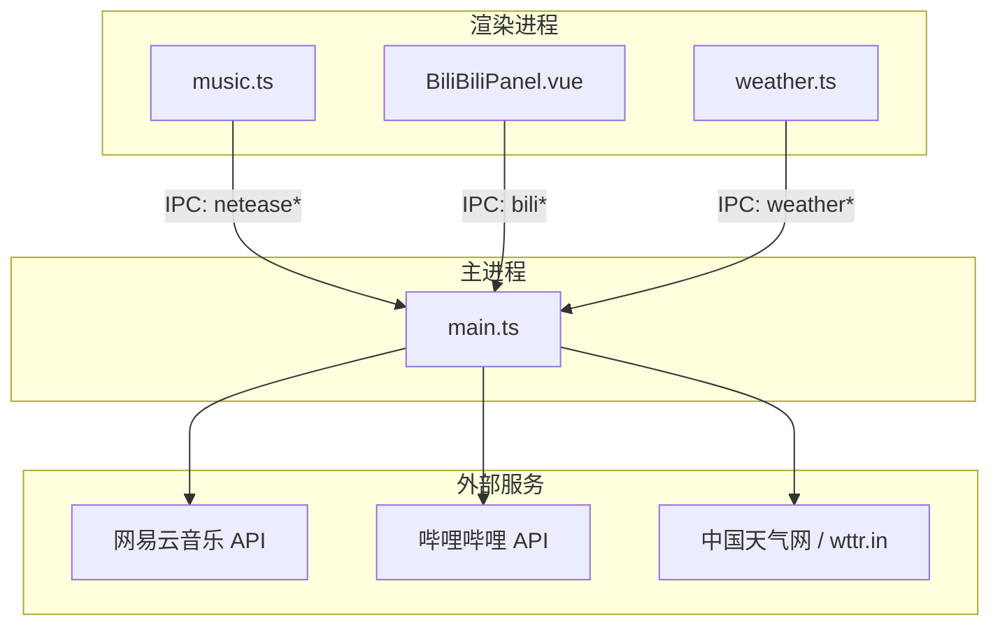
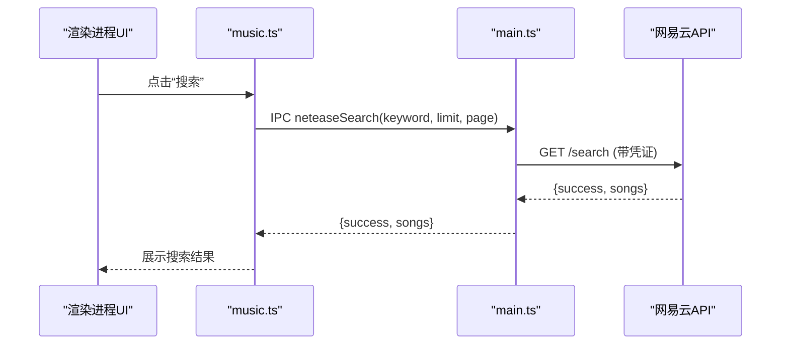
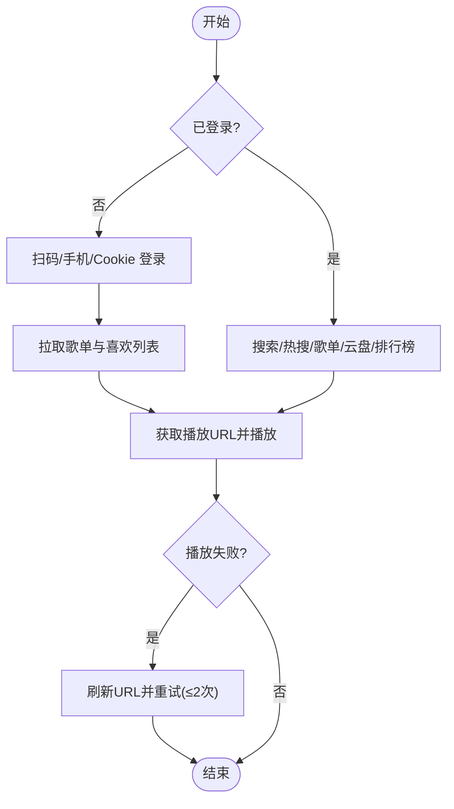
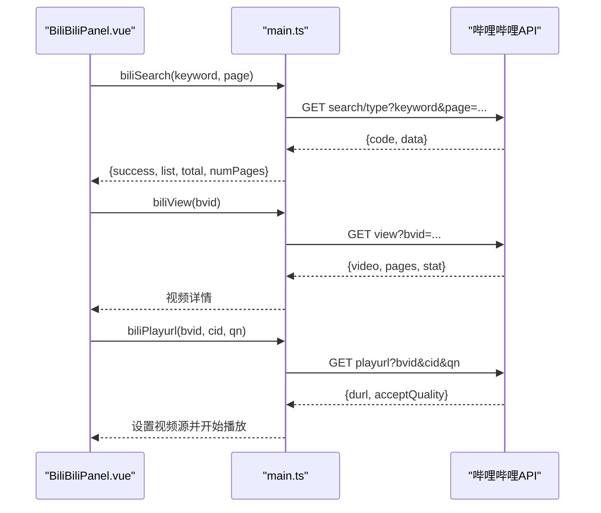
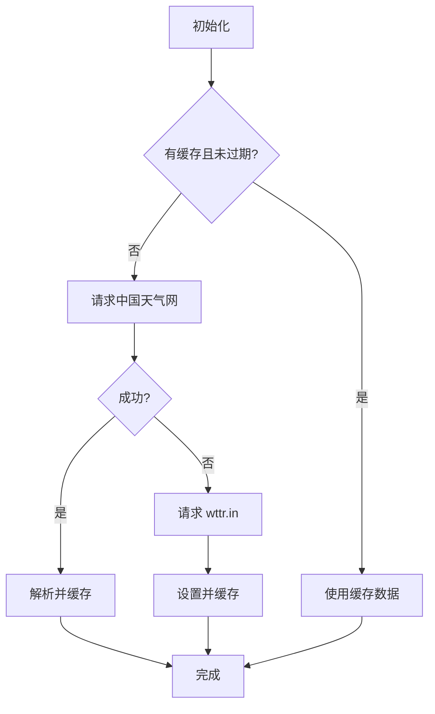
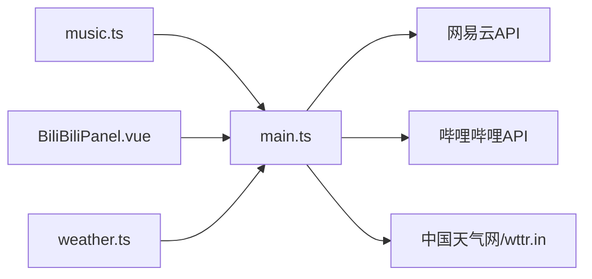

# 外部API集成

<cite>
**本文引用的文件**
- [src/renderer/src/stores/music.ts](file://src/renderer/src/stores/music.ts)
- [src/renderer/src/components/BiliBiliPanel.vue](file://src/renderer/src/components/BiliBiliPanel.vue)
- [src/renderer/src/utils/weather.ts](file://src/renderer/src/utils/weather.ts)
- [src/main/main.ts](file://src/main/main.ts)
- [README.md](file://README.md)
</cite>

## 目录
1. [简介](#简介)
2. [项目结构](#项目结构)
3. [核心组件](#核心组件)
4. [架构总览](#架构总览)
5. [详细组件分析](#详细组件分析)
6. [依赖关系分析](#依赖关系分析)
7. [性能与限流](#性能与限流)
8. [故障排查](#故障排查)
9. [结论](#结论)
10. [附录：API调用清单与数据格式](#附录api调用清单与数据格式)

## 简介
本文件面向“外部API集成”主题，系统化说明本项目中网易云音乐、哔哩哔哩与天气服务的集成方案。内容覆盖认证流程、搜索接口、播放接口、歌单管理、登录态维护、错误重试、限流与缓存策略，以及性能优化建议。所有实现均基于渲染进程通过 Electron IPC 调用主进程代理的第三方 API，确保跨域、防盗链、Cookie/凭证管理与网络请求的统一治理。

## 项目结构
- 渲染进程负责 UI 与业务编排：
  - 网易云音乐：stores/music.ts（状态与逻辑）、views/Music.vue（页面交互）
  - 哔哩哔哩：components/BiliBiliPanel.vue（面板与播放器）
  - 天气服务：utils/weather.ts（数据获取与缓存）
- 主进程负责对外部 API 的封装与安全代理：
  - main.ts：统一处理网易云、B站、天气等 IPC 路由与网络请求

图表来源
- [src/renderer/src/stores/music.ts:433-700](file://src/renderer/src/stores/music.ts#L433-L700)
- [src/renderer/src/components/BiliBiliPanel.vue:338-722](file://src/renderer/src/components/BiliBiliPanel.vue#L338-L722)
- [src/renderer/src/utils/weather.ts:98-157](file://src/renderer/src/utils/weather.ts#L98-L157)
- [src/main/main.ts:2376-2393](file://src/main/main.ts#L2376-L2393)
- [src/main/main.ts:2531-2590](file://src/main/main.ts#L2531-L2590)

章节来源
- [README.md:111-208](file://README.md#L111-L208)

## 核心组件
- 网易云音乐集成（music.ts）
  - 认证：扫码登录、手机号登录、Cookie 登录；登录态检查与退出
  - 搜索：关键词搜索、热搜榜
  - 播放：在线歌曲 URL 获取、音质等级选择、自动刷新过期 URL、歌词加载
  - 歌单：用户歌单列表、歌单详情、批量播放/加入队列
  - 其他：云盘歌曲全量分页、排行榜、用户详情/账号信息、喜欢音乐与评论系统、心动模式
- 哔哩哔哩集成（BiliBiliPanel.vue）
  - 认证：扫码登录、Cookie 登录；登录态检查与退出
  - 搜索：关键词搜索（自动领取防风控标识）
  - 收藏夹：文件夹列表与分页内容
  - 播放：视频详情、分P切换、清晰度选择、多分段连播、备用 CDN 自动切换、相关视频推荐
- 天气服务（weather.ts）
  - 国内源优先（中国天气网），失败回退至 wttr.in
  - 城市预设与搜索、30分钟本地缓存、每小时自动刷新

章节来源
- [src/renderer/src/stores/music.ts:508-700](file://src/renderer/src/stores/music.ts#L508-L700)
- [src/renderer/src/components/BiliBiliPanel.vue:338-722](file://src/renderer/src/components/BiliBiliPanel.vue#L338-L722)
- [src/renderer/src/utils/weather.ts:98-157](file://src/renderer/src/utils/weather.ts#L98-L157)

## 架构总览
- 渲染进程通过 window.electronAPI 调用主进程暴露的 IPC 方法，主进程集中处理：
  - Cookie/凭证管理（网易云、B站）
  - 网络请求与反爬/防盗链（Referer、UA 注入）
  - 数据解析与标准化（如天气数据合并、B站搜索结果清洗）
- 关键 IPC 通道：
  - 网易云：neteaseSearch、neteaseSongUrl、neteaseLyric、neteaseLoginStatus、neteaseSetCookie、neteaseQrKey、neteaseQrCheck、neteaseUserPlaylist、neteasePlaylistDetail、neteaseCloudDrive、neteaseToplist、neteaseToplistDetail、neteaseUserDetail、neteaseUserAccount、neteaseLike、neteaseLikelist、neteaseComments、neteaseCommentLike、neteaseHotSearch、neteaseIntelligenceList
  - 哔哩哔哩：biliLoginStatus、biliLogout、biliQrKey、biliQrCheck、biliSetCookie、biliPopular、biliFavFolders、biliFavList、biliSearch、biliView、biliPlayurl、biliRelated
  - 天气：weatherCurrent、weatherSearch

图表来源
- [src/renderer/src/stores/music.ts:433-454](file://src/renderer/src/stores/music.ts#L433-L454)
- [src/main/main.ts:1566-1599](file://src/main/main.ts#L1566-L1599)

章节来源
- [src/renderer/src/stores/music.ts:433-700](file://src/renderer/src/stores/music.ts#L433-L700)
- [src/main/main.ts:1566-1599](file://src/main/main.ts#L1566-L1599)

## 详细组件分析

### 网易云音乐集成
- 认证流程
  - 扫码登录：获取二维码 key 与图片，轮询检查登录状态，成功后拉取用户信息与歌单
  - 手机号登录：输入手机号与密码，支持国家码
  - Cookie 登录：粘贴浏览器 Cookie，校验后持久化并拉取歌单与喜欢列表
  - 登录态检查：启动或切换时检查是否已登录，必要时静默刷新
- 搜索与热搜
  - 关键词搜索：返回歌曲列表（id、name、artist、album、cover）
  - 热搜榜：可刷新，点击热词直接搜索
- 播放与歌词
  - 在线播放：按音质等级获取播放 URL，失败自动刷新并重试（最多两次）
  - 歌词：在线曲目走网易云歌词接口；本地曲目读取同目录 .lrc
- 歌单与云盘
  - 用户歌单：列表网格展示，进入详情后可播放全部或加入队列
  - 云盘：分页全量加载（首页获取总数，循环拉取剩余），支持批量操作
- 排行榜与用户信息
  - 排行榜：分类榜单与详情（前几首预览）
  - 用户详情/账号：等级、签名、注册时间等
- 喜欢与评论
  - 喜欢：乐观更新 UI，失败回滚；批量缓存已喜欢歌曲 ID
  - 评论：热门评论卡片与弹窗分页，支持最热/最新排序与点赞

图表来源
- [src/renderer/src/stores/music.ts:102-138](file://src/renderer/src/stores/music.ts#L102-L138)
- [src/renderer/src/stores/music.ts:456-506](file://src/renderer/src/stores/music.ts#L456-L506)
- [src/renderer/src/stores/music.ts:546-673](file://src/renderer/src/stores/music.ts#L546-L673)

章节来源
- [src/renderer/src/stores/music.ts:508-700](file://src/renderer/src/stores/music.ts#L508-L700)
- [src/renderer/src/stores/music.ts:801-1429](file://src/renderer/src/stores/music.ts#L801-L1429)

### 哔哩哔哩集成
- 认证流程
  - 扫码登录：获取二维码与 key，每2秒轮询，成功关闭弹窗并刷新用户信息
  - Cookie 登录：粘贴包含 SESSDATA 的 Cookie，验证后持久化
  - 登录态检查：面板挂载时刷新用户信息
- 搜索与收藏
  - 搜索：关键词搜索，自动领取 buvid 防风控，结果去高亮 HTML
  - 收藏夹：文件夹列表与分页内容，过滤失效资源
- 播放与体验
  - 视频详情：分P、统计数据、作者信息
  - 播放地址：按清晰度获取 durl，支持多分段自动连播
  - 容错：播放出错优先切换备用 CDN；关闭弹窗释放资源
  - 相关推荐：异步加载，不阻塞播放

图表来源
- [src/renderer/src/components/BiliBiliPanel.vue:546-670](file://src/renderer/src/components/BiliBiliPanel.vue#L546-L670)
- [src/main/main.ts:2376-2393](file://src/main/main.ts#L2376-L2393)

章节来源
- [src/renderer/src/components/BiliBiliPanel.vue:338-722](file://src/renderer/src/components/BiliBiliPanel.vue#L338-L722)

### 天气服务集成
- 数据源与回退
  - 首选中国天气网（sk_2d + weather_index 合并），失败回退到 wttr.in
- 缓存与定时
  - 本地缓存30分钟，避免频繁请求
  - 每小时自动刷新一次
- 城市选择
  - 内置常用城市快捷选择
  - 支持按名称搜索城市并切换

图表来源
- [src/renderer/src/utils/weather.ts:71-157](file://src/renderer/src/utils/weather.ts#L71-L157)
- [src/main/main.ts:2531-2590](file://src/main/main.ts#L2531-L2590)

章节来源
- [src/renderer/src/utils/weather.ts:98-157](file://src/renderer/src/utils/weather.ts#L98-L157)
- [src/main/main.ts:2531-2590](file://src/main/main.ts#L2531-L2590)

## 依赖关系分析
- 渲染进程依赖主进程提供的 IPC 能力，解耦了第三方 API 的直接访问，便于统一鉴权、限流与错误处理
- 网易云与B站的登录态由主进程持久化，渲染进程仅持有必要的最小状态
- 天气服务在渲染进程做轻量缓存与定时刷新，主进程负责网络层与数据解析

图表来源
- [src/renderer/src/stores/music.ts:433-700](file://src/renderer/src/stores/music.ts#L433-L700)
- [src/renderer/src/components/BiliBiliPanel.vue:338-722](file://src/renderer/src/components/BiliBiliPanel.vue#L338-L722)
- [src/renderer/src/utils/weather.ts:98-157](file://src/renderer/src/utils/weather.ts#L98-L157)
- [src/main/main.ts:2376-2393](file://src/main/main.ts#L2376-L2393)
- [src/main/main.ts:2531-2590](file://src/main/main.ts#L2531-L2590)

章节来源
- [src/renderer/src/stores/music.ts:433-700](file://src/renderer/src/stores/music.ts#L433-L700)
- [src/renderer/src/components/BiliBiliPanel.vue:338-722](file://src/renderer/src/components/BiliBiliPanel.vue#L338-L722)
- [src/renderer/src/utils/weather.ts:98-157](file://src/renderer/src/utils/weather.ts#L98-L157)
- [src/main/main.ts:2376-2393](file://src/main/main.ts#L2376-L2393)
- [src/main/main.ts:2531-2590](file://src/main/main.ts#L2531-L2590)

## 性能与限流
- 网易云音乐
  - 批量获取播放地址：每次最多20首，分批请求避免单次过大负载
  - 播放失败自动刷新URL：最多重试两次，降低瞬时失败影响
  - 喜欢状态批量缓存：首次拉取 likelist，后续列表项响应式显示，减少重复请求
  - 长列表分批渲染：云盘与播放队列采用可视数量分页，避免DOM过多导致卡顿
- 哔哩哔哩
  - 搜索与收藏分页：page_size=20，按需加载更多
  - 播放地址按清晰度获取：支持多分段自动连播，播放出错优先切换备用CDN
  - 防风控：自动领取 buvid 标识，规避 -412 错误
- 天气服务
  - 本地缓存30分钟，避免频繁请求
  - 每小时自动刷新，保证数据时效性
  - 失败回退：国内源不可用自动切换到 wttr.in

章节来源
- [src/renderer/src/stores/music.ts:707-776](file://src/renderer/src/stores/music.ts#L707-L776)
- [src/renderer/src/stores/music.ts:972-1055](file://src/renderer/src/stores/music.ts#L972-L1055)
- [src/renderer/src/components/BiliBiliPanel.vue:476-544](file://src/renderer/src/components/BiliBiliPanel.vue#L476-L544)
- [src/renderer/src/components/BiliBiliPanel.vue:610-693](file://src/renderer/src/components/BiliBiliPanel.vue#L610-L693)
- [src/renderer/src/utils/weather.ts:71-157](file://src/renderer/src/utils/weather.ts#L71-L157)

## 故障排查
- 网易云音乐
  - 播放失败：检查在线URL是否过期，触发自动刷新并重试；确认音质等级是否可用
  - 登录失败：检查扫码是否过期、手机号密码是否正确、Cookie是否包含必要字段
  - 歌单/云盘为空：确认已登录并拉取成功；云盘需分页全量加载
  - 喜欢/评论：乐观更新失败会回滚；确认服务端返回状态
- 哔哩哔哩
  - 搜索被风控：自动领取 buvid；若仍失败，提示先登录或稍后重试
  - 播放失败：尝试切换清晰度或备用CDN；关闭弹窗释放资源
  - 收藏夹为空：确认已登录且存在有效收藏
- 天气服务
  - 数据为空：检查城市编码是否正确；国内源失败将回退到 wttr.in
  - 缓存不更新：强制刷新或等待下一小时周期

章节来源
- [src/renderer/src/stores/music.ts:102-138](file://src/renderer/src/stores/music.ts#L102-L138)
- [src/renderer/src/stores/music.ts:546-673](file://src/renderer/src/stores/music.ts#L546-L673)
- [src/renderer/src/components/BiliBiliPanel.vue:546-693](file://src/renderer/src/components/BiliBiliPanel.vue#L546-L693)
- [src/renderer/src/utils/weather.ts:98-157](file://src/renderer/src/utils/weather.ts#L98-L157)

## 结论
本项目通过主进程统一代理外部API，实现了网易云音乐、哔哩哔哩与天气服务的稳定集成。网易云侧提供完整的认证、搜索、播放、歌单与云盘能力；B站侧提供登录、搜索、收藏与高质量播放体验；天气服务具备可靠的数据源与缓存机制。整体设计兼顾用户体验与性能，具备完善的错误处理与重试策略。

## 附录：API调用清单与数据格式
- 网易云音乐（IPC 方法）
  - 认证：neteaseLoginStatus、neteaseSetCookie、neteaseQrKey、neteaseQrCheck、neteaseLogout、neteaseLoginPhone
  - 搜索与热搜：neteaseSearch、neteaseHotSearch
  - 播放与歌词：neteaseSongUrl、neteaseLyric
  - 歌单与云盘：neteaseUserPlaylist、neteasePlaylistDetail、neteaseCloudDrive
  - 排行榜：neteaseToplist、neteaseToplistDetail
  - 用户信息：neteaseUserDetail、neteaseUserAccount
  - 喜欢与评论：neteaseLike、neteaseLikelist、neteaseComments、neteaseCommentLike
  - 心动模式：neteaseIntelligenceList
- 哔哩哔哩（IPC 方法）
  - 认证：biliLoginStatus、biliLogout、biliQrKey、biliQrCheck、biliSetCookie
  - 搜索与收藏：biliSearch、biliFavFolders、biliFavList
  - 播放：biliView、biliPlayurl、biliRelated
  - 热门推荐：biliPopular
- 天气服务（IPC 方法）
  - 实时天气：weatherCurrent
  - 城市搜索：weatherSearch

章节来源
- [src/renderer/src/stores/music.ts:433-700](file://src/renderer/src/stores/music.ts#L433-L700)
- [src/renderer/src/stores/music.ts:801-1429](file://src/renderer/src/stores/music.ts#L801-L1429)
- [src/renderer/src/components/BiliBiliPanel.vue:338-722](file://src/renderer/src/components/BiliBiliPanel.vue#L338-L722)
- [src/renderer/src/utils/weather.ts:98-157](file://src/renderer/src/utils/weather.ts#L98-L157)
- [src/main/main.ts:2376-2393](file://src/main/main.ts#L2376-L2393)
- [src/main/main.ts:2531-2590](file://src/main/main.ts#L2531-L2590)