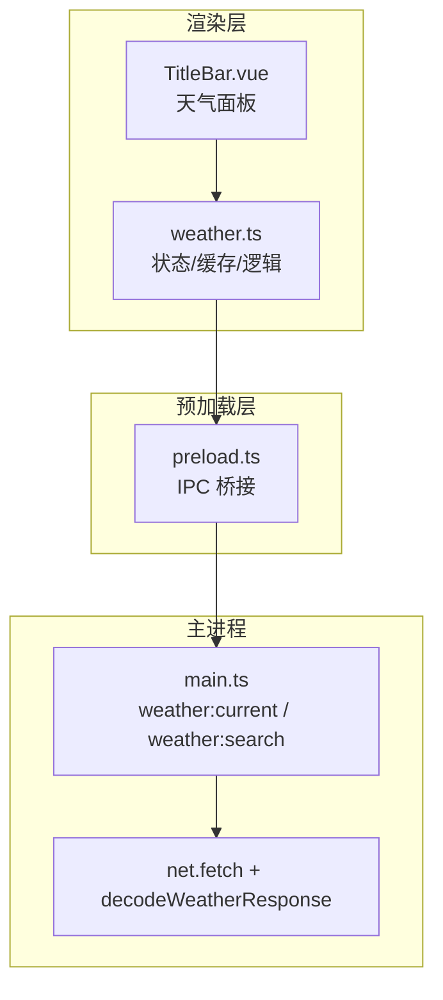
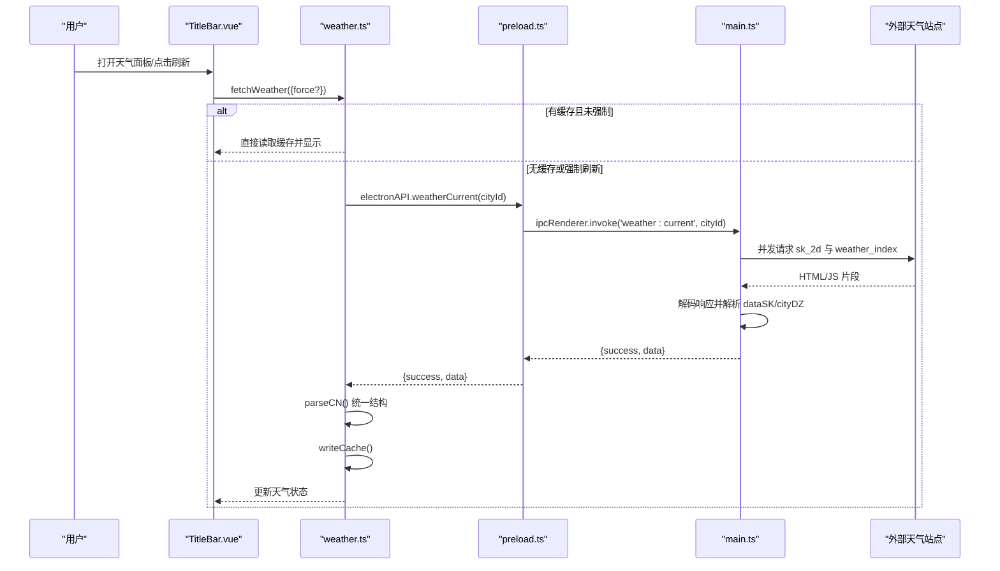
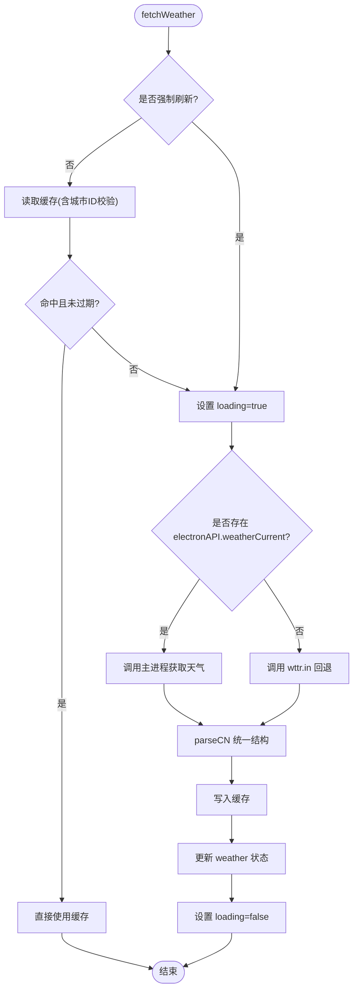
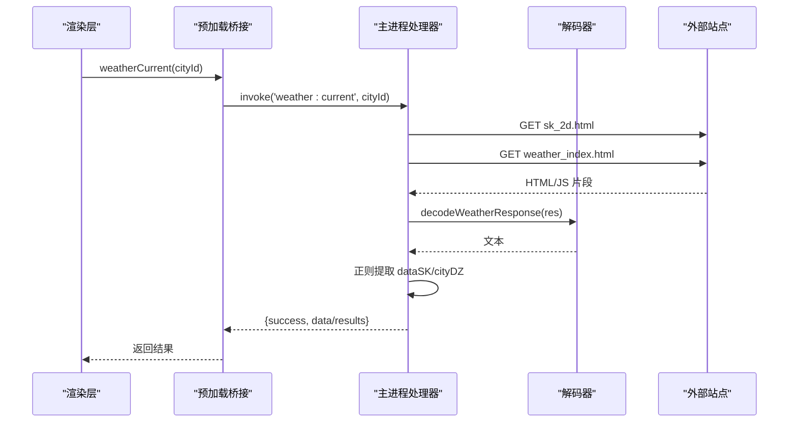
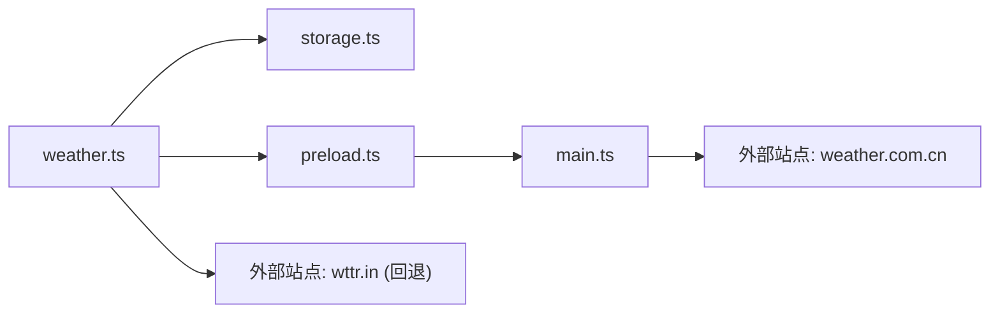

# 天气服务API集成

<cite>
**本文引用的文件**
- [weather.ts](file://src/renderer/src/utils/weather.ts)
- [preload.ts](file://src/preload/preload.ts)
- [main.ts](file://src/main/main.ts)
- [TitleBar.vue](file://src/renderer/src/components/TitleBar.vue)
- [storage.ts](file://src/renderer/src/utils/storage.ts)
</cite>

## 目录
1. [简介](#简介)
2. [项目结构](#项目结构)
3. [核心组件](#核心组件)
4. [架构总览](#架构总览)
5. [详细组件分析](#详细组件分析)
6. [依赖关系分析](#依赖关系分析)
7. [性能与缓存策略](#性能与缓存策略)
8. [错误处理与重试机制](#错误处理与重试机制)
9. [接口调用示例与数据结构](#接口调用示例与数据结构)
10. [故障排查指南](#故障排查指南)
11. [结论](#结论)

## 简介
本文件面向“考研助手”应用中的国内天气服务集成，覆盖以下目标：
- 当前天气查询：通过主进程代理访问中国天气网数据源，并兼容浏览器环境回退。
- 城市搜索：按名称检索国内城市，返回城市ID、名称与省份。
- 数据获取、解析与展示：统一数据结构、天气编码转图标、温度范围合并。
- 城市ID映射与地理位置：内置常用城市快捷选择；支持用户自定义搜索。
- 缓存与更新策略：本地缓存（TTL）、每小时自动刷新、手动强制刷新。
- 限流与容错：并发请求、失败降级、静默错误与保留旧数据展示。
- 提供具体接口调用示例与数据结构说明。

## 项目结构
天气功能由渲染层、预加载桥接、主进程网络与解析三部分协作完成：
- 渲染层（Vue）：暴露状态、UI交互、缓存读写、定时刷新。
- 预加载层：将主进程的 IPC 能力暴露给渲染层。
- 主进程：发起网络请求、解码响应、解析页面脚本变量、合并预报数据、城市搜索。

**图表来源**
- [TitleBar.vue:170-229](file://src/renderer/src/components/TitleBar.vue#L170-L229)
- [weather.ts:1-195](file://src/renderer/src/utils/weather.ts#L1-L195)
- [preload.ts:83-85](file://src/preload/preload.ts#L83-L85)
- [main.ts:2511-2591](file://src/main/main.ts#L2511-L2591)

**章节来源**
- [TitleBar.vue:170-229](file://src/renderer/src/components/TitleBar.vue#L170-L229)
- [weather.ts:1-195](file://src/renderer/src/utils/weather.ts#L1-L195)
- [preload.ts:83-85](file://src/preload/preload.ts#L83-L85)
- [main.ts:2511-2591](file://src/main/main.ts#L2511-L2591)

## 核心组件
- 渲染层天气模块（weather.ts）
  - 暴露全局响应式状态：当前天气、加载态、当前城市。
  - 内置常用城市预设（中国天气网城市编码）。
  - 实现缓存读写、数据解析、城市切换、城市搜索、初始化与定时刷新。
- 预加载桥接（preload.ts）
  - 暴露 weatherCurrent(cityId)、weatherSearch(name) 到 window.electronAPI。
- 主进程处理器（main.ts）
  - 实时天气：并发拉取实况与今日预报，合并后返回。
  - 城市搜索：调用检索接口，解析结果并限制数量。
  - 响应解码：根据 Content-Type 或内容内声明智能选择 UTF-8/GBK。
- 存储工具（storage.ts）
  - 提供 getGlobalStorage/setGlobalStorage，用于持久化缓存与城市选择。
- 界面组件（TitleBar.vue）
  - 展示天气信息、城市选择、搜索输入、搜索结果、刷新按钮。

**章节来源**
- [weather.ts:4-26](file://src/renderer/src/utils/weather.ts#L4-L26)
- [preload.ts:83-85](file://src/preload/preload.ts#L83-L85)
- [main.ts:2511-2591](file://src/main/main.ts#L2511-L2591)
- [storage.ts:252-274](file://src/renderer/src/utils/storage.ts#L252-L274)
- [TitleBar.vue:170-229](file://src/renderer/src/components/TitleBar.vue#L170-L229)

## 架构总览
天气数据从外部站点经主进程抓取，渲染层负责状态管理与缓存，界面负责展示与交互。

**图表来源**
- [TitleBar.vue:170-229](file://src/renderer/src/components/TitleBar.vue#L170-L229)
- [weather.ts:98-157](file://src/renderer/src/utils/weather.ts#L98-L157)
- [preload.ts:83-85](file://src/preload/preload.ts#L83-L85)
- [main.ts:2532-2566](file://src/main/main.ts#L2532-L2566)

## 详细组件分析

### 渲染层天气模块（weather.ts）
- 数据模型
  - WeatherInfo：温度、天气描述、图标、湿度、风速、城市、体感温度、观测时间、最高/最低温。
  - WeatherCity：城市ID与名称。
- 状态管理
  - weather、weatherLoading、weatherCity 为响应式引用。
- 缓存机制
  - 使用 localStorage 全局键存储缓存对象，包含时间戳、城市ID与数据。
  - TTL 为30分钟；仅当缓存的城市ID与当前一致时命中。
- 数据解析
  - parseCN：将中国天气网实况字段映射为统一结构；天气编码转 emoji。
- 获取流程
  - fetchWeather：优先读缓存；否则通过 IPC 调用主进程；失败则回退到 wttr.in；最终写入缓存。
- 城市操作
  - setCity：设置城市并强制刷新。
  - searchCities：调用主进程搜索接口，返回最多10条匹配结果。
- 初始化与自动刷新
  - initWeather：恢复上次城市、读取缓存、立即拉取、每小时定时刷新一次（幂等）。

**图表来源**
- [weather.ts:98-157](file://src/renderer/src/utils/weather.ts#L98-L157)
- [weather.ts:71-81](file://src/renderer/src/utils/weather.ts#L71-L81)
- [weather.ts:83-96](file://src/renderer/src/utils/weather.ts#L83-L96)

**章节来源**
- [weather.ts:4-26](file://src/renderer/src/utils/weather.ts#L4-L26)
- [weather.ts:28-51](file://src/renderer/src/utils/weather.ts#L28-L51)
- [weather.ts:71-96](file://src/renderer/src/utils/weather.ts#L71-L96)
- [weather.ts:98-157](file://src/renderer/src/utils/weather.ts#L98-L157)
- [weather.ts:159-194](file://src/renderer/src/utils/weather.ts#L159-L194)

### 预加载桥接（preload.ts）
- 暴露两个关键方法：
  - weatherCurrent(cityId)：调用 'weather:current'。
  - weatherSearch(name)：调用 'weather:search'。
- 作用：在渲染进程中以安全方式访问主进程能力。

**章节来源**
- [preload.ts:83-85](file://src/preload/preload.ts#L83-L85)

### 主进程处理器（main.ts）
- 实时天气（weather:current）
  - 参数校验：城市ID需为数字串，非法则回退默认北京。
  - 并发请求：同时请求实况（sk_2d）与今日预报（weather_index），提高吞吐。
  - 解码与解析：根据 Content-Type 或内容内声明智能解码；正则提取 dataSK/cityDZ 并 JSON 解析。
  - 合并数据：若预报成功，将最高/最低气温并入实况数据；预报失败不影响实况。
  - 返回：{ success, data } 或 { success, message }。
- 城市搜索（weather:search）
  - 参数：城市名（URL 编码）。
  - 请求：toy1.weather.com.cn/search。
  - 解析：提取数组元素，过滤有效项，截取前10条，映射为 {id, name, province}。
  - 返回：{ success, results } 或 { success, results, message }。
- 响应解码（decodeWeatherResponse）
  - 依据 Content-Type 或内容内 charset 声明，选择 UTF-8 或 GBK 解码。

**图表来源**
- [main.ts:2511-2591](file://src/main/main.ts#L2511-L2591)

**章节来源**
- [main.ts:2511-2591](file://src/main/main.ts#L2511-L2591)

### 界面组件（TitleBar.vue）
- 展示：温度、天气描述、图标、湿度、风速、最高/最低温、观测时间。
- 交互：
  - 快捷城市选择：CITY_PRESETS 列表。
  - 自定义搜索：输入框 + 搜索按钮，展示搜索结果。
  - 刷新：触发 fetchWeather，禁用按钮期间显示“刷新中…”。
- 数据来源：从 @/utils/weather 导入状态与方法。

**章节来源**
- [TitleBar.vue:170-229](file://src/renderer/src/components/TitleBar.vue#L170-L229)
- [TitleBar.vue:334-351](file://src/renderer/src/components/TitleBar.vue#L334-L351)

## 依赖关系分析
- 渲染层依赖
  - Vue 响应式（ref）
  - 本地存储（storage.ts 的 getGlobalStorage/setGlobalStorage）
  - Electron 预加载暴露的 API（window.electronAPI）
- 主进程依赖
  - Node net.fetch（HTTP 客户端）
  - 字符集解码（UTF-8/GBK）
  - 正则表达式解析页面脚本变量
- 外部依赖
  - 中国天气网（d1.weather.com.cn、toy1.weather.com.cn）
  - 浏览器回退源（wttr.in）

**图表来源**
- [weather.ts:1-3](file://src/renderer/src/utils/weather.ts#L1-L3)
- [preload.ts:83-85](file://src/preload/preload.ts#L83-L85)
- [main.ts:2532-2591](file://src/main/main.ts#L2532-L2591)

**章节来源**
- [weather.ts:1-3](file://src/renderer/src/utils/weather.ts#L1-L3)
- [preload.ts:83-85](file://src/preload/preload.ts#L83-L85)
- [main.ts:2532-2591](file://src/main/main.ts#L2532-L2591)

## 性能与缓存策略
- 并发请求：主进程对实况与预报接口并行请求，降低整体延迟。
- 本地缓存：
  - 基于 localStorage 的全局键存储，包含时间戳与城市ID。
  - TTL 为30分钟；仅当城市ID一致时命中。
- 自动刷新：
  - 初始化后每小时强制刷新一次，避免频繁重复定时器。
- 降级策略：
  - 主进程不可用时，渲染层回退到 wttr.in，保证基本可用性。
- 内存占用：
  - 缓存体积小（字符串与少量字段），对内存影响可忽略。

[本节为通用性能讨论，不直接分析具体文件]

## 错误处理与重试机制
- 主进程侧
  - 网络失败：返回 { success: false, message }。
  - 解析失败：返回 { success: false, message: '解析失败' }。
  - 预报接口失败：不影响实况数据返回。
- 渲染层侧
  - 捕获异常：网络失败静默处理，不清空已有展示。
  - 失败降级：若无 electronAPI 能力，调用 wttr.in 回退。
  - 加载态：finally 中重置 loading。
- 重试机制
  - 当前未实现指数退避或多次重试；可通过外层封装增加重试逻辑。
- 限流处理
  - 未显式实现令牌桶或滑动窗口限流；并发请求已控制为固定两路。
  - 建议：在高并发场景下在主进程侧加入请求队列与限流。

**章节来源**
- [main.ts:2532-2591](file://src/main/main.ts#L2532-L2591)
- [weather.ts:98-157](file://src/renderer/src/utils/weather.ts#L98-L157)

## 接口调用示例与数据结构

### 城市搜索
- 调用入口
  - 渲染层：searchCities(name)
  - 预加载层：electronAPI.weatherSearch(name)
  - 主进程：ipcMain.handle('weather:search')
- 请求参数
  - name：城市名称（内部进行 URL 编码）
- 返回结构
  - success: boolean
  - results: Array<{ id: string; name: string; province: string }>
- 示例
  - 输入：name = "洛阳"
  - 输出：results 包含最多10条匹配城市，字段为 id、name、province

**章节来源**
- [weather.ts:166-176](file://src/renderer/src/utils/weather.ts#L166-L176)
- [preload.ts:84-85](file://src/preload/preload.ts#L84-L85)
- [main.ts:2569-2591](file://src/main/main.ts#L2569-L2591)

### 当前天气查询
- 调用入口
  - 渲染层：fetchWeather({ force?: boolean })
  - 预加载层：electronAPI.weatherCurrent(cityId)
  - 主进程：ipcMain.handle('weather:current')
- 请求参数
  - cityId：中国天气网城市编码（如 101010100）
- 返回结构
  - success: boolean
  - data: Record<string, string>（实况字段集合）
- 数据解析
  - 渲染层 parseCN 将原始字段映射为 WeatherInfo：
    - tempC、condition、icon、humidity、wind、city、obsTime、tempMax、tempMin
- 示例
  - 输入：cityId = "101010100"
  - 输出：data 包含温度、天气描述、湿度、风速、观测时间、最高/最低温等

**章节来源**
- [weather.ts:98-157](file://src/renderer/src/utils/weather.ts#L98-L157)
- [preload.ts:84-85](file://src/preload/preload.ts#L84-L85)
- [main.ts:2532-2566](file://src/main/main.ts#L2532-L2566)

### 数据结构说明
- WeatherInfo
  - tempC: string（温度）
  - condition: string（天气描述）
  - icon: string（emoji 图标）
  - humidity: string（湿度百分比）
  - wind: string（风速 km/h）
  - city: string（城市名）
  - feelsLikeC?: string（体感温度，可选）
  - obsTime?: string（观测时间，可选）
  - tempMax?: string（今日最高温，可选）
  - tempMin?: string（今日最低温，可选）
- WeatherCity
  - id: string（城市编码）
  - name: string（城市名称）

**章节来源**
- [weather.ts:4-21](file://src/renderer/src/utils/weather.ts#L4-L21)

## 故障排查指南
- 现象：天气不更新或显示为空
  - 检查缓存是否过期或城市ID不一致
  - 确认主进程 IPC 可用（electronAPI 存在）
  - 查看网络请求是否成功（主进程日志或控制台）
- 现象：城市搜索无结果
  - 检查输入是否为空或无效
  - 确认 toy1.weather.com.cn 可访问
  - 查看返回 results 是否为空
- 现象：浏览器环境无法获取天气
  - 确认是否处于 Electron 环境（存在 electronAPI）
  - 若不存在，将回退到 wttr.in；检查该域名可达性
- 现象：编码乱码
  - 主进程会根据 Content-Type 或内容内声明选择 UTF-8/GBK
  - 若仍出现乱码，检查外部站点响应头或内容变更

**章节来源**
- [weather.ts:71-81](file://src/renderer/src/utils/weather.ts#L71-L81)
- [weather.ts:98-157](file://src/renderer/src/utils/weather.ts#L98-L157)
- [main.ts:2511-2591](file://src/main/main.ts#L2511-L2591)

## 结论
该天气服务集成采用“渲染层状态+主进程网络”的分层设计，具备以下特点：
- 高可用：主进程不可用或外部站点异常时，自动回退到 wttr.in。
- 高性能：并发请求实况与预报，减少整体延迟。
- 易维护：统一数据结构与解析逻辑，便于扩展与替换数据源。
- 用户体验：本地缓存与自动刷新，减少频繁网络请求。
- 可扩展：可在主进程侧增加限流、重试、监控等增强能力。

[本节为总结性内容，不直接分析具体文件]