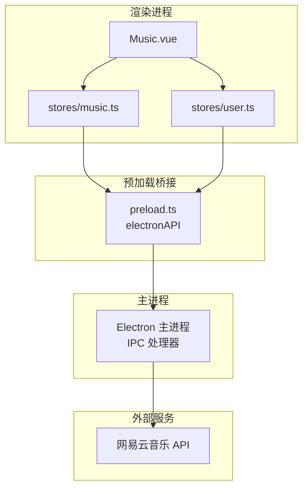
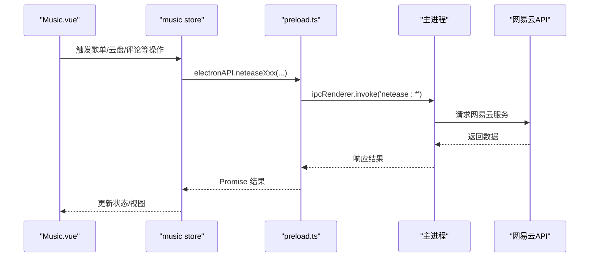
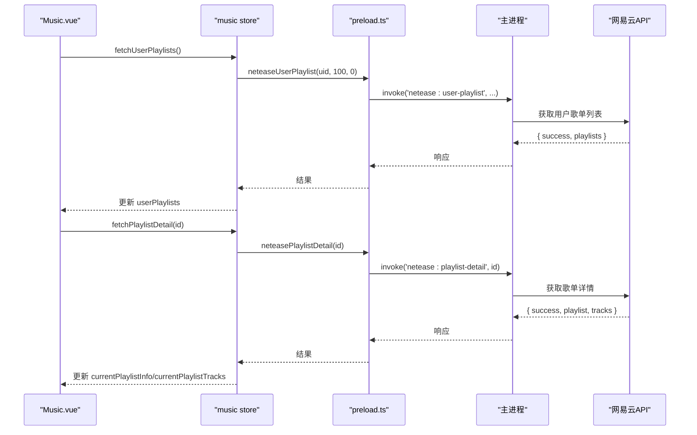
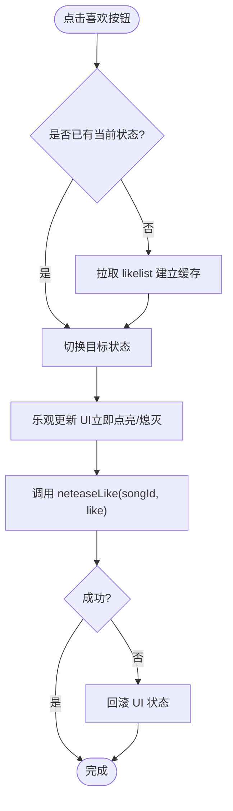
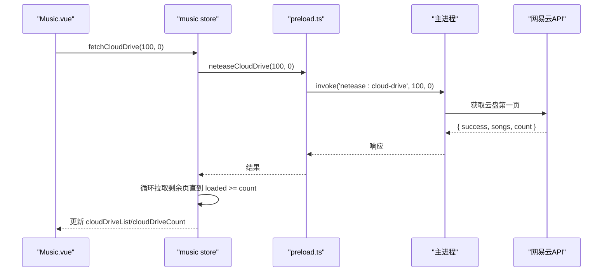
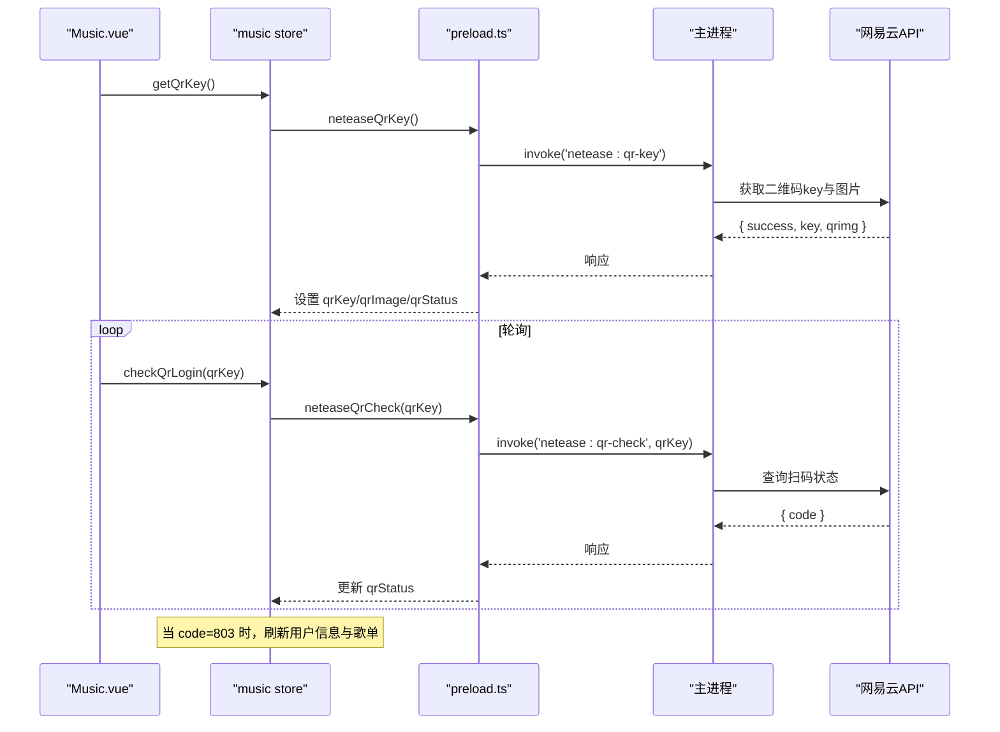
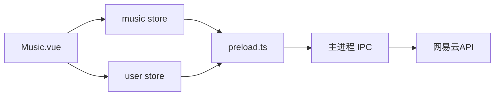

# 歌单与用户管理

<cite>
**本文引用的文件**
- [music.ts](file://src/renderer/src/stores/music.ts)
- [user.ts](file://src/renderer/src/stores/user.ts)
- [Music.vue](file://src/renderer/src/views/Music.vue)
- [preload.ts](file://src/preload/preload.ts)
- [storage.ts](file://src/renderer/src/utils/storage.ts)
- [README.md](file://README.md)
</cite>

## 目录
1. [简介](#简介)
2. [项目结构](#项目结构)
3. [核心组件](#核心组件)
4. [架构总览](#架构总览)
5. [详细组件分析](#详细组件分析)
6. [依赖关系分析](#依赖关系分析)
7. [性能考量](#性能考量)
8. [故障排查指南](#故障排查指南)
9. [结论](#结论)
10. [附录：数据模型与API调用示例](#附录数据模型与api调用示例)

## 简介
本文件聚焦于网易云音乐集成下的“歌单与用户管理”能力，覆盖以下主题：
- 用户歌单获取接口：个人歌单列表、歌单详情查看、分页加载机制
- 歌单操作功能：创建、编辑、删除与收藏管理（基于现有实现说明边界）
- 用户信息管理：用户详情获取、账户信息查看、个人资料修改（基于现有实现说明边界）
- 喜欢音乐列表：歌曲收藏、取消收藏、批量操作
- 云盘歌曲管理：云端音乐展示、播放、下载与同步机制（基于现有实现说明边界）
- 完整的数据模型定义与API调用示例

本项目通过 Electron + Vue 3 + Pinia 构建，渲染进程通过 preload 暴露的 electronAPI 调用主进程代理的网易云 API。

## 项目结构
- 渲染层状态与业务逻辑集中在 stores/music.ts，负责网易云登录、歌单、云盘、排行榜、评论、喜欢等能力
- 视图 Music.vue 提供用户交互入口（搜索、歌单、云盘、排行榜、评论、登录对话框等）
- preload.ts 将 IPC 通道暴露为 electronAPI，供渲染层调用
- user.ts 管理本地应用的用户账号体系（非网易云账号），支持注册/登录/登出/删除账号
- storage.ts 提供本地存储、用户数据迁移、导出导入等工具

图表来源
- [Music.vue:1-800](file://src/renderer/src/views/Music.vue#L1-L800)
- [music.ts:1-1429](file://src/renderer/src/stores/music.ts#L1-L1429)
- [preload.ts:1-104](file://src/preload/preload.ts#L1-L104)

章节来源
- [README.md:111-128](file://README.md#L111-L128)

## 核心组件
- 音乐与网易云状态管理（music store）：封装登录、歌单、云盘、排行榜、评论、喜欢、播放控制等
- 本地用户状态管理（user store）：管理应用内用户账号、登录态、数据迁移
- 视图层（Music.vue）：提供搜索、歌单、云盘、排行榜、评论、登录对话框等UI交互
- IPC 桥接（preload.ts）：统一暴露 electronAPI，屏蔽底层 IPC 细节

章节来源
- [music.ts:1-1429](file://src/renderer/src/stores/music.ts#L1-L1429)
- [user.ts:1-86](file://src/renderer/src/stores/user.ts#L1-L86)
- [Music.vue:1-800](file://src/renderer/src/views/Music.vue#L1-L800)
- [preload.ts:1-104](file://src/preload/preload.ts#L1-L104)

## 架构总览
渲染层通过 music store 调用 electronAPI，由主进程转发到网易云 API。歌单、云盘、排行榜、评论、喜欢等功能均走此路径。本地用户体系独立于网易云账号，用于应用内多用户数据隔离。

图表来源
- [music.ts:675-700](file://src/renderer/src/stores/music.ts#L675-L700)
- [preload.ts:40-69](file://src/preload/preload.ts#L40-L69)

## 详细组件分析

### 用户歌单获取接口
- 个人歌单列表：通过 neteaseUserPlaylist(uid, limit?, offset?) 获取当前用户歌单列表
- 歌单详情查看：通过 neteasePlaylistDetail(id) 获取指定歌单的歌曲列表
- 分页加载机制：
  - 歌单列表默认拉取 limit=100，offset=0；如需更多可调整参数
  - 歌单详情直接返回 tracks；若需分页，可在主进程侧扩展
  - 云盘歌曲采用逐页累加方式，先拿总数 count，再循环拉取剩余页，直至全部加载或达到安全上限

图表来源
- [music.ts:675-700](file://src/renderer/src/stores/music.ts#L675-L700)
- [preload.ts:51-52](file://src/preload/preload.ts#L51-L52)

章节来源
- [music.ts:675-700](file://src/renderer/src/stores/music.ts#L675-L700)
- [preload.ts:51-52](file://src/preload/preload.ts#L51-L52)

### 歌单操作功能（创建、编辑、删除、收藏管理）
- 创建/编辑/删除歌单：在当前代码中未直接暴露对应方法；可通过网易云官方客户端或网页端完成，本应用侧重读取与播放
- 收藏管理：通过 toggleLikeSong/likeSong 对歌曲进行喜欢/取消喜欢；歌单级别的收藏不在前端暴露

章节来源
- [music.ts:1002-1062](file://src/renderer/src/stores/music.ts#L1002-L1062)

### 用户信息管理
- 用户详情获取：fetchUserDetail(uid) 调用 neteaseUserDetail(uid)
- 账户信息查看：fetchUserAccount() 调用 neteaseUserAccount()
- 个人资料修改：当前代码未暴露修改资料的方法；建议通过网易云官方渠道修改

章节来源
- [music.ts:928-953](file://src/renderer/src/stores/music.ts#L928-L953)
- [preload.ts:59-60](file://src/preload/preload.ts#L59-L60)

### 喜欢音乐列表
- 歌曲收藏/取消收藏：toggleLikeSong(songId, currentState?) 使用 neteaseLike(songId, like)
- 批量操作：checkSongsLiked(songIds[]) 一次性刷新已喜欢集合，供搜索结果/歌单列表项显示
- 缓存策略：首次登录后拉取 likelist，建立 likedSongIds Set，后续判断优先读缓存

图表来源
- [music.ts:1002-1062](file://src/renderer/src/stores/music.ts#L1002-L1062)

章节来源
- [music.ts:972-1062](file://src/renderer/src/stores/music.ts#L972-L1062)

### 云盘歌曲管理
- 云端音乐展示：fetchCloudDrive(pageSize?, pageNo?) 逐页拉取并累加 cloudDriveList，同时记录 cloudDriveCount
- 播放与队列：playPlaylist/tracks 与 addPlaylistToQueue 支持批量获取播放地址并加入播放列表
- 下载与同步：当前代码未暴露下载/上传/同步方法；仅支持在线播放与列表展示

图表来源
- [music.ts:819-850](file://src/renderer/src/stores/music.ts#L819-L850)
- [preload.ts:69](file://src/preload/preload.ts#L69)

章节来源
- [music.ts:819-850](file://src/renderer/src/stores/music.ts#L819-L850)
- [preload.ts:69](file://src/preload/preload.ts#L69)

### 登录与认证流程（扫码/手机号/Cookie）
- 扫码登录：getQrKey() 获取 key 与二维码图片；checkQrLogin(key) 轮询状态码（801等待扫码、802待确认、803登录成功、800过期）
- 手机号登录：loginPhone(phone, password, countrycode?)
- Cookie 登录：setNeteaseCookie(cookie) 粘贴浏览器 Cookie 登录
- 退出登录：logoutNetease() 清理状态与缓存

图表来源
- [music.ts:619-652](file://src/renderer/src/stores/music.ts#L619-L652)
- [preload.ts:44-47](file://src/preload/preload.ts#L44-L47)

章节来源
- [music.ts:546-673](file://src/renderer/src/stores/music.ts#L546-L673)
- [preload.ts:44-47](file://src/preload/preload.ts#L44-L47)

### 本地用户管理（应用内账号）
- 注册/登录/登出/删除账号：useUserStore 提供 register/login/logout/deleteAccount
- 数据迁移：migrateGuestData 将游客数据迁移至指定用户
- 存储隔离：按用户名前缀隔离各用户数据

章节来源
- [user.ts:14-84](file://src/renderer/src/stores/user.ts#L14-L84)
- [storage.ts:203-442](file://src/renderer/src/utils/storage.ts#L203-L442)

## 依赖关系分析
- music store 依赖 preload.ts 暴露的 electronAPI 访问网易云 API
- Music.vue 依赖 music store 的状态与方法
- user store 依赖 storage.ts 提供的本地存储与账号管理
- 主进程作为 IPC 中转，处理网易云相关请求

图表来源
- [Music.vue:1-800](file://src/renderer/src/views/Music.vue#L1-L800)
- [music.ts:1-1429](file://src/renderer/src/stores/music.ts#L1-L1429)
- [preload.ts:1-104](file://src/preload/preload.ts#L1-L104)

章节来源
- [preload.ts:40-69](file://src/preload/preload.ts#L40-L69)

## 性能考量
- 长列表分批渲染：云盘与播放队列采用 VISIBLE_STEP=60 的分批渲染，避免一次性渲染过多 DOM 导致卡顿
- 批量获取播放地址：按每批 20 首请求 neteaseSongUrl，降低单次请求压力
- 乐观更新：喜欢与评论点赞采用乐观更新，失败自动回滚，提升交互体验
- URL 刷新重试：在线歌曲播放错误时尝试刷新 URL，最多重试两次

章节来源
- [Music.vue:686-694](file://src/renderer/src/views/Music.vue#L686-L694)
- [music.ts:712-748](file://src/renderer/src/stores/music.ts#L712-L748)
- [music.ts:1002-1062](file://src/renderer/src/stores/music.ts#L1002-L1062)
- [music.ts:102-138](file://src/renderer/src/stores/music.ts#L102-L138)

## 故障排查指南
- 在线歌曲播放失败：检查网络与音质等级；若 URL 过期，store 会自动刷新并重试
- 喜欢状态不同步：确保已拉取 likelist；如仍不一致，重新触发 fetchLikelist(force=true)
- 评论点赞无效：检查 likingCommentId 是否复位；失败时自动回滚计数与状态
- 云盘加载缓慢：合理设置 pageSize；注意安全上限防止无限循环

章节来源
- [music.ts:102-138](file://src/renderer/src/stores/music.ts#L102-L138)
- [music.ts:972-989](file://src/renderer/src/stores/music.ts#L972-L989)
- [music.ts:1137-1178](file://src/renderer/src/stores/music.ts#L1137-L1178)
- [music.ts:819-850](file://src/renderer/src/stores/music.ts#L819-L850)

## 结论
本项目在渲染层实现了网易云音乐的深度集成，涵盖歌单列表与详情、云盘歌曲展示与播放、排行榜、评论系统、喜欢管理与登录认证。对于歌单创建/编辑/删除与个人资料修改等写操作，当前代码未在前端暴露，建议通过网易云官方客户端或网页端完成。整体架构清晰，性能优化到位，具备良好的可扩展性。

## 附录：数据模型与API调用示例

### 数据模型（节选）
- 曲目：name, url, source, id, artist, album, cover
- 网易云用户：id, nickname, avatar, signature, level
- 网易云歌单：id, name, cover, playCount, trackCount, creator
- 网易云歌单歌曲：id, name, artist, album, cover, duration
- 云盘歌曲：id, name, artist, album, cover, duration, fileName, fileSize, addTime, level
- 排行榜条目：id, name, cover, updateFrequency, description, playCount, topTracks
- 用户详情：id, nickname, avatar, signature, level, gender, birthday, followeds, follows, playlistCount, listenSongs
- 账号信息：id, username, nickname, phone, email, vipType, createTime, createDays
- 评论：commentId, content, time, likedCount, nickname, avatar, userId, repliedContent, repliedNickname

章节来源
- [music.ts:5-22](file://src/renderer/src/stores/music.ts#L5-L22)
- [music.ts:510-534](file://src/renderer/src/stores/music.ts#L510-L534)
- [music.ts:803-814](file://src/renderer/src/stores/music.ts#L803-L814)
- [music.ts:853-867](file://src/renderer/src/stores/music.ts#L853-L867)
- [music.ts:897-921](file://src/renderer/src/stores/music.ts#L897-L921)
- [music.ts:1066-1076](file://src/renderer/src/stores/music.ts#L1066-L1076)

### API 调用示例（路径引用）
- 获取用户歌单列表：调用 electronAPI.neteaseUserPlaylist(uid, limit?, offset?)
  - 参考：[music.ts:675-685](file://src/renderer/src/stores/music.ts#L675-L685), [preload.ts:51](file://src/preload/preload.ts#L51)
- 获取歌单详情：调用 electronAPI.neteasePlaylistDetail(id)
  - 参考：[music.ts:687-700](file://src/renderer/src/stores/music.ts#L687-L700), [preload.ts:52](file://src/preload/preload.ts#L52)
- 获取云盘歌曲（分页）：调用 electronAPI.neteaseCloudDrive(pageSize?, pageNo?)
  - 参考：[music.ts:819-850](file://src/renderer/src/stores/music.ts#L819-L850), [preload.ts:69](file://src/preload/preload.ts#L69)
- 获取排行榜：调用 electronAPI.neteaseToplist()
  - 参考：[music.ts:869-880](file://src/renderer/src/stores/music.ts#L869-L880), [preload.ts:57](file://src/preload/preload.ts#L57)
- 获取排行榜详情：调用 electronAPI.neteaseToplistDetail(id)
  - 参考：[music.ts:882-894](file://src/renderer/src/stores/music.ts#L882-L894), [preload.ts:58](file://src/preload/preload.ts#L58)
- 获取用户详情：调用 electronAPI.neteaseUserDetail(uid)
  - 参考：[music.ts:928-939](file://src/renderer/src/stores/music.ts#L928-L939), [preload.ts:59](file://src/preload/preload.ts#L59)
- 获取账户信息：调用 electronAPI.neteaseUserAccount()
  - 参考：[music.ts:941-953](file://src/renderer/src/stores/music.ts#L941-L953), [preload.ts:60](file://src/preload/preload.ts#L60)
- 喜欢/取消喜欢：调用 electronAPI.neteaseLike(songId, like)
  - 参考：[music.ts:1002-1062](file://src/renderer/src/stores/music.ts#L1002-L1062), [preload.ts:61](file://src/preload/preload.ts#L61)
- 获取喜欢列表：调用 electronAPI.neteaseLikelist(uid?)
  - 参考：[music.ts:972-989](file://src/renderer/src/stores/music.ts#L972-L989), [preload.ts:65](file://src/preload/preload.ts#L65)
- 获取歌曲评论：调用 electronAPI.neteaseComments(id, pageNo?, pageSize?, sortType?)
  - 参考：[music.ts:1084-1103](file://src/renderer/src/stores/music.ts#L1084-L1103), [preload.ts:54](file://src/preload/preload.ts#L54)
- 评论点赞：调用 electronAPI.neteaseCommentLike(songId, commentId, like)
  - 参考：[music.ts:1137-1178](file://src/renderer/src/stores/music.ts#L1137-L1178), [preload.ts:67](file://src/preload/preload.ts#L67)
- 登录相关：
  - 扫码：neteaseQrKey(), neteaseQrCheck(key)
  - 手机号：neteaseLoginPhone(phone, password, countrycode?)
  - Cookie：neteaseSetCookie(cookie)
  - 参考：[music.ts:546-673](file://src/renderer/src/stores/music.ts#L546-L673), [preload.ts:44-50](file://src/preload/preload.ts#L44-L50)