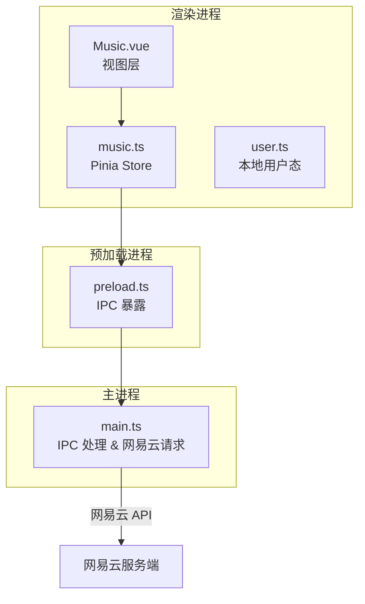
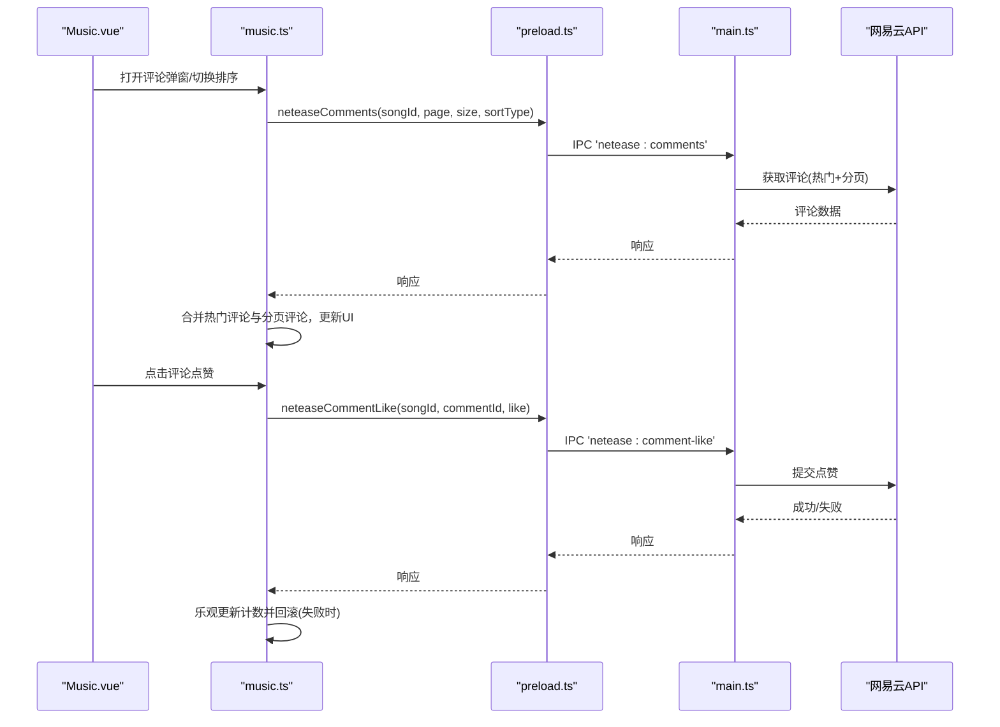
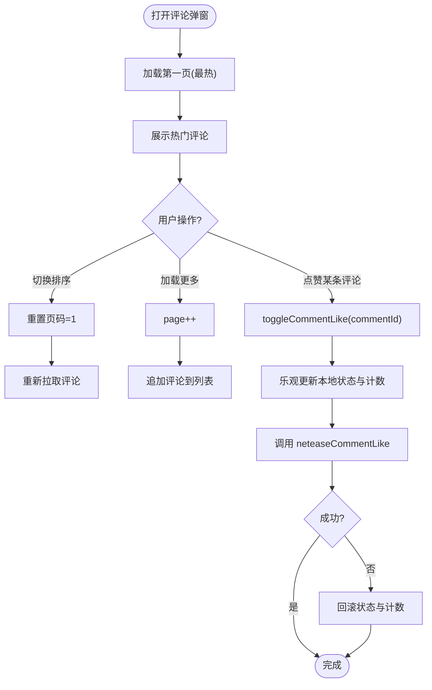
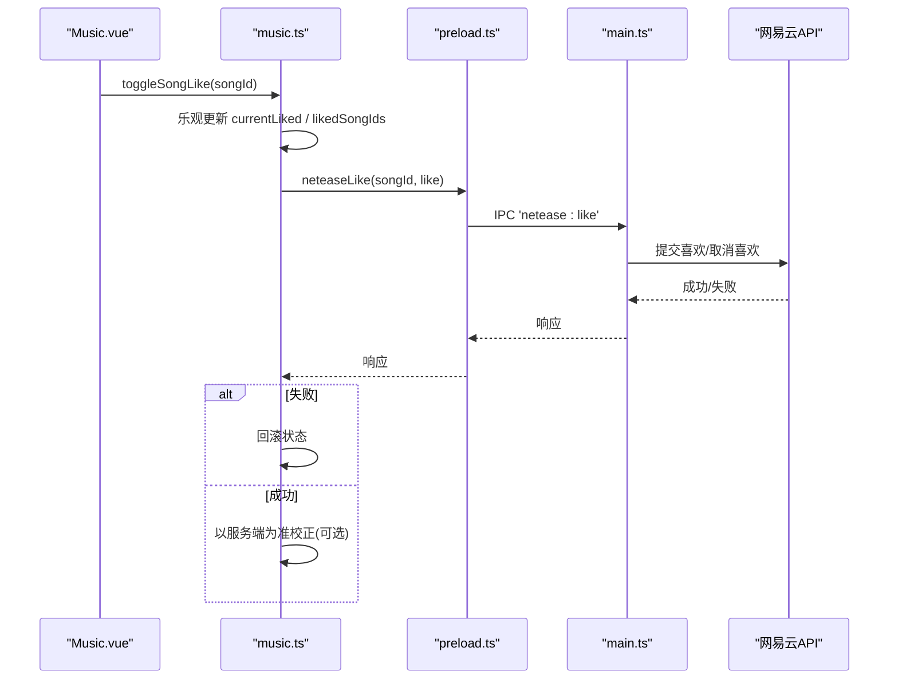
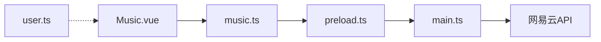

# 社交互动功能

<cite>
**本文引用的文件**
- [music.ts](file://src/renderer/src/stores/music.ts)
- [Music.vue](file://src/renderer/src/views/Music.vue)
- [preload.ts](file://src/preload/preload.ts)
- [main.ts](file://src/main/main.ts)
- [user.ts](file://src/renderer/src/stores/user.ts)
</cite>

## 目录
1. [简介](#简介)
2. [项目结构](#项目结构)
3. [核心组件](#核心组件)
4. [架构总览](#架构总览)
5. [详细组件分析](#详细组件分析)
6. [依赖关系分析](#依赖关系分析)
7. [性能考虑](#性能考虑)
8. [故障排查指南](#故障排查指南)
9. [结论](#结论)
10. [附录：API调用示例与体验优化建议](#附录api调用示例与体验优化建议)

## 简介
本文件聚焦于本项目中与网易云音乐集成的“社交互动”能力，覆盖以下方面：
- 评论系统：获取热门/最新评论、分页加载、评论点赞、回复展示
- 歌曲喜欢（收藏）：收藏/取消收藏、状态同步、批量缓存
- 用户互动：登录态管理、歌单同步、用户详情与关注数等基础信息
- 社交分享：当前代码库未实现直接分享接口；提供可落地的扩展方案
- 排序与筛选：评论按“最热/最新”切换、分页加载
- API调用示例与用户体验优化建议

## 项目结构
本项目采用 Electron + Vue 3 + Pinia 的架构。社交相关逻辑主要分布在渲染进程的状态管理与视图层，并通过预加载脚本桥接到主进程的 IPC 通道，最终由主进程调用网易云 API。

图表来源
- [Music.vue:1-800](file://src/renderer/src/views/Music.vue#L1-L800)
- [music.ts:1-1429](file://src/renderer/src/stores/music.ts#L1-L1429)
- [preload.ts:50-104](file://src/preload/preload.ts#L50-L104)
- [main.ts:1914-1979](file://src/main/main.ts#L1914-L1979)

章节来源
- [Music.vue:1-800](file://src/renderer/src/views/Music.vue#L1-L800)
- [music.ts:1-1429](file://src/renderer/src/stores/music.ts#L1-L1429)
- [preload.ts:50-104](file://src/preload/preload.ts#L50-L104)
- [main.ts:1914-1979](file://src/main/main.ts#L1914-L1979)

## 核心组件
- 音乐状态管理（music.ts）
  - 网易云登录态、歌单列表、排行榜、热搜、云盘
  - 歌曲喜欢（收藏）：批量拉取 liked ids、乐观更新、失败回滚
  - 评论系统：热门评论、分页加载、评论点赞（乐观更新）
  - 播放控制、歌词、在线搜索与播放
- 视图层（Music.vue）
  - 播放器 UI、歌词、评论弹窗、排序切换、加载更多
  - 登录对话框（扫码/手机号/Cookie）、歌单与排行榜交互
- 预加载桥接（preload.ts）
  - 暴露 neteaseComments、neteaseCommentLike、neteaseLikelist、neteaseLike 等 IPC 方法
- 主进程（main.ts）
  - 处理 IPC，调用网易云 API，返回统一结果
- 本地用户态（user.ts）
  - 应用内账户体系（与网易云账号独立），用于本地登录/注册/游客模式

章节来源
- [music.ts:955-1178](file://src/renderer/src/stores/music.ts#L955-L1178)
- [Music.vue:990-1023](file://src/renderer/src/views/Music.vue#L990-L1023)
- [preload.ts:50-104](file://src/preload/preload.ts#L50-L104)
- [main.ts:1914-1979](file://src/main/main.ts#L1914-L1979)
- [user.ts:1-86](file://src/renderer/src/stores/user.ts#L1-L86)

## 架构总览
社交能力通过“视图 -> Store -> 预加载 -> 主进程 -> 网易云 API”的链路完成。Store 负责状态管理与业务编排，视图负责交互与展示，预加载与主进程负责安全隔离与网络请求。

图表来源
- [Music.vue:990-1023](file://src/renderer/src/views/Music.vue#L990-L1023)
- [music.ts:1084-1178](file://src/renderer/src/stores/music.ts#L1084-L1178)
- [preload.ts:50-104](file://src/preload/preload.ts#L50-L104)
- [main.ts:1914-1979](file://src/main/main.ts#L1914-L1979)

## 详细组件分析

### 评论系统
- 获取评论
  - 入口：打开评论弹窗时默认按“最热”加载第一页，后续支持“加载更多”
  - 排序：支持“最热/最新”切换，切换后重置页码并重新拉取
  - 数据结构：包含热门评论与分页评论，同时维护总数用于分页判断
- 评论点赞
  - 乐观更新：点击后立即变更本地状态与计数，避免等待网络
  - 失败回滚：若网络失败，自动恢复原状态与计数
  - 防重复：使用 likingCommentId 防止重复点击
- 回复展示
  - 当存在回复内容时，显示“回复人：内容”的缩进样式

图表来源
- [Music.vue:990-1023](file://src/renderer/src/views/Music.vue#L990-L1023)
- [music.ts:1084-1178](file://src/renderer/src/stores/music.ts#L1084-L1178)

章节来源
- [Music.vue:990-1023](file://src/renderer/src/views/Music.vue#L990-L1023)
- [music.ts:1084-1178](file://src/renderer/src/stores/music.ts#L1084-L1178)

### 歌曲喜欢（收藏）
- 批量缓存已喜欢歌曲ID
  - 登录后或搜索完成后一次性拉取 likelist，构建 Set 缓存，提升列表项渲染性能
- 切换喜欢状态
  - 乐观更新：立即改变 UI 状态
  - 失败回滚：网络失败时恢复原状态
  - 防抖：likingSongId 防止重复触发
- 状态同步
  - 基于 likelist 的集合成员判断，确保初始状态正确

图表来源
- [music.ts:955-1062](file://src/renderer/src/stores/music.ts#L955-L1062)
- [preload.ts:50-104](file://src/preload/preload.ts#L50-L104)
- [main.ts:1914-1979](file://src/main/main.ts#L1914-L1979)

章节来源
- [music.ts:955-1062](file://src/renderer/src/stores/music.ts#L955-L1062)
- [preload.ts:50-104](file://src/preload/preload.ts#L50-L104)
- [main.ts:1914-1979](file://src/main/main.ts#L1914-L1979)

### 用户互动机制
- 登录态管理
  - 支持扫码、手机号、Cookie 三种方式登录网易云
  - 登录后拉取用户歌单、已喜欢歌曲列表
- 歌单同步
  - 获取用户歌单列表与详情，支持播放全部或添加到队列
- 用户详情
  - 获取用户基本信息（昵称、头像、等级、关注数等）
- 本地用户态
  - 应用内账户体系（与网易云账号独立），用于本地登录/注册/游客模式

章节来源
- [music.ts:508-700](file://src/renderer/src/stores/music.ts#L508-L700)
- [music.ts:896-953](file://src/renderer/src/stores/music.ts#L896-L953)
- [user.ts:1-86](file://src/renderer/src/stores/user.ts#L1-L86)

### 社交分享功能
- 现状
  - 当前代码库未实现直接的“分享歌曲/歌单/动态发布”接口
- 可扩展方案（建议）
  - 歌曲分享：复制歌曲链接或生成短链，调用系统剪贴板或唤起外部浏览器
  - 歌单分享：导出歌单为 JSON/CSV，或通过平台分享链接
  - 动态发布：集成第三方社交平台 SDK 或自建后端转发至社交平台 API
  - 注意：需遵循各平台开放政策与合规要求

[本节为概念性说明，不直接分析具体文件]

### 评论排序与筛选机制
- 排序类型
  - 最热（sortType=2）：默认展示，适合发现高质量评论
  - 最新（sortType=1）：适合查看最新动态
- 分页加载
  - 首次加载第一页，后续通过“加载更多”递增页码
  - 切换排序时重置页码并重新拉取
- 数据合并
  - 第一页合并热门评论与分页评论，后续仅追加分页评论

章节来源
- [Music.vue:990-1023](file://src/renderer/src/views/Music.vue#L990-L1023)
- [music.ts:1084-1103](file://src/renderer/src/stores/music.ts#L1084-L1103)

## 依赖关系分析
- 视图层依赖 Store 暴露的方法进行交互
- Store 依赖预加载暴露的 IPC 方法
- 主进程监听 IPC 并调用网易云 API
- 本地用户态与应用内账户体系解耦，不影响网易云社交能力

图表来源
- [Music.vue:1-800](file://src/renderer/src/views/Music.vue#L1-L800)
- [music.ts:1-1429](file://src/renderer/src/stores/music.ts#L1-L1429)
- [preload.ts:50-104](file://src/preload/preload.ts#L50-L104)
- [main.ts:1914-1979](file://src/main/main.ts#L1914-L1979)
- [user.ts:1-86](file://src/renderer/src/stores/user.ts#L1-L86)

章节来源
- [Music.vue:1-800](file://src/renderer/src/views/Music.vue#L1-L800)
- [music.ts:1-1429](file://src/renderer/src/stores/music.ts#L1-L1429)
- [preload.ts:50-104](file://src/preload/preload.ts#L50-L104)
- [main.ts:1914-1979](file://src/main/main.ts#L1914-L1979)
- [user.ts:1-86](file://src/renderer/src/stores/user.ts#L1-L86)

## 性能考虑
- 批量拉取 liked ids：避免逐首检查，减少网络请求
- 乐观更新：提升交互响应速度，失败时回滚保证一致性
- 长列表分页：评论与播放队列采用分批渲染，降低 DOM 压力
- 错误重试：在线歌曲 URL 过期时自动刷新并重试播放

[本节提供通用指导，不直接分析具体文件]

## 故障排查指南
- 评论加载失败
  - 检查网络与登录态，确认 neteaseComments 调用是否成功
  - 查看 commentsLoading 状态与 commentsTotal 是否正确
- 评论点赞无响应
  - 检查 likingCommentId 是否被正确复位，避免按钮永久禁用
  - 确认 neteaseCommentLike 调用参数 songId、commentId、like 正确
- 歌曲喜欢状态不同步
  - 确认 fetchLikelist 是否成功拉取 ids，likedSongIds 是否正确重建
  - 检查 toggleLikeSong 的乐观更新与失败回滚逻辑
- 在线歌曲播放失败
  - 检查 URL 刷新重试逻辑与 qualityLevel 设置

章节来源
- [music.ts:103-138](file://src/renderer/src/stores/music.ts#L103-L138)
- [music.ts:1137-1178](file://src/renderer/src/stores/music.ts#L1137-L1178)
- [music.ts:977-1062](file://src/renderer/src/stores/music.ts#L977-L1062)

## 结论
本项目在网易云社交互动方面实现了评论获取与点赞、歌曲喜欢（收藏）与状态同步、用户登录与歌单同步等核心能力。整体采用乐观更新与批量缓存策略，兼顾性能与用户体验。分享功能尚未实现，可按建议方案扩展。

[本节为总结性内容，不直接分析具体文件]

## 附录：API调用示例与体验优化建议

### 评论相关
- 获取评论（热门+分页）
  - 调用路径：Music.vue -> music.ts -> preload.ts -> main.ts
  - 关键方法：fetchSongComments(songId, pageNo, pageSize, sortType)
  - 排序：sortType=2（最热），sortType=1（最新）
  - 分页：pageNo 从 1 开始，pageSize 常用 20
- 评论点赞
  - 调用路径：Music.vue -> music.ts -> preload.ts -> main.ts
  - 关键方法：toggleCommentLike(commentId, currentLiked)
  - 行为：乐观更新本地状态与计数，失败自动回滚

章节来源
- [Music.vue:990-1023](file://src/renderer/src/views/Music.vue#L990-L1023)
- [music.ts:1084-1178](file://src/renderer/src/stores/music.ts#L1084-L1178)
- [preload.ts:50-104](file://src/preload/preload.ts#L50-L104)

### 歌曲喜欢（收藏）
- 批量拉取已喜欢歌曲ID
  - 调用路径：music.ts -> preload.ts -> main.ts
  - 关键方法：fetchLikelist(uid?)
  - 用途：初始化 likedSongIds，提升列表项渲染性能
- 切换喜欢状态
  - 调用路径：Music.vue -> music.ts -> preload.ts -> main.ts
  - 关键方法：toggleLikeSong(songId)
  - 行为：乐观更新，失败回滚

章节来源
- [music.ts:977-1062](file://src/renderer/src/stores/music.ts#L977-L1062)
- [preload.ts:50-104](file://src/preload/preload.ts#L50-L104)
- [main.ts:1914-1979](file://src/main/main.ts#L1914-L1979)

### 用户体验优化建议
- 评论
  - 默认“最热”，提供“最新”切换；分页加载避免首屏过重
  - 点赞即时反馈，失败提示并回滚
- 歌曲喜欢
  - 搜索结果/歌单列表批量检查喜欢状态，减少闪烁
  - 点击立即变化，失败回滚并提示
- 登录与歌单
  - 登录成功后自动拉取歌单与已喜欢歌曲列表
  - 歌单详情页提供“播放全部”和“添加到队列”
- 分享（扩展）
  - 提供一键复制链接、生成海报、分享到社交平台等选项
  - 遵循平台规范，避免滥用

[本节为通用建议，不直接分析具体文件]