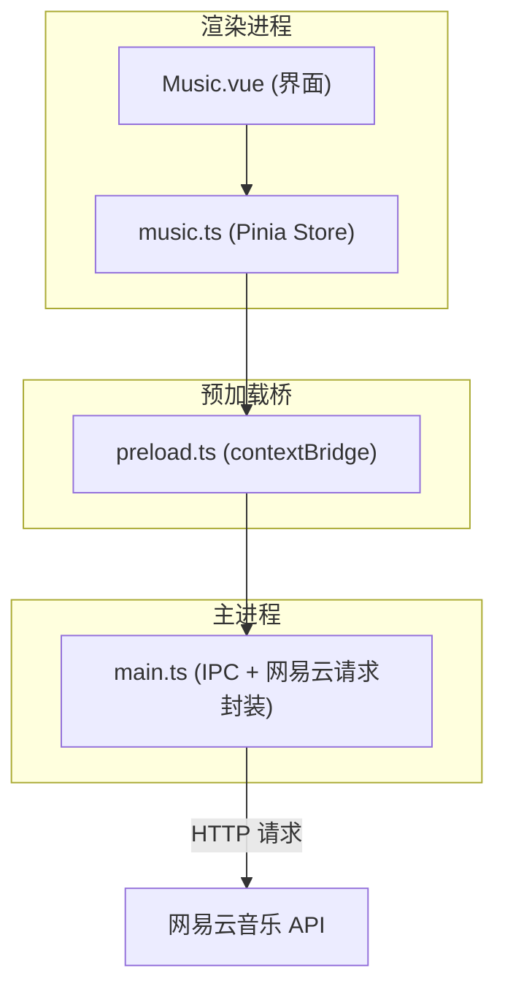
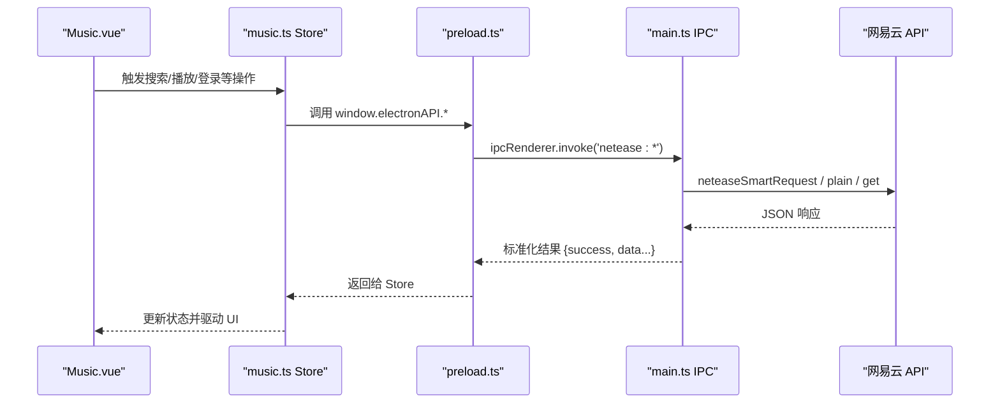
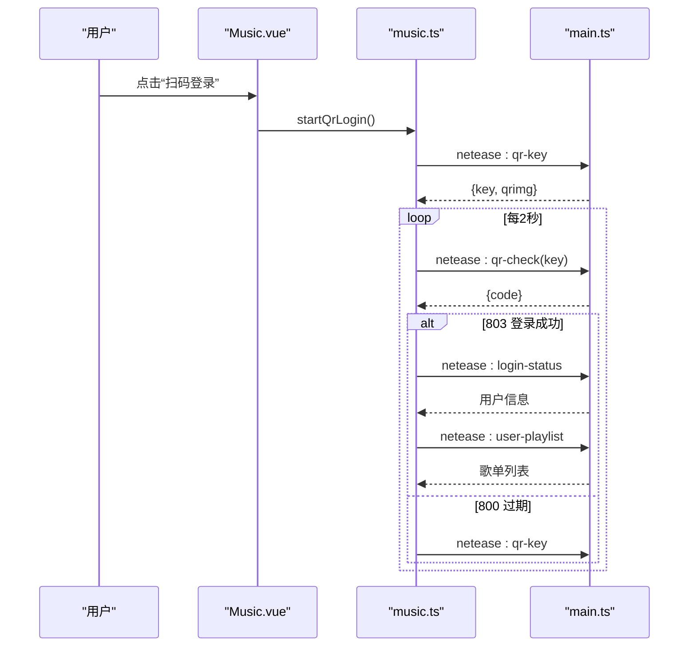
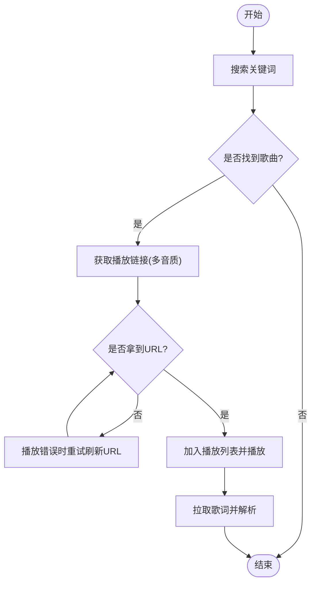
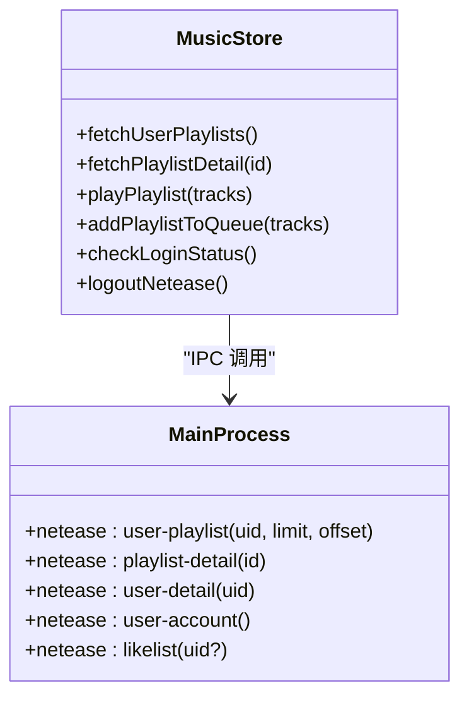
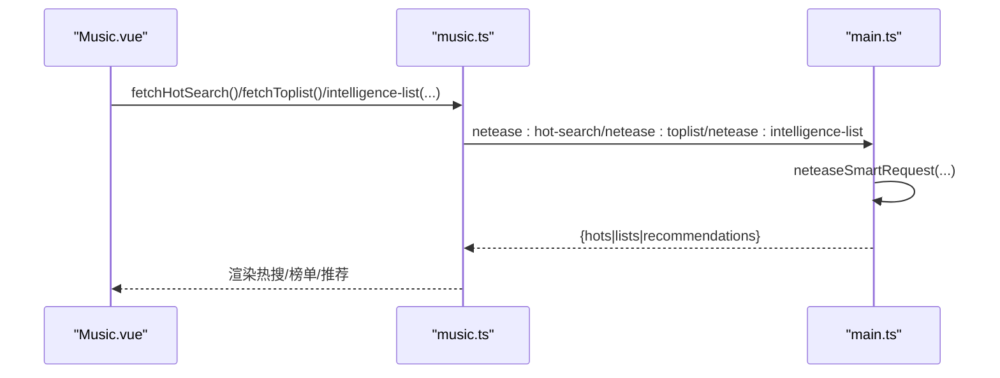
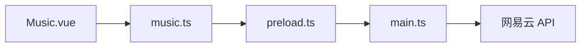

# 网易云音乐API集成

<cite>
**本文引用的文件**
- [src/main/main.ts](file://src/main/main.ts)
- [src/preload/preload.ts](file://src/preload/preload.ts)
- [src/renderer/src/stores/music.ts](file://src/renderer/src/stores/music.ts)
- [src/renderer/src/views/Music.vue](file://src/renderer/src/views/Music.vue)
- [src/renderer/src/vite-env.d.ts](file://src/renderer/src/vite-env.d.ts)
- [README.md](file://README.md)
</cite>

## 目录
1. [简介](#简介)
2. [项目结构](#项目结构)
3. [核心组件](#核心组件)
4. [架构总览](#架构总览)
5. [详细组件分析](#详细组件分析)
6. [依赖关系分析](#依赖关系分析)
7. [性能与限流建议](#性能与限流建议)
8. [故障排查指南](#故障排查指南)
9. [结论](#结论)
10. [附录：接口清单与参数说明](#附录接口清单与参数说明)

## 简介
本仓库实现了一个基于 Electron + Vue 的桌面应用，深度集成了网易云音乐 API。功能覆盖：
- 认证登录：二维码扫码、手机号密码、Cookie 粘贴三种方式；登录态持久化
- 音乐能力：歌曲搜索、歌词获取、播放链接获取（多音质）、歌单管理、用户信息获取
- 高级功能：热搜列表、排行榜及详情、心动模式（智能推荐）
- 交互体验：在线/本地混合播放、歌词滚动、热门评论展示与点赞、喜欢状态同步与批量缓存

## 项目结构
- main 进程负责网络请求、Cookie 管理、IPC 通道暴露
- preload 桥接渲染进程与主进程，统一暴露 electronAPI
- renderer 层通过 Pinia store 组织音乐状态与业务逻辑，Vue 页面承载 UI
- 所有网易云 API 调用均通过主进程的 neteaseSmartRequest/eapi/weapi/plain/get 等封装进行

图表来源
- [src/renderer/src/stores/music.ts:1-120](file://src/renderer/src/stores/music.ts#L1-L120)
- [src/preload/preload.ts:39-69](file://src/preload/preload.ts#L39-L69)
- [src/main/main.ts:1222-1332](file://src/main/main.ts#L1222-L1332)

章节来源
- [src/main/main.ts:1222-1332](file://src/main/main.ts#L1222-L1332)
- [src/preload/preload.ts:39-69](file://src/preload/preload.ts#L39-L69)
- [src/renderer/src/stores/music.ts:1-120](file://src/renderer/src/stores/music.ts#L1-L120)

## 核心组件
- 认证模块：二维码 key 获取与轮询、手机号登录、Cookie 设置与校验、登录状态检查、退出登录
- 搜索与播放：关键词搜索、歌词获取、播放链接获取（支持多音质等级）、在线/本地混合播放
- 歌单与用户：用户歌单列表、歌单详情、用户详情与账号信息、已喜欢歌曲列表
- 高级功能：热搜列表、排行榜列表与详情、心动模式（智能推荐）
- 评论系统：热门评论、分页评论、评论点赞

章节来源
- [src/main/main.ts:1334-1400](file://src/main/main.ts#L1334-L1400)
- [src/main/main.ts:1403-1597](file://src/main/main.ts#L1403-L1597)
- [src/main/main.ts:1601-1891](file://src/main/main.ts#L1601-L1891)
- [src/main/main.ts:1893-2000](file://src/main/main.ts#L1893-L2000)
- [src/renderer/src/stores/music.ts:433-800](file://src/renderer/src/stores/music.ts#L433-L800)

## 架构总览
整体采用“渲染进程 -> 预加载桥 -> 主进程 -> 网易云 API”的分层架构。主进程统一封装 eapi/weapi/plain/get 请求，自动处理 Cookie 注入、IP 伪装、错误降级与 Set-Cookie 解析入库。

图表来源
- [src/renderer/src/views/Music.vue:736-744](file://src/renderer/src/views/Music.vue#L736-L744)
- [src/renderer/src/stores/music.ts:435-454](file://src/renderer/src/stores/music.ts#L435-L454)
- [src/preload/preload.ts:40-42](file://src/preload/preload.ts#L40-L42)
- [src/main/main.ts:1222-1282](file://src/main/main.ts#L1222-L1282)

## 详细组件分析

### 认证流程（二维码/手机号/Cookie）
- 二维码登录
  - 获取 key：调用主进程 netease:qr-key，内部尝试多个端点并构造二维码图片 URL
  - 轮询状态：每 2 秒调用 netease:qr-check，根据 code 判断等待/待确认/成功/过期
  - 成功后：自动保存 Cookie，刷新用户信息与歌单
- 手机号登录
  - 对密码进行 MD5 后调用 /w/login/cellphone，成功后再校验账户信息
- Cookie 登录
  - 解析用户粘贴的 Cookie 字符串并持久化，随后验证登录态

图表来源
- [src/renderer/src/views/Music.vue:800-822](file://src/renderer/src/views/Music.vue#L800-L822)
- [src/renderer/src/stores/music.ts:619-652](file://src/renderer/src/stores/music.ts#L619-L652)
- [src/main/main.ts:1403-1472](file://src/main/main.ts#L1403-L1472)

章节来源
- [src/main/main.ts:1403-1597](file://src/main/main.ts#L1403-L1597)
- [src/renderer/src/stores/music.ts:546-673](file://src/renderer/src/stores/music.ts#L546-L673)
- [src/renderer/src/views/Music.vue:763-858](file://src/renderer/src/views/Music.vue#L763-L858)

### 搜索、歌词与播放链接
- 搜索：调用 /cloudsearch/get/web，返回歌曲列表（id/name/artist/album/cover）
- 歌词：调用 /song/lyric，解析 lrc 时间轴用于高亮显示
- 播放链接：优先 /song/url/v1，失败降级到 /song/enhance/player/url；支持标准/更高/高品/无损/Hi-Res 等多音质等级

图表来源
- [src/main/main.ts:1334-1400](file://src/main/main.ts#L1334-L1400)
- [src/main/main.ts:1356-1387](file://src/main/main.ts#L1356-L1387)
- [src/renderer/src/stores/music.ts:171-236](file://src/renderer/src/stores/music.ts#L171-L236)
- [src/renderer/src/stores/music.ts:456-506](file://src/renderer/src/stores/music.ts#L456-L506)

章节来源
- [src/main/main.ts:1334-1400](file://src/main/main.ts#L1334-L1400)
- [src/main/main.ts:1356-1387](file://src/main/main.ts#L1356-L1387)
- [src/renderer/src/stores/music.ts:171-236](file://src/renderer/src/stores/music.ts#L171-L236)
- [src/renderer/src/stores/music.ts:456-506](file://src/renderer/src/stores/music.ts#L456-L506)

### 歌单管理与用户信息
- 用户歌单：/user/playlist，支持分页
- 歌单详情：/v6/playlist/detail，返回曲目列表
- 用户详情：/v1/user/detail/{uid}
- 账号信息：/w/nuser/account/get，含会员、注册天数等
- 已喜欢歌曲列表：/song/like/get，一次性拉取 ID 集合供前端快速判断

图表来源
- [src/renderer/src/stores/music.ts:675-776](file://src/renderer/src/stores/music.ts#L675-L776)
- [src/main/main.ts:1601-1891](file://src/main/main.ts#L1601-L1891)

章节来源
- [src/main/main.ts:1601-1891](file://src/main/main.ts#L1601-L1891)
- [src/renderer/src/stores/music.ts:675-776](file://src/renderer/src/stores/music.ts#L675-L776)

### 热搜、排行榜与心动模式
- 热搜：/search/hot，返回热词、热度分数与图标
- 排行榜：/toplist/detail 列表与 /v6/playlist/detail 详情
- 心动模式：/playmode/intelligence/list，传入 songId、playlistId、startMusicId、count 等参数生成智能推荐

图表来源
- [src/main/main.ts:1723-1813](file://src/main/main.ts#L1723-L1813)
- [src/main/main.ts:1980-2000](file://src/main/main.ts#L1980-L2000)
- [src/renderer/src/stores/music.ts:778-800](file://src/renderer/src/stores/music.ts#L778-L800)

章节来源
- [src/main/main.ts:1723-1813](file://src/main/main.ts#L1723-L1813)
- [src/main/main.ts:1980-2000](file://src/main/main.ts#L1980-L2000)
- [src/renderer/src/stores/music.ts:778-800](file://src/renderer/src/stores/music.ts#L778-L800)

### 评论系统与喜欢状态
- 评论：/v1/resource/comments/R_SO_4_{id}，支持最热/最新排序与分页
- 评论点赞：通过对应 IPC 调用实现
- 喜欢状态：/song/like/check 或 /song/like/get 批量拉取，前端维护 Set 以高效判断

章节来源
- [src/main/main.ts:1675-1721](file://src/main/main.ts#L1675-L1721)
- [src/main/main.ts:1893-1978](file://src/main/main.ts#L1893-L1978)

## 依赖关系分析
- 渲染层依赖 preload 暴露的 electronAPI
- Store 依赖 electronAPI 调用主进程 IPC
- 主进程依赖统一的 HTTP 封装与 Cookie 管理
- 外部依赖：网易云音乐 API（eapi/weapi/api）

图表来源
- [src/preload/preload.ts:39-69](file://src/preload/preload.ts#L39-L69)
- [src/main/main.ts:1222-1332](file://src/main/main.ts#L1222-L1332)

章节来源
- [src/preload/preload.ts:39-69](file://src/preload/preload.ts#L39-L69)
- [src/main/main.ts:1222-1332](file://src/main/main.ts#L1222-L1332)

## 性能与限流建议
- 批量获取播放链接：按 20 首分批请求，避免单次过大负载
- 长列表渲染：云盘与播放队列使用分页渲染（每次 60 条），减少 DOM 压力
- 播放错误自愈：在线歌曲 URL 过期时自动刷新并重试（最多两次）
- 歌词解析：仅解析有效时间戳行并按时间排序，降低无效计算
- 网络层：eapi 失败自动降级 weapi，提高成功率
- 建议：在高频操作（如批量拉取歌单/评论）中加入节流/防抖，避免短时间内多次请求

[本节为通用优化建议，不直接分析具体文件]

## 故障排查指南
- 二维码不显示：检查 netease:qr-key 是否成功获取 unikey，以及二维码图片服务是否可达
- 登录失败：核对手机号/密码格式，或检查 Cookie 是否完整有效
- 播放失败：在线歌曲 URL 过期会触发自动刷新；若仍失败，检查音质等级与版权限制
- 歌单/排行榜为空：确认已登录且 Cookie 有效；必要时重新登录
- 评论加载失败：检查页码与排序参数，或稍后重试

章节来源
- [src/main/main.ts:1403-1472](file://src/main/main.ts#L1403-L1472)
- [src/main/main.ts:1511-1597](file://src/main/main.ts#L1511-L1597)
- [src/renderer/src/stores/music.ts:102-138](file://src/renderer/src/stores/music.ts#L102-L138)

## 结论
本项目通过分层架构与统一封装，实现了网易云音乐的完整认证与丰富的音乐能力集成。具备多种登录方式、在线/本地混合播放、歌词与评论、热搜/排行榜/心动模式等高级特性，并在错误处理与性能方面做了多项优化。后续可继续扩展更多个性化功能与更稳健的容错机制。

[本节为总结性内容，不直接分析具体文件]

## 附录：接口清单与参数说明
以下列出主要 IPC 接口及其用途与关键参数（来自 preload 类型定义与主进程实现）。

- 搜索
  - neteaseSearch(keyword, limit?, offset?)
  - 用途：关键词搜索歌曲
  - 参考路径：[src/preload/preload.ts:40](file://src/preload/preload.ts#L40)、[src/main/main.ts:1334-1354](file://src/main/main.ts#L1334-L1354)

- 播放链接
  - neteaseSongUrl(ids, level?)
  - 用途：获取在线歌曲播放地址，level 支持 standard/higher/exhigh/lossless/hires
  - 参考路径：[src/preload/preload.ts:41](file://src/preload/preload.ts#L41)、[src/main/main.ts:1356-1387](file://src/main/main.ts#L1356-L1387)

- 歌词
  - neteaseLyric(id)
  - 用途：获取歌词文本（lrc/tlyric）
  - 参考路径：[src/preload/preload.ts:42](file://src/preload/preload.ts#L42)、[src/main/main.ts:1389-1400](file://src/main/main.ts#L1389-L1400)

- 登录相关
  - neteaseQrKey() / neteaseQrCheck(key)
  - neteaseSetCookie(cookie) / neteaseLoginPhone(phone, password, countrycode?)
  - neteaseLoginStatus() / neteaseLogout()
  - 参考路径：[src/preload/preload.ts:44-50](file://src/preload/preload.ts#L44-L50)、[src/main/main.ts:1403-1597](file://src/main/main.ts#L1403-L1597)

- 歌单与用户
  - neteaseUserPlaylist(uid, limit?, offset?)
  - neteasePlaylistDetail(id)
  - neteaseUserDetail(uid)
  - neteaseUserAccount()
  - 参考路径：[src/preload/preload.ts:51-60](file://src/preload/preload.ts#L51-L60)、[src/main/main.ts:1601-1891](file://src/main/main.ts#L1601-L1891)

- 喜欢与评论
  - neteaseLike(songId, like?)
  - neteaseSongLikeStatus(songId | string)
  - neteaseComments(id, pageNo?, pageSize?, sortType?)
  - neteaseCommentLike(songId, commentId, like)
  - 参考路径：[src/preload/preload.ts:61-67](file://src/preload/preload.ts#L61-L67)、[src/main/main.ts:1675-1721](file://src/main/main.ts#L1675-L1721)、[src/main/main.ts:1893-1978](file://src/main/main.ts#L1893-L1978)

- 热搜与排行榜
  - neteaseHotSearch()
  - neteaseToplist()
  - neteaseToplistDetail(id)
  - 参考路径：[src/preload/preload.ts:56-58](file://src/preload/preload.ts#L56-L58)、[src/main/main.ts:1723-1813](file://src/main/main.ts#L1723-L1813)

- 心动模式
  - neteaseIntelligenceList(songId, playlistId)
  - 参考路径：[src/preload/preload.ts:63](file://src/preload/preload.ts#L63)、[src/main/main.ts:1980-2000](file://src/main/main.ts#L1980-L2000)

- 云盘
  - neteaseCloudDrive(pageSize?, pageNo?)
  - 参考路径：[src/preload/preload.ts:69](file://src/preload/preload.ts#L69)

章节来源
- [src/preload/preload.ts:39-69](file://src/preload/preload.ts#L39-L69)
- [src/main/main.ts:1334-2000](file://src/main/main.ts#L1334-L2000)