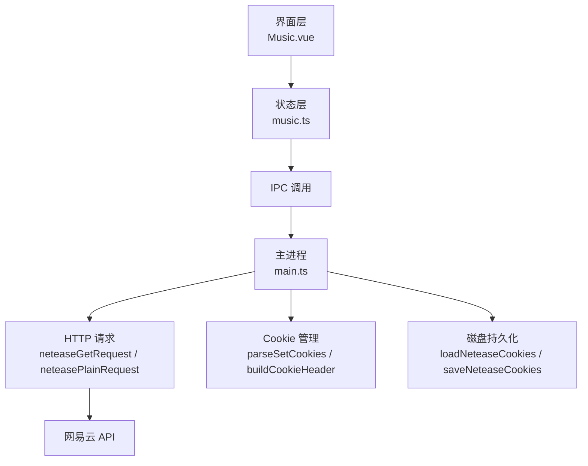
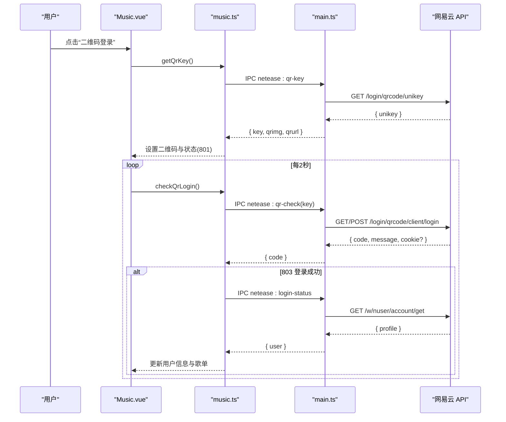
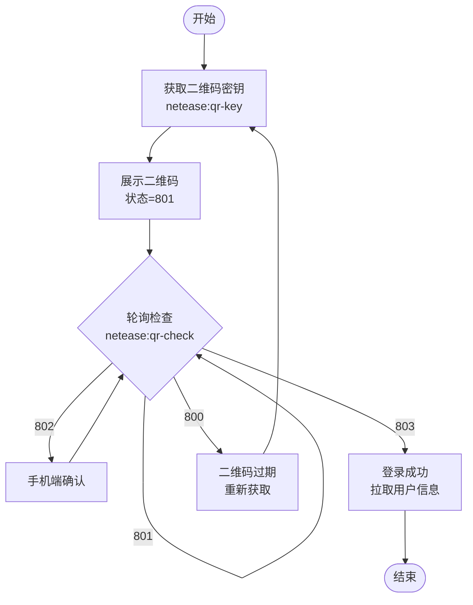
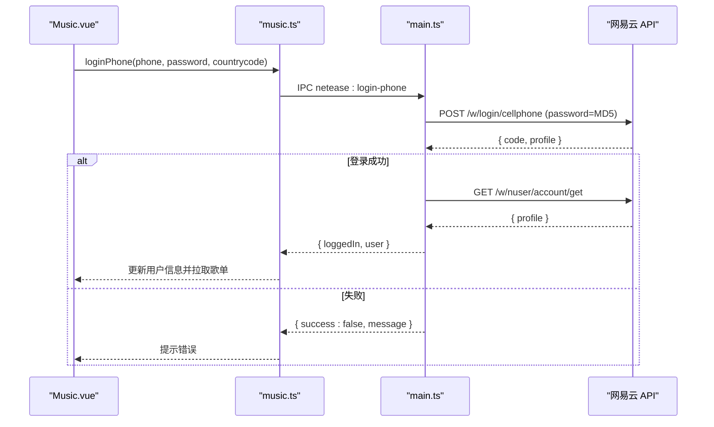
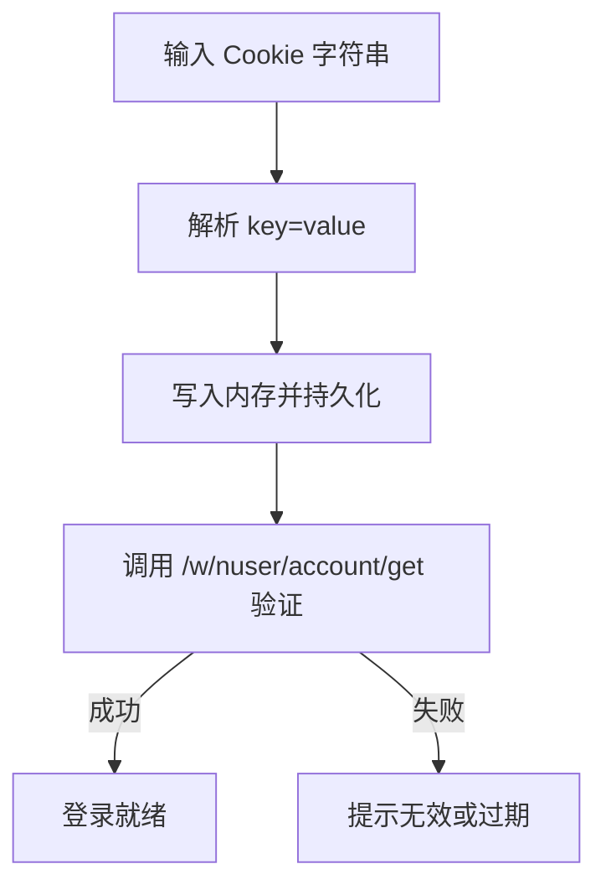
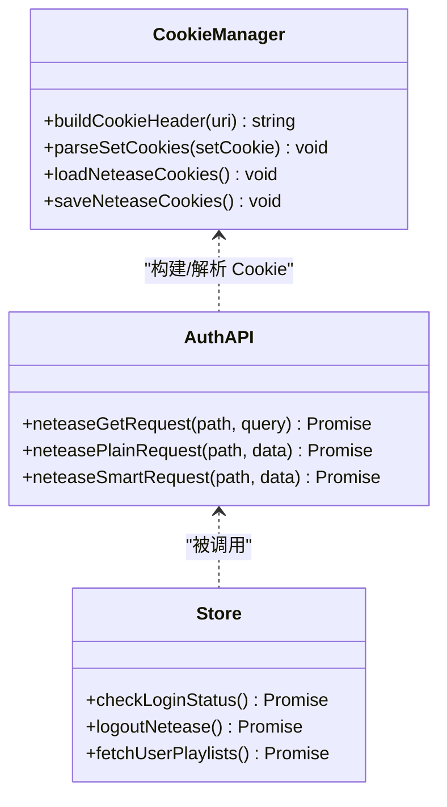
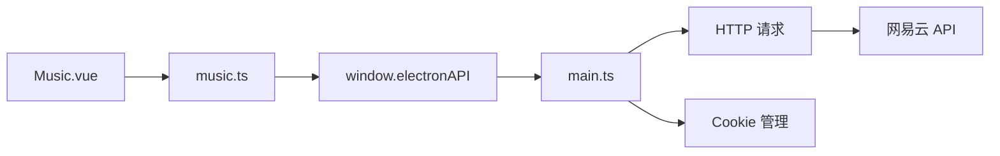

# 网易云音乐认证系统

<cite>
**本文引用的文件**
- [main.ts](file://src/main/main.ts)
- [music.ts](file://src/renderer/src/stores/music.ts)
- [Music.vue](file://src/renderer/src/views/Music.vue)
</cite>

## 目录
1. [简介](#简介)
2. [项目结构](#项目结构)
3. [核心组件](#核心组件)
4. [架构总览](#架构总览)
5. [详细组件分析](#详细组件分析)
6. [依赖关系分析](#依赖关系分析)
7. [性能与稳定性](#性能与稳定性)
8. [故障排查指南](#故障排查指南)
9. [结论](#结论)
10. [附录：API 调用示例与参数说明](#附录api-调用示例与参数说明)

## 简介
本文件面向网易云音乐认证子系统，覆盖以下能力：
- 二维码登录流程：获取二维码密钥、生成并展示二维码、轮询检查登录状态。
- 手机号登录：国家代码处理、密码加密传输、登录成功后的会话建立。
- Cookie 管理：Cookie 设置、解析、验证与持久化存储。
- 登录状态管理：用户信息获取、会话保持、自动登出处理。
- 完整认证流程图与错误处理策略。
- 具体 API 调用示例与参数说明（以路径和字段为主，不直接粘贴源码）。

## 项目结构
本项目采用 Electron + Vue 的架构：
- 主进程（main.ts）负责网络请求、Cookie 持久化、与网易云 API 交互。
- 渲染进程通过 Pinia store（music.ts）封装业务逻辑，并通过 IPC 调用主进程能力。
- 视图层（Music.vue）提供二维码、手机号、Cookie 三种登录入口及状态展示。

图表来源
- [main.ts:1013-1086](file://src/main/main.ts#L1013-L1086)
- [main.ts:1285-1333](file://src/main/main.ts#L1285-L1333)
- [music.ts:546-673](file://src/renderer/src/stores/music.ts#L546-L673)
- [Music.vue:786-858](file://src/renderer/src/views/Music.vue#L786-L858)

章节来源
- [main.ts:1013-1086](file://src/main/main.ts#L1013-L1086)
- [main.ts:1285-1333](file://src/main/main.ts#L1285-L1333)
- [music.ts:546-673](file://src/renderer/src/stores/music.ts#L546-L673)
- [Music.vue:786-858](file://src/renderer/src/views/Music.vue#L786-L858)

## 核心组件
- 主进程网络与 Cookie 模块
  - 构建 Cookie 头、解析 Set-Cookie、持久化到磁盘。
  - 提供 GET/POST 请求封装，统一附加 Cookie、Referer、UA、IP 伪装等。
- 渲染进程 Store
  - 封装二维码登录、手机号登录、Cookie 登录、退出登录、用户信息拉取、歌单同步等。
- 视图层
  - 提供二维码显示、轮询控制、手机号输入、Cookie 粘贴、登录状态提示。

章节来源
- [main.ts:1013-1086](file://src/main/main.ts#L1013-L1086)
- [main.ts:1285-1333](file://src/main/main.ts#L1285-L1333)
- [music.ts:546-673](file://src/renderer/src/stores/music.ts#L546-L673)
- [Music.vue:786-858](file://src/renderer/src/views/Music.vue#L786-L858)

## 架构总览
认证子系统由“界面触发 → Store 编排 → IPC 转发 → 主进程网络 → 网易云 API”构成。关键特性：
- 二维码登录：获取 unikey → 构造登录链接 → 在线生成二维码图片 → 每 2 秒轮询扫码状态。
- 手机号登录：MD5 加密密码 → POST 手机号登录接口 → 二次校验账户信息 → 保存 Cookie。
- Cookie 登录：解析用户粘贴的 Cookie → 写入内存并持久化 → 校验登录态。
- 会话保持：每次请求自动附加 Cookie；退出时清空 Cookie 并清理本地存储。

图表来源
- [Music.vue:800-822](file://src/renderer/src/views/Music.vue#L800-L822)
- [music.ts:619-652](file://src/renderer/src/stores/music.ts#L619-L652)
- [main.ts:1412-1473](file://src/main/main.ts#L1412-L1473)
- [main.ts:1475-1500](file://src/main/main.ts#L1475-L1500)

## 详细组件分析

### 二维码登录
- 获取二维码密钥
  - 调用主进程 IPC：netease:qr-key。
  - 主进程尝试 GET/POST 获取 unikey，兼容不同节点返回位置。
  - 使用 unikey 构造登录 URL，并通过在线服务生成二维码图片。
- 显示二维码
  - Store 接收 key 与 qrimg，设置状态为等待扫码（801）。
- 轮询检查登录状态
  - 每 2 秒调用 netease:qr-check，传入 key。
  - 主进程调用 /login/qrcode/client/login，解析响应中的 code：
    - 801：等待扫码
    - 802：已扫码待确认
    - 803：登录成功（同时可能携带 cookie 字符串）
    - 800：二维码过期
  - 登录成功后，再次拉取用户信息并刷新歌单。

图表来源
- [main.ts:1412-1473](file://src/main/main.ts#L1412-L1473)
- [music.ts:619-652](file://src/renderer/src/stores/music.ts#L619-L652)
- [Music.vue:800-822](file://src/renderer/src/views/Music.vue#L800-L822)

章节来源
- [main.ts:1412-1473](file://src/main/main.ts#L1412-L1473)
- [music.ts:619-652](file://src/renderer/src/stores/music.ts#L619-L652)
- [Music.vue:800-822](file://src/renderer/src/views/Music.vue#L800-L822)

### 手机号登录
- 前端输入手机号、密码与国家代码（默认 86）。
- Store 调用 IPC：netease:login-phone(phone, password, countrycode)。
- 主进程对密码进行 MD5 加密后，POST 至 /w/login/cellphone。
- 登录成功后，二次调用 /w/nuser/account/get 校验账户信息，确保会话有效。
- 将 Cookie 写入内存并持久化，Store 更新用户信息并拉取歌单。

图表来源
- [main.ts:1552-1598](file://src/main/main.ts#L1552-L1598)
- [music.ts:593-617](file://src/renderer/src/stores/music.ts#L593-L617)
- [Music.vue:824-853](file://src/renderer/src/views/Music.vue#L824-L853)

章节来源
- [main.ts:1552-1598](file://src/main/main.ts#L1552-L1598)
- [music.ts:593-617](file://src/renderer/src/stores/music.ts#L593-L617)
- [Music.vue:824-853](file://src/renderer/src/views/Music.vue#L824-L853)

### Cookie 管理机制
- Cookie 设置
  - 支持从浏览器复制 Cookie 字符串，按 key=value; 形式解析并写入内存。
  - 解析后立即持久化到磁盘，避免重启丢失。
- Cookie 验证
  - 设置完成后调用 /w/nuser/account/get 校验是否有效登录态。
- 持久化存储
  - 启动时从磁盘加载 Cookie 到内存。
  - 每次请求后解析 Set-Cookie 并持久化。
  - 退出登录时清空 Cookie 并持久化。

图表来源
- [main.ts:1512-1548](file://src/main/main.ts#L1512-L1548)
- [main.ts:1013-1048](file://src/main/main.ts#L1013-L1048)
- [music.ts:567-591](file://src/renderer/src/stores/music.ts#L567-L591)

章节来源
- [main.ts:1512-1548](file://src/main/main.ts#L1512-L1548)
- [main.ts:1013-1048](file://src/main/main.ts#L1013-L1048)
- [music.ts:567-591](file://src/renderer/src/stores/music.ts#L567-L591)

### 登录状态管理
- 用户信息获取
  - 通过 /w/nuser/account/get 获取 userId、nickname、avatar、signature、level。
- 会话保持
  - 所有请求均附带构建好的 Cookie 头，包含设备标识、匿名访客 ID 等必要字段。
- 自动登出处理
  - 调用 /logout 后清空 Cookie 并持久化，Store 重置用户与歌单状态。

图表来源
- [main.ts:1055-1086](file://src/main/main.ts#L1055-L1086)
- [main.ts:1285-1333](file://src/main/main.ts#L1285-L1333)
- [music.ts:546-673](file://src/renderer/src/stores/music.ts#L546-L673)

章节来源
- [main.ts:1055-1086](file://src/main/main.ts#L1055-L1086)
- [main.ts:1285-1333](file://src/main/main.ts#L1285-L1333)
- [music.ts:546-673](file://src/renderer/src/stores/music.ts#L546-L673)

## 依赖关系分析
- 视图层 Music.vue 依赖 music.ts 提供的登录方法。
- music.ts 通过 window.electronAPI 调用主进程 IPC。
- main.ts 依赖 HTTP 请求封装与 Cookie 管理，最终访问网易云 API。
- 关键耦合点：
  - 二维码登录：UI 轮询节奏与 Store 状态联动。
  - 手机号登录：密码加密方式与接口参数一致性。
  - Cookie 管理：Set-Cookie 解析与持久化时机。

图表来源
- [Music.vue:786-858](file://src/renderer/src/views/Music.vue#L786-L858)
- [music.ts:546-673](file://src/renderer/src/stores/music.ts#L546-L673)
- [main.ts:1285-1333](file://src/main/main.ts#L1285-L1333)

章节来源
- [Music.vue:786-858](file://src/renderer/src/views/Music.vue#L786-L858)
- [music.ts:546-673](file://src/renderer/src/stores/music.ts#L546-L673)
- [main.ts:1285-1333](file://src/main/main.ts#L1285-L1333)

## 性能与稳定性
- 轮询频率：二维码状态每 2 秒轮询一次，避免频繁请求造成资源浪费。
- 批量请求：歌单播放列表获取按批次（最多 20 首）拉取播放地址，降低单次负载。
- 错误重试：在线歌曲 URL 失效时自动刷新并重试播放，提升鲁棒性。
- Cookie 构建：预置必要 Cookie 字段，减少风控拦截概率。

[本节为通用指导，不直接分析具体文件]

## 故障排查指南
- 二维码无法显示
  - 检查是否成功获取 unikey。
  - 确认在线二维码生成服务可访问。
  - 参考路径：[main.ts:1412-1439](file://src/main/main.ts#L1412-L1439)
- 轮询无响应或一直 801
  - 检查 key 是否有效且未过期。
  - 查看轮询定时器是否正确启动与停止。
  - 参考路径：[Music.vue:807-822](file://src/renderer/src/views/Music.vue#L807-L822)
- 手机号登录失败
  - 确认国家代码与手机号格式正确。
  - 检查密码是否以 MD5 加密传输。
  - 参考路径：[main.ts:1552-1598](file://src/main/main.ts#L1552-L1598)
- Cookie 登录无效
  - 确认 Cookie 字符串完整且来自 music.163.com。
  - 检查是否成功解析并持久化。
  - 参考路径：[main.ts:1512-1548](file://src/main/main.ts#L1512-L1548)
- 会话丢失或频繁掉线
  - 检查每次请求是否附带完整 Cookie。
  - 确认 Set-Cookie 是否被正确解析与持久化。
  - 参考路径：[main.ts:1035-1048](file://src/main/main.ts#L1035-L1048), [main.ts:1055-1086](file://src/main/main.ts#L1055-L1086)

章节来源
- [main.ts:1412-1439](file://src/main/main.ts#L1412-L1439)
- [Music.vue:807-822](file://src/renderer/src/views/Music.vue#L807-L822)
- [main.ts:1552-1598](file://src/main/main.ts#L1552-L1598)
- [main.ts:1512-1548](file://src/main/main.ts#L1512-L1548)
- [main.ts:1035-1048](file://src/main/main.ts#L1035-L1048)
- [main.ts:1055-1086](file://src/main/main.ts#L1055-L1086)

## 结论
该认证系统通过清晰的三层架构实现了二维码、手机号与 Cookie 三种登录方式，具备完善的 Cookie 管理与会话保持机制。二维码登录流程稳定可靠，手机号登录安全传输，Cookie 登录便捷高效。整体设计兼顾用户体验与健壮性，适合在桌面应用中集成网易云音乐功能。

[本节为总结，不直接分析具体文件]

## 附录：API 调用示例与参数说明
- 二维码登录
  - 获取密钥：GET /login/qrcode/unikey
    - 返回：{ unikey }（可能在顶层或 data 下）
  - 检查状态：GET/POST /login/qrcode/client/login
    - 参数：key, type=3
    - 返回：{ code, message, cookie? }
    - 状态码：801/802/803/800
  - 参考路径：[main.ts:1412-1473](file://src/main/main.ts#L1412-L1473)
- 手机号登录
  - 登录接口：POST /w/login/cellphone
    - 参数：type=1, https=true, phone, countrycode, remember=true, password=MD5(password)
    - 返回：{ code, msg/message, profile? }
  - 账户校验：GET /w/nuser/account/get
    - 返回：{ code, profile }
  - 参考路径：[main.ts:1552-1598](file://src/main/main.ts#L1552-L1598), [main.ts:1475-1500](file://src/main/main.ts#L1475-L1500)
- Cookie 登录
  - 设置 Cookie：解析 key=value; 并持久化
  - 验证登录：GET /w/nuser/account/get
  - 参考路径：[main.ts:1512-1548](file://src/main/main.ts#L1512-L1548)
- 退出登录
  - 接口：GET /logout
  - 操作：清空 Cookie 并持久化
  - 参考路径：[main.ts:1502-1510](file://src/main/main.ts#L1502-L1510)

章节来源
- [main.ts:1412-1473](file://src/main/main.ts#L1412-L1473)
- [main.ts:1552-1598](file://src/main/main.ts#L1552-L1598)
- [main.ts:1475-1500](file://src/main/main.ts#L1475-L1500)
- [main.ts:1512-1548](file://src/main/main.ts#L1512-L1548)
- [main.ts:1502-1510](file://src/main/main.ts#L1502-L1510)