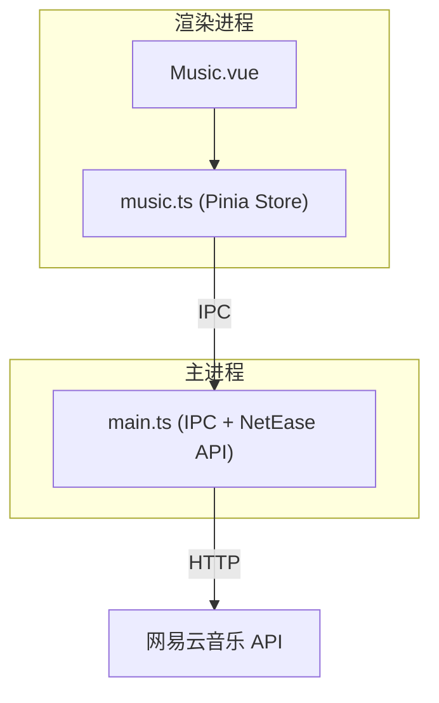
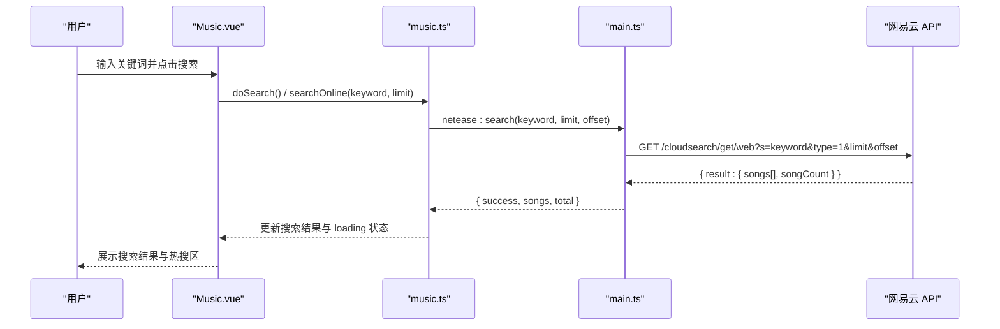
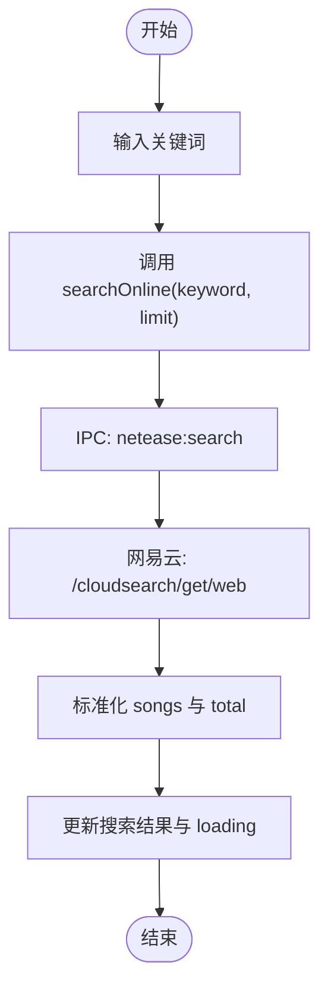
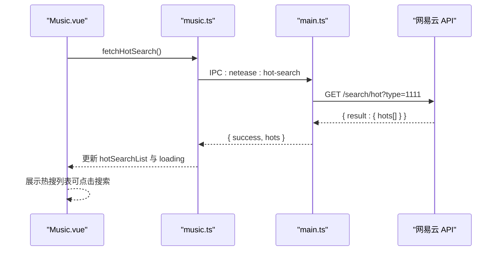
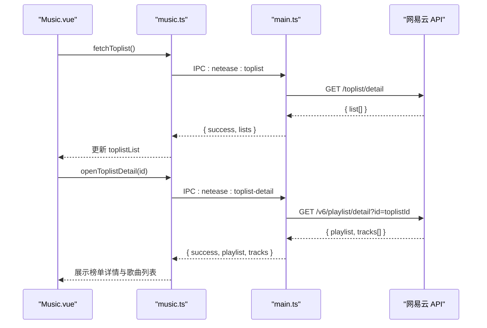
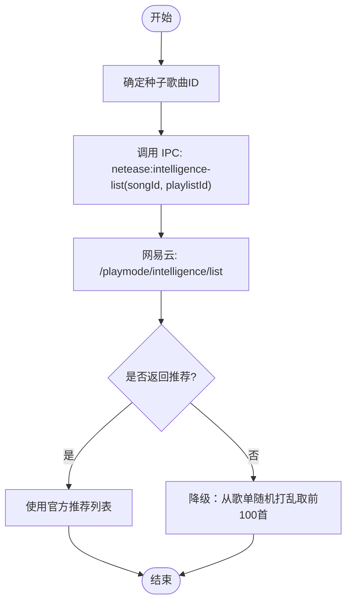

# 音乐搜索与发现

<cite>
**本文引用的文件**
- [src/renderer/src/stores/music.ts](file://src/renderer/src/stores/music.ts)
- [src/renderer/src/views/Music.vue](file://src/renderer/src/views/Music.vue)
- [src/main/main.ts](file://src/main/main.ts)
- [src/renderer/src/vite-env.d.ts](file://src/renderer/src/vite-env.d.ts)
</cite>

## 目录
1. [简介](#简介)
2. [项目结构](#项目结构)
3. [核心组件](#核心组件)
4. [架构总览](#架构总览)
5. [详细组件分析](#详细组件分析)
6. [依赖关系分析](#依赖关系分析)
7. [性能考虑](#性能考虑)
8. [故障排查指南](#故障排查指南)
9. [结论](#结论)
10. [附录：API 调用示例与响应结构](#附录api-调用示例与响应结构)

## 简介
本文件面向网易云音乐“搜索与发现”功能，覆盖以下能力：
- 歌曲搜索：关键词搜索、分页处理、结果过滤（前端）
- 热搜列表：实时获取、分类展示、用户交互（点击即搜）
- 排行榜系统：榜单列表、榜单详情、数据更新机制
- 心动模式推荐：基于当前播放/歌单的个性化推荐实现
- 搜索优化策略与缓存机制：请求节流、批量 URL 获取、错误重试、本地状态缓存
- API 调用示例与响应数据结构说明

## 项目结构
本项目采用 Electron + Vue 3 + Pinia 的架构：
- 渲染进程（Vue）负责 UI 与用户交互，通过 Pinia store 管理音乐状态
- 主进程（Electron）封装网易云 API 调用，提供 IPC 接口给渲染进程
- 关键模块：
  - 渲染层：Music.vue（页面）、music.ts（状态与业务逻辑）
  - 主进程：main.ts（IPC 路由与网易云 API 适配）
  - 类型声明：vite-env.d.ts（暴露给渲染进程的 IPC 方法签名）

图表来源
- [src/renderer/src/views/Music.vue:170-423](file://src/renderer/src/views/Music.vue#L170-L423)
- [src/renderer/src/stores/music.ts:433-800](file://src/renderer/src/stores/music.ts#L433-L800)
- [src/main/main.ts:1335-1800](file://src/main/main.ts#L1335-L1800)

章节来源
- [src/renderer/src/views/Music.vue:170-423](file://src/renderer/src/views/Music.vue#L170-L423)
- [src/renderer/src/stores/music.ts:433-800](file://src/renderer/src/stores/music.ts#L433-L800)
- [src/main/main.ts:1335-1800](file://src/main/main.ts#L1335-L1800)

## 核心组件
- 搜索与在线播放：支持关键词搜索、分页、在线播放与歌词加载
- 热搜榜：获取并展示实时热搜，点击可直接搜索
- 排行榜：获取榜单列表与详情，支持播放全部或加入队列
- 云盘：获取用户云盘歌曲，支持分页加载
- 登录与歌单：扫码/手机号/Cookie 登录，同步用户歌单与详情
- 评论：热门评论与全部评论，支持点赞
- 喜欢与收藏：批量检查喜欢状态、切换喜欢、拉取已喜欢列表
- 心动模式：基于官方智能推荐接口，失败时降级为随机打乱

章节来源
- [src/renderer/src/stores/music.ts:433-800](file://src/renderer/src/stores/music.ts#L433-L800)
- [src/main/main.ts:1335-1800](file://src/main/main.ts#L1335-L1800)
- [src/renderer/src/views/Music.vue:170-423](file://src/renderer/src/views/Music.vue#L170-L423)

## 架构总览
下图展示了从用户操作到数据返回的关键流程：

图表来源
- [src/renderer/src/views/Music.vue:736-744](file://src/renderer/src/views/Music.vue#L736-L744)
- [src/renderer/src/stores/music.ts:435-454](file://src/renderer/src/stores/music.ts#L435-L454)
- [src/main/main.ts:1335-1355](file://src/main/main.ts#L1335-L1355)

## 详细组件分析

### 歌曲搜索接口
- 功能要点
  - 关键词搜索：调用主进程 IPC 将关键词转发至网易云搜索接口
  - 分页处理：支持 limit 与 offset 参数，用于翻页
  - 结果过滤：前端根据搜索结果进行展示；可结合热搜快速筛选
  - 在线播放：获取歌曲 URL 后加入播放列表并立即播放
  - 歌词加载：在线曲目自动拉取歌词并解析时间轴

- 关键流程
  - 渲染层触发搜索 -> store 调用 IPC -> 主进程请求网易云 -> 返回标准化结果 -> 渲染层更新视图

图表来源
- [src/renderer/src/stores/music.ts:435-454](file://src/renderer/src/stores/music.ts#L435-L454)
- [src/main/main.ts:1335-1355](file://src/main/main.ts#L1335-L1355)

- 错误处理与健壮性
  - 网络异常：store 捕获异常并清空结果
  - URL 过期：播放错误时自动刷新在线歌曲 URL 并重试（最多两次）
  - 歌词缺失：无歌词时清空并重置索引

章节来源
- [src/renderer/src/stores/music.ts:102-138](file://src/renderer/src/stores/music.ts#L102-L138)
- [src/renderer/src/stores/music.ts:191-236](file://src/renderer/src/stores/music.ts#L191-L236)
- [src/renderer/src/stores/music.ts:435-454](file://src/renderer/src/stores/music.ts#L435-L454)
- [src/main/main.ts:1335-1355](file://src/main/main.ts#L1335-L1355)

### 热搜列表功能
- 功能要点
  - 实时热搜：调用主进程 IPC 获取热搜列表
  - 分类展示：按排名、关键词、热度分数与图标展示
  - 用户交互：点击热搜项直接执行搜索

- 关键流程
  - 渲染层点击刷新 -> store 调用 IPC -> 主进程请求热搜接口 -> 返回 hots -> 渲染层展示

图表来源
- [src/renderer/src/stores/music.ts:778-800](file://src/renderer/src/stores/music.ts#L778-L800)
- [src/main/main.ts:1724-1742](file://src/main/main.ts#L1724-L1742)
- [src/renderer/src/views/Music.vue:239-268](file://src/renderer/src/views/Music.vue#L239-L268)

章节来源
- [src/renderer/src/stores/music.ts:778-800](file://src/renderer/src/stores/music.ts#L778-L800)
- [src/main/main.ts:1724-1742](file://src/main/main.ts#L1724-L1742)
- [src/renderer/src/views/Music.vue:239-268](file://src/renderer/src/views/Music.vue#L239-L268)

### 排行榜系统
- 功能要点
  - 榜单列表：获取所有榜单，包含封面、名称、更新频率、前几首预览
  - 榜单详情：进入榜单查看完整歌曲列表
  - 数据更新：支持手动刷新，避免频繁请求

- 关键流程
  - 渲染层点击刷新 -> store 调用 IPC -> 主进程请求榜单列表/详情 -> 渲染层展示

图表来源
- [src/main/main.ts:1744-1814](file://src/main/main.ts#L1744-L1814)
- [src/renderer/src/views/Music.vue:339-423](file://src/renderer/src/views/Music.vue#L339-L423)

章节来源
- [src/main/main.ts:1744-1814](file://src/main/main.ts#L1744-L1814)
- [src/renderer/src/views/Music.vue:339-423](file://src/renderer/src/views/Music.vue#L339-L423)

### 心动模式推荐算法
- 功能要点
  - 基于官方智能推荐接口：传入种子歌曲与歌单 ID，获取推荐曲目
  - 降级策略：若官方接口不可用，则回退为从歌单中随机打乱选取若干首
  - 使用场景：在“我的歌单”或“喜欢”列表中启动心动模式

- 关键流程
  - 渲染层选择歌单并启动心动模式 -> store 确定种子歌曲 -> 调用 IPC -> 主进程请求智能推荐 -> 返回推荐列表 -> 渲染层展示

图表来源
- [src/main/main.ts:1981-2023](file://src/main/main.ts#L1981-L2023)
- [src/renderer/src/stores/music.ts:1233-1273](file://src/renderer/src/stores/music.ts#L1233-L1273)

章节来源
- [src/main/main.ts:1981-2023](file://src/main/main.ts#L1981-L2023)
- [src/renderer/src/stores/music.ts:1233-1273](file://src/renderer/src/stores/music.ts#L1233-L1273)

### 搜索优化策略与缓存机制
- 请求节流与分页
  - 搜索支持 limit 与 offset，便于分页加载
  - 热搜与排行榜支持手动刷新，避免频繁请求
- 批量 URL 获取
  - 播放歌单或排行榜时，按每批 20 首批量获取播放 URL，减少请求次数
- 错误重试与降级
  - 在线歌曲 URL 过期时自动刷新并重试（最多两次）
  - 心动模式优先使用官方推荐，失败时降级为随机打乱
- 本地状态缓存
  - 已喜欢歌曲 ID 集合缓存，提升判断效率
  - 登录态与用户信息缓存，减少重复校验

章节来源
- [src/renderer/src/stores/music.ts:707-776](file://src/renderer/src/stores/music.ts#L707-L776)
- [src/renderer/src/stores/music.ts:102-138](file://src/renderer/src/stores/music.ts#L102-L138)
- [src/renderer/src/stores/music.ts:1233-1273](file://src/renderer/src/stores/music.ts#L1233-L1273)

## 依赖关系分析
- 渲染层依赖
  - Music.vue 依赖 music.ts 提供的搜索、热搜、排行榜、云盘、评论、喜欢等能力
  - 通过 Pinia 状态管理统一维护播放列表、进度、歌词、搜索结果等
- 主进程依赖
  - main.ts 封装网易云 API 调用，提供 IPC 接口给渲染进程
  - 统一的请求辅助函数处理 Cookie、Referer、UA、IP 伪装等
- 外部依赖
  - 网易云音乐 API：搜索、热搜、排行榜、歌单、评论、云盘、智能推荐等

图表来源
- [src/renderer/src/views/Music.vue:170-423](file://src/renderer/src/views/Music.vue#L170-L423)
- [src/renderer/src/stores/music.ts:433-800](file://src/renderer/src/stores/music.ts#L433-L800)
- [src/main/main.ts:1335-1800](file://src/main/main.ts#L1335-L1800)

章节来源
- [src/renderer/src/views/Music.vue:170-423](file://src/renderer/src/views/Music.vue#L170-L423)
- [src/renderer/src/stores/music.ts:433-800](file://src/renderer/src/stores/music.ts#L433-L800)
- [src/main/main.ts:1335-1800](file://src/main/main.ts#L1335-L1800)

## 性能考虑
- 长列表分批渲染：云盘与播放队列支持加载更多，避免一次性渲染过多 DOM
- 批量 URL 获取：按批次 20 首获取播放地址，降低网络开销
- 错误重试：在线歌曲 URL 过期自动刷新并重试，提升播放成功率
- 缓存：已喜欢歌曲 ID 集合缓存，减少重复查询

[本节为通用性能建议，不直接分析具体文件]

## 故障排查指南
- 搜索无结果
  - 检查关键词是否为空
  - 确认网络连通性与网易云 API 可用性
  - 查看 store 中的 searchLoading 与 searchResults 状态
- 在线歌曲无法播放
  - 检查 URL 是否过期，触发自动刷新逻辑
  - 查看播放错误事件与重试计数
- 热搜/排行榜为空
  - 点击刷新按钮重新获取数据
  - 检查主进程 IPC 是否正确转发请求
- 评论加载失败
  - 检查评论接口参数与排序类型
  - 查看 commentsLoading 与 songComments 状态

章节来源
- [src/renderer/src/stores/music.ts:102-138](file://src/renderer/src/stores/music.ts#L102-L138)
- [src/renderer/src/stores/music.ts:191-236](file://src/renderer/src/stores/music.ts#L191-L236)
- [src/renderer/src/views/Music.vue:119-166](file://src/renderer/src/views/Music.vue#L119-L166)

## 结论
本项目实现了完整的网易云音乐“搜索与发现”能力，涵盖搜索、热搜、排行榜、心动模式推荐、云盘与评论等功能。通过主进程封装 API 与渲染层状态管理，提供了稳定且易用的用户体验。同时具备错误重试、批量请求、长列表分页等优化策略，确保在高并发与大列表场景下的流畅表现。

[本节为总结性内容，不直接分析具体文件]

## 附录：API 调用示例与响应结构

### 歌曲搜索
- 调用路径
  - 渲染层：music.ts -> IPC: netease:search
  - 主进程：main.ts -> 网易云: /cloudsearch/get/web
- 请求参数
  - keyword: 搜索关键词
  - limit: 每页数量（默认 30）
  - offset: 偏移量（用于分页）
- 响应结构
  - success: 布尔值
  - songs: 歌曲数组（id, name, artist, album, cover）
  - total: 总数量

章节来源
- [src/renderer/src/stores/music.ts:435-454](file://src/renderer/src/stores/music.ts#L435-L454)
- [src/main/main.ts:1335-1355](file://src/main/main.ts#L1335-L1355)
- [src/renderer/src/vite-env.d.ts:129-147](file://src/renderer/src/vite-env.d.ts#L129-L147)

### 热搜列表
- 调用路径
  - 渲染层：music.ts -> IPC: netease:hot-search
  - 主进程：main.ts -> 网易云: /search/hot
- 请求参数
  - type: 1111（热搜类型）
- 响应结构
  - success: 布尔值
  - hots: 热搜数组（rank, keyword, score, iconUrl）

章节来源
- [src/renderer/src/stores/music.ts:778-800](file://src/renderer/src/stores/music.ts#L778-L800)
- [src/main/main.ts:1724-1742](file://src/main/main.ts#L1724-L1742)
- [src/renderer/src/vite-env.d.ts:148-153](file://src/renderer/src/vite-env.d.ts#L148-L153)

### 排行榜列表与详情
- 调用路径
  - 渲染层：music.ts -> IPC: netease:toplist / netease:toplist-detail
  - 主进程：main.ts -> 网易云: /toplist/detail 与 /v6/playlist/detail
- 请求参数
  - 榜单列表：无额外参数
  - 榜单详情：id（榜单 ID）
- 响应结构
  - 列表：success, lists（id, name, cover, updateFrequency, description, playCount, topTracks）
  - 详情：success, playlist（榜单信息）, tracks（歌曲列表）

章节来源
- [src/main/main.ts:1744-1814](file://src/main/main.ts#L1744-L1814)
- [src/renderer/src/vite-env.d.ts:154-164](file://src/renderer/src/vite-env.d.ts#L154-L164)

### 心动模式推荐
- 调用路径
  - 渲染层：music.ts -> IPC: netease:intelligence-list
  - 主进程：main.ts -> 网易云: /playmode/intelligence/list
- 请求参数
  - songId: 种子歌曲 ID
  - playlistId: 歌单 ID
  - type: fromPlayOne
  - startMusicId: 起始歌曲 ID
  - count: 推荐数量（默认 1）
- 响应结构
  - success: 布尔值
  - songs: 推荐歌曲数组（id, name, artist, album, cover, duration, recommended）

章节来源
- [src/main/main.ts:1981-2023](file://src/main/main.ts#L1981-L2023)
- [src/renderer/src/stores/music.ts:1233-1273](file://src/renderer/src/stores/music.ts#L1233-L1273)

### 云盘歌曲列表
- 调用路径
  - 渲染层：music.ts -> IPC: netease:cloud-drive
  - 主进程：main.ts -> 网易云: /v1/cloud/get
- 请求参数
  - pageSize: 每页数量（默认 50）
  - pageNo: 页码（从 0 开始）
- 响应结构
  - success: 布尔值
  - songs: 云盘歌曲数组（id, name, artist, album, cover, duration, fileName, fileSize, addTime, level）
  - count: 总数

章节来源
- [src/main/main.ts:2044-2100](file://src/main/main.ts#L2044-L2100)

### 评论与点赞
- 调用路径
  - 渲染层：music.ts -> IPC: netease:comments / netease:comment-like
  - 主进程：main.ts -> 网易云: /v1/resource/comments/R_SO_4_{id} 与 /v1/comment/{like|unlike}
- 请求参数
  - 评论：id（歌曲 ID）, pageNo, pageSize, sortType（1=最新, 2=最热）
  - 点赞：songId, commentId, like（true/false）
- 响应结构
  - 评论：success, comments, hotComments, total
  - 点赞：success, liked

章节来源
- [src/main/main.ts:1676-1722](file://src/main/main.ts#L1676-L1722)
- [src/main/main.ts:2025-2042](file://src/main/main.ts#L2025-L2042)

### 在线播放与歌词
- 调用路径
  - 渲染层：music.ts -> IPC: netease:song-url / netease:lyric
  - 主进程：main.ts -> 网易云: /song/url/v1 或 /song/enhance/player/url 与 /song/lyric
- 请求参数
  - 播放 URL：ids（歌曲 ID 数组）, level（音质等级）
  - 歌词：id（歌曲 ID）
- 响应结构
  - 播放 URL：success, urls（id, url, br）
  - 歌词：success, lyric, tlyric

章节来源
- [src/main/main.ts:1357-1402](file://src/main/main.ts#L1357-L1402)
- [src/renderer/src/stores/music.ts:191-236](file://src/renderer/src/stores/music.ts#L191-L236)