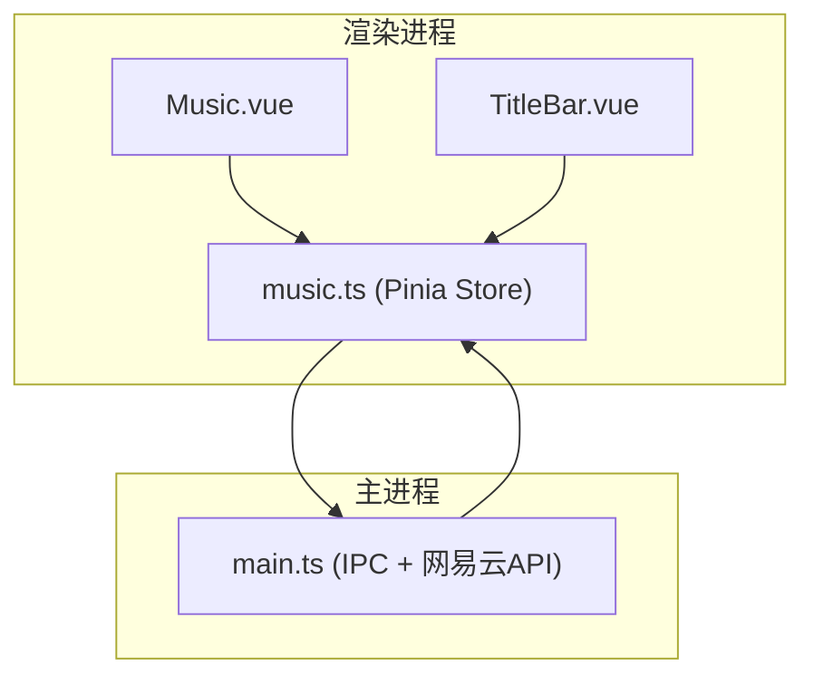
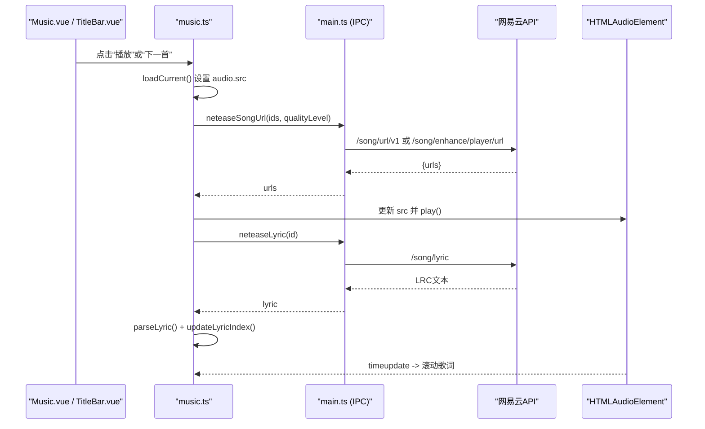
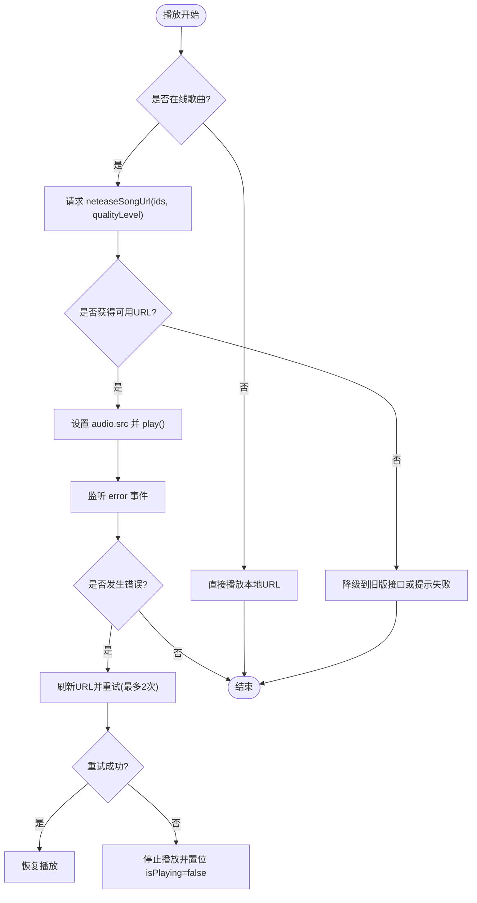
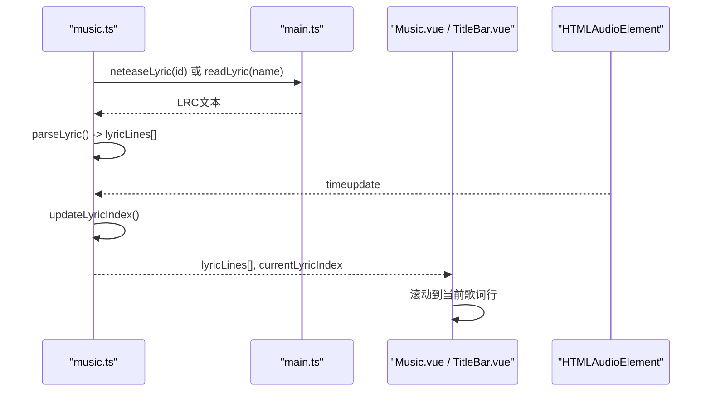
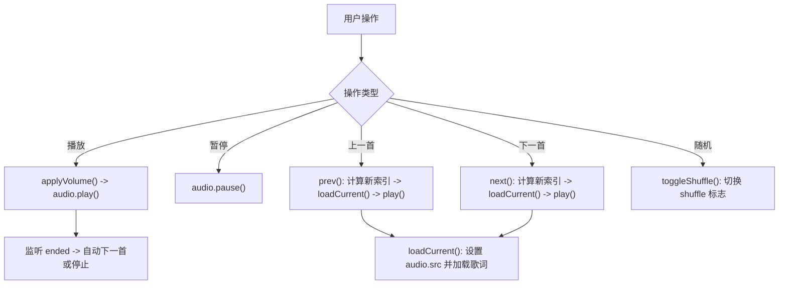
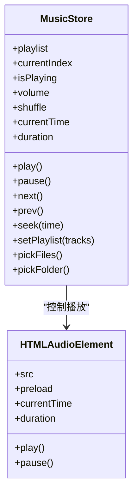
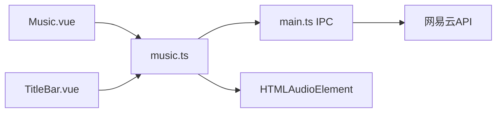

# 音乐播放控制

<cite>
**本文引用的文件**
- [src/renderer/src/stores/music.ts](file://src/renderer/src/stores/music.ts)
- [src/renderer/src/views/Music.vue](file://src/renderer/src/views/Music.vue)
- [src/main/main.ts](file://src/main/main.ts)
- [src/renderer/src/components/TitleBar.vue](file://src/renderer/src/components/TitleBar.vue)
</cite>

## 目录
1. [简介](#简介)
2. [项目结构](#项目结构)
3. [核心组件](#核心组件)
4. [架构总览](#架构总览)
5. [详细组件分析](#详细组件分析)
6. [依赖关系分析](#依赖关系分析)
7. [性能考量](#性能考量)
8. [故障排查指南](#故障排查指南)
9. [结论](#结论)
10. [附录：集成与示例](#附录：集成与示例)

## 简介
本文件面向网易云音乐播放控制功能的实现，覆盖以下关键能力：
- 歌曲URL获取接口：音质选择、链接有效期处理与备用源切换机制
- 歌词获取与展示：LRC格式解析、时间轴同步与滚动显示
- 播放状态管理：播放、暂停、上一首、下一首等控制逻辑
- 音频流处理：网络流播放、本地文件播放与缓冲机制
- 播放器组件集成指南与性能优化建议
- 完整的播放控制示例与错误处理方案

## 项目结构
本项目采用前后端分离的Electron架构：
- 渲染进程（Vue）：负责UI交互、播放状态、歌词解析与滚动、在线搜索与登录
- 主进程（Node）：封装网易云API调用、加密与鉴权、Cookie管理、二维码登录流程
- IPC通信：通过window.electronAPI在渲染进程与主进程之间传递数据

图表来源
- [src/renderer/src/views/Music.vue:1-800](file://src/renderer/src/views/Music.vue#L1-L800)
- [src/renderer/src/stores/music.ts:1-800](file://src/renderer/src/stores/music.ts#L1-L800)
- [src/main/main.ts:1357-1404](file://src/main/main.ts#L1357-L1404)

章节来源
- [src/renderer/src/views/Music.vue:1-800](file://src/renderer/src/views/Music.vue#L1-L800)
- [src/renderer/src/stores/music.ts:1-800](file://src/renderer/src/stores/music.ts#L1-L800)
- [src/main/main.ts:1357-1404](file://src/main/main.ts#L1357-L1404)

## 核心组件
- 播放状态与业务逻辑集中于 Pinia Store（music.ts），提供播放列表、播放控制、歌词加载、在线搜索、登录与歌单同步、喜欢与评论等功能。
- 视图层 Music.vue 负责用户交互（选择文件/文件夹、搜索、播放列表操作、歌词滚动、评论查看）。
- 顶部栏 TitleBar.vue 提供迷你播放器与歌词显示开关。
- 主进程 main.ts 暴露 IPC 接口，封装网易云API（歌曲URL、歌词、登录、歌单、排行榜等）。

章节来源
- [src/renderer/src/stores/music.ts:1-800](file://src/renderer/src/stores/music.ts#L1-L800)
- [src/renderer/src/views/Music.vue:1-800](file://src/renderer/src/views/Music.vue#L1-L800)
- [src/renderer/src/components/TitleBar.vue:100-299](file://src/renderer/src/components/TitleBar.vue#L100-L299)
- [src/main/main.ts:1357-1404](file://src/main/main.ts#L1357-L1404)

## 架构总览
下图展示了从用户操作到最终播放的完整链路，包括在线URL获取、歌词加载与播放控制。

图表来源
- [src/renderer/src/stores/music.ts:300-392](file://src/renderer/src/stores/music.ts#L300-L392)
- [src/renderer/src/stores/music.ts:191-252](file://src/renderer/src/stores/music.ts#L191-L252)
- [src/main/main.ts:1357-1404](file://src/main/main.ts#L1357-L1404)

## 详细组件分析

### 歌曲URL获取接口（音质选择、有效期处理、备用源切换）
- 音质选择
  - 渲染侧维护 qualityLevel（standard/higher/exhigh/lossless/hires），默认 exhigh，持久化存储。
  - 调用 IPC 接口 netease:song-url 时传入 level。
- 备用源切换
  - 主进程优先尝试新版 /song/url/v1；若返回空或失败，则降级到旧版 /song/enhance/player/url，并按音质等级映射 br 值。
- 链接有效期处理与自动重试
  - 渲染侧监听 audio.error 事件：当在线歌曲播放出错且未处于刷新中，最多重试两次，重新请求 URL 并替换播放列表中的地址后继续播放。
  - 播放失败路径同样支持刷新URL后重试。

图表来源
- [src/main/main.ts:1357-1388](file://src/main/main.ts#L1357-L1388)
- [src/renderer/src/stores/music.ts:102-138](file://src/renderer/src/stores/music.ts#L102-L138)
- [src/renderer/src/stores/music.ts:308-343](file://src/renderer/src/stores/music.ts#L308-L343)

章节来源
- [src/main/main.ts:1357-1388](file://src/main/main.ts#L1357-L1388)
- [src/renderer/src/stores/music.ts:102-138](file://src/renderer/src/stores/music.ts#L102-L138)
- [src/renderer/src/stores/music.ts:308-343](file://src/renderer/src/stores/music.ts#L308-L343)

### 歌词获取与展示（LRC解析、时间轴同步、滚动显示）
- 歌词来源
  - 在线曲目：通过 IPC netease:lyric 获取 LRC 文本。
  - 本地曲目：读取同目录 .lrc 文件。
- LRC解析
  - 使用正则匹配 [mm:ss(.ms)]text，转换为秒级时间戳并排序。
- 时间轴同步与滚动
  - 监听 audio.timeupdate，计算当前歌词索引 currentLyricIndex。
  - 视图层根据 active 行滚动到可视区域中心。
- 顶栏歌词显示
  - TitleBar 提供歌词显示开关，可全局隐藏/显示歌词。

图表来源
- [src/renderer/src/stores/music.ts:171-252](file://src/renderer/src/stores/music.ts#L171-L252)
- [src/main/main.ts:1390-1402](file://src/main/main.ts#L1390-L1402)
- [src/renderer/src/views/Music.vue:99-117](file://src/renderer/src/views/Music.vue#L99-L117)
- [src/renderer/src/components/TitleBar.vue:100-121](file://src/renderer/src/components/TitleBar.vue#L100-L121)

章节来源
- [src/renderer/src/stores/music.ts:171-252](file://src/renderer/src/stores/music.ts#L171-L252)
- [src/main/main.ts:1390-1402](file://src/main/main.ts#L1390-L1402)
- [src/renderer/src/views/Music.vue:99-117](file://src/renderer/src/views/Music.vue#L99-L117)
- [src/renderer/src/components/TitleBar.vue:100-121](file://src/renderer/src/components/TitleBar.vue#L100-L121)

### 播放状态管理（播放、暂停、上一首、下一首、随机播放）
- 状态字段
  - playlist、currentIndex、isPlaying、volume、shuffle、currentTime、duration。
- 控制逻辑
  - play/pause/toggle：基于 HTMLAudioElement 控制播放状态。
  - next/prev：顺序或随机模式切换，循环边界处理。
  - seek：跳转到指定时间。
  - 自动续播：ended 事件触发下一首或停止。
- 播放列表管理
  - setPlaylist：清理旧 blob URL，重置索引并加载当前曲目。
  - removeTrack/clearPlaylist：安全释放资源并重置状态。

图表来源
- [src/renderer/src/stores/music.ts:300-397](file://src/renderer/src/stores/music.ts#L300-L397)
- [src/renderer/src/stores/music.ts:93-100](file://src/renderer/src/stores/music.ts#L93-L100)

章节来源
- [src/renderer/src/stores/music.ts:93-100](file://src/renderer/src/stores/music.ts#L93-L100)
- [src/renderer/src/stores/music.ts:300-397](file://src/renderer/src/stores/music.ts#L300-L397)

### 音频流处理（网络流播放、本地文件播放、缓冲机制）
- 网络流播放
  - 通过 IPC 获取在线URL，设置 audio.src 为远程地址，浏览器原生缓冲与播放。
- 本地文件播放
  - 支持多选文件与文件夹扫描，本地文件通过 file:// 或 blob URL 播放。
  - 批量添加时注意释放旧 blob URL，避免内存泄漏。
- 缓冲机制
  - 使用 HTMLAudioElement 的预加载策略（metadata），由浏览器内核负责缓冲。
  - 进度条拖动时防止被 currentTime 覆盖，确保交互流畅。

图表来源
- [src/renderer/src/stores/music.ts:32-71](file://src/renderer/src/stores/music.ts#L32-L71)
- [src/renderer/src/stores/music.ts:258-306](file://src/renderer/src/stores/music.ts#L258-L306)

章节来源
- [src/renderer/src/stores/music.ts:258-306](file://src/renderer/src/stores/music.ts#L258-L306)
- [src/renderer/src/stores/music.ts:32-71](file://src/renderer/src/stores/music.ts#L32-L71)

### 网易云在线功能（搜索、歌单、云盘、排行榜、喜欢与评论）
- 搜索与播放
  - searchOnline：调用 IPC neteaseSearch，返回歌曲列表。
  - playOnlineSong/addOnlineSong：批量获取URL并加入队列或直接播放。
- 歌单与云盘
  - fetchUserPlaylists/fetchPlaylistDetail：拉取用户歌单与详情。
  - fetchCloudDrive：分页拉取云盘歌曲，逐页刷新以提升体验。
- 排行榜
  - fetchToplist/fetchToplistDetail：获取榜单与详情。
- 喜欢与评论
  - toggleLikeSong/isSongLiked：乐观更新+回滚机制。
  - fetchSongComments/toggleCommentLike：评论列表与点赞。

章节来源
- [src/renderer/src/stores/music.ts:433-800](file://src/renderer/src/stores/music.ts#L433-L800)
- [src/renderer/src/stores/music.ts:801-1429](file://src/renderer/src/stores/music.ts#L801-L1429)
- [src/renderer/src/views/Music.vue:187-500](file://src/renderer/src/views/Music.vue#L187-L500)

## 依赖关系分析
- 渲染进程依赖
  - Vue 组件依赖 Pinia Store 提供的响应式状态与方法。
  - 通过 window.electronAPI 与主进程通信。
- 主进程依赖
  - 封装网易云API，统一加密与鉴权，处理Cookie与二维码登录。
- 外部依赖
  - 浏览器原生 <audio> 元素进行媒体播放与缓冲。
  - Element Plus 用于UI组件。

图表来源
- [src/renderer/src/views/Music.vue:1-800](file://src/renderer/src/views/Music.vue#L1-L800)
- [src/renderer/src/stores/music.ts:1-800](file://src/renderer/src/stores/music.ts#L1-L800)
- [src/main/main.ts:1357-1404](file://src/main/main.ts#L1357-L1404)

章节来源
- [src/renderer/src/views/Music.vue:1-800](file://src/renderer/src/views/Music.vue#L1-L800)
- [src/renderer/src/stores/music.ts:1-800](file://src/renderer/src/stores/music.ts#L1-L800)
- [src/main/main.ts:1357-1404](file://src/main/main.ts#L1357-L1404)

## 性能考量
- 长列表渲染优化
  - 云盘与播放队列采用分批渲染（VISIBLE_STEP=60），减少一次性DOM创建导致的卡顿。
- 批量URL获取
  - 歌单/排行榜/云盘播放时按每批20首请求URL，降低单次请求压力。
- 资源释放
  - 切换播放列表或移除曲目时释放blob URL，避免内存泄漏。
- 交互防抖
  - 进度条拖动期间阻止被 currentTime 覆盖，提升拖拽体验。
- 预加载策略
  - 使用 metadata 预加载，缩短首次交互延迟。

章节来源
- [src/renderer/src/views/Music.vue:686-694](file://src/renderer/src/views/Music.vue#L686-L694)
- [src/renderer/src/stores/music.ts:707-748](file://src/renderer/src/stores/music.ts#L707-L748)
- [src/renderer/src/stores/music.ts:254-263](file://src/renderer/src/stores/music.ts#L254-L263)
- [src/renderer/src/stores/music.ts:704-719](file://src/renderer/src/stores/music.ts#L704-L719)
- [src/renderer/src/stores/music.ts:32-35](file://src/renderer/src/stores/music.ts#L32-L35)

## 故障排查指南
- 在线歌曲播放失败
  - 现象：error 事件触发，isPlaying 置 false。
  - 处理：自动刷新URL并重试（最多2次），仍失败则停止播放。
  - 参考位置：[src/renderer/src/stores/music.ts:102-138](file://src/renderer/src/stores/music.ts#L102-L138)、[src/renderer/src/stores/music.ts:308-343](file://src/renderer/src/stores/music.ts#L308-L343)
- 歌词不显示
  - 在线歌曲：检查 neteaseLyric 返回是否包含 lyric。
  - 本地歌曲：确认同目录存在 .lrc 文件且名称匹配。
  - 参考位置：[src/renderer/src/stores/music.ts:191-236](file://src/renderer/src/stores/music.ts#L191-L236)
- 进度条无法调节
  - 原因：拖动过程中被 timeupdate 覆盖。
  - 解决：拖动期间设置标记位，结束后再同步。
  - 参考位置：[src/renderer/src/views/Music.vue:704-719](file://src/renderer/src/views/Music.vue#L704-L719)
- 播放列表过长导致卡顿
  - 解决：启用分批渲染（加载更多按钮）。
  - 参考位置：[src/renderer/src/views/Music.vue:686-694](file://src/renderer/src/views/Music.vue#L686-L694)

章节来源
- [src/renderer/src/stores/music.ts:102-138](file://src/renderer/src/stores/music.ts#L102-L138)
- [src/renderer/src/stores/music.ts:191-236](file://src/renderer/src/stores/music.ts#L191-L236)
- [src/renderer/src/views/Music.vue:704-719](file://src/renderer/src/views/Music.vue#L704-L719)
- [src/renderer/src/views/Music.vue:686-694](file://src/renderer/src/views/Music.vue#L686-L694)

## 结论
该播放控制系统以 Pinia Store 为核心，结合 Electron IPC 与网易云API，实现了在线与本地混合播放、歌词同步、播放状态管理与丰富的扩展功能（搜索、歌单、云盘、排行榜、喜欢与评论）。通过备用源切换、自动重试与分批渲染等机制，保证了播放稳定性与界面流畅性。

## 附录：集成与示例

### 集成指南
- 在页面中使用 Pinia Store 方法
  - 播放控制：play/pause/toggle/next/prev/seek
  - 列表管理：pickFiles/pickFolder/setPlaylist/removeTrack/clearPlaylist
  - 在线功能：searchOnline/playOnlineSong/addOnlineSong
  - 歌词显示：toggleLyrics
- 顶栏集成
  - 使用 TitleBar 的迷你播放器与歌词显示开关，绑定 music.showLyrics 与 music.playlist。

章节来源
- [src/renderer/src/stores/music.ts:1316-1429](file://src/renderer/src/stores/music.ts#L1316-L1429)
- [src/renderer/src/components/TitleBar.vue:100-140](file://src/renderer/src/components/TitleBar.vue#L100-L140)

### 播放控制示例
- 播放在线歌曲
  - 步骤：搜索 -> 选择歌曲 -> 调用 playOnlineSong -> 自动获取URL并播放
  - 参考位置：[src/renderer/src/stores/music.ts:456-483](file://src/renderer/src/stores/music.ts#L456-L483)
- 播放整个歌单
  - 步骤：fetchPlaylistDetail -> playPlaylist（批量获取URL，替换列表并播放）
  - 参考位置：[src/renderer/src/stores/music.ts:707-748](file://src/renderer/src/stores/music.ts#L707-L748)
- 本地文件播放
  - 步骤：pickFiles/pickFolder -> setPlaylist -> loadCurrent -> play
  - 参考位置：[src/renderer/src/stores/music.ts:265-306](file://src/renderer/src/stores/music.ts#L265-L306)

### 错误处理方案
- 在线URL过期或不可用
  - 自动刷新URL并重试（最多2次），失败则停止播放
  - 参考位置：[src/renderer/src/stores/music.ts:102-138](file://src/renderer/src/stores/music.ts#L102-L138)
- 歌词加载失败
  - 清空歌词并重置索引，保证界面一致性
  - 参考位置：[src/renderer/src/stores/music.ts:191-236](file://src/renderer/src/stores/music.ts#L191-L236)
- 网络异常或接口不可用
  - 捕获异常并返回空结果，UI显示空状态或提示
  - 参考位置：[src/main/main.ts:1357-1404](file://src/main/main.ts#L1357-L1404)