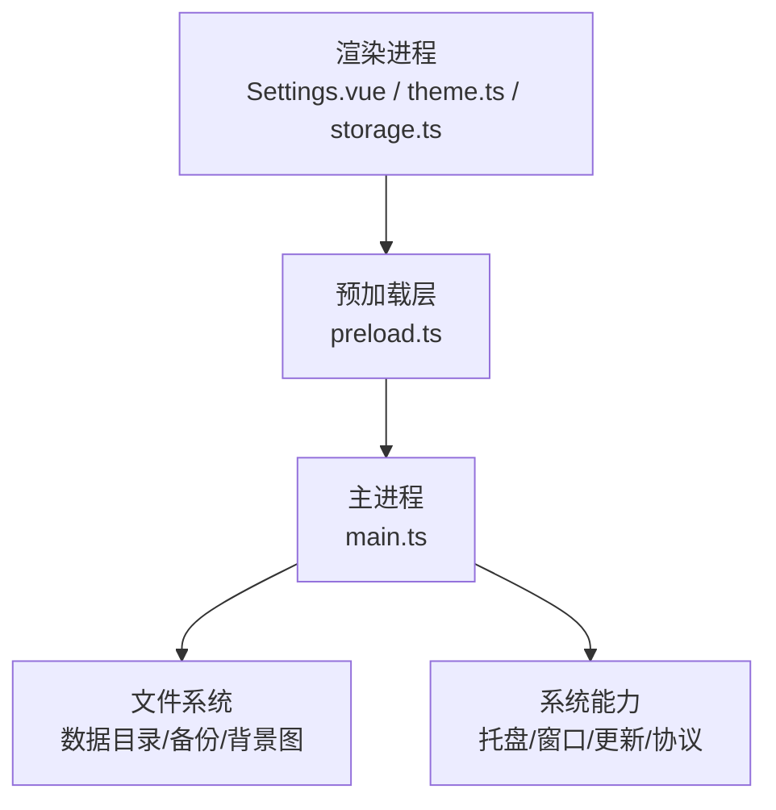
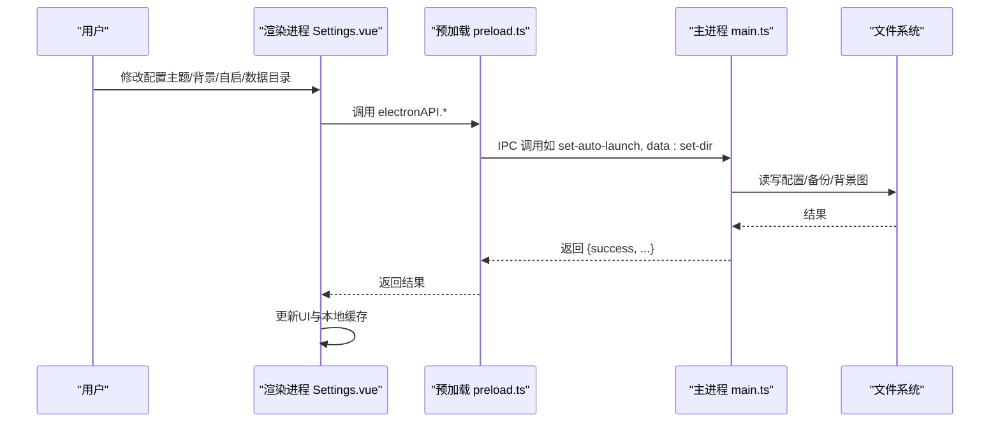
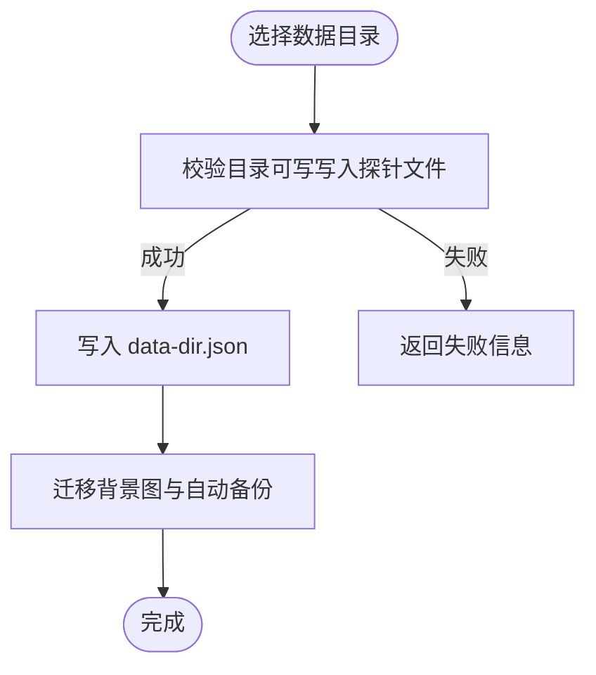
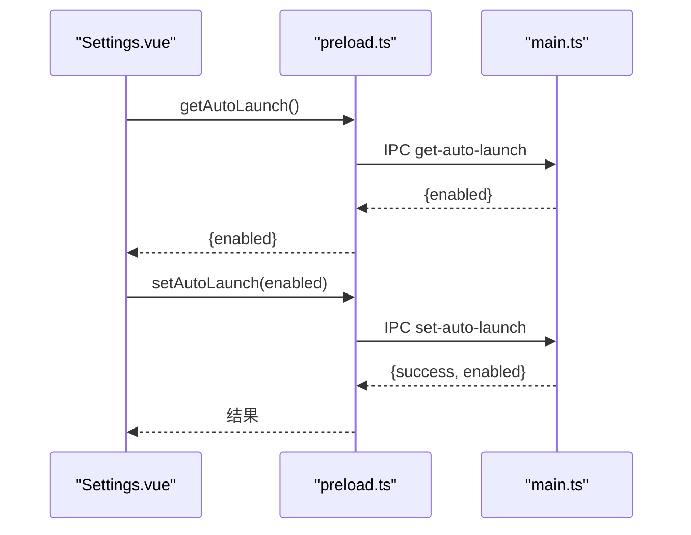
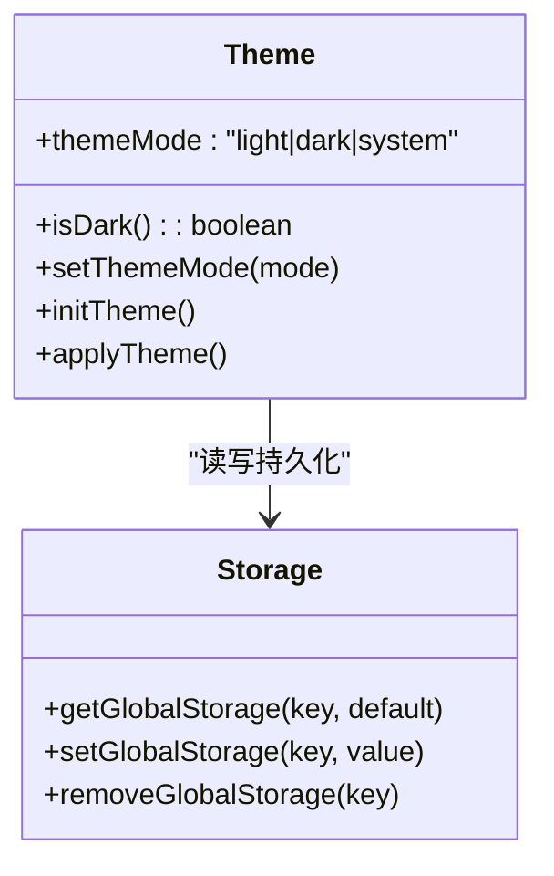
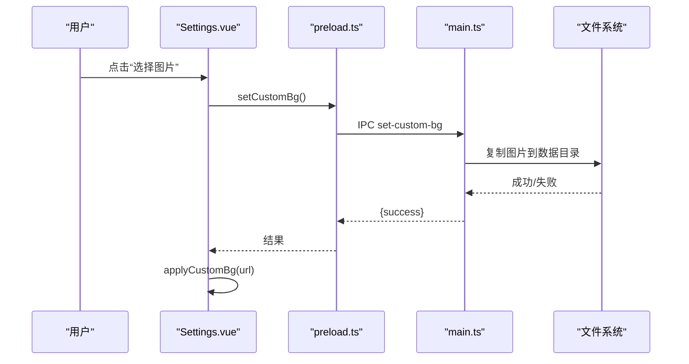
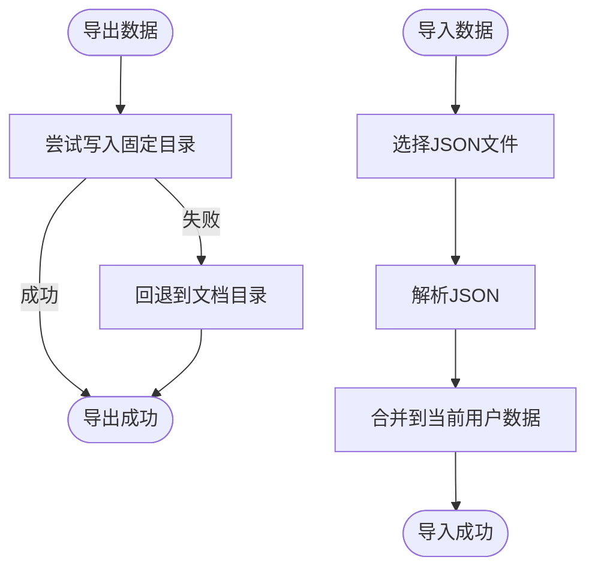
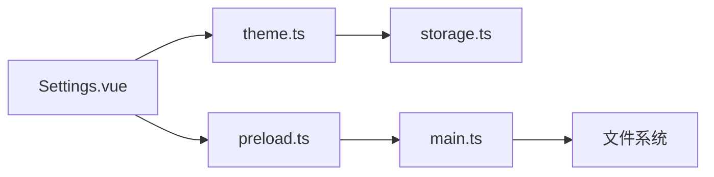

# 配置接口

<cite>
**本文引用的文件**
- [src/main/main.ts](file://src/main/main.ts)
- [src/preload/preload.ts](file://src/preload/preload.ts)
- [src/renderer/src/views/Settings.vue](file://src/renderer/src/views/Settings.vue)
- [src/renderer/src/utils/storage.ts](file://src/renderer/src/utils/storage.ts)
- [src/renderer/src/utils/theme.ts](file://src/renderer/src/utils/theme.ts)
- [package.json](file://package.json)
</cite>

## 目录
1. [简介](#简介)
2. [项目结构](#项目结构)
3. [核心组件](#核心组件)
4. [架构总览](#架构总览)
5. [详细组件分析](#详细组件分析)
6. [依赖关系分析](#依赖关系分析)
7. [性能与可靠性](#性能与可靠性)
8. [故障排查指南](#故障排查指南)
9. [结论](#结论)
10. [附录：配置项清单与默认值](#附录配置项清单与默认值)

## 简介
本文件面向“考研助手”应用的配置接口，覆盖以下能力：
- 数据存储目录设置（含迁移、打开、同步）
- 开机自启动配置（查询与设置）
- 主题与外观（浅色/深色/跟随系统、液态玻璃、护眼模式）
- 自定义背景（选择、恢复、协议访问）
- 动态配置更新机制与最佳实践
- 配置验证规则与错误处理
- 配置备份与恢复（导出/导入、自动备份）

该文档既适合开发者理解实现细节，也适合用户了解如何正确配置与维护应用。

## 项目结构
应用采用 Electron + Vue 3 的架构：
- 主进程（main.ts）负责文件系统、协议注册、IPC 服务、自动更新等
- 预加载脚本（preload.ts）暴露安全的 API 给渲染进程
- 渲染进程（Settings.vue、theme.ts、storage.ts）提供 UI 与本地存储管理

图表来源
- [src/main/main.ts:191-210](file://src/main/main.ts#L191-L210)
- [src/preload/preload.ts:3-97](file://src/preload/preload.ts#L3-L97)
- [src/renderer/src/views/Settings.vue:334-846](file://src/renderer/src/views/Settings.vue#L334-L846)

章节来源
- [src/main/main.ts:191-210](file://src/main/main.ts#L191-L210)
- [src/preload/preload.ts:3-97](file://src/preload/preload.ts#L3-L97)
- [src/renderer/src/views/Settings.vue:334-846](file://src/renderer/src/views/Settings.vue#L334-L846)

## 核心组件
- 数据存储目录
  - 默认路径：用户文档下的“11408kaoyan-helper”
  - 可自定义并持久化到 userData/data-dir.json
  - 支持打开目录、迁移旧版背景与自动备份
- 开机自启动
  - 通过系统登录项开关控制
  - 提供查询与设置接口
- 主题与外观
  - 主题模式：light/dark/system，持久化到 localStorage
  - 液态玻璃、护眼模式：持久化到 localStorage
- 自定义背景
  - 图片复制到数据目录固定文件，通过 kaoyan-bg:// 协议提供
  - 支持选择、恢复、状态查询
- 备份与恢复
  - 导出：JSON 文件固定路径或回退到文档目录
  - 导入：选择 JSON 文件并合并到当前用户数据
  - 自动备份：定期将全量数据写入 auto-backup.json

章节来源
- [src/main/main.ts:21-62](file://src/main/main.ts#L21-L62)
- [src/main/main.ts:2600-2655](file://src/main/main.ts#L2600-L2655)
- [src/main/main.ts:2726-2777](file://src/main/main.ts#L2726-L2777)
- [src/renderer/src/utils/storage.ts:296-323](file://src/renderer/src/utils/storage.ts#L296-L323)
- [src/renderer/src/utils/theme.ts:1-144](file://src/renderer/src/utils/theme.ts#L1-L144)

## 架构总览
配置相关的关键交互流程如下：

图表来源
- [src/preload/preload.ts:3-97](file://src/preload/preload.ts#L3-L97)
- [src/main/main.ts:2600-2777](file://src/main/main.ts#L2600-L2777)
- [src/renderer/src/views/Settings.vue:502-584](file://src/renderer/src/views/Settings.vue#L502-L584)

## 详细组件分析

### 数据存储目录配置
- 默认数据目录：用户文档下的“11408kaoyan-helper”，便于迁移且不在系统区
- 自定义目录：通过对话框选择，写入 userData/data-dir.json，并在内存中缓存
- 迁移：首次启动将旧版背景图与自动备份迁移至新数据目录
- 打开目录：在资源管理器中打开当前数据目录
- 同步备份：渲染进程定期推送全量数据快照，主进程写入 auto-backup.json

图表来源
- [src/main/main.ts:2600-2633](file://src/main/main.ts#L2600-L2633)
- [src/main/main.ts:54-81](file://src/main/main.ts#L54-L81)

章节来源
- [src/main/main.ts:21-62](file://src/main/main.ts#L21-L62)
- [src/main/main.ts:2600-2655](file://src/main/main.ts#L2600-L2655)

### 开机自启动配置
- 查询：读取系统登录项 openAtLogin
- 设置：调用系统接口设置 openAtLogin 与执行路径
- 前端：Settings.vue 提供开关，调用 preload 暴露的 API

图表来源
- [src/preload/preload.ts:6-7](file://src/preload/preload.ts#L6-L7)
- [src/main/main.ts:2726-2739](file://src/main/main.ts#L2726-L2739)
- [src/renderer/src/views/Settings.vue:556-584](file://src/renderer/src/views/Settings.vue#L556-L584)

章节来源
- [src/main/main.ts:2726-2739](file://src/main/main.ts#L2726-L2739)
- [src/preload/preload.ts:6-7](file://src/preload/preload.ts#L6-L7)
- [src/renderer/src/views/Settings.vue:556-584](file://src/renderer/src/views/Settings.vue#L556-L584)

### 主题与外观配置
- 主题模式：light/dark/system，持久化到 localStorage 键 kaoyan_theme
- 液态玻璃：布尔开关，持久化到 kaoyan_liquid_glass
- 护眼模式：布尔开关，持久化到 kaoyan_eyecare
- 初始化：应用启动时从存储加载并应用；监听系统主题变化

图表来源
- [src/renderer/src/utils/theme.ts:1-144](file://src/renderer/src/utils/theme.ts#L1-L144)
- [src/renderer/src/utils/storage.ts:237-279](file://src/renderer/src/utils/storage.ts#L237-L279)

章节来源
- [src/renderer/src/utils/theme.ts:1-144](file://src/renderer/src/utils/theme.ts#L1-L144)
- [src/renderer/src/utils/storage.ts:237-279](file://src/renderer/src/utils/storage.ts#L237-L279)

### 自定义背景配置
- 选择图片：仅允许 jpg/jpeg/png/webp，复制到数据目录 custom-bg.jpg
- 协议访问：kaoyan-bg://background/custom-bg.jpg 提供静态资源
- 恢复默认：删除 custom-bg.jpg
- 状态查询：检测文件是否存在以判断是否启用

图表来源
- [src/main/main.ts:2741-2777](file://src/main/main.ts#L2741-L2777)
- [src/preload/preload.ts:8-10](file://src/preload/preload.ts#L8-L10)
- [src/renderer/src/views/Settings.vue:502-554](file://src/renderer/src/views/Settings.vue#L502-L554)
- [src/renderer/src/utils/theme.ts:109-144](file://src/renderer/src/utils/theme.ts#L109-L144)

章节来源
- [src/main/main.ts:2741-2777](file://src/main/main.ts#L2741-L2777)
- [src/renderer/src/utils/theme.ts:109-144](file://src/renderer/src/utils/theme.ts#L109-L144)
- [src/renderer/src/views/Settings.vue:502-554](file://src/renderer/src/views/Settings.vue#L502-L554)

### 备份与恢复
- 导出：优先写入固定路径 D:\下载\文档\11408kaoyan-helper，失败回退到文档目录
- 导入：选择 JSON 文件，解析后合并到当前用户数据
- 自动备份：渲染进程定期推送全量数据，主进程写入 auto-backup.json

图表来源
- [src/main/main.ts:2687-2724](file://src/main/main.ts#L2687-L2724)
- [src/renderer/src/utils/storage.ts:296-323](file://src/renderer/src/utils/storage.ts#L296-L323)

章节来源
- [src/main/main.ts:2687-2724](file://src/main/main.ts#L2687-L2724)
- [src/renderer/src/utils/storage.ts:296-323](file://src/renderer/src/utils/storage.ts#L296-L323)

### 动态配置更新机制与最佳实践
- 主题/外观：通过 localStorage 实时持久化，页面切换即时生效
- 背景图：选择后立即应用 URL，并追加时间戳避免缓存
- 数据目录：变更时迁移已有资源并刷新缓存
- 最佳实践
  - 所有用户偏好均通过统一存储层（storage.ts）读写，保证一致性
  - 对关键操作（如切换主题）添加过渡动画提升体验
  - 对外部资源（背景图）使用协议访问，避免跨域问题

章节来源
- [src/renderer/src/utils/theme.ts:25-58](file://src/renderer/src/utils/theme.ts#L25-L58)
- [src/renderer/src/views/Settings.vue:384-405](file://src/renderer/src/views/Settings.vue#L384-L405)
- [src/renderer/src/views/Settings.vue:517-554](file://src/renderer/src/views/Settings.vue#L517-L554)

### 配置验证规则与错误处理
- 数据目录
  - 选择后写入探针文件确认可写，失败返回错误信息
  - 迁移失败不影响启动，静默降级
- 背景图
  - 仅接受指定扩展名；复制失败返回失败
  - 协议访问不存在文件返回 404
- 自启动
  - 设置失败时前端回滚状态并提示重试
- 存储层
  - localStorage 容量不足时清理非关键数据并重试
  - 数据版本化迁移，异常记录日志

章节来源
- [src/main/main.ts:2600-2633](file://src/main/main.ts#L2600-L2633)
- [src/main/main.ts:2741-2777](file://src/main/main.ts#L2741-L2777)
- [src/renderer/src/utils/storage.ts:50-109](file://src/renderer/src/utils/storage.ts#L50-L109)
- [src/renderer/src/views/Settings.vue:570-584](file://src/renderer/src/views/Settings.vue#L570-L584)

## 依赖关系分析
- 渲染进程依赖预加载层暴露的 API，避免直接访问 Node/Electron 能力
- 主进程集中处理文件系统、协议、系统能力，确保安全性与稳定性
- 主题与存储解耦，主题模块通过存储模块读写配置

图表来源
- [src/renderer/src/views/Settings.vue:334-846](file://src/renderer/src/views/Settings.vue#L334-L846)
- [src/renderer/src/utils/theme.ts:1-144](file://src/renderer/src/utils/theme.ts#L1-L144)
- [src/renderer/src/utils/storage.ts:1-188](file://src/renderer/src/utils/storage.ts#L1-L188)
- [src/preload/preload.ts:3-97](file://src/preload/preload.ts#L3-L97)
- [src/main/main.ts:191-210](file://src/main/main.ts#L191-L210)

章节来源
- [src/renderer/src/views/Settings.vue:334-846](file://src/renderer/src/views/Settings.vue#L334-L846)
- [src/renderer/src/utils/theme.ts:1-144](file://src/renderer/src/utils/theme.ts#L1-L144)
- [src/renderer/src/utils/storage.ts:1-188](file://src/renderer/src/utils/storage.ts#L1-L188)
- [src/preload/preload.ts:3-97](file://src/preload/preload.ts#L3-L97)
- [src/main/main.ts:191-210](file://src/main/main.ts#L191-L210)

## 性能与可靠性
- 大文件流式读取：音乐与资料协议使用 Range 请求与流式响应，降低内存占用
- 资源访问优化：pdf.js 静态资源通过回环 HTTP 服务与协议双通道保障稳定加载
- 存储层健壮性：localStorage 容量不足时自动清理历史数据，避免写入失败
- 启动迁移：旧版数据自动迁移到新目录，减少用户操作成本

章节来源
- [src/main/main.ts:406-615](file://src/main/main.ts#L406-L615)
- [src/main/main.ts:212-276](file://src/main/main.ts#L212-L276)
- [src/renderer/src/utils/storage.ts:93-109](file://src/renderer/src/utils/storage.ts#L93-L109)

## 故障排查指南
- 无法选择数据目录
  - 检查目标盘符权限与磁盘空间
  - 查看是否成功写入探针文件
- 自定义背景不生效
  - 确认图片格式与大小
  - 检查 kaoyan-bg:// 协议是否能获取到文件
- 开机自启动无效
  - 检查系统安全软件拦截
  - 重新设置并重启验证
- 数据导出失败
  - 检查固定目录是否存在及可写
  - 观察是否回退到文档目录
- 主题切换闪烁
  - 正常现象，已添加过渡动画；若异常请检查 CSS 类是否正确应用

章节来源
- [src/main/main.ts:2600-2633](file://src/main/main.ts#L2600-L2633)
- [src/main/main.ts:2741-2777](file://src/main/main.ts#L2741-L2777)
- [src/main/main.ts:2687-2724](file://src/main/main.ts#L2687-L2724)
- [src/renderer/src/views/Settings.vue:384-405](file://src/renderer/src/views/Settings.vue#L384-L405)

## 结论
本配置接口围绕数据安全、用户体验与可维护性设计：
- 数据目录可自定义并具备迁移与备份能力
- 开机自启动与主题/外观配置简洁直观
- 自定义背景通过协议访问，稳定可靠
- 备份与恢复提供多路径策略，确保数据不丢失
- 动态配置更新机制完善，错误处理健壮

建议在生产环境中定期导出备份，并关注数据目录权限与磁盘空间。

## 附录：配置项清单与默认值
- 数据存储目录
  - 默认：用户文档/11408kaoyan-helper
  - 配置文件：userData/data-dir.json
  - 自动备份：auto-backup.json（数据目录内）
- 开机自启动
  - 默认：关闭
  - 配置位置：系统登录项
- 主题模式
  - 可选：light/dark/system
  - 默认：light
  - 存储键：kaoyan_theme
- 液态玻璃
  - 可选：开/关
  - 默认：关
  - 存储键：kaoyan_liquid_glass
- 护眼模式
  - 可选：开/关
  - 默认：关
  - 存储键：kaoyan_eyecare
- 自定义背景
  - 默认：无
  - 文件：数据目录/custom-bg.jpg
  - 协议：kaoyan-bg://background/custom-bg.jpg

章节来源
- [src/main/main.ts:21-62](file://src/main/main.ts#L21-L62)
- [src/main/main.ts:2600-2655](file://src/main/main.ts#L2600-L2655)
- [src/main/main.ts:2726-2777](file://src/main/main.ts#L2726-L2777)
- [src/renderer/src/utils/theme.ts:1-144](file://src/renderer/src/utils/theme.ts#L1-L144)
- [package.json:45-80](file://package.json#L45-L80)