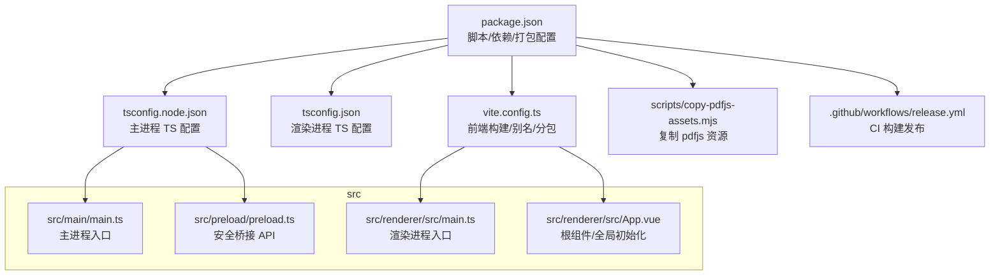
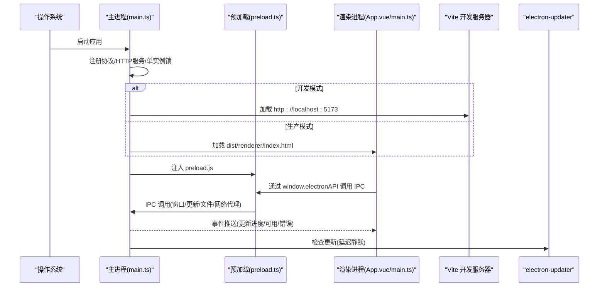
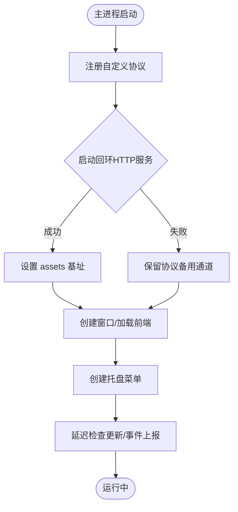
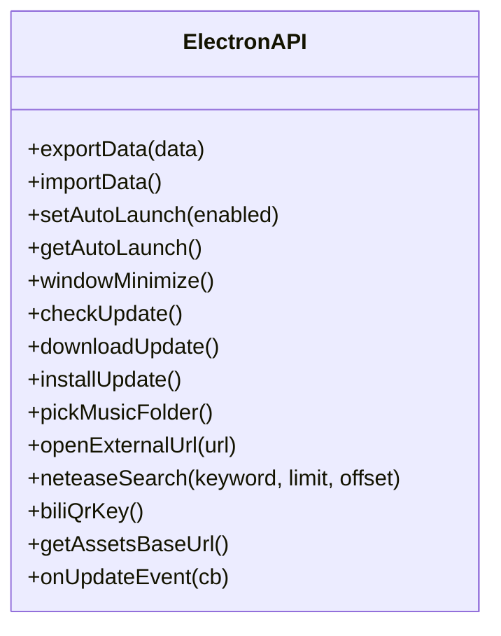
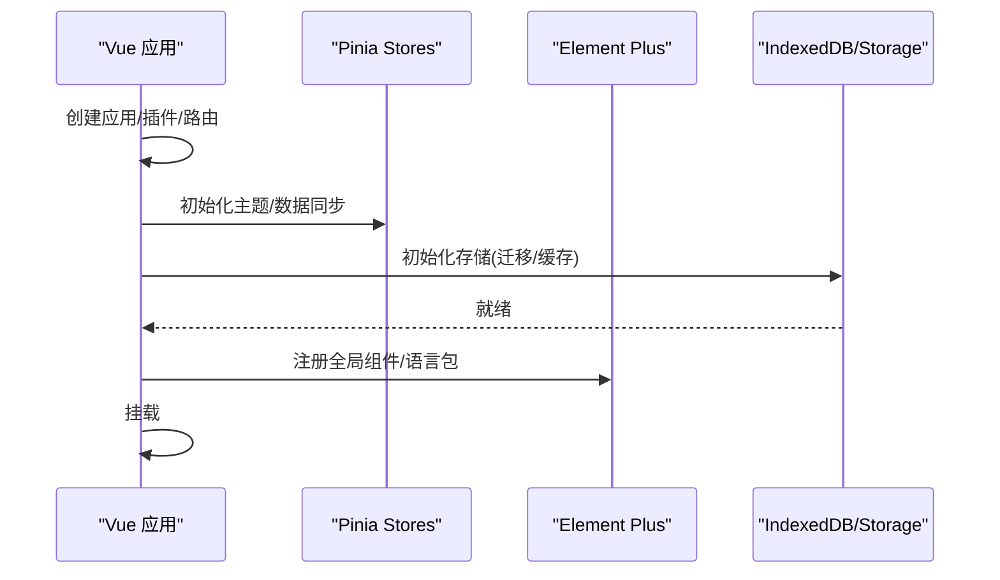
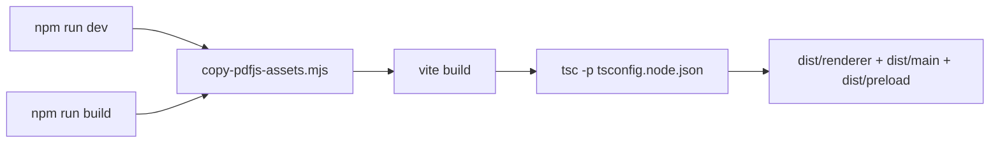
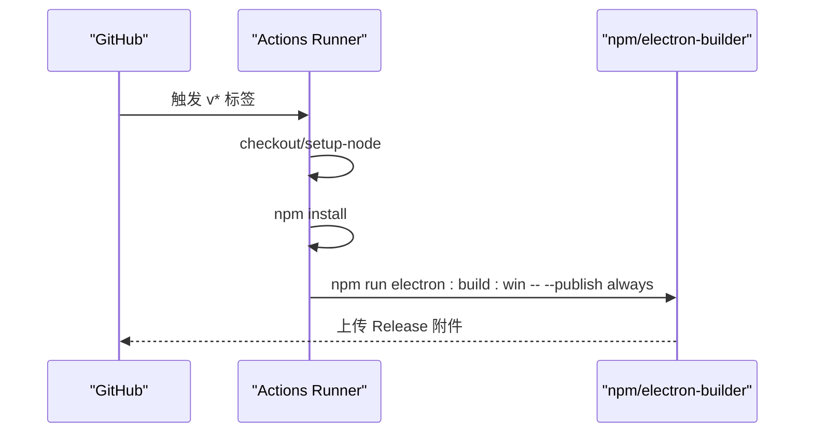
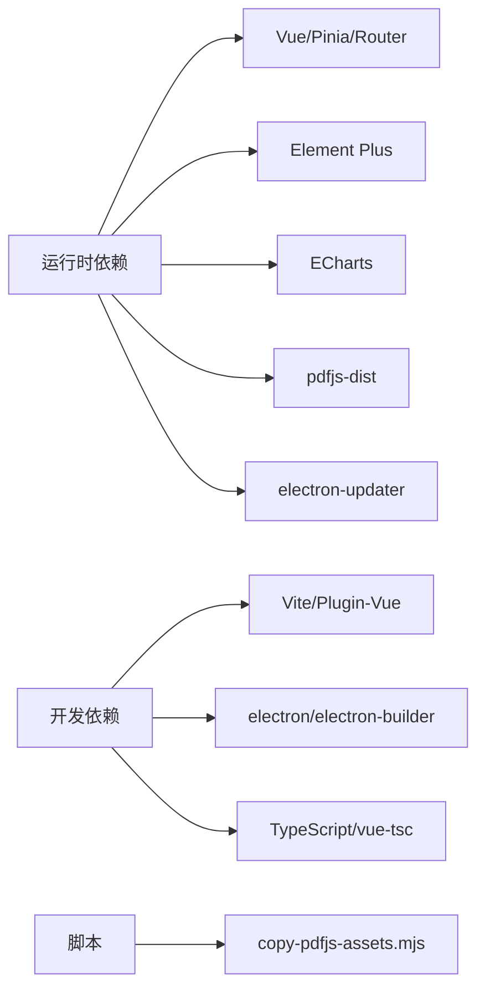

# 开发指南

<cite>
**本文引用的文件**
- [package.json](file://package.json)
- [README.md](file://README.md)
- [vite.config.ts](file://vite.config.ts)
- [tsconfig.json](file://tsconfig.json)
- [tsconfig.node.json](file://tsconfig.node.json)
- [src/main/main.ts](file://src/main/main.ts)
- [src/preload/preload.ts](file://src/preload/preload.ts)
- [scripts/copy-pdfjs-assets.mjs](file://scripts/copy-pdfjs-assets.mjs)
- [.github/workflows/release.yml](file://.github/workflows/release.yml)
- [src/renderer/src/main.ts](file://src/renderer/src/main.ts)
- [src/renderer/src/App.vue](file://src/renderer/src/App.vue)
</cite>

## 目录
1. [简介](#简介)
2. [项目结构](#项目结构)
3. [核心组件](#核心组件)
4. [架构总览](#架构总览)
5. [详细组件分析](#详细组件分析)
6. [依赖关系分析](#依赖关系分析)
7. [性能考量](#性能考量)
8. [故障排查指南](#故障排查指南)
9. [结论](#结论)
10. [附录](#附录)

## 简介
本指南面向希望参与“考研助手”桌面应用开发的工程师，覆盖环境搭建、工程结构与规范、开发与构建流程、多平台打包发布、GitHub Actions 自动化发布、调试技巧与常见问题、以及贡献与版本管理建议。本项目基于 Vue 3 + Electron 28 + Vite 5，采用主进程/渲染进程分离架构，提供离线优先、本地双备份存储、PDF/视频播放、网易云音乐深度集成、B站学习视频等能力。

## 项目结构
- 根目录包含包配置、TypeScript 配置、Vite 配置、脚本与 GitHub Actions 工作流。
- src 下分为主进程（Electron）、预加载脚本、渲染进程（Vue 应用）。
- scripts 提供构建前资源拷贝脚本，确保 PDF CMap/标准字体在 dev/prod 均可用。
- .github/workflows 定义按标签触发的 Windows 构建与发布流水线。

**图表来源**
- [package.json:7-17](file://package.json#L7-L17)
- [vite.config.ts:1-39](file://vite.config.ts#L1-L39)
- [tsconfig.json:1-26](file://tsconfig.json#L1-L26)
- [tsconfig.node.json:1-16](file://tsconfig.node.json#L1-L16)
- [scripts/copy-pdfjs-assets.mjs:1-31](file://scripts/copy-pdfjs-assets.mjs#L1-L31)
- [.github/workflows/release.yml:1-28](file://.github/workflows/release.yml#L1-L28)

**章节来源**
- [README.md:133-208](file://README.md#L133-L208)
- [package.json:1-95](file://package.json#L1-L95)

## 核心组件
- 主进程（Electron）：窗口管理、托盘、协议处理（自定义资源/媒体/数据访问）、自动更新、系统主题同步、B站请求头注入等。
- 预加载层（Preload）：通过 contextBridge 暴露安全的 electronAPI，封装 IPC 调用，屏蔽底层细节。
- 渲染进程（Vue 3）：路由、状态管理（Pinia）、UI 组件（Element Plus）、工具函数、数据持久化（IndexedDB + JSON 快照）。
- 构建与脚本：Vite 构建前端产物，TypeScript 编译主/预加载代码；构建前复制 pdfjs 资源到 public 目录。
- CI：按 v* 标签触发，Windows 环境安装依赖并执行打包与发布。

**章节来源**
- [src/main/main.ts:1-800](file://src/main/main.ts#L1-L800)
- [src/preload/preload.ts:1-98](file://src/preload/preload.ts#L1-L98)
- [src/renderer/src/main.ts:1-63](file://src/renderer/src/main.ts#L1-L63)
- [src/renderer/src/App.vue:1-234](file://src/renderer/src/App.vue#L1-L234)
- [scripts/copy-pdfjs-assets.mjs:1-31](file://scripts/copy-pdfjs-assets.mjs#L1-L31)
- [.github/workflows/release.yml:1-28](file://.github/workflows/release.yml#L1-L28)

## 架构总览
下图展示从启动到页面渲染的关键路径，包括主进程创建窗口、加载前端资源、预加载桥接、以及关键服务（如 PDF 资源回环 HTTP、协议处理、自动更新）。

**图表来源**
- [src/main/main.ts:290-327](file://src/main/main.ts#L290-L327)
- [src/main/main.ts:625-648](file://src/main/main.ts#L625-L648)
- [src/preload/preload.ts:1-98](file://src/preload/preload.ts#L1-L98)
- [src/renderer/src/main.ts:14-63](file://src/renderer/src/main.ts#L14-L63)
- [vite.config.ts:34-38](file://vite.config.ts#L34-L38)

## 详细组件分析

### 主进程（Electron）
- 窗口与托盘：无边框窗口、最小化/最大化/关闭到托盘、双击托盘恢复、首次隐藏提示。
- 协议与资源：
  - kaoyan-bg：用户自定义背景图。
  - kaoyan-music：音频流式读取，支持 Range 分段，白名单校验。
  - kaoyan-data：数据目录内 JSON 备份只读。
  - kaoyan-material：资料文件（PDF/MP4 等）流式读取，Range 支持。
  - kaoyan-assets：内置静态资源（pdfjs cmaps/standard_fonts），配合回环 HTTP 服务。
- 回环 HTTP 服务：仅监听 127.0.0.1，限制路径为 pdfjs/cmaps|standard_fonts，CORS 放行，解决 fetch 分支稳定性问题。
- 自动更新：禁用自动下载，设置页手动触发；事件通过 IPC 推送至渲染端。
- 安全与健壮性：未捕获异常/拒绝处理日志记录；单实例锁；路径穿越防护；MIME 类型映射。

**图表来源**
- [src/main/main.ts:191-197](file://src/main/main.ts#L191-L197)
- [src/main/main.ts:212-276](file://src/main/main.ts#L212-L276)
- [src/main/main.ts:393-658](file://src/main/main.ts#L393-L658)

**章节来源**
- [src/main/main.ts:1-800](file://src/main/main.ts#L1-L800)

### 预加载层（Preload）
- 通过 contextBridge.exposeInMainWorld 暴露 electronAPI，将 IPC 方法以 Promise 形式暴露给渲染进程。
- 覆盖功能域：窗口控制、自动更新、数据导入导出、自定义背景、全屏、报告导出、音乐/资料文件夹选择、外部链接打开、天气查询、数据目录管理、网易云/B站 API 代理、PDF 资源基址获取等。

**图表来源**
- [src/preload/preload.ts:1-98](file://src/preload/preload.ts#L1-L98)

**章节来源**
- [src/preload/preload.ts:1-98](file://src/preload/preload.ts#L1-L98)

### 渲染进程（Vue 3）
- 入口 main.ts：初始化 Pinia、Router、Element Plus（含中文语言包与暗色变量），注册全局错误处理器与未处理 Promise 拒绝监听，挂载 IndexedDB 存储后挂载 App。
- 根组件 App.vue：初始化主题与自定义背景、数据目录同步、侧边栏折叠、番茄钟小浮窗显示逻辑、定时记录使用时长与计划快照、全屏开关联动主进程。
- 路由与视图：按模块划分 views/stores/components/utils/data，遵循单一职责。

**图表来源**
- [src/renderer/src/main.ts:14-63](file://src/renderer/src/main.ts#L14-L63)
- [src/renderer/src/App.vue:42-123](file://src/renderer/src/App.vue#L42-L123)

**章节来源**
- [src/renderer/src/main.ts:1-63](file://src/renderer/src/main.ts#L1-L63)
- [src/renderer/src/App.vue:1-234](file://src/renderer/src/App.vue#L1-L234)

### 构建与脚本
- Vite 配置：
  - base 相对路径，便于 Electron 加载本地资源。
  - define 注入 __APP_VERSION__。
  - 别名 @ -> src/renderer/src。
  - 输出目录 dist/renderer，清理旧产物。
  - 分包策略：vendor-vue、vendor-element-plus、vendor-echarts。
  - 开发服务器端口 5173，不自动打开浏览器。
- TypeScript：
  - 渲染进程：target ES2020，strict 开启，noEmit，bundler 解析，include Vue/TS。
  - 主进程：CommonJS，outDir dist，include main/preload。
- 资源脚本：
  - 构建前复制 pdfjs-dist 的 cmaps 与 standard_fonts 到 src/renderer/public/pdfjs，保证离线/国内网络稳定。

**图表来源**
- [vite.config.ts:8-38](file://vite.config.ts#L8-L38)
- [tsconfig.json:1-26](file://tsconfig.json#L1-L26)
- [tsconfig.node.json:1-16](file://tsconfig.node.json#L1-L16)
- [scripts/copy-pdfjs-assets.mjs:1-31](file://scripts/copy-pdfjs-assets.mjs#L1-L31)

**章节来源**
- [vite.config.ts:1-39](file://vite.config.ts#L1-L39)
- [tsconfig.json:1-26](file://tsconfig.json#L1-L26)
- [tsconfig.node.json:1-16](file://tsconfig.node.json#L1-L16)
- [scripts/copy-pdfjs-assets.mjs:1-31](file://scripts/copy-pdfjs-assets.mjs#L1-L31)

### 打包与发布（Electron Builder）
- 应用标识与名称：appId、productName。
- 输出目录：release-v353。
- 额外资源：托盘图标。
- 平台目标：
  - Windows：nsis 安装包，可自定义安装目录、创建桌面/开始菜单快捷方式。
  - macOS：dmg。
  - Linux：AppImage。
- 发布配置：provider github，owner/repo/releaseType release。
- 脚本：
  - electron:dev：并行 vite + tsc + electron（开发环境）。
  - electron:build：构建后 electron-builder。
  - 平台专用脚本：win/mac/linux。

**章节来源**
- [package.json:45-93](file://package.json#L45-L93)

### GitHub Actions 自动化发布
- 触发条件：push 标签 v*。
- 运行环境：windows-latest，Node 20。
- 步骤：检出代码 -> 安装依赖 -> 执行 electron:build:win --publish always。
- 权限：contents write（用于创建 Release）。
- 环境变量：GH_TOKEN 使用仓库内置 secrets。

**图表来源**
- [.github/workflows/release.yml:1-28](file://.github/workflows/release.yml#L1-L28)

**章节来源**
- [.github/workflows/release.yml:1-28](file://.github/workflows/release.yml#L1-L28)

## 依赖关系分析
- 运行时依赖：Vue 3、Element Plus、Pinia、Vue Router、ECharts、Day.js、pdfjs-dist、electron-updater 等。
- 开发依赖：Vite、@vitejs/plugin-vue、electron、electron-builder、typescript、vue-tsc、concurrently、wait-on、cross-env。
- 构建期依赖：pdfjs-dist 的资源被复制到 public，避免 CDN 依赖。

**图表来源**
- [package.json:19-43](file://package.json#L19-L43)
- [scripts/copy-pdfjs-assets.mjs:1-31](file://scripts/copy-pdfjs-assets.mjs#L1-L31)

**章节来源**
- [package.json:19-43](file://package.json#L19-L43)

## 性能考量
- 前端分包：将 Vue 生态、Element Plus、ECharts 拆分为独立 vendor chunk，提升缓存命中与首屏加载。
- 长列表分批渲染：减少 DOM 压力，避免掉帧（见 README 描述）。
- 大文件流式读取：音频/视频通过 Range 分段传输，降低内存占用，提升拖动响应。
- 资源本地化：pdfjs CMap/标准字体本地托管，避免 CDN 不可达导致的渲染失败。
- 主进程异步 IO：stat/statSync 优化，highWaterMark 提升吞吐。

[本节为通用性能建议，无需特定文件引用]

## 故障排查指南
- 启动失败/端口冲突：
  - 确认 Vite 开发端口 5173 未被占用；必要时修改 vite.config.ts server.port。
  - 参考：[vite.config.ts:34-38](file://vite.config.ts#L34-L38)
- PDF 中文乱码或无法渲染：
  - 确认构建前已执行 copy-pdfjs-assets.mjs，确保 cmaps/standard_fonts 存在于 public 目录。
  - 若回环 HTTP 服务启动失败，渲染端会回退到 kaoyan-assets:// 协议。
  - 参考：[scripts/copy-pdfjs-assets.mjs:1-31](file://scripts/copy-pdfjs-assets.mjs#L1-L31)、[src/main/main.ts:212-276](file://src/main/main.ts#L212-L276)
- 音乐/资料无法播放：
  - 检查白名单与路径穿越保护是否生效；确认 token 有效且文件位于所选目录内。
  - 参考：[src/main/main.ts:407-477](file://src/main/main.ts#L407-L477)、[src/main/main.ts:542-615](file://src/main/main.ts#L542-L615)
- 自动更新无反应：
  - 确认 publish 配置正确，Release 中存在对应资产；检查网络与签名（macOS）。
  - 参考：[package.json:81-86](file://package.json#L81-L86)、[src/main/main.ts:625-648](file://src/main/main.ts#L625-L648)
- 崩溃与异常定位：
  - 主进程：uncaughtException/unhandledRejection 日志。
  - 渲染进程：Vue errorHandler 与 unhandledrejection 监听，写入日志并提示。
  - 参考：[src/main/main.ts:8-14](file://src/main/main.ts#L8-L14)、[src/renderer/src/main.ts:25-56](file://src/renderer/src/main.ts#L25-L56)

**章节来源**
- [vite.config.ts:34-38](file://vite.config.ts#L34-L38)
- [scripts/copy-pdfjs-assets.mjs:1-31](file://scripts/copy-pdfjs-assets.mjs#L1-L31)
- [src/main/main.ts:8-14](file://src/main/main.ts#L8-L14)
- [src/main/main.ts:407-477](file://src/main/main.ts#L407-L477)
- [src/main/main.ts:542-615](file://src/main/main.ts#L542-L615)
- [src/main/main.ts:625-648](file://src/main/main.ts#L625-L648)
- [package.json:81-86](file://package.json#L81-L86)
- [src/renderer/src/main.ts:25-56](file://src/renderer/src/main.ts#L25-L56)

## 结论
本项目采用成熟的 Electron + Vue 3 + Vite 技术栈，具备清晰的模块化结构与完善的构建/发布流程。通过预加载层隔离敏感 API、主进程协议与回环服务保障离线与跨域场景下的稳定性，结合 CI 实现按标签自动化发布。开发者可按本指南快速搭建环境、理解架构、进行功能开发与问题定位。

[本节为总结性内容，无需特定文件引用]

## 附录

### 开发环境与配置要求
- Node.js ≥ 18，npm ≥ 9（推荐）。
- 安装依赖：npm install。
- 开发模式（热更新）：npm run electron:dev。
- 仅前端调试（无 Electron）：npm run dev。
- 生产构建：npm run build。
- 打包安装包：
  - 当前平台：npm run electron:build
  - Windows：npm run electron:build:win
  - macOS：npm run electron:build:mac
  - Linux：npm run electron:build:linux

**章节来源**
- [README.md:133-174](file://README.md#L133-L174)
- [package.json:7-17](file://package.json#L7-L17)

### 代码规范约定
- TypeScript 严格模式开启，模块解析使用 bundler，禁止 emit（由 Vite/TSC 分别负责）。
- 路径别名 @ 指向 src/renderer/src，统一导入风格。
- 主进程使用 CommonJS 模块，输出到 dist。
- 前端按需引入 Element Plus 图标，降低运行时开销。

**章节来源**
- [tsconfig.json:1-26](file://tsconfig.json#L1-L26)
- [tsconfig.node.json:1-16](file://tsconfig.node.json#L1-L16)
- [src/renderer/src/main.ts:17-23](file://src/renderer/src/main.ts#L17-L23)

### 开发与工作流程
- 新增页面：在 src/renderer/src/views 添加组件，并在 router 中注册。
- 新增状态：在 stores 中添加 store，并通过 Pinia 使用。
- 新增主进程能力：在 main.ts 增加 IPC 处理与协议/服务逻辑，在 preload.ts 暴露 API。
- 测试：可使用 Vite 预览模式验证前端；主进程可通过控制台日志与 Electron DevTools 调试。
- 构建发布：执行对应脚本生成安装包；按标签推送触发 CI 发布。

[本节为流程性说明，无需特定文件引用]

### 调试技巧
- 开发模式自动打开 DevTools；可在主进程与渲染进程分别断点调试。
- 使用 console.error 与全局错误处理器收集异常信息。
- 针对 PDF/媒体播放问题，检查协议与 MIME 类型、Range 支持、资源路径。
- 使用 Electron 托盘菜单与窗口事件观察行为差异。

**章节来源**
- [src/main/main.ts:308-313](file://src/main/main.ts#L308-L313)
- [src/renderer/src/main.ts:25-56](file://src/renderer/src/main.ts#L25-L56)

### 贡献与版本管理
- 版本管理：package.json 中维护版本号；发布时打 v* 标签触发 CI。
- 提交规范：建议遵循语义化版本（major.minor.patch），在 commit message 中体现变更范围。
- 分支策略：建议使用 feature/fix 分支开发，合并至主分支后打标签发布。
- 文档更新：新功能需同步更新 README 与相关注释。

**章节来源**
- [package.json:1-10](file://package.json#L1-L10)
- [.github/workflows/release.yml:3-6](file://.github/workflows/release.yml#L3-L6)