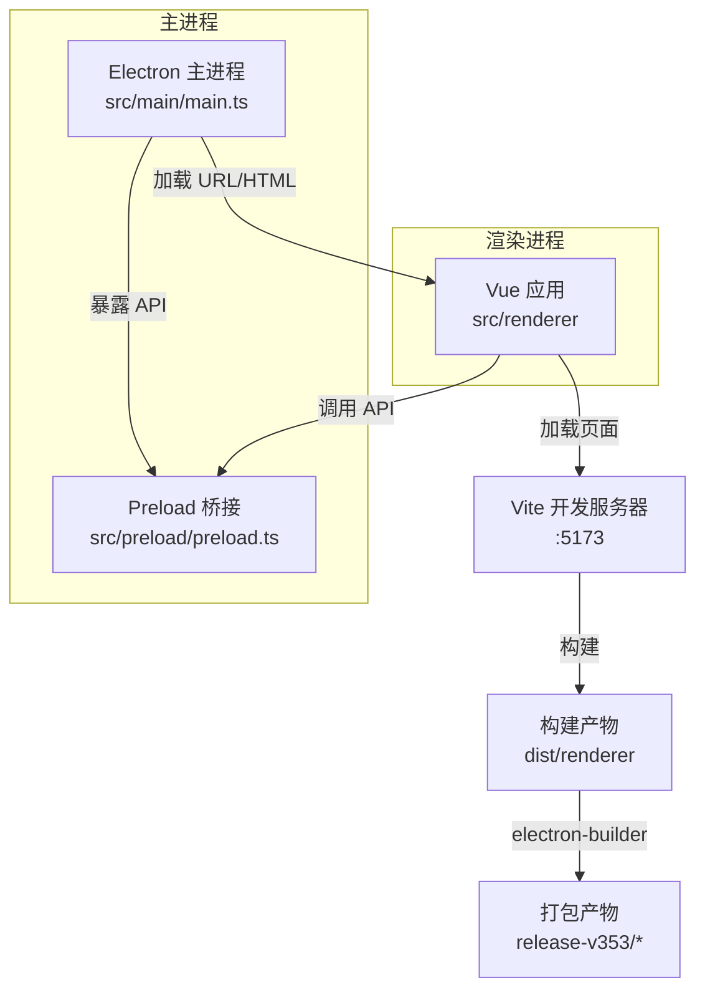
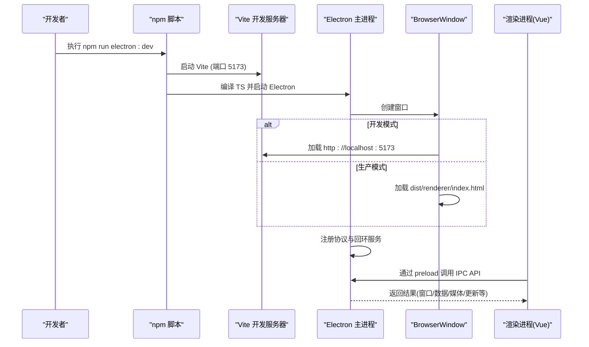
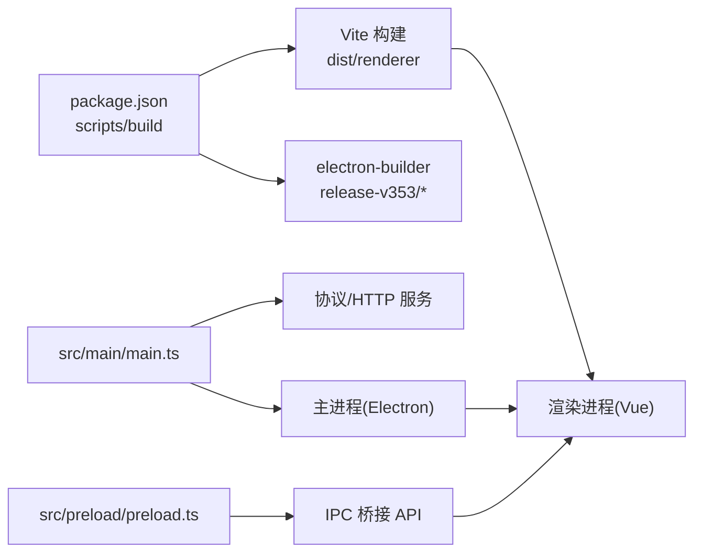

# 快速开始

<cite>
**本文引用的文件**
- [package.json](file://package.json)
- [README.md](file://README.md)
- [vite.config.ts](file://vite.config.ts)
- [src/main/main.ts](file://src/main/main.ts)
- [src/preload/preload.ts](file://src/preload/preload.ts)
- [启动开发版.bat](file://启动开发版.bat)
</cite>

## 目录
1. [简介](#简介)
2. [项目结构](#项目结构)
3. [核心组件](#核心组件)
4. [架构总览](#架构总览)
5. [详细组件分析](#详细组件分析)
6. [依赖关系分析](#依赖关系分析)
7. [性能注意事项](#性能注意事项)
8. [故障排查指南](#故障排查指南)
9. [结论](#结论)
10. [附录](#附录)

## 简介
本指南面向首次接触“考研助手”的新用户，帮助你在最短时间内完成环境准备、依赖安装与本地运行。本项目基于 Vue 3 + Electron 28，使用 Vite 构建前端资源，主进程负责窗口管理、协议服务（音乐/资料/PDF 静态资源）、托盘与自动更新等能力。你可以通过 npm 脚本在浏览器中调试前端，或一键启动完整的桌面应用。

## 项目结构
- 前端渲染进程：位于 src/renderer，包含 Vue 页面、组件、路由、状态管理与工具函数。
- Electron 主进程：位于 src/main，负责窗口、托盘、IPC 通信、协议处理与资源服务。
- Preload 桥接：位于 src/preload，通过 contextBridge 暴露安全 API 给渲染进程。
- 构建配置：vite.config.ts 定义别名、输出目录、分包策略与开发服务器端口。
- 打包与发布：package.json 中的 scripts 与 build 字段集成 electron-builder。

图表来源
- [vite.config.ts:8-38](file://vite.config.ts#L8-L38)
- [src/main/main.ts:290-313](file://src/main/main.ts#L290-L313)
- [src/preload/preload.ts:1-98](file://src/preload/preload.ts#L1-L98)

章节来源
- [README.md:178-208](file://README.md#L178-L208)
- [vite.config.ts:8-38](file://vite.config.ts#L8-L38)

## 核心组件
- 开发与构建脚本：通过 package.json 的 scripts 提供 dev、build、preview、electron:dev、electron:build 等命令。
- 主进程能力：窗口控制、托盘、协议（kaoyan-music、kaoyan-material、kaoyan-assets、kaoyan-data）、回环 HTTP 服务（PDF CMap/字体）、自动更新事件转发。
- 预加载桥接：将主进程能力以安全 API 暴露给渲染进程，如窗口控制、数据目录、网易云/B站接口代理、天气查询等。

章节来源
- [package.json:7-17](file://package.json#L7-L17)
- [src/main/main.ts:183-210](file://src/main/main.ts#L183-L210)
- [src/preload/preload.ts:1-98](file://src/preload/preload.ts#L1-L98)

## 架构总览
下图展示了从启动到运行的关键流程：npm 脚本触发 Vite 与 Electron，主进程创建窗口并加载前端资源；同时注册协议与回环服务，供 PDF、音乐、资料等模块使用。

图表来源
- [package.json:7-17](file://package.json#L7-L17)
- [vite.config.ts:34-37](file://vite.config.ts#L34-L37)
- [src/main/main.ts:290-313](file://src/main/main.ts#L290-L313)
- [src/main/main.ts:191-210](file://src/main/main.ts#L191-L210)

## 详细组件分析

### 环境与系统要求
- Node.js：≥ 18（推荐）
- npm：≥ 9（推荐）
- 操作系统：Windows、macOS、Linux（见 README 平台标识）

章节来源
- [README.md:135-139](file://README.md#L135-L139)

### 依赖安装
- 在项目根目录执行安装命令，等待依赖下载完成。
- Windows 用户可直接双击“启动开发版.bat”，该脚本会检测 node_modules 并自动执行安装与启动。

章节来源
- [README.md:140-144](file://README.md#L140-L144)
- [启动开发版.bat:8-20](file://启动开发版.bat#L8-L20)

### 开发模式启动
- 仅前端调试（无 Electron）：启动 Vite 开发服务器，默认端口 5173，可在浏览器中打开进行热更新调试。
- 完整桌面应用开发：并行启动 Vite 与 Electron，主进程加载本地开发地址并自动打开开发者工具。

章节来源
- [README.md:146-158](file://README.md#L146-L158)
- [package.json:7-17](file://package.json#L7-L17)
- [vite.config.ts:34-37](file://vite.config.ts#L34-L37)
- [src/main/main.ts:308-313](file://src/main/main.ts#L308-L313)

### 构建与打包
- 构建前端资源：生成 dist/renderer 下的静态资源。
- 打包桌面安装包：使用 electron-builder 为当前或指定平台生成安装包，输出目录由 build 配置决定。
- 预览构建产物：使用 vite preview 验证构建结果。

章节来源
- [package.json:7-17](file://package.json#L7-L17)
- [vite.config.ts:20-32](file://vite.config.ts#L20-L32)
- [package.json:45-80](file://package.json#L45-L80)

### npm 脚本速查
- 开发相关
  - 仅前端：npm run dev
  - 桌面应用：npm run electron:dev
- 构建相关
  - 构建：npm run build
  - 预览：npm run preview
- 打包相关
  - 当前平台：npm run electron:build
  - Windows：npm run electron:build:win
  - macOS：npm run electron:build:mac
  - Linux：npm run electron:build:linux

章节来源
- [package.json:7-17](file://package.json#L7-L17)

### 主进程关键能力（与运行相关）
- 窗口与托盘：无边框窗口、最小化/最大化/关闭到托盘、托盘菜单退出。
- 协议与资源服务：
  - kaoyan-music：流式播放音频，支持 Range 请求。
  - kaoyan-material：流式播放视频/文档，支持 Range 请求。
  - kaoyan-assets：内置 PDF CMap/标准字体资源，优先通过回环 HTTP 服务提供，失败时回退自定义协议。
  - kaoyan-data：数据目录内备份文件访问。
- 自动更新：检查/下载/安装新版本，并通过 IPC 事件通知渲染进程。

章节来源
- [src/main/main.ts:290-377](file://src/main/main.ts#L290-L377)
- [src/main/main.ts:183-210](file://src/main/main.ts#L183-L210)
- [src/main/main.ts:393-658](file://src/main/main.ts#L393-L658)

### 预加载桥接（渲染进程可用 API）
- 窗口控制：最小化、最大化、关闭到托盘、全屏切换。
- 数据与资源：数据目录管理、读取本地歌词、外部链接打开。
- 媒体与资料：选择音乐/资料文件夹、列表文件、外部打开。
- 网络代理：网易云音乐、哔哩哔哩、天气查询等接口封装。
- 更新事件：订阅更新可用、进度、下载完成、错误等事件。

章节来源
- [src/preload/preload.ts:1-98](file://src/preload/preload.ts#L1-L98)

## 依赖关系分析
- 运行时依赖：Vue、Element Plus、Pinia、ECharts、pdfjs-dist、electron-updater 等。
- 开发依赖：Vite、TypeScript、Electron、electron-builder、concurrently、wait-on、cross-env 等。
- 构建与打包：Vite 负责前端构建与分包；electron-builder 负责多平台打包与图标等资源注入。

图表来源
- [package.json:7-17](file://package.json#L7-L17)
- [package.json:45-80](file://package.json#L45-L80)
- [vite.config.ts:20-32](file://vite.config.ts#L20-L32)
- [src/main/main.ts:183-210](file://src/main/main.ts#L183-L210)
- [src/preload/preload.ts:1-98](file://src/preload/preload.ts#L1-L98)

章节来源
- [package.json:19-44](file://package.json#L19-L44)
- [package.json:45-80](file://package.json#L45-L80)

## 性能注意事项
- 大文件媒体播放：主进程对音乐与资料采用流式读取与 Range 请求，避免一次性加载导致内存占用过高。
- PDF 资源加载：优先通过回环 HTTP 服务提供 CMap/标准字体，确保 fetch 分支稳定；失败时回退至自定义协议。
- 构建分包：按 vendor 维度拆分 vue、element-plus、echarts，提升缓存命中与加载性能。

章节来源
- [src/main/main.ts:406-477](file://src/main/main.ts#L406-L477)
- [src/main/main.ts:538-615](file://src/main/main.ts#L538-L615)
- [vite.config.ts:24-32](file://vite.config.ts#L24-L32)

## 故障排查指南
- 无法启动 Electron：确认已安装依赖且 Node.js 版本满足要求；Windows 可尝试双击“启动开发版.bat”。
- 前端页面空白：检查 Vite 是否成功启动在 5173 端口；开发模式下主进程会加载 localhost:5173。
- PDF 中文乱码或黑屏：确认 pdfjs 资源已复制（构建前钩子），主进程回环服务正常；若失败会自动回退到自定义协议。
- 媒体无法播放：确认选择的音乐/资料文件夹路径有效，主进程白名单校验通过；检查 Range 请求是否被拦截。
- 自动更新失败：检查网络可达性与 GitHub 仓库配置；关注主进程更新的 IPC 事件回调。

章节来源
- [启动开发版.bat:8-20](file://启动开发版.bat#L8-L20)
- [src/main/main.ts:204-276](file://src/main/main.ts#L204-L276)
- [src/main/main.ts:497-532](file://src/main/main.ts#L497-L532)
- [src/main/main.ts:625-648](file://src/main/main.ts#L625-L648)

## 结论
通过以上步骤，你可以在本地快速搭建并运行“考研助手”。推荐使用 VS Code 作为编辑器，配合 TypeScript 与 Vue 插件获得更好的类型提示与重构体验；利用 Vite 的热更新与 Electron DevTools 提高调试效率。遇到问题时，优先检查 Node/npm 版本、依赖安装与端口占用情况。

## 附录

### 常用命令一览
- 仅前端调试：npm run dev
- 桌面应用开发：npm run electron:dev
- 构建前端：npm run build
- 预览构建：npm run preview
- 打包安装包：npm run electron:build（或指定平台）

章节来源
- [package.json:7-17](file://package.json#L7-L17)

### 开发工具与调试技巧
- 编辑器：VS Code（建议安装 Vue、TypeScript、ESLint、Prettier 扩展）。
- 调试：
  - 前端：浏览器开发者工具（Network/Console/Elements）。
  - 主进程：Electron DevTools（开发模式自动打开）。
  - 日志：控制台输出与主进程未捕获异常监听。
- 性能：
  - 使用 Network 面板观察资源加载与分包效果。
  - 针对大媒体文件，确认 Range 请求与流式响应是否正常。

章节来源
- [src/main/main.ts:8-14](file://src/main/main.ts#L8-L14)
- [src/main/main.ts:308-313](file://src/main/main.ts#L308-L313)
- [vite.config.ts:24-32](file://vite.config.ts#L24-L32)