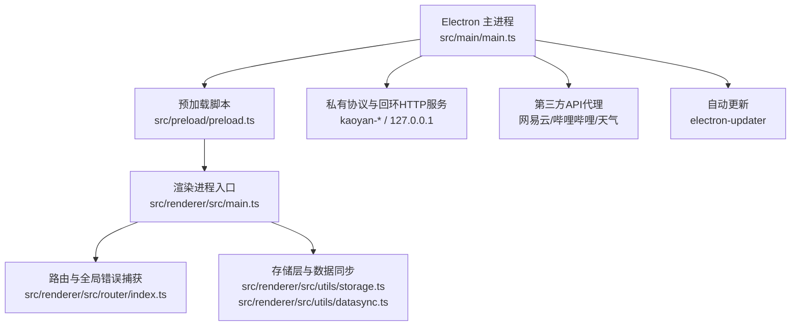
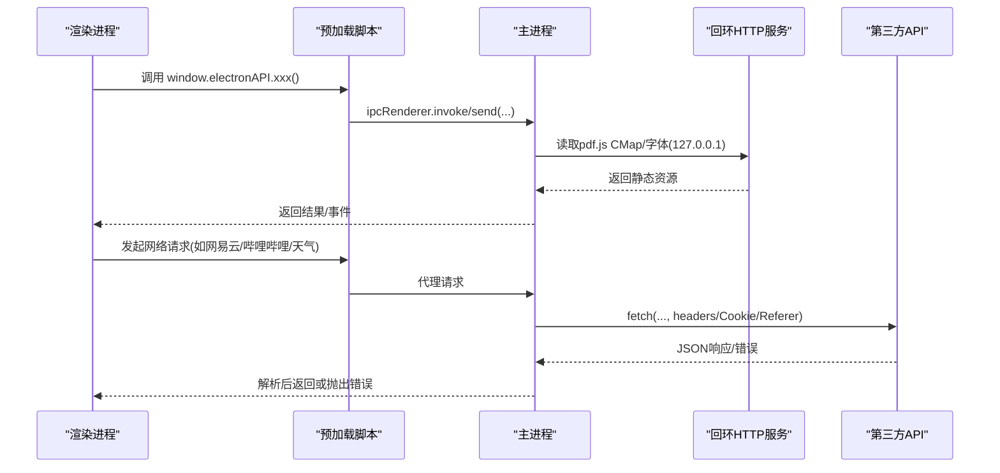
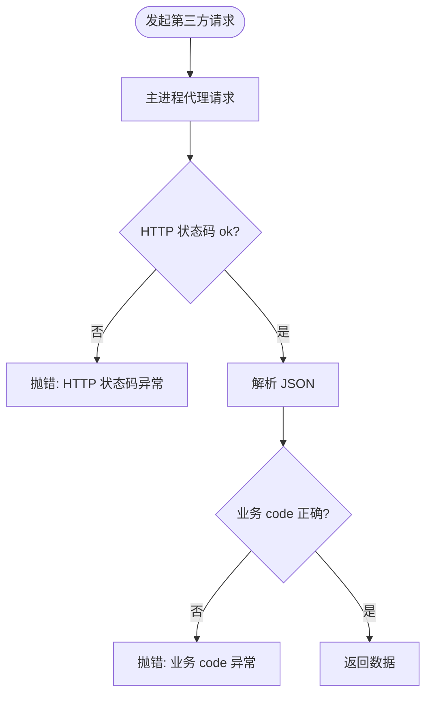

# 故障排除

<cite>
**本文引用的文件**
- [package.json](file://package.json)
- [README.md](file://README.md)
- [vite.config.ts](file://vite.config.ts)
- [src/main/main.ts](file://src/main/main.ts)
- [src/preload/preload.ts](file://src/preload/preload.ts)
- [scripts/copy-pdfjs-assets.mjs](file://scripts/copy-pdfjs-assets.mjs)
- [src/renderer/src/utils/storage.ts](file://src/renderer/src/utils/storage.ts)
- [src/renderer/src/utils/datasync.ts](file://src/renderer/src/utils/datasync.ts)
- [src/renderer/src/views/Settings.vue](file://src/renderer/src/views/Settings.vue)
- [src/renderer/src/router/index.ts](file://src/renderer/src/router/index.ts)
- [src/renderer/src/main.ts](file://src/renderer/src/main.ts)
</cite>

## 目录
1. [简介](#简介)
2. [项目结构](#项目结构)
3. [核心组件](#核心组件)
4. [架构总览](#架构总览)
5. [详细组件分析](#详细组件分析)
6. [依赖与构建分析](#依赖与构建分析)
7. [性能注意事项](#性能注意事项)
8. [故障排除指南](#故障排除指南)
9. [结论](#结论)
10. [附录：日志与错误报告最佳实践](#附录日志与错误报告最佳实践)

## 简介
本指南面向开发与运维人员，聚焦环境配置、依赖冲突、构建失败、网络请求失败、第三方服务集成异常、内存与性能问题、日志分析与调试技巧，以及错误报告与反馈渠道。内容基于仓库内实际实现进行归纳，确保可操作、可追溯。

## 项目结构
本项目为 Electron + Vue 3 + Vite 的桌面应用，主进程负责窗口管理、协议处理、本地资源服务、第三方 API 代理与自动更新；渲染进程负责 UI、状态管理与业务逻辑；预加载脚本暴露安全 IPC 接口给渲染进程使用。

图表来源
- [src/main/main.ts:191-276](file://src/main/main.ts#L191-L276)
- [src/preload/preload.ts:1-97](file://src/preload/preload.ts#L1-L97)
- [src/renderer/src/router/index.ts:112-143](file://src/renderer/src/router/index.ts#L112-L143)
- [src/renderer/src/utils/storage.ts:140-188](file://src/renderer/src/utils/storage.ts#L140-L188)
- [src/renderer/src/utils/datasync.ts:1-108](file://src/renderer/src/utils/datasync.ts#L1-L108)

章节来源
- [README.md:111-208](file://README.md#L111-L208)
- [package.json:7-17](file://package.json#L7-L17)

## 核心组件
- 主进程（main.ts）
  - 注册自定义协议（kaoyan-bg/music/data/material/assets），提供流式读取与 Range 支持，避免大文件内存占用。
  - 启动回环 HTTP 服务（127.0.0.1）供 pdf.js 通过 fetch 获取 CMap/标准字体，解决离线/国内网络下加载失败。
  - 统一处理未捕获异常与未处理 Promise 拒绝，防止主进程崩溃弹窗。
  - 集成 electron-updater，支持设置页手动检查/下载/安装更新。
  - 代理网易云音乐、哔哩哔哩、天气等第三方 API，集中处理 Cookie、Referer、UA、IP 伪装与错误码校验。
- 预加载脚本（preload.ts）
  - 通过 contextBridge 暴露安全的 IPC 方法，封装所有跨进程调用。
- 渲染进程（Vue 3 + Vite）
  - 全局错误处理器与未处理 Promise rejection 捕获，记录到设置页“报错日志”。
  - 路由加载失败捕获并提示用户查看日志。
  - 存储层基于 localStorage 实时持久化，具备版本迁移与容量不足清理策略。
  - 数据目录管理（IndexedDB 为主，可选快照同步）。

章节来源
- [src/main/main.ts:8-14](file://src/main/main.ts#L8-L14)
- [src/main/main.ts:191-276](file://src/main/main.ts#L191-L276)
- [src/main/main.ts:625-648](file://src/main/main.ts#L625-L648)
- [src/preload/preload.ts:1-97](file://src/preload/preload.ts#L1-L97)
- [src/renderer/src/main.ts:25-62](file://src/renderer/src/main.ts#L25-L62)
- [src/renderer/src/router/index.ts:112-143](file://src/renderer/src/router/index.ts#L112-L143)
- [src/renderer/src/utils/storage.ts:140-188](file://src/renderer/src/utils/storage.ts#L140-L188)
- [src/renderer/src/utils/datasync.ts:1-108](file://src/renderer/src/utils/datasync.ts#L1-L108)

## 架构总览
下图展示关键运行时交互：渲染进程通过预加载脚本调用主进程能力，主进程提供协议访问、本地资源服务与第三方 API 代理，同时维护自动更新与系统托盘行为。

图表来源
- [src/preload/preload.ts:1-97](file://src/preload/preload.ts#L1-L97)
- [src/main/main.ts:212-276](file://src/main/main.ts#L212-L276)
- [src/main/main.ts:1269-1332](file://src/main/main.ts#L1269-L1332)

## 详细组件分析

### 环境与运行环境排查
- Node/npm 版本不匹配
  - 现象：安装依赖或构建失败。
  - 依据：要求 Node ≥ 18、npm ≥ 9。
  - 处理：升级 Node/npm 后重新安装依赖。
- 开发模式端口占用
  - 现象：Vite 无法启动或热更新失败。
  - 依据：开发服务器默认端口 5173。
  - 处理：释放端口或修改 vite 配置端口。
- PDF 中文显示异常/黑屏
  - 现象：打开 PDF 页面空白或报错。
  - 依据：需要 CMap/标准字体；主进程提供 kaoyan-assets 协议与回环 HTTP 服务。
  - 处理：确认 predev/prebuild 钩子执行复制资源；检查回环服务是否启动成功；必要时降级到备用协议。

章节来源
- [README.md:133-174](file://README.md#L133-L174)
- [vite.config.ts:34-37](file://vite.config.ts#L34-L37)
- [scripts/copy-pdfjs-assets.mjs:1-31](file://scripts/copy-pdfjs-assets.mjs#L1-L31)
- [src/main/main.ts:212-276](file://src/main/main.ts#L212-L276)
- [src/main/main.ts:497-535](file://src/main/main.ts#L497-L535)

### 依赖冲突与构建失败
- 常见症状
  - npm install 报平台原生模块编译失败。
  - electron-builder 打包失败或产物缺失。
  - 构建体积过大导致警告。
- 定位要点
  - 检查 package.json 中 devDependencies 与 dependencies 的版本兼容性。
  - 关注 Vite 分块大小限制与 manualChunks 配置。
  - 确认 electron-builder 目标平台与签名/打包工具链可用。
- 建议步骤
  - 清理 node_modules 与锁文件后重装。
  - 在 CI 或干净环境中复现。
  - 逐步注释引入包以定位冲突源。

章节来源
- [package.json:19-43](file://package.json#L19-L43)
- [package.json:45-80](file://package.json#L45-L80)
- [vite.config.ts:20-32](file://vite.config.ts#L20-L32)

### 网络请求失败与第三方服务集成
- 网易云音乐
  - 现象：登录失败、歌单/评论/播放地址获取失败。
  - 依据：主进程统一代理请求，校验 code=200，设置 Referer/Origin/UA/IP 伪装，解析 Set-Cookie。
  - 处理：检查网络连通性；确认 Cookie/登录态有效；查看主进程日志中的 HTTP 状态码与 message。
- 哔哩哔哩
  - 现象：搜索/收藏/播放失败。
  - 依据：主进程代理 playurl 等接口，校验 code 与 durl 有效性，注入 Referer/UA。
  - 处理：确认登录态；尝试切换清晰度或备用 CDN；查看错误信息。
- 天气服务
  - 现象：城市查询或当前天气为空。
  - 依据：主进程代理中国天气网；浏览器环境有 wttr.in 回退。
  - 处理：切换城市；检查网络；查看缓存与刷新逻辑。

图表来源
- [src/main/main.ts:1269-1332](file://src/main/main.ts#L1269-L1332)
- [src/main/main.ts:2473-2503](file://src/main/main.ts#L2473-L2503)

章节来源
- [src/main/main.ts:1269-1332](file://src/main/main.ts#L1269-L1332)
- [src/main/main.ts:2473-2503](file://src/main/main.ts#L2473-L2503)
- [src/renderer/src/utils/weather.ts:128-194](file://src/renderer/src/utils/weather.ts#L128-L194)

### 数据存储与备份异常
- 现象：重启后数据丢失、导入导出失败、存储空间不足。
- 机制
  - 渲染进程使用 localStorage 实时持久化，具备版本迁移与容量不足时自动清理旧数据策略。
  - 数据目录管理支持 IndexedDB 实时记录与手动同步快照到数据目录（自动同步已关闭）。
- 处理
  - 检查 localStorage 容量与清理策略是否生效。
  - 使用设置页“导入/导出”功能验证数据完整性。
  - 如需外部备份，手动触发一次同步到数据目录。

章节来源
- [src/renderer/src/utils/storage.ts:48-109](file://src/renderer/src/utils/storage.ts#L48-L109)
- [src/renderer/src/utils/storage.ts:140-188](file://src/renderer/src/utils/storage.ts#L140-L188)
- [src/renderer/src/utils/datasync.ts:1-108](file://src/renderer/src/utils/datasync.ts#L1-L108)

### 自动更新失败
- 现象：检测不到更新、下载进度无响应、安装失败。
- 机制
  - 主进程启用 electron-updater，设置静默检查更新，失败不打扰用户；支持设置页手动触发。
- 处理
  - 检查网络连接与 GitHub Release 可用性。
  - 查看设置页“报错日志”与主进程控制台输出。
  - 若网络受限，考虑更换发布源或手动下载安装包。

章节来源
- [src/main/main.ts:625-648](file://src/main/main.ts#L625-L648)
- [package.json:81-86](file://package.json#L81-L86)

### 界面与路由加载失败
- 现象：点击菜单无响应、页面空白、组件渲染异常。
- 机制
  - 路由加载失败会记录日志并提示用户查看设置页。
  - Vue 全局错误处理器与未处理 Promise rejection 捕获均写入日志。
- 处理
  - 打开设置页“报错日志”，复制相关条目反馈。
  - 检查路由懒加载模块是否存在或路径是否正确。

章节来源
- [src/renderer/src/router/index.ts:112-143](file://src/renderer/src/router/index.ts#L112-L143)
- [src/renderer/src/main.ts:25-62](file://src/renderer/src/main.ts#L25-L62)
- [src/renderer/src/views/Settings.vue:270-330](file://src/renderer/src/views/Settings.vue#L270-L330)

## 依赖与构建分析
- 构建脚本
  - predev/prebuild 钩子复制 pdfjs 资源，确保 dev/prod 行为一致。
  - build 流程先构建前端再编译 Node 侧 TS。
- 分块优化
  - vendor-vue、vendor-element-plus、vendor-echarts 独立分包，提升缓存命中与加载性能。
- 常见问题
  - 资源缺失：确认 predev/prebuild 执行成功且 public/pdfjs 存在 cmaps 与 standard_fonts。
  - 构建体积告警：调整 chunkSizeWarningLimit 或拆分依赖。

章节来源
- [package.json:7-17](file://package.json#L7-L17)
- [scripts/copy-pdfjs-assets.mjs:1-31](file://scripts/copy-pdfjs-assets.mjs#L1-L31)
- [vite.config.ts:20-32](file://vite.config.ts#L20-L32)

## 性能注意事项
- 大文件流式读取
  - 音乐与资料协议采用 ReadableStream 与 Range 请求，避免一次性加载大文件导致内存飙升。
- 进度写入优化
  - 材料进度对象缓存，减少频繁 JSON 序列化与写盘开销。
- 列表渲染
  - 长列表分批渲染，降低掉帧风险。
- 资源加载
  - 回环 HTTP 服务让 pdf.js 走稳定 fetch 分支，减少 XHR 兼容性问题。

章节来源
- [src/main/main.ts:406-477](file://src/main/main.ts#L406-L477)
- [src/main/main.ts:541-615](file://src/main/main.ts#L541-L615)
- [src/renderer/src/views/Materials.vue:1180-1212](file://src/renderer/src/views/Materials.vue#L1180-L1212)
- [src/main/main.ts:212-276](file://src/main/main.ts#L212-L276)

## 故障排除指南

### 环境问题
- Node/npm 版本不符
  - 现象：安装/构建失败。
  - 处理：升级到 Node ≥ 18、npm ≥ 9，删除 node_modules 后重装。
- 端口占用
  - 现象：开发服务器无法启动。
  - 处理：释放 5173 端口或修改 vite 配置。
- 权限问题
  - 现象：写入数据目录失败。
  - 处理：确保对数据目录具有读写权限；必要时切换到文档目录。

章节来源
- [README.md:133-174](file://README.md#L133-L174)
- [vite.config.ts:34-37](file://vite.config.ts#L34-L37)

### 依赖冲突
- 原生模块编译失败
  - 现象：npm install 报 gyp 或 node-gyp 错误。
  - 处理：安装 Python/Visual Studio Build Tools（Windows）或对应平台工具链；清理缓存重试。
- 包版本冲突
  - 现象：运行时类型错误或模块重复。
  - 处理：锁定依赖版本，使用 pnpm/yarn 统一管理；必要时降级冲突包。

章节来源
- [package.json:19-43](file://package.json#L19-L43)

### 构建失败
- 资源缺失
  - 现象：PDF 中文乱码或页面空白。
  - 处理：确认 predev/prebuild 执行成功；检查 src/renderer/public/pdfjs 是否存在 cmaps 与 standard_fonts。
- 打包产物不完整
  - 现象：安装包缺少必要文件。
  - 处理：检查 electron-builder files 配置与 extraResources；清理 dist 后重新构建。

章节来源
- [scripts/copy-pdfjs-assets.mjs:1-31](file://scripts/copy-pdfjs-assets.mjs#L1-L31)
- [package.json:45-80](file://package.json#L45-L80)

### 网络请求失败
- 网易云/哔哩哔哩/天气
  - 现象：登录失败、数据为空、播放不可用。
  - 处理：检查网络；确认 Cookie/登录态；查看主进程代理日志；必要时切换城市或清晰度。
- 跨域/防盗链
  - 现象：视频无法播放或图片加载失败。
  - 处理：确认主进程已注入 Referer/UA；检查 CDN 可用性。

章节来源
- [src/main/main.ts:1269-1332](file://src/main/main.ts#L1269-L1332)
- [src/main/main.ts:2473-2503](file://src/main/main.ts#L2473-L2503)
- [src/renderer/src/utils/weather.ts:128-194](file://src/renderer/src/utils/weather.ts#L128-L194)

### 第三方服务集成问题
- 登录态失效
  - 现象：功能突然不可用。
  - 处理：重新扫码/粘贴 Cookie；检查主进程 Cookie 解析与持久化。
- 接口变更
  - 现象：返回结构变化导致解析失败。
  - 处理：根据错误日志定位字段；临时降级或提示用户更新。

章节来源
- [src/main/main.ts:1269-1332](file://src/main/main.ts#L1269-L1332)
- [src/main/main.ts:2473-2503](file://src/main/main.ts#L2473-L2503)

### 内存泄漏与性能瓶颈
- 大文件内存占用
  - 现象：播放音乐/视频卡顿或内存飙升。
  - 处理：确认使用协议流式读取与 Range 请求；避免一次性加载完整文件。
- 频繁写盘导致的卡顿
  - 现象：滚动文档或保存进度时界面卡顿。
  - 处理：使用进度对象缓存与增量写入；减少不必要的 JSON 序列化。
- 资源加载不稳定
  - 现象：PDF 中文渲染失败。
  - 处理：使用回环 HTTP 服务；确保 CMap/字体资源存在。

章节来源
- [src/main/main.ts:406-477](file://src/main/main.ts#L406-L477)
- [src/main/main.ts:541-615](file://src/main/main.ts#L541-L615)
- [src/renderer/src/views/Materials.vue:1180-1212](file://src/renderer/src/views/Materials.vue#L1180-L1212)
- [src/main/main.ts:212-276](file://src/main/main.ts#L212-L276)

### 日志分析与调试技巧
- 设置页“报错日志”
  - 用途：查看路由加载、Vue 渲染、运行时与接口请求异常。
  - 操作：复制日志并附问题描述反馈。
- 主进程控制台
  - 用途：查看 uncaughtException/unhandledRejection、网络代理错误、协议处理异常。
  - 操作：开发模式下开启 DevTools；生产环境收集日志文件。
- 浏览器控制台
  - 用途：前端错误、Promise 拒绝、网络请求失败。
  - 操作：F12 查看 Network/Console；过滤错误关键字。

章节来源
- [src/renderer/src/views/Settings.vue:270-330](file://src/renderer/src/views/Settings.vue#L270-L330)
- [src/renderer/src/main.ts:25-62](file://src/renderer/src/main.ts#L25-L62)
- [src/main/main.ts:8-14](file://src/main/main.ts#L8-L14)

### 错误报告与反馈渠道
- 报告内容
  - 操作系统与版本、Node/npm 版本、应用版本。
  - 复现步骤、期望行为与实际行为。
  - 设置页“报错日志”全文、主进程控制台关键日志。
- 反馈渠道
  - 参考 README 中提供的下载与社区链接；在 GitHub Issues 提交问题并附上上述信息。

章节来源
- [README.md:212-225](file://README.md#L212-L225)

## 结论
通过主进程的协议与代理能力、渲染进程的全局错误捕获与日志体系、以及完善的构建与资源管理，本项目在复杂环境下仍能提供稳定的学习与备考体验。遇到问题时，优先从环境、依赖、网络与日志四个维度定位，结合本指南的步骤快速恢复。

## 附录：日志与错误报告最佳实践
- 收集顺序
  - 先复现问题，再打开设置页“报错日志”复制全部。
  - 打开主进程控制台，复制关键错误堆栈。
  - 记录网络请求失败时的 URL、状态码与响应片段。
- 提交模板
  - 问题标题：简明描述问题。
  - 环境信息：OS、Node、npm、应用版本。
  - 复现步骤：逐步说明。
  - 日志附件：设置页日志与主进程日志。
  - 期望与实际：对比说明。
- 隐私注意
  - 移除个人敏感信息（Cookie、账号信息等）后再提交。

章节来源
- [src/renderer/src/views/Settings.vue:270-330](file://src/renderer/src/views/Settings.vue#L270-L330)
- [src/renderer/src/main.ts:25-62](file://src/renderer/src/main.ts#L25-L62)
- [src/main/main.ts:8-14](file://src/main/main.ts#L8-L14)