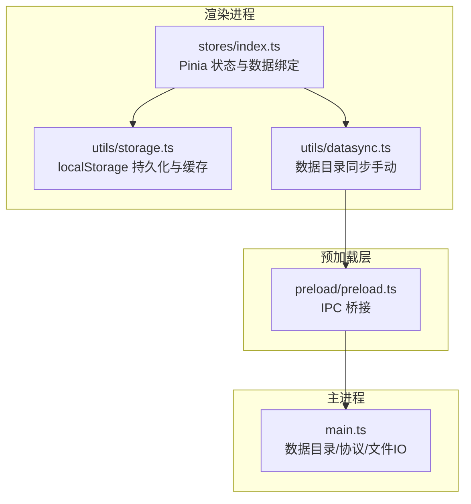
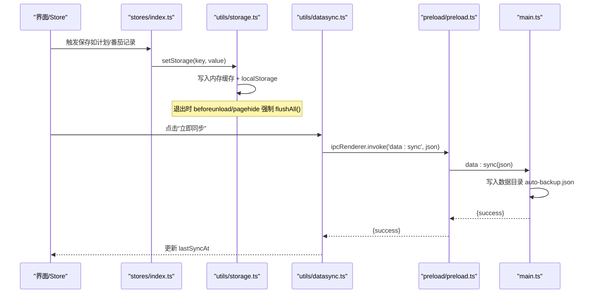
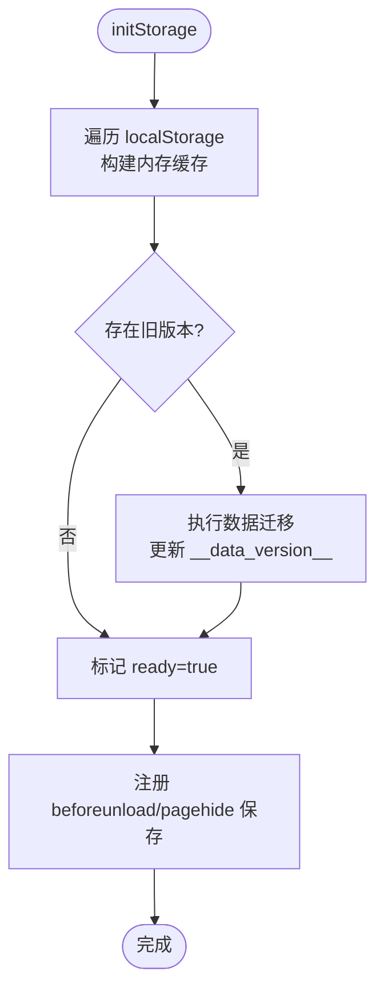
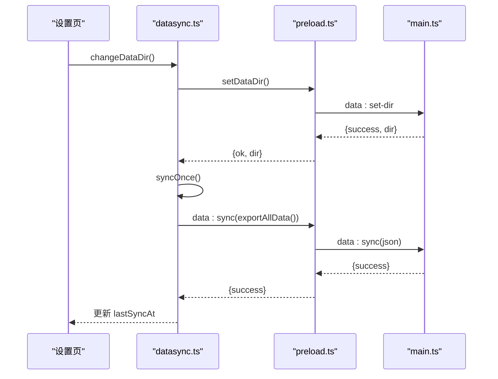
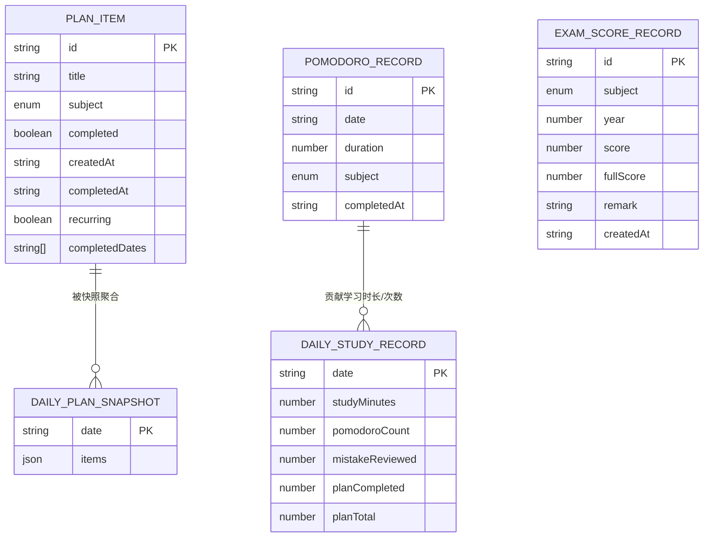
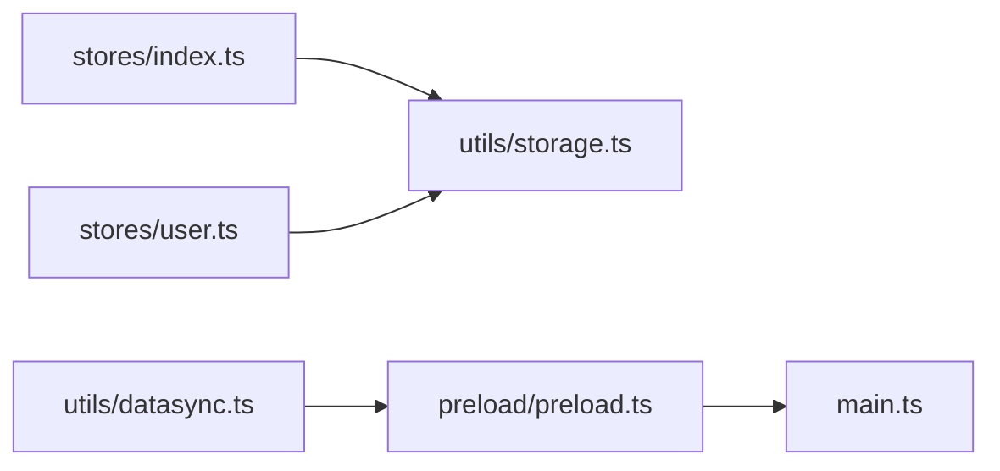
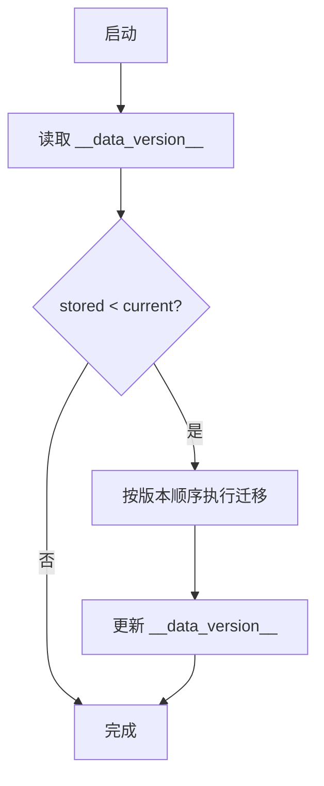

# 数据存储设计

<cite>
**本文引用的文件**
- [src/renderer/src/utils/storage.ts](file://src/renderer/src/utils/storage.ts)
- [src/renderer/src/utils/datasync.ts](file://src/renderer/src/utils/datasync.ts)
- [src/preload/preload.ts](file://src/preload/preload.ts)
- [src/main/main.ts](file://src/main/main.ts)
- [src/renderer/src/stores/index.ts](file://src/renderer/src/stores/index.ts)
- [src/renderer/src/stores/user.ts](file://src/renderer/src/stores/user.ts)
</cite>

## 目录
1. [简介](#简介)
2. [项目结构](#项目结构)
3. [核心组件](#核心组件)
4. [架构总览](#架构总览)
5. [详细组件分析](#详细组件分析)
6. [依赖关系分析](#依赖关系分析)
7. [性能与缓存策略](#性能与缓存策略)
8. [数据同步机制](#数据同步机制)
9. [数据迁移与版本管理](#数据迁移与版本管理)
10. [备份与恢复](#备份与恢复)
11. [数据安全与隐私保护](#数据安全与隐私保护)
12. [数据访问 API 与最佳实践](#数据访问-api-与最佳实践)
13. [故障排查指南](#故障排查指南)
14. [结论](#结论)

## 简介
本文件面向“考研助手”的数据存储设计，聚焦以下目标：
- 说明本地持久化策略（当前实现为 localStorage + 内存缓存），并解释 IndexedDB 的规划与现状。
- 定义数据模型、实体关系与验证规则。
- 描述数据同步机制（本地到数据目录快照）及自动同步开关状态。
- 提供数据迁移策略与版本管理方法。
- 包含备份/恢复能力、性能优化技巧与缓存策略。
- 说明数据安全性与隐私保护措施。
- 给出数据访问 API 的使用示例与最佳实践。

## 项目结构
本项目采用 Electron 多进程架构：
- 渲染进程负责 UI 与业务逻辑，使用 Pinia Store 管理状态，并通过统一的存储工具读写本地数据。
- 预加载脚本通过 contextBridge 暴露 IPC 接口给渲染进程，用于与主进程通信（如数据目录操作）。
- 主进程负责文件系统、协议处理、托盘、更新等系统级能力。

图表来源
- [src/renderer/src/stores/index.ts:221-255](file://src/renderer/src/stores/index.ts#L221-L255)
- [src/renderer/src/utils/storage.ts:144-188](file://src/renderer/src/utils/storage.ts#L144-L188)
- [src/renderer/src/utils/datasync.ts:27-82](file://src/renderer/src/utils/datasync.ts#L27-L82)
- [src/preload/preload.ts:86-90](file://src/preload/preload.ts#L86-L90)
- [src/main/main.ts:21-62](file://src/main/main.ts#L21-L62)

章节来源
- [src/renderer/src/stores/index.ts:221-255](file://src/renderer/src/stores/index.ts#L221-L255)
- [src/renderer/src/utils/storage.ts:144-188](file://src/renderer/src/utils/storage.ts#L144-L188)
- [src/renderer/src/utils/datasync.ts:27-82](file://src/renderer/src/utils/datasync.ts#L27-L82)
- [src/preload/preload.ts:86-90](file://src/preload/preload.ts#L86-L90)
- [src/main/main.ts:21-62](file://src/main/main.ts#L21-L62)

## 核心组件
- 存储抽象层（storage.ts）：封装 localStorage 读写、内存缓存、用户前缀隔离、容量不足清理、数据迁移、导出/导入、账号管理。
- 数据同步模块（datasync.ts）：管理数据目录路径、手动同步、打开目录；自动同步已关闭。
- 预加载桥（preload.ts）：将数据目录相关 IPC 暴露给渲染进程。
- 主进程（main.ts）：数据目录默认位置、配置持久化、协议处理（kaoyan-data 等）、自动备份文件路径。
- 状态管理（stores/index.ts, user.ts）：定义数据模型、监听存储就绪、读写各业务数据。

章节来源
- [src/renderer/src/utils/storage.ts:14-46](file://src/renderer/src/utils/storage.ts#L14-L46)
- [src/renderer/src/utils/datasync.ts:11-18](file://src/renderer/src/utils/datasync.ts#L11-L18)
- [src/preload/preload.ts:86-90](file://src/preload/preload.ts#L86-L90)
- [src/main/main.ts:21-62](file://src/main/main.ts#L21-L62)
- [src/renderer/src/stores/index.ts:221-255](file://src/renderer/src/stores/index.ts#L221-L255)
- [src/renderer/src/stores/user.ts:14-25](file://src/renderer/src/stores/user.ts#L14-L25)

## 架构总览
应用采用“渲染进程本地持久化 + 可选数据目录快照”的双层方案：
- 运行时数据：存储在渲染进程的 localStorage，配合内存 Map 缓存，保证读写性能与退出不丢失。
- 数据目录快照：通过主进程提供的 IPC 将全量 JSON 快照写入用户可自定义的数据目录，便于备份与迁移。
- 自动同步：已关闭，仅保留手动同步能力。

图表来源
- [src/renderer/src/stores/index.ts:606-608](file://src/renderer/src/stores/index.ts#L606-L608)
- [src/renderer/src/utils/storage.ts:227-246](file://src/renderer/src/utils/storage.ts#L227-L246)
- [src/renderer/src/utils/storage.ts:190-195](file://src/renderer/src/utils/storage.ts#L190-L195)
- [src/renderer/src/utils/datasync.ts:68-82](file://src/renderer/src/utils/datasync.ts#L68-L82)
- [src/preload/preload.ts:86-90](file://src/preload/preload.ts#L86-L90)
- [src/main/main.ts:59-62](file://src/main/main.ts#L59-L62)

## 详细组件分析

### 存储抽象层（storage.ts）
- 初始化流程：启动时扫描 localStorage，解析为内存缓存；执行数据迁移；注册退出前保存事件。
- 读写策略：所有写操作同时更新内存缓存与 localStorage；读优先命中缓存，未命中则从 localStorage 解析并回填缓存。
- 用户隔离：根据当前用户名动态选择键前缀（游客或具体用户），避免数据串扰。
- 容量降级：当 localStorage 写入失败时，尝试清理历史快照等非关键数据后重试。
- 导出/导入：支持按当前用户范围导出/导入 JSON 字符串。
- 账号管理：本地账户列表、密码哈希、登录校验、游客数据迁移至用户账号、删除账号。

图表来源
- [src/renderer/src/utils/storage.ts:144-188](file://src/renderer/src/utils/storage.ts#L144-L188)
- [src/renderer/src/utils/storage.ts:113-136](file://src/renderer/src/utils/storage.ts#L113-L136)

章节来源
- [src/renderer/src/utils/storage.ts:144-188](file://src/renderer/src/utils/storage.ts#L144-L188)
- [src/renderer/src/utils/storage.ts:227-246](file://src/renderer/src/utils/storage.ts#L227-L246)
- [src/renderer/src/utils/storage.ts:298-323](file://src/renderer/src/utils/storage.ts#L298-L323)
- [src/renderer/src/utils/storage.ts:327-443](file://src/renderer/src/utils/storage.ts#L327-L443)

### 数据同步模块（datasync.ts）
- 数据目录：通过主进程获取/设置数据目录路径，切换目录后立即执行一次全量同步。
- 手动同步：调用主进程 IPC 将 exportAllData() 的结果写入数据目录。
- 自动同步：v2.9.2 起已关闭，startAutoSync/setSyncEnabled 为空实现或强制关闭。

图表来源
- [src/renderer/src/utils/datasync.ts:38-82](file://src/renderer/src/utils/datasync.ts#L38-L82)
- [src/preload/preload.ts:86-90](file://src/preload/preload.ts#L86-L90)
- [src/main/main.ts:59-62](file://src/main/main.ts#L59-L62)

章节来源
- [src/renderer/src/utils/datasync.ts:27-82](file://src/renderer/src/utils/datasync.ts#L27-L82)
- [src/preload/preload.ts:86-90](file://src/preload/preload.ts#L86-L90)
- [src/main/main.ts:59-62](file://src/main/main.ts#L59-L62)

### 主进程数据目录与协议（main.ts）
- 数据目录：默认位于“文档\11408kaoyan-helper”，可通过设置自定义；配置文件保存在 userData。
- 自动备份：auto-backup.json 位于数据目录内，由渲染进程主动写入。
- 协议：
  - kaoyan-data：仅允许读取数据目录内的 .json 备份文件，带白名单校验。
  - 其他协议（音乐、资料、资源）与本存储设计间接相关，体现安全边界与流式读取。

章节来源
- [src/main/main.ts:21-62](file://src/main/main.ts#L21-L62)
- [src/main/main.ts:479-495](file://src/main/main.ts#L479-L495)

### 数据模型与实体关系（stores/index.ts）
- 科目类型：politics、english、math、cs408。
- 核心实体：
  - PlanItem：学习计划项（含循环计划与完成日期）。
  - Flashcard：记忆卡片（含复习统计）。
  - PomodoroRecord：番茄钟记录（时长、科目、完成时间）。
  - DailyStudyRecord：每日学习汇总（分钟数、计划完成度等）。
  - DailyPlanSnapshot：某日计划快照（含普通与循环计划的实际完成态）。
  - OutlineNode：知识大纲节点（进度、备注）。
  - AlgorithmTemplate：算法模板（复杂度、标签等）。
  - FormulaItem：公式/概念（内容、示例）。
  - ExamScoreRecord：历年真题分数（年份、得分、满分、备注）。
  - AppErrorLog：全局错误日志条目。
- 关系概览：
  - 计划与快照：DailyPlanSnapshot 聚合某一天的计划完成态。
  - 番茄记录与每日汇总：PomodoroRecord 贡献 DailyStudyRecord 的学习时长与次数。
  - 成绩与科目：ExamScoreRecord 关联 SubjectType，支持 408 子科目合并为总分的历史迁移。

图表来源
- [src/renderer/src/stores/index.ts:27-137](file://src/renderer/src/stores/index.ts#L27-L137)

章节来源
- [src/renderer/src/stores/index.ts:27-137](file://src/renderer/src/stores/index.ts#L27-L137)

## 依赖关系分析
- stores/index.ts 依赖 storage.ts 进行数据持久化，并在 onStorageReady 中刷新状态，确保 IndexedDB/LocalStorage 就绪后再加载数据。
- stores/user.ts 依赖 storage.ts 的用户管理 API，并在存储就绪后刷新当前用户与用户列表。
- datasync.ts 依赖 preload.ts 暴露的 IPC 接口与 main.ts 的数据目录能力。
- main.ts 提供数据目录路径、自动备份文件路径以及数据目录协议访问控制。

图表来源
- [src/renderer/src/stores/index.ts:626-647](file://src/renderer/src/stores/index.ts#L626-L647)
- [src/renderer/src/stores/user.ts:14-25](file://src/renderer/src/stores/user.ts#L14-L25)
- [src/renderer/src/utils/datasync.ts:27-82](file://src/renderer/src/utils/datasync.ts#L27-L82)
- [src/preload/preload.ts:86-90](file://src/preload/preload.ts#L86-L90)
- [src/main/main.ts:21-62](file://src/main/main.ts#L21-L62)

章节来源
- [src/renderer/src/stores/index.ts:626-647](file://src/renderer/src/stores/index.ts#L626-L647)
- [src/renderer/src/stores/user.ts:14-25](file://src/renderer/src/stores/user.ts#L14-L25)
- [src/renderer/src/utils/datasync.ts:27-82](file://src/renderer/src/utils/datasync.ts#L27-L82)
- [src/preload/preload.ts:86-90](file://src/preload/preload.ts#L86-L90)
- [src/main/main.ts:21-62](file://src/main/main.ts#L21-L62)

## 性能与缓存策略
- 内存缓存：storage.ts 使用 Map 作为同步缓存，所有写操作先入缓存再落盘，读优先命中缓存，减少 I/O 开销。
- 双保险持久化：beforeunload 与 pagehide 均触发 flushAll，确保退出时数据不丢失。
- 容量不足降级：当 localStorage 写入失败时，自动清理历史快照与非关键数据后重试，保障核心数据可用。
- 批量导出：exportAllData 基于内存缓存生成 JSON，避免重复读取磁盘。
- 建议：
  - 对高频写入场景（如计时器、日志）可采用节流/批处理，降低频繁序列化与写入成本。
  - 定期手动同步到数据目录，形成外部备份，降低单点风险。

章节来源
- [src/renderer/src/utils/storage.ts:35-46](file://src/renderer/src/utils/storage.ts#L35-L46)
- [src/renderer/src/utils/storage.ts:190-195](file://src/renderer/src/utils/storage.ts#L190-L195)
- [src/renderer/src/utils/storage.ts:93-109](file://src/renderer/src/utils/storage.ts#L93-L109)
- [src/renderer/src/utils/storage.ts:298-308](file://src/renderer/src/utils/storage.ts#L298-L308)

## 数据同步机制
- 当前实现：
  - 自动同步已关闭（v2.9.2），不再定时写入数据目录快照。
  - 支持手动立即同步：调用 syncOnce() 将 exportAllData() 结果写入数据目录。
  - 数据目录路径可通过设置页更改，切换后自动执行一次同步。
- 主进程侧：
  - 数据目录默认在“文档\11408kaoyan-helper”，配置文件保存在 userData。
  - 自动备份文件 auto-backup.json 位于数据目录内，由渲染进程主动写入。
  - 提供 kaoyan-data 协议以安全读取数据目录中的 .json 备份文件。

章节来源
- [src/renderer/src/utils/datasync.ts:4-8](file://src/renderer/src/utils/datasync.ts#L4-L8)
- [src/renderer/src/utils/datasync.ts:21-24](file://src/renderer/src/utils/datasync.ts#L21-L24)
- [src/renderer/src/utils/datasync.ts:38-82](file://src/renderer/src/utils/datasync.ts#L38-L82)
- [src/main/main.ts:21-62](file://src/main/main.ts#L21-L62)
- [src/main/main.ts:479-495](file://src/main/main.ts#L479-L495)

## 数据迁移与版本管理
- 版本键：__data_version__ 记录当前数据模式版本。
- 迁移机制：
  - 启动时读取 storedVersion，若小于 DATA_VERSION，则按顺序执行注册的迁移函数。
  - 迁移函数可对任意 key 的值进行转换或删除，最终更新 __data_version__。
- 现有迁移：
  - 代码中预留 dataMigrations 注册表，当前基线版本为 v1。
  - stores/index.ts 中包含针对旧版 408 子科目的合并迁移逻辑（subjectProgress、examScores），在 store 初始化阶段执行。

图表来源
- [src/renderer/src/utils/storage.ts:113-136](file://src/renderer/src/utils/storage.ts#L113-L136)
- [src/renderer/src/utils/storage.ts:163-169](file://src/renderer/src/utils/storage.ts#L163-L169)
- [src/renderer/src/stores/index.ts:140-211](file://src/renderer/src/stores/index.ts#L140-L211)

章节来源
- [src/renderer/src/utils/storage.ts:113-136](file://src/renderer/src/utils/storage.ts#L113-L136)
- [src/renderer/src/utils/storage.ts:163-169](file://src/renderer/src/utils/storage.ts#L163-L169)
- [src/renderer/src/stores/index.ts:140-211](file://src/renderer/src/stores/index.ts#L140-L211)

## 备份与恢复
- 导出：exportAllData() 输出当前用户的所有数据 JSON 字符串。
- 导入：importAllData(jsonStr) 将 JSON 覆盖写入当前用户命名空间。
- 数据目录快照：通过 datasync.ts 的 syncOnce() 将导出内容写入数据目录的 auto-backup.json。
- 恢复：可在设置页或通过导入功能将 JSON 恢复到当前用户环境。

章节来源
- [src/renderer/src/utils/storage.ts:298-323](file://src/renderer/src/utils/storage.ts#L298-L323)
- [src/renderer/src/utils/datasync.ts:68-82](file://src/renderer/src/utils/datasync.ts#L68-L82)
- [src/main/main.ts:59-62](file://src/main/main.ts#L59-L62)

## 数据安全与隐私保护
- 本地账户安全：
  - 密码以简单哈希形式存储于本地账户列表，避免明文。
  - 登录时比对哈希值，不传输或持久化明文密码。
- 数据隔离：
  - 通过用户前缀隔离不同用户的数据，避免串扰。
  - 游客数据可迁移至用户账号，迁移完成后删除游客键。
- 数据目录访问控制：
  - 主进程仅允许读取数据目录下的 .json 文件，防止任意文件泄露。
  - 协议层进行路径白名单校验，拒绝非法请求。
- 隐私建议：
  - 如需更高安全性，可将密码哈希替换为更安全的哈希算法，并考虑加盐。
  - 敏感数据可考虑加密存储（如浏览器 Web Crypto API）。

章节来源
- [src/renderer/src/utils/storage.ts:327-400](file://src/renderer/src/utils/storage.ts#L327-L400)
- [src/renderer/src/utils/storage.ts:402-443](file://src/renderer/src/utils/storage.ts#L402-L443)
- [src/main/main.ts:479-495](file://src/main/main.ts#L479-L495)

## 数据访问 API 与最佳实践
- 基本读写
  - getStorage(key, defaultValue)：读取当前用户命名空间的数据。
  - setStorage(key, value)：写入当前用户命名空间的数据。
  - removeStorage(key)：删除当前用户命名空间的数据。
  - getGlobalStorage/setGlobalStorage/removeGlobalStorage：全局命名空间操作。
- 生命周期
  - storageReady()：等待存储层就绪。
  - onStorageReady(cb)：存储就绪后回调，用于刷新状态。
- 导出/导入
  - exportAllData()：导出当前用户全部数据为 JSON 字符串。
  - importAllData(jsonStr)：导入 JSON 到当前用户命名空间。
- 用户管理
  - registerUser/login/logout/deleteUserAccount：账户注册、登录、登出、删除。
  - migrateGuestData(username)：将游客数据迁移到指定用户。
- 最佳实践
  - 在 store 初始化时调用 onStorageReady(refreshAllFromStorage)，确保数据完整加载。
  - 对大对象或数组进行增量更新，避免整段覆盖导致不必要的序列化开销。
  - 定期手动同步到数据目录，形成外部备份。
  - 避免在高频回调中直接写入 localStorage，必要时进行节流或批处理。

章节来源
- [src/renderer/src/utils/storage.ts:239-279](file://src/renderer/src/utils/storage.ts#L239-L279)
- [src/renderer/src/utils/storage.ts:298-323](file://src/renderer/src/utils/storage.ts#L298-L323)
- [src/renderer/src/utils/storage.ts:327-443](file://src/renderer/src/utils/storage.ts#L327-L443)
- [src/renderer/src/stores/index.ts:626-647](file://src/renderer/src/stores/index.ts#L626-L647)

## 故障排查指南
- 启动后数据为空
  - 检查是否调用了 onStorageReady 并刷新状态。
  - 确认 initStorage 已完成且 ready 标志为真。
- 写入失败或数据丢失
  - 查看 localStorage 容量不足时的清理逻辑是否生效。
  - 确认 beforeunload/pagehide 事件是否触发 flushAll。
- 数据目录同步失败
  - 检查 preload 是否暴露 data:sync IPC。
  - 确认主进程数据目录是否存在且可写。
- 账号登录异常
  - 核对账户列表与密码哈希是否正确。
  - 确认迁移游客数据是否成功。

章节来源
- [src/renderer/src/utils/storage.ts:93-109](file://src/renderer/src/utils/storage.ts#L93-L109)
- [src/renderer/src/utils/storage.ts:173-188](file://src/renderer/src/utils/storage.ts#L173-L188)
- [src/renderer/src/utils/datasync.ts:68-82](file://src/renderer/src/utils/datasync.ts#L68-L82)
- [src/renderer/src/utils/storage.ts:387-400](file://src/renderer/src/utils/storage.ts#L387-L400)

## 结论
本项目当前采用 localStorage + 内存缓存的本地持久化方案，具备完善的初始化、迁移、容量降级与导出/导入能力；数据目录快照用于外部备份与迁移，自动同步已关闭但保留手动同步入口。数据模型清晰、实体关系明确，结合用户前缀隔离与协议白名单，保障了数据安全与隐私。建议在后续迭代中评估引入 IndexedDB 的必要性（如更大容量、结构化查询需求），并增强密码哈希强度与敏感数据加密策略。