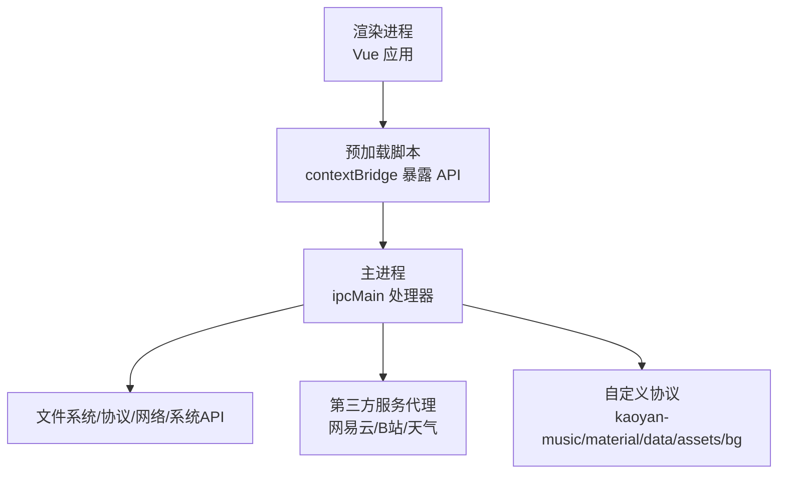
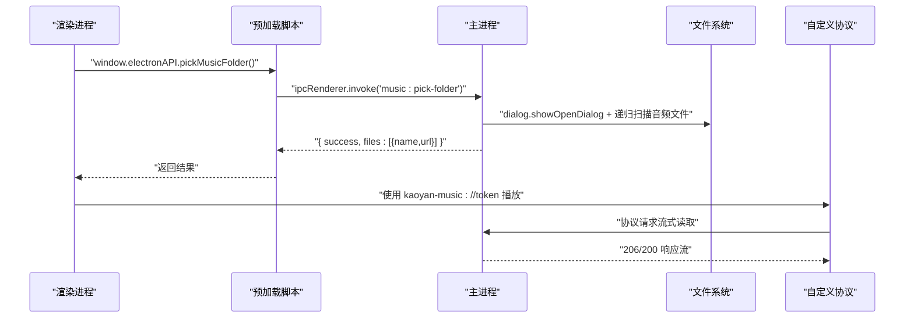
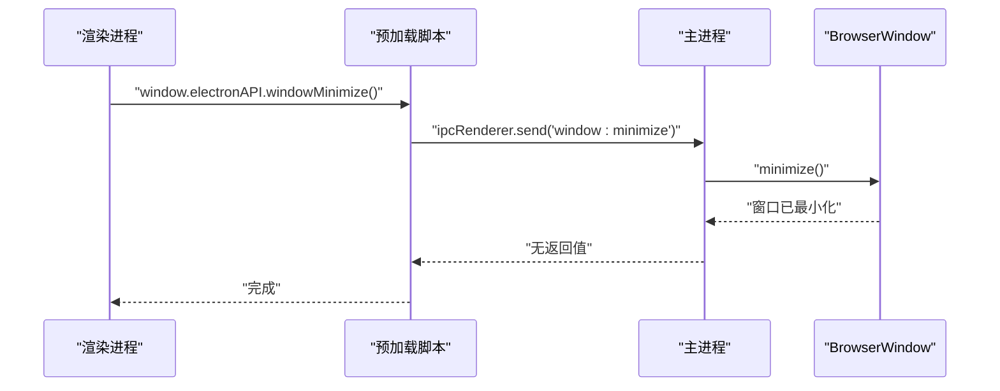
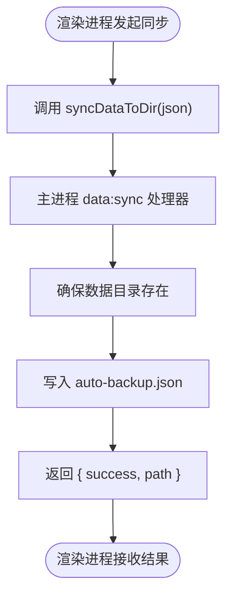
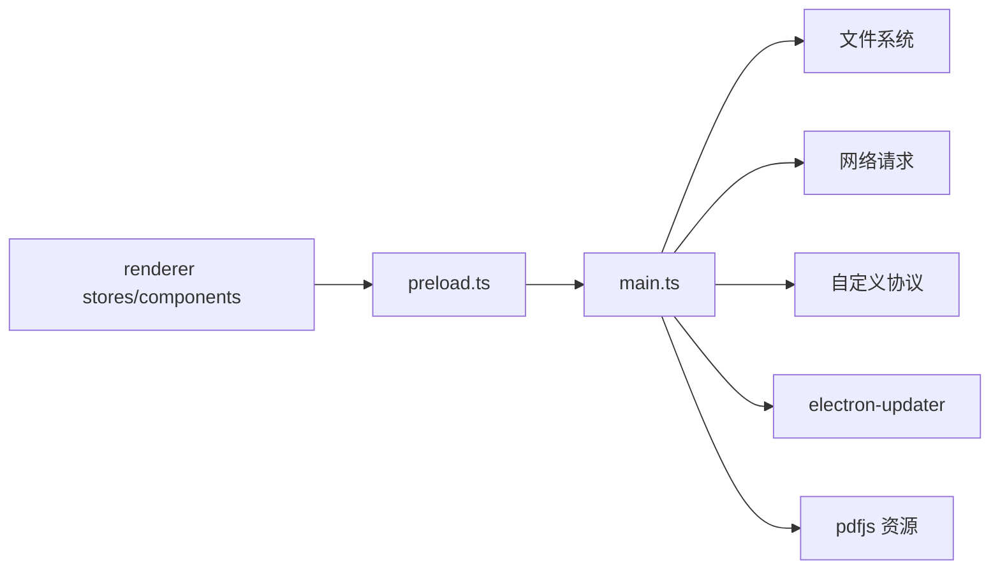

# IPC通信机制

<cite>
**本文引用的文件**
- [src/main/main.ts](file://src/main/main.ts)
- [src/preload/preload.ts](file://src/preload/preload.ts)
- [package.json](file://package.json)
- [vite.config.ts](file://vite.config.ts)
- [src/renderer/src/stores/music.ts](file://src/renderer/src/stores/music.ts)
- [src/renderer/src/components/TitleBar.vue](file://src/renderer/src/components/TitleBar.vue)
</cite>

## 目录
1. [简介](#简介)
2. [项目结构](#项目结构)
3. [核心组件](#核心组件)
4. [架构总览](#架构总览)
5. [详细组件分析](#详细组件分析)
6. [依赖关系分析](#依赖关系分析)
7. [性能考量](#性能考量)
8. [故障排查指南](#故障排查指南)
9. [结论](#结论)
10. [附录](#附录)

## 简介
本技术文档聚焦于该 Electron 应用的进程间通信（IPC）机制，系统阐述主进程与渲染进程之间的安全通信模式，包括 contextIsolation 与 nodeIntegration 的配置策略、preload 脚本的安全封装设计、以及各类 IPC 消息类型（窗口控制、文件系统操作、音乐播放、数据同步、第三方服务代理等）。文档还涵盖异步通信模式、错误处理机制、性能优化策略，并提供调用示例、最佳实践与常见问题解决方案，辅以通信流程图与数据流向图。

## 项目结构
本项目采用典型的 Electron 三层结构：
- 主进程（main）：负责应用生命周期、窗口管理、文件系统访问、协议注册、外部 API 代理、自动更新等。
- 预加载脚本（preload）：通过 contextBridge 暴露最小化、受控的 API 给渲染进程，避免直接暴露 Node/Electron 能力。
- 渲染进程（renderer）：基于 Vue 的前端界面，通过 window.electronAPI 调用主进程能力。

图表来源
- [src/main/main.ts:290-313](file://src/main/main.ts#L290-L313)
- [src/preload/preload.ts:1-98](file://src/preload/preload.ts#L1-L98)
- [src/main/main.ts:183-197](file://src/main/main.ts#L183-L197)

章节来源
- [src/main/main.ts:290-313](file://src/main/main.ts#L290-L313)
- [package.json:1-95](file://package.json#L1-L95)
- [vite.config.ts:1-39](file://vite.config.ts#L1-L39)

## 核心组件
- 安全隔离配置：主进程创建窗口时启用 contextIsolation=true、nodeIntegration=false，并通过 preload 注入受限 API。
- 预加载桥接：preload 使用 contextBridge.exposeInMainWorld 暴露 electronAPI，仅包含必要的 IPC 方法，屏蔽底层 ipcRenderer。
- 主进程 IPC 处理器：集中实现窗口控制、文件选择、数据目录管理、音乐与资料协议、第三方服务代理、PDF导出、自动更新等。
- 渲染进程调用：通过 window.electronAPI 调用具体功能，如音乐文件夹选择、在线歌曲搜索、登录状态检查等。

章节来源
- [src/main/main.ts:290-313](file://src/main/main.ts#L290-L313)
- [src/preload/preload.ts:1-98](file://src/preload/preload.ts#L1-L98)
- [src/renderer/src/stores/music.ts:74-91](file://src/renderer/src/stores/music.ts#L74-L91)
- [src/renderer/src/stores/music.ts:284-298](file://src/renderer/src/stores/music.ts#L284-L298)
- [src/renderer/src/components/TitleBar.vue:534-545](file://src/renderer/src/components/TitleBar.vue#L534-L545)

## 架构总览
下图展示从渲染进程到主进程的典型 IPC 调用链，以“选择音乐文件夹”为例：

图表来源
- [src/preload/preload.ts:23-26](file://src/preload/preload.ts#L23-L26)
- [src/main/main.ts:703-760](file://src/main/main.ts#L703-L760)
- [src/main/main.ts:407-477](file://src/main/main.ts#L407-L477)

章节来源
- [src/preload/preload.ts:23-26](file://src/preload/preload.ts#L23-L26)
- [src/main/main.ts:703-760](file://src/main/main.ts#L703-L760)
- [src/main/main.ts:407-477](file://src/main/main.ts#L407-L477)

## 详细组件分析

### 安全通信模式与配置策略
- 窗口安全配置：
  - contextIsolation: true，隔离渲染上下文，禁止直接访问 Node/Electron。
  - nodeIntegration: false，禁用渲染进程中的 Node 能力。
  - webSecurity: true，启用跨域与安全策略。
  - preload 指向编译后的预加载脚本，用于安全暴露 API。
- 预加载脚本职责：
  - 使用 contextBridge.exposeInMainWorld 暴露 electronAPI。
  - 所有方法均通过 ipcRenderer.invoke/send 转发到主进程，不暴露敏感对象。
  - 提供窗口控制、更新、数据目录、音乐/资料、第三方服务代理等接口。

章节来源
- [src/main/main.ts:290-313](file://src/main/main.ts#L290-L313)
- [src/preload/preload.ts:1-98](file://src/preload/preload.ts#L1-L98)

### 预加载脚本设计模式
- 最小权限原则：仅暴露必要方法，避免直接传递原始 ipcRenderer。
- 统一封装：将不同业务域（窗口、音乐、资料、天气、B站、网易云）的方法集中在 electronAPI 中，便于维护与审计。
- 事件订阅：通过 onUpdateEvent 订阅主进程推送的更新事件，渲染层无需轮询。

章节来源
- [src/preload/preload.ts:1-98](file://src/preload/preload.ts#L1-L98)

### 主进程 IPC 处理器分类与职责
- 窗口控制：最小化、最大化切换、关闭到托盘、全屏设置。
- 文件系统与数据目录：选择文件夹、恢复上次选择、打开目录、同步数据快照。
- 自定义协议：
  - kaoyan-bg：用户自定义背景图。
  - kaoyan-music：本地音乐流式播放，支持 Range 请求。
  - kaoyan-data：数据目录内备份 JSON 文件读取。
  - kaoyan-material：资料文件夹内 PDF/视频等文件读取，支持 Range。
  - kaoyan-assets：pdf.js 静态资源（CMap/标准字体），回环 HTTP 服务作为主通道。
- 第三方服务代理：
  - 网易云音乐：搜索、歌词、登录（二维码/手机号/Cookie）、歌单、评论、喜欢、排行榜、心动模式、云盘等。
  - 哔哩哔哩：登录、热门、相关、搜索、收藏夹、视频详情与播放地址。
  - 天气：中国天气网实况与预报聚合。
- 其他：PDF 导出、自动更新、GitHub 链接打开。

章节来源
- [src/main/main.ts:672-700](file://src/main/main.ts#L672-L700)
- [src/main/main.ts:703-839](file://src/main/main.ts#L703-L839)
- [src/main/main.ts:841-959](file://src/main/main.ts#L841-L959)
- [src/main/main.ts:961-973](file://src/main/main.ts#L961-L973)
- [src/main/main.ts:975-2101](file://src/main/main.ts#L975-L2101)
- [src/main/main.ts:2103-2499](file://src/main/main.ts#L2103-L2499)
- [src/main/main.ts:2501-2590](file://src/main/main.ts#L2501-L2590)
- [src/main/main.ts:2592-2724](file://src/main/main.ts#L2592-L2724)
- [src/main/main.ts:2726-2811](file://src/main/main.ts#L2726-L2811)

### 异步通信模式与错误处理
- 异步调用：
  - 渲染进程通过 ipcRenderer.invoke 调用主进程 handle，返回 Promise 形式的结果。
  - 主进程使用 async/await 处理 I/O 与网络请求，保证非阻塞。
- 错误处理：
  - 主进程每个 IPC 处理器均包裹 try/catch，返回 { success, ... } 结构，失败时附带 message。
  - 网络请求对 HTTP 状态码与业务 code 进行校验，异常抛出并捕获后转为结构化错误。
  - 协议处理器对非法路径或不存在文件返回 403/404/400，防止越权访问。
- 事件推送：
  - 主进程通过 webContents.send 向渲染进程推送更新事件（available/not-available/progress/downloaded/error）。
  - 预加载脚本在 onUpdateEvent 中订阅这些通道，渲染层统一回调处理。

章节来源
- [src/preload/preload.ts:91-97](file://src/preload/preload.ts#L91-L97)
- [src/main/main.ts:629-648](file://src/main/main.ts#L629-L648)
- [src/main/main.ts:1334-1401](file://src/main/main.ts#L1334-L1401)
- [src/main/main.ts:2592-2724](file://src/main/main.ts#L2592-L2724)

### 性能优化策略
- 流式读取：
  - 音乐与资料协议使用 fs.createReadStream + ReadableStream，支持 Range 请求，降低大文件内存占用。
  - highWaterMark 提升吞吐，减少系统调用次数。
- 白名单与令牌：
  - 通过 token -> 绝对路径映射限制访问范围，防止路径穿越。
  - 仅允许指定扩展名与子目录，严格校验根目录前缀。
- 资源缓存与回退：
  - pdf.js 静态资源优先通过回环 HTTP 服务（fetch 分支），失败回退至 kaoyan-assets:// 协议。
  - Cookie 持久化到磁盘，避免重复登录流程。
- 批量与分页：
  - 网易云/哔哩哔哩接口采用分页参数，减少单次响应体积。
  - 歌单播放按批次获取播放 URL（每次最多 20 首），避免一次性大量请求。

章节来源
- [src/main/main.ts:407-477](file://src/main/main.ts#L407-L477)
- [src/main/main.ts:542-615](file://src/main/main.ts#L542-L615)
- [src/main/main.ts:213-276](file://src/main/main.ts#L213-L276)
- [src/main/main.ts:714-732](file://src/main/main.ts#L714-L732)

### IPC 调用示例与最佳实践
- 窗口控制：
  - 渲染层调用 window.electronAPI.windowMinimize/windowToggleMaximize/windowCloseToTray/setFullscreen。
  - 主进程对应 ipcMain.on 处理器执行窗口操作。
- 音乐播放：
  - 渲染层调用 pickMusicFolder/restoreMusicFolder/readLyric/neteaseSearch/neteaseSongUrl/neteaseLyric。
  - 主进程返回文件清单与 kaoyan-music://token 地址，播放器直接使用协议流式播放。
- 数据同步：
  - 渲染层调用 getDataDir/setDataDir/openDataDir/syncDataToDir。
  - 主进程写入 auto-backup.json 并返回路径，供外部工具或备份策略使用。
- 最佳实践：
  - 始终通过 preload 暴露的最小 API 调用主进程，避免在渲染层直接访问 Node/Electron。
  - 对网络请求进行重试与降级（如 eapi/weapi 智能切换），提高鲁棒性。
  - 对大文件使用流式协议，避免内存峰值。
  - 对用户输入进行严格校验（URL 格式、路径白名单、扩展名过滤）。

章节来源
- [src/renderer/src/components/TitleBar.vue:534-545](file://src/renderer/src/components/TitleBar.vue#L534-L545)
- [src/renderer/src/stores/music.ts:74-91](file://src/renderer/src/stores/music.ts#L74-L91)
- [src/renderer/src/stores/music.ts:284-298](file://src/renderer/src/stores/music.ts#L284-L298)
- [src/preload/preload.ts:11-38](file://src/preload/preload.ts#L11-L38)
- [src/main/main.ts:672-700](file://src/main/main.ts#L672-L700)
- [src/main/main.ts:703-839](file://src/main/main.ts#L703-L839)
- [src/main/main.ts:2592-2724](file://src/main/main.ts#L2592-L2724)

### 通信流程图与数据流向图
- 窗口控制序列图：

图表来源
- [src/preload/preload.ts:11-14](file://src/preload/preload.ts#L11-L14)
- [src/main/main.ts:672-676](file://src/main/main.ts#L672-L676)

- 数据同步数据流向图：

图表来源
- [src/preload/preload.ts:90-90](file://src/preload/preload.ts#L90-L90)
- [src/main/main.ts:2646-2655](file://src/main/main.ts#L2646-L2655)

## 依赖关系分析
- 模块耦合：
  - 预加载脚本与主进程通过 IPC 解耦，仅依赖方法名契约。
  - 主进程内部按功能域划分处理器，耦合度低，便于扩展。
- 外部依赖：
  - electron-updater：应用更新。
  - pdfjs-dist：PDF 渲染（通过 kaoyan-assets 协议与回环 HTTP 服务提供静态资源）。
  - 第三方 API：网易云、哔哩哔哩、中国天气网。
- 潜在循环依赖：
  - 未发现代码级循环导入；协议与处理器之间通过函数调用与事件驱动，避免循环。

图表来源
- [src/preload/preload.ts:1-98](file://src/preload/preload.ts#L1-L98)
- [src/main/main.ts:183-197](file://src/main/main.ts#L183-L197)
- [package.json:19-32](file://package.json#L19-L32)

章节来源
- [src/preload/preload.ts:1-98](file://src/preload/preload.ts#L1-L98)
- [src/main/main.ts:183-197](file://src/main/main.ts#L183-L197)
- [package.json:19-32](file://package.json#L19-L32)

## 性能考量
- 大文件播放：使用流式协议与 Range 请求，避免全量加载导致内存溢出。
- 资源加载：pdf.js 静态资源通过回环 HTTP 服务走 fetch 分支，提升稳定性与缓存效果。
- 网络请求：智能降级（eapi/weapi）与分页拉取，减少失败率与响应体积。
- 批处理：歌单播放按批次获取播放 URL，避免一次性过多请求。
- 缓存：Cookie 持久化，减少重复登录开销。

[本节为通用指导，不直接分析具体文件]

## 故障排查指南
- 常见错误与定位：
  - 协议 403/404：检查 token 是否有效、路径是否在白名单内、文件是否存在。
  - 网络请求失败：查看主进程日志，确认 IP/UA/Cookie 是否正确，尝试降级到备用接口。
  - 播放失败：在线歌曲 URL 过期时自动刷新重试；本地文件需确认扩展名与路径。
  - PDF 渲染失败：确认 kaoyan-assets 协议与回环 HTTP 服务是否正常启动。
- 调试建议：
  - 在主进程处理器中添加日志输出，记录入参与异常堆栈。
  - 在渲染层监听错误事件，提示用户并记录上下文。
  - 使用 DevTools 检查网络请求与协议响应。

章节来源
- [src/main/main.ts:407-477](file://src/main/main.ts#L407-L477)
- [src/main/main.ts:542-615](file://src/main/main.ts#L542-L615)
- [src/main/main.ts:213-276](file://src/main/main.ts#L213-L276)
- [src/main/main.ts:1334-1401](file://src/main/main.ts#L1334-L1401)

## 结论
本项目通过严格的上下文隔离与最小权限的预加载脚本，实现了安全、可控的主进程与渲染进程通信。主进程集中处理文件系统、协议、网络与系统能力，渲染进程仅通过受限 API 调用，降低了安全风险。结合流式协议、白名单令牌、智能降级与批处理等优化策略，系统在性能与稳定性方面表现良好。未来可继续完善错误上报、监控与测试覆盖，进一步提升用户体验与可维护性。

[本节为总结性内容，不直接分析具体文件]

## 附录
- 构建与开发：
  - Vite 配置将 renderer 输出至 dist/renderer，主进程入口为 dist/main/main.js。
  - 开发环境通过 vite dev 启动前端，Electron 加载 localhost:5173。
- 打包产物：
  - extraResources 包含托盘图标等资源。
  - publish 配置指向 GitHub Releases，支持自动更新。

章节来源
- [vite.config.ts:1-39](file://vite.config.ts#L1-L39)
- [package.json:1-95](file://package.json#L1-L95)