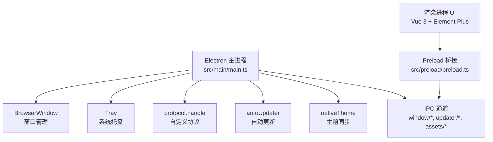
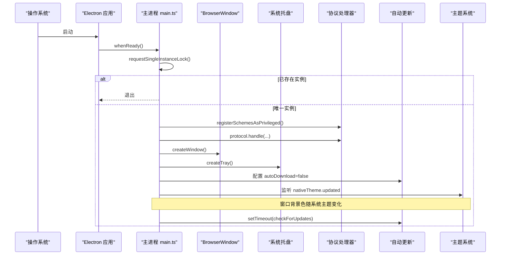
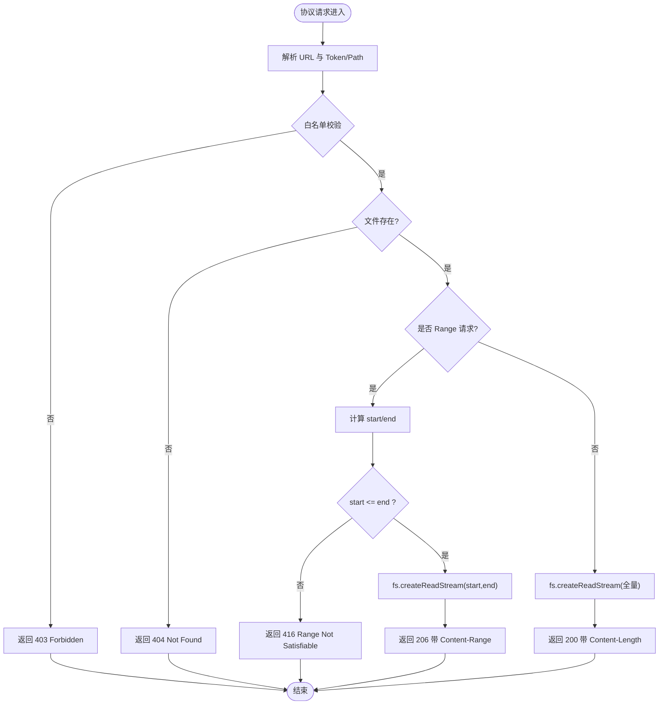
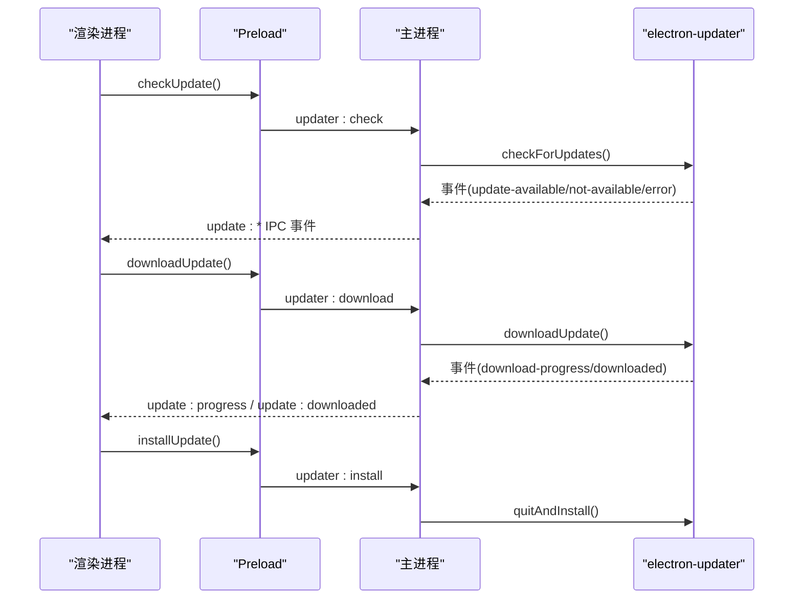
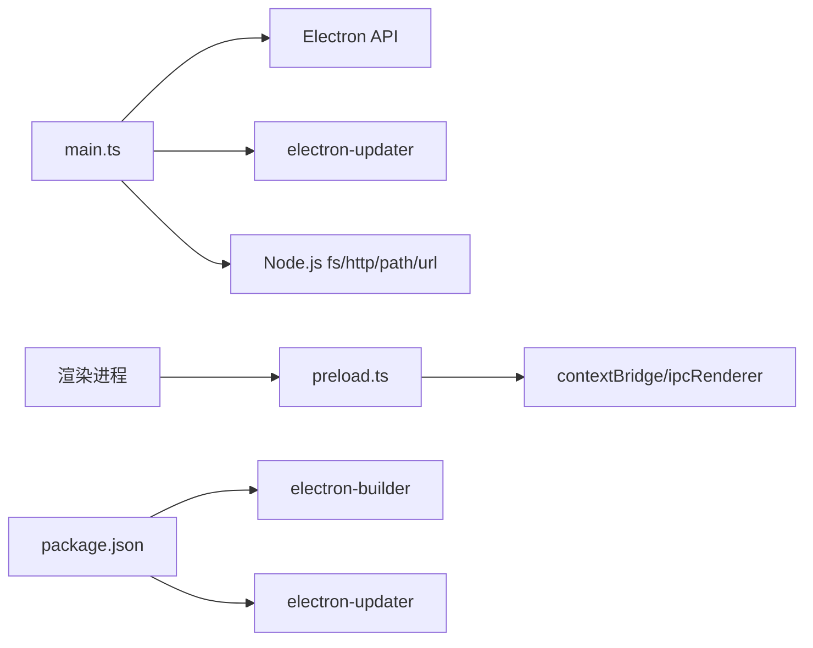

# 主进程架构

<cite>
**本文引用的文件**
- [src/main/main.ts](file://src/main/main.ts)
- [src/preload/preload.ts](file://src/preload/preload.ts)
- [package.json](file://package.json)
- [README.md](file://README.md)
</cite>

## 目录
1. [简介](#简介)
2. [项目结构](#项目结构)
3. [核心组件](#核心组件)
4. [架构总览](#架构总览)
5. [详细组件分析](#详细组件分析)
6. [依赖关系分析](#依赖关系分析)
7. [性能考虑](#性能考虑)
8. [故障排查指南](#故障排查指南)
9. [结论](#结论)
10. [附录](#附录)

## 简介
本文件聚焦 Electron 主进程的架构与实现，围绕应用生命周期管理、窗口控制、系统托盘集成、自定义协议注册与安全机制、自动更新、单实例锁、主题同步等系统级能力展开。重点解析以下自定义协议：kaoyan-bg、kaoyan-music、kaoyan-data、kaoyan-material、kaoyan-assets，并说明其白名单校验、流式读取优化、Range 请求处理等关键技术点。同时给出主进程启动流程图与关键模块交互图，帮助读者快速理解整体设计与实现细节。

## 项目结构
- 主进程入口位于 src/main/main.ts，负责：
  - 应用生命周期（ready/activate/window-all-closed/before-quit）
  - 窗口创建与管理（无边框窗口、关闭行为、全屏切换）
  - 系统托盘（图标、菜单、双击恢复窗口、首次隐藏提示）
  - 自定义协议注册与处理器（背景、音乐、数据、资料、静态资源）
  - 自动更新（electron-updater）事件桥接
  - 单实例锁（避免重复启动）
  - 主题同步（跟随系统深浅主题）
  - IPC 通道暴露（窗口控制、更新、文件夹选择、资源服务基址等）
- Preload 层在 src/preload/preload.ts 中通过 contextBridge 安全暴露 API 给渲染进程。
- 构建与打包配置在 package.json，包含 electron-updater 发布源、extraResources（托盘图标）、多平台目标等。
- README 提供技术栈概览、功能清单、运行方式与目录结构说明。

图表来源
- [src/main/main.ts:290-327](file://src/main/main.ts#L290-L327)
- [src/main/main.ts:344-377](file://src/main/main.ts#L344-L377)
- [src/main/main.ts:191-197](file://src/main/main.ts#L191-L197)
- [src/main/main.ts:625-648](file://src/main/main.ts#L625-L648)
- [src/main/main.ts:620-623](file://src/main/main.ts#L620-L623)
- [src/preload/preload.ts:1-98](file://src/preload/preload.ts#L1-L98)

章节来源
- [src/main/main.ts:290-327](file://src/main/main.ts#L290-L327)
- [src/main/main.ts:344-377](file://src/main/main.ts#L344-L377)
- [src/main/main.ts:191-197](file://src/main/main.ts#L191-L197)
- [src/main/main.ts:625-648](file://src/main/main.ts#L625-L648)
- [src/main/main.ts:620-623](file://src/main/main.ts#L620-L623)
- [src/preload/preload.ts:1-98](file://src/preload/preload.ts#L1-L98)
- [package.json:1-95](file://package.json#L1-L95)
- [README.md:111-130](file://README.md#L111-L130)

## 核心组件
- 应用生命周期与单实例锁
  - 使用 app.requestSingleInstanceLock() 确保仅一个实例运行；若获取失败直接退出。
  - 监听 second-instance 将已有窗口置顶并显示。
  - ready/activate/window-all-closed/before-quit 组合控制窗口与退出行为。
- 窗口控制
  - 无边框窗口，关闭按钮默认隐藏到托盘而非退出；支持最小化、最大化切换、强制全屏。
  - 通过 IPC 暴露 window:minimize、window:toggle-maximize、window:close-to-tray、window:set-fullscreen。
- 系统托盘
  - 托盘图标来自 resources/tray-icon.png（开发/生产路径不同）。
  - 菜单项：显示主窗口、退出应用；双击托盘图标恢复窗口；首次隐藏时展示气泡提示（Windows）。
- 自定义协议与安全
  - 注册 kaoyan-bg、kaoyan-music、kaoyan-data、kaoyan-material、kaoyan-assets 五种私有协议，启用标准、安全、fetchAPI、部分启用 stream/corsEnabled。
  - 白名单与范围限制：
    - 音乐与资料：token 映射绝对路径，严格校验 resolved 路径是否属于所选根目录，防止越权访问。
    - 数据协议：仅允许 dataDir 下的 .json 备份文件，文件名正则匹配。
    - 背景协议：仅返回用户自定义背景文件（不存在则 404）。
    - 静态资源协议：仅允许 pdfjs 子目录，防路径穿越。
  - Range 请求：音乐与资料协议完整支持 HTTP Range，返回 206 Partial Content，便于视频拖动进度与按需加载。
  - MIME 类型：根据扩展名设置正确的 Content-Type，保障播放器/阅读器正确解码。
- 自动更新
  - 基于 electron-updater，禁用自动下载，由用户在设置页触发检测/下载/安装。
  - 启动后延迟静默检查更新，失败不干扰用户；事件通过 IPC 推送至渲染进程。
- 主题同步
  - 监听 nativeTheme.updated，动态调整窗口背景色，避免深色主题下闪烁或冲突。
- 回环 HTTP 资源服务
  - 为 pdf.js 的 CMap/标准字体提供 http://127.0.0.1 回环服务，绑定本地地址，路径白名单限制为 pdfjs/cmaps 与 standard_fonts。
  - 通过 IPC 暴露 assets:get-base-url，供渲染进程优先走 fetch 分支，提升稳定性。

章节来源
- [src/main/main.ts:379-391](file://src/main/main.ts#L379-L391)
- [src/main/main.ts:290-327](file://src/main/main.ts#L290-L327)
- [src/main/main.ts:344-377](file://src/main/main.ts#L344-L377)
- [src/main/main.ts:191-197](file://src/main/main.ts#L191-L197)
- [src/main/main.ts:407-477](file://src/main/main.ts#L407-L477)
- [src/main/main.ts:480-495](file://src/main/main.ts#L480-L495)
- [src/main/main.ts:504-532](file://src/main/main.ts#L504-L532)
- [src/main/main.ts:542-615](file://src/main/main.ts#L542-L615)
- [src/main/main.ts:625-648](file://src/main/main.ts#L625-L648)
- [src/main/main.ts:620-623](file://src/main/main.ts#L620-L623)
- [src/main/main.ts:213-276](file://src/main/main.ts#L213-L276)

## 架构总览
下图展示了主进程启动流程与各子系统之间的交互关系，包括单实例锁、窗口创建、托盘初始化、协议注册、自动更新与主题同步。

图表来源
- [src/main/main.ts:379-391](file://src/main/main.ts#L379-L391)
- [src/main/main.ts:191-197](file://src/main/main.ts#L191-L197)
- [src/main/main.ts:393-657](file://src/main/main.ts#L393-L657)
- [src/main/main.ts:620-623](file://src/main/main.ts#L620-L623)
- [src/main/main.ts:625-648](file://src/main/main.ts#L625-L648)

## 详细组件分析

### 自定义协议与安全机制
- 协议注册
  - 使用 protocol.registerSchemesAsPrivileged 注册五种私有协议，启用 secure、standard、supportFetchAPI，部分启用 stream 与 corsEnabled。
- 白名单验证
  - 音乐与资料：以 token 作为临时标识，建立 token -> 绝对路径映射；请求时校验 resolved 路径是否属于所选根目录，防止越界访问。
  - 数据协议：仅允许 dataDir 下的 .json 文件，文件名正则匹配，避免任意文件读取。
  - 背景协议：仅返回用户自定义背景文件，不存在则 404。
  - 静态资源协议：仅允许 pdfjs 子目录，防路径穿越。
- Range 请求处理
  - 音乐与资料协议解析 Range 头，计算 start/end，返回 206 Partial Content，附带 Content-Range/Accept-Ranges 头，支持视频拖动与分片加载。
- MIME 类型
  - 根据扩展名设置正确的 Content-Type，保障播放器/阅读器正确解码。
- 回环 HTTP 服务
  - 为 pdf.js 提供 http://127.0.0.1 的资源服务，绑定本地地址，路径白名单限制为 pdfjs/cmaps 与 standard_fonts，CORS 放行预检与 GET/HEAD。

图表来源
- [src/main/main.ts:407-477](file://src/main/main.ts#L407-L477)
- [src/main/main.ts:542-615](file://src/main/main.ts#L542-L615)
- [src/main/main.ts:101-134](file://src/main/main.ts#L101-L134)

章节来源
- [src/main/main.ts:191-197](file://src/main/main.ts#L191-L197)
- [src/main/main.ts:407-477](file://src/main/main.ts#L407-L477)
- [src/main/main.ts:480-495](file://src/main/main.ts#L480-L495)
- [src/main/main.ts:504-532](file://src/main/main.ts#L504-L532)
- [src/main/main.ts:542-615](file://src/main/main.ts#L542-L615)
- [src/main/main.ts:101-134](file://src/main/main.ts#L101-L134)

### 自动更新机制
- 配置
  - 禁用自动下载，启用应用退出时自动安装。
- 事件桥接
  - update-available/update-not-available/download-progress/update-downloaded/error 事件通过 IPC 发送至渲染进程，用于 UI 展示进度与状态。
- 启动检查
  - 启动后延迟 5 秒静默检查更新，失败不干扰用户。
- 用户操作
  - 设置页提供检测、下载、安装更新的入口，调用对应 IPC 接口。

图表来源
- [src/main/main.ts:625-648](file://src/main/main.ts#L625-L648)
- [src/main/main.ts:2781-2804](file://src/main/main.ts#L2781-L2804)
- [src/preload/preload.ts:16-18](file://src/preload/preload.ts#L16-L18)

章节来源
- [src/main/main.ts:625-648](file://src/main/main.ts#L625-L648)
- [src/main/main.ts:2781-2804](file://src/main/main.ts#L2781-L2804)
- [src/preload/preload.ts:16-18](file://src/preload/preload.ts#L16-L18)

### 单实例锁与窗口控制
- 单实例锁
  - 使用 app.requestSingleInstanceLock() 保证唯一实例；若失败直接退出。
  - 监听 second-instance，将已有窗口恢复并聚焦。
- 窗口控制
  - 无边框窗口，关闭按钮默认隐藏到托盘；支持最小化、最大化切换、强制全屏。
  - 通过 IPC 暴露 window:minimize、window:toggle-maximize、window:close-to-tray、window:set-fullscreen。

章节来源
- [src/main/main.ts:379-391](file://src/main/main.ts#L379-L391)
- [src/main/main.ts:672-699](file://src/main/main.ts#L672-L699)

### 主题同步
- 监听 nativeTheme.updated，动态调整窗口背景色，避免深色主题下闪烁或冲突。
- 窗口背景色函数根据 shouldUseDarkColors 返回不同颜色。

章节来源
- [src/main/main.ts:285-288](file://src/main/main.ts#L285-L288)
- [src/main/main.ts:620-623](file://src/main/main.ts#L620-L623)

### 系统托盘集成
- 托盘图标路径适配开发与生产环境。
- 菜单项：显示主窗口、退出应用；双击托盘图标恢复窗口。
- 首次隐藏到托盘时展示气泡提示（Windows），引导用户理解行为。

章节来源
- [src/main/main.ts:278-283](file://src/main/main.ts#L278-L283)
- [src/main/main.ts:329-342](file://src/main/main.ts#L329-L342)
- [src/main/main.ts:344-377](file://src/main/main.ts#L344-L377)

### 文件白名单验证与流式读取优化
- 白名单验证
  - 音乐与资料：token 映射绝对路径，严格校验 resolved 路径是否属于所选根目录。
  - 数据协议：仅允许 dataDir 下的 .json 文件，文件名正则匹配。
  - 静态资源协议：仅允许 pdfjs 子目录，防路径穿越。
- 流式读取优化
  - 使用 fs.createReadStream 配合 ReadableStream 将 Node 流转换为 Web 流，避免一次性加载大文件导致内存峰值。
  - 设置 highWaterMark 提升大文件读取吞吐量（资料协议 512KB）。
  - Range 请求支持 206 Partial Content，便于视频拖动进度与按需加载。

章节来源
- [src/main/main.ts:407-477](file://src/main/main.ts#L407-L477)
- [src/main/main.ts:542-615](file://src/main/main.ts#L542-L615)
- [src/main/main.ts:101-134](file://src/main/main.ts#L101-L134)

### 调试方法
- 主进程未捕获异常与 Promise 拒绝统一记录，避免崩溃弹窗。
- 开发模式打开 DevTools，便于调试渲染进程。
- 设置页内置报错日志收集与导出，便于定位问题。

章节来源
- [src/main/main.ts:8-14](file://src/main/main.ts#L8-L14)
- [src/main/main.ts:308-313](file://src/main/main.ts#L308-L313)
- [README.md:254-281](file://README.md#L254-L281)

## 依赖关系分析
- 主进程依赖
  - Electron：app、BrowserWindow、ipcMain、dialog、nativeTheme、protocol、net、Tray、Menu、nativeImage、shell、session。
  - electron-updater：自动更新。
  - Node.js：path、fs、http、url。
- Preload 依赖
  - contextBridge、ipcRenderer：安全暴露 API 给渲染进程。
- 构建与打包
  - electron-builder：多平台打包、extraResources（托盘图标）、publish 配置（GitHub Releases）。

图表来源
- [src/main/main.ts:1-6](file://src/main/main.ts#L1-L6)
- [src/preload/preload.ts:1-2](file://src/preload/preload.ts#L1-L2)
- [package.json:19-44](file://package.json#L19-L44)
- [package.json:45-95](file://package.json#L45-L95)

章节来源
- [src/main/main.ts:1-6](file://src/main/main.ts#L1-L6)
- [src/preload/preload.ts:1-2](file://src/preload/preload.ts#L1-L2)
- [package.json:19-44](file://package.json#L19-L44)
- [package.json:45-95](file://package.json#L45-L95)

## 性能考虑
- 流式读取
  - 音乐与资料协议采用 fs.createReadStream + ReadableStream，避免一次性加载大文件，降低内存占用。
  - 资料协议设置 highWaterMark 为 512KB，减少系统调用次数，提升吞吐。
- Range 请求
  - 支持 206 Partial Content，便于视频拖动进度与按需加载，减少带宽与时间。
- 资源服务
  - 回环 HTTP 服务绑定 127.0.0.1，路径白名单限制，避免不必要的安全风险与性能损耗。
- 主题与窗口
  - 动态背景色避免闪烁；无边框窗口减少原生开销。
- 更新策略
  - 延迟静默检查更新，避免启动阻塞；用户手动触发下载与安装，体验可控。

[本节为通用性能讨论，无需特定文件引用]

## 故障排查指南
- 主进程异常
  - 未捕获异常与 Promise 拒绝统一记录，避免崩溃弹窗，便于定位问题。
- 协议访问失败
  - 检查白名单与路径校验逻辑，确认 token 有效且文件存在于根目录下。
  - 检查 MIME 类型是否正确，确保播放器/阅读器能正确解码。
- 视频无法拖动
  - 确认 Range 请求处理正常，返回 206 与 Content-Range 头。
- 自动更新失败
  - 检查网络与 GitHub Releases 配置；开发环境无打包产物会抛错，属预期。
- 主题闪烁
  - 确认 nativeTheme.updated 监听生效，窗口背景色随系统主题变化。

章节来源
- [src/main/main.ts:8-14](file://src/main/main.ts#L8-L14)
- [src/main/main.ts:407-477](file://src/main/main.ts#L407-L477)
- [src/main/main.ts:542-615](file://src/main/main.ts#L542-L615)
- [src/main/main.ts:625-648](file://src/main/main.ts#L625-L648)
- [src/main/main.ts:620-623](file://src/main/main.ts#L620-L623)

## 结论
本主进程实现了完整的 Electron 桌面应用核心能力：应用生命周期管理、窗口控制、系统托盘集成、自定义协议安全访问、自动更新、单实例锁、主题同步与回环资源服务。通过白名单验证、流式读取与 Range 请求处理，保障了大文件播放与阅读的性能与安全性。结合 Preload 层的 IPC 桥接，渲染进程可安全地调用主进程能力，形成稳定、高效、可扩展的主进程架构。

[本节为总结性内容，无需特定文件引用]

## 附录
- 技术栈与版本
  - Electron 28、Vue 3、Element Plus、pdfjs-dist、electron-updater 等。
- 构建与发布
  - electron-builder 多平台打包，GitHub Releases 发布更新源。
- 文档参考
  - README 提供技术架构、运行部署与目录结构说明。

章节来源
- [package.json:19-44](file://package.json#L19-L44)
- [package.json:45-95](file://package.json#L45-L95)
- [README.md:111-130](file://README.md#L111-L130)