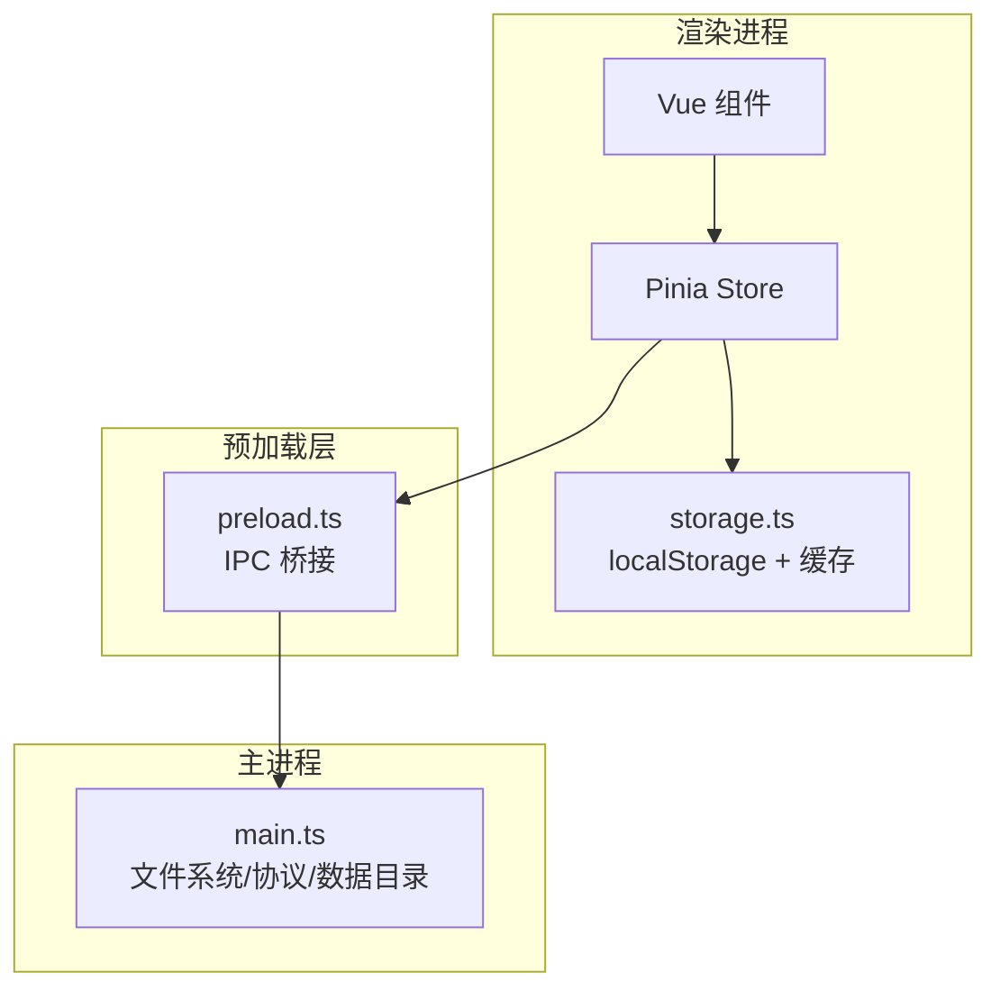
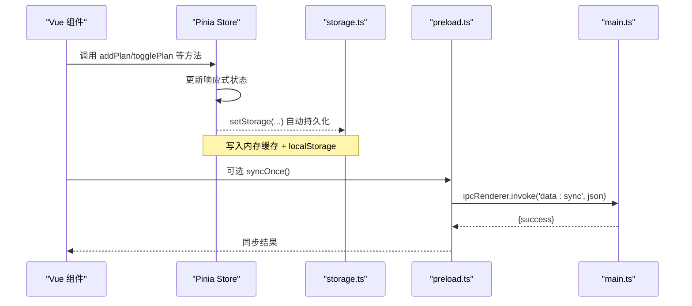
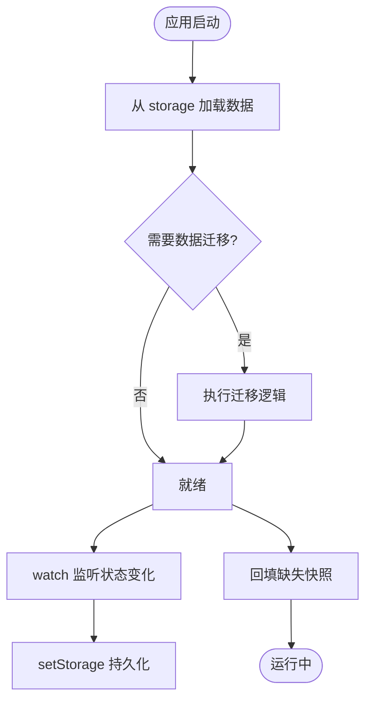
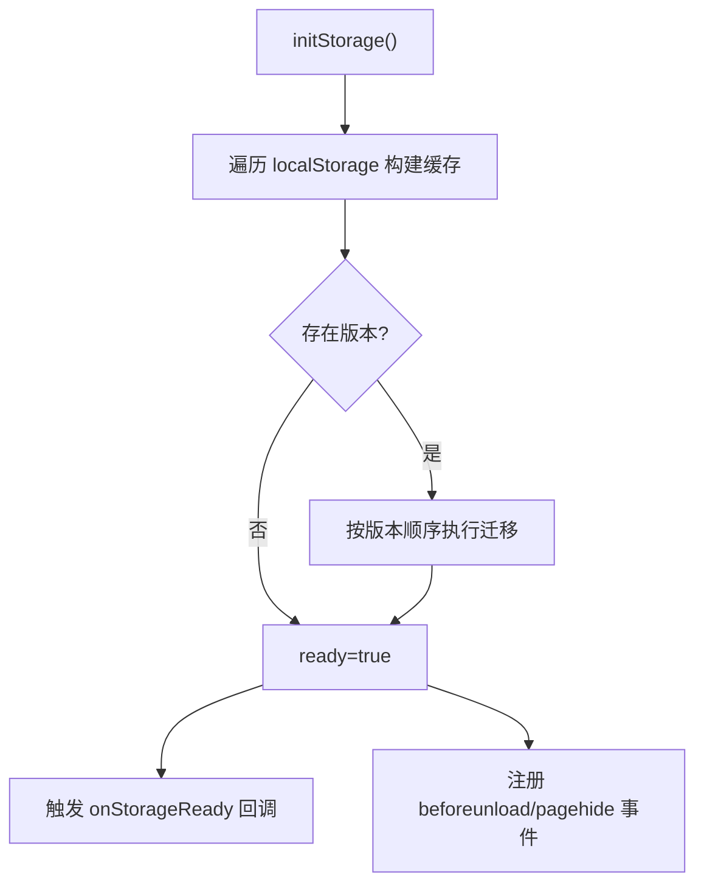
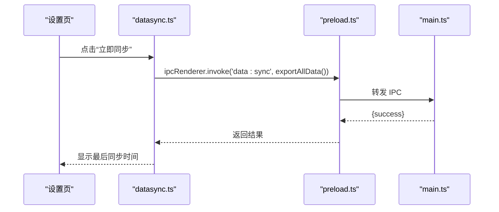
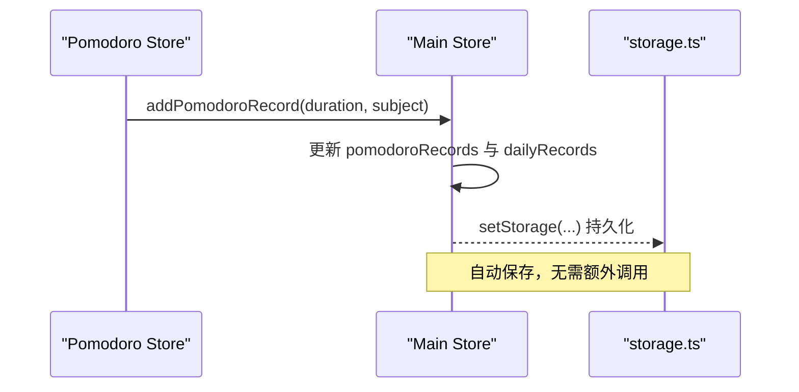
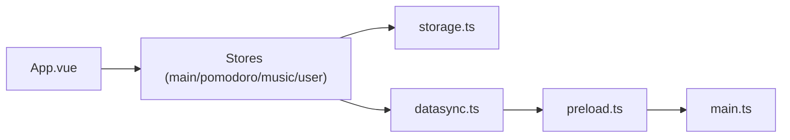

# 数据流设计

<cite>
**本文引用的文件**
- [src/renderer/src/stores/index.ts](file://src/renderer/src/stores/index.ts)
- [src/renderer/src/utils/storage.ts](file://src/renderer/src/utils/storage.ts)
- [src/renderer/src/utils/datasync.ts](file://src/renderer/src/utils/datasync.ts)
- [src/preload/preload.ts](file://src/preload/preload.ts)
- [src/main/main.ts](file://src/main/main.ts)
- [src/renderer/src/stores/pomodoro.ts](file://src/renderer/src/stores/pomodoro.ts)
- [src/renderer/src/stores/music.ts](file://src/renderer/src/stores/music.ts)
- [src/renderer/src/stores/user.ts](file://src/renderer/src/stores/user.ts)
- [src/renderer/src/App.vue](file://src/renderer/src/App.vue)
- [src/renderer/src/views/Dashboard.vue](file://src/renderer/src/views/Dashboard.vue)
</cite>

## 目录
1. [简介](#简介)
2. [项目结构](#项目结构)
3. [核心组件](#核心组件)
4. [架构总览](#架构总览)
5. [详细组件分析](#详细组件分析)
6. [依赖关系分析](#依赖关系分析)
7. [性能与内存管理](#性能与内存管理)
8. [故障排查指南](#故障排查指南)
9. [结论](#结论)
10. [附录：API 与数据模型](#附录api-与数据模型)

## 简介
本文件面向“考研助手”应用的数据流设计，覆盖从用户界面到数据存储的完整路径：Vue 组件状态变化 → Pinia Store 更新 → 本地存储持久化（localStorage）→ 可选的数据目录备份（Electron 主进程）。文档同时说明数据迁移、版本兼容、完整性保证、缓存策略、性能优化与错误恢复机制，并提供数据流转图与状态变更时序图。

## 项目结构
- 渲染层（Vue + Pinia）：负责 UI 交互、状态管理与业务逻辑。
- 预加载层（preload）：暴露 IPC API，桥接渲染进程与主进程。
- 主进程（Electron）：提供文件系统、协议、托盘、自动更新等能力，并实现数据目录同步与资源访问。
- 本地存储：使用 localStorage 作为实时持久化介质；通过迁移机制保障版本兼容。
- 数据目录：支持手动/定时将全量数据导出为 JSON 快照至自定义目录（当前默认关闭自动同步）。

**图表来源**
- [src/renderer/src/stores/index.ts:219-699](file://src/renderer/src/stores/index.ts#L219-L699)
- [src/renderer/src/utils/storage.ts:144-188](file://src/renderer/src/utils/storage.ts#L144-L188)
- [src/preload/preload.ts:1-98](file://src/preload/preload.ts#L1-L98)
- [src/main/main.ts:19-81](file://src/main/main.ts#L19-L81)

**章节来源**
- [src/renderer/src/stores/index.ts:219-699](file://src/renderer/src/stores/index.ts#L219-L699)
- [src/renderer/src/utils/storage.ts:144-188](file://src/renderer/src/utils/storage.ts#L144-L188)
- [src/preload/preload.ts:1-98](file://src/preload/preload.ts#L1-L98)
- [src/main/main.ts:19-81](file://src/main/main.ts#L19-L81)

## 核心组件
- 主 Store（useMainStore）：集中管理计划、番茄记录、真题成绩、学习统计、科目进度、设置等核心数据，并通过 watch 自动持久化。
- 存储层（storage.ts）：封装 localStorage 读写、内存缓存、数据版本迁移、账号隔离、导入导出、容量不足清理。
- 数据同步（datasync.ts）：管理数据目录路径、手动同步、自动同步开关（已关闭）。
- 预加载（preload.ts）：向渲染进程暴露 electronAPI，用于调用主进程能力（如数据目录操作、网易云/B站接口代理、系统功能）。
- 主进程（main.ts）：注册协议、处理数据目录、文件白名单、PDF/音乐流式读取、自动备份文件路径等。
- 其他 Store：Pomodoro（计时与提醒）、Music（播放与在线源）、User（账号与会话）。

**章节来源**
- [src/renderer/src/stores/index.ts:219-699](file://src/renderer/src/stores/index.ts#L219-L699)
- [src/renderer/src/utils/storage.ts:144-188](file://src/renderer/src/utils/storage.ts#L144-L188)
- [src/renderer/src/utils/datasync.ts:1-108](file://src/renderer/src/utils/datasync.ts#L1-L108)
- [src/preload/preload.ts:1-98](file://src/preload/preload.ts#L1-L98)
- [src/main/main.ts:19-81](file://src/main/main.ts#L19-L81)

## 架构总览
下图展示一次典型的用户操作（例如添加计划或完成计划）在系统中的数据流转：UI 触发 Store 方法 → Store 修改响应式状态 → watch 触发持久化 → storage 写入 localStorage → 可选地通过 Electron 主进程导出到数据目录。

**图表来源**
- [src/renderer/src/stores/index.ts:400-502](file://src/renderer/src/stores/index.ts#L400-L502)
- [src/renderer/src/utils/storage.ts:227-246](file://src/renderer/src/utils/storage.ts#L227-L246)
- [src/renderer/src/utils/datasync.ts:68-82](file://src/renderer/src/utils/datasync.ts#L68-L82)
- [src/preload/preload.ts:86-90](file://src/preload/preload.ts#L86-L90)
- [src/main/main.ts:479-495](file://src/main/main.ts#L479-L495)

## 详细组件分析

### 主 Store（useMainStore）
- 职责：定义数据模型（计划、卡片、番茄记录、真题成绩、每日记录、计划快照、科目进度等），提供增删改查方法，计算属性聚合统计，watch 自动持久化。
- 关键流程：
  - 初始化时从 storage 读取默认值或历史数据。
  - 启动时执行旧数据结构迁移（如 408 子科目合并为 cs408）。
  - 监听所有关键数组/对象变化，调用对应 saveXxx 写入 storage。
  - 启动时回填缺失的计划快照，防止异常退出导致历史记录丢失。
  - 提供全局错误日志收集与清理。

**图表来源**
- [src/renderer/src/stores/index.ts:139-217](file://src/renderer/src/stores/index.ts#L139-L217)
- [src/renderer/src/stores/index.ts:615-651](file://src/renderer/src/stores/index.ts#L615-L651)

**章节来源**
- [src/renderer/src/stores/index.ts:219-699](file://src/renderer/src/stores/index.ts#L219-L699)

### 存储层（storage.ts）
- 职责：统一 localStorage 读写、内存缓存、数据版本迁移、账号隔离、导入导出、容量不足清理、退出前强制 flush。
- 关键点：
  - 启动时扫描 localStorage，构建内存缓存，执行版本迁移，触发就绪回调。
  - get/set/remove 均带用户前缀（游客/已登录用户），实现多用户数据隔离。
  - beforeunload/pagehide 双保险确保退出时数据落盘。
  - 容量不足时优先清理非关键数据（历史快照、记录等）。
  - 提供 export/import 全量数据能力，便于备份与迁移。

**图表来源**
- [src/renderer/src/utils/storage.ts:144-188](file://src/renderer/src/utils/storage.ts#L144-L188)
- [src/renderer/src/utils/storage.ts:227-246](file://src/renderer/src/utils/storage.ts#L227-L246)
- [src/renderer/src/utils/storage.ts:298-323](file://src/renderer/src/utils/storage.ts#L298-L323)

**章节来源**
- [src/renderer/src/utils/storage.ts:144-188](file://src/renderer/src/utils/storage.ts#L144-L188)
- [src/renderer/src/utils/storage.ts:227-246](file://src/renderer/src/utils/storage.ts#L227-L246)
- [src/renderer/src/utils/storage.ts:298-323](file://src/renderer/src/utils/storage.ts#L298-L323)

### 数据同步（datasync.ts）
- 职责：管理数据目录路径、手动立即同步、自动同步开关（当前已关闭）。
- 现状：
  - 自动同步定时器已禁用，保留手动同步入口。
  - 通过 preload 调用主进程的 data:sync 通道，将全量数据以 JSON 形式写入数据目录。

**图表来源**
- [src/renderer/src/utils/datasync.ts:68-82](file://src/renderer/src/utils/datasync.ts#L68-L82)
- [src/preload/preload.ts:86-90](file://src/preload/preload.ts#L86-L90)
- [src/main/main.ts:479-495](file://src/main/main.ts#L479-L495)

**章节来源**
- [src/renderer/src/utils/datasync.ts:1-108](file://src/renderer/src/utils/datasync.ts#L1-L108)
- [src/preload/preload.ts:86-90](file://src/preload/preload.ts#L86-L90)
- [src/main/main.ts:479-495](file://src/main/main.ts#L479-L495)

### 预加载与主进程集成
- 预加载层暴露大量 IPC 接口，包括：
  - 数据目录：getDataDir、setDataDir、openDataDir、syncDataToDir。
  - 系统能力：窗口控制、自动更新、全屏、外部链接打开等。
  - 第三方服务：网易云、B站、天气等代理。
- 主进程实现：
  - 数据目录配置与迁移。
  - 私有协议：kaoyan-bg、kaoyan-music、kaoyan-data、kaoyan-material、kaoyan-assets。
  - 文件白名单与流式读取，避免大文件占用内存。
  - PDF 静态资源回环 HTTP 服务，解决离线/跨域问题。

**章节来源**
- [src/preload/preload.ts:1-98](file://src/preload/preload.ts#L1-L98)
- [src/main/main.ts:19-81](file://src/main/main.ts#L19-L81)
- [src/main/main.ts:183-276](file://src/main/main.ts#L183-L276)
- [src/main/main.ts:479-615](file://src/main/main.ts#L479-L615)

### 番茄钟与学习记录联动
- Pomodoro Store 负责计时、提醒、通知、声音与标题闪烁。
- 工作模式结束时，调用主 Store 的 addPomodoroRecord，从而：
  - 新增一条番茄记录（含日期、时长、科目）。
  - 触发 dailyRecords 更新（今日学习时长、番茄数）。
  - 通过 watch 自动持久化到 storage。

**图表来源**
- [src/renderer/src/stores/pomodoro.ts:112-161](file://src/renderer/src/stores/pomodoro.ts#L112-L161)
- [src/renderer/src/stores/index.ts:526-590](file://src/renderer/src/stores/index.ts#L526-L590)
- [src/renderer/src/stores/index.ts:615-624](file://src/renderer/src/stores/index.ts#L615-L624)

**章节来源**
- [src/renderer/src/stores/pomodoro.ts:112-161](file://src/renderer/src/stores/pomodoro.ts#L112-L161)
- [src/renderer/src/stores/index.ts:526-590](file://src/renderer/src/stores/index.ts#L526-L590)

### 用户与账号隔离
- User Store 基于 storage 提供的账号管理能力：
  - 注册、登录、登出、删除账号。
  - 登录后切换用户前缀，实现数据隔离。
  - 支持将游客数据迁移到指定用户账号下。
- storage 层维护账号列表与当前用户，并在 get/set 时自动拼接前缀。

**章节来源**
- [src/renderer/src/stores/user.ts:1-86](file://src/renderer/src/stores/user.ts#L1-L86)
- [src/renderer/src/utils/storage.ts:203-246](file://src/renderer/src/utils/storage.ts#L203-L246)
- [src/renderer/src/utils/storage.ts:325-443](file://src/renderer/src/utils/storage.ts#L325-L443)

### 视图与状态绑定示例（Dashboard）
- Dashboard 通过 computed 与 store 的计算属性展示：
  - 今日学习小时、番茄数、计划完成进度、累计学习时长、应用使用时长。
  - 各科目学习时长与进度条。
- 用户交互（勾选计划）直接调用 store 的 togglePlan，进而更新状态并持久化。

**章节来源**
- [src/renderer/src/views/Dashboard.vue:1-200](file://src/renderer/src/views/Dashboard.vue#L1-L200)
- [src/renderer/src/stores/index.ts:305-352](file://src/renderer/src/stores/index.ts#L305-L352)
- [src/renderer/src/stores/index.ts:415-445](file://src/renderer/src/stores/index.ts#L415-L445)

## 依赖关系分析
- 组件依赖 Store：通过 Pinia 注入 useMainStore、usePomodoroStore、useMusicStore、useUserStore。
- Store 依赖 storage：所有持久化数据通过 storage 的 get/set 访问。
- 数据同步依赖 preload/main：通过 IPC 调用主进程能力。
- 主进程依赖文件系统与协议：实现数据目录、资源访问、流式读取。

**图表来源**
- [src/renderer/src/App.vue:42-57](file://src/renderer/src/App.vue#L42-L57)
- [src/renderer/src/stores/index.ts:219-699](file://src/renderer/src/stores/index.ts#L219-L699)
- [src/renderer/src/utils/datasync.ts:1-108](file://src/renderer/src/utils/datasync.ts#L1-L108)
- [src/preload/preload.ts:1-98](file://src/preload/preload.ts#L1-L98)
- [src/main/main.ts:19-81](file://src/main/main.ts#L19-L81)

**章节来源**
- [src/renderer/src/App.vue:42-57](file://src/renderer/src/App.vue#L42-L57)
- [src/renderer/src/stores/index.ts:219-699](file://src/renderer/src/stores/index.ts#L219-L699)
- [src/renderer/src/utils/datasync.ts:1-108](file://src/renderer/src/utils/datasync.ts#L1-L108)
- [src/preload/preload.ts:1-98](file://src/preload/preload.ts#L1-L98)
- [src/main/main.ts:19-81](file://src/main/main.ts#L19-L81)

## 性能与内存管理
- 存储层：
  - 内存缓存 Map 减少重复解析与 I/O。
  - 退出前双保险 flush，避免数据丢失。
  - 容量不足时自动清理非关键数据（历史快照、记录）。
- 主进程：
  - 流式读取音乐与资料文件，避免一次性加载大文件导致内存峰值。
  - Range 请求支持，提升视频/音频拖动体验。
  - PDF 静态资源回环 HTTP 服务，稳定 fetch 分支，降低 XHR 失败风险。
- 渲染层：
  - Pinia 响应式更新，watch 批量持久化。
  - 番茄钟使用绝对时间差计算剩余秒数，避免累积误差。
  - 应用每分钟记录使用时长，跨天检测并固化快照。

[本节为通用性能讨论，不直接分析具体文件]

## 故障排查指南
- 数据未持久化：
  - 检查 storage 是否已 ready（onStorageReady 回调是否触发）。
  - 确认 watch 是否生效（deep 监听是否正确）。
  - 查看浏览器控制台是否有 localStorage 写入失败的错误。
- 数据目录同步失败：
  - 检查 preload 暴露的 IPC 接口是否可用。
  - 确认主进程数据目录是否存在且可写。
  - 查看 syncOnce 返回值与 lastSyncAt 更新时间。
- 播放/资源加载失败：
  - 检查主进程协议是否注册成功（kaoyan-music/kaoyan-material/kaoyan-assets）。
  - 确认文件白名单与路径校验是否放行。
  - 对于在线歌曲 URL 过期，音乐 Store 会自动刷新并重试。

**章节来源**
- [src/renderer/src/utils/storage.ts:50-79](file://src/renderer/src/utils/storage.ts#L50-L79)
- [src/renderer/src/utils/storage.ts:144-188](file://src/renderer/src/utils/storage.ts#L144-L188)
- [src/renderer/src/utils/datasync.ts:68-82](file://src/renderer/src/utils/datasync.ts#L68-L82)
- [src/main/main.ts:407-477](file://src/main/main.ts#L407-L477)
- [src/main/main.ts:542-615](file://src/main/main.ts#L542-L615)
- [src/renderer/src/stores/music.ts:102-138](file://src/renderer/src/stores/music.ts#L102-L138)

## 结论
该应用采用“渲染层 Pinia 状态 + 存储层 localStorage 实时持久化 + 主进程数据目录备份”的分层架构。通过版本迁移、容量清理、退出前 flush、流式读取与协议安全校验，保障了数据的完整性与性能。自动同步已关闭，但保留手动同步能力，便于用户按需备份。整体设计清晰、可扩展性强，适合本地化工具类应用的长期演进。

[本节为总结性内容，不直接分析具体文件]

## 附录：API 与数据模型

### 数据模型（部分）
- 计划项：id、title、subject、completed、createdAt、completedAt、recurring、completedDates
- 背诵卡片：id、front、back、category、createdAt、reviewCount、correctCount
- 番茄记录：id、date、duration、subject、completedAt
- 每日学习记录：date、studyMinutes、pomodoroCount、mistakeReviewed、planCompleted、planTotal
- 计划快照：date、items（每项包含 title、subject、completed、completedAt）
- 科目进度：politics/english/math/cs408 百分比
- 真题成绩：id、subject、year、score、fullScore、remark、createdAt

**章节来源**
- [src/renderer/src/stores/index.ts:27-118](file://src/renderer/src/stores/index.ts#L27-L118)
- [src/renderer/src/stores/index.ts:128-137](file://src/renderer/src/stores/index.ts#L128-L137)

### IPC 接口（部分）
- 数据目录：getDataDir、setDataDir、openDataDir、syncDataToDir
- 系统能力：windowMinimize、windowToggleMaximize、windowCloseToTray、setFullscreen
- 更新：checkUpdate、downloadUpdate、installUpdate
- 媒体：pickMusicFolder、restoreMusicFolder、readLyric
- 资料：pickMaterialsFolder、restoreMaterialsFolder、listMaterialsFiles、openMaterialsExternal
- 网络：netease*、bili*、weather*

**章节来源**
- [src/preload/preload.ts:1-98](file://src/preload/preload.ts#L1-L98)