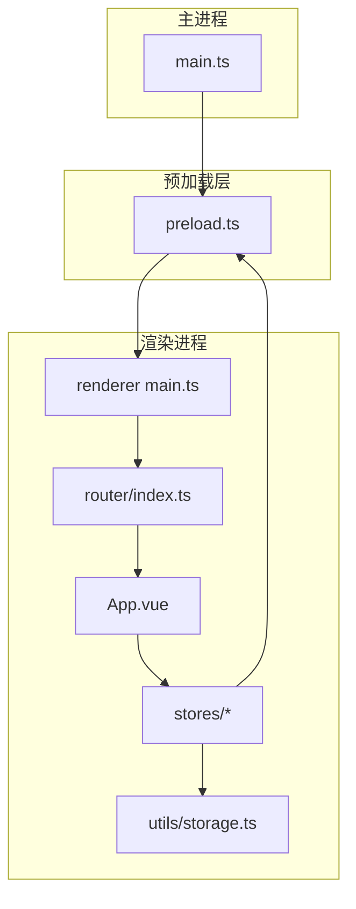
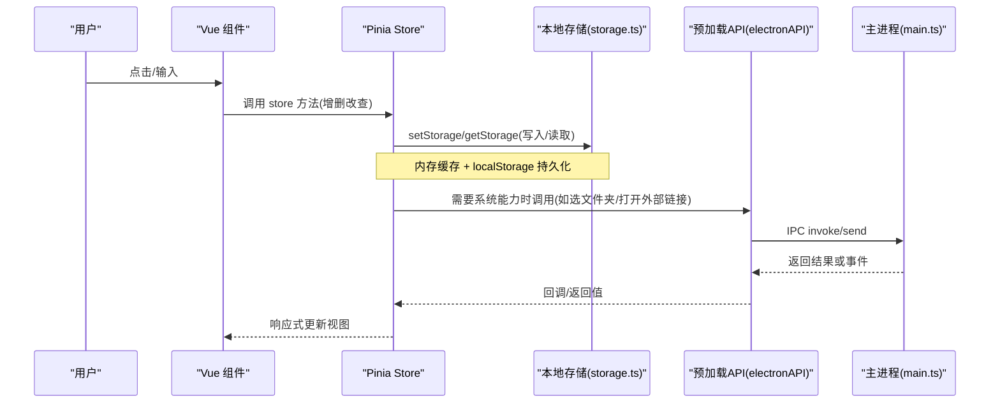
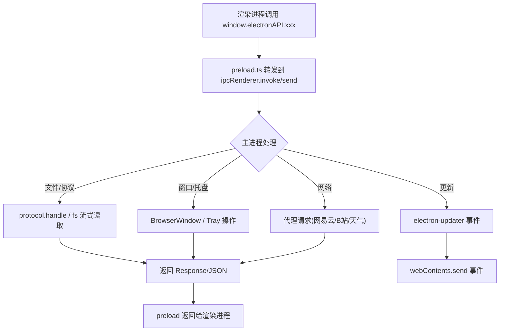
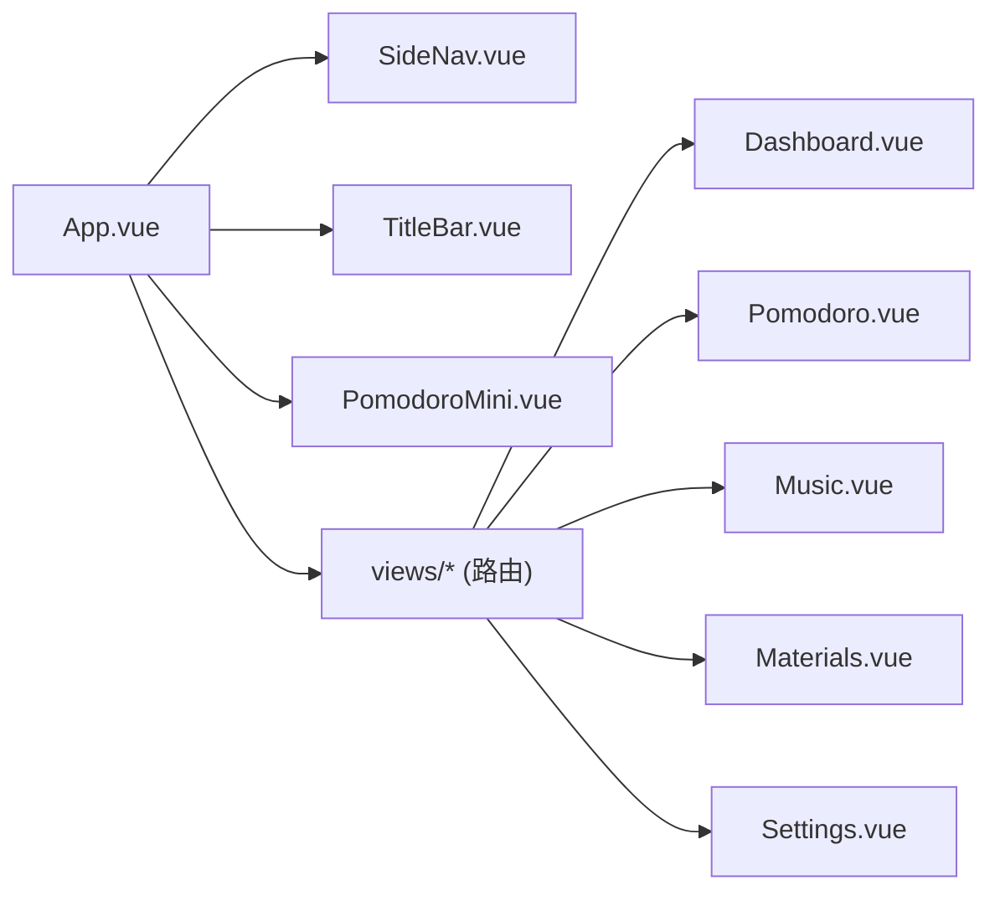
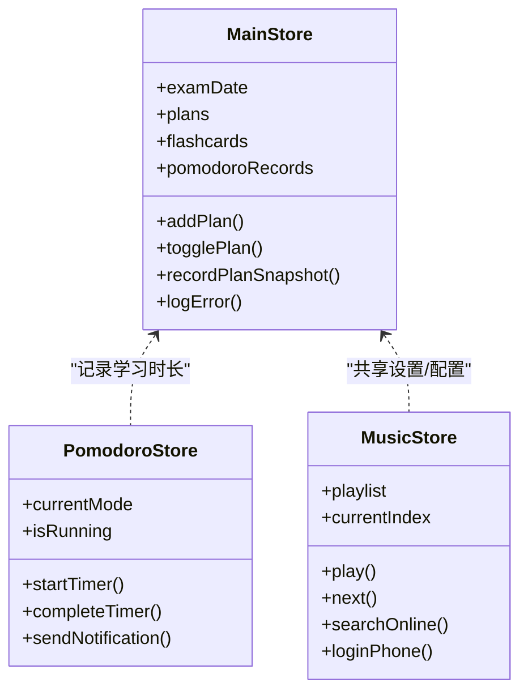
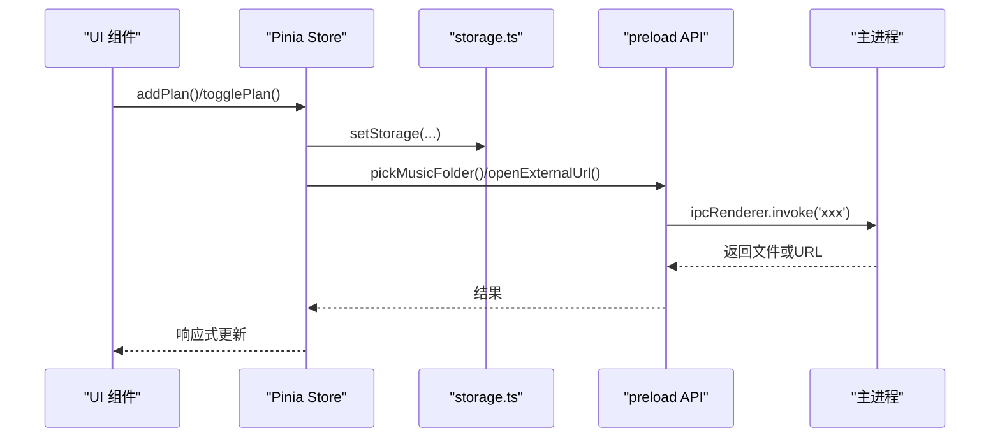
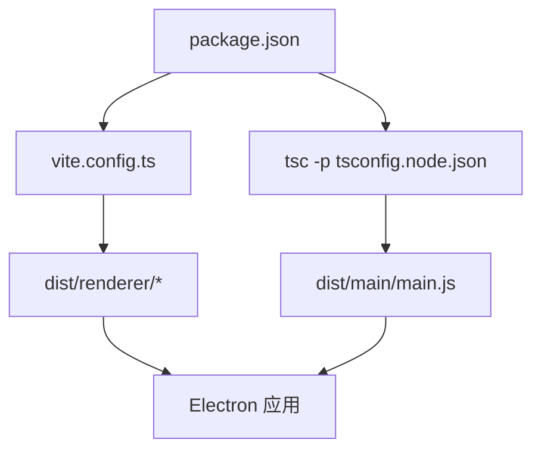

# 架构设计

<cite>
**本文引用的文件**
- [src/main/main.ts](file://src/main/main.ts)
- [src/preload/preload.ts](file://src/preload/preload.ts)
- [src/renderer/src/main.ts](file://src/renderer/src/main.ts)
- [src/renderer/src/App.vue](file://src/renderer/src/App.vue)
- [src/renderer/src/router/index.ts](file://src/renderer/src/router/index.ts)
- [src/renderer/src/stores/index.ts](file://src/renderer/src/stores/index.ts)
- [src/renderer/src/stores/pomodoro.ts](file://src/renderer/src/stores/pomodoro.ts)
- [src/renderer/src/stores/music.ts](file://src/renderer/src/stores/music.ts)
- [src/renderer/src/utils/storage.ts](file://src/renderer/src/utils/storage.ts)
- [vite.config.ts](file://vite.config.ts)
- [package.json](file://package.json)
</cite>

## 目录
1. [简介](#简介)
2. [项目结构](#项目结构)
3. [核心组件](#核心组件)
4. [架构总览](#架构总览)
5. [详细组件分析](#详细组件分析)
6. [依赖关系分析](#依赖关系分析)
7. [性能考量](#性能考量)
8. [故障排查指南](#故障排查指南)
9. [结论](#结论)
10. [附录](#附录)

## 简介
本应用基于 Electron + Vue 3 + Pinia 构建，采用主进程与渲染进程分离的桌面端架构。主进程负责系统能力（窗口、托盘、文件系统、协议、自动更新等），渲染进程提供基于 Vue 3 的用户界面，并通过预加载脚本暴露安全的 IPC API。数据持久化通过本地存储层实现，状态管理由 Pinia 驱动，形成“界面 → Store → 存储/IPC”的单向数据流。

## 项目结构
- 主进程：src/main/main.ts
- 预加载桥接：src/preload/preload.ts
- 渲染进程入口与路由：src/renderer/src/main.ts、src/renderer/src/router/index.ts
- 根组件与布局：src/renderer/src/App.vue
- 状态管理：src/renderer/src/stores/*（main、pomodoro、music）
- 本地存储抽象：src/renderer/src/utils/storage.ts
- 构建配置：vite.config.ts、package.json

图表来源
- [src/main/main.ts:290-327](file://src/main/main.ts#L290-L327)
- [src/preload/preload.ts:1-98](file://src/preload/preload.ts#L1-L98)
- [src/renderer/src/main.ts:1-63](file://src/renderer/src/main.ts#L1-L63)
- [src/renderer/src/router/index.ts:1-144](file://src/renderer/src/router/index.ts#L1-L144)
- [src/renderer/src/App.vue:1-234](file://src/renderer/src/App.vue#L1-L234)
- [src/renderer/src/stores/index.ts:1-699](file://src/renderer/src/stores/index.ts#L1-L699)
- [src/renderer/src/utils/storage.ts:1-443](file://src/renderer/src/utils/storage.ts#L1-L443)

章节来源
- [src/main/main.ts:290-327](file://src/main/main.ts#L290-L327)
- [src/preload/preload.ts:1-98](file://src/preload/preload.ts#L1-L98)
- [src/renderer/src/main.ts:1-63](file://src/renderer/src/main.ts#L1-L63)
- [src/renderer/src/router/index.ts:1-144](file://src/renderer/src/router/index.ts#L1-L144)
- [src/renderer/src/App.vue:1-234](file://src/renderer/src/App.vue#L1-L234)
- [src/renderer/src/stores/index.ts:1-699](file://src/renderer/src/stores/index.ts#L1-L699)
- [src/renderer/src/utils/storage.ts:1-443](file://src/renderer/src/utils/storage.ts#L1-L443)
- [vite.config.ts:1-39](file://vite.config.ts#L1-L39)
- [package.json:1-95](file://package.json#L1-L95)

## 核心组件
- 主进程（Electron）
  - 窗口与托盘管理、单实例锁、主题同步、自定义协议（背景图、音乐、资料、静态资源）、自动更新、系统级能力封装。
- 预加载脚本
  - 通过 contextBridge 暴露安全 API，将主进程能力以方法形式暴露给渲染进程，避免直接 Node.js 访问。
- 渲染进程（Vue 3）
  - 应用初始化、全局错误捕获、路由与页面组织、Pinia 状态管理、本地存储抽象。
- 状态管理（Pinia）
  - 主 Store（学习计划、番茄记录、真题分数、进度、日志等）、番茄钟 Store（计时、提醒、通知、声音）、音乐 Store（播放列表、在线/本地、歌词、网易云登录）。
- 数据存储
  - 统一 storage 工具：内存缓存 + localStorage 实时持久化、版本迁移、容量不足清理、导出/导入、用户隔离键空间。

章节来源
- [src/main/main.ts:19-197](file://src/main/main.ts#L19-L197)
- [src/preload/preload.ts:1-98](file://src/preload/preload.ts#L1-L98)
- [src/renderer/src/main.ts:1-63](file://src/renderer/src/main.ts#L1-L63)
- [src/renderer/src/stores/index.ts:219-699](file://src/renderer/src/stores/index.ts#L219-L699)
- [src/renderer/src/stores/pomodoro.ts:1-347](file://src/renderer/src/stores/pomodoro.ts#L1-L347)
- [src/renderer/src/stores/music.ts:1-800](file://src/renderer/src/stores/music.ts#L1-L800)
- [src/renderer/src/utils/storage.ts:1-443](file://src/renderer/src/utils/storage.ts#L1-L443)

## 架构总览
下图展示了从用户交互到数据存储的完整路径，以及主进程与渲染进程的边界与通信方式。

图表来源
- [src/renderer/src/stores/index.ts:605-647](file://src/renderer/src/stores/index.ts#L605-L647)
- [src/renderer/src/utils/storage.ts:227-279](file://src/renderer/src/utils/storage.ts#L227-L279)
- [src/preload/preload.ts:1-98](file://src/preload/preload.ts#L1-L98)
- [src/main/main.ts:703-800](file://src/main/main.ts#L703-L800)

章节来源
- [src/renderer/src/stores/index.ts:605-647](file://src/renderer/src/stores/index.ts#L605-L647)
- [src/renderer/src/utils/storage.ts:227-279](file://src/renderer/src/utils/storage.ts#L227-L279)
- [src/preload/preload.ts:1-98](file://src/preload/preload.ts#L1-L98)
- [src/main/main.ts:703-800](file://src/main/main.ts#L703-L800)

## 详细组件分析

### 主进程与 IPC 机制
- 窗口与托盘
  - 创建无边框窗口、跟随系统主题设置背景色、关闭隐藏到托盘、托盘菜单控制显示/退出。
- 自定义协议
  - kaoyan-bg：用户自定义背景图
  - kaoyan-music：音乐文件白名单+Range流式播放
  - kaoyan-data：数据目录备份 JSON 只读
  - kaoyan-material：资料文件（PDF/MP4 等）支持 Range
  - kaoyan-assets：内置 pdf.js CMap/字体资源（回环 HTTP 服务优先，协议备用）
- 自动更新
  - 检查/下载/安装更新，通过 webContents.send 推送事件到渲染进程。
- IPC 暴露
  - 预加载层集中暴露 electronAPI，包含窗口控制、更新、文件选择、资料/音乐、天气、数据目录、网易云/B站接口等。

图表来源
- [src/preload/preload.ts:1-98](file://src/preload/preload.ts#L1-L98)
- [src/main/main.ts:183-197](file://src/main/main.ts#L183-L197)
- [src/main/main.ts:398-615](file://src/main/main.ts#L398-L615)
- [src/main/main.ts:625-648](file://src/main/main.ts#L625-L648)

章节来源
- [src/main/main.ts:183-197](file://src/main/main.ts#L183-L197)
- [src/main/main.ts:290-327](file://src/main/main.ts#L290-L327)
- [src/main/main.ts:398-615](file://src/main/main.ts#L398-L615)
- [src/main/main.ts:625-648](file://src/main/main.ts#L625-L648)
- [src/preload/preload.ts:1-98](file://src/preload/preload.ts#L1-L98)

### Vue 3 前端组件化架构
- 根组件 App.vue
  - 自定义顶栏、侧边导航、路由视图、番茄钟小浮窗、全局提醒遮罩；监听全屏设置并调用 IPC。
- 路由 router/index.ts
  - 懒加载各功能页面（首页、倒计时、统计、大纲、算法模板、公式、真题成绩、计划、卡片、词典、音乐、资料、设置），无强制登录守卫。
- 组件分层
  - 通用组件：GlassCard、TitleBar、SideNav、PomodoroMini
  - 页面组件：Dashboard、Countdown、Statistics、Outline、Algorithms、Formulas、ExamScores、DailyPlan、Flashcards、Dictionary、Music、Materials、Settings、Login

图表来源
- [src/renderer/src/App.vue:1-234](file://src/renderer/src/App.vue#L1-L234)
- [src/renderer/src/router/index.ts:1-144](file://src/renderer/src/router/index.ts#L1-L144)

章节来源
- [src/renderer/src/App.vue:1-234](file://src/renderer/src/App.vue#L1-L234)
- [src/renderer/src/router/index.ts:1-144](file://src/renderer/src/router/index.ts#L1-L144)

### 状态管理模式（Pinia）设计思路
- 主 Store（index.ts）
  - 统一管理考研相关数据：考试日期、每日计划、背诵卡片、番茄记录、真题分数、学习时长、科目进度、计划快照、错误日志等。
  - 使用 watch 深度监听，自动持久化到 storage；启动时从 storage 刷新数据，保证 IndexedDB/localStorage 就绪后数据正确加载。
  - 提供计算属性用于统计（今日学习时长、计划完成数等）。
- 番茄钟 Store（pomodoro.ts）
  - 独立计时器、模式切换、提醒（通知/声音/标题闪烁/振动）、与主 Store 联动记录学习时长。
- 音乐 Store（music.ts）
  - 播放列表、在线/本地曲目、歌词解析与高亮、网易云登录与歌单、搜索与播放、音质等级、自动续播与错误重试。

图表来源
- [src/renderer/src/stores/index.ts:219-699](file://src/renderer/src/stores/index.ts#L219-L699)
- [src/renderer/src/stores/pomodoro.ts:1-347](file://src/renderer/src/stores/pomodoro.ts#L1-L347)
- [src/renderer/src/stores/music.ts:1-800](file://src/renderer/src/stores/music.ts#L1-L800)

章节来源
- [src/renderer/src/stores/index.ts:219-699](file://src/renderer/src/stores/index.ts#L219-L699)
- [src/renderer/src/stores/pomodoro.ts:1-347](file://src/renderer/src/stores/pomodoro.ts#L1-L347)
- [src/renderer/src/stores/music.ts:1-800](file://src/renderer/src/stores/music.ts#L1-L800)

### 数据流：从界面到数据存储
- 用户操作触发组件方法，调用 Pinia Store 的变更函数。
- Store 通过 storage 工具写入内存缓存并立即落盘 localStorage；必要时通过 electronAPI 调用主进程能力（如选择文件夹、打开外部链接、获取资源基址）。
- 主进程执行系统级操作（文件扫描、协议处理、网络请求），返回结果至渲染进程，Store 更新状态，视图响应式刷新。

图表来源
- [src/renderer/src/stores/index.ts:605-647](file://src/renderer/src/stores/index.ts#L605-L647)
- [src/renderer/src/utils/storage.ts:227-279](file://src/renderer/src/utils/storage.ts#L227-L279)
- [src/preload/preload.ts:1-98](file://src/preload/preload.ts#L1-L98)
- [src/main/main.ts:703-800](file://src/main/main.ts#L703-L800)

章节来源
- [src/renderer/src/stores/index.ts:605-647](file://src/renderer/src/stores/index.ts#L605-L647)
- [src/renderer/src/utils/storage.ts:227-279](file://src/renderer/src/utils/storage.ts#L227-L279)
- [src/preload/preload.ts:1-98](file://src/preload/preload.ts#L1-L98)
- [src/main/main.ts:703-800](file://src/main/main.ts#L703-L800)

### 系统边界定义与模块间交互
- 系统边界
  - 主进程：操作系统能力（窗口、托盘、文件系统、协议、自动更新、网络代理）
  - 预加载层：安全桥接，仅暴露必要 API
  - 渲染进程：UI 与业务逻辑（Vue 组件、路由、状态管理）
  - 存储层：localStorage 持久化与内存缓存
- 模块交互
  - 组件 ↔ Store：通过 Pinia 方法读写状态
  - Store ↔ Storage：统一读写接口，支持迁移与清理
  - Store ↔ Preload：需要系统能力时调用 IPC
  - Preload ↔ Main：IPC 调用，执行系统级任务

章节来源
- [src/main/main.ts:183-197](file://src/main/main.ts#L183-L197)
- [src/preload/preload.ts:1-98](file://src/preload/preload.ts#L1-L98)
- [src/renderer/src/utils/storage.ts:1-443](file://src/renderer/src/utils/storage.ts#L1-L443)

### 技术决策与权衡
- 主/渲染分离：安全性与稳定性，渲染进程不直接访问 Node.js，降低风险。
- 预加载桥接：最小权限原则，仅暴露必要 API，便于审计与维护。
- 自定义协议：对本地媒体与资料的安全访问，支持 Range 流式播放，提升大文件体验。
- 回环 HTTP 服务：为 pdf.js 提供稳定 fetch 通道，解决离线/国内网络下 CMap 加载问题。
- 本地存储策略：localStorage 实时持久化 + 内存缓存，确保退出不丢失；容量不足时自动清理历史数据。
- Pinia 状态管理：模块化、类型友好、易于扩展；watch 自动持久化减少样板代码。
- 自动更新：静默检测、手动触发下载/安装，平衡用户体验与可控性。

[本节为概念性说明，不直接分析具体文件]

## 依赖关系分析
- 构建与打包
  - Vite 构建渲染产物，TypeScript 编译主进程；electron-builder 打包多平台安装包。
- 运行时依赖
  - Vue 3、Vue Router、Pinia、Element Plus、ECharts、pdfjs-dist、electron-updater、dayjs 等。

图表来源
- [package.json:1-95](file://package.json#L1-L95)
- [vite.config.ts:1-39](file://vite.config.ts#L1-L39)

章节来源
- [package.json:1-95](file://package.json#L1-L95)
- [vite.config.ts:1-39](file://vite.config.ts#L1-L39)

## 性能考量
- 大文件流式读取：音乐与资料协议使用 ReadableStream 与 Range 请求，避免一次性加载导致内存峰值。
- 资源加载优化：pdf.js 静态资源通过回环 HTTP 服务走 fetch 分支，提高跨环境稳定性。
- 组件按需加载：路由懒加载与图标局部导入，减少首屏体积。
- 存储层优化：内存缓存 + 批量 flush，避免频繁磁盘 IO；容量不足时自动清理非关键数据。
- 定时器与音频：番茄钟使用绝对时间差计算，减少漂移；AudioContext 复用，降低开销。

[本节为通用指导，不直接分析具体文件]

## 故障排查指南
- 主进程异常
  - 未捕获异常与未处理 Promise 拒绝已记录日志，避免崩溃弹窗。
- 渲染进程异常
  - Vue 全局错误处理器记录错误日志并提示；路由加载失败捕获并提示。
- 存储层异常
  - localStorage 写入失败时尝试清理旧数据；beforeunload/pagehide 双保险确保退出前保存。
- 自动更新异常
  - 主进程监听更新事件并发送到渲染进程，便于 UI 展示状态与错误信息。

章节来源
- [src/main/main.ts:8-14](file://src/main/main.ts#L8-L14)
- [src/renderer/src/main.ts:25-56](file://src/renderer/src/main.ts#L25-L56)
- [src/renderer/src/router/index.ts:123-141](file://src/renderer/src/router/index.ts#L123-L141)
- [src/renderer/src/utils/storage.ts:50-65](file://src/renderer/src/utils/storage.ts#L50-L65)
- [src/main/main.ts:625-648](file://src/main/main.ts#L625-L648)

## 结论
本架构通过主/渲染分离、预加载桥接、Pinia 状态管理与本地存储抽象，实现了安全、可扩展且易维护的桌面应用。自定义协议与回环 HTTP 服务解决了本地媒体与 PDF 资源的稳定访问问题；自动更新与错误收集提升了用户体验与可观测性。整体设计在安全性、性能与可维护性之间取得良好平衡，适合持续迭代与功能扩展。

[本节为总结性内容，不直接分析具体文件]

## 附录
- 开发命令
  - 开发：vite + electron 并行启动
  - 构建：vite build + tsc 编译主进程
  - 打包：electron-builder 多平台输出
- 关键路径
  - 主进程入口：dist/main/main.js
  - 渲染产物：dist/renderer/*
  - 资源目录：resources/*、src/renderer/public/pdfjs/*

章节来源
- [package.json:7-17](file://package.json#L7-L17)
- [vite.config.ts:20-33](file://vite.config.ts#L20-L33)