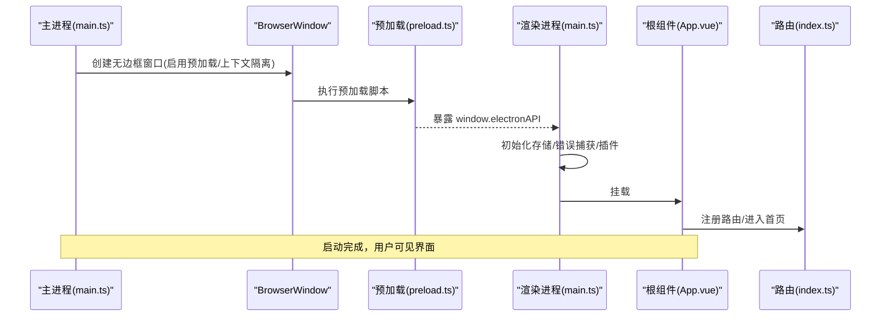
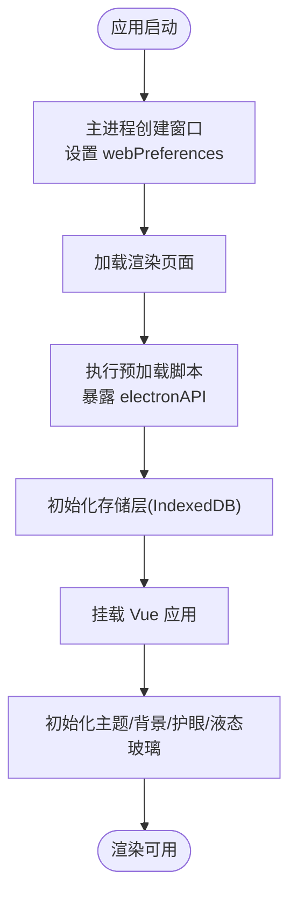
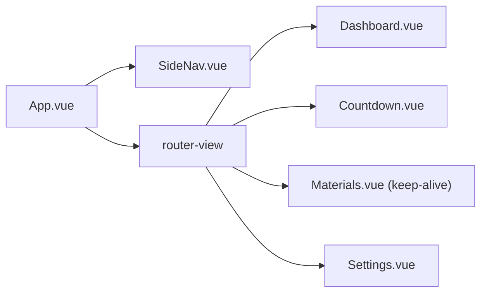
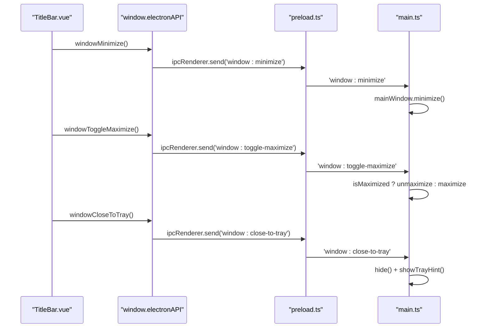
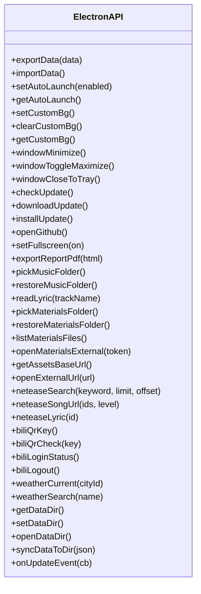
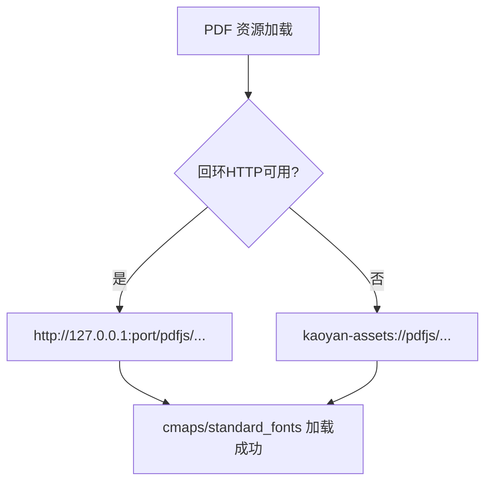
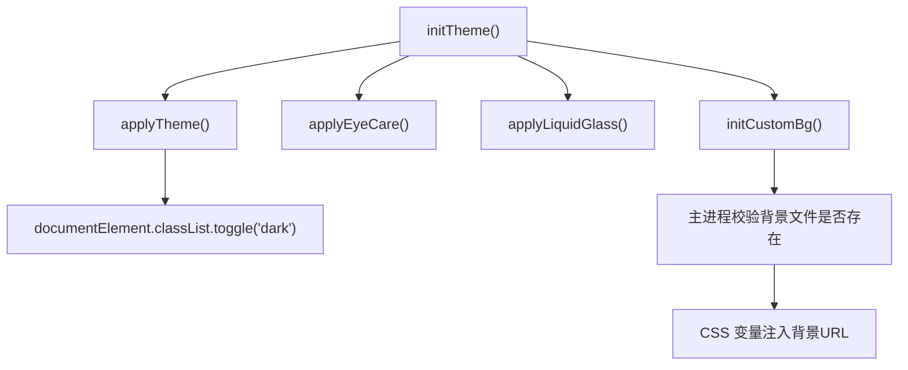
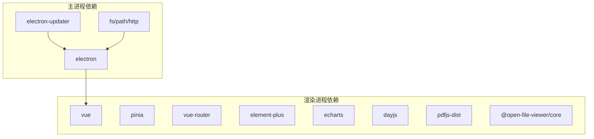

# 渲染进程架构

<cite>
**本文引用的文件**
- [main.ts](file://src/main/main.ts)
- [preload.ts](file://src/preload/preload.ts)
- [main.ts（渲染入口）](file://src/renderer/src/main.ts)
- [App.vue](file://src/renderer/src/App.vue)
- [index.ts（路由）](file://src/renderer/src/router/index.ts)
- [TitleBar.vue](file://src/renderer/src/components/TitleBar.vue)
- [theme.ts](file://src/renderer/src/utils/theme.ts)
- [vite.config.ts](file://vite.config.ts)
- [package.json](file://package.json)
</cite>

## 目录
1. [简介](#简介)
2. [项目结构](#项目结构)
3. [核心组件](#核心组件)
4. [架构总览](#架构总览)
5. [详细组件分析](#详细组件分析)
6. [依赖关系分析](#依赖关系分析)
7. [性能考量](#性能考量)
8. [故障排查指南](#故障排查指南)
9. [结论](#结论)
10. [附录](#附录)

## 简介
本文件面向“考研助手”Electron + Vue 3 应用的渲染进程架构，系统性说明：
- Vue 应用初始化流程、路由配置与组件层次结构
- 无框窗口的实现方案：自定义标题栏、窗口控制按钮的 IPC 通信机制
- 预加载脚本的安全桥接设计：如何安全暴露主进程 API 给渲染进程
- 静态资源管理、主题切换机制、响应式设计实现
- 前端构建配置、开发环境设置与生产环境优化
- 渲染进程启动流程图与组件关系图

## 项目结构
仓库采用 Electron 多进程架构：
- main 进程：负责创建 BrowserWindow、注册协议、托盘、自动更新、系统级能力（文件系统、网络等）
- preload 脚本：通过 contextBridge 暴露最小化、类型安全的 API 到渲染进程
- renderer 渲染进程：Vue 3 + Vite 构建的前端应用，包含路由、视图、组件、状态管理与工具模块

```mermaid
graph TB
subgraph "主进程"
M["main.ts"]
end
subgraph "预加载层"
P["preload.ts"]
end
subgraph "渲染进程"
RMain["renderer/src/main.ts"]
App["App.vue"]
Router["router/index.ts"]
TitleBar["components/TitleBar.vue"]
Theme["utils/theme.ts"]
end
M --> |创建窗口/注册协议| RMain
M <- --> |IPC| P
P --> |contextBridge 暴露 API| RMain
RMain --> App
App --> Router
App --> TitleBar
App --> Theme
```

图表来源
- [main.ts:290-327](file://src/main/main.ts#L290-L327)
- [preload.ts:1-98](file://src/preload/preload.ts#L1-L98)
- [main.ts（渲染入口）:1-63](file://src/renderer/src/main.ts#L1-L63)
- [App.vue:1-40](file://src/renderer/src/App.vue#L1-L40)
- [index.ts（路由）:1-115](file://src/renderer/src/router/index.ts#L1-L115)
- [TitleBar.vue:317-329](file://src/renderer/src/components/TitleBar.vue#L317-L329)
- [theme.ts:25-58](file://src/renderer/src/utils/theme.ts#L25-L58)

章节来源
- [main.ts:290-327](file://src/main/main.ts#L290-L327)
- [vite.config.ts:8-38](file://vite.config.ts#L8-L38)
- [package.json:7-17](file://package.json#L7-L17)

## 核心组件
- 主进程窗口与协议
  - 创建无边框窗口，启用上下文隔离与 Node 集成关闭，指定预加载脚本
  - 注册私有协议：kaoyan-bg、kaoyan-music、kaoyan-data、kaoyan-material、kaoyan-assets
  - 提供回环 HTTP 服务用于 pdf.js 静态资源（cmaps/standard_fonts），并暴露基址给渲染进程
- 预加载脚本
  - 使用 contextBridge.exposeInMainWorld 暴露 window.electronAPI，仅暴露必要方法
  - 封装 IPC 调用：窗口控制、更新检查、数据目录、音乐/资料文件夹、天气、网易云/B站接口等
- 渲染进程入口
  - 创建 Vue 应用，挂载 Pinia、Element Plus、路由
  - 全局错误捕获与未处理 Promise rejection 记录
  - 在挂载前完成存储层初始化（IndexedDB 迁移与缓存）
- 根组件与布局
  - 自定义标题栏（可拖拽区域、窗口控制按钮、音乐控件、天气、主题切换等）
  - 侧边导航 + 主内容区，路由视图使用 keep-alive 缓存学习资料页
  - 番茄钟小浮窗与完成提醒
- 路由
  - Hash 模式路由，懒加载各页面，统一错误处理与日志记录
- 主题与背景
  - 支持浅色/深色/跟随系统，护眼模式与液态玻璃效果
  - 自定义背景通过 kaoyan-bg 协议提供，持久化与校验

章节来源
- [main.ts:191-210](file://src/main/main.ts#L191-L210)
- [main.ts:290-327](file://src/main/main.ts#L290-L327)
- [preload.ts:1-98](file://src/preload/preload.ts#L1-L98)
- [main.ts（渲染入口）:1-63](file://src/renderer/src/main.ts#L1-L63)
- [App.vue:1-40](file://src/renderer/src/App.vue#L1-L40)
- [index.ts（路由）:1-115](file://src/renderer/src/router/index.ts#L1-L115)
- [theme.ts:25-58](file://src/renderer/src/utils/theme.ts#L25-L58)

## 架构总览
下图展示从主进程启动到渲染进程可用的完整链路，以及关键 IPC 通道。



图表来源
- [main.ts:290-327](file://src/main/main.ts#L290-L327)
- [preload.ts:1-98](file://src/preload/preload.ts#L1-L98)
- [main.ts（渲染入口）:1-63](file://src/renderer/src/main.ts#L1-L63)
- [App.vue:1-40](file://src/renderer/src/App.vue#L1-L40)
- [index.ts（路由）:1-115](file://src/renderer/src/router/index.ts#L1-L115)

## 详细组件分析

### 渲染进程启动流程
- 主进程创建窗口并加载渲染页面（开发时 http://localhost:5173，生产时 index.html）
- 预加载脚本注入 window.electronAPI，限制访问范围
- 渲染进程初始化存储层（IndexedDB），再挂载 Vue 应用
- 根组件初始化主题、自定义背景、数据同步；监听全屏开关并通知主进程



图表来源
- [main.ts:290-327](file://src/main/main.ts#L290-L327)
- [preload.ts:1-98](file://src/preload/preload.ts#L1-L98)
- [main.ts（渲染入口）:1-63](file://src/renderer/src/main.ts#L1-L63)
- [theme.ts:44-58](file://src/renderer/src/utils/theme.ts#L44-L58)

章节来源
- [main.ts:290-327](file://src/main/main.ts#L290-L327)
- [main.ts（渲染入口）:1-63](file://src/renderer/src/main.ts#L1-L63)

### 路由配置与组件层次
- 路由采用 Hash 模式，按功能域划分页面（仪表盘、倒计时、统计、专业课、学习工具、公共课、设置等）
- 懒加载减少首屏体积；对异步组件加载失败进行统一捕获与提示
- 根组件中通过 router-view 渲染当前页面，学习资料页使用 keep-alive 保持状态



图表来源
- [App.vue:9-20](file://src/renderer/src/App.vue#L9-L20)
- [index.ts（路由）:5-110](file://src/renderer/src/router/index.ts#L5-L110)

章节来源
- [index.ts（路由）:1-144](file://src/renderer/src/router/index.ts#L1-L144)
- [App.vue:9-20](file://src/renderer/src/App.vue#L9-L20)

### 无框窗口与自定义标题栏
- 主进程以 frame: false 创建无边框窗口，将窗口控制交由渲染层自建
- 自定义标题栏提供：
  - 可拖拽区域（整条标题栏可拖动）
  - 窗口控制按钮：最小化、最大化/还原、关闭（关闭行为为隐藏到托盘）
  - 音乐控件、天气、日期时间、主题切换、护眼模式、液态玻璃开关
- 通过 window.electronAPI 调用 IPC 方法控制窗口



图表来源
- [TitleBar.vue:317-329](file://src/renderer/src/components/TitleBar.vue#L317-L329)
- [preload.ts:11-18](file://src/preload/preload.ts#L11-L18)
- [main.ts:672-693](file://src/main/main.ts#L672-L693)

章节来源
- [main.ts:290-327](file://src/main/main.ts#L290-L327)
- [TitleBar.vue:317-329](file://src/renderer/src/components/TitleBar.vue#L317-L329)
- [preload.ts:11-18](file://src/preload/preload.ts#L11-L18)
- [main.ts:672-693](file://src/main/main.ts#L672-L693)

### 预加载脚本的安全桥接设计
- 使用 contextBridge.exposeInMainWorld 暴露 window.electronAPI，仅暴露必要方法
- 所有主进程能力均通过 IPC 调用，避免在渲染进程直接访问 Node/Electron 对象
- 暴露的能力包括：
  - 窗口控制、应用更新、数据目录管理、外部链接打开
  - 音乐/资料文件夹选择与读取、歌词读取
  - 天气查询、网易云/B站相关接口代理
  - PDF 静态资源回环服务基址获取（用于 CMap/字体）
- 主进程侧对协议与路径进行严格白名单校验，防止越权访问



图表来源
- [preload.ts:1-98](file://src/preload/preload.ts#L1-L98)

章节来源
- [preload.ts:1-98](file://src/preload/preload.ts#L1-L98)
- [main.ts:191-210](file://src/main/main.ts#L191-L210)
- [main.ts:398-615](file://src/main/main.ts#L398-L615)

### 静态资源管理与 PDF 资源回环服务
- 自定义背景：通过 kaoyan-bg 协议提供，仅在文件存在时返回内容
- 音乐/资料：通过 kaoyan-music / kaoyan-material 协议流式读取，支持 Range 请求，提升大文件播放体验
- PDF 静态资源：
  - 优先使用回环 HTTP 服务 http://127.0.0.1:<port>/pdfjs/ 提供 cmaps/standard_fonts（fetch 分支更稳定）
  - 若回环服务不可用，则回退到 kaoyan-assets:// 协议
  - 渲染进程通过 window.electronAPI.getAssetsBaseUrl() 获取基址
  - 路径白名单限制为 pdfjs/cmaps 与 pdfjs/standard_fonts，防路径穿越



图表来源
- [main.ts:204-276](file://src/main/main.ts#L204-L276)
- [main.ts:497-536](file://src/main/main.ts#L497-L536)
- [preload.ts:35-36](file://src/preload/preload.ts#L35-L36)

章节来源
- [main.ts:204-276](file://src/main/main.ts#L204-L276)
- [main.ts:497-536](file://src/main/main.ts#L497-L536)
- [preload.ts:35-36](file://src/preload/preload.ts#L35-L36)

### 主题切换机制与响应式实现
- 主题模式：light/dark/system，持久化到存储层，监听系统主题变化实时切换
- 护眼模式：向根元素注入 .eyecare 类，降低蓝光
- 液态玻璃：向 body 注入 .liquid-glass 类，增强毛玻璃效果
- 自定义背景：通过 CSS 变量注入 kaoyan-bg 协议 URL，主进程校验文件存在性
- 响应式：基于 CSS 变量与 Flex/Grid 布局，侧边栏宽度随折叠状态动态调整



图表来源
- [theme.ts:25-58](file://src/renderer/src/utils/theme.ts#L25-L58)
- [theme.ts:68-107](file://src/renderer/src/utils/theme.ts#L68-L107)
- [theme.ts:111-140](file://src/renderer/src/utils/theme.ts#L111-L140)

章节来源
- [theme.ts:25-58](file://src/renderer/src/utils/theme.ts#L25-L58)
- [theme.ts:68-107](file://src/renderer/src/utils/theme.ts#L68-L107)
- [theme.ts:111-140](file://src/renderer/src/utils/theme.ts#L111-L140)
- [App.vue:69-81](file://src/renderer/src/App.vue#L69-L81)

### 前端构建配置、开发与生产优化
- Vite 配置
  - base: './'，root: src/renderer，别名 @ -> src/renderer/src
  - 定义 __APP_VERSION__ 常量
  - 手动分包：vue/vue-router/pinia、element-plus/icons、echarts 独立 chunk
  - 输出目录 dist/renderer，开发服务器端口 5173
- 脚本命令
  - dev: vite
  - build: vite build && tsc -p tsconfig.node.json
  - electron:dev: concurrently 启动 vite 与 electron 开发
  - electron:build: 打包为 nsis/dmg/AppImage
- 生产优化
  - 手动分包减少重复加载
  - 空输出目录清理
  - chunkSizeWarningLimit 控制包大小警告阈值

章节来源
- [vite.config.ts:8-38](file://vite.config.ts#L8-L38)
- [package.json:7-17](file://package.json#L7-L17)
- [package.json:45-80](file://package.json#L45-L80)

## 依赖关系分析
- 主进程依赖
  - Electron 核心模块：app、BrowserWindow、ipcMain、protocol、tray、nativeTheme 等
  - electron-updater：应用内自动更新
  - fs/path/http：本地文件与回环 HTTP 服务
- 渲染进程依赖
  - Vue 3、Pinia、Vue Router、Element Plus、ECharts、dayjs、pdfjs-dist、@open-file-viewer/core
- 预加载层依赖
  - Electron contextBridge/ipcRenderer：安全桥接与 IPC 通信



图表来源
- [package.json:19-43](file://package.json#L19-L43)
- [main.ts:1-6](file://src/main/main.ts#L1-L6)

章节来源
- [package.json:19-43](file://package.json#L19-L43)
- [main.ts:1-6](file://src/main/main.ts#L1-L6)

## 性能考量
- 大文件流式读取：音乐与资料协议使用 ReadableStream 与 Range 请求，避免一次性加载导致内存峰值
- 回环 HTTP 服务：为 pdf.js 提供稳定的 fetch 分支，减少 XHR 兼容性问题
- 手动分包：将常用库拆分为独立 chunk，提升缓存命中与并行加载效率
- 路由懒加载：按需加载页面组件，减少首屏体积
- 存储层初始化前置：确保 store 首次读取即拿到真实数据，避免重复请求与状态不一致

[本节为通用性能建议，不直接分析具体代码行]

## 故障排查指南
- 路由加载失败
  - 路由 onError 捕获异步组件 import 异常，记录日志并提示用户前往设置查看报错日志
- Vue 运行时异常
  - 全局 errorHandler 捕获组件渲染、watch、事件处理器中的未捕获异常，写入日志并弹出提示
- 未处理 Promise 拒绝
  - 监听 unhandledrejection，记录原因与堆栈，便于定位异步错误
- 主进程未捕获异常
  - 注册 uncaughtException/unhandledRejection 回调，避免崩溃弹窗影响用户体验
- 协议访问被拒
  - 检查路径白名单与 token 有效性，确认资源存在于允许目录

章节来源
- [index.ts（路由）:123-141](file://src/renderer/src/router/index.ts#L123-L141)
- [main.ts（渲染入口）:25-56](file://src/renderer/src/main.ts#L25-L56)
- [main.ts:8-14](file://src/main/main.ts#L8-L14)
- [main.ts:407-477](file://src/main/main.ts#L407-L477)
- [main.ts:542-615](file://src/main/main.ts#L542-L615)

## 结论
该渲染进程架构通过清晰的职责划分与安全边界实现了：
- 无框窗口的自定义交互与系统级能力解耦
- 预加载脚本的最小权限暴露与严格的 IPC 通道管理
- 高效的静态资源访问策略与 PDF 离线支持
- 完善的主题与视觉体验（深色/护眼/液态玻璃/自定义背景）
- 合理的构建与发布流程，兼顾开发与生产环境的稳定性与性能

## 附录
- 启动开发版脚本：见 package.json scripts 中的 electron:dev
- 构建产物目录：dist/renderer（前端）、dist/main（主进程）
- 平台打包目标：Windows(nsis)、macOS(dmg)、Linux(AppImage)

[本节为补充信息，不直接分析具体代码行]