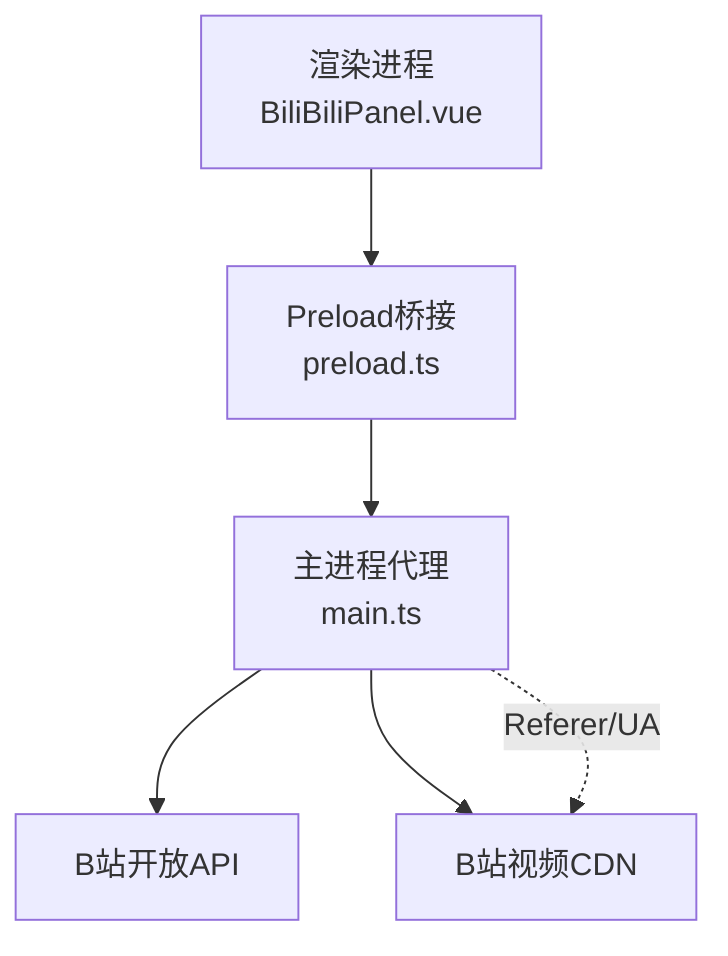
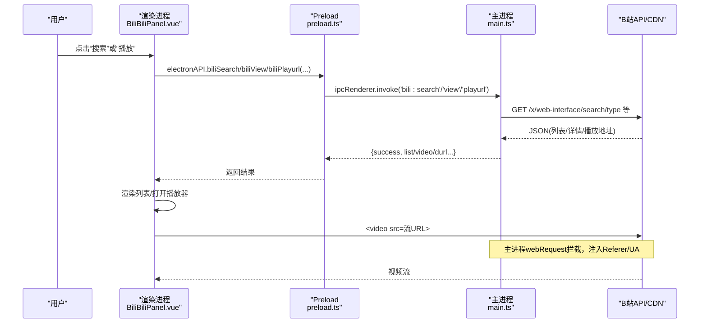
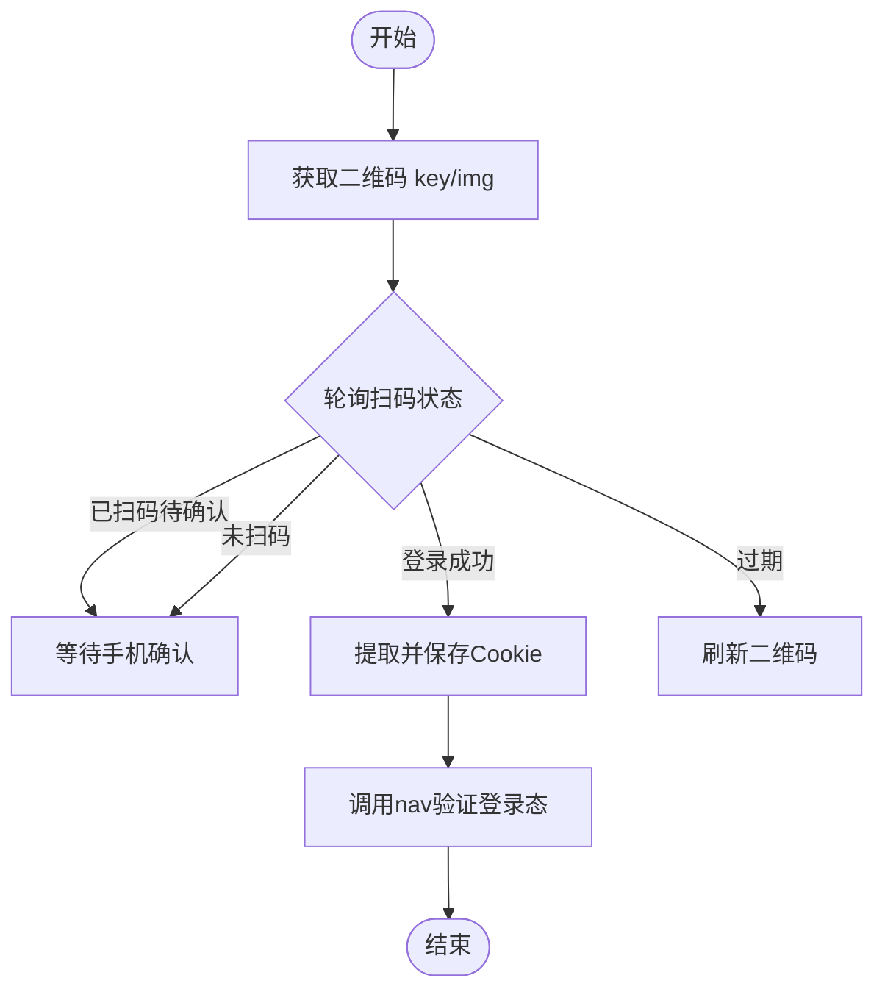
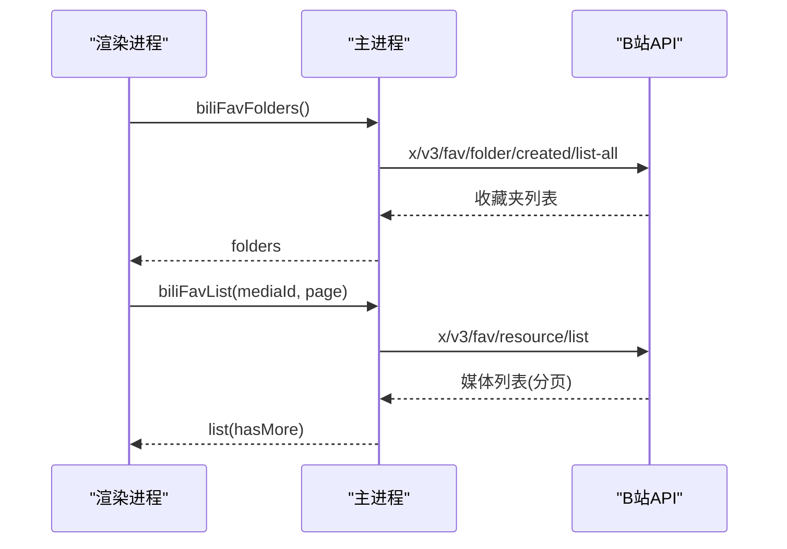
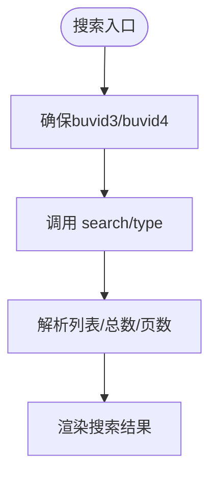
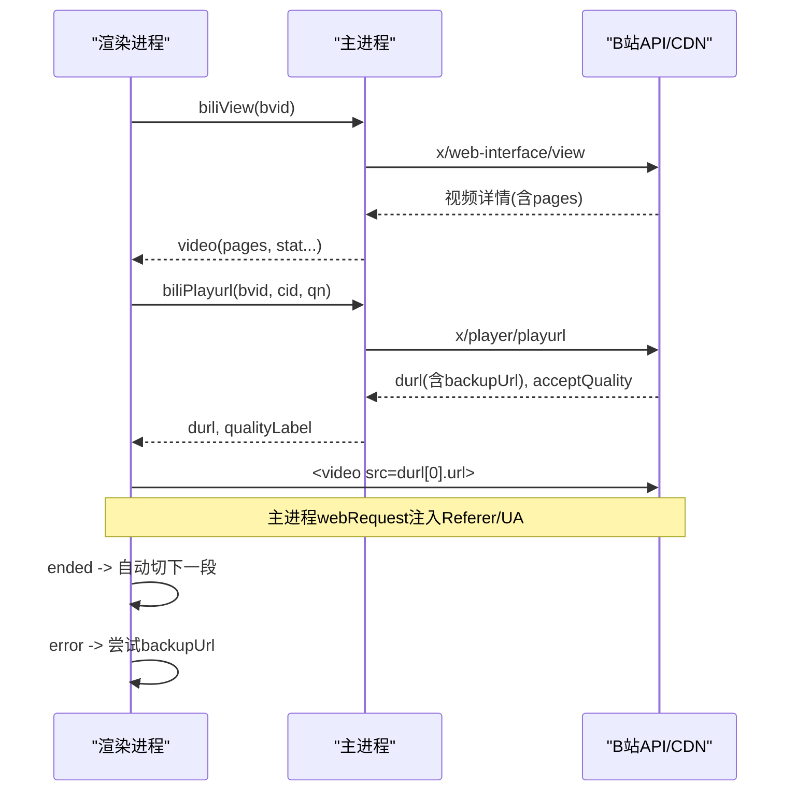
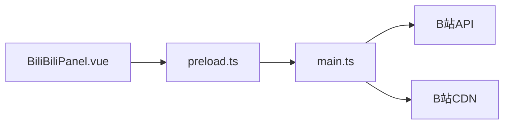

# B站视频集成

<cite>
**本文引用的文件**
- [src/renderer/src/components/BiliBiliPanel.vue](file://src/renderer/src/components/BiliBiliPanel.vue)
- [src/preload/preload.ts](file://src/preload/preload.ts)
- [src/main/main.ts](file://src/main/main.ts)
- [package.json](file://package.json)
- [README.md](file://README.md)
</cite>

## 目录
1. [简介](#简介)
2. [项目结构](#项目结构)
3. [核心组件](#核心组件)
4. [架构总览](#架构总览)
5. [详细组件分析](#详细组件分析)
6. [依赖关系分析](#依赖关系分析)
7. [性能与稳定性](#性能与稳定性)
8. [故障排查指南](#故障排查指南)
9. [结论](#结论)
10. [附录：接口与安全建议](#附录接口与安全建议)

## 简介
本文件面向“考研助手”桌面应用中的哔哩哔哩（B站）视频集成功能，系统性说明以下要点：
- 用户认证流程：扫码登录、Cookie 登录、会话维护与凭证持久化
- 功能实现：热门推荐、收藏夹浏览、视频搜索、播放详情、分P切换、清晰度选择、相关视频推荐
- 播放器集成：原生 HTML5 video 播放、多分段自动连播、备用CDN自动切换
- 跨域与防盗链：主进程代理请求、Referer/UA注入、webRequest拦截流式响应
- 错误处理策略：统一错误码解析、风控提示、重试机制
- 安全考虑：最小权限暴露、白名单校验、敏感信息本地存储
- 使用指南：面向用户的操作说明；面向开发者的第三方API集成最佳实践

## 项目结构
B站集成功能采用“渲染进程UI + Preload桥接 + 主进程代理”的三层架构：
- 渲染进程：Vue 组件负责交互与展示（BiliBiliPanel.vue）
- Preload：通过 contextBridge 暴露安全的 IPC 方法（preload.ts）
- 主进程：封装网络请求、Cookie管理、播放流代理、防盗链处理（main.ts）

图表来源
- [src/renderer/src/components/BiliBiliPanel.vue:338-722](file://src/renderer/src/components/BiliBiliPanel.vue#L338-L722)
- [src/preload/preload.ts:70-82](file://src/preload/preload.ts#L70-L82)
- [src/main/main.ts:2168-2183](file://src/main/main.ts#L2168-L2183)

章节来源
- [README.md:111-128](file://README.md#L111-L128)
- [package.json:1-18](file://package.json#L1-L18)

## 核心组件
- 用户界面层（BiliBiliPanel.vue）
  - 提供热门推荐、收藏夹、搜索、播放器弹窗等完整交互
  - 调用 window.electronAPI 下的 bili:* 系列方法完成数据获取与播放
- 桥接层（preload.ts）
  - 仅暴露必要的 bili:* IPC 方法，避免直接暴露 Electron 内部能力
- 主进程代理（main.ts）
  - 统一发起 HTTP 请求，附加 UA/Referer/Cookie
  - 管理 Cookie 与 buvid 防风控标识
  - 提供收藏、搜索、热门、详情、播放地址等接口
  - 安装 webRequest 拦截器为视频流注入 Referer/UA，绕过防盗链

章节来源
- [src/renderer/src/components/BiliBiliPanel.vue:338-722](file://src/renderer/src/components/BiliBiliPanel.vue#L338-L722)
- [src/preload/preload.ts:70-82](file://src/preload/preload.ts#L70-L82)
- [src/main/main.ts:2131-2183](file://src/main/main.ts#L2131-L2183)

## 架构总览
B站集成的整体调用链路如下：
- 用户在面板中触发操作（如搜索、播放）
- 渲染进程通过 electronAPI.bili* 调用主进程IPC
- 主进程向B站API发起请求，携带必要头部与Cookie
- 播放时，主进程通过webRequest拦截并注入Referer/UA，确保CDN放行
- 前端根据返回数据渲染卡片、列表与播放器

图表来源
- [src/renderer/src/components/BiliBiliPanel.vue:556-680](file://src/renderer/src/components/BiliBiliPanel.vue#L556-L680)
- [src/preload/preload.ts:70-82](file://src/preload/preload.ts#L70-L82)
- [src/main/main.ts:2376-2499](file://src/main/main.ts#L2376-L2499)

## 详细组件分析

### 用户认证流程（扫码登录与Cookie登录）
- 扫码登录
  - 渲染进程调用 biliQrKey 获取二维码key与图片
  - 每2秒轮询 biliQrCheck 检查扫码状态
  - 登录成功后，主进程从Set-Cookie与URL参数中提取关键凭证（SESSDATA等），持久化到本地
- Cookie登录
  - 用户粘贴浏览器Cookie字符串
  - 主进程解析键值对写入本地Cookie存储，并通过nav接口验证是否已登录
- 会话维护
  - 所有后续请求通过 biliGet 自动附带Cookie、UA、Referer
  - 退出登录即清空本地Cookie并持久化

图表来源
- [src/renderer/src/components/BiliBiliPanel.vue:393-433](file://src/renderer/src/components/BiliBiliPanel.vue#L393-L433)
- [src/main/main.ts:2251-2290](file://src/main/main.ts#L2251-L2290)
- [src/main/main.ts:2321-2348](file://src/main/main.ts#L2321-L2348)

章节来源
- [src/renderer/src/components/BiliBiliPanel.vue:354-468](file://src/renderer/src/components/BiliBiliPanel.vue#L354-L468)
- [src/main/main.ts:2131-2183](file://src/main/main.ts#L2131-L2183)
- [src/main/main.ts:2251-2348](file://src/main/main.ts#L2251-L2348)

### 收藏夹管理
- 获取收藏夹列表：需登录，基于当前用户mid拉取创建的所有收藏夹
- 分页加载内容：过滤失效资源（attr非0/1），格式化时长与封面
- 交互：左侧文件夹列表，右侧内容网格，支持加载更多

图表来源
- [src/main/main.ts:2395-2440](file://src/main/main.ts#L2395-L2440)
- [src/renderer/src/components/BiliBiliPanel.vue:494-544](file://src/renderer/src/components/BiliBiliPanel.vue#L494-L544)

章节来源
- [src/main/main.ts:2395-2440](file://src/main/main.ts#L2395-L2440)
- [src/renderer/src/components/BiliBiliPanel.vue:494-544](file://src/renderer/src/components/BiliBiliPanel.vue#L494-L544)

### 视频搜索与热门推荐
- 搜索
  - 自动确保buvid3/buvid4存在，避免被风控拦截
  - 调用 search/type 接口，返回总数与页码信息
- 热门推荐
  - 无需登录，支持换一批（随机跳转前20页）与加载更多

图表来源
- [src/main/main.ts:2153-2166](file://src/main/main.ts#L2153-L2166)
- [src/main/main.ts:2376-2391](file://src/main/main.ts#L2376-L2391)
- [src/renderer/src/components/BiliBiliPanel.vue:546-581](file://src/renderer/src/components/BiliBiliPanel.vue#L546-L581)

章节来源
- [src/main/main.ts:2153-2166](file://src/main/main.ts#L2153-L2166)
- [src/main/main.ts:2352-2391](file://src/main/main.ts#L2352-L2391)
- [src/renderer/src/components/BiliBiliPanel.vue:470-581](file://src/renderer/src/components/BiliBiliPanel.vue#L470-L581)

### 播放器集成（分P、清晰度、相关推荐）
- 视频详情：获取标题、封面、简介、分P列表、统计数据
- 播放地址：调用 playurl 接口，返回durl数组与可用清晰度
- 分P切换：切换cid后重新获取播放地址
- 清晰度切换：更新qn后重新获取播放地址
- 相关推荐：异步加载，不阻塞播放
- 多分段自动连播：ended事件自动切换到下一段
- 备用CDN：出错时优先尝试backupUrl

图表来源
- [src/main/main.ts:2444-2499](file://src/main/main.ts#L2444-L2499)
- [src/renderer/src/components/BiliBiliPanel.vue:589-703](file://src/renderer/src/components/BiliBiliPanel.vue#L589-L703)

章节来源
- [src/main/main.ts:2444-2499](file://src/main/main.ts#L2444-L2499)
- [src/renderer/src/components/BiliBiliPanel.vue:589-703](file://src/renderer/src/components/BiliBiliPanel.vue#L589-L703)

### 弹幕显示与播放历史
- 弹幕显示：当前实现未包含弹幕拉取与渲染逻辑
- 播放历史：当前实现未包含播放历史记录与续播逻辑

说明：如需扩展，可在主进程增加对应接口并在渲染进程持久化历史记录。

章节来源
- [src/renderer/src/components/BiliBiliPanel.vue:196-300](file://src/renderer/src/components/BiliBiliPanel.vue#L196-L300)
- [src/main/main.ts:2444-2499](file://src/main/main.ts#L2444-L2499)

### 跨域请求处理与安全性
- 跨域处理
  - 所有B站API请求由主进程代理，避免渲染进程直接跨域
  - 视频流通过webRequest拦截注入Referer/UA，绕过防盗链
- 安全性
  - Preload仅暴露最小必要方法
  - Cookie仅保留bilibili相关键，避免无限膨胀
  - 搜索前自动补充buvid防风控
  - 退出登录即清空本地凭证

章节来源
- [src/preload/preload.ts:70-82](file://src/preload/preload.ts#L70-L82)
- [src/main/main.ts:2131-2183](file://src/main/main.ts#L2131-L2183)
- [src/main/main.ts:2251-2348](file://src/main/main.ts#L2251-L2348)

## 依赖关系分析
- 渲染进程依赖Preload暴露的electronAPI
- Preload依赖主进程IPC通道
- 主进程依赖Electron net/fetch、session.webRequest、fs等能力
- 外部依赖：B站API与CDN

图表来源
- [src/renderer/src/components/BiliBiliPanel.vue:338-722](file://src/renderer/src/components/BiliBiliPanel.vue#L338-L722)
- [src/preload/preload.ts:70-82](file://src/preload/preload.ts#L70-L82)
- [src/main/main.ts:2168-2183](file://src/main/main.ts#L2168-L2183)

章节来源
- [package.json:19-32](file://package.json#L19-L32)
- [README.md:111-128](file://README.md#L111-L128)

## 性能与稳定性
- 分页与懒加载：热门、收藏、搜索均支持分页与“加载更多”，减少首屏压力
- 异步推荐：相关视频推荐异步加载，不阻塞播放
- 多分段连播：长视频按段自动切换，提升观看体验
- 备用CDN：出错时自动切换backupUrl，提高容错率
- 资源释放：关闭播放器时暂停并清理内存，避免带宽浪费

章节来源
- [src/renderer/src/components/BiliBiliPanel.vue:470-703](file://src/renderer/src/components/BiliBiliPanel.vue#L470-L703)
- [src/main/main.ts:2352-2499](file://src/main/main.ts#L2352-L2499)

## 故障排查指南
- 搜索被风控（-412）
  - 现象：搜索失败并提示风控
  - 原因：缺少buvid3/buvid4
  - 解决：自动补充buvid；若仍失败，稍后重试或先登录
- 播放地址为空或受限
  - 现象：提示“未获取到播放地址（版权受限或清晰度不足）”
  - 原因：未登录导致清晰度上限较低或版权限制
  - 解决：登录后重试，或切换更低清晰度
- 视频流加载失败
  - 现象：播放器报错
  - 原因：CDN不可用或防盗链拦截
  - 解决：自动尝试backupUrl；若仍失败，提示切换清晰度或网络问题
- 二维码过期
  - 现象：二维码提示已失效
  - 解决：点击刷新二维码

章节来源
- [src/main/main.ts:2153-2166](file://src/main/main.ts#L2153-L2166)
- [src/main/main.ts:2376-2391](file://src/main/main.ts#L2376-L2391)
- [src/main/main.ts:2473-2499](file://src/main/main.ts#L2473-L2499)
- [src/renderer/src/components/BiliBiliPanel.vue:393-433](file://src/renderer/src/components/BiliBiliPanel.vue#L393-L433)
- [src/renderer/src/components/BiliBiliPanel.vue:633-693](file://src/renderer/src/components/BiliBiliPanel.vue#L633-L693)

## 结论
本项目通过“渲染进程UI + Preload桥接 + 主进程代理”的架构，实现了B站视频集成的完整闭环：
- 认证：扫码与Cookie两种登录方式，凭证本地持久化
- 功能：热门、收藏、搜索、详情、播放、分P、清晰度、相关推荐
- 播放：原生video、多分段连播、备用CDN自动切换
- 安全：最小权限暴露、防盗链绕过、风控防护
- 稳定：分页懒加载、异步推荐、错误重试与降级

该方案可作为第三方API集成的参考范式，兼顾用户体验与系统安全。

## 附录：接口与安全建议

### 主要IPC接口（渲染进程调用）
- 登录与会话
  - biliQrKey / biliQrCheck / biliLoginStatus / biliLogout / biliSetCookie
- 内容获取
  - biliPopular / biliRelated / biliSearch / biliFavFolders / biliFavList / biliView
- 播放
  - biliPlayurl

章节来源
- [src/preload/preload.ts:70-82](file://src/preload/preload.ts#L70-L82)
- [src/main/main.ts:2251-2499](file://src/main/main.ts#L2251-L2499)

### 安全建议
- 仅暴露必要IPC方法，避免泄露底层能力
- Cookie仅保留必要键，定期清理无效项
- 对外部链接与资源进行白名单校验
- 对敏感操作（如登出）提供明确反馈
- 在开发环境开启调试工具，生产环境关闭

章节来源
- [src/preload/preload.ts:70-82](file://src/preload/preload.ts#L70-L82)
- [src/main/main.ts:2131-2183](file://src/main/main.ts#L2131-L2183)

### 使用指南（面向用户）
- 登录：支持扫码登录与Cookie登录，登录后即可访问收藏夹
- 搜索：输入关键词回车或点击搜索，支持分页浏览
- 播放：点击视频卡片进入播放器，支持分P切换与清晰度选择
- 收藏：登录后在“收藏夹”标签查看与管理个人收藏

章节来源
- [src/renderer/src/components/BiliBiliPanel.vue:3-335](file://src/renderer/src/components/BiliBiliPanel.vue#L3-L335)
- [README.md:49-85](file://README.md#L49-L85)