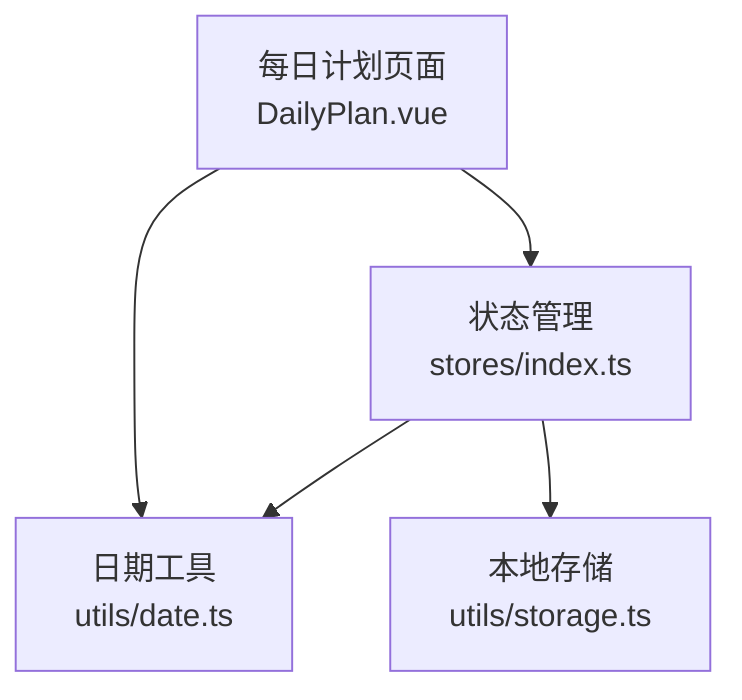
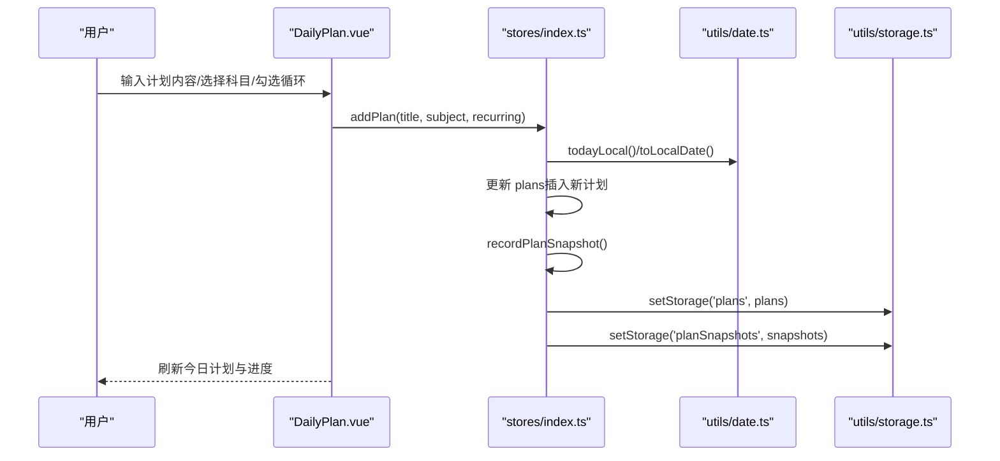
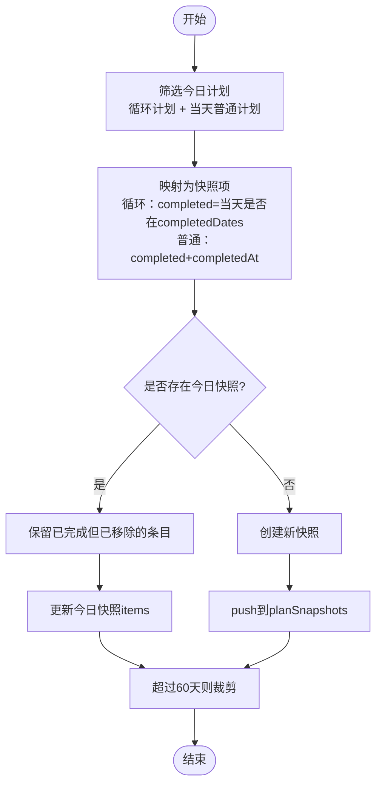
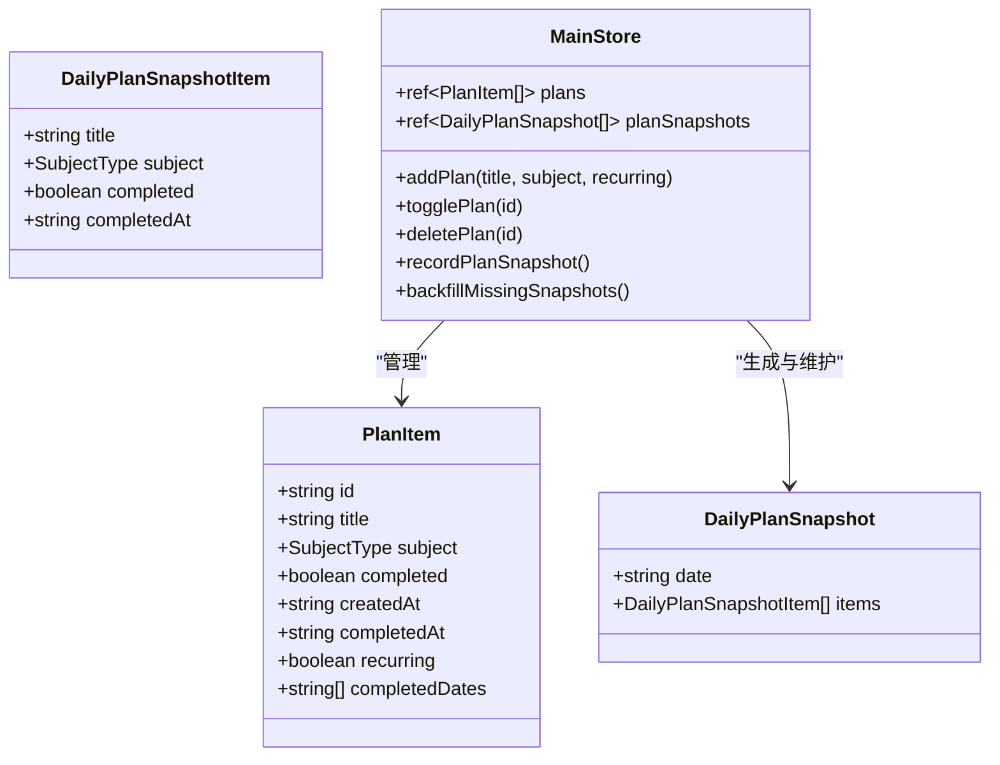
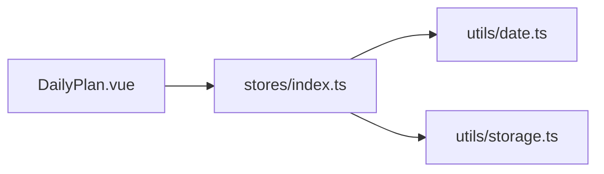

# 学习计划管理

<cite>
**本文引用的文件**
- [DailyPlan.vue](file://src/renderer/src/views/DailyPlan.vue)
- [stores/index.ts](file://src/renderer/src/stores/index.ts)
- [utils/date.ts](file://src/renderer/src/utils/date.ts)
- [utils/storage.ts](file://src/renderer/src/utils/storage.ts)
- [README.md](file://README.md)
</cite>

## 目录
1. [简介](#简介)
2. [项目结构](#项目结构)
3. [核心组件](#核心组件)
4. [架构总览](#架构总览)
5. [详细组件分析](#详细组件分析)
6. [依赖关系分析](#依赖关系分析)
7. [性能与扩展建议](#性能与扩展建议)
8. [故障排查指南](#故障排查指南)
9. [结论](#结论)
10. [附录：API 参考](#附录api-参考)

## 简介
本章节面向“学习计划管理”功能，系统说明计划创建、编辑（通过完成状态切换）、删除与完成状态管理的实现原理；解释普通计划与循环计划的区别与使用场景；阐述数据结构设计、日期处理逻辑、历史记录机制、进度计算、完成状态跟踪以及每日快照生成过程。同时提供完整的 API 接口说明与使用示例，并给出分类、科目标签与完成时间记录的实现细节。文档兼顾初学者入门与高级用户扩展开发需求。

## 项目结构
学习计划管理涉及渲染层页面、状态管理与工具函数三个层次：
- 渲染层：每日计划页面负责展示今日计划、添加/勾选/删除计划、历史查看等交互。
- 状态层：Pinia Store 集中管理计划数据、完成状态、历史快照及持久化。
- 工具层：日期工具统一本地日期比较，存储工具负责本地持久化与迁移。

图表来源
- [DailyPlan.vue:189-320](file://src/renderer/src/views/DailyPlan.vue#L189-L320)
- [stores/index.ts:219-699](file://src/renderer/src/stores/index.ts#L219-L699)
- [utils/date.ts:1-17](file://src/renderer/src/utils/date.ts#L1-L17)
- [utils/storage.ts:1-346](file://src/renderer/src/utils/storage.ts#L1-L346)

章节来源
- [DailyPlan.vue:1-320](file://src/renderer/src/views/DailyPlan.vue#L1-L320)
- [stores/index.ts:219-699](file://src/renderer/src/stores/index.ts#L219-L699)
- [utils/date.ts:1-17](file://src/renderer/src/utils/date.ts#L1-L17)
- [utils/storage.ts:1-346](file://src/renderer/src/utils/storage.ts#L1-L346)

## 核心组件
- 计划数据模型：包含唯一标识、标题、科目、是否完成、创建时间、完成时间、是否循环、循环完成日期列表等字段。
- 科目配置：定义科目名称、简称、颜色与标签类型，用于界面标签展示。
- 每日计划快照：按本地日期固化当天全部计划（含循环与普通）的实际完成状态，支持历史回溯。
- 状态方法：addPlan、togglePlan、deletePlan、recordPlanSnapshot、backfillMissingSnapshots 等。

章节来源
- [stores/index.ts:27-76](file://src/renderer/src/stores/index.ts#L27-L76)
- [stores/index.ts:20-25](file://src/renderer/src/stores/index.ts#L20-L25)
- [stores/index.ts:400-524](file://src/renderer/src/stores/index.ts#L400-L524)

## 架构总览
计划管理采用“视图-状态-工具”的分层架构：
- 视图层（DailyPlan.vue）：收集用户输入（标题、科目、是否循环），调用 Store 的 addPlan/togglePlan/deletePlan 等方法，并基于 Store 暴露的计算属性渲染今日计划与历史。
- 状态层（stores/index.ts）：维护 plans 与 planSnapshots，封装业务逻辑（创建、切换完成、删除、快照记录、缺失回填），并通过 watch 自动持久化。
- 工具层（utils/date.ts, utils/storage.ts）：提供统一的本地日期计算与本地存储读写能力，避免时区错位与数据丢失。

图表来源
- [DailyPlan.vue:265-320](file://src/renderer/src/views/DailyPlan.vue#L265-L320)
- [stores/index.ts:400-524](file://src/renderer/src/stores/index.ts#L400-L524)
- [utils/date.ts:1-17](file://src/renderer/src/utils/date.ts#L1-L17)
- [utils/storage.ts:239-246](file://src/renderer/src/utils/storage.ts#L239-L246)

## 详细组件分析

### 数据结构设计
- PlanItem：计划项，包含 id、title、subject、completed、createdAt、completedAt、recurring、completedDates。
- DailyPlanSnapshotItem：快照中的单条计划信息，包含 title、subject、completed、completedAt。
- DailyPlanSnapshot：按日期聚合的快照，包含 date 与 items。
- SubjectType 与 SUBJECT_CONFIG：科目类型与配置映射，用于界面标签与颜色。

复杂度与特性：
- 计划列表为数组，查找与过滤为 O(n)。
- 循环计划的 completedDates 为字符串数组，查询当天完成状态为 O(k)，k 为已完成的日期数。
- 快照合并策略保留已完成但被清理的计划条目，避免历史丢失。

章节来源
- [stores/index.ts:27-76](file://src/renderer/src/stores/index.ts#L27-L76)
- [stores/index.ts:20-25](file://src/renderer/src/stores/index.ts#L20-L25)

### 普通计划与循环计划的区别与使用场景
- 普通计划：一次性任务，创建后仅当日有效，完成时记录 completedAt，适合“今天要做的事”。
- 循环计划：每日重复的任务，通过 completedDates 记录每天完成情况，适合“每天坚持的学习习惯”，如背单词、阅读等。

差异点：
- 完成状态：普通计划用 completed 字段；循环计划用 completedDates 包含当天日期表示完成。
- 历史快照：普通计划记录 completedAt；循环计划不记录具体完成时间，仅记录当天是否完成。
- 今日显示：两者均会出现在“今日计划”中，但判断完成状态的逻辑不同。

章节来源
- [stores/index.ts:400-445](file://src/renderer/src/stores/index.ts#L400-L445)
- [DailyPlan.vue:215-237](file://src/renderer/src/views/DailyPlan.vue#L215-L237)

### 日期处理逻辑
- 统一使用本地日期进行比较，避免 UTC 存储导致的跨时区错位问题。
- todayLocal() 获取当前本地日期 YYYY-MM-DD。
- toLocalDate(iso) 将 ISO 时间戳转换为本地日期，用于判断计划是否创建于当天。

章节来源
- [utils/date.ts:1-17](file://src/renderer/src/utils/date.ts#L1-L17)
- [stores/index.ts:7-10](file://src/renderer/src/stores/index.ts#L7-L10)

### 历史记录机制与每日快照
- 触发时机：每次新增、切换完成、删除计划时都会记录当日快照。
- 快照口径：包含所有循环计划 + 当天创建的普通计划。
- 合并策略：若已有今日快照，则与当前计划列表合并，保留已完成但已从当前列表移除的条目，防止“清除已完成”导致历史丢失。
- 容量控制：仅保留最近 60 天快照，避免存储膨胀。
- 启动回填：应用启动时回填最近 7 天内缺失的快照（仅非循环计划），增强鲁棒性。

图表来源
- [stores/index.ts:447-502](file://src/renderer/src/stores/index.ts#L447-L502)
- [stores/index.ts:504-524](file://src/renderer/src/stores/index.ts#L504-L524)

章节来源
- [stores/index.ts:447-524](file://src/renderer/src/stores/index.ts#L447-L524)

### 计划进度计算与完成状态跟踪
- 进度计算：今日完成数 / 今日计划总数，百分比四舍五入。
- 完成状态：
  - 普通计划：直接切换 completed，并记录 completedAt。
  - 循环计划：在 completedDates 中添加或移除当天日期，同步 completed 字段供 Dashboard 使用。
- 批量操作：支持“全部完成”和“清除已完成”，后者仅针对当天普通且已完成的计划。

章节来源
- [DailyPlan.vue:224-237](file://src/renderer/src/views/DailyPlan.vue#L224-L237)
- [stores/index.ts:415-445](file://src/renderer/src/stores/index.ts#L415-L445)
- [DailyPlan.vue:297-319](file://src/renderer/src/views/DailyPlan.vue#L297-L319)

### 分类、科目标签与完成时间记录
- 分类：通过 subject 字段关联科目类型。
- 标签：使用 SUBJECT_CONFIG 中的 shortName 与 color 渲染标签。
- 完成时间：普通计划完成时记录 completedAt；循环计划不记录具体时间，仅记录当天是否完成。

章节来源
- [stores/index.ts:20-25](file://src/renderer/src/stores/index.ts#L20-L25)
- [DailyPlan.vue:103-125](file://src/renderer/src/views/DailyPlan.vue#L103-L125)

### 类图（代码级关系）

图表来源
- [stores/index.ts:27-76](file://src/renderer/src/stores/index.ts#L27-L76)
- [stores/index.ts:400-524](file://src/renderer/src/stores/index.ts#L400-L524)

## 依赖关系分析
- DailyPlan.vue 依赖 stores/index.ts 提供的状态与方法，依赖 utils/date.ts 进行日期格式化与比较。
- stores/index.ts 依赖 utils/date.ts 与 utils/storage.ts，负责数据变更与持久化。
- 存储层提供缓存与 localStorage 双通道写入，确保数据不丢失并在退出前强制 flush。

图表来源
- [DailyPlan.vue:189-320](file://src/renderer/src/views/DailyPlan.vue#L189-L320)
- [stores/index.ts:219-699](file://src/renderer/src/stores/index.ts#L219-L699)
- [utils/date.ts:1-17](file://src/renderer/src/utils/date.ts#L1-L17)
- [utils/storage.ts:1-346](file://src/renderer/src/utils/storage.ts#L1-L346)

章节来源
- [DailyPlan.vue:189-320](file://src/renderer/src/views/DailyPlan.vue#L189-L320)
- [stores/index.ts:219-699](file://src/renderer/src/stores/index.ts#L219-L699)

## 性能与扩展建议
- 性能：
  - 计划列表与快照均为内存数组，日常使用规模较小，O(n) 操作可接受。
  - 快照限制为 60 天，避免长期累积造成存储压力。
  - 日期比较统一使用本地日期，减少时区错误带来的重算与异常分支。
- 扩展：
  - 可增加计划优先级、截止日期、提醒等字段，并在快照中保留必要信息。
  - 可引入更复杂的循环规则（如每周固定几天），需扩展 completedDates 或新增周期表。
  - 可导出历史快照为报告，结合 ECharts 可视化学习趋势。

[本节为通用指导，不直接分析具体文件]

## 故障排查指南
- 历史快照丢失：
  - 检查应用启动时是否执行 backfillMissingSnapshots，确保最近 7 天缺失的非循环计划快照被回填。
  - 确认 recordPlanSnapshot 在增删改时都被调用。
- 日期错位导致今日计划消失：
  - 确保使用 todayLocal() 与 toLocalDate() 进行本地日期比较，避免直接使用 UTC 字符串前缀。
- 存储写入失败：
  - 检查 storage.ts 的 lsSet 与 flushAll 逻辑，确认 beforeunload/pagehide 事件监听正常。
  - 容量不足时会尝试清理旧数据后重试，关注控制台错误日志。

章节来源
- [stores/index.ts:504-524](file://src/renderer/src/stores/index.ts#L504-L524)
- [utils/date.ts:1-17](file://src/renderer/src/utils/date.ts#L1-L17)
- [utils/storage.ts:50-65](file://src/renderer/src/utils/storage.ts#L50-L65)
- [utils/storage.ts:173-188](file://src/renderer/src/utils/storage.ts#L173-L188)

## 结论
学习计划管理以清晰的三层架构实现了普通计划与循环计划的全生命周期管理，配合本地日期工具与稳健的存储机制，保证了数据的准确性与持久性。每日快照机制提供了可靠的历史回溯能力，便于用户复盘与统计。对于初学者，可直接使用 addPlan、togglePlan、deletePlan 等方法完成日常操作；对于高级用户，可在 Store 中扩展计划字段与循环规则，或在视图层增加更多交互与可视化。

[本节为总结，不直接分析具体文件]

## 附录：API 参考

- addPlan(title, subject?, recurring?)
  - 作用：添加一个新计划，支持可选科目与是否循环。
  - 参数：
    - title: 计划标题（必填）
    - subject: 科目类型（可选）
    - recurring: 是否循环（默认 false）
  - 行为：插入到 plans 头部，并记录当日快照。
  - 示例路径：[DailyPlan.vue:265-279](file://src/renderer/src/views/DailyPlan.vue#L265-L279), [stores/index.ts:400-413](file://src/renderer/src/stores/index.ts#L400-L413)

- togglePlan(id)
  - 作用：切换指定计划的完成状态。
  - 参数：id: 计划唯一标识。
  - 行为：
    - 循环计划：在 completedDates 中添加或移除当天日期，并同步 completed。
    - 普通计划：切换 completed，并记录 completedAt。
  - 示例路径：[DailyPlan.vue:289-291](file://src/renderer/src/views/DailyPlan.vue#L289-L291), [stores/index.ts:415-439](file://src/renderer/src/stores/index.ts#L415-L439)

- deletePlan(id)
  - 作用：删除指定计划。
  - 参数：id: 计划唯一标识。
  - 行为：从 plans 中移除，并记录当日快照。
  - 示例路径：[DailyPlan.vue:293-295](file://src/renderer/src/views/DailyPlan.vue#L293-L295), [stores/index.ts:441-445](file://src/renderer/src/stores/index.ts#L441-L445)

- recordPlanSnapshot()
  - 作用：记录当日计划快照，包含循环与普通计划的实际完成状态。
  - 行为：筛选今日计划、映射为快照项、合并已有快照、限制 60 天。
  - 示例路径：[stores/index.ts:447-502](file://src/renderer/src/stores/index.ts#L447-L502)

- backfillMissingSnapshots()
  - 作用：启动时回填最近 7 天内缺失的快照（仅非循环计划）。
  - 行为：遍历过去 7 天，若无快照则根据当天普通计划重建。
  - 示例路径：[stores/index.ts:504-524](file://src/renderer/src/stores/index.ts#L504-L524)

- 其他辅助方法
  - completeAll(): 一键完成今日未完成的计划。
  - clearCompleted(): 清除当天已完成的普通计划。
  - 示例路径：[DailyPlan.vue:297-319](file://src/renderer/src/views/DailyPlan.vue#L297-L319)

章节来源
- [DailyPlan.vue:265-319](file://src/renderer/src/views/DailyPlan.vue#L265-L319)
- [stores/index.ts:400-524](file://src/renderer/src/stores/index.ts#L400-L524)