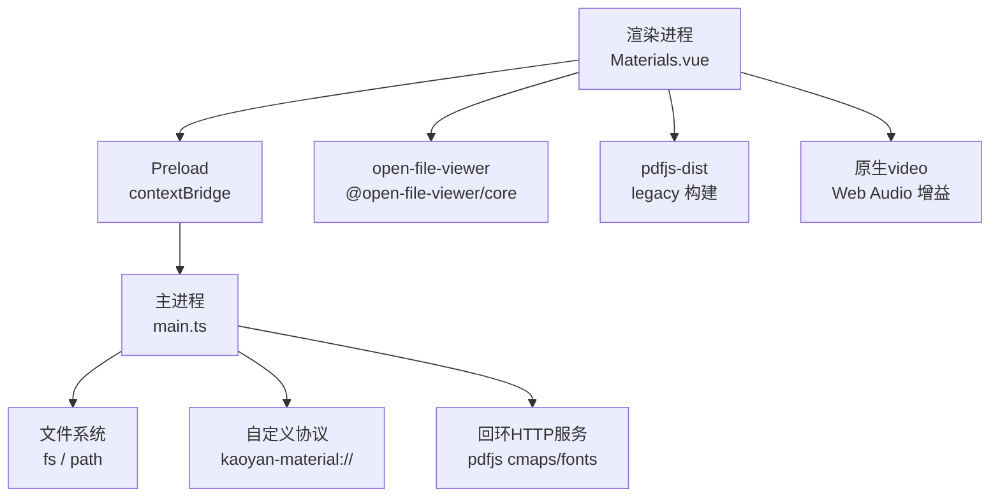
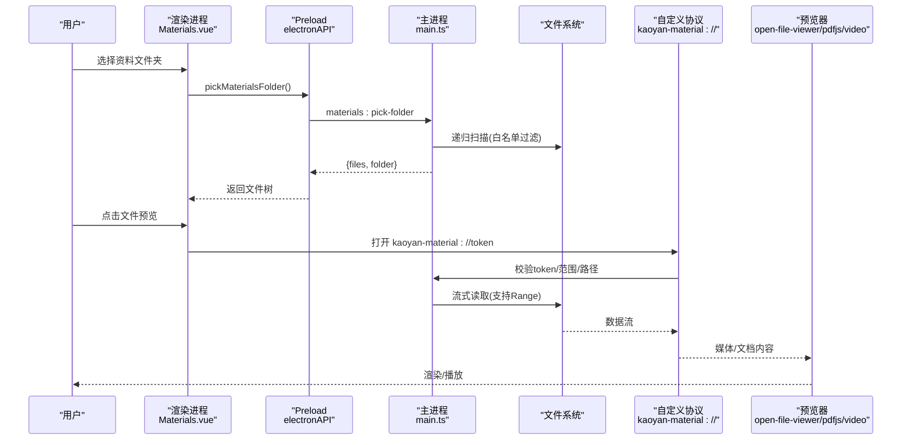
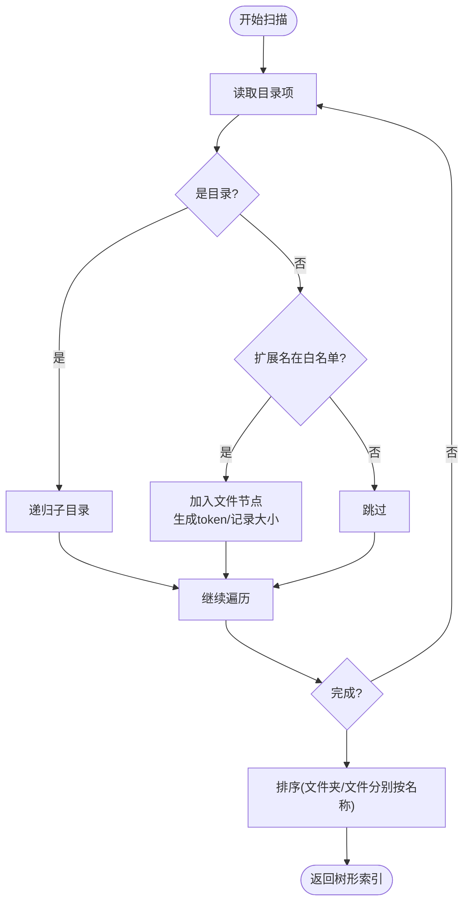
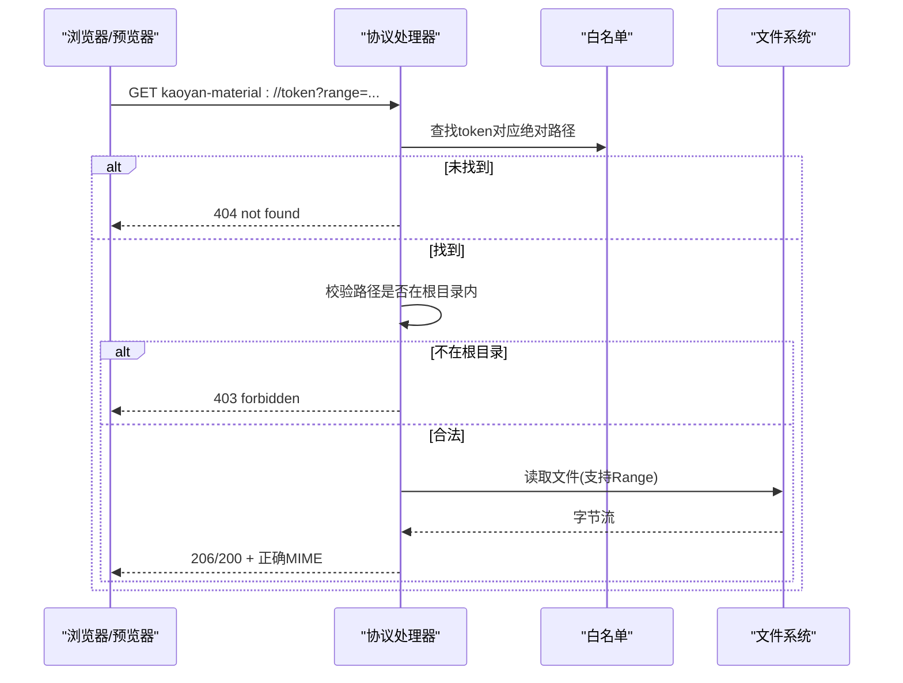
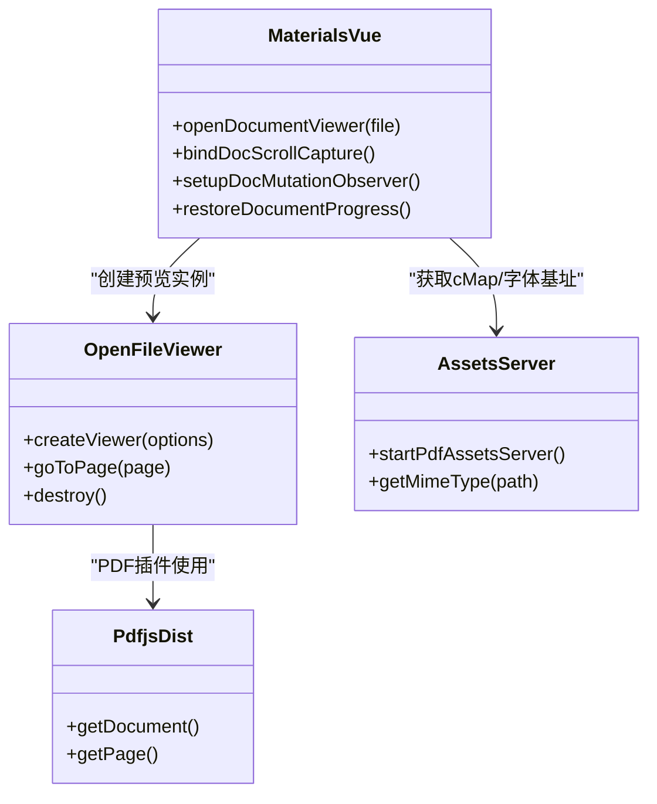
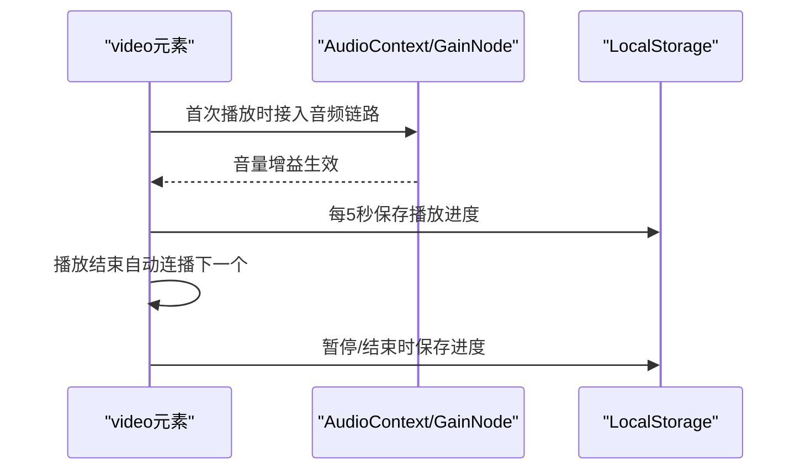
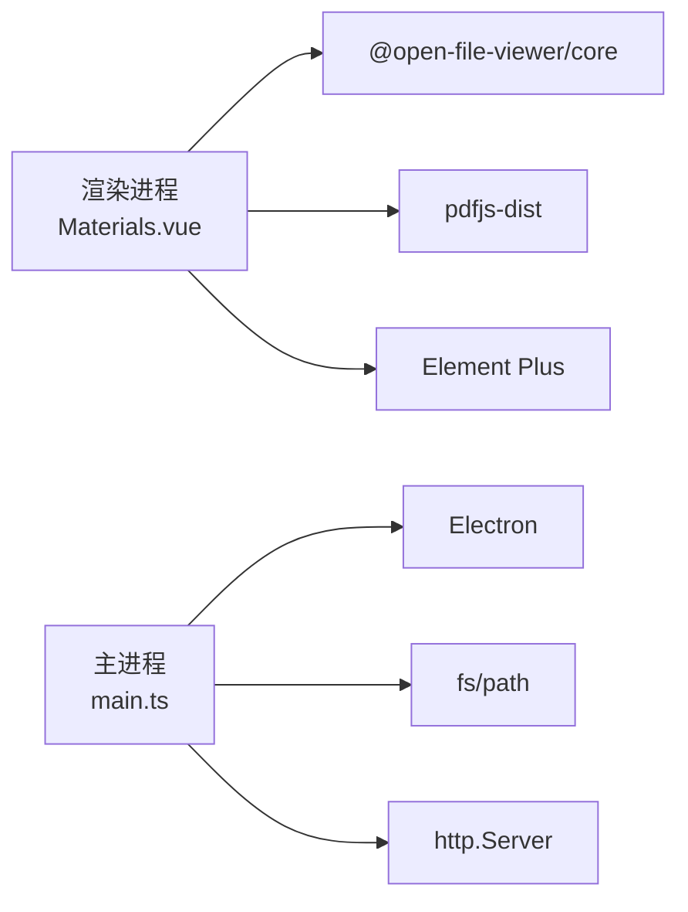

# 学习资料管理

<cite>
**本文引用的文件**
- [README.md](file://README.md)
- [package.json](file://package.json)
- [main.ts](file://src/main/main.ts)
- [preload.ts](file://src/preload/preload.ts)
- [Materials.vue](file://src/renderer/src/views/Materials.vue)
</cite>

## 目录
1. [简介](#简介)
2. [项目结构](#项目结构)
3. [核心组件](#核心组件)
4. [架构总览](#架构总览)
5. [详细组件分析](#详细组件分析)
6. [依赖关系分析](#依赖关系分析)
7. [性能考量](#性能考量)
8. [故障排查指南](#故障排查指南)
9. [结论](#结论)
10. [附录：API 与操作说明](#附录api-与操作说明)

## 简介
本资料管理功能基于 Electron + Vue 3，提供本地多格式文件（PDF、视频、文档等）的扫描、索引、预览与播放能力。通过主进程安全协议与 IPC 通信，实现白名单访问控制、Range 流式读取、进度记忆与跨平台兼容。同时集成 PDF.js（通过 open-file-viewer 统一文档预览）与原生视频播放器，支持倍速、音量增益、自动连播与播放列表。

## 项目结构
- 主进程负责：窗口/托盘管理、自定义协议注册（kaoyan-material://、kaoyan-assets://）、资源回环 HTTP 服务、文件夹扫描与白名单构建、IPC 接口暴露。
- Preload 层：通过 contextBridge 将受控 API 暴露给渲染进程，屏蔽底层系统调用。
- 渲染进程：资料页 UI、文件树展示、文档/视频预览、学习进度保存与恢复。

图表来源
- [main.ts:191-276](file://src/main/main.ts#L191-L276)
- [main.ts:542-615](file://src/main/main.ts#L542-L615)
- [Materials.vue:731-845](file://src/renderer/src/views/Materials.vue#L731-L845)

章节来源
- [README.md:111-130](file://README.md#L111-L130)
- [package.json:19-32](file://package.json#L19-L32)

## 核心组件
- 资料文件夹扫描与索引：递归遍历用户选择的根目录，仅保留允许扩展名，生成树形结构并建立 token->绝对路径白名单。
- 安全协议访问：通过 kaoyan-material:// 协议提供 Range 流式读取，限制在已选根目录下，防止越权访问。
- 文档预览：统一使用 @open-file-viewer/core 的多插件架构（PDF/Office/图片），PDF 使用 pdfjs-dist legacy 构建，并通过回环 HTTP 或备用协议加载 CMap/标准字体。
- 视频播放：原生 <video> 元素，支持倍速、音量增益、自动连播、播放列表、首帧封面与错误提示。
- 学习进度：localStorage 持久化文档页码/滚动百分比与视频播放位置，应用重启后恢复。

章节来源
- [main.ts:854-935](file://src/main/main.ts#L854-L935)
- [main.ts:542-615](file://src/main/main.ts#L542-L615)
- [Materials.vue:731-845](file://src/renderer/src/views/Materials.vue#L731-L845)
- [Materials.vue:1163-1224](file://src/renderer/src/views/Materials.vue#L1163-L1224)

## 架构总览

图表来源
- [main.ts:901-935](file://src/main/main.ts#L901-L935)
- [main.ts:542-615](file://src/main/main.ts#L542-L615)
- [Materials.vue:1550-1595](file://src/renderer/src/views/Materials.vue#L1550-L1595)

## 详细组件分析

### 文件夹扫描机制与文件索引构建
- 扫描策略：从用户选择的根目录开始递归遍历，仅保留允许的扩展名集合（PDF、MP4、MKV、AVI、MOV、FLV、WMV、DOCX、XLSX、图片等）。
- 索引结构：返回树形节点，包含名称、类型、相对路径、URL（带 token）、扩展名与文件大小；文件夹在前、文件在后，各自按名称排序。
- 白名单机制：为每个文件生成唯一 token，并在内存中维护 token -> 绝对路径映射，后续协议访问时校验。
- 根目录校验：所有协议访问均要求解析后的绝对路径以所选根目录开头，防止路径穿越。

图表来源
- [main.ts:854-899](file://src/main/main.ts#L854-L899)

章节来源
- [main.ts:854-935](file://src/main/main.ts#L854-L935)

### 安全访问控制与路径白名单验证
- 自定义协议：kaoyan-material:// 仅接受白名单中的 token，拒绝未知 token。
- 路径校验：解析 token 得到绝对路径，校验其位于所选根目录之下，否则返回 403。
- Range 支持：对视频/大文件请求支持 Range 头，返回 206 Partial Content，提升拖动进度与快速加载体验。
- MIME 类型：根据扩展名设置正确的 Content-Type，确保浏览器/播放器正确识别。

图表来源
- [main.ts:542-615](file://src/main/main.ts#L542-L615)

章节来源
- [main.ts:100-134](file://src/main/main.ts#L100-L134)
- [main.ts:542-615](file://src/main/main.ts#L542-L615)

### 文档预览与 PDF.js 集成
- 统一预览：PDF、Office（docx/xlsx/pptx）、图片统一通过 @open-file-viewer/core 的 createViewer 渲染，共享工具栏与页码跟踪。
- PDF 配置：
  - 使用 pdfjs-dist 的 legacy 构建，避免 Electron 28/Chromium 120 下的 ES2025 兼容问题。
  - 通过主进程回环 HTTP 服务（http://127.0.0.1）提供 cmaps 与 standard_fonts，失败时回退到 kaoyan-assets:// 协议。
  - 对 getTextContent 进行防御性包装，文本层提取失败不覆盖已渲染页面，避免黑屏。
- 进度记忆：PDF 初始页码通过 initialPage 恢复；滚动与页码变化节流保存，离开/失活时保存当前进度。

图表来源
- [Materials.vue:731-845](file://src/renderer/src/views/Materials.vue#L731-L845)
- [main.ts:212-276](file://src/main/main.ts#L212-L276)

章节来源
- [Materials.vue:731-845](file://src/renderer/src/views/Materials.vue#L731-L845)
- [main.ts:212-276](file://src/main/main.ts#L212-L276)

### 视频播放器技术选型与兼容性处理
- 技术选型：原生 HTMLVideoElement，配合 Web Audio API 的 GainNode 实现音量增益。
- 兼容性：
  - 检测音轨是否存在，若缺失或编码不支持（如 AC3/DTS/E-AC3），给出转码建议。
  - 首帧封面：seek 到 0.1s 后用 canvas 截图作为 poster。
  - 错误处理：区分加载/解码错误，提示可能原因与建议。
- 功能：
  - 倍速播放、快进/快退、自动连播、播放列表（同级视频）、键盘快捷键。
  - 播放进度持久化：结尾附近视为看完则下次从头播放。

图表来源
- [Materials.vue:1380-1493](file://src/renderer/src/views/Materials.vue#L1380-L1493)
- [Materials.vue:1214-1224](file://src/renderer/src/views/Materials.vue#L1214-L1224)

章节来源
- [Materials.vue:1380-1493](file://src/renderer/src/views/Materials.vue#L1380-L1493)
- [Materials.vue:1214-1224](file://src/renderer/src/views/Materials.vue#L1214-L1224)

### IPC 通信与 API 暴露
- Preload 暴露方法：包括资料文件夹选择、恢复、列出文件、外部打开、获取资源基址等。
- 主进程处理：实现文件夹扫描、白名单构建、协议访问、系统默认应用打开、外部链接打开等。
- 安全边界：仅暴露必要方法，严格校验输入与路径，避免任意文件访问。

章节来源
- [preload.ts:29-36](file://src/preload/preload.ts#L29-L36)
- [main.ts:901-959](file://src/main/main.ts#L901-L959)

## 依赖关系分析
- 前端依赖：
  - @open-file-viewer/core：统一文档预览（PDF/Office/图片）。
  - pdfjs-dist：PDF 渲染（legacy 构建）。
  - Element Plus、Vue Router、Pinia 等 UI/状态管理。
- 主进程依赖：
  - Electron 内置模块：app、BrowserWindow、ipcMain、protocol、net、Tray、dialog、shell、session。
  - electron-updater：应用更新。
  - Node.js fs/path/http：文件与网络服务。

图表来源
- [package.json:19-32](file://package.json#L19-L32)
- [main.ts:1-7](file://src/main/main.ts#L1-L7)

章节来源
- [package.json:19-32](file://package.json#L19-L32)
- [main.ts:1-7](file://src/main/main.ts#L1-L7)

## 性能考量
- 大文件流式读取：使用 fs.createReadStream + ReadableStream，设置 highWaterMark 降低系统调用次数，提升吞吐。
- Range 请求：支持视频拖动与快速加载，减少不必要的数据传输。
- 文档预览优化：
  - MutationObserver + ResizeObserver 防抖与缓存，避免频繁 DOM 查询导致的卡顿。
  - 页面块数组缓存，滚动帧直接命中缓存。
  - 代际守卫：快速切换文件时丢弃旧异步流程，避免覆盖新文件状态。
- 进度保存节流：文档滚动每 1.5 秒保存一次，视频每 5 秒保存一次，避免频繁写 localStorage。

章节来源
- [main.ts:558-615](file://src/main/main.ts#L558-L615)
- [Materials.vue:567-616](file://src/renderer/src/views/Materials.vue#L567-L616)
- [Materials.vue:1180-1224](file://src/renderer/src/views/Materials.vue#L1180-L1224)

## 故障排查指南
- PDF 黑屏/无法渲染：
  - 检查回环 HTTP 服务是否启动成功，若失败会回退到 kaoyan-assets:// 协议。
  - 确认 cmaps 与 standard_fonts 资源已复制到 public/pdfjs 目录。
  - getTextContent 异常会被降级为空文本层，不影响已渲染页面。
- 视频无法播放/无声：
  - 检查视频编码是否为浏览器支持的 H.264 + AAC（MP4 推荐）。
  - 若无音轨或编码不支持，界面会提示转码建议。
  - 确认 Web Audio 上下文已创建且处于运行态。
- 协议访问被拒：
  - 确认 token 有效且文件仍在所选根目录内。
  - 检查路径是否发生移动或删除。

章节来源
- [main.ts:212-276](file://src/main/main.ts#L212-L276)
- [main.ts:542-615](file://src/main/main.ts#L542-L615)
- [Materials.vue:1380-1493](file://src/renderer/src/views/Materials.vue#L1380-L1493)

## 结论
本资料管理功能通过主进程安全协议与 IPC 通信，实现了多格式文件的本地扫描、索引、预览与播放。PDF 通过 open-file-viewer 与 pdfjs-dist 实现离线可用与中文无乱码；视频采用原生播放器并增强音量增益与播放体验。整体设计注重安全性、性能与用户体验，适合学习与办公场景。

## 附录：API 与操作说明

### 用户操作指南
- 选择资料文件夹：点击“选择资料文件夹”，选择包含 PDF/视频/文档的根目录。
- 刷新列表：点击“刷新”重新扫描当前文件夹。
- 预览文件：点击文件即可在右侧预览区打开；PDF/Office/图片走统一文档预览，视频走原生播放器。
- 默认应用打开：点击“默认应用打开”使用系统应用查看文件。
- 哔哩哔哩模式：切换到“哔哩哔哩”可在线搜索与观看视频（需登录）。

### 开发者参考：IPC 接口清单（资料相关）
- 选择资料文件夹
  - 调用方：渲染进程 via preload
  - 通道：materials:pick-folder
  - 返回：{ success, canceled, files, folder }
- 恢复上次资料文件夹
  - 通道：materials:restore-folder
  - 返回：{ success, canceled, files, folder }
- 列出当前资料文件
  - 通道：materials:list-files
  - 返回：{ success, files, folder }
- 使用系统默认应用打开文件
  - 通道：materials:open-external
  - 参数：token
  - 返回：{ success, message }
- 获取 PDF.js 静态资源基址
  - 通道：assets:get-base-url
  - 返回：字符串（http://127.0.0.1:... 或空表示回退协议）

章节来源
- [preload.ts:29-36](file://src/preload/preload.ts#L29-L36)
- [main.ts:901-959](file://src/main/main.ts#L901-L959)
- [main.ts:534-536](file://src/main/main.ts#L534-L536)

### 文件上传、下载、重命名与删除
- 当前仓库未实现文件上传、下载、重命名与删除的 IPC 接口。
- 现有能力：
  - 通过 kaoyan-material:// 协议只读访问文件（支持 Range 流式读取）。
  - 通过 materials:open-external 使用系统默认应用打开文件。
- 如需扩展：
  - 在主进程新增 IPC 处理函数（如 materials:upload、materials:rename、materials:delete）。
  - 在 Preload 层暴露对应方法。
  - 在渲染进程调用并处理结果。
  - 保持路径白名单校验与安全策略一致。

章节来源
- [main.ts:937-959](file://src/main/main.ts#L937-L959)
- [preload.ts:29-36](file://src/preload/preload.ts#L29-L36)