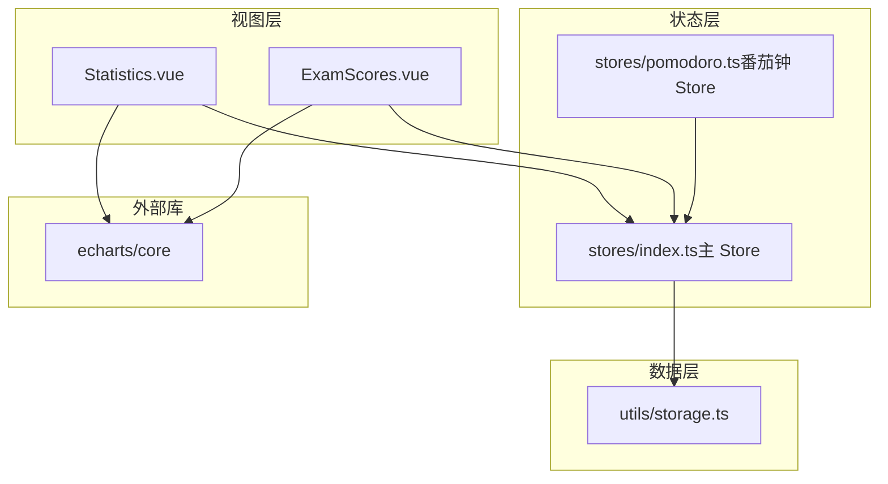
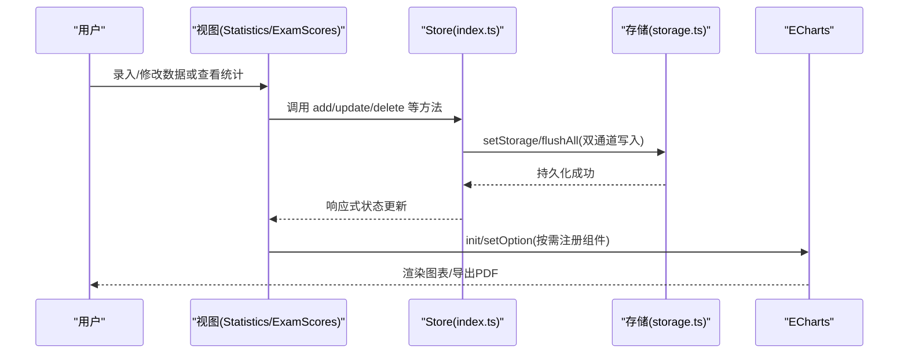
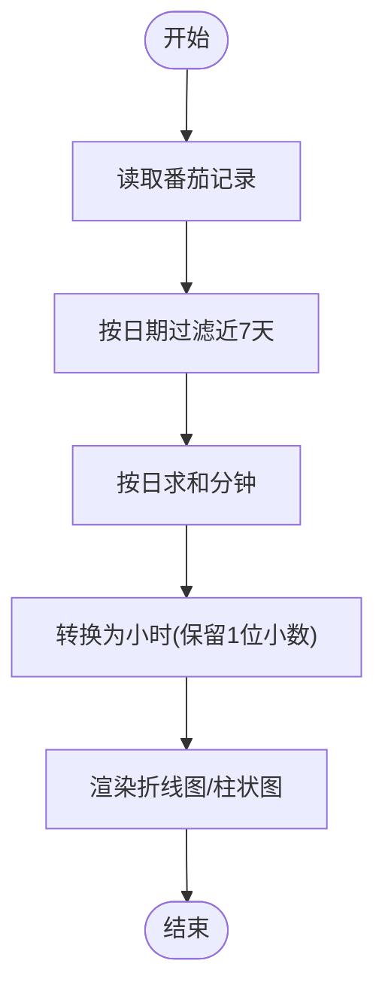
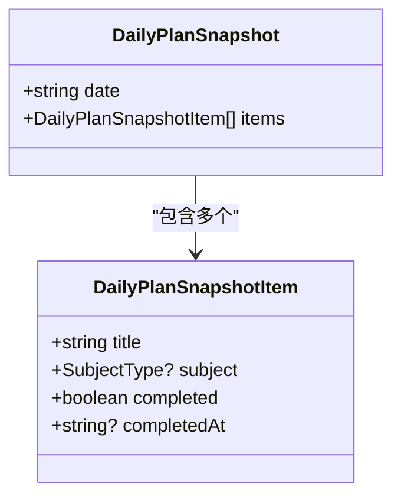
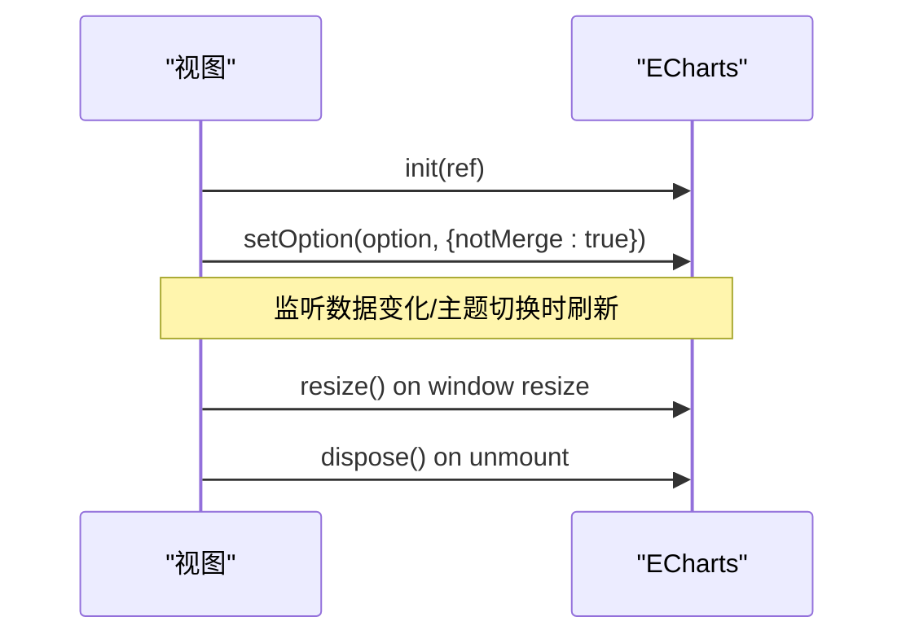
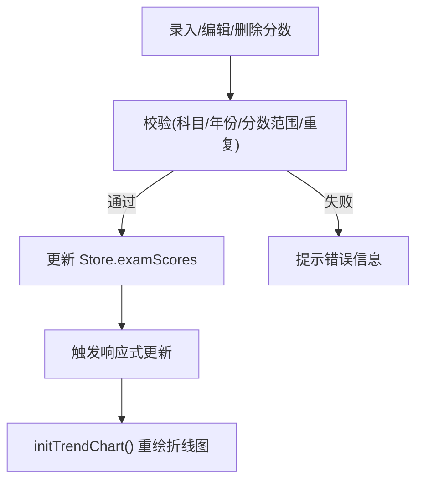
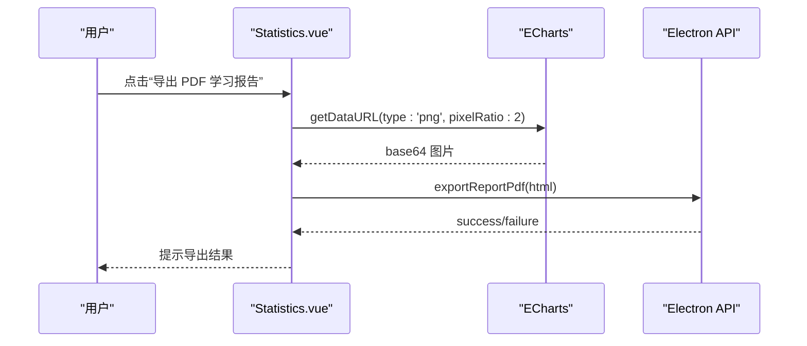
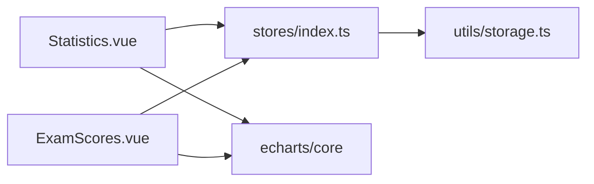

# 数据统计分析

<cite>
**本文引用的文件**
- [Statistics.vue](file://src/renderer/src/views/Statistics.vue)
- [ExamScores.vue](file://src/renderer/src/views/ExamScores.vue)
- [index.ts（主 Store）](file://src/renderer/src/stores/index.ts)
- [pomodoro.ts（番茄钟 Store）](file://src/renderer/src/stores/pomodoro.ts)
- [storage.ts（本地存储工具）](file://src/renderer/src/utils/storage.ts)
- [package.json](file://package.json)
</cite>

## 目录
1. [简介](#简介)
2. [项目结构](#项目结构)
3. [核心组件](#核心组件)
4. [架构总览](#架构总览)
5. [详细组件分析](#详细组件分析)
6. [依赖关系分析](#依赖关系分析)
7. [性能与大数据处理](#性能与大数据处理)
8. [故障排查](#故障排查)
9. [结论](#结论)
10. [附录：图表配置与导出说明](#附录图表配置与导出说明)

## 简介
本章节面向用户与开发者，系统性阐述“数据统计分析”功能的实现原理与使用方法。内容覆盖学习时长统计、完成进度分析、可视化图表展示、ECharts 集成与自定义配置、考试分数记录的数据结构与统计分析逻辑、数据聚合算法、时间范围筛选与趋势分析、图表类型选择与样式定制、数据导出能力，以及性能优化策略与大数据处理最佳实践。

## 项目结构
本项目采用 Vue 3 + Pinia + ECharts 的前端架构，数据存储基于 localStorage 的同步持久化工具层。统计页面位于渲染进程视图层，通过 Store 暴露的状态进行计算与展示；考试分数页提供录入、编辑、删除与趋势图展示；存储层负责数据版本迁移、容量不足降级与双保险写入。

**图表来源**
- [Statistics.vue:116-141](file://src/renderer/src/views/Statistics.vue#L116-L141)
- [ExamScores.vue:164-177](file://src/renderer/src/views/ExamScores.vue#L164-L177)
- [index.ts:219-235](file://src/renderer/src/stores/index.ts#L219-L235)
- [pomodoro.ts:112-121](file://src/renderer/src/stores/pomodoro.ts#L112-L121)
- [storage.ts:144-188](file://src/renderer/src/utils/storage.ts#L144-L188)

**章节来源**
- [Statistics.vue:1-114](file://src/renderer/src/views/Statistics.vue#L1-L114)
- [ExamScores.vue:1-162](file://src/renderer/src/views/ExamScores.vue#L1-L162)
- [index.ts:1-138](file://src/renderer/src/stores/index.ts#L1-L138)
- [pomodoro.ts:1-40](file://src/renderer/src/stores/pomodoro.ts#L1-L40)
- [storage.ts:1-46](file://src/renderer/src/utils/storage.ts#L1-L46)

## 核心组件
- 学习时长统计：基于番茄钟记录聚合每日学习时长、近7天趋势、科目分布与累计小时数。
- 完成进度分析：基于计划快照与每日记录，汇总当日计划完成情况与学习行为。
- 可视化图表：使用 ECharts 按需注册组件，渲染折线图、柱状图、饼图与学习日历热力块。
- 考试分数记录：支持录入、编辑、删除与按年份的趋势折线图，并提供各科平均分、最高分、已练年份等统计卡片。
- 数据导出：将当前图表导出为图片并生成 HTML 报告，调用 Electron API 导出 PDF。

**章节来源**
- [Statistics.vue:154-240](file://src/renderer/src/views/Statistics.vue#L154-L240)
- [ExamScores.vue:225-237](file://src/renderer/src/views/ExamScores.vue#L225-L237)
- [index.ts:354-374](file://src/renderer/src/stores/index.ts#L354-L374)
- [storage.ts:298-323](file://src/renderer/src/utils/storage.ts#L298-L323)

## 架构总览
下图展示了从用户操作到数据持久化与图表渲染的完整链路。

**图表来源**
- [index.ts:615-624](file://src/renderer/src/stores/index.ts#L615-L624)
- [storage.ts:227-235](file://src/renderer/src/utils/storage.ts#L227-L235)
- [Statistics.vue:388-412](file://src/renderer/src/views/Statistics.vue#L388-L412)
- [ExamScores.vue:343-397](file://src/renderer/src/views/ExamScores.vue#L343-L397)

## 详细组件分析

### 学习时长统计与趋势分析
- 数据来源：番茄钟记录数组，每条记录包含日期、时长、科目与完成时间。
- 聚合算法：
  - 近7天学习时长：按日期过滤后求和分钟数。
  - 各科目学习占比：遍历科目配置，累加对应科目的分钟数并转换为小时。
  - 每日番茄数：按日期过滤计数。
  - 学习日历：近90天，按分钟区间映射等级，用于热力显示。
- 时间范围筛选：固定近7天/近90天，便于趋势观察与热力展示。
- 趋势分析：折线图平滑曲线，面积渐变填充，坐标轴与网格颜色随主题切换。

**图表来源**
- [Statistics.vue:161-181](file://src/renderer/src/views/Statistics.vue#L161-L181)
- [Statistics.vue:220-240](file://src/renderer/src/views/Statistics.vue#L220-L240)
- [index.ts:354-374](file://src/renderer/src/stores/index.ts#L354-L374)

**章节来源**
- [Statistics.vue:154-240](file://src/renderer/src/views/Statistics.vue#L154-L240)
- [index.ts:354-374](file://src/renderer/src/stores/index.ts#L354-L374)

### 完成进度分析与学习日历
- 计划快照：每日将循环与普通计划的实际完成状态固化为历史快照，避免异常退出导致丢失。
- 进度指标：今日完成计划数、今日总计划数、应用使用时长与学习时长关联。
- 学习日历：根据每日学习分钟数划分等级，以不同深浅色块呈现，辅助识别学习强度变化。

**图表来源**
- [index.ts:66-76](file://src/renderer/src/stores/index.ts#L66-L76)
- [index.ts:447-502](file://src/renderer/src/stores/index.ts#L447-L502)

**章节来源**
- [index.ts:447-502](file://src/renderer/src/stores/index.ts#L447-L502)
- [Statistics.vue:87-112](file://src/renderer/src/views/Statistics.vue#L87-L112)

### ECharts 图表集成与自定义配置
- 按需注册：仅引入 LineChart、BarChart、PieChart、GridComponent、TooltipComponent、LegendComponent、CanvasRenderer，减少打包体积。
- 实例复用：已有实例则 setOption，否则 init，避免内存泄漏。
- 主题适配：坐标轴、网格线、图例文本颜色随深浅主题动态切换。
- 图表类型：
  - 学习时长趋势：折线图+面积渐变。
  - 各科目占比：环形饼图。
  - 每日番茄数：柱状图。
  - 各科目学习时长：柱状图。
  - 历年真题趋势：多系列折线图。

**图表来源**
- [Statistics.vue:120-141](file://src/renderer/src/views/Statistics.vue#L120-L141)
- [Statistics.vue:388-412](file://src/renderer/src/views/Statistics.vue#L388-L412)
- [ExamScores.vue:169-177](file://src/renderer/src/views/ExamScores.vue#L169-L177)
- [ExamScores.vue:343-397](file://src/renderer/src/views/ExamScores.vue#L343-L397)

**章节来源**
- [Statistics.vue:252-386](file://src/renderer/src/views/Statistics.vue#L252-L386)
- [ExamScores.vue:343-397](file://src/renderer/src/views/ExamScores.vue#L343-L397)

### 考试分数记录功能：数据结构与统计分析
- 数据结构：
  - 记录字段：id、subject、year、score、fullScore、remark、createdAt。
  - 科目满分：政治/英语 100，数学/408 150。
- 统计分析：
  - 平均分：同科目所有记录的 score 均值。
  - 最高分/最低分：max/min。
  - 已练年份数：记录条数。
  - 得分率：score/fullScore 百分比。
- 趋势分析：
  - 按年份（2009-2026）构建横轴，每科一条折线，缺失年份用 null 连接。
- 数据迁移：
  - 旧版 408 子科目分数按年合并为总分，确保趋势图连续性。

**图表来源**
- [ExamScores.vue:287-329](file://src/renderer/src/views/ExamScores.vue#L287-L329)
- [ExamScores.vue:343-397](file://src/renderer/src/views/ExamScores.vue#L343-L397)
- [index.ts:112-137](file://src/renderer/src/stores/index.ts#L112-L137)
- [index.ts:170-214](file://src/renderer/src/stores/index.ts#L170-L214)

**章节来源**
- [ExamScores.vue:225-237](file://src/renderer/src/views/ExamScores.vue#L225-L237)
- [ExamScores.vue:287-329](file://src/renderer/src/views/ExamScores.vue#L287-L329)
- [index.ts:170-214](file://src/renderer/src/stores/index.ts#L170-L214)

### 数据导出功能
- 图表导出：将每个图表实例导出为 PNG 图片（高像素比），嵌入 HTML 报告。
- 报告生成：组装学习总览、各科进度表、专注时长分布等模块。
- PDF 导出：调用 Electron API 将 HTML 转为 PDF，浏览器环境不可用。

**图表来源**
- [Statistics.vue:448-532](file://src/renderer/src/views/Statistics.vue#L448-L532)

**章节来源**
- [Statistics.vue:448-532](file://src/renderer/src/views/Statistics.vue#L448-L532)

## 依赖关系分析
- 视图依赖 Store：Statistics.vue 与 ExamScores.vue 均依赖主 Store 提供的状态与方法。
- Store 依赖存储层：所有数据变更通过 storage.ts 的 get/set/remove 接口持久化。
- 视图依赖 ECharts：按需注册图表与组件，避免全量引入。
- 依赖包：echarts、dayjs、element-plus、pinia、vue 等。

**图表来源**
- [package.json:19-31](file://package.json#L19-L31)
- [Statistics.vue:120-141](file://src/renderer/src/views/Statistics.vue#L120-L141)
- [ExamScores.vue:169-177](file://src/renderer/src/views/ExamScores.vue#L169-L177)
- [index.ts:615-624](file://src/renderer/src/stores/index.ts#L615-L624)

**章节来源**
- [package.json:19-31](file://package.json#L19-L31)
- [index.ts:615-624](file://src/renderer/src/stores/index.ts#L615-L624)

## 性能与大数据处理
- 图表性能：
  - 按需注册 ECharts 组件，减小打包体积。
  - 复用图表实例，使用 setOption 更新而非重新 init，降低开销。
  - 窗口尺寸变化时统一 resize，避免频繁重建。
  - 组件卸载时 dispose 释放资源，防止内存泄漏。
- 数据持久化：
  - 双通道写入：内存缓存 Map + 立即写入 localStorage，保证实时性与可靠性。
  - 容量不足降级：自动清理非关键数据（如历史快照、旧计划记录）。
  - 启动加载：初始化时从 localStorage 载入缓存，执行数据版本迁移。
- 大数据建议：
  - 对超长历史记录（如多年真题分数）可考虑分页或虚拟滚动。
  - 复杂聚合可在 Web Worker 中计算，避免阻塞 UI。
  - 图表大数据集可使用采样或聚合降维（如按月/季度聚合）。

**章节来源**
- [Statistics.vue:388-436](file://src/renderer/src/views/Statistics.vue#L388-L436)
- [storage.ts:93-109](file://src/renderer/src/utils/storage.ts#L93-L109)
- [storage.ts:144-188](file://src/renderer/src/utils/storage.ts#L144-L188)

## 故障排查
- 图表不显示：
  - 检查 ref 是否挂载完成，必要时在 nextTick 后初始化。
  - 确认按需注册的组件与渲染器已正确引入。
- 导出 PDF 失败：
  - 浏览器环境不支持 Electron API，需在桌面应用中运行。
  - 检查网络与权限，确保 API 可用。
- 数据丢失：
  - 检查 beforeunload/pagehide 事件是否触发 flushAll。
  - 若 localStorage 容量不足，查看是否触发了清理策略。
- 主题切换后图表样式异常：
  - 监听 isDark 变化，重新 setOption 刷新配色。

**章节来源**
- [Statistics.vue:421-436](file://src/renderer/src/views/Statistics.vue#L421-L436)
- [storage.ts:173-188](file://src/renderer/src/utils/storage.ts#L173-L188)
- [storage.ts:93-109](file://src/renderer/src/utils/storage.ts#L93-L109)

## 结论
本项目通过清晰的层次化架构实现了学习时长统计、完成进度分析与可视化展示，结合 ECharts 的灵活配置与主题适配，提供了直观的学习趋势与进度洞察。考试分数记录功能具备完善的数据结构与统计分析能力，支持趋势追踪与历史迁移。存储层的双通道写入与容量降级保障了数据的可靠性与稳定性。整体方案兼顾用户体验与性能优化，适合扩展更多统计维度与图表类型。

## 附录：图表配置与导出说明
- 图表类型选择：
  - 折线图：适合时间序列趋势（学习时长、真题分数）。
  - 柱状图：适合分类对比（科目学习时长、每日番茄数）。
  - 饼图/环形图：适合占比分析（科目学习占比）。
- 样式定制：
  - 坐标轴、网格线、图例文本颜色随主题切换。
  - 线条渐变、区域填充、圆角柱体提升视觉体验。
- 数据导出：
  - 图表导出为 PNG（高像素比），嵌入 HTML 报告。
  - 调用 Electron API 导出 PDF，浏览器环境不可用。

**章节来源**
- [Statistics.vue:252-386](file://src/renderer/src/views/Statistics.vue#L252-L386)
- [Statistics.vue:448-532](file://src/renderer/src/views/Statistics.vue#L448-L532)
- [ExamScores.vue:343-397](file://src/renderer/src/views/ExamScores.vue#L343-L397)