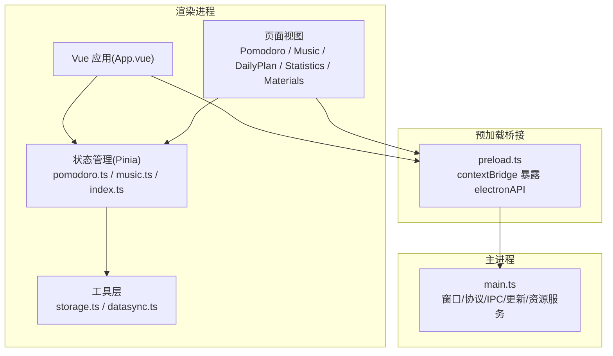
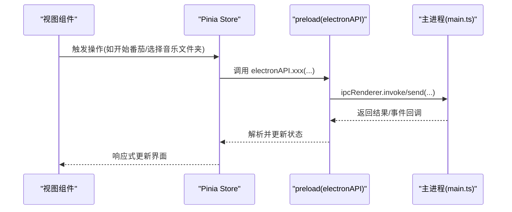
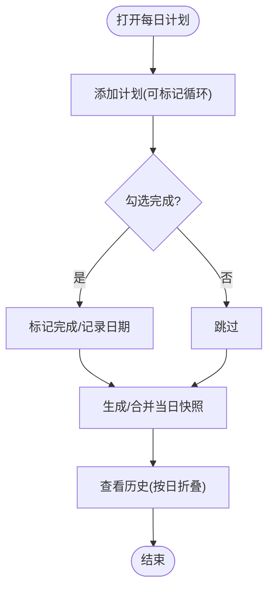
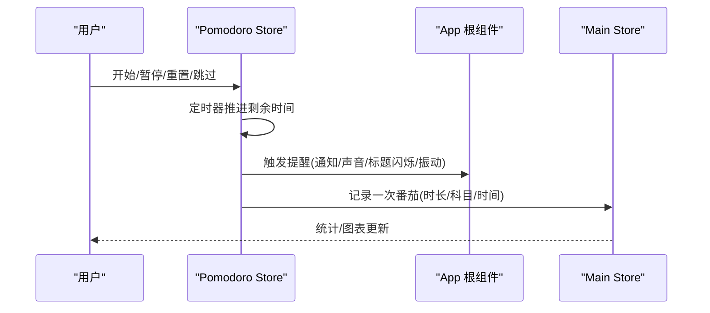
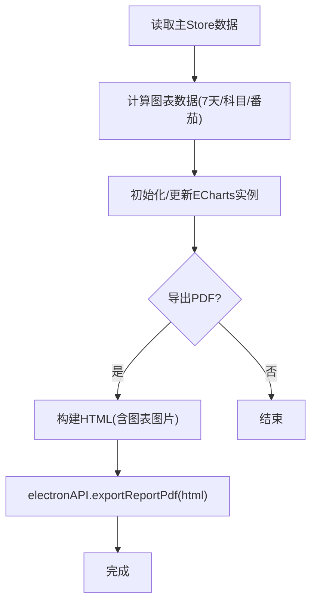
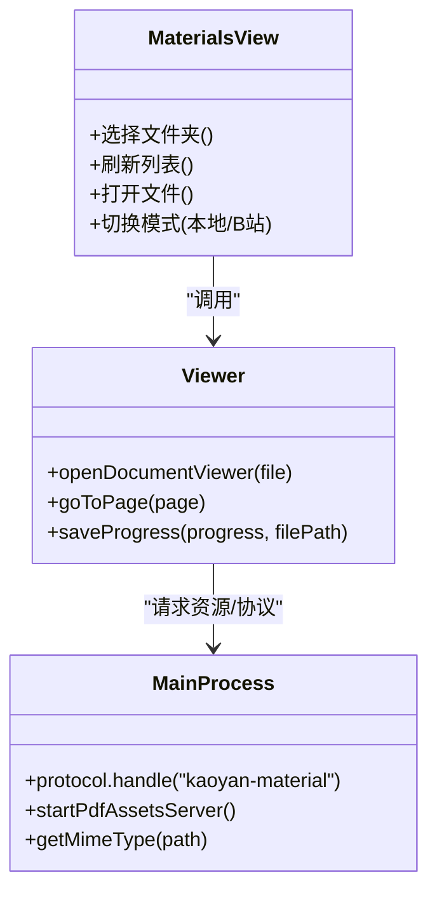
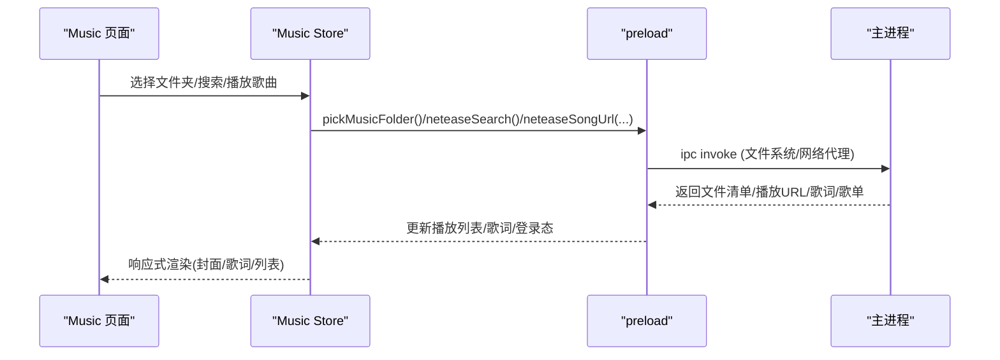
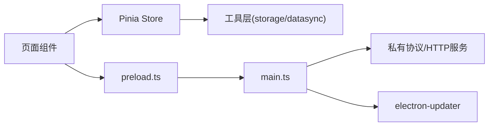

# 核心功能模块

<cite>
**本文引用的文件**
- [README.md](file://README.md)
- [package.json](file://package.json)
- [main.ts](file://src/main/main.ts)
- [preload.ts](file://src/preload/preload.ts)
- [App.vue](file://src/renderer/src/App.vue)
- [pomodoro.ts](file://src/renderer/src/stores/pomodoro.ts)
- [music.ts](file://src/renderer/src/stores/music.ts)
- [index.ts（主状态）](file://src/renderer/src/stores/index.ts)
- [storage.ts](file://src/renderer/src/utils/storage.ts)
- [datasync.ts](file://src/renderer/src/utils/datasync.ts)
- [Pomodoro.vue](file://src/renderer/src/views/Pomodoro.vue)
- [Music.vue](file://src/renderer/src/views/Music.vue)
- [DailyPlan.vue](file://src/renderer/src/views/DailyPlan.vue)
- [Statistics.vue](file://src/renderer/src/views/Statistics.vue)
- [Materials.vue](file://src/renderer/src/views/Materials.vue)
</cite>

## 目录
1. [简介](#简介)
2. [项目结构](#项目结构)
3. [核心组件](#核心组件)
4. [架构总览](#架构总览)
5. [详细组件分析](#详细组件分析)
6. [依赖关系分析](#依赖关系分析)
7. [性能考量](#性能考量)
8. [故障排查指南](#故障排查指南)
9. [结论](#结论)
10. [附录：使用示例与配置项](#附录使用示例与配置项)

## 简介
本章节面向不同层次用户，系统性介绍考研助手的核心功能模块：学习计划管理、番茄钟计时器、数据统计分析、学习资料管理与音乐播放。文档从实现原理、数据流、协作关系、扩展点与自定义化角度展开，并提供各功能的使用示例与配置选项说明，帮助快速上手与二次开发。

## 项目结构
应用采用 Electron + Vue 3 + TypeScript 的桌面端架构：
- 主进程负责窗口管理、IPC 通信、本地协议与资源服务、自动更新等系统级能力
- 渲染进程以 Vue 3 + Pinia 组织页面与全局状态，通过 preload 暴露安全 API
- 数据持久化以 IndexedDB 为主，localStorage 作为实时缓存；支持可选的数据目录快照备份
- 内置 PDF/Office/图片统一文档预览、视频播放、网易云音乐深度集成、B 站学习视频集成

图表来源
- [App.vue:1-234](file://src/renderer/src/App.vue#L1-L234)
- [preload.ts:1-98](file://src/preload/preload.ts#L1-L98)
- [main.ts:1-800](file://src/main/main.ts#L1-L800)

章节来源
- [README.md:111-130](file://README.md#L111-L130)
- [package.json:1-95](file://package.json#L1-L95)

## 核心组件
- 学习计划管理：每日计划、循环任务、历史快照、进度统计
- 番茄钟计时器：专注/短休息/长休息三档模式，通知/声音/标题闪烁/振动，跨页保持计时
- 数据统计分析：近7天时长趋势、科目占比、番茄柱状图、学习日历、PDF 报告导出
- 学习资料管理：本地资料树、PDF/Office/图片统一预览、视频播放（倍速/增益/连播/列表）、阅读进度记忆
- 音乐播放：本地文件夹扫描、在线搜索与播放、登录/歌单/云盘/排行榜/评论、歌词滚动

章节来源
- [pomodoro.ts:1-347](file://src/renderer/src/stores/pomodoro.ts#L1-L347)
- [music.ts:1-800](file://src/renderer/src/stores/music.ts#L1-L800)
- [index.ts:219-699](file://src/renderer/src/stores/index.ts#L219-L699)
- [Storage.ts:1-443](file://src/renderer/src/utils/storage.ts#L1-L443)
- [datasync.ts:1-108](file://src/renderer/src/utils/datasync.ts#L1-L108)

## 架构总览
渲染进程通过 Pinia 维护全局状态，页面组件调用 store 方法驱动业务逻辑；需要系统能力时通过 preload 暴露的 electronAPI 调用主进程 IPC。主进程提供：
- 私有协议：kaoyan-music://、kaoyan-material://、kaoyan-data://、kaoyan-assets://
- 回环 HTTP 服务：为 pdf.js 提供 cmaps/standard_fonts 稳定 fetch 通道
- 自动更新、托盘、窗口控制、天气代理、网易云/B站代理等

图表来源
- [preload.ts:1-98](file://src/preload/preload.ts#L1-L98)
- [main.ts:1-800](file://src/main/main.ts#L1-L800)
- [pomodoro.ts:1-347](file://src/renderer/src/stores/pomodoro.ts#L1-L347)
- [music.ts:1-800](file://src/renderer/src/stores/music.ts#L1-L800)

## 详细组件分析

### 学习计划管理
- 数据结构：计划项包含标题、科目、完成状态、创建/完成时间、是否循环及已完成日期列表；每日快照记录当天全部计划的实际完成情况
- 核心流程：添加计划→勾选完成→生成快照→历史记录展示；支持批量完成/清除已完成
- 数据持久化：store 监听变化自动写入 storage；启动时回填缺失快照，防止异常退出丢失历史

图表来源
- [DailyPlan.vue:1-615](file://src/renderer/src/views/DailyPlan.vue#L1-L615)
- [index.ts:219-699](file://src/renderer/src/stores/index.ts#L219-L699)

章节来源
- [DailyPlan.vue:1-615](file://src/renderer/src/views/DailyPlan.vue#L1-L615)
- [index.ts:219-699](file://src/renderer/src/stores/index.ts#L219-L699)

### 番茄钟计时器
- 模式与时长：专注/短休息/长休息，时长来自设置；每完成 N 个番茄自动进入长休息
- 提醒机制：完成时弹出遮罩提示、桌面通知、声音（工作/休息不同旋律）、标题闪烁、最后5秒滴答+振动
- 跨页计时：计时状态提升为全局 store，切换页面不中断；小浮窗在非番茄页显示
- 数据联动：完成工作模式后记录到主 store，参与学习时长与科目统计

图表来源
- [pomodoro.ts:1-347](file://src/renderer/src/stores/pomodoro.ts#L1-L347)
- [App.vue:1-234](file://src/renderer/src/App.vue#L1-L234)
- [index.ts:219-699](file://src/renderer/src/stores/index.ts#L219-L699)

章节来源
- [pomodoro.ts:1-347](file://src/renderer/src/stores/pomodoro.ts#L1-L347)
- [Pomodoro.vue:1-536](file://src/renderer/src/views/Pomodoro.vue#L1-L536)
- [App.vue:1-234](file://src/renderer/src/App.vue#L1-L234)

### 数据统计分析
- 指标：总学习时长、总番茄数、背诵卡片数、近7天时长趋势、科目占比、每日番茄数、科目时长、学习日历
- 可视化：ECharts 按需引入，主题随深浅切换；图表实例复用避免内存泄漏
- 报告导出：将图表转为 PNG，拼装 HTML 并通过主进程导出 PDF

图表来源
- [Statistics.vue:1-713](file://src/renderer/src/views/Statistics.vue#L1-L713)
- [preload.ts:1-98](file://src/preload/preload.ts#L1-L98)

章节来源
- [Statistics.vue:1-713](file://src/renderer/src/views/Statistics.vue#L1-L713)

### 学习资料管理
- 本地资料：选择文件夹→递归扫描→树形展示→过滤类型→点击预览
- 文档预览：PDF/Office/图片统一走 open-file-viewer 插件体系；PDF 使用 pdfjs-dist legacy 构建，CMap/标准字体由主进程回环 HTTP 或备用协议提供
- 视频播放：原生 video 控件，支持倍速、音量增益、快退快进、自动连播、当前文件夹播放列表、播放进度记忆
- 进度记忆：基于文件路径保存页码与滚动百分比，切换/离开恢复

图表来源
- [Materials.vue:1-800](file://src/renderer/src/views/Materials.vue#L1-L800)
- [main.ts:1-800](file://src/main/main.ts#L1-L800)

章节来源
- [Materials.vue:1-800](file://src/renderer/src/views/Materials.vue#L1-L800)
- [main.ts:1-800](file://src/main/main.ts#L1-L800)

### 音乐播放
- 本地播放：选择文件夹→仅扫描文件名清单→通过 kaoyan-music:// 协议流式读取，避免大文件夹占内存
- 在线播放：网易云搜索、登录（扫码/手机号/Cookie）、歌单同步、云盘、排行榜、热门评论、喜欢收藏
- 播放控制：播放/暂停/上一首/下一首/随机/音量/进度条/歌词滚动；在线 URL 过期自动刷新重试
- 数据流：store 维护播放列表、当前索引、歌词、搜索结果、登录态等；通过 electronAPI 调用主进程代理接口

图表来源
- [music.ts:1-800](file://src/renderer/src/stores/music.ts#L1-L800)
- [preload.ts:1-98](file://src/preload/preload.ts#L1-L98)
- [main.ts:1-800](file://src/main/main.ts#L1-L800)

章节来源
- [Music.vue:1-800](file://src/renderer/src/views/Music.vue#L1-L800)
- [music.ts:1-800](file://src/renderer/src/stores/music.ts#L1-L800)

## 依赖关系分析
- 渲染进程内部：页面 → Pinia Store → 工具层(storage/datasync)
- 跨进程：页面/Store → preload(electronAPI) → 主进程(main.ts)
- 外部依赖：Electron、Element Plus、ECharts、pdfjs-dist、@open-file-viewer/core、dayjs、pinia、vue-router

图表来源
- [App.vue:1-234](file://src/renderer/src/App.vue#L1-L234)
- [preload.ts:1-98](file://src/preload/preload.ts#L1-L98)
- [main.ts:1-800](file://src/main/main.ts#L1-L800)

章节来源
- [package.json:1-95](file://package.json#L1-L95)

## 性能考量
- 长列表分批渲染：音乐播放队列与云盘列表采用“加载更多”分页，减少 DOM 压力
- 音频/视频流式读取：主进程通过 Range 请求与 ReadableStream 流式返回，避免一次性加载大文件
- 图表实例复用：ECharts 使用 setOption 更新而非重新 init，降低内存占用
- PDF 文本层降级：getTextContent 失败不影响已渲染 canvas，避免黑屏
- 主题与背景：玻璃拟态样式配合 GPU 加速过渡，减少重绘

[本节为通用指导，无需特定文件引用]

## 故障排查指南
- 番茄钟无声音/通知：检查设置中是否启用声音与通知；确认浏览器/系统通知权限
- 音乐无法播放：在线歌曲 URL 过期会自动刷新；若仍失败，检查网络与登录状态；本地文件需通过选择文件夹导入
- PDF 中文乱码/黑屏：确保主进程回环 HTTP 服务可用；如不可用则回退至 kaoyan-assets:// 协议；检查 CMap/标准字体资源是否复制成功
- 学习计划历史缺失：应用关闭前会固化快照；异常退出时会在启动时回填最近7天缺失快照
- 数据目录同步：自动同步已关闭，可在设置中手动立即同步；确认数据目录路径有效

章节来源
- [pomodoro.ts:1-347](file://src/renderer/src/stores/pomodoro.ts#L1-L347)
- [music.ts:1-800](file://src/renderer/src/stores/music.ts#L1-L800)
- [Materials.vue:1-800](file://src/renderer/src/views/Materials.vue#L1-L800)
- [index.ts:219-699](file://src/renderer/src/stores/index.ts#L219-L699)
- [datasync.ts:1-108](file://src/renderer/src/utils/datasync.ts#L1-L108)

## 结论
考研助手围绕“离线优先、隐私可控、一站式备考”的目标，将学习计划、番茄钟、数据统计、资料管理与音乐播放有机整合。通过 Pinia 统一管理状态、preload 安全桥接、主进程协议与服务保障本地资源访问，形成高内聚、低耦合的模块化架构。各功能既可独立使用，也可协同工作，满足从入门到进阶的多层次需求。

[本节为总结性内容，无需特定文件引用]

## 附录：使用示例与配置项

### 学习计划管理
- 使用示例
  - 添加计划：输入标题，可选择科目，勾选“每日循环”后添加
  - 完成任务：勾选计划项即标记完成；循环计划会记录当天完成日期
  - 查看历史：展开“历史记录”，按日查看完成情况
- 配置项
  - 计划快照保留最近60天；循环计划按日期去重记录

章节来源
- [DailyPlan.vue:1-615](file://src/renderer/src/views/DailyPlan.vue#L1-L615)
- [index.ts:219-699](file://src/renderer/src/stores/index.ts#L219-L699)

### 番茄钟计时器
- 使用示例
  - 选择模式：专注/短休息/长休息
  - 开始计时：点击开始，最后5秒有视觉闪烁与滴答声
  - 完成提醒：弹出遮罩提示，支持桌面通知与声音
- 配置项
  - 专注时长、短休息时长、长休息时长、长休息间隔
  - 通知开关、声音开关、标题闪烁、强制全屏、音量大小

章节来源
- [pomodoro.ts:1-347](file://src/renderer/src/stores/pomodoro.ts#L1-L347)
- [Pomodoro.vue:1-536](file://src/renderer/src/views/Pomodoro.vue#L1-L536)
- [index.ts:219-699](file://src/renderer/src/stores/index.ts#L219-L699)

### 数据统计分析
- 使用示例
  - 查看近7天学习时长趋势、科目占比、每日番茄数、科目时长
  - 浏览学习日历，了解打卡强度
  - 一键导出 PDF 学习报告
- 配置项
  - 图表主题随深浅主题自动切换；导出 PDF 需在桌面环境

章节来源
- [Statistics.vue:1-713](file://src/renderer/src/views/Statistics.vue#L1-L713)

### 学习资料管理
- 使用示例
  - 选择资料文件夹，刷新列表，筛选类型（PDF/文档/视频/其他）
  - 点击文件进行预览：PDF/Office/图片统一预览；视频支持倍速、增益、连播、列表
  - 阅读进度自动记忆，下次打开恢复
- 配置项
  - 文档预览插件按需加载；PDF 资源优先走回环 HTTP，不可用时回退协议

章节来源
- [Materials.vue:1-800](file://src/renderer/src/views/Materials.vue#L1-L800)
- [main.ts:1-800](file://src/main/main.ts#L1-L800)

### 音乐播放
- 使用示例
  - 本地播放：选择文件夹，自动扫描音频文件，支持播放列表管理
  - 在线播放：搜索歌曲，登录后同步歌单/云盘/排行榜，支持评论与喜欢
  - 歌词滚动：在线歌曲拉取歌词，本地歌曲同目录 .lrc 文件
- 配置项
  - 音质等级、随机播放、顶栏歌词显示、默认音量

章节来源
- [Music.vue:1-800](file://src/renderer/src/views/Music.vue#L1-L800)
- [music.ts:1-800](file://src/renderer/src/stores/music.ts#L1-L800)

### 功能扩展点与自定义化
- 新增科目/标签：在 SUBJECT_CONFIG 中扩展科目配置，影响计划与统计展示
- 自定义提醒音效：在 pomodoro store 中替换音频合成逻辑或接入外部音效
- 扩展资料格式：在主进程 MIME 映射与白名单中添加新扩展名，并在 Materials 中识别
- 扩展音乐源：在 preload 与 main 中增加新的代理接口，并在 music store 中封装调用
- 数据目录迁移：通过 datasync 提供的接口手动同步数据到指定目录

章节来源
- [index.ts:219-699](file://src/renderer/src/stores/index.ts#L219-L699)
- [pomodoro.ts:1-347](file://src/renderer/src/stores/pomodoro.ts#L1-L347)
- [main.ts:1-800](file://src/main/main.ts#L1-L800)
- [Materials.vue:1-800](file://src/renderer/src/views/Materials.vue#L1-L800)
- [music.ts:1-800](file://src/renderer/src/stores/music.ts#L1-L800)
- [datasync.ts:1-108](file://src/renderer/src/utils/datasync.ts#L1-L108)