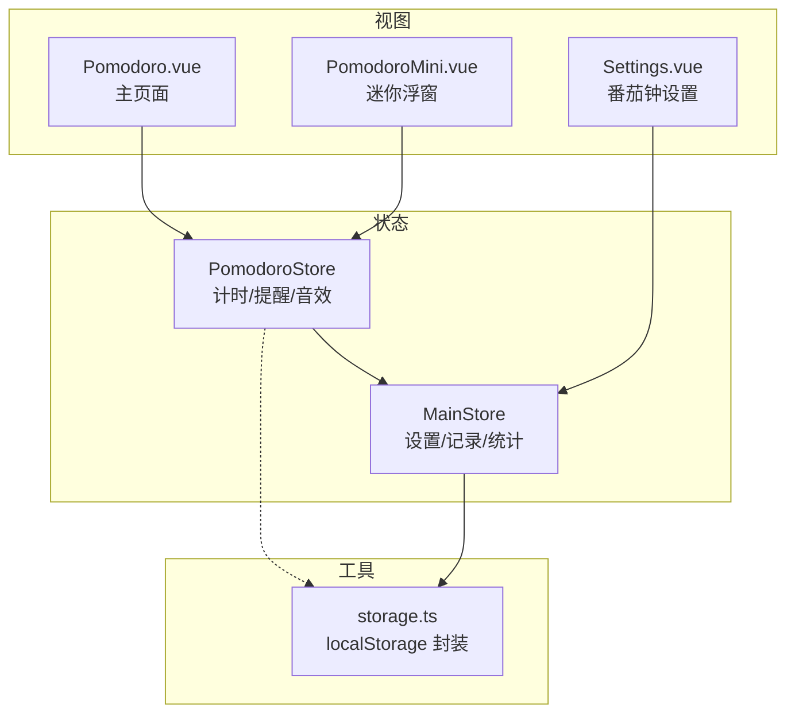
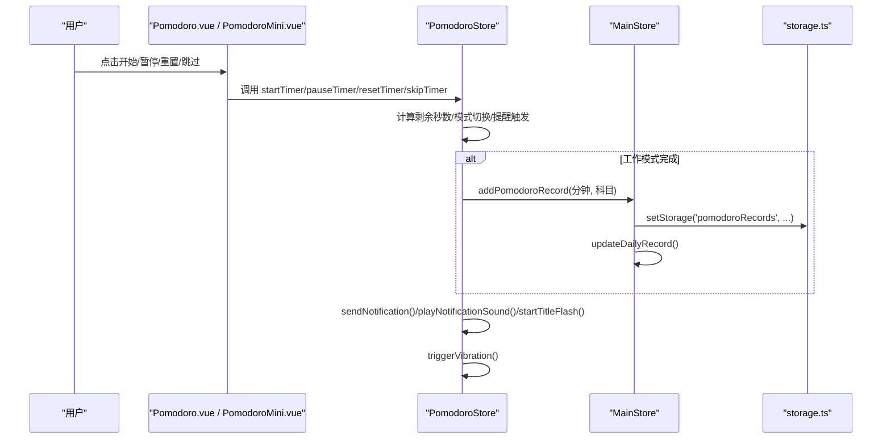
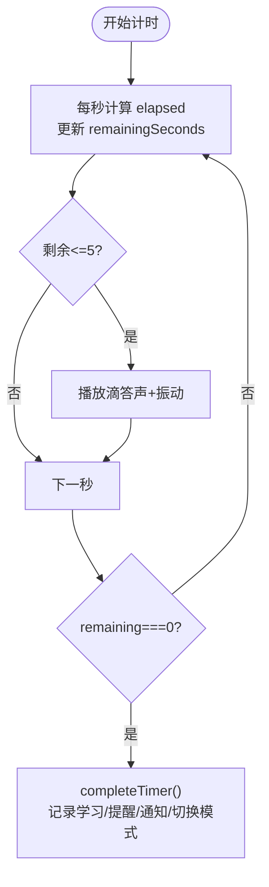
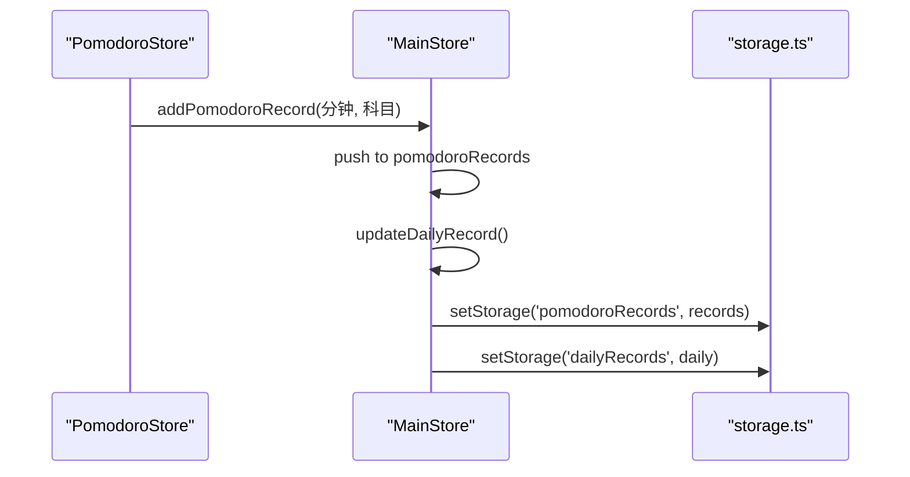
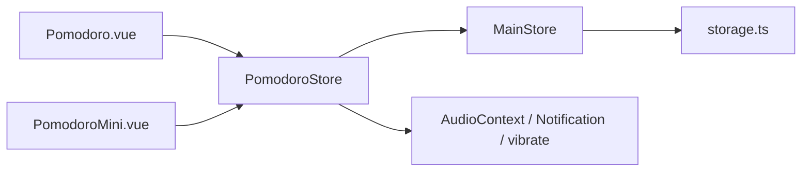

# 番茄钟计时器

<cite>
**本文引用的文件**
- [pomodoro.ts](file://src/renderer/src/stores/pomodoro.ts)
- [PomodoroMini.vue](file://src/renderer/src/components/PomodoroMini.vue)
- [Pomodoro.vue](file://src/renderer/src/views/Pomodoro.vue)
- [index.ts（MainStore）](file://src/renderer/src/stores/index.ts)
- [storage.ts](file://src/renderer/src/utils/storage.ts)
- [Settings.vue](file://src/renderer/src/views/Settings.vue)
</cite>

## 目录
1. [简介](#简介)
2. [项目结构](#项目结构)
3. [核心组件与职责](#核心组件与职责)
4. [架构总览](#架构总览)
5. [详细组件分析](#详细组件分析)
6. [依赖关系分析](#依赖关系分析)
7. [性能与可靠性](#性能与可靠性)
8. [使用指南](#使用指南)
9. [故障排查](#故障排查)
10. [结论](#结论)

## 简介
本文件面向“番茄钟计时器”功能，系统性说明倒计时算法、全屏专注模式、提醒通知系统、PomodoroStore 状态管理、迷你组件集成、配置项与持久化存储、以及学习统计关联机制。文档同时提供用户操作指南与开发者扩展参考。

## 项目结构
- 状态层：Pinia Store 负责全局计时状态与设置
  - PomodoroStore：计时控制、模式切换、提醒与音效
  - MainStore：番茄记录、每日统计、番茄钟设置持久化
- 视图层：页面与浮窗
  - Pomodoro.vue：主页面环形进度与控制
  - PomodoroMini.vue：可拖拽的迷你浮窗，支持紧凑/展开模式
- 工具层：本地存储封装 storage.ts，提供实时持久化、版本迁移、容量清理等能力
- 设置页：Settings.vue 暴露番茄钟各项配置开关与数值



图表来源
- [pomodoro.ts:12-346](file://src/renderer/src/stores/pomodoro.ts#L12-L346)
- [index.ts:219-699](file://src/renderer/src/stores/index.ts#L219-L699)
- [Pomodoro.vue:169-256](file://src/renderer/src/views/Pomodoro.vue#L169-L256)
- [PomodoroMini.vue:132-360](file://src/renderer/src/components/PomodoroMini.vue#L132-L360)
- [storage.ts:1-443](file://src/renderer/src/utils/storage.ts#L1-L443)
- [Settings.vue:31-86](file://src/renderer/src/views/Settings.vue#L31-L86)

章节来源
- [pomodoro.ts:12-346](file://src/renderer/src/stores/pomodoro.ts#L12-L346)
- [index.ts:219-699](file://src/renderer/src/stores/index.ts#L219-L699)
- [Pomodoro.vue:169-256](file://src/renderer/src/views/Pomodoro.vue#L169-L256)
- [PomodoroMini.vue:132-360](file://src/renderer/src/components/PomodoroMini.vue#L132-L360)
- [storage.ts:1-443](file://src/renderer/src/utils/storage.ts#L1-L443)
- [Settings.vue:31-86](file://src/renderer/src/views/Settings.vue#L31-L86)

## 核心组件与职责
- PomodoroStore
  - 维护当前模式（专注/短休/长休）、运行状态、剩余秒数、累计完成数
  - 实现倒计时逻辑、模式自动流转、提醒弹窗、桌面通知、标题闪烁、音效与振动
  - 通过 MainStore 写入番茄记录并更新每日统计
- MainStore
  - 保存番茄钟设置（时长、间隔、通知/声音/标题闪烁/强制全屏/音量）
  - 维护番茄记录、每日学习记录、科目进度、应用使用时长等
  - 监听数据变化自动持久化到 localStorage
- Pomodoro.vue
  - 渲染大尺寸环形进度、模式切换、控制按钮、今日统计与记录列表
  - 调用 PomodoroStore 方法驱动计时
- PomodoroMini.vue
  - 可拖拽浮窗，紧凑/展开两种形态，复用同一 Store 状态
  - 显示环形进度、时间、模式标签、控制按钮、科目选择、今日统计
  - 位置与紧凑态持久化到 localStorage
- Settings.vue
  - 提供番茄钟时长、间隔、通知、声音、标题闪烁、强制全屏、音量等配置入口
  - 保存设置到 MainStore 并持久化

章节来源
- [pomodoro.ts:12-346](file://src/renderer/src/stores/pomodoro.ts#L12-L346)
- [index.ts:219-699](file://src/renderer/src/stores/index.ts#L219-L699)
- [Pomodoro.vue:169-256](file://src/renderer/src/views/Pomodoro.vue#L169-L256)
- [PomodoroMini.vue:132-360](file://src/renderer/src/components/PomodoroMini.vue#L132-L360)
- [Settings.vue:31-86](file://src/renderer/src/views/Settings.vue#L31-L86)

## 架构总览
计时器采用“状态提升 + 多视图共享”的架构：所有计时状态集中在 PomodoroStore，页面与迷你浮窗仅作为展示与交互入口；数据持久化由 MainStore 统一处理，并通过 storage.ts 保证实时落盘与容错。



图表来源
- [pomodoro.ts:68-162](file://src/renderer/src/stores/pomodoro.ts#L68-L162)
- [index.ts:526-590](file://src/renderer/src/stores/index.ts#L526-L590)
- [storage.ts:227-246](file://src/renderer/src/utils/storage.ts#L227-L246)

章节来源
- [pomodoro.ts:68-162](file://src/renderer/src/stores/pomodoro.ts#L68-L162)
- [index.ts:526-590](file://src/renderer/src/stores/index.ts#L526-L590)
- [storage.ts:227-246](file://src/renderer/src/utils/storage.ts#L227-L246)

## 详细组件分析

### PomodoroStore 状态管理与计时逻辑
- 状态字段
  - currentMode：work | shortBreak | longBreak
  - isRunning / hasStarted：是否运行、是否已启动过
  - selectedSubject：当前学习科目
  - completedPomodoros：本轮完成数
  - remainingSeconds / totalSeconds：剩余与总时长
  - showAlert / alertMessage / alertSubtitle / alertIcon / isPulsing：提醒遮罩与动效
- 计时算法
  - 使用 window.setInterval 每秒计算 elapsed = (Date.now() - timerStartAt) / 1000
  - 基于绝对时间差更新 remainingSeconds，避免累积误差
  - 最后 5 秒触发提示音与振动
  - 归零时进入 completeTimer：记录学习、弹出提醒、发送通知、切换休息或继续工作
- 模式流转
  - 每完成一个工作番茄，根据 longBreakInterval 决定进入长休息或短休息
  - 休息结束自动切回工作模式
- 通知与提醒
  - sendNotification 依据设置决定是否播放声音、显示桌面通知、标题闪烁
  - showDesktopNotification 请求权限并推送系统通知
  - startTitleFlash 在标题栏闪烁提示，聚焦后停止
- 音效与振动
  - playNotificationSound：工作完成上行琶音，休息结束下行琶音
  - playCountdownBeep：最后 5 秒滴答声
  - triggerVibration：移动端振动反馈
  - 音量受 pomodoroSettings.soundVolume 控制



图表来源
- [pomodoro.ts:68-162](file://src/renderer/src/stores/pomodoro.ts#L68-L162)
- [pomodoro.ts:170-323](file://src/renderer/src/stores/pomodoro.ts#L170-L323)

章节来源
- [pomodoro.ts:12-346](file://src/renderer/src/stores/pomodoro.ts#L12-L346)

### 全屏专注模式与通知系统
- 全屏专注
  - 设置项 forceFullscreen：开启后进入全屏以减少干扰（全局设置）
  - 该设置在 MainStore.pomodoroSettings 中持久化，并在需要处读取生效
- 通知系统
  - 桌面通知：showDesktopNotification 使用浏览器 Notification API，必要时请求权限
  - 标题闪烁：startTitleFlash 周期性修改 document.title，10 秒后恢复，获得焦点即停
  - 声音提醒：playNotificationSound 按类型播放不同旋律，音量受 soundVolume 影响
  - 振动反馈：triggerVibration 在支持的终端上触发振动

章节来源
- [index.ts:283-303](file://src/renderer/src/stores/index.ts#L283-L303)
- [pomodoro.ts:170-323](file://src/renderer/src/stores/pomodoro.ts#L170-L323)
- [Settings.vue:54-80](file://src/renderer/src/views/Settings.vue#L54-L80)

### 迷你组件实现原理与集成
- 复用 Store：PomodoroMini 直接订阅 PomodoroStore 的状态，确保与主页面完全同步
- 双形态
  - 紧凑模式：仅显示小球进度与时间，点击展开
  - 展开模式：完整控制与统计
- 拖拽与定位
  - 使用 Pointer Events 实现拖拽，阈值防误触
  - 位置持久化到 localStorage，窗口 resize 时校正边界
  - 默认左下角显示（v3.4.1）
- 今日统计
  - 从 MainStore.pomodoroRecords 计算今日番茄数与学习小时数
  - 显示本轮完成数

```mermaid
classDiagram
class PomodoroMini {
+visible : boolean
+isCompact : boolean
+pos : {x,y}
+switchMode()
+startTimer()
+pauseTimer()
+resetTimer()
+skipTimer()
}
class PomodoroStore {
+currentMode
+isRunning
+remainingSeconds
+totalSeconds
+completedPomodoros
+modeLabel
+selectedSubject
+switchMode()
+startTimer()
+pauseTimer()
+resetTimer()
+skipTimer()
}
class MainStore {
+pomodoroRecords
+pomodoroSettings
+addPomodoroRecord()
+updatePomodoroSettings()
}
PomodoroMini --> PomodoroStore : "订阅/调用"
PomodoroStore --> MainStore : "记录/设置"
```

图表来源
- [PomodoroMini.vue:132-360](file://src/renderer/src/components/PomodoroMini.vue#L132-L360)
- [pomodoro.ts:12-346](file://src/renderer/src/stores/pomodoro.ts#L12-L346)
- [index.ts:219-699](file://src/renderer/src/stores/index.ts#L219-L699)

章节来源
- [PomodoroMini.vue:132-360](file://src/renderer/src/components/PomodoroMini.vue#L132-L360)
- [pomodoro.ts:12-346](file://src/renderer/src/stores/pomodoro.ts#L12-L346)
- [index.ts:219-699](file://src/renderer/src/stores/index.ts#L219-L699)

### 计时器配置选项与自定义设置
- 时长与间隔
  - workDuration：专注时长（分钟）
  - breakDuration：短休息时长（分钟）
  - longBreakDuration：长休息时长（分钟）
  - longBreakInterval：每 N 个番茄后进入长休息
- 提醒与交互
  - enableNotification：桌面通知开关
  - enableSound：提示音开关
  - soundVolume：提示音音量（0-100）
  - enableTitleFlash：标题闪烁开关
  - forceFullscreen：强制全屏开关
- 设置持久化
  - 通过 MainStore.updatePomodoroSettings 更新，watch 自动保存到 localStorage
  - 应用启动时从 storage 加载最新设置

章节来源
- [index.ts:283-303](file://src/renderer/src/stores/index.ts#L283-L303)
- [index.ts:600-624](file://src/renderer/src/stores/index.ts#L600-L624)
- [Settings.vue:31-86](file://src/renderer/src/views/Settings.vue#L31-L86)

### 计时数据的持久化与学习统计关联
- 记录写入
  - 工作模式完成时，PomodoroStore 调用 MainStore.addPomodoroRecord(durationMinutes, subject)
  - MainStore 生成记录对象（id、date、duration、subject、completedAt），推入数组并触发 watch 持久化
- 每日统计
  - updateDailyRecord 汇总当日学习分钟数与番茄数量，写入 dailyRecords
  - 页面与迷你组件通过 computed 过滤 todayLocal() 的记录进行展示
- 存储机制
  - storage.ts 提供 get/set/remove 接口，写入时同步更新内存缓存与 localStorage
  - 启动时 initStorage 载入缓存并执行数据迁移，beforeunload/pagehide 双保险 flushAll



图表来源
- [pomodoro.ts:112-162](file://src/renderer/src/stores/pomodoro.ts#L112-L162)
- [index.ts:526-590](file://src/renderer/src/stores/index.ts#L526-L590)
- [storage.ts:227-246](file://src/renderer/src/utils/storage.ts#L227-L246)

章节来源
- [pomodoro.ts:112-162](file://src/renderer/src/stores/pomodoro.ts#L112-L162)
- [index.ts:526-590](file://src/renderer/src/stores/index.ts#L526-L590)
- [storage.ts:227-246](file://src/renderer/src/utils/storage.ts#L227-L246)

## 依赖关系分析
- 组件依赖
  - Pomodoro.vue 与 PomodoroMini.vue 均依赖 PomodoroStore 提供状态与方法
  - 两者都依赖 MainStore 提供的 SUBJECT_CONFIG、pomodoroRecords、pomodoroSettings
- 存储依赖
  - MainStore 通过 storage.ts 读写 localStorage，保障数据不丢失
  - storage.ts 内部维护内存缓存 Map，并提供版本迁移与容量清理策略
- 外部 API
  - AudioContext 用于播放提示音
  - Notification API 用于桌面通知
  - navigator.vibrate 用于振动反馈
  - window.setInterval 用于计时



图表来源
- [Pomodoro.vue:169-256](file://src/renderer/src/views/Pomodoro.vue#L169-L256)
- [PomodoroMini.vue:132-360](file://src/renderer/src/components/PomodoroMini.vue#L132-L360)
- [pomodoro.ts:12-346](file://src/renderer/src/stores/pomodoro.ts#L12-L346)
- [index.ts:219-699](file://src/renderer/src/stores/index.ts#L219-L699)
- [storage.ts:1-443](file://src/renderer/src/utils/storage.ts#L1-L443)

章节来源
- [Pomodoro.vue:169-256](file://src/renderer/src/views/Pomodoro.vue#L169-L256)
- [PomodoroMini.vue:132-360](file://src/renderer/src/components/PomodoroMini.vue#L132-L360)
- [pomodoro.ts:12-346](file://src/renderer/src/stores/pomodoro.ts#L12-L346)
- [index.ts:219-699](file://src/renderer/src/stores/index.ts#L219-L699)
- [storage.ts:1-443](file://src/renderer/src/utils/storage.ts#L1-L443)

## 性能与可靠性
- 计时精度与性能
  - 使用绝对时间差计算 elapsed，避免 setInterval 漂移导致的累积误差
  - 1 秒间隔足够精确且节省 CPU
- 音频资源
  - 复用单一 AudioContext 实例，减少开销
  - 指数衰减包络与泛音叠加，音色柔和，避免刺耳
- 存储可靠性
  - storage.ts 提供 beforeunload/pagehide 双保险 flushAll
  - 容量不足时自动清理旧数据（计划快照、历史番茄记录片段）
  - 数据版本化迁移，升级数据结构不影响历史数据
- 前端体验
  - 迷你浮窗拖拽带阈值防误触，resize 自动校正位置
  - 最后 5 秒视觉闪烁与听觉提示，增强注意力

章节来源
- [pomodoro.ts:68-91](file://src/renderer/src/stores/pomodoro.ts#L68-L91)
- [pomodoro.ts:183-251](file://src/renderer/src/stores/pomodoro.ts#L183-L251)
- [storage.ts:93-109](file://src/renderer/src/utils/storage.ts#L93-L109)
- [storage.ts:144-188](file://src/renderer/src/utils/storage.ts#L144-L188)
- [PomodoroMini.vue:251-339](file://src/renderer/src/components/PomodoroMini.vue#L251-L339)

## 使用指南
- 基本操作
  - 打开“番茄钟”页面或启用迷你浮窗
  - 选择模式：专注/短休息/长休息
  - 点击“开始”进入倒计时，支持“暂停/重置/跳过”
  - 工作模式完成后自动进入休息，按设置进入短休或长休
- 科目选择
  - 在工作模式下可选择当前学习科目，便于后续统计区分
- 提醒与通知
  - 可在设置中开启桌面通知、提示音、标题闪烁
  - 建议首次使用时点击“测试通知权限”以授权系统通知
- 全屏专注
  - 开启“强制全屏”可减少干扰，适合深度专注场景
- 迷你浮窗
  - 拖动头部移动浮窗，支持紧凑与展开模式
  - 位置与紧凑态会记住，下次打开保持一致
- 查看统计
  - 页面底部显示今日番茄数、学习时长、本轮完成数
  - 记录列表展示每次完成的日期时间与科目标签

章节来源
- [Pomodoro.vue:169-256](file://src/renderer/src/views/Pomodoro.vue#L169-L256)
- [PomodoroMini.vue:132-360](file://src/renderer/src/components/PomodoroMini.vue#L132-L360)
- [Settings.vue:31-86](file://src/renderer/src/views/Settings.vue#L31-L86)

## 故障排查
- 通知未出现
  - 检查是否已授予通知权限；在设置页点击“测试通知权限”
  - 确认 enableNotification 已开启
- 无提示音
  - 检查 enableSound 是否开启，soundVolume 是否过低
  - 某些浏览器需先有用户交互才能播放音频
- 标题不闪烁
  - 确认 enableTitleFlash 已开启；若页面获得焦点会停止闪烁
- 数据丢失
  - 检查 storage.ts 的 beforeunload/pagehide 事件是否被拦截
  - 查看 localStorage 是否被第三方插件或隐私模式限制
- 迷你浮窗位置异常
  - 窗口尺寸变化会自动校正；如仍越界，重新拖拽至可视区域

章节来源
- [pomodoro.ts:170-323](file://src/renderer/src/stores/pomodoro.ts#L170-L323)
- [storage.ts:144-188](file://src/renderer/src/utils/storage.ts#L144-L188)
- [PomodoroMini.vue:304-339](file://src/renderer/src/components/PomodoroMini.vue#L304-L339)
- [Settings.vue:54-86](file://src/renderer/src/views/Settings.vue#L54-L86)

## 结论
本番茄钟计时器通过集中式状态管理、可靠的本地持久化与丰富的提醒机制，提供了稳定、易用且可扩展的学习专注体验。PomodoroStore 负责计时与提醒，MainStore 负责数据与设置，视图层灵活呈现；mini 浮窗进一步提升了跨页面的可用性。对于开发者，可通过调整设置项、扩展通知与音效、或接入新的统计维度来定制功能。