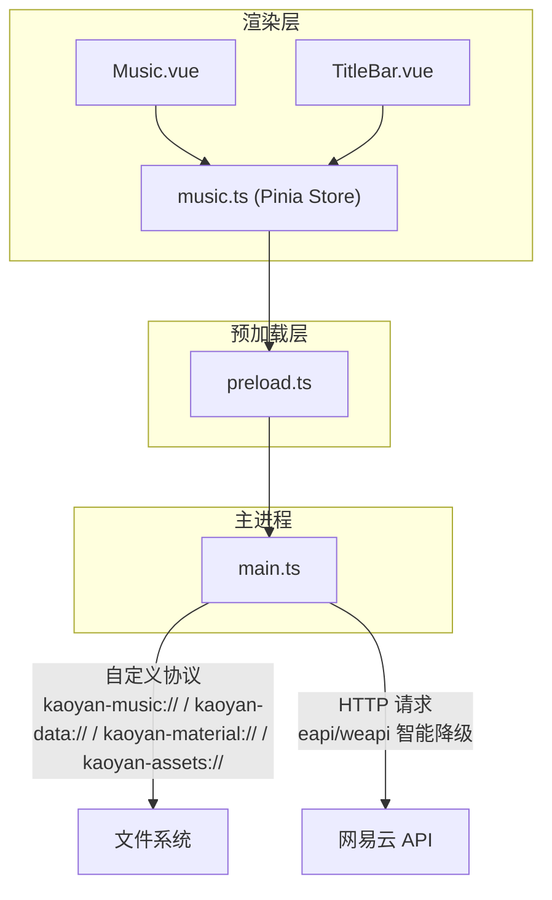
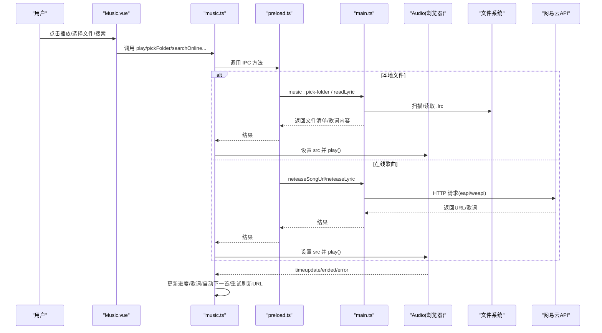
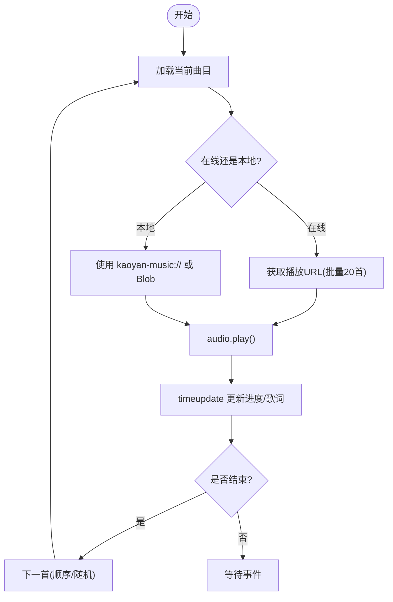
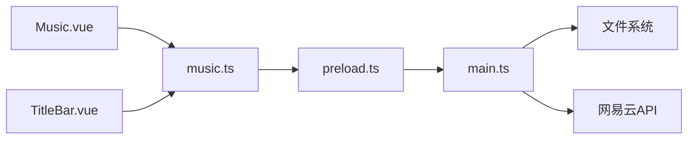

# 音乐播放功能

<cite>
**本文引用的文件**
- [src/renderer/src/stores/music.ts](file://src/renderer/src/stores/music.ts)
- [src/renderer/src/views/Music.vue](file://src/renderer/src/views/Music.vue)
- [src/main/main.ts](file://src/main/main.ts)
- [src/preload/preload.ts](file://src/preload/preload.ts)
- [src/renderer/src/components/TitleBar.vue](file://src/renderer/src/components/TitleBar.vue)
- [package.json](file://package.json)
</cite>

## 目录
1. [简介](#简介)
2. [项目结构](#项目结构)
3. [核心组件](#核心组件)
4. [架构总览](#架构总览)
5. [详细组件分析](#详细组件分析)
6. [依赖关系分析](#依赖关系分析)
7. [性能考量](#性能考量)
8. [故障排查指南](#故障排查指南)
9. [结论](#结论)
10. [附录：API 接口说明](#附录api-接口说明)

## 简介
本模块提供完整的音乐播放能力，包括本地音乐与在线网易云音乐的统一播放体验。通过状态管理集中维护播放列表、歌词解析与同步、播放控制（播放/暂停/上一首/下一首/随机/音量/进度跳转）、以及网易云登录、搜索、歌单、排行榜、云盘、评论与收藏等扩展能力。底层通过 Electron 主进程实现安全协议流式读取本地音频，并通过 IPC 桥接调用网易云 API。

## 项目结构
- 渲染层（Vue + Pinia）
  - 状态与业务逻辑：stores/music.ts
  - 页面与交互：views/Music.vue
  - 顶栏集成：components/TitleBar.vue
- 预加载层（IPC 暴露）：preload/preload.ts
- 主进程（Electron）：main/main.ts
- 构建配置：package.json

图表来源
- [src/renderer/src/views/Music.vue:1-120](file://src/renderer/src/views/Music.vue#L1-L120)
- [src/renderer/src/stores/music.ts:32-148](file://src/renderer/src/stores/music.ts#L32-L148)
- [src/preload/preload.ts:23-69](file://src/preload/preload.ts#L23-L69)
- [src/main/main.ts:183-210](file://src/main/main.ts#L183-L210)
- [src/main/main.ts:406-477](file://src/main/main.ts#L406-L477)

章节来源
- [src/renderer/src/stores/music.ts:32-148](file://src/renderer/src/stores/music.ts#L32-L148)
- [src/preload/preload.ts:23-69](file://src/preload/preload.ts#L23-L69)
- [src/main/main.ts:183-210](file://src/main/main.ts#L183-L210)

## 核心组件
- 音乐状态管理（music.ts）
  - 播放列表、当前索引、播放状态、音量、随机模式、音质等级
  - 歌词解析与同步、进度与时长更新
  - 网易云登录、搜索、歌单、排行榜、云盘、评论、收藏、心动模式
- 音乐页面（Music.vue）
  - 播放器控件、歌词区、搜索与歌单/排行榜/云盘面板、播放列表
  - 进度条拖动、热门评论展示与点赞
- 顶栏集成（TitleBar.vue）
  - 迷你播放器、歌词显示开关、播放列表片段、用户信息面板
- 主进程（main.ts）
  - 自定义协议流式读取本地音频与资料文件
  - 网易云 API 封装（eapi/weapi 智能降级）
  - 托盘与窗口控制、自动更新

章节来源
- [src/renderer/src/stores/music.ts:32-148](file://src/renderer/src/stores/music.ts#L32-L148)
- [src/renderer/src/views/Music.vue:1-120](file://src/renderer/src/views/Music.vue#L1-L120)
- [src/renderer/src/components/TitleBar.vue:100-140](file://src/renderer/src/components/TitleBar.vue#L100-L140)
- [src/main/main.ts:406-477](file://src/main/main.ts#L406-L477)

## 架构总览
整体采用“渲染层状态管理 + 预加载 IPC 桥 + 主进程系统能力”的分层架构：
- 渲染层负责 UI 与业务编排，使用 Pinia 集中管理音乐状态
- 预加载层仅暴露必要 API，避免直接 Node 权限泄露
- 主进程负责：
  - 安全地流式读取本地音频（支持 Range 分片），避免大文件内存占用
  - 代理网易云 API，并实现 eapi/weapi 智能降级与 Cookie 持久化
  - 托盘、窗口控制、自动更新等系统级能力

图表来源
- [src/renderer/src/stores/music.ts:94-148](file://src/renderer/src/stores/music.ts#L94-L148)
- [src/renderer/src/stores/music.ts:191-252](file://src/renderer/src/stores/music.ts#L191-L252)
- [src/preload/preload.ts:23-69](file://src/preload/preload.ts#L23-L69)
- [src/main/main.ts:406-477](file://src/main/main.ts#L406-L477)
- [src/main/main.ts:1334-1354](file://src/main/main.ts#L1334-L1354)

## 详细组件分析

### 音乐状态管理（music.ts）
- 播放控制
  - 播放/暂停/切换：基于原生 Audio，监听 ended 自动下一首或停止
  - 上一首/下一首：支持顺序与随机模式，随机使用 Fisher-Yates 思想打乱
  - 进度跳转：seek(time)，timeupdate 驱动 UI 与歌词高亮
  - 音量控制：setVolume(v) 限制在 0~1，应用至 audio.volume
  - 错误处理：在线 URL 过期时自动刷新并重试（最多两次）
- 播放列表
  - 本地文件：通过 pickFiles/pickFolder 获取，Blob URL 或 kaoyan-music:// 协议
  - 在线歌曲：playOnlineSong/addOnlineSong 批量获取播放地址后加入队列
  - 歌单/排行榜/云盘：批量获取 URL 并替换或追加到队列
- 歌词
  - 本地：同目录 .lrc 文件读取并解析为时间戳数组
  - 在线：通过网易云歌词接口获取 lrc/tlyric
  - 同步：timeupdate 计算当前行并滚动到可视区域
- 网易云集成
  - 登录：扫码/手机号/Cookie 三种方式；登录后拉取歌单与喜欢列表
  - 搜索：关键词搜索歌曲，支持热搜榜
  - 歌单：列表与详情，支持播放全部/添加到队列
  - 排行榜：列表与详情
  - 云盘：分页加载，支持播放全部/添加到队列
  - 评论：热门评论与分页评论，支持点赞
  - 收藏：当前歌曲喜欢状态与批量检查，乐观更新+失败回滚
  - 心动模式：优先 intelligence list，否则随机打乱歌单前若干首
- 持久化
  - 随机模式、音质等级、顶栏歌词显示开关通过存储持久化

图表来源
- [src/renderer/src/stores/music.ts:94-148](file://src/renderer/src/stores/music.ts#L94-L148)
- [src/renderer/src/stores/music.ts:300-392](file://src/renderer/src/stores/music.ts#L300-L392)
- [src/renderer/src/stores/music.ts:435-506](file://src/renderer/src/stores/music.ts#L435-L506)
- [src/renderer/src/stores/music.ts:707-776](file://src/renderer/src/stores/music.ts#L707-L776)

章节来源
- [src/renderer/src/stores/music.ts:32-148](file://src/renderer/src/stores/music.ts#L32-L148)
- [src/renderer/src/stores/music.ts:171-252](file://src/renderer/src/stores/music.ts#L171-L252)
- [src/renderer/src/stores/music.ts:258-392](file://src/renderer/src/stores/music.ts#L258-L392)
- [src/renderer/src/stores/music.ts:435-506](file://src/renderer/src/stores/music.ts#L435-L506)
- [src/renderer/src/stores/music.ts:676-776](file://src/renderer/src/stores/music.ts#L676-L776)
- [src/renderer/src/stores/music.ts:802-894](file://src/renderer/src/stores/music.ts#L802-L894)
- [src/renderer/src/stores/music.ts:955-1062](file://src/renderer/src/stores/music.ts#L955-L1062)
- [src/renderer/src/stores/music.ts:1064-1178](file://src/renderer/src/stores/music.ts#L1064-L1178)
- [src/renderer/src/stores/music.ts:1180-1314](file://src/renderer/src/stores/music.ts#L1180-L1314)

### 音乐页面（Music.vue）
- 播放器控件：封面、标题、元信息、进度条、播放控制按钮、喜欢按钮
- 歌词区：按时间滚动高亮当前行
- 网易云功能区：搜索、歌单、排行榜、云盘四个 Tab
- 播放列表：支持分页渲染以优化长列表性能
- 评论对话框：排序、加载更多、点赞

章节来源
- [src/renderer/src/views/Music.vue:1-167](file://src/renderer/src/views/Music.vue#L1-L167)
- [src/renderer/src/views/Music.vue:169-537](file://src/renderer/src/views/Music.vue#L169-L537)
- [src/renderer/src/views/Music.vue:541-665](file://src/renderer/src/views/Music.vue#L541-L665)

### 顶栏集成（TitleBar.vue）
- 迷你播放器：歌词显示开关、歌词片段、播放列表片段、操作按钮
- 用户信息面板：头像、昵称、等级、签名、账号信息
- 与 store 联动：通过 music.store 暴露的状态与方法进行控制

章节来源
- [src/renderer/src/components/TitleBar.vue:100-140](file://src/renderer/src/components/TitleBar.vue#L100-L140)
- [src/renderer/src/components/TitleBar.vue:263-299](file://src/renderer/src/components/TitleBar.vue#L263-L299)

### 主进程（main.ts）
- 自定义协议
  - kaoyan-music://：白名单校验 + Range 支持，ReadableStream 流式响应，避免内存峰值
  - kaoyan-data://：数据目录 JSON 备份只读
  - kaoyan-material://：资料文件流式读取，Range 支持
  - kaoyan-assets://：pdf.js CMap/字体离线资源，配合回环 HTTP 服务
- 网易云 API
  - eapi/weapi 智能降级：优先客户端接口，失败回退网页版接口
  - Cookie 管理与解析，IP 伪装，UA/Referer 设置
  - 搜索、歌词、登录、歌单、排行榜、云盘、评论、收藏等接口封装
- 托盘与窗口
  - 关闭隐藏到托盘，双击恢复，菜单退出
  - 全屏控制、主题跟随

章节来源
- [src/main/main.ts:183-210](file://src/main/main.ts#L183-L210)
- [src/main/main.ts:278-377](file://src/main/main.ts#L278-L377)
- [src/main/main.ts:406-477](file://src/main/main.ts#L406-L477)
- [src/main/main.ts:542-615](file://src/main/main.ts#L542-L615)
- [src/main/main.ts:1192-1236](file://src/main/main.ts#L1192-L1236)
- [src/main/main.ts:1311-1354](file://src/main/main.ts#L1311-L1354)

## 依赖关系分析
- 渲染层依赖 Pinia 管理状态，Vue 组件消费状态与方法
- 预加载层通过 contextBridge 暴露 IPC 方法，屏蔽主进程细节
- 主进程依赖 Electron 的 protocol/net/dialog/tray 等模块
- 网易云 API 通过 fetch 发起，Cookie 由主进程维护

图表来源
- [src/renderer/src/stores/music.ts:32-148](file://src/renderer/src/stores/music.ts#L32-L148)
- [src/preload/preload.ts:23-69](file://src/preload/preload.ts#L23-L69)
- [src/main/main.ts:406-477](file://src/main/main.ts#L406-L477)

章节来源
- [src/renderer/src/stores/music.ts:32-148](file://src/renderer/src/stores/music.ts#L32-L148)
- [src/preload/preload.ts:23-69](file://src/preload/preload.ts#L23-L69)
- [src/main/main.ts:406-477](file://src/main/main.ts#L406-L477)

## 性能考量
- 本地音频流式播放
  - 使用 ReadableStream 与 Range 请求，避免一次性加载大文件导致内存飙升
  - 高水位标记提升吞吐，减少系统调用次数
- 长列表渲染优化
  - 云盘与播放列表采用分批渲染（可见数量分页），降低 DOM 压力
- 网络请求批量化
  - 批量获取播放地址（每次最多 20 首），减少往返次数
- 歌词同步
  - 仅在 timeupdate 时计算当前行，避免频繁重排
- 错误重试
  - 在线 URL 过期自动刷新并重试，提高稳定性

[本节为通用指导，不直接分析具体文件]

## 故障排查指南
- 在线歌曲无法播放
  - 现象：error 事件触发，isPlaying 置 false
  - 处理：自动刷新 URL 并重试（最多两次），若仍失败则停止播放
  - 参考路径：[src/renderer/src/stores/music.ts:102-138](file://src/renderer/src/stores/music.ts#L102-L138)
- 歌词不显示
  - 本地：确认同目录存在 .lrc 文件且名称匹配
  - 在线：确认已登录且网易云歌词接口可用
  - 参考路径：[src/renderer/src/stores/music.ts:191-236](file://src/renderer/src/stores/music.ts#L191-L236)
- 进度条拖动无效
  - 现象：拖动时被 currentTime 覆盖
  - 处理：拖动期间锁定更新，释放后再同步
  - 参考路径：[src/renderer/src/views/Music.vue:704-719](file://src/renderer/src/views/Music.vue#L704-L719)
- 播放列表过长卡顿
  - 现象：DOM 节点过多导致界面卡顿
  - 处理：分批渲染，按需加载更多
  - 参考路径：[src/renderer/src/views/Music.vue:689-694](file://src/renderer/src/views/Music.vue#L689-L694)
- 网易云登录失败
  - 现象：二维码/手机号/Cookie 登录报错
  - 处理：检查 Cookie 有效性、网络环境；查看主进程日志
  - 参考路径：[src/preload/preload.ts:43-69](file://src/preload/preload.ts#L43-L69), [src/main/main.ts:1192-1236](file://src/main/main.ts#L1192-L1236)

章节来源
- [src/renderer/src/stores/music.ts:102-138](file://src/renderer/src/stores/music.ts#L102-L138)
- [src/renderer/src/stores/music.ts:191-236](file://src/renderer/src/stores/music.ts#L191-L236)
- [src/renderer/src/views/Music.vue:704-719](file://src/renderer/src/views/Music.vue#L704-L719)
- [src/renderer/src/views/Music.vue:689-694](file://src/renderer/src/views/Music.vue#L689-L694)
- [src/preload/preload.ts:43-69](file://src/preload/preload.ts#L43-L69)
- [src/main/main.ts:1192-1236](file://src/main/main.ts#L1192-L1236)

## 结论
该音乐播放模块通过清晰的分层架构与健壮的错误处理机制，实现了本地与在线音乐的统一播放体验。状态管理集中、流程清晰，结合流式读取与批量请求优化了性能与稳定性。网易云深度集成提供了搜索、歌单、排行榜、云盘、评论与收藏等丰富能力，满足多场景需求。开发者可基于此快速扩展更多功能，用户可获得流畅、易用的音乐播放体验。

[本节为总结性内容，不直接分析具体文件]

## 附录：API 接口说明

### 预加载层暴露的 IPC 接口（部分）
- 音乐相关
  - pickMusicFolder(): Promise<{success, canceled, files}>
  - restoreMusicFolder(): Promise<{success, files}>
  - readLyric(trackName): Promise<{success, content}>
- 网易云相关
  - neteaseSearch(keyword, limit?, offset?): Promise<{success, songs, total}>
  - neteaseSongUrl(ids, level?): Promise<{urls: [{id, url}]}>
  - neteaseLyric(id): Promise<{success, lyric, tlyric}>
  - neteaseQrKey(): Promise<{success, key, qrimg}>
  - neteaseQrCheck(key): Promise<{success, code}>
  - neteaseLoginStatus(): Promise<{success, loggedIn, user}>
  - neteaseLogout(): Promise<void>
  - neteaseSetCookie(cookie): Promise<{success, message, loggedIn, user}>
  - neteaseLoginPhone(phone, password, countrycode?): Promise<{success, message, loggedIn, user}>
  - neteaseUserPlaylist(uid, limit?, offset?): Promise<{success, playlists}>
  - neteasePlaylistDetail(id): Promise<{success, playlist, tracks}>
  - neteaseComments(id, pageNo?, pageSize?, sortType?): Promise<{success, hotComments, comments, total}>
  - neteaseHotSearch(): Promise<{success, hots}>
  - neteaseToplist(): Promise<{success, lists}>
  - neteaseToplistDetail(id): Promise<{success, playlist, tracks}>
  - neteaseUserDetail(uid): Promise<{success, user}>
  - neteaseUserAccount(): Promise<{success, data}>
  - neteaseLike(songId, like?): Promise<{success, liked}>
  - neteaseSongLikeStatus(songId): Promise<{success, liked}>
  - neteaseIntelligenceList(songId, playlistId): Promise<{success, songs}>
  - neteaseLikelist(uid?): Promise<{success, ids}>
  - neteaseCommentLike(songId, commentId, like): Promise<{success}>
  - neteaseCloudDrive(pageSize?, pageNo?): Promise<{success, count, songs}>

章节来源
- [src/preload/preload.ts:23-69](file://src/preload/preload.ts#L23-L69)

### 主进程实现的网易云接口（部分）
- 搜索：netease:search -> /cloudsearch/get/web
- 歌词：netease:lyric -> /song/lyric
- 智能请求：neteaseSmartRequest 优先 eapi，失败降级 weapi
- 其他接口：登录、歌单、排行榜、云盘、评论、收藏等均在 main.ts 中实现

章节来源
- [src/main/main.ts:1192-1236](file://src/main/main.ts#L1192-L1236)
- [src/main/main.ts:1311-1354](file://src/main/main.ts#L1311-L1354)

### 构建与运行
- 开发：vite + electron 并行启动
- 构建：打包为各平台安装包，包含托盘图标等资源

章节来源
- [package.json:7-17](file://package.json#L7-L17)
- [package.json:45-86](file://package.json#L45-L86)