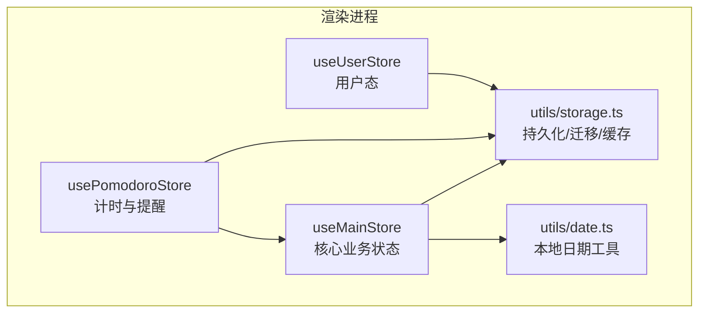
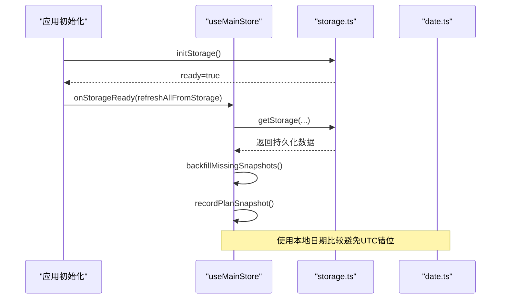
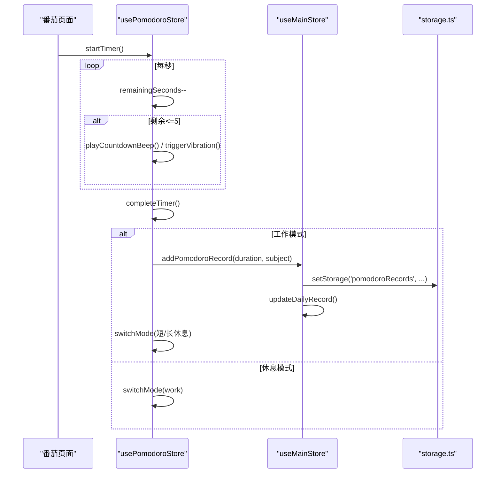
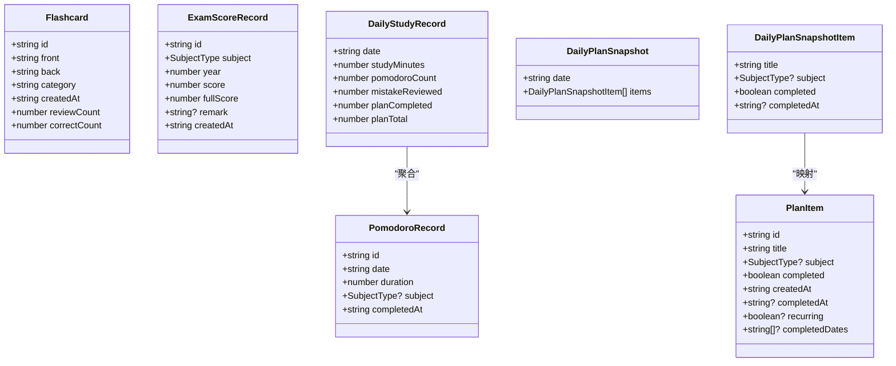
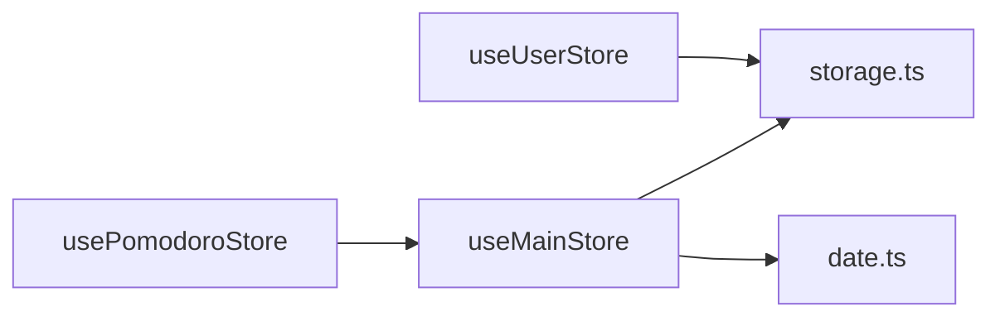

# 全局状态管理

<cite>
**本文引用的文件**
- [src/renderer/src/stores/index.ts](file://src/renderer/src/stores/index.ts)
- [src/renderer/src/stores/pomodoro.ts](file://src/renderer/src/stores/pomodoro.ts)
- [src/renderer/src/stores/user.ts](file://src/renderer/src/stores/user.ts)
- [src/renderer/src/utils/storage.ts](file://src/renderer/src/utils/storage.ts)
- [src/renderer/src/utils/date.ts](file://src/renderer/src/utils/date.ts)
</cite>

## 目录
1. [简介](#简介)
2. [项目结构](#项目结构)
3. [核心组件](#核心组件)
4. [架构总览](#架构总览)
5. [详细组件分析](#详细组件分析)
6. [依赖关系分析](#依赖关系分析)
7. [性能考量](#性能考量)
8. [故障排查指南](#故障排查指南)
9. [结论](#结论)
10. [附录：使用示例与最佳实践](#附录使用示例与最佳实践)

## 简介
本文件围绕 useMainStore 的全局状态管理进行系统化说明，覆盖学习计划、番茄钟记录、背诵卡片、真题分数等核心业务状态；解释数据持久化机制与响应式更新策略；梳理计算属性（倒计时天数、今日学习时长、计划完成统计）的实现逻辑；说明数据迁移与版本兼容处理；并提供使用示例与最佳实践、错误日志记录与性能优化建议。

## 项目结构
本项目采用 Pinia 多 Store 架构：
- useMainStore：承载考研助手的核心业务状态（计划、番茄、卡片、分数、进度、设置、快照、应用使用时长、错误日志）。
- usePomodoroStore：专注计时器状态与提醒交互，依赖 useMainStore 的设置与记录写入。
- useUserStore：用户登录态与账号管理，基于存储层工具实现。
- 存储层 utils/storage.ts：提供 localStorage 实时持久化、缓存、版本迁移、容量清理、用户前缀隔离等能力。
- 日期工具 utils/date.ts：统一本地日期计算，避免 UTC/时区导致的“今天”判断偏差。

图表来源
- [src/renderer/src/stores/index.ts:219-698](file://src/renderer/src/stores/index.ts#L219-L698)
- [src/renderer/src/stores/pomodoro.ts:12-346](file://src/renderer/src/stores/pomodoro.ts#L12-L346)
- [src/renderer/src/stores/user.ts:14-85](file://src/renderer/src/stores/user.ts#L14-L85)
- [src/renderer/src/utils/storage.ts:144-201](file://src/renderer/src/utils/storage.ts#L144-L201)
- [src/renderer/src/utils/date.ts:9-16](file://src/renderer/src/utils/date.ts#L9-L16)

章节来源
- [src/renderer/src/stores/index.ts:219-698](file://src/renderer/src/stores/index.ts#L219-L698)
- [src/renderer/src/stores/pomodoro.ts:12-346](file://src/renderer/src/stores/pomodoro.ts#L12-L346)
- [src/renderer/src/stores/user.ts:14-85](file://src/renderer/src/stores/user.ts#L14-L85)
- [src/renderer/src/utils/storage.ts:144-201](file://src/renderer/src/utils/storage.ts#L144-L201)
- [src/renderer/src/utils/date.ts:9-16](file://src/renderer/src/utils/date.ts#L9-L16)

## 核心组件
- useMainStore
  - 职责：统一管理学习计划、番茄记录、背诵卡片、真题分数、科目进度、每日学习记录、计划快照、番茄设置、应用使用时长、错误日志等。
  - 关键能力：
    - 响应式状态 + computed 派生指标（倒计时、今日学习时长、计划完成统计等）。
    - 变更监听自动持久化（watch 深度监听并调用 setStorage）。
    - 启动时从存储恢复数据，并在存储就绪后刷新。
    - 数据迁移：旧版 408 子科目合并为 cs408（进度与分数）。
    - 计划快照：按天固化计划完成情况，支持历史回溯与异常恢复回填。
    - 错误日志：集中记录、限制条数、可清空。
- usePomodoroStore
  - 职责：计时器运行、模式切换、提醒（声音/通知/标题闪烁/振动）、完成回调（写入主 store 的番茄记录）。
  - 依赖：读取 useMainStore.pomodoroSettings，完成后调用 addPomodoroRecord。
- useUserStore
  - 职责：当前用户、用户列表、登录/登出、注册、删除账号、游客数据迁移。
  - 依赖：storage 层的用户前缀隔离与迁移能力。

章节来源
- [src/renderer/src/stores/index.ts:219-698](file://src/renderer/src/stores/index.ts#L219-L698)
- [src/renderer/src/stores/pomodoro.ts:12-346](file://src/renderer/src/stores/pomodoro.ts#L12-L346)
- [src/renderer/src/stores/user.ts:14-85](file://src/renderer/src/stores/user.ts#L14-L85)

## 架构总览
useMainStore 作为单一事实源，通过 Pinia 暴露响应式状态与方法；所有变更通过 watch 自动落盘；计算属性提供只读派生指标；启动流程确保存储就绪后再加载数据，保证一致性。

图表来源
- [src/renderer/src/stores/index.ts:626-651](file://src/renderer/src/stores/index.ts#L626-L651)
- [src/renderer/src/utils/storage.ts:144-201](file://src/renderer/src/utils/storage.ts#L144-L201)
- [src/renderer/src/utils/date.ts:9-16](file://src/renderer/src/utils/date.ts#L9-L16)

## 详细组件分析

### useMainStore：设计模式与核心功能
- 设计模式
  - 单例 Store：集中式状态容器，方法即副作用入口，避免散落的副作用。
  - 响应式 + 计算属性：状态变更驱动视图更新，computed 提供高效派生值。
  - 观察者持久化：watch 深度监听各数组/对象，变更即写盘，保证崩溃不丢数据。
  - 启动恢复：onStorageReady 后统一刷新，解决异步存储未就绪导致的数据丢失。
- 核心业务状态
  - 学习计划：plans（含循环计划 completedDates），togglePlan 区分普通与循环逻辑。
  - 番茄记录：pomodoroRecords，addPomodoroRecord 追加并同步 dailyRecords。
  - 背诵卡片：flashcards，增删改查。
  - 真题分数：examScores，增删改，自动填充满分与创建时间。
  - 科目进度：subjectProgress，边界钳制 0-100。
  - 每日学习记录：dailyRecords，按日聚合学习时长与番茄数。
  - 计划快照：planSnapshots，按天固化计划完成状态，保留已删除但已完成项。
  - 番茄设置：pomodoroSettings，默认值补齐与持久化。
  - 应用使用时长：appUsageMinutes/appSessionStart，定时累计。
  - 错误日志：errorLogs，限流至 200 条，支持清空。
- 计算属性
  - daysUntilExam：基于 examDate 与当前时间的天数差。
  - todayStudyMinutes/todayStudyHours：当日番茄时长汇总与小时格式化。
  - todayPomodoroCount：当日番茄数量。
  - todayPlanCompleted/todayPlanTotal：当日完成/总数（含循环计划）。
  - subjectStudyMinutes：各科目学习时长汇总。
  - totalStudyHours：累计学习时长（小时）。
  - appUsageHours：应用使用时长（小时）。
- 数据迁移与版本兼容
  - 启动时执行 migrateOldData：将旧 408 子科目进度合并为 cs408；将旧 408 子科目分数按年合并为总分。
  - 存储层 dataMigrations：通用版本迁移框架（DATA_VERSION 控制），在 storage.ts 中实现。
- 计划快照与历史回填
  - recordPlanSnapshot：生成当天计划快照，保留已被清除的已完成项，限制最近 60 天。
  - backfillMissingSnapshots：启动时回填近 7 天缺失的非循环计划快照，防止异常退出导致历史丢失。

章节来源
- [src/renderer/src/stores/index.ts:219-698](file://src/renderer/src/stores/index.ts#L219-L698)
- [src/renderer/src/utils/storage.ts:113-136](file://src/renderer/src/utils/storage.ts#L113-L136)

### usePomodoroStore：计时与提醒
- 状态：当前模式、是否运行、剩余秒数、总秒数、选择科目、完成计数、提醒弹窗状态。
- 计时：setInterval 每秒递减，基于绝对时间差计算，避免漂移。
- 提醒：工作结束/休息结束触发通知、声音、标题闪烁、振动；最后 5 秒滴答提示。
- 与主 Store 协作：工作结束时调用 mainStore.addPomodoroRecord 写入记录并更新每日统计。
- 音频：复用 AudioContext，音量受 pomodoroSettings.soundVolume 控制。

图表来源
- [src/renderer/src/stores/pomodoro.ts:68-162](file://src/renderer/src/stores/pomodoro.ts#L68-L162)
- [src/renderer/src/stores/index.ts:526-590](file://src/renderer/src/stores/index.ts#L526-L590)
- [src/renderer/src/utils/storage.ts:239-246](file://src/renderer/src/utils/storage.ts#L239-L246)

章节来源
- [src/renderer/src/stores/pomodoro.ts:12-346](file://src/renderer/src/stores/pomodoro.ts#L12-L346)
- [src/renderer/src/stores/index.ts:526-590](file://src/renderer/src/stores/index.ts#L526-L590)

### useUserStore：用户态与会话
- 状态：currentUsername、userList、isLoggedIn、displayName。
- 能力：注册、登录（可选迁移游客数据）、登出、删除账号、刷新列表。
- 存储就绪：onStorageReady 刷新当前用户，避免重启后显示不一致。

章节来源
- [src/renderer/src/stores/user.ts:14-85](file://src/renderer/src/stores/user.ts#L14-L85)
- [src/renderer/src/utils/storage.ts:205-223](file://src/renderer/src/utils/storage.ts#L205-L223)

### 数据模型与关系

图表来源
- [src/renderer/src/stores/index.ts:27-137](file://src/renderer/src/stores/index.ts#L27-L137)

## 依赖关系分析
- usePomodoroStore 依赖 useMainStore 的设置与记录写入。
- useMainStore 依赖 storage.ts 的 get/set/onStorageReady 以及 date.ts 的本地日期工具。
- storage.ts 提供跨用户的数据隔离（前缀）与迁移框架。
- 计算属性依赖基础状态，无外部副作用，具备高内聚低耦合特性。

图表来源
- [src/renderer/src/stores/pomodoro.ts:1-13](file://src/renderer/src/stores/pomodoro.ts#L1-L13)
- [src/renderer/src/stores/index.ts:1-5](file://src/renderer/src/stores/index.ts#L1-L5)
- [src/renderer/src/stores/user.ts:1-12](file://src/renderer/src/stores/user.ts#L1-L12)

章节来源
- [src/renderer/src/stores/pomodoro.ts:1-13](file://src/renderer/src/stores/pomodoro.ts#L1-L13)
- [src/renderer/src/stores/index.ts:1-5](file://src/renderer/src/stores/index.ts#L1-L5)
- [src/renderer/src/stores/user.ts:1-12](file://src/renderer/src/stores/user.ts#L1-L12)

## 性能考量
- 计算属性缓存：daysUntilExam、todayStudyMinutes、todayPlanCompleted 等均为 computed，避免重复计算。
- 定时器精度与开销：番茄计时使用 setInterval 每秒递减，基于绝对时间差减少漂移；仅最后 5 秒触发声音/振动，降低频繁 I/O。
- 存储写入：watch 深度监听触发 setStorage，localStorage 写入失败时自动尝试清理旧数据（planSnapshots、pomodoroRecords 优先清理），保障可用性。
- 快照限制：planSnapshots 仅保留最近 60 天，控制存储体积。
- 错误日志限流：errorLogs 最多 200 条，避免无限增长。
- 音频上下文复用：AudioContext 单例复用，减少资源占用。

[本节为通用性能讨论，不直接分析具体代码行]

## 故障排查指南
- 数据丢失或重启后为空
  - 检查 storage.ts 的 initStorage 与 onStorageReady 是否被调用，确认 ready 后刷新数据。
  - 若 localStorage 容量不足，storage.ts 会尝试清理旧数据；可在设置页查看日志或手动清理。
- 计划历史缺失
  - 检查 recordPlanSnapshot 与 backfillMissingSnapshots 是否执行；确认循环计划与普通计划的判定逻辑。
- 番茄记录未生效
  - 确认 usePomodoroStore.completeTimer 调用了 mainStore.addPomodoroRecord；检查 watch(pomodoroRecords) 是否触发持久化。
- 错误日志查看
  - 使用 mainStore.logError 记录错误，store.errorLogs 保存最近 200 条；在设置页可查看与复制堆栈。

章节来源
- [src/renderer/src/stores/index.ts:254-271](file://src/renderer/src/stores/index.ts#L254-L271)
- [src/renderer/src/utils/storage.ts:50-65](file://src/renderer/src/utils/storage.ts#L50-L65)
- [src/renderer/src/stores/pomodoro.ts:112-162](file://src/renderer/src/stores/pomodoro.ts#L112-L162)

## 结论
useMainStore 以集中式、响应式、可观测的方式管理考研助手的核心业务状态，配合 storage.ts 的持久化与迁移能力，实现了稳定可靠的数据生命周期管理。计算属性提供高效的派生指标，计划快照与回填机制保障了历史记录的一致性。usePomodoroStore 与 useUserStore 分别聚焦计时与用户态，形成清晰的分层与职责边界。整体架构具备良好的扩展性与可维护性。

[本节为总结性内容，不直接分析具体代码行]

## 附录：使用示例与最佳实践

- 添加学习计划
  - 调用 mainStore.addPlan(title, subject?, recurring?)，会自动记录当日快照。
  - 循环计划通过 completedDates 标记每日完成状态。
- 切换计划完成
  - 调用 mainStore.togglePlan(id)，普通计划直接切换 completed；循环计划切换 completedDates 中的当天日期。
- 记录番茄
  - 在 usePomodoroStore 完成工作时，自动写入 mainStore.addPomodoroRecord(duration, subject?)，并更新 dailyRecords。
- 管理背诵卡片
  - addFlashcard/updateFlashcard/deleteFlashcard 对 flashcards 进行增删改。
- 记录真题分数
  - addExamScore/updateExamScore/deleteExamScore 管理 examScores，fullScore 自动根据科目配置填充。
- 设置考试日期与名称
  - setExamDate(date, name?) 持久化到存储。
- 更新番茄设置
  - updatePomodoroSettings(settings) 持久化，影响计时时长、通知、声音、标题闪烁等。
- 应用使用时长
  - 定期调用 recordAppUsage() 累计分钟数，appUsageHours 提供小时展示。
- 错误日志
  - logError({type, message, stack}) 记录错误；clearErrorLogs() 清空。
- 最佳实践
  - 始终通过 store 的方法修改状态，避免直接操作 ref，确保 watch 持久化与快照一致。
  - 涉及日期比较一律使用 date.ts 的本地日期工具，避免 UTC 错位。
  - 大量数据写入前考虑批量或节流，避免频繁 localStorage 写入。
  - 定期检查 errorLogs，定位潜在问题。

章节来源
- [src/renderer/src/stores/index.ts:400-698](file://src/renderer/src/stores/index.ts#L400-L698)
- [src/renderer/src/stores/pomodoro.ts:112-162](file://src/renderer/src/stores/pomodoro.ts#L112-L162)
- [src/renderer/src/utils/date.ts:9-16](file://src/renderer/src/utils/date.ts#L9-L16)