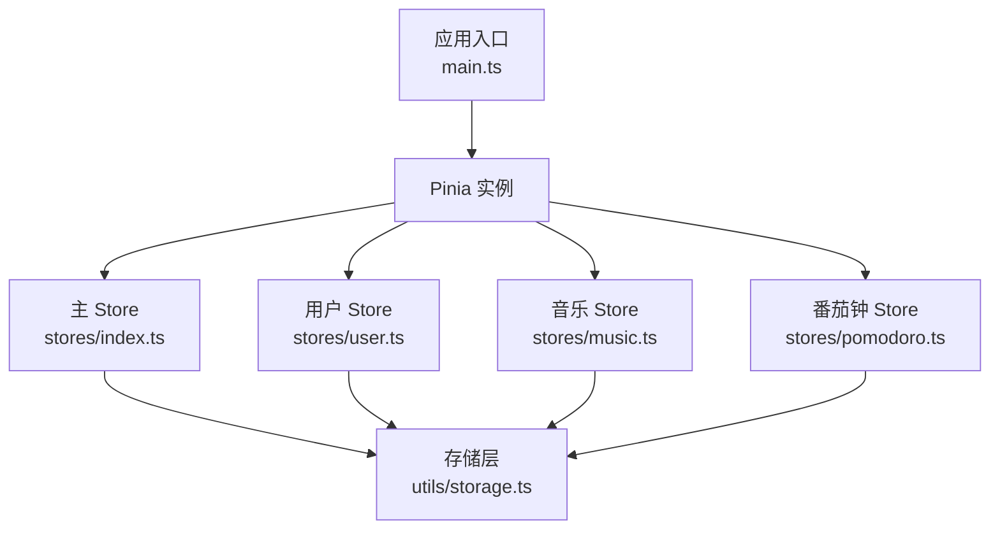
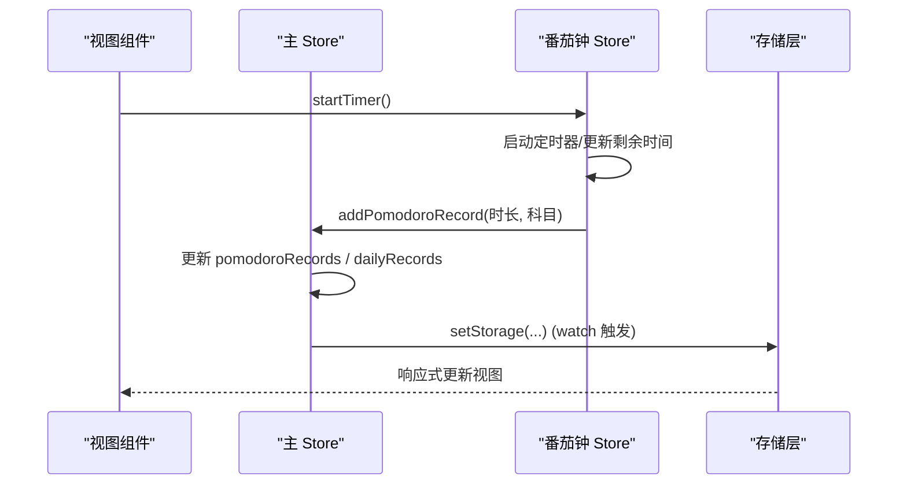
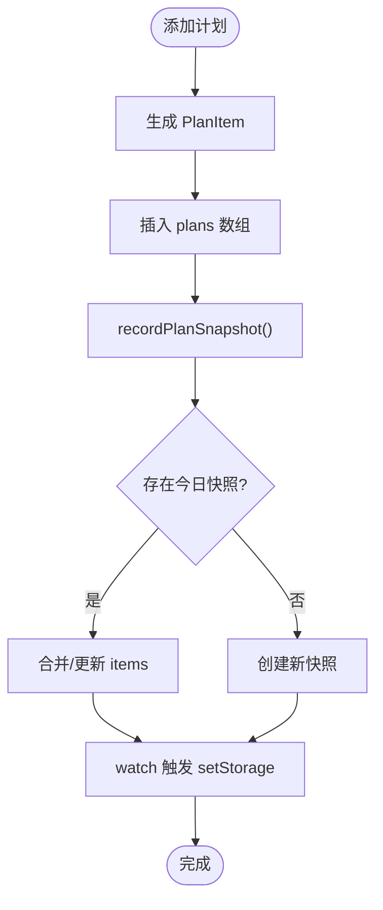
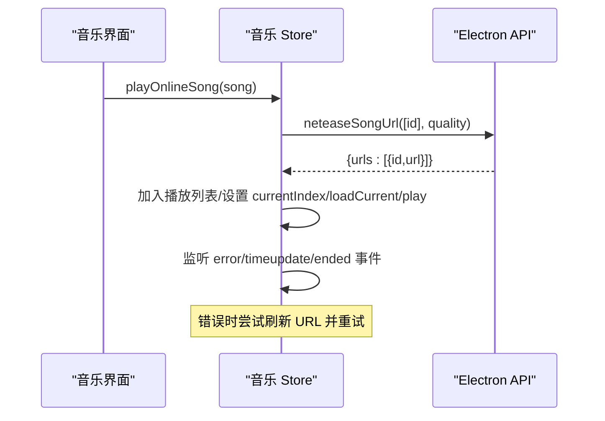
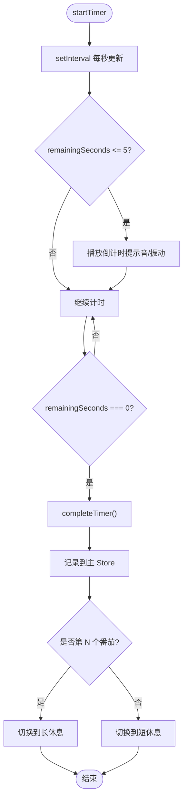
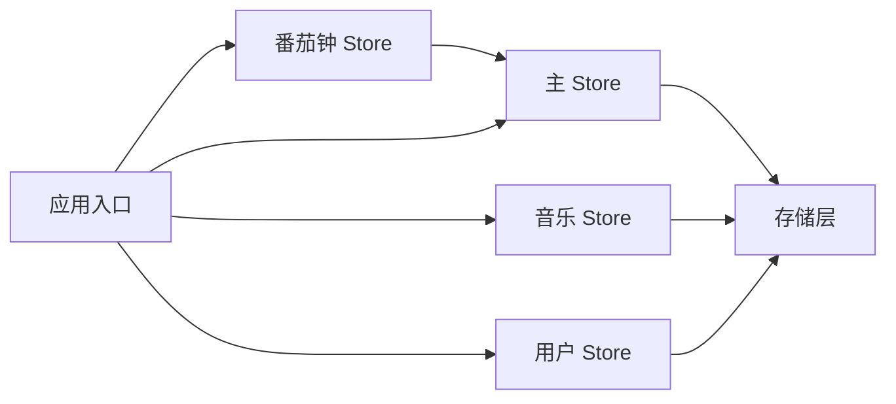

# 状态管理

<cite>
**本文引用的文件**
- [src/renderer/src/stores/index.ts](file://src/renderer/src/stores/index.ts)
- [src/renderer/src/stores/user.ts](file://src/renderer/src/stores/user.ts)
- [src/renderer/src/stores/music.ts](file://src/renderer/src/stores/music.ts)
- [src/renderer/src/stores/pomodoro.ts](file://src/renderer/src/stores/pomodoro.ts)
- [src/renderer/src/utils/storage.ts](file://src/renderer/src/utils/storage.ts)
- [src/renderer/src/main.ts](file://src/renderer/src/main.ts)
- [package.json](file://package.json)
</cite>

## 目录
1. [简介](#简介)
2. [项目结构](#项目结构)
3. [核心组件](#核心组件)
4. [架构总览](#架构总览)
5. [详细组件分析](#详细组件分析)
6. [依赖关系分析](#依赖关系分析)
7. [性能考量](#性能考量)
8. [故障排查指南](#故障排查指南)
9. [结论](#结论)
10. [附录：使用示例与最佳实践](#附录使用示例与最佳实践)

## 简介
本项目基于 Pinia 构建前端状态管理，采用“按领域拆分 Store”的模式，将全局业务数据、用户态、音乐播放器、番茄钟等能力分别封装为独立 Store。通过统一的存储层（localStorage + 内存缓存）实现数据的持久化与跨页面共享；借助 Vue 的响应式机制，视图自动跟随状态更新。文档将系统说明 Store 的职责划分、数据流转、持久化策略、响应式更新、调试监控、跨组件共享模式以及性能优化建议，并给出具体代码路径参考。

## 项目结构
- 入口初始化：在应用启动时创建 Pinia 实例并挂载，同时完成存储层初始化，确保各 Store 首次读取即拿到真实数据。
- Store 组织：位于 src/renderer/src/stores，包含主数据 Store（计划、统计、设置等）、用户 Store、音乐 Store、番茄钟 Store。
- 存储工具：位于 src/renderer/src/utils/storage.ts，提供同步 API、版本迁移、容量清理、就绪回调等能力。
- 视图使用：各页面通过 useXxxStore() 获取 Store 实例，以 computed/ref 的方式订阅状态变化。

图表来源
- [src/renderer/src/main.ts:14-23](file://src/renderer/src/main.ts#L14-L23)
- [src/renderer/src/stores/index.ts:219-699](file://src/renderer/src/stores/index.ts#L219-L699)
- [src/renderer/src/stores/user.ts:14-86](file://src/renderer/src/stores/user.ts#L14-L86)
- [src/renderer/src/stores/music.ts:32-800](file://src/renderer/src/stores/music.ts#L32-L800)
- [src/renderer/src/stores/pomodoro.ts:12-347](file://src/renderer/src/stores/pomodoro.ts#L12-L347)
- [src/renderer/src/utils/storage.ts:140-201](file://src/renderer/src/utils/storage.ts#L140-L201)

章节来源
- [src/renderer/src/main.ts:14-63](file://src/renderer/src/main.ts#L14-L63)
- [package.json:19-32](file://package.json#L19-L32)

## 核心组件
- 主 Store（useMainStore）
  - 职责：统一管理学习计划、背诵卡片、番茄记录、真题成绩、每日学习记录、科目进度、应用使用时长、报错日志、番茄钟设置等核心数据；提供计算属性（如倒计时、今日学习时长、计划完成率等）和持久化监听。
  - 关键特性：
    - 数据从存储层加载，并在存储就绪后刷新，避免 IndexedDB/localStorage 未就绪导致的数据丢失。
    - 使用 watch 深度监听关键数组/对象，自动持久化到存储。
    - 提供快照机制记录每日计划完成情况，支持历史回溯与缺失回填。
    - 内置错误日志收集与清理方法。
- 用户 Store（useUserStore）
  - 职责：维护当前用户名、用户列表、登录/注册/登出/删除账号等操作；存储就绪后刷新当前用户态。
- 音乐 Store（useMusicStore）
  - 职责：管理播放列表、播放状态、音量、歌词、在线搜索与播放、网易云登录与歌单同步等；处理音频事件、错误重试、URL 刷新等。
- 番茄钟 Store（usePomodoroStore）
  - 职责：管理计时器状态、模式切换、提醒通知、声音提示、标题闪烁、振动反馈；完成后记录到主 Store 并自动切换休息模式。

章节来源
- [src/renderer/src/stores/index.ts:219-699](file://src/renderer/src/stores/index.ts#L219-L699)
- [src/renderer/src/stores/user.ts:14-86](file://src/renderer/src/stores/user.ts#L14-L86)
- [src/renderer/src/stores/music.ts:32-800](file://src/renderer/src/stores/music.ts#L32-L800)
- [src/renderer/src/stores/pomodoro.ts:12-347](file://src/renderer/src/stores/pomodoro.ts#L12-L347)

## 架构总览
- 数据流：
  - 组件调用 Store 方法修改状态 → Store 内部更新 ref/computed → 触发 watch 持久化 → 存储层写入 localStorage → 其他组件通过响应式订阅自动更新。
- 持久化：
  - 统一通过 storage.ts 提供的 getStorage/setStorage/onStorageReady 进行读写；启动时 initStorage 载入缓存并执行版本迁移，再触发就绪回调。
- 跨 Store 协作：
  - 番茄钟 Store 依赖主 Store 的设置与记录接口；音乐 Store 与 Electron API 交互；用户 Store 与存储层账户体系交互。
- 错误与健壮性：
  - 全局错误捕获与未处理 Promise rejection 收集到主 Store 的错误日志；存储层具备容量不足时的清理策略与降级。

图表来源
- [src/renderer/src/stores/pomodoro.ts:68-162](file://src/renderer/src/stores/pomodoro.ts#L68-L162)
- [src/renderer/src/stores/index.ts:526-590](file://src/renderer/src/stores/index.ts#L526-L590)
- [src/renderer/src/utils/storage.ts:239-279](file://src/renderer/src/utils/storage.ts#L239-L279)

## 详细组件分析

### 主 Store（useMainStore）
- 数据结构与复杂度
  - 计划列表、番茄记录、真题成绩等为数组类型，增删改查通常为 O(n)。
  - 快照合并逻辑涉及日期过滤与键集合比对，整体复杂度受当日计划数量影响。
- 依赖链
  - 依赖 storage.ts 的 getStorage/setStorage/onStorageReady。
  - 依赖 date.ts 的日期工具用于本地日期比较。
- 优化点
  - 使用 computed 缓存派生数据（如今日学习时长、累计时长）。
  - 快照限制保留最近 60 天，控制存储体积。
  - 启动时回填缺失快照，提升历史完整性。
- 错误处理
  - 提供 logError/clearErrorLogs，集中记录运行时异常。

图表来源
- [src/renderer/src/stores/index.ts:400-502](file://src/renderer/src/stores/index.ts#L400-L502)
- [src/renderer/src/stores/index.ts:615-624](file://src/renderer/src/stores/index.ts#L615-L624)

章节来源
- [src/renderer/src/stores/index.ts:219-699](file://src/renderer/src/stores/index.ts#L219-L699)

### 用户 Store（useUserStore）
- 职责边界
  - 管理当前用户与用户列表，提供注册、登录、登出、删除账号等方法。
  - 存储就绪后刷新当前用户，避免重启掉登录导致的 UI 不一致。
- 数据流
  - 登录成功后设置当前用户名并刷新用户列表；登出清空当前用户。
- 注意事项
  - 密码以哈希形式存储于账户列表；游客数据可迁移至指定用户。

章节来源
- [src/renderer/src/stores/user.ts:14-86](file://src/renderer/src/stores/user.ts#L14-L86)
- [src/renderer/src/utils/storage.ts:325-443](file://src/renderer/src/utils/storage.ts#L325-L443)

### 音乐 Store（useMusicStore）
- 职责边界
  - 管理播放列表、播放状态、音量、歌词解析与高亮、在线搜索与播放、网易云登录与歌单同步。
  - 处理音频事件（ended、error、timeupdate、loadedmetadata），实现自动续播、错误重试、进度同步。
- 复杂逻辑
  - 在线歌曲 URL 过期时自动刷新并重试，最多两次。
  - 批量获取播放地址（每次最多 20 首），避免频繁网络请求。
  - 歌词解析基于正则匹配时间戳与文本，排序后根据播放进度定位当前行。
- 性能考虑
  - 复用 AudioContext 实例减少开销。
  - 对 blob URL 及时释放，防止内存泄漏。

图表来源
- [src/renderer/src/stores/music.ts:456-506](file://src/renderer/src/stores/music.ts#L456-L506)
- [src/renderer/src/stores/music.ts:102-147](file://src/renderer/src/stores/music.ts#L102-L147)
- [src/renderer/src/stores/music.ts:171-252](file://src/renderer/src/stores/music.ts#L171-L252)

章节来源
- [src/renderer/src/stores/music.ts:32-800](file://src/renderer/src/stores/music.ts#L32-L800)

### 番茄钟 Store（usePomodoroStore）
- 职责边界
  - 管理计时器状态、模式切换、提醒通知、声音提示、标题闪烁、振动反馈。
  - 工作模式结束时记录到主 Store，并根据设置切换到短休息或长休息。
- 计时精度与性能
  - 使用绝对时间差计算剩余秒数，避免累积误差。
  - 复用单一 AudioContext 实例，降低资源占用。
- 交互流程
  - 开始计时 → 每秒更新剩余时间 → 最后 5 秒预警 → 完成时弹出遮罩、发送通知、播放音效、切换模式。

图表来源
- [src/renderer/src/stores/pomodoro.ts:68-162](file://src/renderer/src/stores/pomodoro.ts#L68-L162)
- [src/renderer/src/stores/pomodoro.ts:170-181](file://src/renderer/src/stores/pomodoro.ts#L170-L181)

章节来源
- [src/renderer/src/stores/pomodoro.ts:12-347](file://src/renderer/src/stores/pomodoro.ts#L12-L347)

## 依赖关系分析
- Store 间耦合
  - 番茄钟 Store 依赖主 Store 的设置与记录接口，形成松耦合的依赖关系。
  - 音乐 Store 与 Electron API 交互，不直接依赖其他 Store。
  - 用户 Store 与存储层账户体系交互，保持职责单一。
- 外部依赖
  - Pinia 提供状态容器与组合式 API。
  - Vue 提供响应式基础（ref/computed/watch）。
  - dayjs 用于日期计算。
  - Element Plus 作为 UI 框架（非状态相关）。

图表来源
- [src/renderer/src/stores/index.ts:219-699](file://src/renderer/src/stores/index.ts#L219-L699)
- [src/renderer/src/stores/pomodoro.ts:12-347](file://src/renderer/src/stores/pomodoro.ts#L12-L347)
- [src/renderer/src/stores/music.ts:32-800](file://src/renderer/src/stores/music.ts#L32-L800)
- [src/renderer/src/stores/user.ts:14-86](file://src/renderer/src/stores/user.ts#L14-L86)
- [src/renderer/src/utils/storage.ts:140-201](file://src/renderer/src/utils/storage.ts#L140-L201)

章节来源
- [package.json:19-32](file://package.json#L19-L32)

## 性能考量
- 响应式更新
  - 使用 computed 缓存派生数据，减少重复计算。
  - 使用 watch 深度监听关键数据结构，确保持久化及时生效。
- 存储优化
  - 快照仅保留最近 60 天，避免存储膨胀。
  - 存储层具备容量不足时的清理策略，优先清除非关键数据。
- 音频与定时器
  - 复用 AudioContext 实例，减少资源占用。
  - 使用绝对时间差计算剩余秒数，避免累积误差与频繁重算。
- 网络请求
  - 批量获取播放地址（每次最多 20 首），降低网络压力。
  - 在线歌曲 URL 过期时自动刷新并重试，提升稳定性。

[本节为通用指导，无需特定文件引用]

## 故障排查指南
- 全局错误捕获
  - 应用入口配置了 Vue 全局错误处理器与未处理 Promise rejection 监听，所有异常会写入主 Store 的错误日志，便于在设置页查看。
- 存储层问题
  - 若出现数据丢失或不一致，检查存储层初始化流程与就绪回调是否正确触发。
  - 容量不足时会自动清理旧数据，关注清理策略是否符合预期。
- 音乐播放异常
  - 在线歌曲 URL 过期时会尝试刷新并重试，若仍失败，检查 Electron API 返回与网络状态。
  - 注意 blob URL 的释放，避免内存泄漏。
- 番茄钟异常
  - 检查定时器是否被意外清除，确认剩余时间计算逻辑。
  - 通知与声音功能依赖浏览器权限与设置，需确认用户授权。

章节来源
- [src/renderer/src/main.ts:25-56](file://src/renderer/src/main.ts#L25-L56)
- [src/renderer/src/stores/index.ts:254-271](file://src/renderer/src/stores/index.ts#L254-L271)
- [src/renderer/src/utils/storage.ts:93-109](file://src/renderer/src/utils/storage.ts#L93-L109)
- [src/renderer/src/stores/music.ts:102-147](file://src/renderer/src/stores/music.ts#L102-L147)
- [src/renderer/src/stores/pomodoro.ts:170-181](file://src/renderer/src/stores/pomodoro.ts#L170-L181)

## 结论
本项目通过 Pinia 实现了清晰的状态管理架构：按领域拆分 Store，职责明确；通过统一的存储层实现数据持久化与跨页面共享；利用 Vue 响应式机制保证视图与状态同步；结合完善的错误捕获与性能优化策略，提升了应用的稳定性与用户体验。建议在后续开发中继续遵循“单一职责、最小变更、缓存派生数据、合理持久化”的原则，持续优化状态管理与性能表现。

[本节为总结性内容，无需特定文件引用]

## 附录：使用示例与最佳实践
- 在组件中使用 Store
  - 导入对应 Store 并使用其状态与方法，例如在主页面展示统计数据、在番茄钟页面控制计时器等。
  - 通过 computed 映射 Store 状态到局部变量，便于模板渲染与事件处理。
- 跨组件状态共享
  - 使用 Pinia 的全局 Store 实现跨组件共享，避免 props 层层传递。
  - 对于临时或局部状态，建议使用组件内 ref/reactive，减少全局污染。
- 状态持久化
  - 通过 storage.ts 提供的 getStorage/setStorage 进行读写，确保数据在应用重启后不丢失。
  - 使用 onStorageReady 确保存储层就绪后再进行关键操作。
- 响应式更新策略
  - 使用 ref/computed 定义状态与派生数据，避免手动更新 DOM。
  - 使用 watch 监听复杂数据结构的变化，触发必要的副作用（如持久化）。
- 调试与监控
  - 启用全局错误捕获，查看设置页中的报错日志。
  - 使用浏览器开发者工具的 Network 面板监控网络请求，Performance 面板分析性能瓶颈。
- 最佳实践
  - 保持 Store 职责单一，避免过度耦合。
  - 合理使用 computed 缓存派生数据，减少重复计算。
  - 对大数组进行分页或限制显示数量，提升渲染性能。
  - 对网络请求进行去抖与节流，避免频繁请求。

章节来源
- [src/renderer/src/views/Dashboard.vue:1-200](file://src/renderer/src/views/Dashboard.vue#L1-L200)
- [src/renderer/src/views/Pomodoro.vue:169-256](file://src/renderer/src/views/Pomodoro.vue#L169-L256)
- [src/renderer/src/stores/index.ts:615-624](file://src/renderer/src/stores/index.ts#L615-L624)
- [src/renderer/src/utils/storage.ts:197-201](file://src/renderer/src/utils/storage.ts#L197-L201)