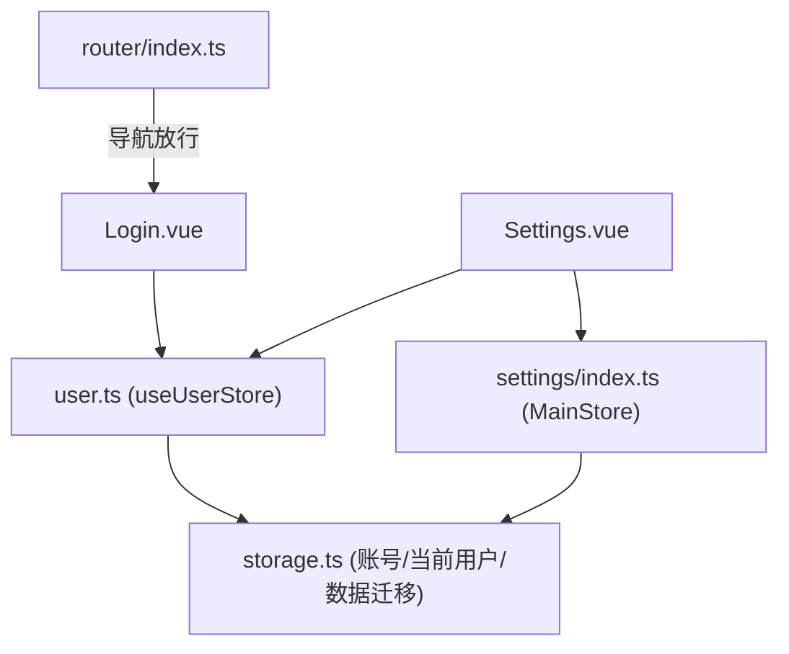
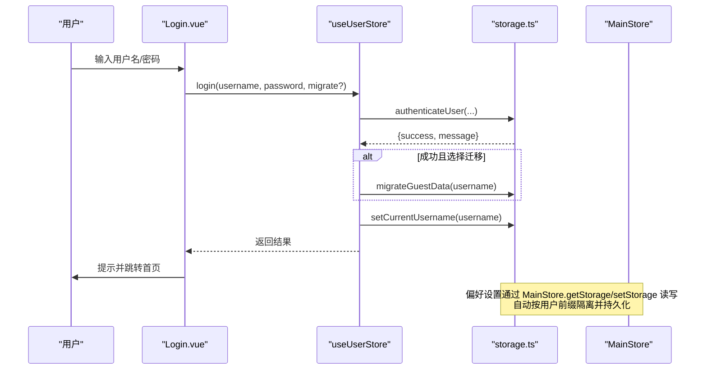
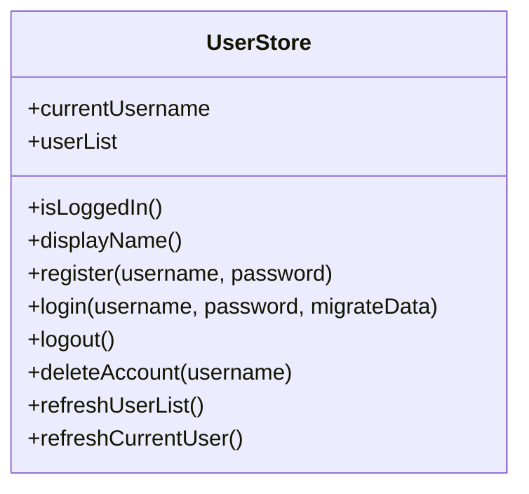
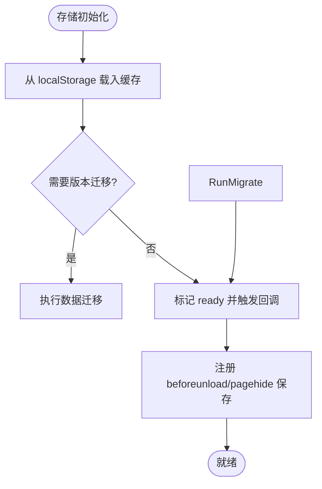
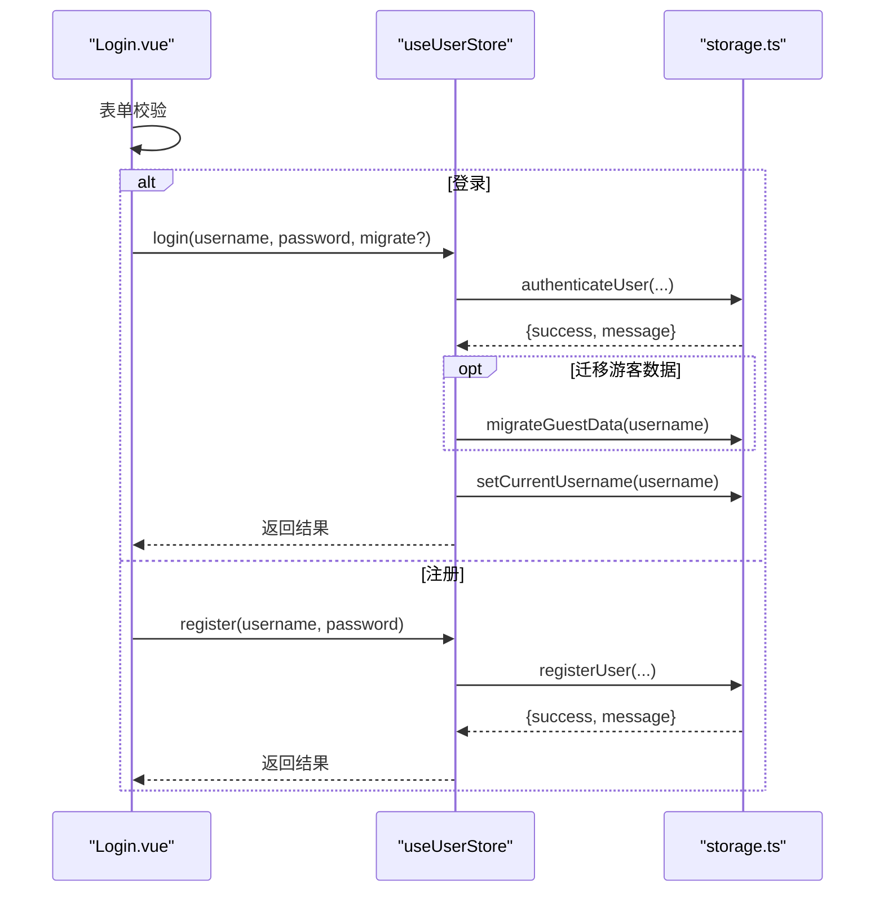
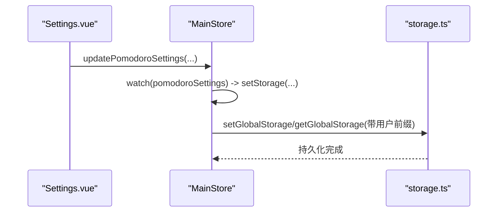
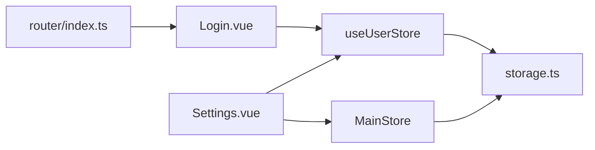

# 用户状态管理

<cite>
**本文引用的文件**
- [src/renderer/src/stores/user.ts](file://src/renderer/src/stores/user.ts)
- [src/renderer/src/utils/storage.ts](file://src/renderer/src/utils/storage.ts)
- [src/renderer/src/views/Login.vue](file://src/renderer/src/views/Login.vue)
- [src/renderer/src/router/index.ts](file://src/renderer/src/router/index.ts)
- [src/renderer/src/stores/index.ts](file://src/renderer/src/stores/index.ts)
- [src/renderer/src/views/Settings.vue](file://src/renderer/src/views/Settings.vue)
</cite>

## 目录
1. [简介](#简介)
2. [项目结构](#项目结构)
3. [核心组件](#核心组件)
4. [架构总览](#架构总览)
5. [详细组件分析](#详细组件分析)
6. [依赖关系分析](#依赖关系分析)
7. [性能与容量策略](#性能与容量策略)
8. [故障排查指南](#故障排查指南)
9. [结论](#结论)
10. [附录：使用示例与集成指南](#附录使用示例与集成指南)

## 简介
本文件系统性说明“考研助手”前端应用中的用户状态管理方案，重点覆盖：
- UserStore 的用户认证状态管理与会话维护机制
- 用户登录流程、令牌（本地账号）管理与自动登录恢复
- 用户偏好设置的状态存储与同步策略
- 跨组件的用户信息共享机制
- 安全考虑与最佳实践建议

该实现基于 Pinia Store + Vue 组合式 API，持久化层采用 localStorage 内存缓存双通道，确保重启不丢失数据。

## 项目结构
与用户状态相关的关键位置如下：
- 用户状态 Store：stores/user.ts
- 存储与账号能力：utils/storage.ts
- 登录页面：views/Login.vue
- 路由守卫：router/index.ts（已移除强制登录守卫）
- 全局主 Store（含偏好设置等）：stores/index.ts
- 设置页（数据管理、主题、番茄钟等）：views/Settings.vue

图表来源
- [src/renderer/src/views/Login.vue:134-166](file://src/renderer/src/views/Login.vue#L134-L166)
- [src/renderer/src/stores/user.ts:14-85](file://src/renderer/src/stores/user.ts#L14-L85)
- [src/renderer/src/utils/storage.ts:203-442](file://src/renderer/src/utils/storage.ts#L203-L442)
- [src/renderer/src/stores/index.ts:219-699](file://src/renderer/src/stores/index.ts#L219-L699)
- [src/renderer/src/router/index.ts:112-121](file://src/renderer/src/router/index.ts#L112-L121)
- [src/renderer/src/views/Settings.vue:334-771](file://src/renderer/src/views/Settings.vue#L334-L771)

章节来源
- [src/renderer/src/stores/user.ts:14-85](file://src/renderer/src/stores/user.ts#L14-L85)
- [src/renderer/src/utils/storage.ts:1-442](file://src/renderer/src/utils/storage.ts#L1-L442)
- [src/renderer/src/views/Login.vue:82-171](file://src/renderer/src/views/Login.vue#L82-L171)
- [src/renderer/src/router/index.ts:112-121](file://src/renderer/src/router/index.ts#L112-L121)
- [src/renderer/src/stores/index.ts:219-699](file://src/renderer/src/stores/index.ts#L219-L699)
- [src/renderer/src/views/Settings.vue:334-771](file://src/renderer/src/views/Settings.vue#L334-L771)

## 核心组件
- useUserStore：封装当前用户名、用户列表、登录/注册/登出/删除账号等操作，并在存储就绪后刷新当前用户，保证重启后状态正确。
- storage.ts：提供本地存储抽象、当前用户标识、账号注册/校验、游客数据迁移、导出/导入、容量不足清理等能力。
- Login.vue：登录/注册 UI，调用 userStore 完成认证并可选迁移游客数据。
- MainStore（stores/index.ts）：承载应用级偏好设置（如考试日期、番茄钟设置等），并通过 storage.ts 的 getStorage/setStorage 实现按用户隔离的持久化。
- Settings.vue：提供数据管理、主题、番茄钟等设置入口，支持导出/导入/清除数据，以及退出登录和删除账号。

章节来源
- [src/renderer/src/stores/user.ts:14-85](file://src/renderer/src/stores/user.ts#L14-L85)
- [src/renderer/src/utils/storage.ts:14-442](file://src/renderer/src/utils/storage.ts#L14-L442)
- [src/renderer/src/views/Login.vue:82-171](file://src/renderer/src/views/Login.vue#L82-L171)
- [src/renderer/src/stores/index.ts:219-699](file://src/renderer/src/stores/index.ts#L219-L699)
- [src/renderer/src/views/Settings.vue:334-771](file://src/renderer/src/views/Settings.vue#L334-L771)

## 架构总览
用户状态管理的整体流程如下：
- 启动时初始化存储层，从 localStorage 加载缓存并执行版本迁移，触发“存储就绪”回调。
- UserStore 在存储就绪后刷新当前用户名和用户列表，避免首次读取为空导致显示异常。
- 登录成功后，将当前用户名写入存储，并可选择将游客数据迁移到该账号下。
- 所有用户数据通过带前缀的 key 进行隔离（游客 vs 具体用户）。
- 偏好设置由 MainStore 统一管理，并通过 storage.ts 的 getStorage/setStorage 读写，天然具备用户隔离与持久化。

图表来源
- [src/renderer/src/views/Login.vue:134-166](file://src/renderer/src/views/Login.vue#L134-L166)
- [src/renderer/src/stores/user.ts:44-54](file://src/renderer/src/stores/user.ts#L44-L54)
- [src/renderer/src/utils/storage.ts:387-424](file://src/renderer/src/utils/storage.ts#L387-L424)
- [src/renderer/src/stores/index.ts:239-279](file://src/renderer/src/stores/index.ts#L239-L279)

## 详细组件分析

### 用户状态 Store（useUserStore）
- 状态
  - currentUsername：当前用户名（空表示游客）
  - userList：已注册用户列表
  - isLoggedIn：是否已登录
  - displayName：显示名称（未登录时为“游客”）
- 生命周期
  - 初始化时从 storage 读取当前用户和用户列表
  - 订阅 onStorageReady，在存储层就绪后刷新当前用户，修复重启掉登录导致的显示问题
- 方法
  - register：注册新用户，成功后刷新用户列表
  - login：验证凭据，可选迁移游客数据，设置当前用户并更新 ref
  - logout：清空当前用户，回到游客模式
  - deleteAccount：删除指定用户及其数据，若为当前用户则清空当前用户
  - refreshUserList / refreshCurrentUser：刷新用户列表或当前用户

图表来源
- [src/renderer/src/stores/user.ts:14-85](file://src/renderer/src/stores/user.ts#L14-L85)

章节来源
- [src/renderer/src/stores/user.ts:14-85](file://src/renderer/src/stores/user.ts#L14-L85)

### 存储与账号能力（storage.ts）
- 当前用户与会话
  - getCurrentUsername / setCurrentUsername：读写当前用户标识
  - 以 kaoyan_current_user 键持久化，空值即游客模式
- 数据隔离
  - 游客数据键前缀：kaoyan_helper_
  - 用户数据键前缀：kaoyan_user_{username}_
  - 通用 getStorage/setStorage/removeStorage 自动拼接前缀，实现用户隔离
- 账号管理
  - isUserRegistered / getUserList / registerUser / authenticateUser / deleteUserAccount
  - 简单哈希存储密码（仅用于本地演示用途）
- 数据迁移
  - migrateGuestData：将游客数据合并/迁移至目标用户
- 容量与降级
  - 容量不足时清理历史快照等非关键数据
  - beforeunload/pagehide 双保险 flushAll，确保退出保存
- 版本化迁移
  - DATA_VERSION + dataMigrations 注册表，启动时执行迁移

图表来源
- [src/renderer/src/utils/storage.ts:140-188](file://src/renderer/src/utils/storage.ts#L140-L188)
- [src/renderer/src/utils/storage.ts:190-201](file://src/renderer/src/utils/storage.ts#L190-L201)

章节来源
- [src/renderer/src/utils/storage.ts:14-442](file://src/renderer/src/utils/storage.ts#L14-L442)

### 登录流程（Login.vue）
- 表单校验：用户名长度、密码长度、确认密码一致性
- 登录模式：调用 userStore.login，成功后提示并跳转到首页
- 注册模式：调用 userStore.register，成功后切换回登录模式
- 游客模式：调用 userStore.logout 并进入首页
- 数据迁移：登录时可勾选“导入游客模式下的数据”，调用 migrateGuestData

图表来源
- [src/renderer/src/views/Login.vue:134-166](file://src/renderer/src/views/Login.vue#L134-L166)
- [src/renderer/src/stores/user.ts:44-54](file://src/renderer/src/stores/user.ts#L44-L54)
- [src/renderer/src/utils/storage.ts:362-400](file://src/renderer/src/utils/storage.ts#L362-L400)

章节来源
- [src/renderer/src/views/Login.vue:82-171](file://src/renderer/src/views/Login.vue#L82-L171)
- [src/renderer/src/stores/user.ts:44-54](file://src/renderer/src/stores/user.ts#L44-L54)
- [src/renderer/src/utils/storage.ts:362-400](file://src/renderer/src/utils/storage.ts#L362-L400)

### 偏好设置的状态存储与同步（MainStore）
- 偏好项包括：考试日期/名称、番茄钟设置、主题、应用使用时长、错误日志等
- 通过 getStorage/setStorage 读写，自动按当前用户前缀隔离
- 使用 watch 监听变化并持久化，确保修改即时落盘
- 存储就绪后统一刷新全部数据，避免 IndexedDB/localStorage 尚未就绪导致的默认值覆盖

图表来源
- [src/renderer/src/stores/index.ts:283-624](file://src/renderer/src/stores/index.ts#L283-L624)
- [src/renderer/src/views/Settings.vue:591-625](file://src/renderer/src/views/Settings.vue#L591-L625)

章节来源
- [src/renderer/src/stores/index.ts:219-699](file://src/renderer/src/stores/index.ts#L219-L699)
- [src/renderer/src/views/Settings.vue:591-625](file://src/renderer/src/views/Settings.vue#L591-L625)

### 跨组件的用户信息共享机制
- 通过 Pinia 的 useUserStore 在任何组件中获取当前用户名、是否登录、显示名等
- 路由层不再强制认证，但组件可依据 isLoggedIn/displayName 控制展示逻辑
- 设置页支持退出登录与删除账号，操作后刷新或跳转

章节来源
- [src/renderer/src/stores/user.ts:27-83](file://src/renderer/src/stores/user.ts#L27-L83)
- [src/renderer/src/router/index.ts:112-121](file://src/renderer/src/router/index.ts#L112-L121)
- [src/renderer/src/views/Settings.vue:744-771](file://src/renderer/src/views/Settings.vue#L744-L771)

## 依赖关系分析
- 组件依赖
  - Login.vue 依赖 useUserStore 与 storage.ts 的认证/迁移能力
  - Settings.vue 依赖 useUserStore（退出/删除账号）、MainStore（偏好设置）、storage.ts（数据导入/导出/清除）
- Store 依赖
  - useUserStore 依赖 storage.ts 的账号与会话能力
  - MainStore 依赖 storage.ts 的 getStorage/setStorage 实现用户隔离与持久化
- 路由
  - router/index.ts 移除了强制登录守卫，允许直接访问主页；登录功能作为可选入口

图表来源
- [src/renderer/src/views/Login.vue:82-171](file://src/renderer/src/views/Login.vue#L82-L171)
- [src/renderer/src/views/Settings.vue:334-771](file://src/renderer/src/views/Settings.vue#L334-L771)
- [src/renderer/src/stores/user.ts:14-85](file://src/renderer/src/stores/user.ts#L14-L85)
- [src/renderer/src/stores/index.ts:219-699](file://src/renderer/src/stores/index.ts#L219-L699)
- [src/renderer/src/utils/storage.ts:14-442](file://src/renderer/src/utils/storage.ts#L14-L442)
- [src/renderer/src/router/index.ts:112-121](file://src/renderer/src/router/index.ts#L112-L121)

章节来源
- [src/renderer/src/stores/user.ts:14-85](file://src/renderer/src/stores/user.ts#L14-L85)
- [src/renderer/src/stores/index.ts:219-699](file://src/renderer/src/stores/index.ts#L219-L699)
- [src/renderer/src/utils/storage.ts:14-442](file://src/renderer/src/utils/storage.ts#L14-L442)
- [src/renderer/src/views/Login.vue:82-171](file://src/renderer/src/views/Login.vue#L82-L171)
- [src/renderer/src/views/Settings.vue:334-771](file://src/renderer/src/views/Settings.vue#L334-L771)
- [src/renderer/src/router/index.ts:112-121](file://src/renderer/src/router/index.ts#L112-L121)

## 性能与容量策略
- 实时持久化：每次写操作同时更新内存缓存与 localStorage，避免数据丢失
- 容量不足降级：当 localStorage 写入失败时，尝试清理历史快照等非关键数据后重试
- 退出双保险：beforeunload 与 pagehide 事件均触发 flushAll，确保最终落盘
- 启动优化：存储层初始化完成后触发就绪回调，各 Store 按需刷新，减少重复读取

章节来源
- [src/renderer/src/utils/storage.ts:50-109](file://src/renderer/src/utils/storage.ts#L50-L109)
- [src/renderer/src/utils/storage.ts:140-188](file://src/renderer/src/utils/storage.ts#L140-L188)
- [src/renderer/src/utils/storage.ts:190-201](file://src/renderer/src/utils/storage.ts#L190-L201)

## 故障排查指南
- 重启后登录态丢失
  - 检查 storage 初始化与 onStorageReady 回调是否执行
  - 确认 setCurrentUsername 是否正确写入当前用户键
  - 参考路径：[storage.ts:140-188](file://src/renderer/src/utils/storage.ts#L140-L188)、[user.ts:18-25](file://src/renderer/src/stores/user.ts#L18-L25)
- 登录后未迁移游客数据
  - 确认登录时 migrateGuestData 参数是否为真
  - 检查迁移逻辑是否覆盖了数组类型数据的合并
  - 参考路径：[storage.ts:402-424](file://src/renderer/src/utils/storage.ts#L402-L424)
- 容量不足导致数据写入失败
  - 观察 cleanupOldData 是否生效，必要时手动清理历史快照
  - 参考路径：[storage.ts:93-109](file://src/renderer/src/utils/storage.ts#L93-L109)
- 偏好设置未持久化
  - 检查 MainStore 的 watch 是否绑定 setStorage
  - 参考路径：[stores/index.ts:615-624](file://src/renderer/src/stores/index.ts#L615-L624)

章节来源
- [src/renderer/src/utils/storage.ts:93-109](file://src/renderer/src/utils/storage.ts#L93-L109)
- [src/renderer/src/utils/storage.ts:140-188](file://src/renderer/src/utils/storage.ts#L140-L188)
- [src/renderer/src/stores/user.ts:18-25](file://src/renderer/src/stores/user.ts#L18-L25)
- [src/renderer/src/stores/index.ts:615-624](file://src/renderer/src/stores/index.ts#L615-L624)

## 结论
该用户状态管理方案通过 Pinia Store 与本地存储工具的组合，实现了：
- 可靠的本地账号与会话管理（用户名、密码哈希、当前用户标识）
- 游客数据向正式账号的安全迁移
- 用户隔离的偏好设置与数据持久化
- 启动时的状态恢复与容量不足的降级策略
建议在后续迭代中引入更安全的密码哈希算法与可选的远程同步能力，以提升安全性与多设备一致性。

## 附录：使用示例与集成指南
- 在任意组件中使用用户状态
  - 获取当前用户名、是否登录、显示名
  - 调用 login/register/logout/deleteAccount 等方法
  - 参考路径：[user.ts:14-85](file://src/renderer/src/stores/user.ts#L14-L85)
- 在设置页集成数据管理
  - 导出/导入/清除当前用户数据
  - 退出登录或删除账号
  - 参考路径：[Settings.vue:645-771](file://src/renderer/src/views/Settings.vue#L645-L771)
- 偏好设置读写
  - 使用 MainStore 提供的 getStorage/setStorage 读写偏好
  - 通过 watch 自动持久化
  - 参考路径：[stores/index.ts:239-279](file://src/renderer/src/stores/index.ts#L239-L279)、[stores/index.ts:615-624](file://src/renderer/src/stores/index.ts#L615-L624)

章节来源
- [src/renderer/src/stores/user.ts:14-85](file://src/renderer/src/stores/user.ts#L14-L85)
- [src/renderer/src/views/Settings.vue:645-771](file://src/renderer/src/views/Settings.vue#L645-L771)
- [src/renderer/src/stores/index.ts:239-279](file://src/renderer/src/stores/index.ts#L239-L279)
- [src/renderer/src/stores/index.ts:615-624](file://src/renderer/src/stores/index.ts#L615-L624)